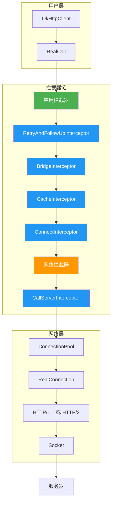
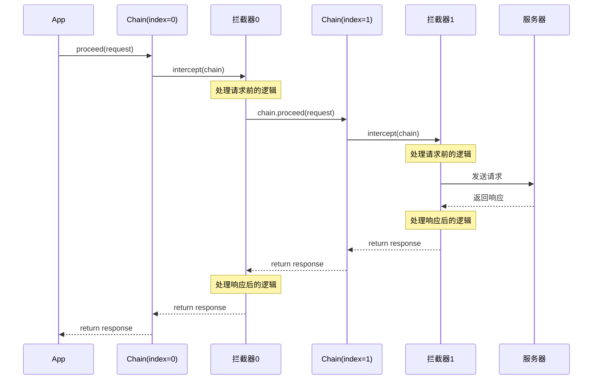
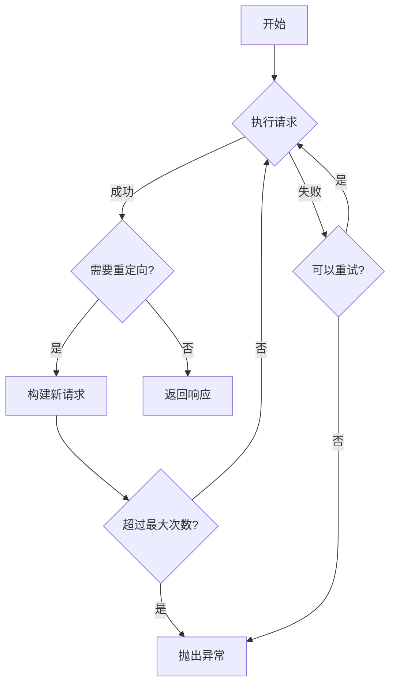
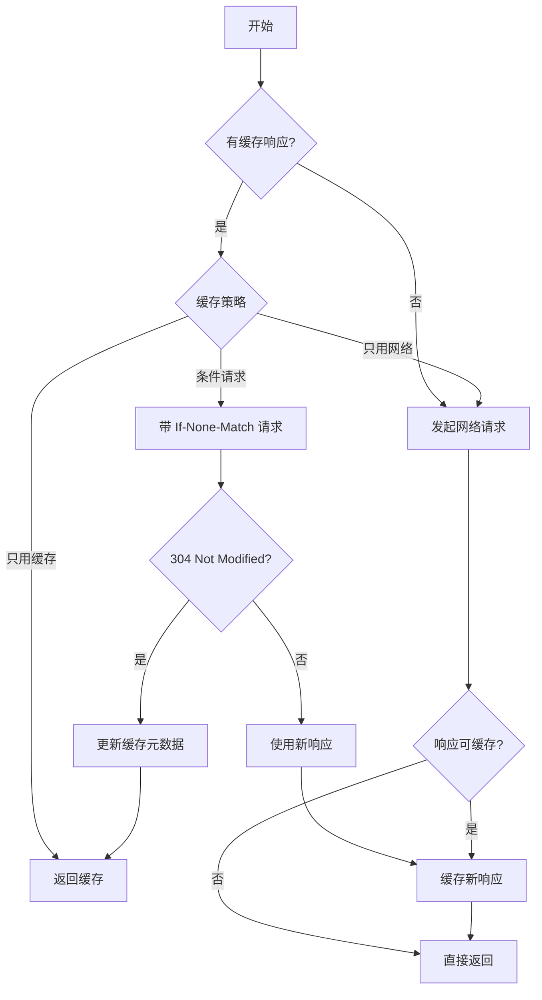
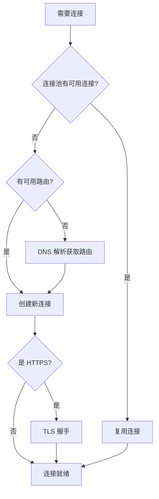
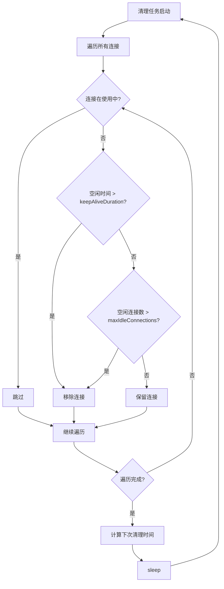
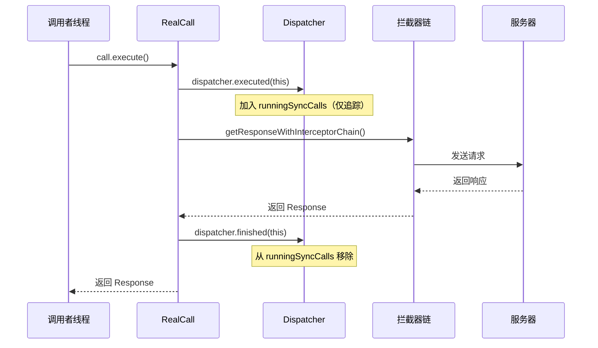
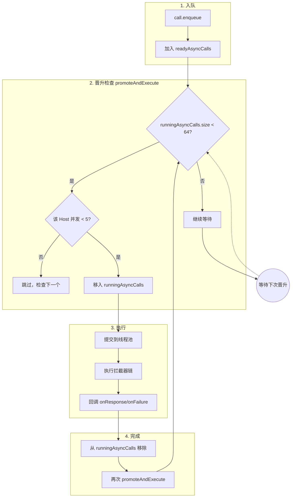
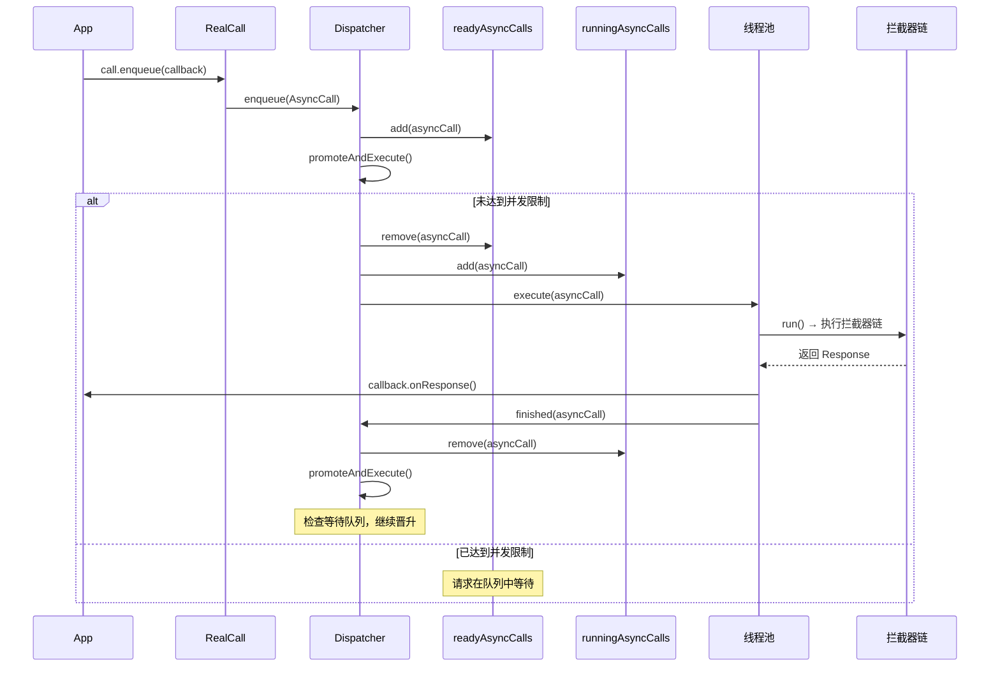

# OkHttp 源码篇

> 让你理解设计本质 —— 责任链模式、五大拦截器、连接管理深度解析

## 一、整体架构

### 1.1 一句话总结

**OkHttp 的核心就是一条"拦截器链"**：请求从头到尾经过一系列拦截器，每个拦截器各司其职，最终到达服务器；响应再原路返回，每个拦截器都有机会处理。

### 1.2 架构图



### 1.3 设计哲学

OkHttp 的设计体现了几个核心思想：

| 设计思想 | 体现 |
|---------|------|
| **单一职责** | 每个拦截器只做一件事 |
| **开闭原则** | 通过拦截器扩展，不修改核心代码 |
| **责任链模式** | 请求依次经过每个拦截器处理 |
| **享元模式** | 连接池复用 Connection 对象 |
| **建造者模式** | OkHttpClient.Builder、Request.Builder |

## 二、责任链模式

### 2.1 什么是责任链？

**生活例子**：你去政府办事，要盖很多章。每个窗口负责一个章，你从第一个窗口开始，一个个走完。如果某个窗口发现问题，可能直接打回，不用走完全程。

**在 OkHttp 中**：请求就是那个"办事的人"，拦截器就是"窗口"，每个拦截器负责处理特定的事情。

### 2.2 核心实现：RealInterceptorChain

```kotlin
// 精简版源码，展示核心逻辑
class RealInterceptorChain(
    private val interceptors: List<Interceptor>,
    private val index: Int,  // 当前执行到第几个拦截器
    private val request: Request
) : Interceptor.Chain {

    override fun request(): Request = request

    override fun proceed(request: Request): Response {
        // 1. 检查是否还有下一个拦截器
        check(index < interceptors.size) { "没有更多拦截器了" }

        // 2. 创建下一个 Chain，index + 1
        val next = RealInterceptorChain(interceptors, index + 1, request)

        // 3. 获取当前拦截器
        val interceptor = interceptors[index]

        // 4. 执行当前拦截器，并传入下一个 Chain
        // 拦截器内部会调用 chain.proceed() 继续链条
        return interceptor.intercept(next)
    }
}
```

### 2.3 流程图



### 2.4 设计亮点

1. **递归调用**：通过 `chain.proceed()` 实现递归，优雅地串联所有拦截器
2. **双向处理**：每个拦截器都能处理"请求前"和"响应后"两个时机
3. **可中断**：任意拦截器可以不调用 `proceed()`，直接返回响应（如缓存命中）
4. **可修改**：拦截器可以修改 Request 或 Response 后再传递

## 三、五大内置拦截器

### 3.1 拦截器顺序

```kotlin
// RealCall.getResponseWithInterceptorChain() 源码
val interceptors = mutableListOf<Interceptor>()

// 1. 应用拦截器（用户添加的）
interceptors.addAll(client.interceptors)

// 2. 五大内置拦截器
interceptors.add(RetryAndFollowUpInterceptor(client))
interceptors.add(BridgeInterceptor(client.cookieJar))
interceptors.add(CacheInterceptor(client.cache))
interceptors.add(ConnectInterceptor)
interceptors.addAll(client.networkInterceptors)  // 网络拦截器（用户添加的）
interceptors.add(CallServerInterceptor(forWebSocket))
```

### 3.2 RetryAndFollowUpInterceptor（重试与重定向）

**一句话**：失败了重试，重定向了跟上。



**关键源码**：

```kotlin
class RetryAndFollowUpInterceptor(private val client: OkHttpClient) : Interceptor {
    
    override fun intercept(chain: Chain): Response {
        var request = chain.request()
        var followUpCount = 0

        while (true) {
            // 创建 Exchange（表示一次 HTTP 请求/响应交换）
            val exchange = ...
            
            var response: Response? = null
            try {
                // 执行下一个拦截器
                response = chain.proceed(request)
            } catch (e: RouteException) {
                // 路由异常，尝试恢复
                if (!recover(e.lastConnectException, call, request, requestSendStarted = false)) {
                    throw e.firstConnectException
                }
                continue  // 重试
            } catch (e: IOException) {
                // IO 异常，尝试恢复
                if (!recover(e, call, request, requestSendStarted = true)) {
                    throw e
                }
                continue  // 重试
            }

            // 检查是否需要跟随重定向
            val followUp = followUpRequest(response, exchange)
            if (followUp == null) {
                return response  // 不需要重定向，返回响应
            }

            // 检查重定向次数限制
            if (++followUpCount > MAX_FOLLOW_UPS) {  // MAX_FOLLOW_UPS = 20
                throw ProtocolException("Too many follow-up requests: $followUpCount")
            }

            request = followUp  // 用重定向后的请求继续
            response.body?.closeQuietly()
        }
    }
}
```

**设计亮点**：
- 用 `while(true)` 实现重试循环，优雅处理多次重定向
- `recover()` 方法判断是否可以恢复（连接未使用过、是幂等请求等）
- 最多 20 次重定向，防止无限循环

### 3.3 BridgeInterceptor（桥接）

**一句话**：把"应用层请求"翻译成"网络层请求"，响应反过来翻译。

**做的事情**：

| 方向 | 处理 |
|-----|------|
| 请求 → | 添加 Content-Type、Content-Length、Host、Connection、Accept-Encoding、Cookie、User-Agent |
| ← 响应 | 解析 Set-Cookie 保存、GZIP 解压 |

```kotlin
class BridgeInterceptor(private val cookieJar: CookieJar) : Interceptor {
    
    override fun intercept(chain: Chain): Response {
        val userRequest = chain.request()
        val requestBuilder = userRequest.newBuilder()

        // 1. 添加 Content-Type 和 Content-Length
        val body = userRequest.body
        if (body != null) {
            requestBuilder.header("Content-Type", body.contentType()?.toString() ?: "")
            requestBuilder.header("Content-Length", body.contentLength().toString())
        }

        // 2. 添加 Host
        if (userRequest.header("Host") == null) {
            requestBuilder.header("Host", userRequest.url.toHostHeader())
        }

        // 3. 添加 Connection: Keep-Alive（连接复用）
        if (userRequest.header("Connection") == null) {
            requestBuilder.header("Connection", "Keep-Alive")
        }

        // 4. 添加 Accept-Encoding: gzip（自动解压）
        var transparentGzip = false
        if (userRequest.header("Accept-Encoding") == null) {
            transparentGzip = true
            requestBuilder.header("Accept-Encoding", "gzip")
        }

        // 5. 添加 Cookie
        val cookies = cookieJar.loadForRequest(userRequest.url)
        if (cookies.isNotEmpty()) {
            requestBuilder.header("Cookie", cookieHeader(cookies))
        }

        // 执行下一个拦截器
        val networkResponse = chain.proceed(requestBuilder.build())

        // 6. 保存响应中的 Cookie
        cookieJar.receiveHeaders(userRequest.url, networkResponse.headers)

        // 7. 如果响应是 GZIP 压缩的，自动解压
        if (transparentGzip && "gzip".equals(networkResponse.header("Content-Encoding"), true)) {
            val gzipSource = GzipSource(networkResponse.body!!.source())
            // ... 构建解压后的 ResponseBody
        }

        return networkResponse
    }
}
```

**设计亮点**：
- 用户不需要手动设置这些 Header，框架自动处理
- GZIP 解压对用户透明，`response.body?.string()` 直接得到解压后的内容

### 3.4 CacheInterceptor（缓存）

**一句话**：能用缓存就用缓存，省时省流量。



**关键源码**：

```kotlin
class CacheInterceptor(private val cache: Cache?) : Interceptor {

    override fun intercept(chain: Chain): Response {
        // 1. 尝试从缓存获取
        val cacheCandidate = cache?.get(chain.request())

        // 2. 根据请求和缓存计算缓存策略
        val strategy = CacheStrategy.Factory(System.currentTimeMillis(), chain.request(), cacheCandidate)
            .compute()
        val networkRequest = strategy.networkRequest  // null 表示不用网络
        val cacheResponse = strategy.cacheResponse    // null 表示不用缓存

        // 3. 情况一：不用网络也不用缓存 → 返回 504
        if (networkRequest == null && cacheResponse == null) {
            return Response.Builder()
                .code(504)
                .message("Unsatisfiable Request")
                .build()
        }

        // 4. 情况二：只用缓存，不发网络请求
        if (networkRequest == null) {
            return cacheResponse!!
        }

        // 5. 情况三：需要网络请求
        var networkResponse: Response? = null
        try {
            networkResponse = chain.proceed(networkRequest)
        } finally {
            if (networkResponse == null) {
                cacheCandidate?.body?.closeQuietly()
            }
        }

        // 6. 如果返回 304，使用缓存响应
        if (networkResponse.code == HTTP_NOT_MODIFIED) {
            val response = cacheResponse!!.newBuilder()
                .headers(combine(cacheResponse.headers, networkResponse.headers))
                .build()
            networkResponse.body?.closeQuietly()
            return response
        }

        // 7. 缓存新响应
        if (cache != null && networkResponse.isSuccessful) {
            cache.put(networkResponse)
        }

        return networkResponse
    }
}
```

**缓存策略（CacheStrategy）**：

| 场景 | networkRequest | cacheResponse | 结果 |
|-----|----------------|---------------|------|
| 强制网络 | 有 | null | 走网络 |
| 强制缓存 | null | 有 | 用缓存 |
| 缓存未过期 | null | 有 | 用缓存 |
| 缓存已过期 | 有（带条件头） | 有 | 条件请求 |
| 无缓存 | 有 | null | 走网络 |

### 3.5 ConnectInterceptor（连接）

**一句话**：找一个可用的连接（复用或新建）。

```kotlin
object ConnectInterceptor : Interceptor {

    override fun intercept(chain: Chain): Response {
        val realChain = chain as RealInterceptorChain
        
        // 核心：获取或创建连接
        val exchange = realChain.call.initExchange(realChain)
        
        // 把连接传给下一个拦截器
        return realChain.proceed(realChain.request, exchange)
    }
}
```

**连接获取流程**：



### 3.6 CallServerInterceptor（请求服务器）

**一句话**：真正发请求、收响应的拦截器。

```kotlin
class CallServerInterceptor(private val forWebSocket: Boolean) : Interceptor {

    override fun intercept(chain: Chain): Response {
        val exchange = chain.exchange!!
        val request = chain.request

        // 1. 写入请求头
        exchange.writeRequestHeaders(request)

        // 2. 写入请求体（如果有）
        if (request.body != null) {
            val requestBody = request.body!!
            val bufferedSink = exchange.createRequestBody(request).buffer()
            requestBody.writeTo(bufferedSink)
            bufferedSink.close()
        }

        // 3. 完成请求发送
        exchange.finishRequest()

        // 4. 读取响应头
        var response = exchange.readResponseHeaders(expectContinue = false)

        // 5. 读取响应体
        response = response.newBuilder()
            .body(exchange.openResponseBody(response))
            .build()

        return response
    }
}
```

## 四、连接管理（ConnectionPool）

### 4.1 连接复用原理

**为什么要复用？**
建立一次 TCP 连接要经过：DNS 解析 → TCP 三次握手 → TLS 握手（HTTPS），耗时 100-500ms。复用连接可以跳过这些步骤。

**什么情况可以复用？**
- 相同的 Host、Port、协议
- 连接未被使用（空闲状态）
- 连接未超时

### 4.2 ConnectionPool 结构

```kotlin
class ConnectionPool(
    maxIdleConnections: Int = 5,       // 最大空闲连接数
    keepAliveDuration: Long = 5,       // 空闲存活时间
    timeUnit: TimeUnit = TimeUnit.MINUTES
) {
    // 存储所有连接
    private val connections = ConcurrentLinkedQueue<RealConnection>()
    
    // 清理任务
    private val cleanupRunnable = Runnable { ... }
    
    // 获取可用连接
    fun get(address: Address, routes: List<Route>?): RealConnection? {
        for (connection in connections) {
            if (connection.isEligible(address, routes)) {
                return connection
            }
        }
        return null
    }
    
    // 放入新连接
    fun put(connection: RealConnection) {
        connections.add(connection)
        // 触发清理任务
        cleanupRunnable.run()
    }
    
    // 清理过期连接
    fun cleanup(now: Long): Long {
        // 找到空闲时间最长的连接
        // 如果超过 keepAliveDuration，移除
        // 如果空闲连接数超过 maxIdleConnections，移除最老的
        // 返回下次清理的等待时间
    }
}
```

### 4.3 清理策略



### 4.4 设计亮点

1. **懒清理**：不是定时清理，而是每次 put 或 get 时触发检查
2. **引用计数**：通过 `StreamAllocation` 的引用计数判断连接是否在使用
3. **最大连接数控制**：先清理超时的，再清理超量的
4. **HTTP/2 多路复用**：一个 HTTP/2 连接可以同时处理多个请求

## 五、Dispatcher（分发器）

### 5.1 作用

**一句话**：管理请求的执行，同步请求追踪、异步请求调度。

### 5.2 三个核心队列

Dispatcher 内部维护了 **三个队列**，分别管理不同类型的请求：

```kotlin
class Dispatcher {
    // ========== 核心参数 ==========
    var maxRequests = 64           // 最大并发异步请求数
    var maxRequestsPerHost = 5     // 同一 Host 最大并发数
    
    // ========== 三个队列 ==========
    
    /** 等待执行的异步请求（无界队列！） */
    private val readyAsyncCalls = ArrayDeque<AsyncCall>()
    
    /** 正在执行的异步请求 */
    private val runningAsyncCalls = ArrayDeque<AsyncCall>()
    
    /** 正在执行的同步请求（仅追踪，不调度） */
    private val runningSyncCalls = ArrayDeque<RealCall>()
    
    // ========== 线程池 ==========
    private var executorService: ExecutorService? = null
}
```

**三个队列的作用**：

| 队列 | 请求类型 | 作用 | 是否受并发限制 |
|-----|---------|------|--------------|
| `readyAsyncCalls` | 异步 | 排队等候的请求，等待空闲槽位 | 是 |
| `runningAsyncCalls` | 异步 | 正在线程池中执行的请求 | 是 |
| `runningSyncCalls` | 同步 | 正在阻塞调用者线程的请求 | **否** |

> ⚠️ **注意**：`readyAsyncCalls` 是**无界队列**！如果大量请求涌入且服务器响应慢，可能导致 OOM。

### 5.3 同步请求流程

**同步请求很简单**：不经过调度，直接在调用者线程执行。



**关键源码**：

```kotlin
// RealCall.kt
override fun execute(): Response {
    // 1. 标记为已执行（防止重复调用）
    check(executed.compareAndSet(false, true)) { "Already executed" }
    
    try {
        // 2. 加入同步队列（仅用于追踪，如取消、统计）
        client.dispatcher.executed(this)
        
        // 3. 直接在当前线程执行拦截器链
        return getResponseWithInterceptorChain()
    } finally {
        // 4. 从同步队列移除
        client.dispatcher.finished(this)
    }
}

// Dispatcher.kt
internal fun executed(call: RealCall) {
    synchronized(this) {
        runningSyncCalls.add(call)  // 只是追踪，不做调度
    }
}

internal fun finished(call: RealCall) {
    synchronized(this) {
        runningSyncCalls.remove(call)
    }
    // 同步请求完成后，也会触发异步队列的晋升检查
    promoteAndExecute()
}
```

**为什么同步请求不受 maxRequests 限制？**

因为同步请求阻塞的是**调用者自己的线程**，不是 Dispatcher 的线程池。如果你在主线程调用 `execute()`，那是你自己的问题（会 ANR），Dispatcher 管不着也不应该管。

### 5.4 异步请求流程

**异步请求才是 Dispatcher 的主战场**，涉及队列调度和并发控制。



**详细时序图**：



### 5.5 关键源码详解

```kotlin
class Dispatcher {
    
    // ========== 异步请求入队 ==========
    internal fun enqueue(call: AsyncCall) {
        synchronized(this) {
            // 1. 无条件加入等待队列（这里不检查限制！）
            readyAsyncCalls.add(call)
            
            // 2. 复用同 Host 的计数器（优化：避免重复创建）
            if (!call.call.forWebSocket) {
                val existingCall = findExistingCallWithHost(call.host)
                if (existingCall != null) {
                    call.reuseCallsPerHostFrom(existingCall)
                }
            }
        }
        // 3. 尝试晋升执行
        promoteAndExecute()
    }

    // ========== 核心：晋升并执行 ==========
    private fun promoteAndExecute(): Boolean {
        val executableCalls = mutableListOf<AsyncCall>()
        val isRunning: Boolean
        
        synchronized(this) {
            val iterator = readyAsyncCalls.iterator()
            while (iterator.hasNext()) {
                val asyncCall = iterator.next()

                // 检查点1：总并发数是否达到上限
                if (runningAsyncCalls.size >= maxRequests) break
                
                // 检查点2：该 Host 的并发数是否达到上限
                // 注意：这里用 continue 而不是 break，因为其他 Host 的请求可能还能执行
                if (asyncCall.callsPerHost.get() >= maxRequestsPerHost) continue

                // 晋升：从等待队列移入执行队列
                iterator.remove()
                asyncCall.callsPerHost.incrementAndGet()
                executableCalls.add(asyncCall)
                runningAsyncCalls.add(asyncCall)
            }
            isRunning = runningAsyncCalls.size > 0 || runningSyncCalls.size > 0
        }

        // 在 synchronized 块外执行，避免长时间持锁
        for (call in executableCalls) {
            call.executeOn(executorService)
        }

        return isRunning
    }

    // ========== 异步请求完成 ==========
    internal fun finished(call: AsyncCall) {
        synchronized(this) {
            runningAsyncCalls.remove(call)
            call.callsPerHost.decrementAndGet()
        }
        // 关键：完成一个，立刻检查能否晋升下一个
        promoteAndExecute()
    }
}
```

### 5.6 超出限制后的处理

当请求超出限制时，会发生什么？让我们看两种情况：

**情况一：总并发数达到 64**

```
当前状态：runningAsyncCalls.size = 64
新请求：call.enqueue(callback)

处理流程：
1. 新请求加入 readyAsyncCalls ✓
2. promoteAndExecute() 检查：64 >= 64，break！
3. 新请求留在 readyAsyncCalls 等待
4. 等某个请求完成后，触发 promoteAndExecute()
5. 新请求被晋升执行
```

**情况二：某 Host 并发数达到 5**

```
当前状态：api.example.com 有 5 个请求在执行
新请求：请求 api.example.com

处理流程：
1. 新请求加入 readyAsyncCalls ✓
2. promoteAndExecute() 检查：该 Host 并发 >= 5，continue！
3. 但会继续检查队列中其他 Host 的请求
4. 其他 Host 的请求可能被晋升执行
5. 等 api.example.com 的请求完成后，新请求才能晋升
```

**图示对比**：

```
场景：总并发达到 64
┌─────────────────────────────────────┐
│ runningAsyncCalls (64个)            │
│ [host-a] [host-a] [host-b] ... ×64 │
└─────────────────────────────────────┘
                ↓ break（全部等待）
┌─────────────────────────────────────┐
│ readyAsyncCalls                     │
│ [host-c] [host-d] [host-e] ...     │  ← 全部等待
└─────────────────────────────────────┘

场景：api.example.com 达到 5
┌─────────────────────────────────────┐
│ runningAsyncCalls (10个)            │
│ [api.example.com] × 5               │
│ [other-host] × 5                    │
└─────────────────────────────────────┘
                ↓ continue（跳过该 Host）
┌─────────────────────────────────────┐
│ readyAsyncCalls                     │
│ [api.example.com] ← 等待            │
│ [another-api.com] ← 可以晋升！       │
└─────────────────────────────────────┘
```

### 5.7 线程池配置

```kotlin
val executorService: ExecutorService
    get() {
        if (executorServiceOrNull == null) {
            executorServiceOrNull = ThreadPoolExecutor(
                0,                      // corePoolSize：核心线程数为 0
                Int.MAX_VALUE,          // maximumPoolSize：最大线程数无限
                60L, TimeUnit.SECONDS,  // keepAliveTime：空闲 60 秒后回收
                SynchronousQueue(),     // workQueue：不排队，直接创建新线程
                threadFactory("OkHttp Dispatcher", false)
            )
        }
        return executorServiceOrNull!!
    }
```

**为什么这样配置？**

| 参数 | 值 | 原因 |
|-----|---|------|
| corePoolSize | 0 | 空闲时不保留线程，节省资源 |
| maximumPoolSize | MAX_VALUE | 理论上无限，但受 maxRequests 限制 |
| workQueue | SynchronousQueue | 不在线程池排队，由 Dispatcher 管理队列 |

> **关键洞察**：OkHttp 的排队逻辑在 `readyAsyncCalls`，而不是线程池的 `workQueue`。这样 Dispatcher 可以更灵活地控制调度策略（比如单 Host 限制）。

### 5.8 设计亮点总结

| 设计 | 实现 | 好处 |
|-----|------|------|
| **三队列架构** | ready + running + sync | 分离调度和追踪职责 |
| **双重限制** | maxRequests + maxRequestsPerHost | 保护服务器，避免单点压力 |
| **自动晋升** | finished() → promoteAndExecute() | 完成一个立刻顶上，充分利用并发 |
| **Host 级公平** | continue 而非 break | 一个 Host 满了不影响其他 Host |
| **锁分离** | synchronized 块外执行 | 减少锁持有时间 |

### 5.9 潜在问题

**1. readyAsyncCalls 无界队列可能导致 OOM**

```kotlin
// 危险场景：大量请求涌入，服务器响应慢
for (i in 1..100000) {
    client.newCall(request).enqueue(callback)  // 全部堆积在 readyAsyncCalls
}
```

**解决方案**：
- 应用层限流（如使用 Semaphore）
- 监控 `dispatcher.queuedCallsCount()` 并告警
- 设置请求超时，避免长时间占用

**2. 同步请求无限制可能耗尽线程**

```kotlin
// 危险场景：在多线程中大量同步请求
executor.submit { client.newCall(request).execute() }  // × 1000
```

**解决方案**：
- 尽量使用异步请求
- 控制并发线程数

## 六、HTTP/2 支持

### 6.1 HTTP/2 vs HTTP/1.1

| 特性 | HTTP/1.1 | HTTP/2 |
|-----|----------|--------|
| 连接复用 | 一问一答 | **多路复用** |
| 头部压缩 | 无 | HPACK |
| 服务器推送 | 无 | 支持 |
| 协议格式 | 文本 | 二进制帧 |

### 6.2 多路复用原理

```
HTTP/1.1（排队）          HTTP/2（并行）
═══════════════          ═══════════════
连接1: 请求A → 响应A      连接1: 请求A ─┐
连接2: 请求B → 响应B              请求B ─┼→ 复用同一连接
连接3: 请求C → 响应C              请求C ─┘
```

**在 OkHttp 中**：
- 自动协商 HTTP/2（ALPN）
- 一个 `Http2Connection` 管理多个 `Http2Stream`
- 每个 `Http2Stream` 对应一个请求

## 七、延伸思考

### 7.1 如果让你设计 OkHttp，你会怎么做？

**核心挑战**：
1. 如何支持多种 HTTP 版本（1.0、1.1、2）？
2. 如何实现连接复用且线程安全？
3. 如何让用户方便地扩展功能？

**OkHttp 的解法**：
1. **策略模式**：不同 HTTP 版本用不同的 Codec（Http1ExchangeCodec、Http2ExchangeCodec）
2. **连接池 + 引用计数**：ConnectionPool 管理连接生命周期
3. **拦截器模式**：责任链 + 开闭原则，用户通过拦截器扩展

### 7.2 OkHttp 源码中值得借鉴的编程技巧

| 技巧 | 应用场景 | 在 OkHttp 中的例子 |
|-----|---------|-------------------|
| **建造者模式** | 复杂对象构建 | OkHttpClient.Builder、Request.Builder |
| **责任链模式** | 可扩展的处理流程 | Interceptor.Chain |
| **享元模式** | 资源复用 | ConnectionPool |
| **不可变对象** | 线程安全 | Request、Response |
| **DSL 设计** | API 易用性 | Kotlin 扩展函数 |

## 八、面试题自测

### 专家级题目（检验是否理解设计本质）

**Q1: 请描述 OkHttp 的责任链模式是如何实现的？**

<details>
<summary>查看答案</summary>

**结论**：通过 `Interceptor.Chain.proceed()` 实现递归调用。

**核心实现**：
1. `RealInterceptorChain` 持有拦截器列表和当前索引
2. `proceed()` 方法创建新 Chain（索引+1），调用当前拦截器的 `intercept()`
3. 每个拦截器可以在调用 `chain.proceed()` 前后添加逻辑
4. 最后一个拦截器（CallServerInterceptor）不调用 `proceed()`，而是真正发起请求

**优点**：
- 单一职责：每个拦截器只做一件事
- 开闭原则：添加新功能只需添加拦截器
- 双向处理：请求和响应都能处理

</details>

**Q2: OkHttp 是如何实现连接复用的？复用的条件是什么？**

<details>
<summary>查看答案</summary>

**结论**：通过 ConnectionPool 管理空闲连接，按 Address 匹配复用。

**复用条件**：
1. 相同的 Host、Port
2. 相同的代理配置
3. 相同的 SSL 配置（HTTPS）
4. 连接处于空闲状态
5. 连接未超时（默认 5 分钟）

**实现机制**：
```kotlin
// ConnectionPool 的 get 方法
fun get(address: Address, routes: List<Route>?): RealConnection? {
    for (connection in connections) {
        if (connection.isEligible(address, routes)) {
            return connection
        }
    }
    return null
}
```

**HTTP/2 特殊性**：
HTTP/2 连接支持多路复用，一个连接可以同时处理多个请求，不需要等待空闲。

</details>

**Q3: OkHttp 的五大拦截器各自负责什么？执行顺序是怎样的？**

<details>
<summary>查看答案</summary>

**执行顺序**（从外到内）：

```
应用拦截器 → RetryAndFollowUp → Bridge → Cache → Connect → 网络拦截器 → CallServer
```

**各拦截器职责**：

| 拦截器 | 职责 |
|-------|------|
| RetryAndFollowUpInterceptor | 重试失败请求、跟随重定向 |
| BridgeInterceptor | 添加必要 Header、处理 Cookie、GZIP 解压 |
| CacheInterceptor | 缓存读写、条件请求 |
| ConnectInterceptor | 获取或创建连接 |
| CallServerInterceptor | 真正发送请求、接收响应 |

**记忆口诀**：重桥缓连发（重试、桥接、缓存、连接、发送）

</details>

**Q4: Dispatcher 是如何控制并发的？为什么要限制单 Host 并发数？**

<details>
<summary>查看答案</summary>

**并发控制机制**：
- 总并发数限制：`maxRequests = 64`
- 单 Host 并发数限制：`maxRequestsPerHost = 5`

**实现方式**：
1. 新请求先加入 `readyAsyncCalls` 等待队列
2. `promoteAndExecute()` 检查限制，符合条件的移入 `runningAsyncCalls`
3. 请求完成后调用 `finished()`，触发下一轮晋升

**为什么限制单 Host**：
1. **服务器保护**：防止单个服务器被大量请求打爆
2. **公平调度**：多个 Host 的请求能公平执行
3. **符合 HTTP 规范**：RFC 2616 建议单 Host 最多 2 个连接（现代浏览器放宽到 6）

</details>

**Q5: OkHttp 支持 HTTP/2，多路复用是怎么实现的？和 HTTP/1.1 的连接复用有什么区别？**

<details>
<summary>查看答案</summary>

**HTTP/1.1 连接复用**：
- 一个连接同一时间只能处理一个请求
- 必须等响应返回后才能发下一个请求（队头阻塞）
- 复用 = 用完放回池子，下次再取出来用

**HTTP/2 多路复用**：
- 一个连接可以同时处理多个请求
- 请求和响应分解成帧，交错传输
- 不存在队头阻塞

**OkHttp 实现**：
- `Http2Connection` 管理一个 HTTP/2 连接
- 每个请求对应一个 `Http2Stream`（通过 streamId 区分）
- 帧的发送和接收由 `Http2Writer` 和 `Http2Reader` 处理
- `ConnectionPool` 对 HTTP/2 连接的判断：即使连接在使用中，只要流数量未达上限，仍然可以复用

</details>

---

_至此，OkHttp 三篇文档完成。回到 [README](README.md) 查看完整知识体系。_
