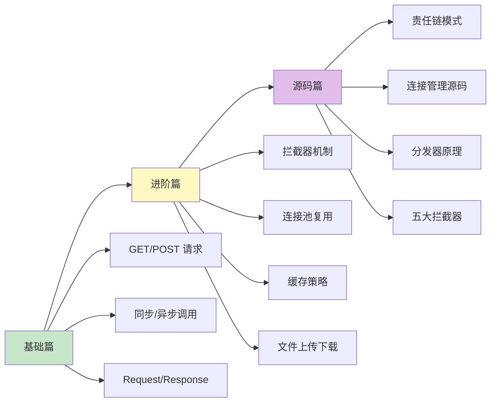

# OkHttp 知识体系

> 从入门到专家的完整学习路径 —— Android 网络请求框架之王

## 为什么要学 OkHttp？

在 Android 开发中，网络请求是**几乎每个 App 都需要的核心能力**：
- 不处理好连接复用，流量和电量消耗惊人
- 不考虑重试和超时，用户体验直线下降
- 不理解 HTTP 协议，很多问题无从下手

OkHttp 就是来解决这些问题的，它是 Square 公司开源的网络请求框架，也是 **Android 4.4 之后 HttpURLConnection 的底层实现**。可以说，**学 Android 网络，必学 OkHttp**。

## 一句话理解 OkHttp

OkHttp 就像一个**专业的快递员**：
- 📦 **会打包**：帮你把请求封装成标准的 HTTP 格式
- 🔄 **会复用**：同一个地址的多个包裹，能走同一趟车（连接复用）
- 🔁 **会重试**：送不到会自动换条路再试
- 💾 **会缓存**：同样的东西问过一次，下次直接给你答案
- 🔗 **会排队**：很多请求来了，按规矩一个个处理

## 文档结构

```
OkHttp/
├── README.md          # 本文件（目录索引）
├── 1-基础篇.md         # 初/中级开发者
├── 2-进阶篇.md         # 高级开发者
└── 3-源码篇.md         # 专家级
```

## 学习路线



## 各篇内容概览

### [1-基础篇](1-基础篇.md)

**适合人群**：Android 初学者、准备初/中级面试

| 知识点 | 内容 |
|-------|------|
| 技术演进 | 从 HttpURLConnection 到 OkHttp 的进化史 |
| 核心组件 | OkHttpClient、Request、Response、Call |
| GET 请求 | 同步和异步的两种姿势 |
| POST 请求 | 表单、JSON、文件等不同类型 |
| 请求配置 | Header、超时、URL 参数 |
| 横向对比 | OkHttp vs HttpURLConnection vs Volley vs Retrofit |

### [2-进阶篇](2-进阶篇.md)

**适合人群**：有 OkHttp 使用经验、准备高级面试

| 知识点 | 内容 |
|-------|------|
| 拦截器机制 | 应用拦截器 vs 网络拦截器 |
| 连接池 | 为什么能提升性能？怎么配置？ |
| 缓存策略 | Cache-Control 和 OkHttp 缓存 |
| 文件操作 | 上传/下载进度监听 |
| Cookie 管理 | 自动携带和持久化 |
| HTTPS | 证书校验和信任配置 |
| 边界认知 | OkHttp 不适合的场景 |

### [3-源码篇](3-源码篇.md)

**适合人群**：准备 Android 专家级面试、想深入理解原理

| 知识点 | 内容 |
|-------|------|
| 整体架构 | OkHttp 的分层设计思想 |
| 责任链模式 | 拦截器链的精妙设计 |
| Dispatcher | 请求分发与并发控制 |
| ConnectionPool | 连接复用如何实现？ |
| 五大拦截器 | 每个拦截器做了什么？ |
| HTTP/2 支持 | 多路复用原理 |
| 面试高频 | 5 道专家级面试题 |

## 面试覆盖程度

| 面试级别 | 需要掌握 |
|---------|---------|
| 初级 Android | 基础篇 |
| 中级 Android | 基础篇 + 进阶篇部分 |
| 高级 Android | 基础篇 + 进阶篇 |
| **Android 专家** | 基础篇 + 进阶篇 + 源码篇 |

## 快速查阅

### 常见问题速查

| 问题 | 解决方案 | 所在文档 |
|-----|---------|---------|
| 网络请求无响应 | 检查网络权限和 URL | 基础篇 |
| 连接超时 | 配置 connectTimeout | 基础篇 |
| 请求被取消 | 检查 Call 是否被 cancel | 基础篇 |
| 想统一添加 Header | 使用拦截器 | 进阶篇 |
| 需要打印日志 | 添加 HttpLoggingInterceptor | 进阶篇 |
| 上传大文件 OOM | 使用流式上传 | 进阶篇 |
| 证书校验失败 | 配置 sslSocketFactory | 进阶篇 |

### 核心代码速查

| 功能 | 代码 | 所在文档 |
|-----|------|---------|
| 创建客户端 | `OkHttpClient()` | 基础篇 |
| 同步 GET | `client.newCall(request).execute()` | 基础篇 |
| 异步 GET | `client.newCall(request).enqueue(callback)` | 基础篇 |
| POST JSON | `RequestBody.create(mediaType, json)` | 基础篇 |
| 添加拦截器 | `.addInterceptor(interceptor)` | 进阶篇 |
| 配置超时 | `.connectTimeout(10, TimeUnit.SECONDS)` | 基础篇 |
| 配置缓存 | `.cache(Cache(dir, size))` | 进阶篇 |

## OkHttp vs Retrofit

很多人搞不清 OkHttp 和 Retrofit 的关系：

| 对比项 | OkHttp | Retrofit |
|-------|--------|----------|
| 定位 | 底层 HTTP 客户端 | 上层 RESTful 封装 |
| 关系 | 基础库 | **基于 OkHttp 构建** |
| 使用方式 | 手动构建 Request | 注解定义接口 |
| 适用场景 | 需要精细控制 | 快速开发 RESTful API |

**简单说**：Retrofit 是 OkHttp 的豪华版外壳，底层还是用 OkHttp 干活。

## 版本信息

本文档基于 **OkHttp 4.x** 版本编写，这是目前最新的稳定版本（Kotlin 重写版）。

```kotlin
// build.gradle.kts
dependencies {
    implementation("com.squareup.okhttp3:okhttp:4.12.0")
    // 可选：日志拦截器
    implementation("com.squareup.okhttp3:logging-interceptor:4.12.0")
}
```

别忘了添加网络权限：

```xml
<!-- AndroidManifest.xml -->
<uses-permission android:name="android.permission.INTERNET" />
```

---
_本文档将持续更新_
