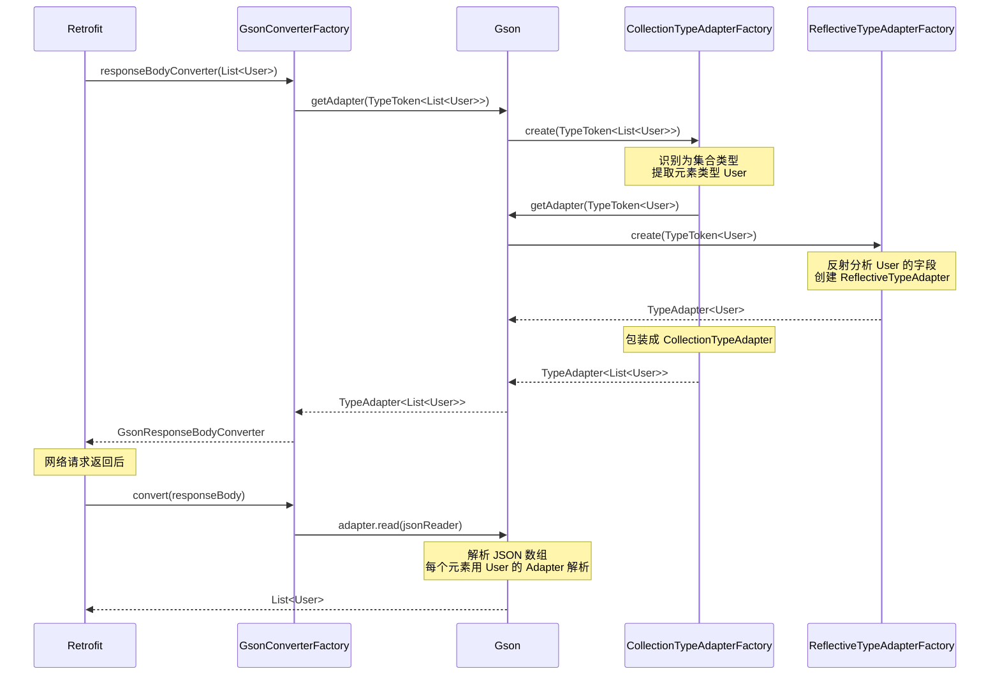
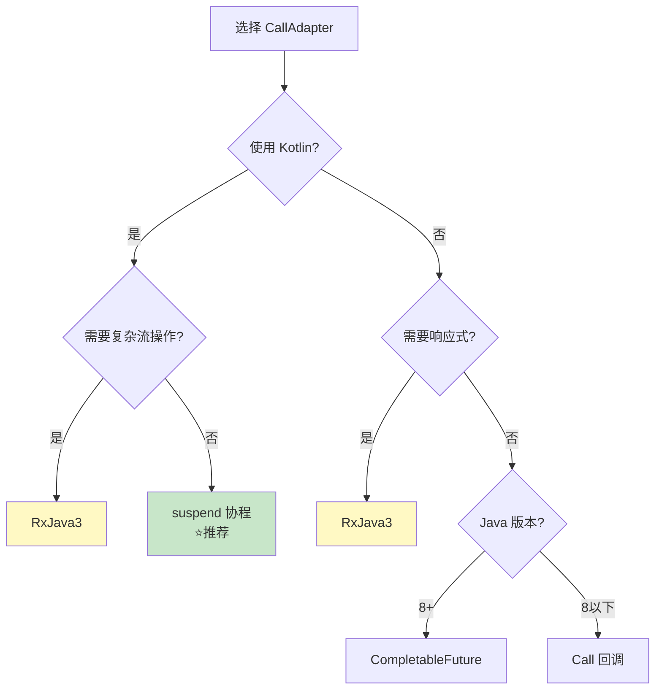

# Retrofit 实战问题篇

> 解决实际开发中最常见的两个问题：Converter 和 CallAdapter

## 问题一：Converter 有哪些？泛型怎么处理？

### Converter 的本质

Converter 就是个**翻译官**，负责把网络传输的数据（通常是 JSON 字符串）翻译成你代码中的对象，或者反过来。

就像你去国外旅游，需要翻译帮你把中文翻成英文，Converter 帮你把 JSON 翻成 Kotlin 对象。

### 常用 Converter 一览

| Converter | 用途 | 依赖 | 推荐指数 |
|-----------|------|------|---------|
| **GsonConverter** | JSON ↔ 对象（Google 出品） | `converter-gson` | ⭐⭐⭐⭐ |
| **MoshiConverter** | JSON ↔ 对象（Square 出品，更现代） | `converter-moshi` | ⭐⭐⭐⭐⭐ |
| **KotlinxSerializationConverter** | JSON ↔ 对象（Kotlin 官方） | `converter-kotlinx-serialization` | ⭐⭐⭐⭐⭐ |
| **JacksonConverter** | JSON ↔ 对象（老牌 Java 库） | `converter-jackson` | ⭐⭐⭐ |
| **ScalarsConverter** | 字符串/基本类型 | `converter-scalars` | ⭐⭐⭐ |
| **ProtobufConverter** | Protocol Buffers | `converter-protobuf` | ⭐⭐⭐ |
| **WireConverter** | Protocol Buffers（Square） | `converter-wire` | ⭐⭐⭐ |
| **SimpleXmlConverter** | XML 格式 | `converter-simplexml` | ⭐⭐ |
| **JaxbConverter** | XML 格式（Java 标准） | `converter-jaxb` | ⭐⭐ |

### 依赖配置

```kotlin
// build.gradle.kts
dependencies {
    // Retrofit 核心
    implementation("com.squareup.retrofit2:retrofit:2.9.0")
    
    // 选择一个 JSON Converter（三选一即可）
    implementation("com.squareup.retrofit2:converter-gson:2.9.0")         // Gson
    implementation("com.squareup.retrofit2:converter-moshi:2.9.0")        // Moshi
    implementation("com.jakewharton.retrofit:retrofit2-kotlinx-serialization-converter:1.0.0") // Kotlinx
    
    // 字符串/基本类型支持
    implementation("com.squareup.retrofit2:converter-scalars:2.9.0")
}
```

### 各 Converter 对比

#### 1. GsonConverter（最常见）

```kotlin
// 配置
val retrofit = Retrofit.Builder()
    .baseUrl("https://api.example.com/")
    .addConverterFactory(GsonConverterFactory.create())
    .build()

// 数据类（不需要注解）
data class User(
    val id: Int,
    val name: String,
    @SerializedName("avatar_url")  // 字段映射
    val avatarUrl: String
)
```

**优点**：简单易用，生态成熟，不需要注解
**缺点**：反射性能稍差，Kotlin 默认值支持不好

#### 2. MoshiConverter（推荐）

```kotlin
// 配置
val moshi = Moshi.Builder()
    .add(KotlinJsonAdapterFactory())  // Kotlin 支持
    .build()

val retrofit = Retrofit.Builder()
    .baseUrl("https://api.example.com/")
    .addConverterFactory(MoshiConverterFactory.create(moshi))
    .build()

// 数据类
@JsonClass(generateAdapter = true)  // 使用代码生成，性能更好
data class User(
    val id: Int,
    val name: String,
    @Json(name = "avatar_url")  // 字段映射
    val avatarUrl: String
)
```

**优点**：性能好（支持代码生成），Kotlin 友好，空安全检查
**缺点**：需要添加注解

#### 3. KotlinxSerializationConverter（Kotlin 项目首选）

```kotlin
// 配置
val retrofit = Retrofit.Builder()
    .baseUrl("https://api.example.com/")
    .addConverterFactory(Json.asConverterFactory("application/json".toMediaType()))
    .build()

// 数据类
@Serializable
data class User(
    val id: Int,
    val name: String,
    @SerialName("avatar_url")  // 字段映射
    val avatarUrl: String
)
```

**优点**：Kotlin 官方出品，编译期生成，性能最好，多平台支持
**缺点**：需要 Kotlin 1.4+，需要序列化插件

#### 4. ScalarsConverter（返回原始字符串）

```kotlin
// 有时候你只想要原始响应，不要解析
val retrofit = Retrofit.Builder()
    .baseUrl("https://api.example.com/")
    .addConverterFactory(ScalarsConverterFactory.create())  // 先加这个
    .addConverterFactory(GsonConverterFactory.create())     // 再加 JSON 的
    .build()

interface ApiService {
    @GET("raw")
    suspend fun getRawString(): String  // 直接返回字符串
    
    @GET("user/{id}")
    suspend fun getUser(@Path("id") id: Int): User  // 正常返回对象
}
```

**重要**：ScalarsConverter 要放在 GsonConverter **前面**！顺序决定优先级。

### 核心问题：泛型是怎么处理的？

这是实际开发中最困惑的问题：Retrofit 是怎么知道要把 JSON 转成什么类型的？

#### 泛型擦除问题

Java/Kotlin 有个坑叫**泛型擦除**：

```kotlin
// 运行时，这两个的类型信息是一样的！
val list1: List<String> = listOf()
val list2: List<Int> = listOf()

// 运行时都变成了 List<Object>，泛型信息丢失了
```

#### Retrofit 的解决方案

Retrofit 通过**反射获取方法签名的泛型类型**来解决这个问题：

```kotlin
interface ApiService {
    @GET("users")
    suspend fun getUsers(): List<User>  // 这里的泛型信息在字节码中保留了！
}
```

**关键点**：虽然运行时泛型会擦除，但**方法签名和字段声明的泛型信息会保留在字节码中**。

#### 源码揭秘

```kotlin
// Retrofit 内部是这样获取返回类型的
fun parseAnnotations(retrofit: Retrofit, method: Method): ServiceMethod<*> {
    // 获取方法的泛型返回类型（这个信息在字节码中保留了）
    val returnType: Type = method.genericReturnType
    
    // returnType 可能是：
    // - Class<User>                    → 简单类型
    // - ParameterizedType              → 泛型类型，如 List<User>、Response<User>
    // - GenericArrayType               → 泛型数组
    // - TypeVariable                   → 类型变量，如 T
    // - WildcardType                   → 通配符，如 ? extends User
    
    // 根据类型找合适的 Converter
    val converter = retrofit.responseBodyConverter(responseType, annotations)
}
```

#### Type 类型体系图解

```
┌─────────────────────────────────────────────────────────────┐
│                        Type 接口                            │
│              （所有类型信息的顶级接口）                        │
└─────────────────────────┬───────────────────────────────────┘
                          │
        ┌────────────────┬┴────────────────┬─────────────────┐
        │                │                 │                 │
        ▼                ▼                 ▼                 ▼
┌───────────────┐ ┌─────────────────┐ ┌───────────────┐ ┌──────────────┐
│    Class<T>   │ │ParameterizedType│ │GenericArrayType│ │TypeVariable  │
│               │ │                 │ │               │ │              │
│  User.class   │ │  List<User>     │ │   T[]         │ │     T        │
│  String.class │ │  Map<K,V>       │ │   User[]      │ │     E        │
└───────────────┘ │  Response<User> │ └───────────────┘ └──────────────┘
                  └─────────────────┘
```

#### 实战：手动获取泛型类型

如果你自己要处理泛型，可以这样做：

```kotlin
// 方案一：通过 Method 获取（Retrofit 的做法）
val method = ApiService::class.java.getMethod("getUsers")
val returnType = method.genericReturnType

if (returnType is ParameterizedType) {
    // 获取泛型参数，如 List<User> 中的 User
    val actualTypeArguments = returnType.actualTypeArguments
    val userType = actualTypeArguments[0]  // User::class.java
}

// 方案二：通过匿名内部类保留泛型（Gson 的 TypeToken）
val type = object : TypeToken<List<User>>() {}.type
// 现在 type 包含了完整的 List<User> 信息

// 方案三：Kotlin 的 typeOf（推荐）
val type = typeOf<List<User>>()  // Kotlin 1.3.50+
```

#### 为什么匿名内部类能保留泛型？

```kotlin
// 这是个匿名内部类，它继承了 TypeToken<List<User>>
object : TypeToken<List<User>>() {}

// 编译后，类的签名信息保留在字节码中：
// class Anonymous$1 extends TypeToken<List<User>>
//                                     ↑
//                              这个信息不会被擦除！

// TypeToken 的原理：
abstract class TypeToken<T> {
    val type: Type
    
    init {
        // 获取父类的泛型参数
        val superClass = javaClass.genericSuperclass as ParameterizedType
        type = superClass.actualTypeArguments[0]  // 拿到 List<User>
    }
}
```

### GsonConverterFactory 源码解析

想知道 Gson 是怎么把 JSON 自动转成 `List<User>` 的？我们来看看源码。

#### 整体流程

```
┌─────────────────────────────────────────────────────────────┐
│  Retrofit 调用 GsonConverterFactory                         │
│                                                             │
│  responseBodyConverter(type = List<User>, ...)              │
│                          ↓                                  │
│  GsonConverterFactory 创建 GsonResponseBodyConverter        │
│                          ↓                                  │
│  Gson.getAdapter(TypeToken.get(List<User>))                │
│                          ↓                                  │
│  得到 TypeAdapter<List<User>>                               │
│                          ↓                                  │
│  请求返回时，用这个 Adapter 解析 JSON                         │
└─────────────────────────────────────────────────────────────┘
```

#### GsonConverterFactory 源码（简化版）

```java
// GsonConverterFactory.java - Retrofit 官方实现
public final class GsonConverterFactory extends Converter.Factory {
    
    private final Gson gson;
    
    // 创建工厂实例
    public static GsonConverterFactory create() {
        return create(new Gson());
    }
    
    public static GsonConverterFactory create(Gson gson) {
        return new GsonConverterFactory(gson);
    }
    
    private GsonConverterFactory(Gson gson) {
        this.gson = gson;
    }
    
    // 核心方法：创建响应体转换器
    @Override
    public Converter<ResponseBody, ?> responseBodyConverter(
            Type type,           // ← Retrofit 传过来的泛型类型，如 List<User>
            Annotation[] annotations,
            Retrofit retrofit) {
        
        // 1. 根据 Type 获取对应的 TypeAdapter
        //    TypeToken.get(type) 会保留完整的泛型信息
        TypeAdapter<?> adapter = gson.getAdapter(TypeToken.get(type));
        
        // 2. 创建响应体转换器，把 adapter 传进去
        return new GsonResponseBodyConverter<>(gson, adapter);
    }
    
    // 请求体转换器（对象 → JSON）
    @Override
    public Converter<?, RequestBody> requestBodyConverter(
            Type type,
            Annotation[] parameterAnnotations,
            Annotation[] methodAnnotations,
            Retrofit retrofit) {
        
        TypeAdapter<?> adapter = gson.getAdapter(TypeToken.get(type));
        return new GsonRequestBodyConverter<>(gson, adapter);
    }
}
```

#### GsonResponseBodyConverter 源码（简化版）

```java
// GsonResponseBodyConverter.java - 真正执行转换的地方
final class GsonResponseBodyConverter<T> implements Converter<ResponseBody, T> {
    
    private final Gson gson;
    private final TypeAdapter<T> adapter;  // 已经是 TypeAdapter<List<User>> 了
    
    GsonResponseBodyConverter(Gson gson, TypeAdapter<T> adapter) {
        this.gson = gson;
        this.adapter = adapter;
    }
    
    // 核心方法：把 ResponseBody 转成目标类型
    @Override
    public T convert(ResponseBody value) throws IOException {
        // 从响应体获取 JSON 字符流
        JsonReader jsonReader = gson.newJsonReader(value.charStream());
        
        try {
            // 用 TypeAdapter 读取 JSON，自动转成 List<User>
            return adapter.read(jsonReader);
        } finally {
            value.close();
        }
    }
}
```

#### Gson 内部：TypeAdapter 是怎么创建的？

```java
// Gson.getAdapter() 简化逻辑
public <T> TypeAdapter<T> getAdapter(TypeToken<T> type) {
    // type = TypeToken<List<User>>
    
    // 1. 先查缓存
    TypeAdapter<?> cached = typeTokenCache.get(type);
    if (cached != null) {
        return (TypeAdapter<T>) cached;
    }
    
    // 2. 遍历所有 TypeAdapterFactory，找能处理这个类型的
    for (TypeAdapterFactory factory : factories) {
        TypeAdapter<T> adapter = factory.create(this, type);
        if (adapter != null) {
            // 找到了！缓存并返回
            typeTokenCache.put(type, adapter);
            return adapter;
        }
    }
    
    throw new IllegalArgumentException("Cannot serialize " + type);
}
```

#### 处理 List<User> 的 TypeAdapterFactory

```java
// CollectionTypeAdapterFactory - 处理 List、Set 等集合
public final class CollectionTypeAdapterFactory implements TypeAdapterFactory {
    
    @Override
    public <T> TypeAdapter<T> create(Gson gson, TypeToken<T> typeToken) {
        Type type = typeToken.getType();
        
        // 检查是不是 Collection 类型
        Class<? super T> rawType = typeToken.getRawType();
        if (!Collection.class.isAssignableFrom(rawType)) {
            return null;  // 不是集合，交给下一个工厂
        }
        
        // 获取集合元素的类型：List<User> → User
        Type elementType = getCollectionElementType(type, rawType);
        
        // 递归获取元素类型的 TypeAdapter
        TypeAdapter<?> elementAdapter = gson.getAdapter(TypeToken.get(elementType));
        
        // 创建集合的 TypeAdapter
        return new CollectionTypeAdapter(elementAdapter, rawType);
    }
}

// 集合的 TypeAdapter
class CollectionTypeAdapter<E> extends TypeAdapter<Collection<E>> {
    
    private final TypeAdapter<E> elementAdapter;  // User 的 Adapter
    
    @Override
    public Collection<E> read(JsonReader in) throws IOException {
        List<E> list = new ArrayList<>();
        
        in.beginArray();  // 读取 JSON 数组开始 [
        while (in.hasNext()) {
            // 用元素的 Adapter 读取每个元素
            E element = elementAdapter.read(in);
            list.add(element);
        }
        in.endArray();  // 读取 JSON 数组结束 ]
        
        return list;
    }
}
```

#### 完整流程图



#### 核心要点总结

| 步骤 | 做什么 | 谁做的 |
|-----|-------|--------|
| 1. 获取泛型类型 | `method.genericReturnType` → `List<User>` | Retrofit |
| 2. 包装成 TypeToken | `TypeToken.get(type)` 保留泛型信息 | GsonConverterFactory |
| 3. 创建 TypeAdapter | 根据类型找对应的 Factory 创建 | Gson |
| 4. 处理集合 | 提取元素类型，递归创建元素的 Adapter | CollectionTypeAdapterFactory |
| 5. 处理实体类 | 反射分析字段，创建字段 Adapter | ReflectiveTypeAdapterFactory |
| 6. 执行转换 | 读取 JSON，用 Adapter 转成对象 | GsonResponseBodyConverter |

#### 一句话总结

**GsonConverterFactory 拿到 Retrofit 传来的 `Type`（如 `List<User>`），用 `TypeToken.get(type)` 保留泛型信息，交给 Gson 创建对应的 `TypeAdapter`，然后用这个 Adapter 把 JSON 转成目标类型。**

关键就一句话：**Type 信息从 Retrofit 传到 Gson，Gson 根据这个 Type 创建正确的 TypeAdapter**。

### 实战场景：统一响应体处理

实际项目中，后端通常返回统一格式：

```json
{
    "code": 0,
    "message": "success",
    "data": { ... }  // 这里是实际数据，每个接口不同
}
```

#### 定义统一响应体

```kotlin
// 通用响应包装
data class ApiResponse<T>(
    val code: Int,
    val message: String,
    val data: T?  // 泛型数据
)

// 接口定义
interface ApiService {
    @GET("user/{id}")
    suspend fun getUser(@Path("id") id: Int): ApiResponse<User>
    
    @GET("users")
    suspend fun getUsers(): ApiResponse<List<User>>
}
```

#### Retrofit 如何解析 `ApiResponse<User>`？

```kotlin
// Retrofit 内部流程：
// 1. 获取返回类型：ApiResponse<User>（ParameterizedType）
// 2. 找 Converter：GsonConverterFactory.responseBodyConverter(type, ...)
// 3. Gson 内部：
//    - 解析到 ApiResponse，发现有泛型参数 T
//    - 获取 T 的实际类型：User
//    - 创建 TypeAdapter<ApiResponse<User>>
//    - 解析 JSON 时，data 字段按 User 类型解析
```

#### 自定义 Converter 处理响应

如果你想自动解包 `data` 字段：

```kotlin
// 自定义 Converter，自动取出 data
class UnwrapConverterFactory : Converter.Factory() {
    
    override fun responseBodyConverter(
        type: Type,
        annotations: Array<Annotation>,
        retrofit: Retrofit
    ): Converter<ResponseBody, *>? {
        // 包装成 ApiResponse<原类型>
        val wrappedType = TypeToken.getParameterized(
            ApiResponse::class.java,
            type
        ).type
        
        // 用默认的 Gson Converter 解析
        val delegate = retrofit.nextResponseBodyConverter<ApiResponse<*>>(
            this, wrappedType, annotations
        )
        
        return Converter<ResponseBody, Any> { body ->
            val response = delegate.convert(body)
            if (response?.code == 0) {
                response.data  // 只返回 data 字段
            } else {
                throw ApiException(response?.code ?: -1, response?.message ?: "Unknown error")
            }
        }
    }
}

// 使用
val retrofit = Retrofit.Builder()
    .addConverterFactory(UnwrapConverterFactory())  // 先加自定义的
    .addConverterFactory(GsonConverterFactory.create())
    .build()

// 现在接口可以直接返回数据类型
interface ApiService {
    @GET("user/{id}")
    suspend fun getUser(@Path("id") id: Int): User  // 直接是 User，不是 ApiResponse<User>
}
```

---

## 问题二：CallAdapter 支持哪些？

### CallAdapter 的本质

CallAdapter 决定了**怎么拿数据**，是同步还是异步，是回调还是流。

就像点外卖：
- `Call<T>` → 自己去店里取（同步/异步回调）
- `Observable<T>` → 外卖员送来，还能追踪位置（RxJava 流）
- `suspend fun` → 等着送来就行（协程挂起）

### 常用 CallAdapter 一览

| CallAdapter | 返回类型 | 依赖 | 适用场景 |
|-------------|---------|------|---------|
| **默认（内置）** | `Call<T>` | 无需额外依赖 | 回调式 |
| **协程（内置）** | `suspend fun` | 无需额外依赖 | Kotlin 协程 |
| **RxJava3** | `Observable<T>`、`Single<T>`、`Flowable<T>` | `adapter-rxjava3` | 响应式编程 |
| **RxJava2** | 同上 | `adapter-rxjava2` | 老项目 |
| **CompletableFuture** | `CompletableFuture<T>` | `adapter-java8` | Java 8 异步 |
| **Guava** | `ListenableFuture<T>` | `adapter-guava` | Guava 用户 |

### 依赖配置

```kotlin
// build.gradle.kts
dependencies {
    // Retrofit 核心（已内置 Call 和 suspend 支持）
    implementation("com.squareup.retrofit2:retrofit:2.9.0")
    
    // RxJava 3 支持
    implementation("com.squareup.retrofit2:adapter-rxjava3:2.9.0")
    implementation("io.reactivex.rxjava3:rxjava:3.1.5")
    implementation("io.reactivex.rxjava3:rxandroid:3.0.2")
    
    // Java 8 CompletableFuture
    implementation("com.squareup.retrofit2:adapter-java8:2.9.0")
}
```

### 各 CallAdapter 详解

#### 1. 默认 Call（内置，无需配置）

```kotlin
interface ApiService {
    @GET("user/{id}")
    fun getUser(@Path("id") id: Int): Call<User>
}

// 使用方式
// 同步调用（会阻塞线程，不要在主线程用！）
val response = apiService.getUser(1).execute()

// 异步调用（推荐）
apiService.getUser(1).enqueue(object : Callback<User> {
    override fun onResponse(call: Call<User>, response: Response<User>) {
        val user = response.body()
    }
    
    override fun onFailure(call: Call<User>, t: Throwable) {
        // 处理错误
    }
})
```

**适用场景**：简单项目，不想引入额外依赖

#### 2. Kotlin 协程 suspend（内置，Retrofit 2.6.0+）

```kotlin
interface ApiService {
    // 直接返回数据
    @GET("user/{id}")
    suspend fun getUser(@Path("id") id: Int): User
    
    // 返回 Response，可以获取响应头等信息
    @GET("user/{id}")
    suspend fun getUserResponse(@Path("id") id: Int): Response<User>
}

// 使用方式
viewModelScope.launch {
    try {
        val user = apiService.getUser(1)
        // 直接拿到数据
    } catch (e: Exception) {
        // 处理错误
    }
}
```

**适用场景**：现代 Kotlin 项目（强烈推荐）

#### 3. RxJava 3

```kotlin
// 配置
val retrofit = Retrofit.Builder()
    .baseUrl("https://api.example.com/")
    .addConverterFactory(GsonConverterFactory.create())
    .addCallAdapterFactory(RxJava3CallAdapterFactory.create())  // 添加 RxJava 支持
    .build()

interface ApiService {
    // Single：发射单个值或错误
    @GET("user/{id}")
    fun getUser(@Path("id") id: Int): Single<User>
    
    // Observable：可发射多个值（网络请求通常用 Single）
    @GET("users")
    fun getUsers(): Observable<List<User>>
    
    // Flowable：支持背压的 Observable
    @GET("users")
    fun getUsersFlow(): Flowable<List<User>>
    
    // Maybe：可能有值，可能没值
    @GET("user/{id}")
    fun findUser(@Path("id") id: Int): Maybe<User>
    
    // Completable：只关心成功/失败，不关心数据
    @POST("user/{id}/delete")
    fun deleteUser(@Path("id") id: Int): Completable
}

// 使用方式
apiService.getUser(1)
    .subscribeOn(Schedulers.io())        // 在 IO 线程执行
    .observeOn(AndroidSchedulers.mainThread())  // 在主线程回调
    .subscribe(
        { user -> /* 成功 */ },
        { error -> /* 失败 */ }
    )
```

**适用场景**：需要复杂的流操作（组合、转换、重试等）

#### 4. RxJava + Response 包装

```kotlin
interface ApiService {
    // 包装成 Response，可以获取响应码、响应头
    @GET("user/{id}")
    fun getUser(@Path("id") id: Int): Single<Response<User>>
    
    // 包装成 Result，不会抛异常，错误也能处理
    @GET("user/{id}")
    fun getUserResult(@Path("id") id: Int): Single<Result<User>>
}

// Result 的好处：网络错误不会触发 onError
apiService.getUserResult(1)
    .subscribe { result ->
        result.fold(
            onSuccess = { response ->
                if (response.isSuccessful) {
                    val user = response.body()
                }
            },
            onFailure = { throwable ->
                // 网络错误
            }
        )
    }
```

#### 5. CompletableFuture（Java 8+）

```kotlin
// 配置
val retrofit = Retrofit.Builder()
    .addCallAdapterFactory(Java8CallAdapterFactory.create())
    .build()

interface ApiService {
    @GET("user/{id}")
    fun getUser(@Path("id") id: Int): CompletableFuture<User>
}

// 使用
apiService.getUser(1)
    .thenApply { user -> /* 处理数据 */ }
    .exceptionally { throwable -> /* 处理错误 */ }
```

**适用场景**：纯 Java 项目，不想引入 RxJava

### CallAdapter 选择流程图



### 协程 vs RxJava 对比

| 特性 | Kotlin 协程 | RxJava |
|-----|------------|--------|
| **学习曲线** | 较低 | 较高 |
| **代码简洁度** | 很简洁 | 链式调用，稍复杂 |
| **错误处理** | try-catch | onError |
| **取消机制** | 结构化并发，自动取消 | 需要手动管理 Disposable |
| **组合操作** | Flow API | 丰富的操作符 |
| **调试** | 堆栈友好 | 堆栈难读 |
| **依赖大小** | 较小 | 较大 |
| **Java 支持** | 需要协程库 | 原生支持 |

### 实战：自定义 CallAdapter

假设你想让所有接口自动重试：

```kotlin
// 自动重试的 Call 包装器
class RetryCall<T>(
    private val delegate: Call<T>,
    private val maxRetries: Int = 3
) : Call<T> {
    
    override fun enqueue(callback: Callback<T>) {
        enqueueWithRetry(callback, 0)
    }
    
    private fun enqueueWithRetry(callback: Callback<T>, retryCount: Int) {
        delegate.clone().enqueue(object : Callback<T> {
            override fun onResponse(call: Call<T>, response: Response<T>) {
                callback.onResponse(call, response)
            }
            
            override fun onFailure(call: Call<T>, t: Throwable) {
                if (retryCount < maxRetries) {
                    // 延迟重试
                    Handler(Looper.getMainLooper()).postDelayed({
                        enqueueWithRetry(callback, retryCount + 1)
                    }, 1000L * (retryCount + 1))
                } else {
                    callback.onFailure(call, t)
                }
            }
        })
    }
    
    // ... 其他方法委托给 delegate
}

// CallAdapter 工厂
class RetryCallAdapterFactory : CallAdapter.Factory() {
    
    override fun get(
        returnType: Type,
        annotations: Array<Annotation>,
        retrofit: Retrofit
    ): CallAdapter<*, *>? {
        if (getRawType(returnType) != Call::class.java) {
            return null
        }
        
        val responseType = getParameterUpperBound(0, returnType as ParameterizedType)
        
        return object : CallAdapter<Any, Call<Any>> {
            override fun responseType() = responseType
            override fun adapt(call: Call<Any>) = RetryCall(call)
        }
    }
}
```

---

## 最佳实践总结

### Converter 选择建议

```
1. Kotlin 项目 → KotlinxSerializationConverter（官方出品，性能最好）
2. Java/Kotlin 混合 → MoshiConverter（现代，Kotlin 友好）
3. 老项目 → GsonConverter（简单，无需改动数据类）
4. 需要原始响应 → ScalarsConverter + GsonConverter（注意顺序）
```

### CallAdapter 选择建议

```
1. 现代 Kotlin 项目 → suspend 协程（内置，无需额外依赖）
2. 需要复杂流操作 → RxJava3
3. 纯 Java 8+ 项目 → CompletableFuture
4. 简单项目/老项目 → Call 回调
```

### 配置顺序原则

```kotlin
val retrofit = Retrofit.Builder()
    .baseUrl("https://api.example.com/")
    .client(okHttpClient)
    
    // CallAdapter：特殊的放前面，通用的放后面
    .addCallAdapterFactory(RxJava3CallAdapterFactory.create())
    // 协程 suspend 是内置的，不需要添加
    
    // Converter：特殊的放前面，通用的放后面
    .addConverterFactory(ScalarsConverterFactory.create())  // 处理 String
    .addConverterFactory(GsonConverterFactory.create())     // 处理 JSON
    
    .build()
```

### 常见坑

| 问题 | 原因 | 解决方案 |
|-----|------|---------|
| `Expected BEGIN_OBJECT but was STRING` | JSON 解析失败 | 检查数据类是否匹配 |
| `Unable to create converter` | 没找到合适的 Converter | 添加对应的 ConverterFactory |
| `Unable to create call adapter` | 没找到合适的 CallAdapter | 添加对应的 CallAdapterFactory |
| Kotlin 默认值不生效 | Gson 不支持 Kotlin 默认值 | 换成 Moshi 或 kotlinx.serialization |
| 泛型被擦除 | 直接用 Class 获取泛型 | 用 TypeToken 或 typeOf |

---

## 面试检验

### Q1：Retrofit 常用的 Converter 有哪些？它们的区别是什么？

**答案**：

常用 Converter：
- **GsonConverter**：Google 出品，简单易用，不需要注解，但用反射性能稍差
- **MoshiConverter**：Square 出品，支持代码生成，性能好，Kotlin 友好
- **KotlinxSerializationConverter**：Kotlin 官方，编译期生成，性能最好，支持多平台
- **ScalarsConverter**：处理 String、Int 等基本类型

主要区别在于性能（反射 vs 代码生成）和 Kotlin 支持程度。

### Q2：Retrofit 是如何处理泛型的？为什么不会被擦除？

**答案**：

虽然 Java 有泛型擦除，但**方法签名和类声明的泛型信息会保留在字节码中**。

Retrofit 通过 `method.getGenericReturnType()` 获取方法返回类型的完整泛型信息（返回 `Type` 对象），然后把这个 Type 传给 Converter，Converter（如 Gson）根据这个 Type 创建对应的 TypeAdapter 来解析 JSON。

如果需要手动处理泛型，可以用：
- `TypeToken<List<User>>() {}.type`（匿名内部类）
- `typeOf<List<User>>()`（Kotlin）

### Q3：CallAdapter 有哪些？什么场景用什么？

**答案**：

- **Call（内置）**：回调式，适合简单场景
- **suspend（内置）**：Kotlin 协程，现代 Kotlin 项目首选
- **RxJava3**：响应式编程，适合复杂的流操作（组合、重试、节流等）
- **CompletableFuture**：Java 8 异步，纯 Java 项目

选择建议：**Kotlin 项目用 suspend，需要复杂流操作用 RxJava**。

### Q4：多个 Converter/CallAdapter 的顺序有什么讲究？

**答案**：**按添加顺序依次尝试，第一个匹配的生效**。

原则：特殊的放前面，通用的放后面。

比如 ScalarsConverter 要放在 GsonConverter 前面，否则 Gson 会把所有类型都"吃掉"，String 类型也会被当成 JSON 解析。

---
_本文档将持续更新，添加更多实战经验_
