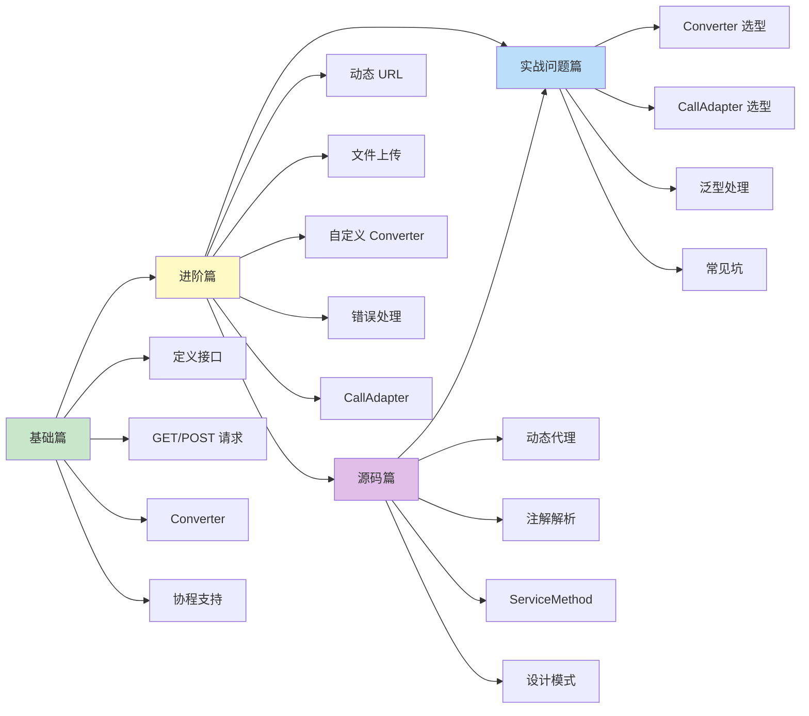

# Retrofit 知识体系

> 从入门到专家的完整学习路径 —— Android 网络请求的优雅之道

## 为什么要学 Retrofit？

在 Android 开发中，几乎每个 App 都要和服务器打交道：

- 用原生 HttpURLConnection？代码又臭又长
- 直接用 OkHttp？每次都要手动解析 JSON
- 想要类型安全？想要协程支持？想要代码优雅？

**Retrofit 就是来解决这些问题的**。它是 Square 公司开源的网络请求框架，用**注解的方式定义 API**，让网络请求变得像调用本地方法一样简单。

## 一句话理解 Retrofit

Retrofit 就像一个**翻译官**：
- 📝 **会翻译**：你用 Kotlin/Java 写接口，它翻译成 HTTP 请求
- 🎁 **会包装**：服务器返回的 JSON，它自动包装成你要的对象
- 🔌 **会适配**：想要 RxJava？协程？LiveData？换个插头（Adapter）就行
- 🚗 **会开车**：底层用 OkHttp 真正发请求，Retrofit 只是方向盘

**简单说**：OkHttp 是发动机，Retrofit 是驾驶舱。你不用踩发动机，踩油门就行。

## Retrofit 与 OkHttp 的关系

```
┌─────────────────────────────────────┐
│            你的代码                  │
│   interface ApiService {            │
│     @GET("users")                   │
│     suspend fun getUsers(): List    │
│   }                                 │
└───────────────┬─────────────────────┘
                │ Retrofit 把注解翻译成 Request
                ▼
┌─────────────────────────────────────┐
│           Retrofit                  │
│   • 注解解析                         │
│   • 请求构建                         │
│   • 响应转换                         │
└───────────────┬─────────────────────┘
                │ 实际的网络请求交给 OkHttp
                ▼
┌─────────────────────────────────────┐
│            OkHttp                   │
│   • 连接管理                         │
│   • 请求发送                         │
│   • 响应接收                         │
└─────────────────────────────────────┘
```

## 文档结构

```
Retrofit/
├── README.md          # 本文件（目录索引）
├── 1-基础篇.md         # 初/中级开发者
├── 2-进阶篇.md         # 高级开发者
├── 3-源码篇.md         # 专家级
└── 4-实战问题篇.md      # 常见问题与经验
```

## 学习路线



## 各篇内容概览

### [1-基础篇](1-基础篇.md)

**适合人群**：Android 初学者、准备初/中级面试

| 知识点 | 内容 |
|-------|------|
| 技术演进 | 为什么需要 Retrofit？它解决了什么问题？ |
| 基本使用 | 定义接口、创建实例、发起请求 |
| 注解详解 | @GET、@POST、@Path、@Query、@Body 等 |
| 协程支持 | suspend 函数与 Retrofit 的完美配合 |
| 数据转换 | Gson、Moshi、kotlinx.serialization |
| 横向对比 | Retrofit vs OkHttp vs Volley |

### [2-进阶篇](2-进阶篇.md)

**适合人群**：有 Retrofit 使用经验、准备高级面试

| 知识点 | 内容 |
|-------|------|
| 动态 URL | @Url、BaseUrl 切换 |
| 文件上传 | @Multipart、进度监听 |
| 自定义 Converter | 处理特殊数据格式 |
| CallAdapter | RxJava、Flow、LiveData 适配 |
| 错误处理 | 统一异常处理、网络错误重试 |
| 拦截器配合 | Token 刷新、日志打印 |
| 边界认知 | Retrofit 不适合的场景 |

### [3-源码篇](3-源码篇.md)

**适合人群**：准备 Android 专家级面试、想深入理解原理

| 知识点 | 内容 |
|-------|------|
| 整体架构 | Retrofit 的分层设计 |
| 动态代理 | 如何把接口变成实现类？ |
| 注解解析 | ServiceMethod 的构建过程 |
| Converter | 数据转换的设计思想 |
| CallAdapter | 适配器模式的精妙应用 |
| 设计模式 | 建造者、工厂、代理、适配器 |
| 面试高频 | 5 道专家级面试题 |

### [4-实战问题篇](4-实战问题篇.md)

**适合人群**：有实际开发经验、遇到具体问题需要解决

| 知识点 | 内容 |
|-------|------|
| Converter 全览 | Gson、Moshi、Kotlinx.serialization 等对比 |
| 泛型处理 | Retrofit 如何解析泛型类型？TypeToken 原理 |
| CallAdapter 全览 | Call、suspend、RxJava、CompletableFuture |
| 统一响应体 | 如何优雅处理 `{ code, message, data }` 格式 |
| 选型建议 | Converter 和 CallAdapter 该怎么选？ |
| 常见坑 | 实际开发中遇到的问题及解决方案 |

## 面试覆盖程度

| 面试级别 | 需要掌握 |
|---------|---------|
| 初级 Android | 基础篇 |
| 中级 Android | 基础篇 + 进阶篇部分 |
| 高级 Android | 基础篇 + 进阶篇 |
| **Android 专家** | 基础篇 + 进阶篇 + 源码篇 |

## 快速查阅

### 常见问题速查

| 问题 | 解决方案 | 所在文档 |
|-----|---------|---------|
| JSON 解析失败 | 检查 GsonConverterFactory 是否添加 | 基础篇 |
| 请求参数为 null | 使用 @Query 的 encoded 参数 | 基础篇 |
| 想用协程 | 接口方法加 suspend | 基础篇 |
| 需要动态 BaseUrl | 使用 @Url 或拦截器 | 进阶篇 |
| 上传文件 | 使用 @Multipart + @Part | 进阶篇 |
| Token 过期刷新 | Authenticator + 拦截器 | 进阶篇 |
| 想用 Flow | 添加 CallAdapter | 进阶篇 |
| Converter 怎么选 | Kotlinx > Moshi > Gson | 实战问题篇 |
| CallAdapter 怎么选 | Kotlin 用 suspend，复杂流用 RxJava | 实战问题篇 |
| 泛型怎么传递 | TypeToken 或 typeOf | 实战问题篇 |
| 统一响应体处理 | 自定义 Converter 解包 data | 实战问题篇 |

### 核心代码速查

| 功能 | 代码 | 所在文档 |
|-----|------|---------|
| 创建实例 | `Retrofit.Builder().baseUrl().build()` | 基础篇 |
| GET 请求 | `@GET("users") suspend fun getUsers()` | 基础篇 |
| POST JSON | `@POST("user") @Body user: User` | 基础篇 |
| 路径参数 | `@GET("user/{id}") @Path("id")` | 基础篇 |
| 查询参数 | `@GET("search") @Query("q")` | 基础篇 |
| 文件上传 | `@Multipart @Part file: MultipartBody.Part` | 进阶篇 |
| 动态 URL | `@GET suspend fun get(@Url url: String)` | 进阶篇 |

## 版本信息

本文档基于 **Retrofit 2.9.0+** 版本编写。

```kotlin
// build.gradle.kts
dependencies {
    // Retrofit 核心库
    implementation("com.squareup.retrofit2:retrofit:2.9.0")
    // Gson 转换器
    implementation("com.squareup.retrofit2:converter-gson:2.9.0")
    // 可选：kotlinx.serialization 转换器
    implementation("com.jakewharton.retrofit:retrofit2-kotlinx-serialization-converter:1.0.0")
    // OkHttp（Retrofit 依赖，通常不需要单独添加）
    implementation("com.squareup.okhttp3:okhttp:4.12.0")
}
```

别忘了添加网络权限：

```xml
<!-- AndroidManifest.xml -->
<uses-permission android:name="android.permission.INTERNET" />
```

## 推荐学习顺序

1. **先学 OkHttp 基础篇** → 理解 HTTP 请求的基本概念
2. **再学 Retrofit 基础篇** → 掌握声明式 API 的用法
3. **然后 Retrofit 进阶篇** → 解决实际开发中的复杂需求
4. **最后 Retrofit 源码篇** → 理解框架设计的精妙之处

> 💡 **建议**：如果你还没学过 OkHttp，建议先看 [OkHttp 基础篇](../OkHttp/1-基础篇.md)。Retrofit 底层依赖 OkHttp，了解 OkHttp 能帮你更好地理解 Retrofit。

---
_本文档将持续更新_
