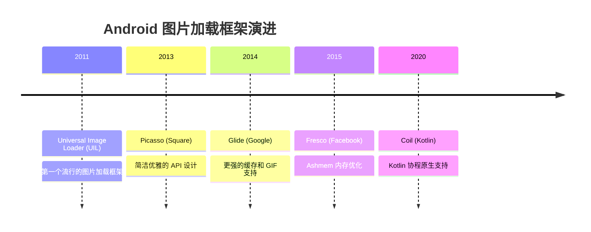
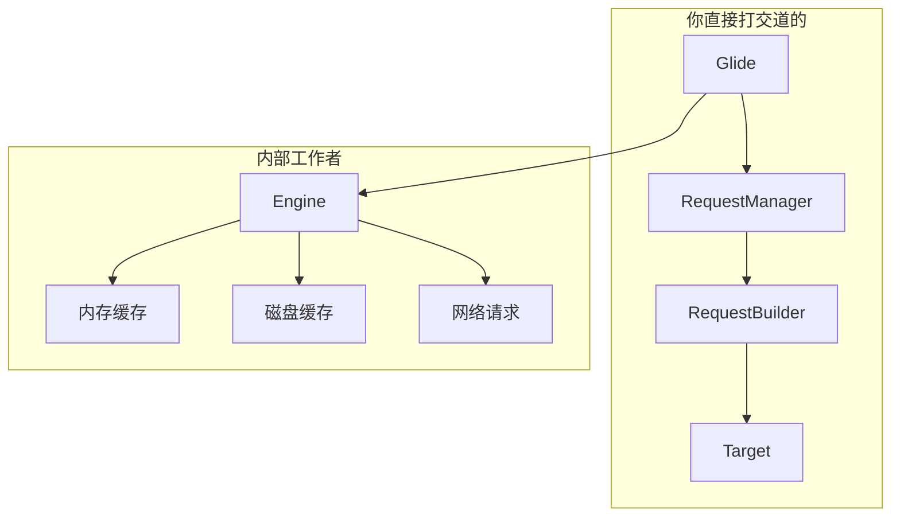
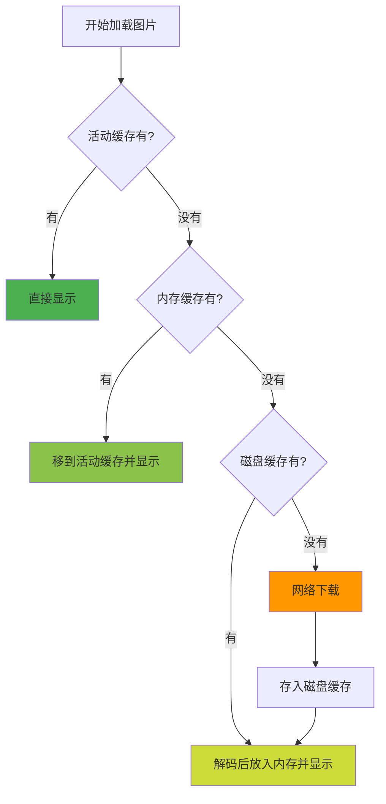

# Glide 基础篇

> 一行代码加载图片的艺术

## 一、技术演进：为什么需要图片加载框架？

### 手写图片加载有多难？

想象一下，你要手写一个图片加载功能，需要处理：

1. **网络请求**：开线程下载图片
2. **内存管理**：Bitmap 占用内存巨大，不处理就 OOM
3. **磁盘缓存**：下次打开不用重新下载
4. **内存缓存**：快速显示已加载的图片
5. **生命周期**：Activity 销毁了还在加载？内存泄漏！
6. **列表复用**：ViewHolder 复用导致图片错位
7. **图片变换**：圆角、圆形、高斯模糊...
8. **格式支持**：JPG、PNG、GIF、WebP...

**如果手写，至少需要 1000+ 行代码，还容易出 Bug。**

用 Glide 呢？一行代码：

```kotlin
Glide.with(context).load(url).into(imageView)
```

### 图片加载框架演进史



## 二、什么是 Glide？

### 定义

Glide 是一个快速高效的 Android 图片加载库，由 Google 开发和维护，专注于**平滑滚动**和**内存效率**。

### 通俗理解

把 Glide 想象成一个**超级快递员**：

- 你告诉他要什么图片（URL）
- 他先看看自己口袋有没有（内存缓存）
- 没有就看看仓库有没有（磁盘缓存）
- 都没有就去网上买（网络下载）
- 买回来还会自动裁剪成你要的尺寸
- 最后送到你家门口（ImageView）

而且这个快递员很聪明：
- 你搬家了（Activity 销毁），他自动取消配送
- 你家门口没人（ImageView 被回收），他不会傻等

## 三、核心组件



| 组件 | 作用 | 生活类比 |
|-----|------|---------|
| Glide | 入口，全局配置 | 快递公司总部 |
| RequestManager | 管理请求，绑定生命周期 | 你的专属快递员 |
| RequestBuilder | 构建请求参数 | 填写快递单 |
| Target | 图片最终去向 | 你的收货地址 |
| Engine | 真正干活的，调度加载任务 | 物流中心 |

## 四、基本使用

### 4.1 添加依赖

```kotlin
// build.gradle.kts
plugins {
    id("com.google.devtools.ksp")
}

dependencies {
    implementation("com.github.bumptech.glide:glide:4.16.0")
    ksp("com.github.bumptech.glide:ksp:4.16.0")
}
```

### 4.2 添加权限

```xml
<!-- AndroidManifest.xml -->
<uses-permission android:name="android.permission.INTERNET" />
```

### 4.3 最简使用

```kotlin
// 一行代码加载网络图片
Glide.with(context)
    .load("https://example.com/image.jpg")
    .into(imageView)
```

这一行代码干了多少事？

1. 绑定 Activity/Fragment 生命周期
2. 检查内存缓存
3. 检查磁盘缓存
4. 网络下载（如果需要）
5. 解码 Bitmap
6. 根据 ImageView 尺寸缩放
7. 显示到 ImageView

### 4.4 完整使用示例

```kotlin
Glide.with(this)                              // 绑定生命周期
    .load(url)                                // 图片来源
    .placeholder(R.drawable.loading)          // 加载中显示
    .error(R.drawable.error)                  // 加载失败显示
    .fallback(R.drawable.empty)               // url 为 null 时显示
    .centerCrop()                             // 裁剪方式
    .transition(DrawableTransitionOptions.withCrossFade())  // 淡入效果
    .into(imageView)                          // 目标 ImageView
```

## 五、三级缓存机制

### 5.1 白话版解释

想象你在查字典：

| 缓存级别 | 类比 | 速度 | 特点 |
|---------|------|------|------|
| 活动缓存 | 你正在看的那页 | 最快 | 正在使用的图片 |
| 内存缓存 | 脑子里记住的 | 很快 | LRU 淘汰策略 |
| 磁盘缓存 | 笔记本上记的 | 较慢 | 持久化存储 |
| 网络 | 去图书馆查 | 最慢 | 原始来源 |

### 5.2 缓存读取流程



### 5.3 为什么要分活动缓存和内存缓存？

这是一个精妙的设计：

- **活动缓存**：存放正在使用的图片，不参与 LRU 淘汰
- **内存缓存**：存放用过但当前不用的图片，LRU 淘汰

**好处**：正在显示的图片不会被意外回收！

比如你在滑动列表，屏幕上正在显示的图片在活动缓存里，不会因为内存紧张被回收，滑出屏幕后才移到内存缓存。

## 六、生命周期绑定

### 6.1 为什么需要生命周期绑定？

考虑这个场景：
1. 用户打开页面，开始加载一张大图
2. 图片还没加载完，用户按了返回键
3. Activity 销毁了
4. 图片加载完成，试图显示到已销毁的 ImageView

**不处理的后果**：内存泄漏 + 可能崩溃

### 6.2 Glide 的解决方案

```kotlin
// 传入 Activity
Glide.with(activity).load(url).into(imageView)

// 传入 Fragment
Glide.with(fragment).load(url).into(imageView)

// 传入 Context（不推荐）
Glide.with(context).load(url).into(imageView)
```

**Glide 会根据传入的参数自动绑定生命周期：**

| 传入参数 | 生命周期绑定 |
|---------|-------------|
| Activity | 跟随 Activity 生命周期 |
| Fragment | 跟随 Fragment 生命周期 |
| View | 跟随 View 所在 Activity |
| Application | 应用级，不自动取消 |

### 6.3 最佳实践

```kotlin
// ✅ 推荐：传入 Activity 或 Fragment
Glide.with(this).load(url).into(imageView)

// ❌ 避免：在 Activity 里传 applicationContext
// 这样图片请求不会随 Activity 销毁而取消
Glide.with(applicationContext).load(url).into(imageView)
```

## 七、占位图详解

```kotlin
Glide.with(context)
    .load(url)
    .placeholder(R.drawable.loading)  // 加载中
    .error(R.drawable.error)          // 加载失败
    .fallback(R.drawable.empty)       // url 为 null
    .into(imageView)
```

| 参数 | 触发时机 | 使用场景 |
|-----|---------|---------|
| placeholder | 加载过程中 | 显示 loading 动画或默认图 |
| error | 加载失败（网络错误、图片损坏等） | 显示错误提示图 |
| fallback | url 为 null 或空字符串 | 显示"暂无图片" |

**三者的区别用一个例子说明：**

```kotlin
val url: String? = getUserAvatar()  // 可能返回 null

Glide.with(context)
    .load(url)
    .placeholder(R.drawable.loading)   // url 不为 null，正在加载
    .fallback(R.drawable.no_avatar)    // url 为 null，用户没设置头像
    .error(R.drawable.load_failed)     // url 不为 null，但加载失败了
    .into(avatarView)
```

## 八、图片变换（Transformation）

### 8.1 内置变换

```kotlin
// 居中裁剪（填满 ImageView，可能裁掉部分图片）
Glide.with(context).load(url).centerCrop().into(imageView)

// 居中适配（完整显示图片，可能留白）
Glide.with(context).load(url).fitCenter().into(imageView)

// 圆形裁剪
Glide.with(context).load(url).circleCrop().into(imageView)
```

### 8.2 变换对比图

```
原图 (100x200)     ImageView (100x100)

┌──────┐           centerCrop        fitCenter         circleCrop
│      │           ┌──────┐          ┌──────┐          ┌──────┐
│      │    →      │ 裁剪 │          │ 留白 │          │  ○   │
│      │           │ 部分 │          │ 完整 │          │      │
│      │           └──────┘          └──────┘          └──────┘
└──────┘
```

## 九、横向对比：Glide vs 其他框架

| 特性 | Glide | Picasso | Coil | Fresco |
|-----|-------|---------|------|--------|
| 维护方 | Google | Square | Coil | Facebook |
| 语言 | Java | Java | Kotlin | Java |
| GIF 支持 | ✅ 原生支持 | ❌ 需要额外库 | ✅ 原生支持 | ✅ 原生支持 |
| 生命周期 | ✅ 自动绑定 | ❌ 手动管理 | ✅ 自动绑定 | ✅ 自动绑定 |
| 内存优化 | ✅ Bitmap 复用 | ⚠️ 一般 | ✅ Bitmap 复用 | ✅✅ Ashmem |
| 包大小 | ~500KB | ~120KB | ~200KB | ~3MB |
| 协程支持 | ⚠️ 需封装 | ❌ | ✅ 原生支持 | ❌ |
| 学习曲线 | 低 | 低 | 低 | 中 |

### 如何选择？

| 场景 | 推荐框架 | 原因 |
|-----|---------|------|
| 大多数项目 | **Glide** | Google 推荐，功能全面，社区活跃 |
| 纯 Kotlin 项目 | **Coil** | 协程原生支持，更现代 |
| 需要极致内存控制 | Fresco | Ashmem 内存优化 |
| 追求极小包体积 | Picasso | 最小的库 |

## 十、在 RecyclerView 中使用

### 10.1 基本用法

```kotlin
class MyAdapter : RecyclerView.Adapter<MyAdapter.ViewHolder>() {
    
    override fun onBindViewHolder(holder: ViewHolder, position: Int) {
        val item = items[position]
        
        Glide.with(holder.itemView)
            .load(item.imageUrl)
            .placeholder(R.drawable.placeholder)
            .into(holder.imageView)
    }
}
```

### 10.2 图片错位问题

**问题**：快速滑动列表，图片显示错位。

**原因**：ViewHolder 复用，旧图片请求完成后显示到了新的位置。

**解决方案**：Glide 已经自动处理！

当你调用 `into(imageView)` 时，Glide 会：
1. 取消该 ImageView 之前的请求
2. 开始新的请求

**但如果你手动操作 ImageView，需要注意：**

```kotlin
override fun onBindViewHolder(holder: ViewHolder, position: Int) {
    // ✅ Glide 自动取消旧请求
    Glide.with(holder.itemView)
        .load(item.imageUrl)
        .into(holder.imageView)
}

override fun onViewRecycled(holder: ViewHolder) {
    // 可选：清除请求（一般不需要）
    Glide.with(holder.itemView).clear(holder.imageView)
}
```

## 十一、常见问题与解决方案

### 11.1 图片不显示

**排查步骤**：

1. 检查网络权限
```xml
<uses-permission android:name="android.permission.INTERNET" />
```

2. 检查 URL 是否正确
```kotlin
Log.d("Glide", "Loading: $url")
```

3. 检查 HTTPS 证书（如果是自签名证书）

4. 添加错误监听
```kotlin
Glide.with(context)
    .load(url)
    .listener(object : RequestListener<Drawable> {
        override fun onLoadFailed(e: GlideException?, ...): Boolean {
            Log.e("Glide", "Load failed", e)
            return false
        }
        override fun onResourceReady(...): Boolean = false
    })
    .into(imageView)
```

### 11.2 图片变形

```kotlin
// 图片被拉伸？使用正确的 ScaleType
Glide.with(context)
    .load(url)
    .centerCrop()  // 或 fitCenter()
    .into(imageView)

// ImageView 也要设置
imageView.scaleType = ImageView.ScaleType.CENTER_CROP
```

### 11.3 加载本地图片

```kotlin
// 加载 drawable
Glide.with(context).load(R.drawable.image).into(imageView)

// 加载 assets
Glide.with(context).load("file:///android_asset/image.png").into(imageView)

// 加载文件
Glide.with(context).load(File("/path/to/image.jpg")).into(imageView)

// 加载 Uri
Glide.with(context).load(uri).into(imageView)
```

## 十二、面试检验

### Q1: Glide 的三级缓存是哪三级？

**答**：活动缓存（ActiveResources）、内存缓存（MemoryCache）、磁盘缓存（DiskCache）。

- **活动缓存**：存放正在使用的图片，使用弱引用，不参与 LRU 淘汰
- **内存缓存**：存放用过但当前不用的图片，LRU 淘汰策略
- **磁盘缓存**：持久化存储，支持原始数据和处理后数据的缓存

### Q2: Glide 如何绑定生命周期？

**答**：Glide 会向 Activity/Fragment 添加一个空的 Fragment（RequestManagerFragment），通过这个 Fragment 监听生命周期回调。

当 Activity onStop 时暂停请求，onDestroy 时取消请求，避免内存泄漏。

### Q3: Glide 如何解决列表图片错位问题？

**答**：Glide 内部维护了一个 Map（Target -> Request），当对同一个 ImageView 发起新请求时，会先取消旧请求。

调用 `into(imageView)` 时，Glide 会：
1. 根据 ImageView 找到之前的请求
2. 取消之前的请求
3. 建立新的绑定关系

### Q4: placeholder、error、fallback 有什么区别？

**答**：
- `placeholder`：加载过程中显示
- `error`：加载失败时显示（网络错误、解码失败等）
- `fallback`：url 为 null 时显示

### Q5: Glide.with() 传入不同参数有什么区别？

**答**：
| 参数 | 生命周期 | 适用场景 |
|-----|---------|---------|
| Activity | 跟随 Activity | 在 Activity 中加载 |
| Fragment | 跟随 Fragment | 在 Fragment 中加载 |
| View | 跟随 View 所属 Activity | 在 Adapter 中加载 |
| Application | 应用级，不自动取消 | 后台预加载（谨慎使用） |

**最佳实践**：在 Activity/Fragment 中传 `this`，在 Adapter 中传 `holder.itemView`。

---
_本文档将持续更新，添加更多相关内容_
