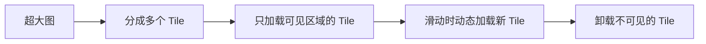

# Glide 进阶篇

> 从会用到用好，掌握 Glide 的高级技巧

## 一、磁盘缓存策略

### 1.1 DiskCacheStrategy 五种策略

```kotlin
Glide.with(context)
    .load(url)
    .diskCacheStrategy(DiskCacheStrategy.ALL)
    .into(imageView)
```

| 策略 | 缓存内容 | 适用场景 |
|-----|---------|---------|
| `ALL` | 原始图 + 处理后的图 | 默认选择，平衡速度和空间 |
| `DATA` | 只缓存原始图 | 同一图片多种尺寸显示 |
| `RESOURCE` | 只缓存处理后的图 | 图片尺寸固定，追求加载速度 |
| `AUTOMATIC` | 智能选择（默认） | 根据数据来源自动决定 |
| `NONE` | 不缓存到磁盘 | 临时图片、隐私图片 |

### 1.2 缓存 Key 的生成

**为什么同一张图片不同尺寸会缓存两份？**

Glide 的缓存 Key 包含：
- 图片 URL
- 宽度
- 高度
- Transformation
- 其他配置参数

```kotlin
// 这两个请求会生成不同的缓存 Key
Glide.with(context).load(url).override(100, 100).into(imageView1)
Glide.with(context).load(url).override(200, 200).into(imageView2)
```

**实战建议**：如果同一张图片在多处显示，尺寸差异大，考虑用 `DiskCacheStrategy.DATA` 只缓存原图。

### 1.3 跳过缓存

```kotlin
// 跳过内存缓存
Glide.with(context)
    .load(url)
    .skipMemoryCache(true)
    .into(imageView)

// 跳过磁盘缓存
Glide.with(context)
    .load(url)
    .diskCacheStrategy(DiskCacheStrategy.NONE)
    .into(imageView)

// 两个都跳过（强制从网络加载）
Glide.with(context)
    .load(url)
    .skipMemoryCache(true)
    .diskCacheStrategy(DiskCacheStrategy.NONE)
    .into(imageView)
```

**使用场景**：
- 头像更新后强制刷新
- 验证码图片
- 需要实时更新的图片

## 二、自定义 Transformation

### 2.1 内置 Transformation

```kotlin
// 圆角
Glide.with(context)
    .load(url)
    .transform(RoundedCorners(16.dp))
    .into(imageView)

// 圆形
Glide.with(context)
    .load(url)
    .circleCrop()
    .into(imageView)

// 多个变换组合
Glide.with(context)
    .load(url)
    .transform(
        CenterCrop(),
        RoundedCorners(16.dp)
    )
    .into(imageView)
```

### 2.2 使用 glide-transformations 库

```kotlin
// build.gradle.kts
implementation("jp.wasabeef:glide-transformations:4.3.0")
```

```kotlin
// 高斯模糊
Glide.with(context)
    .load(url)
    .transform(BlurTransformation(25, 3))
    .into(imageView)

// 灰度
Glide.with(context)
    .load(url)
    .transform(GrayscaleTransformation())
    .into(imageView)

// 圆角（可指定哪些角）
Glide.with(context)
    .load(url)
    .transform(
        RoundedCornersTransformation(
            16.dp, 0,
            RoundedCornersTransformation.CornerType.TOP
        )
    )
    .into(imageView)
```

### 2.3 自定义 Transformation

```kotlin
class BorderTransformation(
    private val borderWidth: Int,
    private val borderColor: Int
) : BitmapTransformation() {

    override fun transform(
        pool: BitmapPool,
        source: Bitmap,
        outWidth: Int,
        outHeight: Int
    ): Bitmap {
        val width = source.width
        val height = source.height
        
        val result = pool.get(width, height, Bitmap.Config.ARGB_8888)
        val canvas = Canvas(result)
        
        // 绘制原图
        canvas.drawBitmap(source, 0f, 0f, null)
        
        // 绘制边框
        val paint = Paint().apply {
            style = Paint.Style.STROKE
            strokeWidth = borderWidth.toFloat()
            color = borderColor
        }
        canvas.drawRect(0f, 0f, width.toFloat(), height.toFloat(), paint)
        
        return result
    }

    override fun updateDiskCacheKey(messageDigest: MessageDigest) {
        messageDigest.update("BorderTransformation".toByteArray())
    }
}

// 使用
Glide.with(context)
    .load(url)
    .transform(BorderTransformation(4, Color.RED))
    .into(imageView)
```

## 三、Generated API（@GlideModule）

### 3.1 为什么需要 Generated API？

**问题**：每次都要写一堆配置，很繁琐

```kotlin
// 没有 Generated API
Glide.with(context)
    .load(url)
    .placeholder(R.drawable.loading)
    .error(R.drawable.error)
    .centerCrop()
    .transform(RoundedCorners(16))
    .into(imageView)
```

**解决方案**：使用 Generated API 封装常用配置

### 3.2 创建 AppGlideModule

```kotlin
@GlideModule
class MyAppGlideModule : AppGlideModule() {
    
    override fun applyOptions(context: Context, builder: GlideBuilder) {
        // 全局配置
        builder.setMemoryCache(LruResourceCache(20 * 1024 * 1024))  // 20MB 内存缓存
        builder.setDiskCache(InternalCacheDiskCacheFactory(context, 100 * 1024 * 1024))  // 100MB 磁盘缓存
    }

    override fun registerComponents(context: Context, glide: Glide, registry: Registry) {
        // 注册自定义组件
    }
    
    override fun isManifestParsingEnabled(): Boolean = false
}
```

### 3.3 创建 GlideExtension

```kotlin
@GlideExtension
object MyGlideExtension {
    
    @GlideOption
    @JvmStatic
    fun avatar(options: BaseRequestOptions<*>): BaseRequestOptions<*> {
        return options
            .circleCrop()
            .placeholder(R.drawable.avatar_placeholder)
            .error(R.drawable.avatar_error)
    }
    
    @GlideOption
    @JvmStatic
    fun banner(options: BaseRequestOptions<*>): BaseRequestOptions<*> {
        return options
            .centerCrop()
            .placeholder(R.drawable.banner_placeholder)
            .transform(RoundedCorners(16))
    }
}
```

### 3.4 使用 Generated API

编译后自动生成 `GlideApp` 类：

```kotlin
// 使用封装好的配置
GlideApp.with(context)
    .load(url)
    .avatar()  // 一行代码搞定头像配置
    .into(avatarView)

GlideApp.with(context)
    .load(url)
    .banner()  // 一行代码搞定 banner 配置
    .into(bannerView)
```

## 四、预加载

### 4.1 preload() - 预加载到缓存

```kotlin
// 预加载到内存和磁盘缓存
Glide.with(context)
    .load(url)
    .preload()

// 指定尺寸预加载
Glide.with(context)
    .load(url)
    .preload(500, 500)
```

**使用场景**：
- 进入详情页前预加载大图
- 列表滑动时预加载即将显示的图片

### 4.2 downloadOnly() - 只下载不解码

```kotlin
// 只下载到磁盘，不解码到内存
Glide.with(context)
    .downloadOnly()
    .load(url)
    .submit()
```

**使用场景**：
- 后台批量下载图片
- 节省内存的预下载

### 4.3 在 RecyclerView 中预加载

```kotlin
class PreloadHelper(
    private val recyclerView: RecyclerView,
    private val preloadCount: Int = 5
) {
    fun preload(urls: List<String>, firstVisiblePosition: Int) {
        // 预加载即将显示的图片
        for (i in 1..preloadCount) {
            val position = firstVisiblePosition + i
            if (position < urls.size) {
                Glide.with(recyclerView)
                    .load(urls[position])
                    .preload()
            }
        }
    }
}

// 监听滚动，预加载
recyclerView.addOnScrollListener(object : RecyclerView.OnScrollListener() {
    override fun onScrolled(recyclerView: RecyclerView, dx: Int, dy: Int) {
        val layoutManager = recyclerView.layoutManager as LinearLayoutManager
        val firstVisible = layoutManager.findFirstVisibleItemPosition()
        preloadHelper.preload(urls, firstVisible)
    }
})
```

## 五、请求监听

### 5.1 RequestListener

```kotlin
Glide.with(context)
    .load(url)
    .listener(object : RequestListener<Drawable> {
        override fun onLoadFailed(
            e: GlideException?,
            model: Any?,
            target: Target<Drawable>,
            isFirstResource: Boolean
        ): Boolean {
            Log.e("Glide", "加载失败: ${e?.message}")
            // 返回 false 表示继续传递，显示 error 占位图
            // 返回 true 表示已处理，不显示 error 占位图
            return false
        }

        override fun onResourceReady(
            resource: Drawable,
            model: Any,
            target: Target<Drawable>?,
            dataSource: DataSource,
            isFirstResource: Boolean
        ): Boolean {
            Log.d("Glide", "加载成功，来源: $dataSource")
            // dataSource: MEMORY_CACHE / REMOTE / DATA_DISK_CACHE / RESOURCE_DISK_CACHE
            return false
        }
    })
    .into(imageView)
```

### 5.2 获取加载结果

```kotlin
// 异步获取 Bitmap
Glide.with(context)
    .asBitmap()
    .load(url)
    .into(object : CustomTarget<Bitmap>() {
        override fun onResourceReady(resource: Bitmap, transition: Transition<in Bitmap>?) {
            // 拿到 Bitmap 可以做任何事
            val palette = Palette.from(resource).generate()
        }

        override fun onLoadCleared(placeholder: Drawable?) {
            // 清理资源
        }
    })

// 同步获取（需要在后台线程）
val bitmap = Glide.with(context)
    .asBitmap()
    .load(url)
    .submit(500, 500)
    .get()  // 阻塞获取
```

## 六、性能优化

### 6.1 图片尺寸优化

```kotlin
// 指定加载尺寸，避免加载过大图片
Glide.with(context)
    .load(url)
    .override(300, 300)  // 只加载 300x300
    .into(imageView)

// 降低图片质量
Glide.with(context)
    .load(url)
    .format(DecodeFormat.PREFER_RGB_565)  // 从 ARGB_8888 降到 RGB_565
    .into(imageView)
```

**内存对比**：
| 格式 | 每像素内存 | 1000x1000 图片 |
|-----|----------|---------------|
| ARGB_8888 | 4 字节 | 4MB |
| RGB_565 | 2 字节 | 2MB |

### 6.2 列表滑动优化

```kotlin
// 滑动时暂停加载，停止时恢复
recyclerView.addOnScrollListener(object : RecyclerView.OnScrollListener() {
    override fun onScrollStateChanged(recyclerView: RecyclerView, newState: Int) {
        when (newState) {
            RecyclerView.SCROLL_STATE_IDLE -> {
                Glide.with(context).resumeRequests()
            }
            RecyclerView.SCROLL_STATE_DRAGGING,
            RecyclerView.SCROLL_STATE_SETTLING -> {
                Glide.with(context).pauseRequests()
            }
        }
    }
})
```

### 6.3 内存优化

```kotlin
// 在 Application 中配置
@GlideModule
class MyAppGlideModule : AppGlideModule() {
    
    override fun applyOptions(context: Context, builder: GlideBuilder) {
        // 根据内存调整缓存大小
        val calculator = MemorySizeCalculator.Builder(context)
            .setMemoryCacheScreens(2f)  // 默认是 2 屏
            .setBitmapPoolScreens(3f)   // 默认是 4 屏
            .build()
        
        builder.setMemoryCache(LruResourceCache(calculator.memoryCacheSize.toLong()))
        builder.setBitmapPool(LruBitmapPool(calculator.bitmapPoolSize.toLong()))
    }
}
```

### 6.4 清理缓存

```kotlin
// 清理内存缓存（必须在主线程）
Glide.get(context).clearMemory()

// 清理磁盘缓存（必须在后台线程）
Thread {
    Glide.get(context).clearDiskCache()
}.start()
```

## 七、大图加载

### 7.1 问题分析

**问题**：加载超大图（如 10000x5000 的全景图）会 OOM

**原因**：
- 图片解码后占用内存 = 宽 × 高 × 每像素字节数
- 10000 × 5000 × 4 = 200MB！

### 7.2 解决方案：分片加载

推荐使用 [SubsamplingScaleImageView](https://github.com/davemorrissey/subsampling-scale-image-view)：

```kotlin
// build.gradle.kts
implementation("com.davemorrissey.labs:subsampling-scale-image-view-androidx:3.10.0")
```

```kotlin
// 加载本地大图
subsamplingImageView.setImage(ImageSource.uri("/path/to/large-image.jpg"))

// 配合 Glide 先下载到本地
Glide.with(context)
    .downloadOnly()
    .load(url)
    .into(object : CustomTarget<File>() {
        override fun onResourceReady(resource: File, transition: Transition<in File>?) {
            subsamplingImageView.setImage(ImageSource.uri(resource.absolutePath))
        }
        override fun onLoadCleared(placeholder: Drawable?) {}
    })
```

### 7.3 原理



## 八、GIF 加载

### 8.1 基本使用

```kotlin
// 自动识别 GIF
Glide.with(context)
    .load(gifUrl)
    .into(imageView)

// 强制作为 GIF 加载
Glide.with(context)
    .asGif()
    .load(gifUrl)
    .into(imageView)

// 只加载第一帧（节省内存）
Glide.with(context)
    .asBitmap()
    .load(gifUrl)
    .into(imageView)
```

### 8.2 GIF 性能优化

```kotlin
// 问题：GIF 很耗内存和 CPU

// 解决方案 1：降低质量
Glide.with(context)
    .asGif()
    .load(gifUrl)
    .format(DecodeFormat.PREFER_RGB_565)
    .into(imageView)

// 解决方案 2：指定尺寸
Glide.with(context)
    .asGif()
    .load(gifUrl)
    .override(200, 200)
    .into(imageView)

// 解决方案 3：列表中只显示第一帧
Glide.with(context)
    .asBitmap()  // 只加载第一帧
    .load(gifUrl)
    .into(imageView)
```

## 九、边界认知：Glide 不适合的场景

| 场景 | 问题 | 替代方案 |
|-----|------|---------|
| 超大图（全景图、地图） | OOM | SubsamplingScaleImageView |
| 需要精细控制的图片编辑 | 功能有限 | Android Bitmap API |
| 视频缩略图（大量） | 效率不够高 | MediaMetadataRetriever + 自定义缓存 |
| 纯 Kotlin 项目追求现代化 | Java 代码风格 | Coil |
| 5.0 以下系统的内存优化 | Ashmem 不支持 | Fresco |

## 十、实战经验

### 10.1 图片 URL 带 Token 导致缓存失效

**问题**：
```kotlin
// 每次 Token 不同，缓存永远命中不了
val url = "https://example.com/image.jpg?token=abc123"
```

**解决方案**：自定义 Cache Key

```kotlin
Glide.with(context)
    .load(GlideUrl(url, LazyHeaders.Builder().build()))
    .signature(ObjectKey("image_unique_id"))  // 使用稳定的 ID 作为缓存 Key
    .into(imageView)
```

### 10.2 HTTPS 证书问题

```kotlin
@GlideModule
class UnsafeGlideModule : AppGlideModule() {
    override fun registerComponents(context: Context, glide: Glide, registry: Registry) {
        // 信任所有证书（仅开发环境使用！）
        val unsafeOkHttpClient = OkHttpClient.Builder()
            .sslSocketFactory(unsafeSslSocketFactory, unsafeTrustManager)
            .hostnameVerifier { _, _ -> true }
            .build()
        
        registry.replace(
            GlideUrl::class.java,
            InputStream::class.java,
            OkHttpUrlLoader.Factory(unsafeOkHttpClient)
        )
    }
}
```

### 10.3 加载进度监听

```kotlin
// 需要配合 OkHttp 使用
@GlideModule
class ProgressGlideModule : AppGlideModule() {
    override fun registerComponents(context: Context, glide: Glide, registry: Registry) {
        val okHttpClient = OkHttpClient.Builder()
            .addInterceptor(ProgressInterceptor())
            .build()
        registry.replace(GlideUrl::class.java, InputStream::class.java,
            OkHttpUrlLoader.Factory(okHttpClient))
    }
}

// 监听进度
ProgressInterceptor.addListener(url) { progress ->
    progressBar.progress = progress
}

Glide.with(context)
    .load(url)
    .into(object : CustomTarget<Drawable>() {
        override fun onResourceReady(resource: Drawable, transition: Transition<in Drawable>?) {
            imageView.setImageDrawable(resource)
            ProgressInterceptor.removeListener(url)
        }
        override fun onLoadCleared(placeholder: Drawable?) {}
    })
```

## 十一、面试检验

### Q1: Glide 的缓存 Key 包含哪些因素？

**答**：
- 图片 URL
- 宽度、高度（override 或 ImageView 尺寸）
- Transformation（centerCrop、roundedCorners 等）
- Signature（自定义签名）
- 其他 Options

**延伸**：这就是为什么同一张图片不同尺寸会缓存两份，如果想复用，用 `DiskCacheStrategy.DATA` 只缓存原图。

### Q2: 如何实现 Glide 加载进度监听？

**答**：Glide 本身不支持进度监听，需要配合 OkHttp 的 Interceptor 实现。

1. 创建自定义 Interceptor，拦截 Response
2. 包装 ResponseBody，在 read 时计算进度
3. 通过回调或 EventBus 通知 UI

### Q3: DiskCacheStrategy 有哪几种？分别适合什么场景？

**答**：

| 策略 | 适用场景 |
|-----|---------|
| ALL | 默认选择，缓存原图和处理后的图 |
| DATA | 同一图片多种尺寸显示 |
| RESOURCE | 图片尺寸固定，追求加载速度 |
| AUTOMATIC | 智能选择（默认值） |
| NONE | 临时图片、隐私图片 |

### Q4: RecyclerView 快速滑动时如何优化 Glide？

**答**：
1. **滑动时暂停加载**：`Glide.with(context).pauseRequests()`
2. **预加载**：`preload()` 提前加载即将显示的图片
3. **降低图片质量**：`DecodeFormat.PREFER_RGB_565`
4. **指定合适尺寸**：`override()` 避免加载过大图片
5. **取消不可见的请求**：`onViewRecycled` 中 `Glide.with().clear()`

### Q5: Generated API 有什么优势？

**答**：
1. **代码简洁**：封装常用配置，一行代码搞定
2. **类型安全**：编译时检查，避免运行时错误
3. **统一配置**：全局配置集中管理，易于维护
4. **链式调用**：保持 Glide 流式 API 风格

### Q6: 如何处理图片 URL 带动态参数导致缓存失效？

**答**：使用 `signature()` 提供稳定的缓存 Key：

```kotlin
Glide.with(context)
    .load(urlWithToken)
    .signature(ObjectKey(imageId))  // 使用稳定的图片 ID
    .into(imageView)
```

### Q7: 加载超大图（全景图）应该怎么处理？

**答**：Glide 不适合加载超大图，会 OOM。

推荐方案：
1. 使用 SubsamplingScaleImageView 分片加载
2. 原理：只加载当前可见区域的 Tile，滑动时动态加载卸载
3. 配合 Glide 的 `downloadOnly()` 先下载到本地

### Q8: skipMemoryCache(true) 和 diskCacheStrategy(NONE) 的区别？

**答**：
| 方法 | 作用 | 读缓存 | 写缓存 |
|-----|------|-------|-------|
| skipMemoryCache(true) | 跳过内存缓存 | ❌ | ❌ |
| diskCacheStrategy(NONE) | 跳过磁盘缓存 | ❌ | ❌ |

**注意**：两者是独立的，需要同时设置才能完全跳过缓存。

---
_本文档将持续更新，添加更多相关内容_
