# Glide 源码篇

> 深入理解 Glide 的设计哲学与核心原理

## 一、整体架构

### 1.1 Glide 的分层设计

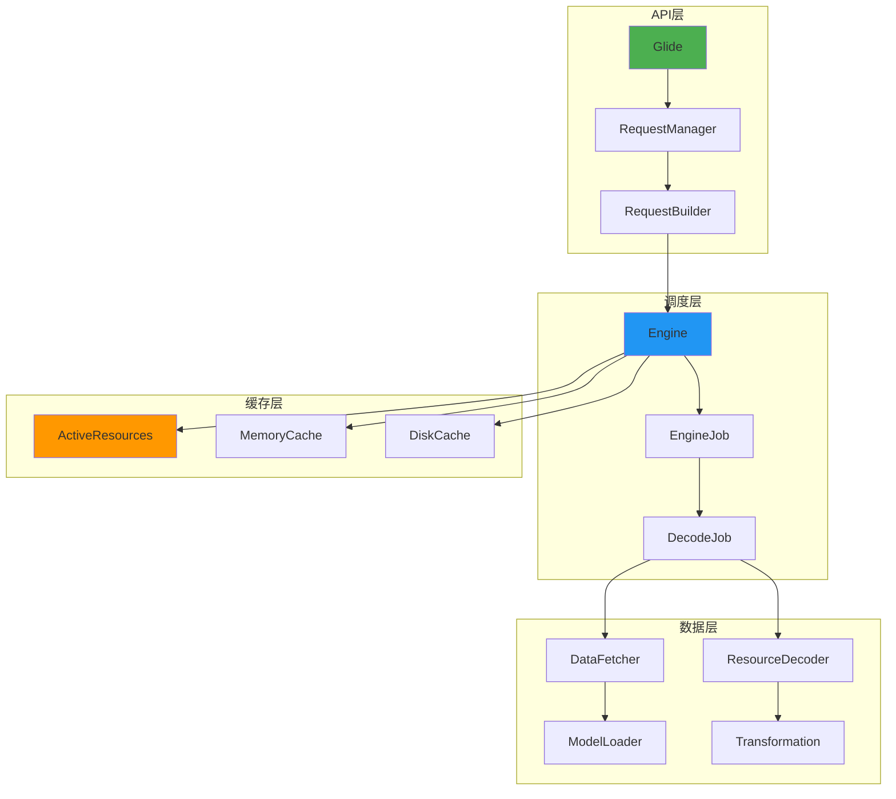

### 1.2 设计哲学

| 设计原则 | 体现 |
|---------|------|
| **单一职责** | 每个类只做一件事：ModelLoader 负责转换、Decoder 负责解码 |
| **开闭原则** | 通过 Registry 注册机制，新增格式无需修改核心代码 |
| **依赖倒置** | 上层依赖抽象接口，不依赖具体实现 |
| **建造者模式** | RequestBuilder 链式构建请求 |
| **享元模式** | BitmapPool 复用 Bitmap 对象 |

## 二、with() 原理：生命周期绑定

### 2.1 一句话总结

`Glide.with()` 通过向 Activity/Fragment 添加一个隐藏的空 Fragment，借助该 Fragment 的生命周期回调来管理图片请求。

### 2.2 核心流程

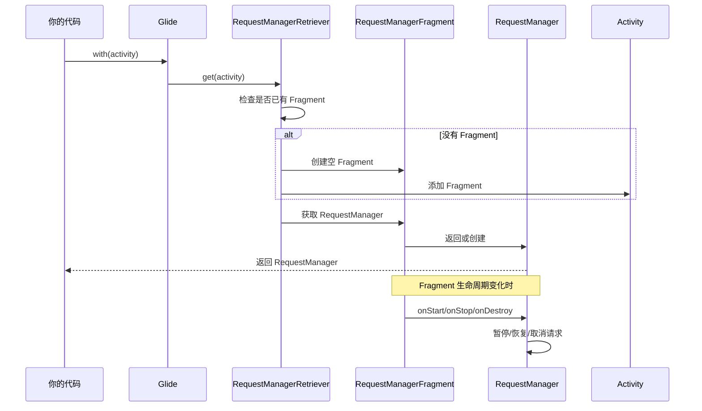

### 2.3 关键源码解析

```kotlin
// RequestManagerRetriever.get()
fun get(activity: FragmentActivity): RequestManager {
    if (isOnBackgroundThread()) {
        return get(activity.applicationContext)  // 后台线程用 Application 级
    }
    
    val fm = activity.supportFragmentManager
    return supportFragmentGet(activity, fm)
}

private fun supportFragmentGet(context: Context, fm: FragmentManager): RequestManager {
    // 1. 尝试获取已存在的 Fragment
    var fragment = fm.findFragmentByTag(FRAGMENT_TAG) as? SupportRequestManagerFragment
    
    if (fragment == null) {
        // 2. 创建新的空 Fragment
        fragment = SupportRequestManagerFragment()
        fm.beginTransaction().add(fragment, FRAGMENT_TAG).commitAllowingStateLoss()
    }
    
    // 3. 从 Fragment 获取 RequestManager
    return fragment.requestManager ?: createRequestManager(fragment)
}
```

### 2.4 设计亮点

| 亮点 | 说明 |
|-----|------|
| **无侵入式** | 不需要修改 Activity/Fragment 代码 |
| **自动管理** | 开发者无需关心生命周期 |
| **去重机制** | 同一个 Activity 只创建一个 Fragment |
| **线程安全** | 后台线程自动降级为 Application 级 |

### 2.5 延伸思考

**Q: 为什么不直接用 Lifecycle 组件？**

**A**: Glide 诞生时 Lifecycle 组件还不存在（Glide 2014年，Lifecycle 2017年）。现在的设计已经稳定，改动成本大于收益。Coil 就是用 Lifecycle 实现的。

## 三、load() 原理：建造者模式

### 3.1 一句话总结

`load()` 创建一个 `RequestBuilder`，通过链式调用收集所有配置参数，不执行任何实际操作。

### 3.2 核心流程

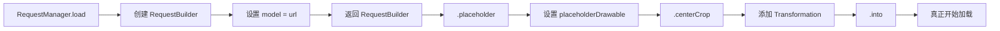

### 3.3 RequestBuilder 的设计

```kotlin
class RequestBuilder<TranscodeType> {
    private var model: Any? = null                    // 图片来源
    private var placeholderDrawable: Drawable? = null // 占位图
    private var errorDrawable: Drawable? = null       // 错误图
    private var transformations = mutableListOf<Transformation>()
    private var diskCacheStrategy: DiskCacheStrategy? = null
    private var skipMemoryCache = false
    // ... 更多配置
    
    fun load(model: Any?): RequestBuilder<TranscodeType> {
        this.model = model
        return this  // 返回自身，支持链式调用
    }
    
    fun placeholder(drawable: Drawable?): RequestBuilder<TranscodeType> {
        this.placeholderDrawable = drawable
        return this
    }
    
    // into() 才真正触发加载
    fun into(target: Target<TranscodeType>): Target<TranscodeType> {
        // 构建 Request 并开始加载
    }
}
```

### 3.4 设计亮点

| 亮点 | 说明 |
|-----|------|
| **延迟执行** | 收集配置不执行，into() 才开始 |
| **链式调用** | 返回 this，代码简洁优雅 |
| **类型安全** | 泛型保证类型正确 |
| **默认值** | 合理的默认配置，开箱即用 |

## 四、into() 原理：真正的入口

### 4.1 一句话总结

`into()` 是加载的触发点，它将 ImageView 包装成 Target，构建 Request，然后交给 RequestManager 执行。

### 4.2 核心流程

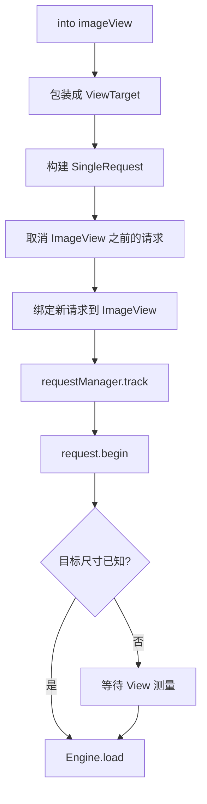

### 4.3 关键源码解析

```kotlin
// RequestBuilder.into()
fun into(view: ImageView): ViewTarget<*, *> {
    // 1. 包装 ImageView 为 Target
    val target = buildImageViewTarget(view)
    
    // 2. 构建请求
    val request = buildRequest(target)
    
    // 3. 取消之前的请求（解决图片错位问题的关键！）
    val previous = target.getRequest()
    if (previous != null && !request.isEquivalentTo(previous)) {
        requestManager.clear(target)
    }
    
    // 4. 绑定新请求
    target.setRequest(request)
    
    // 5. 交给 RequestManager 执行
    requestManager.track(target, request)
    
    return target
}

// Target 和 Request 的绑定存储在 View.setTag() 中
// 这就是为什么同一个 ImageView 新请求会取消旧请求
```

### 4.4 图片错位问题的解决

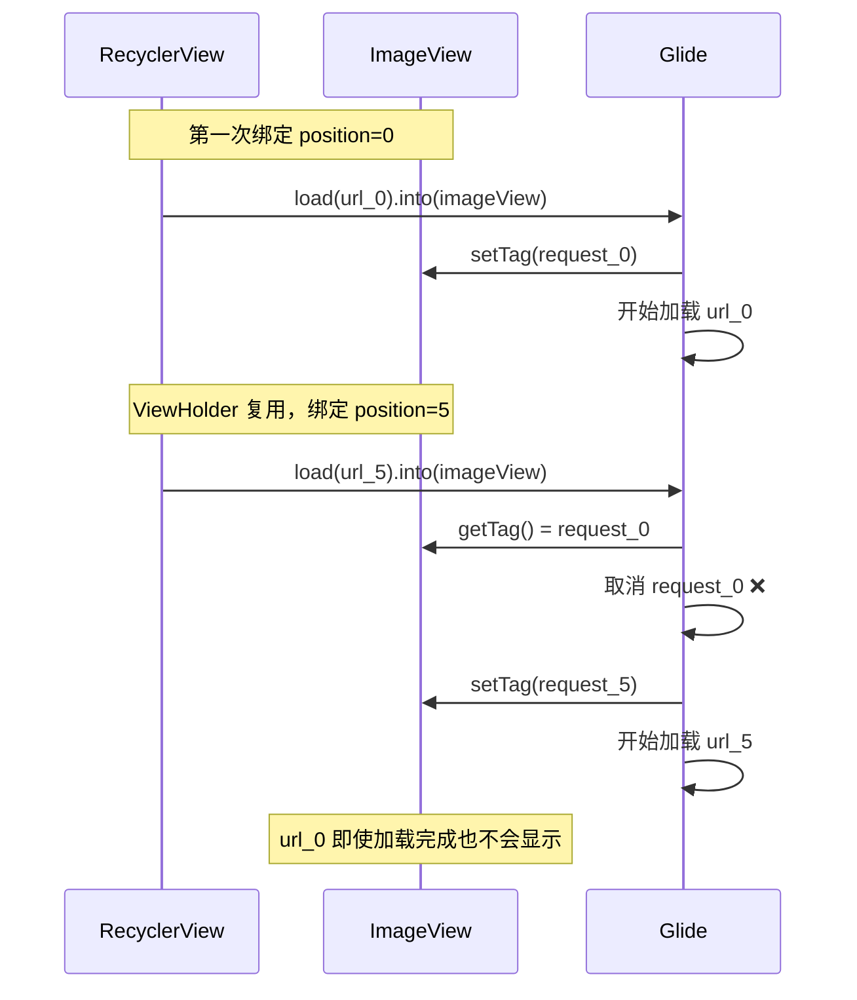

## 五、Engine 机制：任务调度中心

### 5.1 一句话总结

Engine 是 Glide 的心脏，负责缓存查询、任务创建、并发控制，决定图片从哪里来。

### 5.2 核心流程

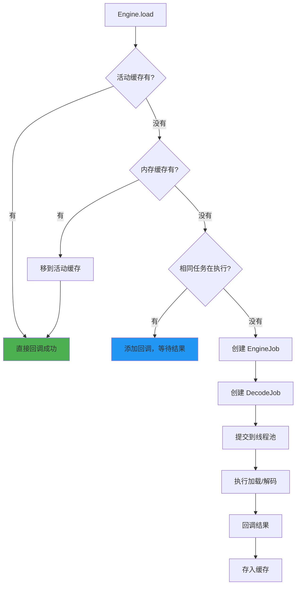

### 5.3 关键源码解析

```kotlin
// Engine.load()
fun load(key: EngineKey, ...): LoadStatus {
    // 1. 检查活动缓存
    val active = activeResources.get(key)
    if (active != null) {
        cb.onResourceReady(active)
        return null
    }
    
    // 2. 检查内存缓存
    val cached = cache.remove(key)
    if (cached != null) {
        activeResources.activate(key, cached)  // 移到活动缓存
        cb.onResourceReady(cached)
        return null
    }
    
    // 3. 检查是否有相同任务在执行
    val current = jobs.get(key)
    if (current != null) {
        current.addCallback(cb)  // 复用结果
        return LoadStatus(cb, current)
    }
    
    // 4. 创建新任务
    val engineJob = EngineJob(...)
    val decodeJob = DecodeJob(...)
    jobs.put(key, engineJob)
    engineJob.start(decodeJob)
    
    return LoadStatus(cb, engineJob)
}
```

### 5.4 设计亮点

| 亮点 | 说明 |
|-----|------|
| **三级缓存查询** | 优先使用最快的缓存 |
| **任务去重** | 相同请求复用结果，避免重复加载 |
| **线程池隔离** | 磁盘 IO 和网络请求使用不同线程池 |
| **引用计数** | 追踪资源使用，安全回收 |

## 六、缓存机制深度解析

### 6.1 三级缓存架构

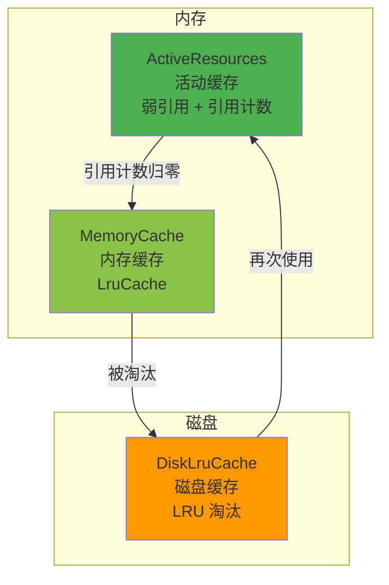

### 6.2 活动缓存（ActiveResources）

**设计目的**：保护正在使用的图片不被 LRU 淘汰

```kotlin
class ActiveResources {
    // 弱引用 Map，GC 时可被回收
    private val activeResources = HashMap<Key, WeakReference<EngineResource>>()
    
    // 引用计数，追踪使用情况
    fun activate(key: Key, resource: EngineResource) {
        resource.acquire()  // 引用计数 +1
        activeResources[key] = WeakReference(resource)
    }
    
    fun deactivate(key: Key) {
        val resource = activeResources.remove(key)?.get()
        resource?.release()  // 引用计数 -1
        if (resource?.isRecycled == false) {
            // 移到内存缓存
            cache.put(key, resource)
        }
    }
}
```

**为什么用弱引用？**

- 正常流程：引用计数归零时主动移到内存缓存
- 异常情况：如果忘记调用 release()，弱引用会被 GC 回收，避免内存泄漏

### 6.3 内存缓存（MemoryCache）

```kotlin
// 基于 LruCache 实现
class LruResourceCache(maxSize: Long) : MemoryCache {
    private val cache = LruCache<Key, EngineResource>(maxSize)
    
    override fun put(key: Key, resource: EngineResource): EngineResource? {
        return cache.put(key, resource)
    }
    
    override fun remove(key: Key): EngineResource? {
        return cache.remove(key)
    }
    
    // LRU 淘汰时的回调
    override fun onItemEvicted(key: Key, resource: EngineResource) {
        resource.recycle()  // 回收 Bitmap
    }
}
```

### 6.4 磁盘缓存（DiskCache）

```kotlin
// 两种缓存方式
enum class DiskCacheStrategy {
    DATA,      // 缓存原始数据（未解码）
    RESOURCE,  // 缓存处理后的数据（已解码 + 变换）
    ALL,       // 两者都缓存
    AUTOMATIC, // 智能选择
    NONE       // 不缓存
}

// 缓存 Key 的组成
data class DataCacheKey(
    val sourceKey: Key,  // URL 等
)

data class ResourceCacheKey(
    val sourceKey: Key,  // URL 等
    val width: Int,
    val height: Int,
    val transformation: Transformation,
    // ...
)
```

### 6.5 缓存流程图

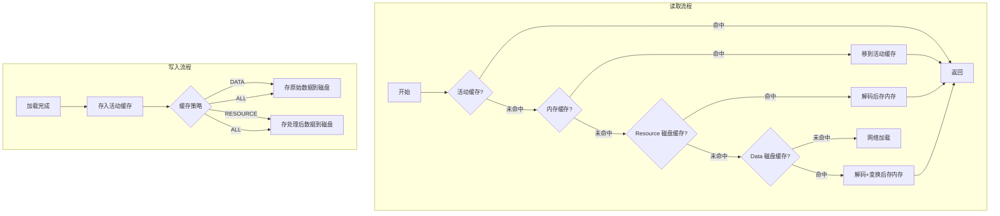

## 七、BitmapPool：Bitmap 复用

### 7.1 一句话总结

BitmapPool 维护一个 Bitmap 对象池，新解码时优先复用池中的 Bitmap，避免频繁创建销毁导致的内存抖动和 GC。

### 7.2 为什么需要 Bitmap 复用？

```kotlin
// 不复用的情况
fun loadImages(urls: List<String>) {
    urls.forEach { url ->
        val bitmap = decodeBitmap(url)  // 每次创建新 Bitmap
        imageView.setImageBitmap(bitmap)
        // 旧 Bitmap 等待 GC 回收
    }
    // 大量 Bitmap 创建销毁 → 内存抖动 → 频繁 GC → 卡顿
}
```

### 7.3 BitmapPool 的工作原理

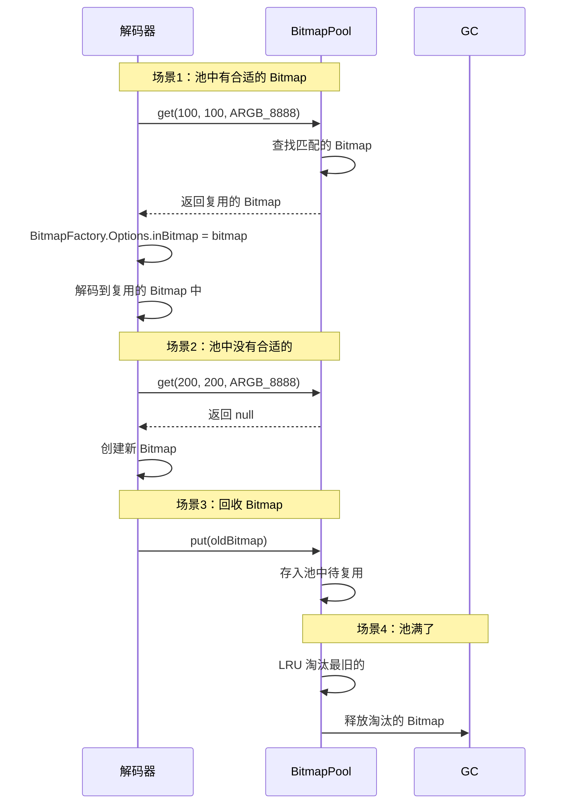

### 7.4 关键源码解析

```kotlin
// LruBitmapPool
class LruBitmapPool(maxSize: Long) : BitmapPool {
    // 按尺寸和配置分组存储
    private val groupedMap = GroupedLinkedMap<Key, Bitmap>()
    
    override fun get(width: Int, height: Int, config: Config): Bitmap {
        val key = Key(width, height, config)
        val result = groupedMap.get(key)
        
        return result ?: createBitmap(width, height, config)
    }
    
    override fun put(bitmap: Bitmap) {
        if (bitmap.isRecycled) return
        
        val key = Key(bitmap.width, bitmap.height, bitmap.config)
        groupedMap.put(key, bitmap)
        
        // 超过最大容量，LRU 淘汰
        trimToSize(maxSize)
    }
}

// 解码时使用
val options = BitmapFactory.Options().apply {
    inBitmap = bitmapPool.get(width, height, config)  // 复用！
    inMutable = true
}
val bitmap = BitmapFactory.decodeStream(stream, null, options)
```

### 7.5 设计亮点

| 亮点 | 说明 |
|-----|------|
| **尺寸匹配** | 复用时要求尺寸兼容 |
| **配置匹配** | ARGB_8888 不能复用 RGB_565 |
| **LRU 淘汰** | 池满时淘汰最少使用的 |
| **线程安全** | 同步访问池 |

## 八、线程调度

### 8.1 Glide 的线程池设计

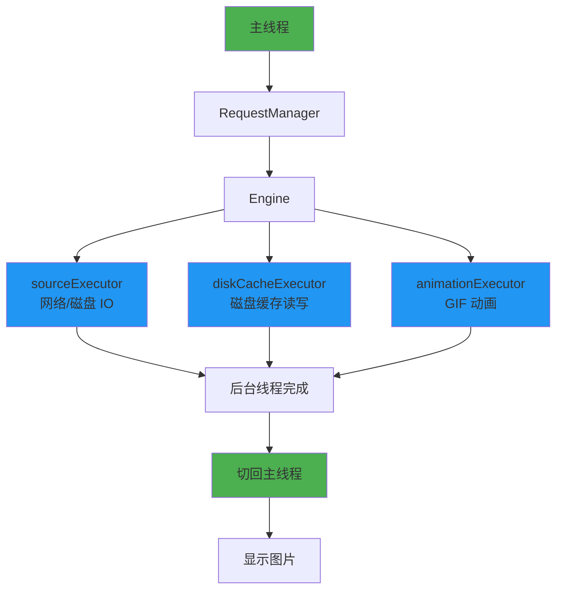

### 8.2 为什么需要多个线程池？

| 线程池 | 用途 | 特点 |
|-------|------|------|
| sourceExecutor | 网络请求、原始数据获取 | IO 密集，线程数较多 |
| diskCacheExecutor | 磁盘缓存读写 | 避免与网络争抢 |
| animationExecutor | GIF 帧解码 | 单独隔离，不影响主加载 |

### 8.3 关键源码

```kotlin
// GlideBuilder 默认配置
class GlideBuilder {
    fun build(context: Context): Glide {
        if (sourceExecutor == null) {
            sourceExecutor = GlideExecutor.newSourceExecutor()
        }
        if (diskCacheExecutor == null) {
            diskCacheExecutor = GlideExecutor.newDiskCacheExecutor()
        }
        // ...
    }
}

// GlideExecutor 线程池配置
object GlideExecutor {
    fun newSourceExecutor(): ExecutorService {
        return ThreadPoolExecutor(
            corePoolSize = 0,
            maximumPoolSize = calculateBestThreadCount(),  // CPU 核心数相关
            keepAliveTime = 30, TimeUnit.SECONDS,
            workQueue = PriorityBlockingQueue()
        )
    }
}
```

## 九、Registry 机制：可扩展的核心

### 9.1 一句话总结

Registry 是 Glide 的注册中心，通过注册不同的 ModelLoader、Decoder、Encoder，实现对任意数据源和格式的支持。

### 9.2 Registry 的组成

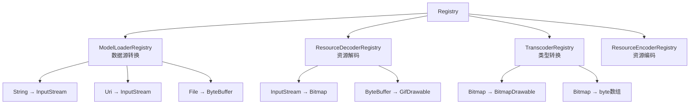

### 9.3 如何支持新的图片格式？

```kotlin
// 假设要支持 AVIF 格式
@GlideModule
class AvifGlideModule : LibraryGlideModule() {
    override fun registerComponents(context: Context, glide: Glide, registry: Registry) {
        // 注册解码器
        registry.prepend(
            InputStream::class.java,
            Bitmap::class.java,
            AvifBitmapDecoder(glide.bitmapPool)
        )
    }
}

// 解码器实现
class AvifBitmapDecoder(private val pool: BitmapPool) : ResourceDecoder<InputStream, Bitmap> {
    override fun handles(source: InputStream, options: Options): Boolean {
        return isAvifFormat(source)  // 判断是否是 AVIF 格式
    }
    
    override fun decode(source: InputStream, width: Int, height: Int, options: Options): Resource<Bitmap> {
        val bitmap = decodeAvif(source, pool)  // 实际解码逻辑
        return BitmapResource(bitmap, pool)
    }
}
```

### 9.4 设计亮点

| 亮点 | 说明 |
|-----|------|
| **开闭原则** | 新增格式无需修改核心代码 |
| **职责分离** | Loader 只负责获取数据，Decoder 只负责解码 |
| **优先级** | prepend/append 控制处理顺序 |
| **组合灵活** | 同一数据源可以有多个解码器 |

## 十、源码对比：Glide vs Coil

| 维度 | Glide | Coil |
|-----|-------|------|
| **语言** | Java | Kotlin |
| **生命周期** | 自定义 Fragment | Jetpack Lifecycle |
| **异步** | 线程池 + Handler | 协程 |
| **扩展性** | Registry + GlideModule | ComponentRegistry + Interceptor |
| **Bitmap 复用** | BitmapPool | BitmapPool（复用 Glide 思路） |
| **默认配置** | 需要 @GlideModule | 开箱即用 |

### Coil 的现代化设计

```kotlin
// Coil 使用协程
imageView.load(url) {
    placeholder(R.drawable.placeholder)
    transformations(CircleCropTransformation())
}

// Coil 使用 Interceptor 扩展（类似 OkHttp）
class LoggingInterceptor : Interceptor {
    override suspend fun intercept(chain: Interceptor.Chain): ImageResult {
        Log.d("Coil", "Loading: ${chain.request.data}")
        return chain.proceed(chain.request)
    }
}
```

## 十一、面试检验

### Q1: Glide 是如何绑定生命周期的？为什么不用 Lifecycle 组件？

**答**：

**绑定方式**：Glide 向 Activity/Fragment 添加一个隐藏的空 Fragment（RequestManagerFragment），通过监听该 Fragment 的生命周期回调来管理请求。

**为什么不用 Lifecycle**：
1. 历史原因：Glide 诞生于 2014 年，Lifecycle 组件 2017 年才出现
2. 兼容性：Glide 需要支持不使用 Jetpack 的项目
3. 稳定性：现有方案已经非常稳定，改动风险大于收益

**延伸**：Coil 是用 Lifecycle 实现的，更现代化。

### Q2: 详细说说 Glide 的三级缓存机制

**答**：

| 缓存层 | 实现 | 淘汰策略 | 特点 |
|-------|------|---------|------|
| 活动缓存 | WeakReference + 引用计数 | 引用计数归零移出 | 保护正在使用的图片 |
| 内存缓存 | LruCache | LRU | 快速访问最近使用的图片 |
| 磁盘缓存 | DiskLruCache | LRU | 持久化，支持原始和处理后数据 |

**关键设计**：
- 活动缓存使用弱引用，避免忘记 release 导致内存泄漏
- 活动缓存的图片不参与 LRU 淘汰，保证正在显示的图片安全
- 磁盘缓存 Key 包含尺寸、变换等信息，所以同一图片不同尺寸会缓存多份

### Q3: Glide 如何避免 OOM？

**答**：Glide 从多个层面避免 OOM：

1. **Bitmap 复用**：BitmapPool 维护 Bitmap 对象池，复用而不是创建新的
2. **尺寸限制**：根据 ImageView 大小解码，不加载原图
3. **格式选择**：支持 RGB_565（2字节/像素）降低内存占用
4. **内存缓存**：LRU 淘汰，控制最大内存占用
5. **生命周期**：Activity 销毁时释放相关资源
6. **低内存回调**：响应系统 onLowMemory，主动清理缓存

### Q4: 为什么 Glide 能解决列表图片错位问题？

**答**：

核心原理是 **请求与 Target 绑定**，绑定信息存储在 `View.setTag()` 中。

```kotlin
// into() 的关键步骤
fun into(imageView: ImageView) {
    // 1. 获取之前的请求
    val previous = imageView.getTag(R.id.glide_custom_view_target_tag) as? Request
    
    // 2. 取消之前的请求
    if (previous != null) {
        requestManager.clear(previous)
    }
    
    // 3. 绑定新请求
    imageView.setTag(R.id.glide_custom_view_target_tag, newRequest)
}
```

当 ViewHolder 复用时，新请求会取消旧请求，旧请求即使完成也不会显示。

### Q5: BitmapPool 是如何工作的？

**答**：

1. **存储结构**：按照 (宽, 高, Config) 分组存储可复用的 Bitmap
2. **获取时**：根据需求查找匹配的 Bitmap，找到就复用，找不到就创建新的
3. **回收时**：将不用的 Bitmap 放入池中
4. **淘汰策略**：LRU，池满时淘汰最久未使用的

```kotlin
// 解码时复用
val options = BitmapFactory.Options()
options.inBitmap = bitmapPool.get(width, height, config)
options.inMutable = true
BitmapFactory.decodeStream(stream, null, options)
```

**限制**：Android 4.4+ inBitmap 必须 >= 目标尺寸，之前版本必须完全相同。

### Q6: 如果让你设计一个图片加载框架，你会怎么设计？

**答**：借鉴 Glide 的核心设计：

1. **分层架构**
   - API 层：简洁的链式调用
   - 调度层：任务管理、并发控制
   - 数据层：数据获取、解码、变换
   - 缓存层：多级缓存

2. **核心机制**
   - 生命周期绑定：用 Lifecycle 组件
   - 三级缓存：活动 + 内存 + 磁盘
   - Bitmap 复用：BitmapPool
   - 请求去重：相同请求复用结果

3. **可扩展性**
   - 注册机制：支持自定义数据源、解码器
   - 拦截器：支持请求/响应拦截

4. **现代化改进**
   - Kotlin 实现
   - 协程异步
   - Flow 支持

---
_本文档将持续更新，添加更多相关内容_
