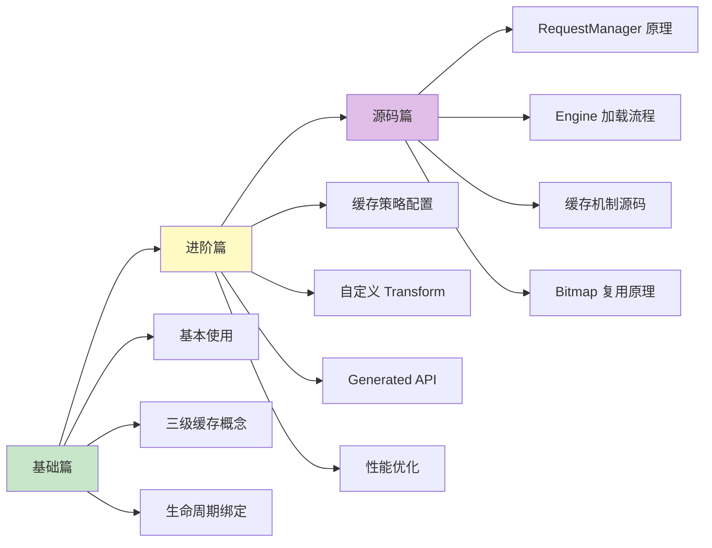

# Glide 知识体系

> 从入门到专家的完整学习路径 —— Android 图片加载框架之王

## 为什么要学 Glide？

在 Android 开发中，图片加载是一个**看似简单但坑极深**的领域：
- OOM（内存溢出）是最常见的崩溃原因之一
- 列表滑动时图片错位、闪烁让人抓狂
- 不同尺寸、不同来源的图片处理复杂度高

Glide 就是来解决这些问题的，它是 Google 官方推荐的图片加载库，在 Google Photos、YouTube 等亿级用户 App 中稳定运行。

## 文档结构

```
Glide/
├── README.md          # 本文件（目录索引）
├── 1-基础篇.md         # 初/中级开发者
├── 2-进阶篇.md         # 高级开发者
└── 3-源码篇.md         # 专家级
```

## 学习路线



## 各篇内容概览

### [1-基础篇](1-基础篇.md)

**适合人群**：Android 初学者、准备初/中级面试

| 知识点 | 内容 |
|-------|------|
| 技术演进 | 为什么需要图片加载框架？手写有多难？ |
| 核心组件 | Glide、RequestManager、Target、Transformation |
| 基本使用 | 一行代码加载图片的艺术 |
| 缓存机制 | 三级缓存白话版解释 |
| 生命周期 | 自动绑定 Activity/Fragment 生命周期 |
| 占位图 | placeholder、error、fallback 的区别 |
| 横向对比 | Glide vs Picasso vs Coil vs Fresco |

### [2-进阶篇](2-进阶篇.md)

**适合人群**：有 Glide 使用经验、准备高级面试

| 知识点 | 内容 |
|-------|------|
| 缓存策略 | DiskCacheStrategy 五种策略详解 |
| 自定义 Transform | 圆角、圆形、高斯模糊等自定义处理 |
| Generated API | @GlideModule 和 @GlideExtension 的威力 |
| 预加载 | preload 和 downloadOnly 的使用场景 |
| 图片监听 | RequestListener 监控加载状态 |
| RecyclerView 优化 | 结合列表的最佳实践 |
| 大图加载 | 超大图分片加载方案 |
| 边界认知 | Glide 不适合的场景 |

### [3-源码篇](3-源码篇.md)

**适合人群**：准备 Android 专家级面试、想深入理解原理

| 知识点 | 内容 |
|-------|------|
| 整体架构 | Glide 的分层设计思想 |
| with() 原理 | RequestManager 与生命周期绑定源码 |
| load() 原理 | RequestBuilder 的建造者模式 |
| into() 原理 | 真正开始加载的入口 |
| Engine 机制 | 任务调度与并发控制 |
| 缓存源码 | 三级缓存的读写时机与淘汰策略 |
| BitmapPool | Bitmap 复用如何避免 OOM |
| 面试高频 | 5 道专家级面试题 |

## 面试覆盖程度

| 面试级别 | 需要掌握 |
|---------|---------|
| 初级 Android | 基础篇 |
| 中级 Android | 基础篇 + 进阶篇部分 |
| 高级 Android | 基础篇 + 进阶篇 |
| **Android 专家** | 基础篇 + 进阶篇 + 源码篇 |

## 快速查阅

### 常见问题速查

| 问题 | 解决方案 | 所在文档 |
|-----|---------|---------|
| 图片不显示 | 检查网络权限和 URL | 基础篇 |
| 图片变形 | centerCrop / fitCenter | 基础篇 |
| 列表图片错位 | 复用时取消请求 | 基础篇 |
| 加载慢 | 开启磁盘缓存 | 进阶篇 |
| OOM 崩溃 | 降低图片质量/尺寸 | 进阶篇 |
| GIF 卡顿 | 使用 asGif() | 进阶篇 |
| 内存占用高 | 调整 BitmapPool 大小 | 源码篇 |

### 核心代码速查

| 功能 | 代码 | 所在文档 |
|-----|------|---------|
| 基本加载 | `Glide.with(context).load(url).into(imageView)` | 基础篇 |
| 跳过缓存 | `.skipMemoryCache(true)` | 进阶篇 |
| 磁盘策略 | `.diskCacheStrategy(DiskCacheStrategy.ALL)` | 进阶篇 |
| 圆角 | `.transform(RoundedCorners(16))` | 进阶篇 |
| 监听加载 | `.listener(requestListener)` | 进阶篇 |
| 预加载 | `Glide.with(context).load(url).preload()` | 进阶篇 |
| 清除缓存 | `Glide.get(context).clearMemory()` | 进阶篇 |

## 版本信息

本文档基于 **Glide 4.x** 版本编写，这是目前最新的稳定版本。

```kotlin
// build.gradle.kts
dependencies {
    implementation("com.github.bumptech.glide:glide:4.16.0")
    ksp("com.github.bumptech.glide:ksp:4.16.0")
}
```

---
_本文档将持续更新_
