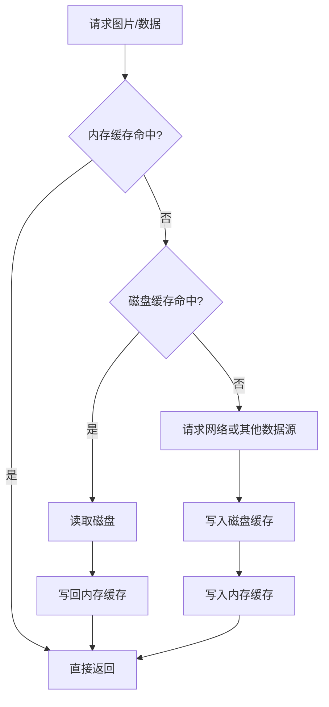

# LruCache 与 DiskLruCache 基础篇

## 什么是 LruCache 与 DiskLruCache？

### 定义

- `LruCache` 是 Android 提供的**内存缓存容器**，按照 LRU（Least Recently Used，最近最少使用）策略淘汰旧数据。
- `DiskLruCache` 是常见的**磁盘缓存实现**，把缓存内容持久化到文件系统中，也按 LRU 思路控制总容量。

### 通俗理解

你可以把它们理解成两层收纳：

- `LruCache` 像办公桌抽屉，常用资料放手边，拿起来最快，但空间很小。
- `DiskLruCache` 像办公室档案柜，容量大很多，但每次翻找都比抽屉慢。

缓存真正厉害的地方，不是“能存”，而是**知道该留谁、该删谁**。

## 为什么会出现这两个技术？

### 历史问题

Android 早期最常见的问题是：

1. 图片或大对象反复创建，CPU 和内存压力都很大。
2. 网络或磁盘数据每次都重新读取，页面首屏慢。
3. 直接用 `HashMap` 存缓存没有上限，时间久了必炸。
4. 直接把文件写磁盘也没有淘汰机制，缓存目录会越滚越大。

于是大家逐渐形成共识：

- **内存层**要解决“快”的问题。
- **磁盘层**要解决“省重复计算/重复下载”的问题。
- 两层都要有**容量控制和淘汰策略**。

## LRU 是什么？

LRU 的核心假设很朴素：

> 最近刚用过的数据，大概率很快还会再用；很久没碰的数据，大概率可以先淘汰。

这很像你桌上的东西：

- 鼠标、耳机、杯子经常会用，所以你总放手边。
- 半个月没翻过的会议资料，就可以先收起来。

这不是绝对正确，但在大多数“热点访问”场景里足够有效，所以它成了缓存领域的经典策略。

## LruCache 和 DiskLruCache 的区别

| 维度 | `LruCache` | `DiskLruCache` |
|-----|------------|----------------|
| 存储位置 | 内存 | 磁盘 |
| 读取速度 | 很快 | 较慢 |
| 进程被杀后 | 数据丢失 | 数据还在 |
| 容量大小 | 较小 | 较大 |
| 适合缓存 | Bitmap、解析结果、临时对象 | 图片文件、接口响应、序列化数据 |
| 主要风险 | OOM、内存抖动 | I/O 开销、目录膨胀、数据一致性 |

一句话总结：

- `LruCache` 负责“下一秒就要用”的数据。
- `DiskLruCache` 负责“下次大概率还会用，但不必一直放内存”的数据。

## Android 中的典型访问流程



这个顺序几乎是所有成熟图片库的基本套路，因为它平衡了三件事：

1. 用户想要快，所以先查内存。
2. 内存太贵，所以 miss 以后查磁盘。
3. 磁盘也没有才去网络，避免不必要的请求。

## LruCache 基本使用

> **推荐**：缓存 Bitmap、解析后的对象、短期热数据时优先考虑 `LruCache`。

### 核心 API

| API | 作用 |
|-----|------|
| `get(key)` | 读取缓存 |
| `put(key, value)` | 放入缓存 |
| `remove(key)` | 删除缓存 |
| `evictAll()` | 清空缓存 |
| `size()` | 当前已使用大小 |
| `maxSize()` | 最大容量 |
| `sizeOf(key, value)` | 定义每个 value 占多大 |
| `entryRemoved(...)` | 元素被淘汰/替换时回调 |

### Kotlin 示例：缓存 Bitmap

```kotlin
import android.graphics.Bitmap
import android.util.LruCache

class BitmapMemoryCache {
    private val cache = object : LruCache<String, Bitmap>(20 * 1024) {
        override fun sizeOf(key: String, value: Bitmap): Int {
            // 这里统一用 KB 作为容量单位，避免单位混乱
            return value.byteCount / 1024
        }
    }

    fun get(url: String): Bitmap? = cache.get(url)

    fun put(url: String, bitmap: Bitmap) {
        if (cache.get(url) == null) {
            cache.put(url, bitmap)
        }
    }
}
```

### 为什么一定要重写 `sizeOf()`？

因为默认情况下，每个条目都按 `1` 来算。

这意味着：

- 你缓存一张 10KB 的图，算 `1`
- 你缓存一张 8MB 的图，也算 `1`

这显然不合理。对 Bitmap 来说，真正危险的是**占多少字节**，而不是“有几个对象”。

## DiskLruCache 基本使用

### 先说一个关键事实

`DiskLruCache` **不是 Android SDK 面向业务开发的官方公开主角**，它更像是一个经典实现：

- 来源可以追溯到 AOSP/libcore 思路
- 很多项目使用 Jake Wharton 发布的版本
- Glide、老版本 OkHttp 等框架都借鉴或直接使用过类似设计

常见依赖写法：

```kotlin
dependencies {
    implementation("com.jakewharton:disklrucache:2.0.2")
}
```

### 核心 API

| API | 作用 |
|-----|------|
| `open(...)` | 打开缓存目录 |
| `get(key)` | 读取缓存快照 |
| `edit(key)` | 开始编辑一个条目 |
| `commit()` | 提交写入 |
| `abort()` | 放弃写入 |
| `flush()` | 刷新到磁盘 |
| `close()` | 关闭缓存 |
| `delete()` | 删除整个缓存目录 |

### Kotlin 示例：把网络图片字节写入磁盘缓存

```kotlin
import com.jakewharton.disklrucache.DiskLruCache
import java.io.File
import java.security.MessageDigest

class ImageDiskCache(cacheDir: File) {
    private val diskCache = DiskLruCache.open(
        File(cacheDir, "image_cache"),
        1,
        1,
        50L * 1024 * 1024
    )

    fun put(url: String, bytes: ByteArray) {
        val key = url.md5()
        val editor = diskCache.edit(key) ?: return
        runCatching {
            editor.newOutputStream(0).use { it.write(bytes) }
            editor.commit() // 写完整了再提交，避免脏数据进入正式缓存
            diskCache.flush()
        }.getOrElse {
            editor.abort()
        }
    }
}

private fun String.md5(): String =
    MessageDigest.getInstance("MD5").digest(toByteArray())
        .joinToString("") { "%02x".format(it) }
```

### 为什么 key 不能直接用 URL 原文当文件名？

因为 URL 里可能包含：

- `/`
- `?`
- `&`
- 很长的 query 参数

这些字符不适合作为稳定文件名，所以一般都会做一次 `MD5` 或其他 hash。

## 两者应该怎么配合？

### 标准做法

1. 先查 `LruCache`
2. miss 后查 `DiskLruCache`
3. 还没有再查网络或数据库
4. 拿到结果后先写磁盘，再回填内存

### 为什么不是只用一个？

只用内存缓存：

- 速度快
- 但进程一杀数据就没了
- 容量也太小，不适合保存大量历史结果

只用磁盘缓存：

- 持久化没问题
- 但每次读取都要走 I/O，主线程很容易卡顿

所以这俩本来就不是替代关系，而是**分工合作**。

## 常见使用场景

### 适合 `LruCache`

- 页面中频繁复用的小图 Bitmap
- JSON 反序列化后的热点对象
- 富文本解析结果
- 短时间内反复访问的列表项数据

### 适合 `DiskLruCache`

- 图片原始文件
- 接口离线缓存数据
- 下载后的中间结果
- 体积较大、生成代价高的数据

## 常见错误

### 1. 把 `LruCache` 容量开得特别大

错误想法：命中率越高越好。

真实情况：你把内存吃太多，系统会更积极地 GC，甚至直接 OOM。

### 2. `sizeOf()` 单位不统一

比如：

- `maxSize` 用 KB
- `sizeOf()` 却返回字节数

结果缓存会“看起来正常，实际上完全不准”。

### 3. 用 `DiskLruCache` 在主线程做 I/O

磁盘访问是慢操作，尤其是老设备或缓存目录很大时，主线程读取非常容易卡顿。

### 4. 把 View / Activity 放进 `LruCache`

这不是缓存命中率问题，而是**内存泄漏问题**。

缓存应优先放纯数据对象、Bitmap、解析结果，而不是持有页面上下文的大对象。

### 5. 以为 `DiskLruCache` 是数据库

它擅长的是“按 key 取值 + LRU 淘汰”，不是复杂查询，不适合：

- 多条件筛选
- 范围检索
- 联表关系

这类需求应该用 Room / SQLite。

## 基础篇总结

先记住三句话：

1. `LruCache` 解决的是**内存层热数据复用**。
2. `DiskLruCache` 解决的是**磁盘层持久缓存与容量淘汰**。
3. 真正好用的缓存，从来不是“只缓存”，而是“按层次缓存”。

## 面试检验

### 1. `LruCache` 和 `HashMap` 的本质区别是什么？

**结论**：`LruCache` 不只是存数据，它还内置了容量控制和淘汰策略；`HashMap` 只是普通容器。  
**原理**：缓存最怕无限增长，而 `LruCache` 会在超出上限时把最久没用的数据删掉。  
**例子**：Bitmap 放进 `HashMap` 很容易越存越多，放进 `LruCache` 则能自动回收冷数据。

### 2. 为什么 Android 项目里常常先查内存缓存，再查磁盘缓存？

**结论**：因为内存最快，磁盘次之，网络最慢。  
**原理**：这是一种典型的分层缓存策略，优先使用成本最低的命中路径。  
**例子**：图片列表滑动回来的瞬间，如果内存里有 Bitmap，体验会比重新读磁盘快很多。

### 3. `sizeOf()` 为什么重要？

**结论**：它决定缓存容量是否真实反映对象大小。  
**原理**：默认每个对象按 1 计数，不适合 Bitmap 这种大小差异巨大的对象。  
**例子**：一张 200KB 缩略图和一张 8MB 大图都算 1，缓存策略就会失真。

### 4. `DiskLruCache` 适合替代数据库吗？

**结论**：不适合。  
**原理**：它擅长 key-value 缓存与淘汰，不擅长结构化查询和复杂关系管理。  
**例子**：缓存图片文件很合适，但做“按时间范围查询聊天记录”就应该用 Room。

---

_最后更新：2026-03-31_
