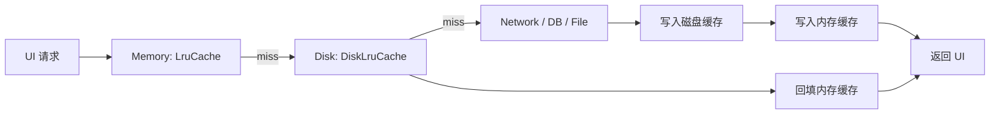

# LruCache 与 DiskLruCache 进阶篇

## 进阶视角先说结论

真正难的，从来不是“会不会用 `LruCache` / `DiskLruCache`”，而是下面这三件事：

1. 容量怎么定，既不浪费也不冒险？
2. key 怎么设计，才能让命中率真的高？
3. 多级缓存怎么协作，才能又快又稳？

如果这些问题没想清楚，缓存很容易变成“代码看起来高级，线上效果很一般”。

## 容量设计：不是越大越好

### `LruCache` 容量怎么估？

常见经验值：

- 图片型 App：可先尝试使用应用可用内存的 `1/8 ~ 1/4`
- 普通业务 App：更保守一点，通常 `1/8` 左右更稳
- 如果缓存对象不是 Bitmap，而是小对象或解析结果，要根据真实内存采样调整

### 为什么不能贪大？

因为内存缓存不是越大越赚钱，而是越大越有副作用：

- 占用 Java/Kotlin 堆空间
- 增加 GC 压力
- 压缩业务代码真正可用的内存余量
- 在低端机上更容易触发 OOM

一句大白话：

> `LruCache` 像客厅沙发，坐得下常用的人就够了。你非要把整个公司的椅子都搬进客厅，最后不是舒服，而是根本没法走路。

### Bitmap 场景的推荐写法

```kotlin
import android.app.ActivityManager
import android.content.Context
import android.graphics.Bitmap
import android.util.LruCache

class SafeBitmapCache(context: Context) {
    private val memoryClassMb =
        (context.getSystemService(Context.ACTIVITY_SERVICE) as ActivityManager).memoryClass

    private val maxSizeKb = memoryClassMb * 1024 / 8

    val cache = object : LruCache<String, Bitmap>(maxSizeKb) {
        override fun sizeOf(key: String, value: Bitmap): Int {
            return value.byteCount / 1024
        }
    }
}
```

这段代码的关键不是写法，而是背后的策略：

- 使用系统给你的内存级别做初始估算
- 再结合线上设备分布、命中率和崩溃数据去调

## `DiskLruCache` 容量怎么估？

磁盘缓存看起来比内存宽裕，但也不能“无限存”：

- 缓存太小，命中率很差，白写
- 缓存太大，目录扫描、清理、I/O 维护成本会上升
- 如果和下载目录、媒体目录混在一起，还可能把用户空间吃爆

常见建议：

- 小中型业务：`30MB ~ 100MB`
- 图片较多的内容社区：`100MB ~ 300MB`
- 具体还要看资源尺寸、重复访问率、离线需求强不强

## key 设计：命中率的灵魂

很多缓存命中率低，不是容量不够，而是 key 设计太差。

### 典型错误

同一张图片因为这些参数变化，可能产生多个 key：

- 不同尺寸
- 不同裁剪方式
- 不同圆角参数
- 不同图片格式

如果你只用原始 URL 当 key，可能会出现：

- 原图和缩略图互相覆盖
- 圆角图和普通图拿错
- 明明是同一资源，却因为 query 参数不稳定导致重复缓存

### 推荐思路

key 至少应该体现：

1. 资源标识
2. 尺寸
3. 转换参数
4. 版本号（必要时）

### 示例：把变换参数编码进 key

```kotlin
import java.security.MessageDigest

data class ImageRequest(
    val url: String,
    val width: Int,
    val height: Int,
    val transform: String
)

fun ImageRequest.cacheKey(): String {
    val raw = "$url|$width|$height|$transform|v1"
    return MessageDigest.getInstance("MD5")
        .digest(raw.toByteArray())
        .joinToString("") { "%02x".format(it) }
}
```

这里用 `MD5` 不是为了加密，而是为了生成稳定、适合作为文件名的短 key。

真正想表达的原则是：

> 缓存 key 代表的不是“资源是谁”，而是“我要的结果长什么样”。

## 多级缓存的标准架构



### 设计哲学

这套架构真正值钱的点在于**每层做自己最擅长的事**：

- 内存层：解决“马上要显示”的速度问题
- 磁盘层：解决“别重复下载/重复解码”的成本问题
- 数据源层：负责真实性和兜底

### 实战经验

大项目里通常不会把所有数据都塞进同一份缓存：

- 缩略图一套策略
- 大图原图一套策略
- 接口 JSON 一套策略
- 富文本解析结果一套策略

因为不同数据的**生成成本、访问频率、大小分布**完全不一样。

## `entryRemoved()` 的真正价值

很多人知道 `entryRemoved()` 存在，但不知道它适合干嘛。

它常见的用途有：

1. 打日志，看哪些 key 被淘汰
2. 做监控，统计命中率和淘汰次数
3. 把内存层淘汰的数据转移到其他层级
4. 释放自定义资源

### 示例：记录淘汰行为

```kotlin
import android.util.Log
import android.util.LruCache

class DebugLruCache(maxSize: Int) : LruCache<String, String>(maxSize) {
    override fun entryRemoved(
        evicted: Boolean,
        key: String,
        oldValue: String,
        newValue: String?
    ) {
        if (evicted) {
            Log.d("Cache", "key=$key 被 LRU 淘汰")
        }
    }
}
```

## 并发与线程问题

### `LruCache`

`LruCache` 本身的方法是同步保护的，日常多线程 `get/put` 一般能用，但你还是要注意两件事：

1. value 本身如果是可变对象，线程安全仍然是你自己的责任。
2. 不要在主线程里做重计算后再 `put()`，因为真正耗时的不是容器，而是你生成 value 的过程。

### `DiskLruCache`

`DiskLruCache` 的约束更强：

- 同一个 entry 同时只能有一个 editor
- 写入失败必须 `abort()`
- 不适合多进程同时读写同一个目录

也就是说，它更像一个**单进程内的稳定磁盘缓存组件**，不是跨进程共享存储方案。

## 典型实战：图片加载缓存

### 场景

信息流列表里同一张图会被反复出现，用户来回滑动时如果每次都重新下载或重新解码，体验会非常差。

### 推荐链路

1. 内存缓存放已解码的 Bitmap
2. 磁盘缓存放原始字节或处理后的文件
3. 网络只负责 miss 兜底
4. 解码和磁盘读写全部放后台线程

### 为什么很多图片库不用你手写？

因为真正工业级的缓存要同时处理：

- 生命周期
- 线程池
- Bitmap 复用
- 尺寸变换
- 失败重试
- EXIF / 格式兼容

所以业务项目中常见建议是：

> **推荐**：优先用 Glide / Coil 这种成熟库；手写 `LruCache` / `DiskLruCache` 更适合做局部缓存、理解原理或特殊定制。

## 横向对比

### `LruCache` vs `SoftReference` / `WeakReference`

| 方案 | 优点 | 缺点 |
|-----|------|------|
| `LruCache` | 可控、有上限、行为稳定 | 需要手动定容量 |
| `SoftReference` | 写起来简单 | 回收时机不可控，线上行为不稳定 |
| `WeakReference` | 易被回收 | 更适合避免泄漏，不适合做主缓存 |

结论：

在现代 Android 项目里，**可控性比“听天由命的自动回收”更重要**，所以 `LruCache` 更主流。

### `DiskLruCache` vs OkHttp Cache

| 维度 | `DiskLruCache` | OkHttp Cache |
|-----|----------------|--------------|
| 面向对象 | 通用 key-value 文件缓存 | HTTP 响应缓存 |
| 协议语义 | 不理解 HTTP | 理解 `Cache-Control` / `ETag` |
| 使用门槛 | 需要自己管理 key 与写读逻辑 | 配置后可自动参与网络层 |
| 适合场景 | 图片文件、业务二进制缓存 | 接口 GET 响应缓存 |

如果你缓存的是 HTTP 响应，并且希望遵守协议语义，优先考虑 OkHttp Cache。

## 边界认知：什么时候不该用？

### 不适合 `LruCache`

- 需要跨进程共享
- 需要应用重启后仍保留
- 需要复杂查询

### 不适合 `DiskLruCache`

- 需要事务化的复杂结构数据
- 需要多进程高并发一致访问
- 需要按业务字段灵活筛选

## 性能优化 checklist

1. `LruCache` 的 `maxSize` 单位和 `sizeOf()` 保持一致。
2. Bitmap 尽量按展示尺寸解码，不要拿大图硬塞内存缓存。
3. 磁盘读写全部放后台线程。
4. key 设计要包含尺寸和变换信息。
5. 定期观察命中率、淘汰率、平均文件大小，而不是只盯着“有没有缓存”。

## 常见坑与解决方案

### 坑 1：缓存命中率一直很低

原因通常是：

- key 不稳定
- 容量太小
- 数据本身复用率低

先排查 key，再谈扩容。

### 坑 2：缓存有了，但页面还是卡

原因通常是：

- 磁盘 I/O 在主线程
- Bitmap 解码在主线程
- 命中的只是原始文件，后续处理仍然很重

缓存命中不等于性能一定好，**后处理链路**同样重要。

### 坑 3：缓存目录越来越大

原因通常是：

- 没有统一入口写缓存
- 老版本目录没有迁移清理
- 同一资源生成了过多变体文件

解决思路：

- 统一 key 规范
- 区分原图、缩略图目录
- 上线版本切换时做目录治理

## 进阶篇总结

缓存优化的核心不是“再加一层”，而是这三点：

1. **容量要合理**
2. **key 要稳定**
3. **链路要分层**

只要这三件事做对，`LruCache` 和 `DiskLruCache` 就会非常稳；做不对，再高级的类名也救不了命中率和流畅度。

## 面试检验

### 1. `LruCache` 的容量为什么不能简单设得很大？

**结论**：因为命中率提升不一定值回更多的内存成本。  
**原理**：缓存越大，堆占用越高，GC 压力和 OOM 风险也会上升。  
**例子**：图片列表把大图都常驻内存，命中率也许上来了，但低端机很可能直接崩。

### 2. 缓存 key 设计为什么比扩容更重要？

**结论**：因为 key 决定“能不能命中”，容量只决定“能保留多久”。  
**原理**：如果同一资源因为尺寸、裁剪参数不同生成多个不规范 key，再大的缓存也会碎片化。  
**例子**：同一 URL 的圆角图、原图、缩略图共用一个 key，就会互相覆盖或取错。

### 3. `DiskLruCache` 为什么不适合主线程使用？

**结论**：因为磁盘 I/O 天生比内存慢，波动也更大。  
**原理**：文件系统读写、flush、目录维护都可能阻塞当前线程。  
**例子**：列表滚动时主线程同步读磁盘，用户感知就是掉帧和卡顿。

### 4. `LruCache` 和 OkHttp Cache 的定位有什么不同？

**结论**：一个是通用内存缓存容器，一个是遵守 HTTP 语义的响应缓存。  
**原理**：`LruCache` 不理解网络协议，而 OkHttp Cache 会参考缓存头、协商缓存等规则。  
**例子**：缓存 Bitmap 用 `LruCache` 很自然，缓存 GET 响应则更适合 OkHttp Cache。

### 5. 为什么大型项目喜欢“内存 + 磁盘 + 网络”的三级链路？

**结论**：因为它兼顾了速度、容量和真实性。  
**原理**：内存负责快，磁盘负责省重复成本，网络负责兜底和更新。  
**例子**：信息流二次进入页面时先秒开命中内存，重启应用后还能从磁盘恢复一部分体验。

### 6. `SoftReference` 为什么没成为现代 Android 的主流缓存方案？

**结论**：因为它不可控。  
**原理**：对象什么时候被系统回收，取决于 GC 和内存压力，线上表现不稳定。  
**例子**：测试机上缓存看起来“还在”，线上低端机可能早就被回收干净了。

---

_最后更新：2026-03-31_
