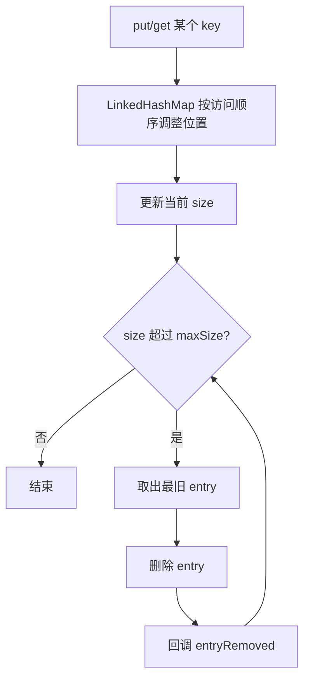
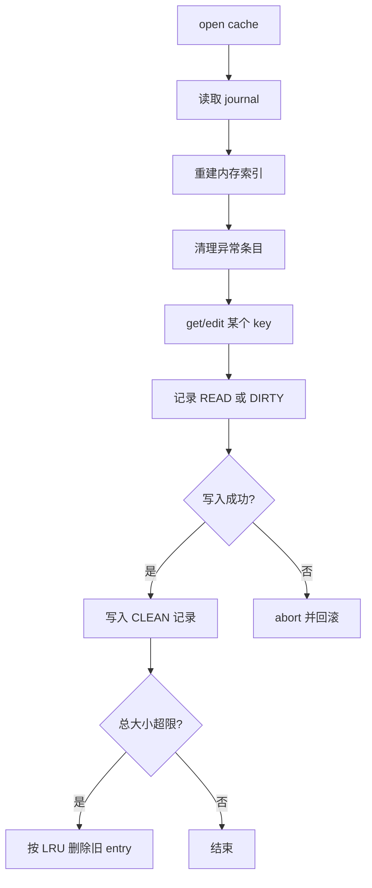

# LruCache 与 DiskLruCache 源码篇

## 先用一句人话总结

- `LruCache` 的本质是：**用一个按访问顺序排序的容器，超限时从最旧的数据开始删。**
- `DiskLruCache` 的本质是：**用文件目录存数据，再用 journal 日志保证“可恢复、可淘汰、可重建”。**

一个偏“内存结构设计”，一个偏“磁盘一致性设计”。

## 一、LruCache 的设计哲学

### 它为什么好用？

因为它没有搞复杂算法，而是抓住了缓存最关键的两个目标：

1. 访问要快
2. 淘汰要可控

这就是优秀框架常见的特点：

> 不追求理论上最花哨，而追求工程上足够稳、足够简单、足够容易维护。

### 核心思路

`LruCache` 内部经典做法是基于 `LinkedHashMap(accessOrder = true)`：

- 每次访问一个 key，它会被移动到“最近访问”的一侧
- 最久没访问的元素自然排在前面
- 超出容量时，从最旧的开始删就行

### 核心流程图



### 关键源码思想

下面这段不是逐字照搬源码，而是把核心逻辑提炼出来的**示意伪代码**：

```kotlin
class SimpleLruCache<K, V>(private val maxSize: Int) {
    private val map = LinkedHashMap<K, V>(0, 0.75f, true)
    private var size = 0

    fun get(key: K): V? = synchronized(this) {
        map[key] // accessOrder=true，访问后会移动位置
    }

    fun put(key: K, value: V) {
        synchronized(this) {
            val oldValue = map.put(key, value)
            if (oldValue != null) {
                size -= safeSizeOf(key, oldValue)
            }
            size += safeSizeOf(key, value)
        }
        trimToSize(maxSize)
    }

    private fun trimToSize(maxSize: Int) {
        while (true) {
            val toEvict = synchronized(this) {
                if (size <= maxSize || map.isEmpty()) return
                map.entries.iterator().next()
            }
            removeEntry(toEvict.key, toEvict.value)
        }
    }
}
```

### 这个设计有什么亮点？

#### 1. 借力 `LinkedHashMap`

它没有自己发明双向链表 + 哈希表，而是直接借用 JDK 已有能力，代码复杂度一下就降下来了。

#### 2. 淘汰逻辑独立成 `trimToSize()`

这是一种很好的设计：

- 插入逻辑只负责插入
- 淘汰逻辑单独收口
- 后续扩展 `evictAll()`、动态调容量都更自然

#### 3. `sizeOf()` 把“缓存策略”交给业务

框架不假设所有 value 大小一致，而是把“大小怎么定义”交给你。

这就是典型的**框架提供机制，业务提供策略**。

## 二、LruCache 的源码洞察

### 为什么 `get()` 也会影响淘汰顺序？

因为 LRU 的“最近使用”不仅包括写入，也包括读取。

如果一个对象虽然很早以前放进去，但最近一直在被访问，它就不应该被淘汰。  
这也是 `accessOrder = true` 的价值所在。

### 为什么 `trimToSize()` 往往在锁外继续执行？

这是很常见的工程权衡：

- 锁内只做必要的状态修改
- 锁外做可能更长的清理流程

目的是减少大锁持有时间，避免多线程下整体吞吐下降。

### `entryRemoved()` 为什么重要？

它体现了一个优秀容器的扩展性：

- 容器只负责“淘汰发生了”
- 资源释放、监控埋点、级联处理交给业务层

这让 `LruCache` 不只是一个 Map，而是一个**可观测的缓存组件**。

## 三、DiskLruCache 的设计哲学

### 它真正难的地方是什么？

内存缓存难在容量，磁盘缓存难在**一致性**。

内存里删错了，大不了这次 miss 一下；磁盘上如果写坏了、写一半崩了、目录和索引对不上，后果会更麻烦。

所以 `DiskLruCache` 的重点不是“把文件存下来”，而是：

1. 如何知道哪些文件是有效的
2. 如何知道哪些文件正在写、还没写完
3. 应用崩溃后如何恢复现场
4. 如何在容量超限时按 LRU 删掉旧文件

### 核心角色

| 角色 | 作用 |
|-----|------|
| `Entry` | 一个缓存条目的元数据 |
| `Editor` | 某个条目的写入会话 |
| `Snapshot` | 某个条目的只读快照 |
| `journal` | 日志文件，记录条目状态变化 |

### 为什么需要 journal？

因为磁盘文件本身只告诉你“某个文件在不在”，但无法可靠回答这些问题：

- 它是不是写到一半崩掉的半成品？
- 它现在是不是正在被编辑？
- 它对应的 entry 最近有没有被访问？
- 当前目录里的所有文件，哪些才算真正合法缓存？

journal 就像仓库管理员的出入库本：

- 哪个货物入库成功了
- 哪个货物正在整理中
- 哪个货物被移除了
- 哪个货物最近又被取用了一次

## 四、DiskLruCache 核心流程



## 五、Journal 里的几种状态

### `DIRTY`

表示一个 entry 正在编辑，还没正式生效。  
你可以理解为：文件正在“施工中”。

### `CLEAN`

表示这个 entry 已经写完并可读了，是真正有效的缓存。  
你可以理解为：验收通过，可以正式使用。

### `READ`

表示这个 entry 被访问过，用来辅助维护 LRU 顺序。  
你可以理解为：管理员记了一笔“这个东西最近有人拿过”。

### `REMOVE`

表示这个 entry 被删除了。  
你可以理解为：档案柜里这份资料已经作废。

### 为什么这几个状态就够了？

因为它们刚好覆盖了缓存条目的完整生命周期：

1. 准备写入：`DIRTY`
2. 写入成功：`CLEAN`
3. 被访问：`READ`
4. 被删除：`REMOVE`

这是非常典型的状态机设计，状态少，但闭环完整。

## 六、DiskLruCache 的关键源码思想

依然不贴大段原码，只提炼主干逻辑：

```kotlin
fun edit(key: String): Editor? = synchronized(this) {
    val entry = lruEntries[key] ?: Entry(key).also { lruEntries[key] = it }
    if (entry.currentEditor != null) return null

    entry.currentEditor = Editor(entry)
    journalWriter.write("DIRTY $key\n")
    journalWriter.flush()
    return entry.currentEditor
}

fun completeEdit(editor: Editor, success: Boolean) = synchronized(this) {
    val entry = editor.entry
    if (success) {
        entry.readable = true
        journalWriter.write("CLEAN ${entry.key}\n")
    } else {
        journalWriter.write("REMOVE ${entry.key}\n")
    }
    entry.currentEditor = null
}
```

### 这里最值得学什么？

#### 1. 先记日志，再改状态

更准确地说，是**关键状态变化要被 journal 记录下来**。  
这样即使进程中途崩溃，重启后也能根据日志恢复一致状态。

#### 2. 一个 entry 同时只允许一个 editor

这是为了避免并发写把同一个 key 的文件写乱。  
它牺牲了一点并发度，换来一致性和实现复杂度的可控。

#### 3. `Snapshot` 与 `Editor` 分离

读和写职责分开：

- 读者拿 `Snapshot`
- 写者拿 `Editor`

这种 API 设计让调用者一眼就明白自己当前在做的是“读取一个稳定结果”还是“开启一次修改会话”。

## 七、LruCache 与 DiskLruCache 的共同设计思想

虽然一个在内存、一个在磁盘，但它们其实共享同一套工程哲学：

1. **容量必须有边界**
2. **淘汰必须有策略**
3. **状态变化必须可追踪**
4. **框架只提供机制，策略交给业务定制**

这也是为什么你学懂这两个类后，再看 Glide、Coil、OkHttp Cache，会感觉它们并不是凭空变复杂，而是在这套基础思想上继续扩展。

## 八、源码层面的边界认知

### `LruCache` 的局限

- LRU 不是对所有访问模式都最优
- 不理解对象实际“重建成本”
- 只能在单进程内解决问题

比如某些场景里，一个很久没访问但重建成本极高的对象被淘汰，未必最划算。  
这就是为什么大系统里有时会用 LFU、分段缓存或业务优先级策略。

### `DiskLruCache` 的局限

- 更偏单机单目录缓存
- 不擅长复杂查询
- 多进程一致性不是它的强项
- journal 过大时需要重建压缩

也就是说，它是一个优秀的“工程缓存组件”，但不是通用存储系统。

## 九、如果让你自己设计，你会借鉴什么？

### 可以直接借鉴的点

1. 用已有成熟数据结构，不要重复造复杂轮子
2. 把“容量控制”做成框架内建能力
3. 把“淘汰发生后的处理”开放给业务层
4. 对磁盘类组件优先考虑恢复能力，而不是只追求写成功那一瞬间

### 可以进一步升级的方向

1. 增加命中率、淘汰率、平均对象大小等监控
2. 区分不同优先级缓存池
3. 支持更智能的 key 版本管理
4. 做冷热分层，而不只是单一 LRU

## 源码篇总结

学源码最怕陷入“把每一行都背了”，但忽略了设计本质。

这两个类真正该学的是：

- `LruCache`：**如何用最小复杂度做出可控淘汰**
- `DiskLruCache`：**如何用日志 + 状态机保证磁盘缓存可恢复**

这两种思想，远比记住几个 API 更值钱。

## 面试检验

### 1. `LruCache` 为什么适合基于 `LinkedHashMap` 实现？

**结论**：因为它天然支持按访问顺序维护条目。  
**原理**：开启 `accessOrder=true` 后，最近访问的元素会移动到队尾，最旧元素自然容易定位并淘汰。  
**例子**：每次 `get()` 一个 key，它就会被视为“刚用过”，不该优先被删。

### 2. `DiskLruCache` 为什么要引入 journal？

**结论**：为了保证崩溃恢复和目录状态一致性。  
**原理**：磁盘文件本身无法完整表达“正在写、已完成、已删除、刚被访问”等状态，journal 能记录这些变化。  
**例子**：如果应用在写文件一半时崩了，重启后可以根据 `DIRTY` 记录判断该条目无效并清理。

### 3. 为什么 `DiskLruCache` 要限制同一个 entry 只有一个 editor？

**结论**：为了避免并发写导致数据损坏。  
**原理**：多个写入者同时修改同一个 key，很容易让文件内容和元数据状态不一致。  
**例子**：线程 A 正在写图片，线程 B 同时覆盖同一 key，最终可能 journal 和实际文件都对不上。

### 4. `LruCache` 和 `DiskLruCache` 共同体现了什么设计哲学？

**结论**：边界控制、状态管理、机制与策略分离。  
**原理**：两者都把容量限制和淘汰做成内建能力，同时把具体大小定义、key 规则等策略留给业务层。  
**例子**：`sizeOf()` 由业务决定，磁盘 key 的 hash 规则也由业务决定，但淘汰与恢复机制由框架兜底。

---

_最后更新：2026-03-31_
