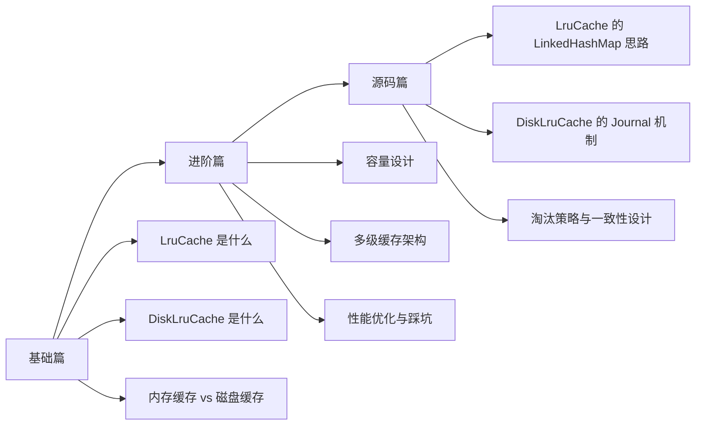

# LruCache 与 DiskLruCache

> Android 缓存体系里最经典的一对搭档：一个管内存，一个管磁盘。

## 为什么要学 LruCache 和 DiskLruCache？

很多同学一提缓存，脑子里只有一句话：**“就是把数据存起来，下次别再请求。”**

但真正写 Android 项目时，你很快会发现事情没那么简单：

- 图片列表一滑就卡，明明接口不慢，为什么还是掉帧？
- 首页进来第二次明明有数据，为什么还是要等网络？
- 缓存加了以后内存涨得飞快，甚至 OOM？
- 磁盘缓存写多了以后，为什么又会出现 I/O 抖动和缓存污染？

这时候你就会明白，缓存不是“存一下”这么简单，而是**在速度、空间、一致性、复杂度之间做权衡**。

一句话理解：

- `LruCache` 像你桌面上的常用文件夹，拿得快，但桌面放不下太多东西。
- `DiskLruCache` 像你书柜里的资料盒，容量大很多，但每次去拿都比桌面慢。

## 文档结构

```text
15_LruCache/
├── README.md
├── 1-基础篇.md
├── 2-进阶篇.md
└── 3-源码篇.md
```

## 学习路线



## 重要程度

| 知识点 | 重要程度 | 面试频率 | 说明 |
|-------|---------|---------|------|
| `LruCache` 基本使用 | ⭐⭐⭐⭐⭐ | ⭐⭐⭐⭐ | Android 缓存入门必会 |
| 内存缓存与磁盘缓存分层 | ⭐⭐⭐⭐⭐ | ⭐⭐⭐⭐⭐ | 高频架构题 |
| `sizeOf()` 与容量控制 | ⭐⭐⭐⭐ | ⭐⭐⭐⭐ | 决定缓存是否靠谱 |
| `DiskLruCache` 基本原理 | ⭐⭐⭐⭐ | ⭐⭐⭐⭐ | 图片加载、离线缓存常见 |
| Journal 日志机制 | ⭐⭐⭐ | ⭐⭐⭐⭐ | 源码/设计题常问 |
| 与 Glide / Coil / OkHttp Cache 的关系 | ⭐⭐⭐⭐ | ⭐⭐⭐⭐ | 体现技术选型能力 |

## 核心问题预览

### 基础篇

1. 什么是 LRU？为什么 Android 缓存这么爱用它？
2. `LruCache` 和 `DiskLruCache` 分别解决什么问题？
3. 内存缓存、磁盘缓存、网络请求的先后顺序一般怎么设计？
4. 为什么不能把缓存开得越大越好？

### 进阶篇

1. `LruCache` 的大小到底该怎么估？
2. `DiskLruCache` 为什么要写 journal，而不是直接写文件？
3. 缓存命中率不高时，该优化容量还是优化 key？
4. 图片库里的“内存缓存 + 磁盘缓存 + 网络”为什么这么稳定？

### 源码篇

1. `LruCache` 为什么用 `LinkedHashMap` 就能实现最近最少使用？
2. `DiskLruCache` 如何保证“写到一半崩了”也不会把缓存搞坏？
3. 为什么 `DiskLruCache` 是单 entry 单 editor？
4. `READ / DIRTY / CLEAN / REMOVE` 这些 journal 记录到底在解决什么问题？

## 快速导航

- [1-基础篇](./1-基础篇.md)：先把概念、使用方式和适用场景搞清楚
- [2-进阶篇](./2-进阶篇.md)：重点看容量设计、分层缓存、实战经验
- [3-源码篇](./3-源码篇.md)：理解 `LruCache` 与 `DiskLruCache` 的设计哲学

## 相关技术关系

| 技术 | 关系 | 说明 |
|-----|------|------|
| `android.util.LruCache` | 核心主角 | Android 官方提供的内存 LRU 容器 |
| `DiskLruCache` | 核心主角 | 常见磁盘 LRU 实现，通常来自 AOSP/JakeWharton 版本 |
| Glide / Coil / Picasso | 上层封装 | 内部都会自己维护内存/磁盘缓存 |
| OkHttp Cache | 横向对比 | 更偏 HTTP 响应缓存，不是通用对象缓存 |
| Room / SQLite | 替代方案 | 适合结构化查询，不适合纯缓存淘汰场景 |
| MMKV / DataStore | 互补方案 | 适合配置数据，不适合大对象临时缓存 |

## 这套知识在 Android 体系里的位置

```text
UI 展示
  ↓
内存缓存（LruCache）
  ↓ miss
磁盘缓存（DiskLruCache）
  ↓ miss
网络 / 数据源
  ↓
回填磁盘缓存
  ↓
回填内存缓存
  ↓
渲染到界面
```

## 技术演进

从 Android 早期到现在，缓存思路一直在演进：

1. 早期很多项目直接 `HashMap + File` 手搓缓存，简单粗暴，但没有淘汰策略，最后不是内存爆，就是磁盘越堆越大。
2. 后来大家发现，**缓存必须“有上限”**，于是 `LruCache` 这种带淘汰策略的容器成了标配。
3. 再往后，图片加载框架把这套模式做成熟了：内存负责快，磁盘负责稳，网络负责兜底。
4. 到今天，大部分项目不会直接手写整套图片缓存，但理解 `LruCache` / `DiskLruCache` 仍然是理解 Glide、Coil、OkHttp Cache 的基础。

---

_最后更新：2026-03-31_
