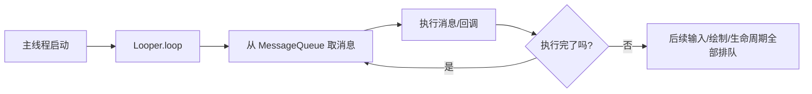
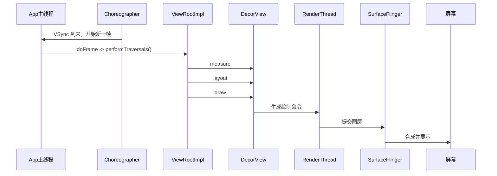

# ANR (Application Not Responding) 基础篇

> 先建立一个最重要的直觉：**ANR 不是“有点卡”，而是系统等你太久，你一直没回话。**

## 1. 为什么要学 ANR？

### 技术演进

早期桌面程序卡一下，用户可能忍忍就过去了；但手机是强交互设备，点一下按钮、滑一下列表，如果几秒都没反应，用户会立刻觉得“这个 App 死了”。

所以 Android 设计了一套**超时保护机制**：
- 你可以慢一点，但不能一直不回应
- 你可以偶尔掉帧，但不能长时间堵住主线程
- 一旦系统判断“用户已经操作了，但 App 长时间没反馈”，就会触发 ANR

### 学它的价值

- 你会真正理解主线程为什么这么“娇气”
- 你能把“卡顿”和“ANR”分清楚
- 你排查线上问题时不会只会说“可能主线程耗时了”
- 你做启动优化、列表优化、自定义 View 优化时会更有方向

## 2. 什么是 ANR？

### 定义

ANR 全称是 `Application Not Responding`，意思是**应用没有在系统规定时间内响应关键事件**。

### 通俗理解

把 Android 系统想成一家餐厅：

- 用户点单 = 点击、滑动、返回键
- 主线程 = 后厨唯一的大厨
- 系统 = 店长

大厨忙一点没问题，但如果顾客点完单，店长等了很久，大厨既不出餐，也不回一句“马上来”，店长就会直接站出来说：**这家店失联了。**

这就是 ANR。

### 它和卡顿的区别

| 现象 | 本质 | 用户感知 |
|-----|-----|---------|
| 掉帧 | 单帧没在预算时间内完成 | 动画不流畅 |
| 卡顿 | 连续多帧超时 | 页面明显发涩 |
| 假死 | 主线程短时间完全被堵 | 按了没反应，但未必弹窗 |
| ANR | 系统等待关键响应超时 | 弹出“应用无响应” |

一句话记忆：

> **掉帧是“这一帧慢了”，ANR 是“系统催你很久，你还没答复”。**

## 3. 主线程为什么这么关键？

Android 的 UI 是**单线程模型**。绝大部分 UI 工作都在主线程完成：

- 分发生命周期
- 处理点击、滑动、键盘输入
- 执行 `Handler` 消息
- 触发一帧渲染
- 更新 View 树

### 主线程工作模型



这就是为什么主线程特别像**单车道收费站**：

- 前面一辆车堵住了
- 后面的点击、绘制、动画、回调全都过不去

## 4. 页面是怎么画出来的？

你提到要从 `ViewRootImpl` 开始学，这个切入点很对，因为它就是**View 树和系统窗口之间的桥**。

### 一帧渲染全景图



### 核心角色怎么分工？

| 角色 | 职责 |
|-----|-----|
| `Choreographer` | 接收 VSync 节拍，安排这一帧什么时候开始 |
| `ViewRootImpl` | 发起 View 树遍历，是渲染总调度者 |
| `DecorView` | 整棵页面 View 树的根 |
| `RenderThread` | 负责部分渲染命令执行，减轻主线程压力 |
| `SurfaceFlinger` | 系统合成器，负责最终显示 |

### `performTraversals()` 做了什么？

可以把它理解成装修三步：

1. `measure`：先量尺寸，看看每个 View 占多大
2. `layout`：再摆位置，确定 left/top/right/bottom
3. `draw`：最后真正画出来

### 简化源码

```java
// ViewRootImpl.performTraversals() 简化理解版
private void performTraversals() {
    performMeasure(childWidthMeasureSpec, childHeightMeasureSpec);
    performLayout(lp, mWidth, mHeight);
    performDraw();
}
```

虽然代码看着简单，但这三步里随便一个步骤太重，都可能把主线程拖慢。

## 5. 从渲染卡顿到 ANR，中间差了什么？

### 先记住 16.6ms

60Hz 屏幕下，一帧预算大约是 `16.6ms`。

- 10ms 做完：很流畅
- 25ms 做完：掉帧
- 连续几百毫秒：明显卡
- 连续几秒关键事件没响应：可能 ANR

### 为什么“绘制慢”会引发 ANR？

因为绘制不是孤立发生的，它和输入事件、公用消息队列都在抢主线程。

比如：

1. 用户点击按钮
2. 主线程执行点击回调
3. 回调里做了数据库查询、网络请求、复杂 JSON 解析
4. 接着触发 `requestLayout()` / `invalidate()`
5. 下一帧还要走 `measure/layout/draw`
6. 此时新的点击事件、返回键事件已经排队
7. 系统等太久，发现窗口始终没响应，于是判定 ANR

所以很多时候，**ANR 不是“绘制函数本身超时”，而是主线程整体已经被拖死了。**

## 6. Android 常见 ANR 类型

### 6.1 Input ANR

最常见，也最贴近用户体验。

- 场景：点击、滑动、按键后，应用迟迟不处理
- 常见阈值：约 `5s`
- 典型原因：主线程被耗时任务、锁、Binder 调用堵住

### 6.2 Broadcast ANR

- 场景：`BroadcastReceiver` 执行太久
- 常见阈值：前台广播约 `10s`，后台广播可能更长
- 典型原因：在 `onReceive()` 里做重活

### 6.3 Service ANR

- 场景：Service 相关生命周期或前台服务时限没满足
- 常见阈值：不同版本、前后台状态下不完全一样
- 典型原因：Service 默认也跑在主线程，却被当成“后台逻辑”乱写

### 6.4 ContentProvider / 启动期 ANR

- 场景：应用冷启动时初始化太重，Provider 或 `Application.onCreate()` 阻塞
- 典型原因：把大量 SDK 初始化、磁盘读写、类加载都堆在启动阶段

> **注意**：不同 Android 版本、不同组件场景的超时时间会有差异，排障时要以当下系统版本和日志为准。

## 7. 最常见的 ANR 根因

### 7.1 主线程直接做耗时 IO

```kotlin
button.setOnClickListener {
    val userJson = File(filesDir, "user.json").readText() // 磁盘 IO，直接堵主线程
    titleView.text = userJson
}
```

### 7.2 主线程等待锁

子线程拿着锁做重活，主线程过来一等，整个界面就像被人反锁在门外。

### 7.3 主线程做 Binder 慢调用

很多系统服务调用底层就是 Binder，别看只是一个方法，背后可能跨进程、查磁盘、等远端返回。

### 7.4 布局和绘制太重

比如：
- 首屏层级过深
- `RecyclerView` item 里做复杂计算
- 自定义 View 在 `onDraw()` 里频繁创建对象
- 反复 `requestLayout()`

### 7.5 启动阶段塞太多初始化

很多线上 ANR 都不是“用户点按钮卡死”，而是**App 还没打开完就已经被自己初始化拖住了**。

## 8. 最简单的正确做法

> **推荐原则**：主线程只做“调度”和“轻量 UI 更新”，重活交给后台线程。

```kotlin
class UserProfileActivity : AppCompatActivity() {

    override fun onCreate(savedInstanceState: Bundle?) {
        super.onCreate(savedInstanceState)

        lifecycleScope.launch {
            val profile = withContext(Dispatchers.IO) {
                // 把磁盘或网络这类慢操作移出主线程
                repository.loadProfile()
            }
            renderProfile(profile) // 回到主线程只更新 UI
        }
    }

    private fun renderProfile(profile: UserProfile) {
        title = profile.name
    }
}
```

### 这段代码为什么更安全？

- 主线程不再直接堵在 IO 上
- UI 更新仍然留在主线程，符合 Android 线程模型
- 任务边界清晰，后续更容易做超时、取消、监控

## 9. 新手最容易踩的坑

| 坑 | 为什么危险 |
|---|-----------|
| 在 `onCreate()` 里同步初始化一堆 SDK | 首屏还没起来，主线程先被堵住 |
| 在 `onReceive()` 里做网络/数据库操作 | 广播有明确超时限制 |
| 在主线程直接 `execute()` 网络请求 | 不是“可能卡”，而是很容易直接 ANR |
| 滥用 `synchronized` | 主线程一旦等锁，整条消息队列跟着堵 |
| 自定义 View 每帧频繁 new 对象 | 轻则掉帧，重则 GC 抖动叠加卡顿 |

## 10. 面试题检验

### Q1：什么是 ANR？

**结论**：ANR 是应用没有在系统规定时间内响应关键事件。

**原理**：Android 会对输入、广播、Service 等关键场景设置超时，如果超时前系统没拿到预期响应，就会判定应用无响应。

**举例**：用户点击按钮后，主线程被数据库查询堵住 5 秒以上，常见就是 Input ANR。

### Q2：为什么主线程容易引发 ANR？

**结论**：因为主线程承担了 UI、输入、生命周期和消息分发等核心职责。

**原理**：它本质上是单线程消息循环，前面的任务不结束，后面的事件就无法执行。

**举例**：`onClick()` 里做网络请求，后面的绘制和输入事件全被排队。

### Q3：`ViewRootImpl` 和 ANR 有什么关系？

**结论**：`ViewRootImpl` 本身不是 ANR 检测器，但它是页面渲染主入口，渲染过重会拖慢主线程，进而诱发 ANR。

**原理**：`ViewRootImpl` 通过 `performTraversals()` 触发 measure、layout、draw，这些步骤都跑在主线程关键路径上。

**举例**：页面频繁 `requestLayout()`，导致遍历成本飙升，输入事件长时间得不到处理。

### Q4：掉帧和 ANR 有什么区别？

**结论**：掉帧是单帧超时，ANR 是系统级超时。

**原理**：掉帧关注的是 16.6ms 帧预算，ANR 关注的是关键事件几秒级没响应。

**举例**：动画偶尔不顺是掉帧；点返回 5 秒还没反应，系统弹窗就是 ANR。

### Q5：避免 ANR 最核心的原则是什么？

**结论**：不要让主线程做重活，也不要让它长时间等别人。

**原理**：主线程怕的不是“工作多”，而是“不可中断地长时间阻塞”。

**举例**：把 IO、计算、跨进程慢调用放后台线程；把大任务拆小；减少锁竞争。

---
_本文档持续更新中，建议继续阅读进阶篇和源码篇把整条链路打通_
