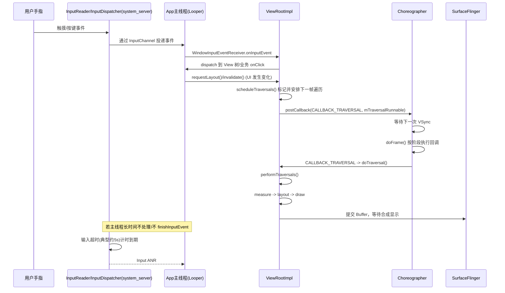
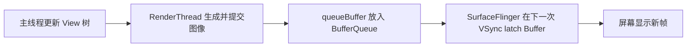

# ANR (Application Not Responding) 进阶篇

> 这一篇专门把你关心的主线串起来：**`ViewRootImpl` 怎么驱动页面渲染，主线程为什么会被拖死，系统又为什么会最终判定 ANR。**

## 1. 先搭一条完整主线

很多人学 ANR 是碎的：

- 知道主线程不能做耗时操作
- 知道输入超时 5 秒会 ANR
- 也知道 `ViewRootImpl` 负责绘制

但这三件事怎么连起来，常常是断的。

### 1.1 从用户操作到 ANR 的完整流程（专家版）

先给你一条“能对上源码”的主链路：



这条链路里最关键的 4 个点：

1. **输入和渲染都依赖主线程消息循环**（同一条“单车道”）  
2. `requestLayout()/invalidate()` **不会立刻绘制**，而是进入 `scheduleTraversals()` 合批  
3. 真正执行三大流程的是 `performTraversals()`，触发时机在下一帧 `VSync` 对齐点  
4. ANR 判定看的是“关键响应超时”，不是“某一帧慢”

## 2. 页面渲染到底是怎么被驱动的？

### 2.1 `requestLayout()` 和 `invalidate()` 不是立刻重画

很多初学者以为一调用 `requestLayout()`，系统就马上开始 measure/layout/draw。其实不是。

更准确地说：

- `requestLayout()`：告诉系统“布局脏了，下次遍历要重新量和摆”
- `invalidate()`：告诉系统“内容脏了，下次遍历要重绘”
- 真正开始遍历，要等 `Choreographer` 配合 VSync 在合适时机统一调度

这就是 Android 的一个重要设计哲学：

> **不零敲碎打地随叫随画，而是攒到下一帧统一处理。**

### 2.2 `scheduleTraversals()` 在哪个阶段？它到底干什么？

你可以把它理解成：

> **“用户态 UI 改动”和“系统下一帧遍历执行”之间的总闸门。**

它出现的阶段是：
- 业务代码改了 UI（`requestLayout` / `invalidate` / 窗口属性变化）之后
- 真正进入 `performTraversals()` 之前

典型调用路径（简化）是：

```text
View.requestLayout()
  -> ViewRootImpl.requestLayout()
     -> ViewRootImpl.scheduleTraversals()
```

`scheduleTraversals()` 核心做三件事：

1. **去重**：`mTraversalScheduled = true`，避免同一帧重复安排多次遍历  
2. **插同步屏障**：让异步输入/动画/遍历消息优先，减少普通同步消息干扰帧节奏  
3. **挂帧回调**：向 `Choreographer` 注册 `CALLBACK_TRAVERSAL`，等下一次 VSync 到来执行

所以它不是“做遍历”，而是“**预约遍历**”。

### 2.3 `Choreographer` 到底干啥？

一句话：

> **`Choreographer` 是主线程的“帧调度器”，负责把一帧内该做的事按时序组织起来。**

它不是只管动画，它管一帧里的多个阶段。`doFrame()` 时会按顺序执行不同 callback 队列（简化理解）：

1. `CALLBACK_INPUT`：输入相关处理
2. `CALLBACK_ANIMATION`：动画和 `postFrameCallback`
3. `CALLBACK_INSETS_ANIMATION`：窗口 inset 动画相关
4. `CALLBACK_TRAVERSAL`：`ViewRootImpl` 遍历（重点）
5. `CALLBACK_COMMIT`：收尾提交

这就是为什么我们常说它是“节拍器 + 调度员”，而不是一个普通工具类。

### 2.4 `Choreographer` 是如何执行到 `ViewRootImpl.performTraversals()` 的？

把链路拆开你就很清晰了：

```text
ViewRootImpl.scheduleTraversals()
  -> Choreographer.postCallback(CALLBACK_TRAVERSAL, mTraversalRunnable)
  -> 等待 DisplayEventReceiver 收到 VSync
  -> Choreographer.doFrame()
  -> doCallbacks(CALLBACK_TRAVERSAL)
  -> ViewRootImpl.mTraversalRunnable.run()
  -> ViewRootImpl.doTraversal()
  -> ViewRootImpl.performTraversals()
     -> measure/layout/draw
```

也就是说：

- `Choreographer` **不直接画 View**
- 它做的是“在正确帧时机调用遍历回调”
- 真正执行三大流程的主体一直是 `ViewRootImpl`

### 2.4.1 `RenderThread` 为什么重要？

很多文章讲渲染时只讲主线程和 `ViewRootImpl`，但从 Android 5.0 之后，`RenderThread` 已经是理解卡顿和渲染链路时绕不过去的角色。

### 它到底干什么？

你可以把它理解成**专门给渲染打下手的线程**：

- 主线程负责更新 View 树状态
- 主线程把要画什么整理成绘制命令
- `RenderThread` 负责执行或推进一部分真正的 GPU 渲染工作

### 为什么系统要把它拆出来？

因为如果所有事情都压在主线程上：

- 输入处理会更容易排队
- 一帧里的 CPU 工作会更重
- UI 更新和 GPU 提交会互相拖累

拆出 `RenderThread` 后，Android 的思路变成了：

> **主线程决定“画什么”，`RenderThread` 更偏向负责“怎么更快地把它交给渲染管线”。**

### 但它不能替主线程背锅

这点很关键：

- `RenderThread` 再强，也替代不了主线程做 `measure/layout`
- 点击事件、生命周期、业务回调仍然在主线程
- 所以 `RenderThread` 慢，更常见的是掉帧；真正的 ANR，根一般还在主线程响应性

### 2.5 如果这次 `draw` 很慢，页面到底会发生什么？

很多人只知道“慢了就掉帧”，但不知道屏幕上到底显示了什么。真正关键的是 `BufferQueue`。

### 先记住这几个角色

| 角色 | 职责 |
|-----|-----|
| App（主线程 + `RenderThread`） | 生产一帧图像 |
| `BufferQueue` | 图像缓冲区队列，连接生产者和消费者 |
| `SurfaceFlinger` | 消费 Buffer，做图层合成 |
| 屏幕 | 显示最终结果 |

### 正常情况下的流程



### 如果当前这一帧没画完，会发生什么？

最常见的结果不是“屏幕黑掉”，而是：

1. 这次新 Buffer 没来得及提交
2. `SurfaceFlinger` 在本次 VSync 只能继续用上一帧的旧 Buffer
3. 用户看到的就是**画面停在上一帧**，也就是常说的“卡住一下”

所以从视觉上看，掉帧更像：

> **电影下一张画面没送到，放映机只能把上一张继续停着。**

### 双缓冲 / 三缓冲到底帮了什么？

- **双缓冲**：前台一个显示，后台一个绘制
- **三缓冲**：再多一个备用 Buffer，允许生产和消费更松一点

三缓冲的好处是：

- 某一帧稍慢时，不一定立刻把整条流水线卡死
- 可以提高吞吐，减少部分抖动

但代价也很现实：

- 延迟可能变大
- 输入到显示的距离可能更远
- 如果你连续很多帧都慢，缓冲再多也救不了

### BufferQueue 满了会怎样？

这才是很多人没讲清楚的地方。

如果 App 生产太慢，通常表现为旧帧被反复显示；如果 App 或 `SurfaceFlinger` 的生产消费节奏长期失衡，可能出现：

- 新 Buffer 迟迟提交不上去
- 生产者在 `dequeueBuffer` / `queueBuffer` 环节等待
- 整体渲染延迟进一步上升

这时候现象往往是：

- 动画像拖影
- 页面“不是完全死掉”，但明显跟手性很差
- 输入来了，视觉反馈晚很多

### 它和 ANR 的关系是什么？

Buffer 问题本身更直接对应的是**卡顿、掉帧、显示延迟**，不是直接等于 ANR。

但如果情况变成：

- 主线程本身也在忙
- 输入事件处理排队
- 视觉反馈还不断滞后

那用户感知就会从“有点卡”迅速升级成“这个页面是不是死了”，而系统层面也更容易演变成 Input ANR。

### 2.6 为什么重布局很危险？

`measure/layout/draw` 并不只是“画一下”。

如果页面复杂，它背后可能包含：

- 深层 View 树递归测量
- 文本排版计算
- 图片解码后的尺寸适配
- `RecyclerView` item 绑定
- 自定义 View 的路径计算
- 触发对象分配和 GC

所以问题不在于 `performTraversals()` 这个方法名，而在于它背后的**整棵 View 树成本**。

### 2.7 一个页面 3 个 View，只改 1 个，另外两个会不会重走三大流程？

这是理解渲染性能最关键的问题之一。结论先说：

- **不一定会全部重走**
- 取决于你触发的是 `requestLayout()` 还是 `invalidate()`

#### 场景 A：只触发 `invalidate()`（内容变了，尺寸位置不变）

常见例子：
- 文字颜色变了
- 进度条值变了
- 自定义 View 的某个绘制参数变了

这时通常：
- 不需要全树 `measure/layout`
- 会走绘制阶段，但会尽量按“脏区（dirty region）”局部刷新
- 没脏的节点可以复用已有的 `RenderNode` / DisplayList，不必每次都重新录制全部绘制命令

你可以把它理解成：

> 只改了客厅的一盏灯，装修队不会把整套房子重新量房。

#### 场景 B：触发 `requestLayout()`（尺寸或位置约束可能变了）

常见例子：
- 文本从一行变三行，控件高度变了
- 某个 View 的 `LayoutParams` 改了
- 父布局约束改变，可能影响子节点尺寸

这时系统会把“需要重新布局”的标记向上冒泡到父节点，下一帧可能重新走对应子树甚至更大范围的 `measure/layout`。

所以不是“所有 View 永远都全量三件套”，而是：

- **内容变化优先走局部重绘**
- **结构/约束变化才触发布局重算**

### 2.8 页面滑动时，`draw` 会不会重新执行？

先给结论：

- 大多数滑动场景下，**`draw` 会持续执行（每帧）**
- 但通常**不需要每帧都做全量 `measure/layout`**

#### 为什么滑动时还要 draw？

因为屏幕上的像素位置每一帧都在变：
- 内容在移动
- 新区域露出来
- 可能有阴影、分割线、渐变、动画叠加

即使“数据没变”，也需要按新位置把这一帧画出来。

#### 那为什么经常不需要重新 measure/layout？

因为滑动多数是“位移变化”，不是“尺寸约束变化”。

- 尺寸没变：通常不必重新测量
- 约束没变：通常不必重新布局
- 位置在变：需要重绘当前帧

#### 以 `RecyclerView` 为例要注意两层含义

- 对“单个 item 内容”而言：不一定每帧都重新绑定数据
- 对“容器可见区域”而言：滑动中会不断有 item 进出屏幕，`LayoutManager` 可能触发布局计算与复用

所以实战里你会看到：

- 普通滑动时，主要压力在 `draw` + 合成
- 快速滑动且 item 复杂时，会叠加 bind/layout 成本

## 3. 为什么卡顿会升级成 ANR？

### 3.1 掉帧只说明“这帧来不及了”

例如一帧花了 `40ms`：

- 这帧肯定掉了
- 动画会不顺
- 但不一定 ANR

### 3.2 ANR 说明“系统等你好久都没等到”

比如：

1. 用户点击搜索
2. 主线程同步读数据库 + 解析大 JSON + 刷新复杂列表
3. 主线程连续忙 6 秒
4. 这期间新的输入事件没处理
5. 系统认为窗口没响应，于是抛出 ANR

所以可以把两者理解成：

| 现象 | 时间尺度 | 本质 |
|-----|---------|-----|
| 掉帧 | 16.6ms 级别 | 帧预算超时 |
| 卡顿 | 几十到几百毫秒 | 连续掉帧 |
| ANR | 秒级 | 系统级等待超时 |

## 4. 最常见的 ANR 根因，为什么它们会把主线程拖死？

## 4.1 CPU 重计算

比如：
- 大 JSON 解析
- 大列表排序
- 图片压缩
- 正则大量匹配

这类问题像让收银员一边收钱一边手工算全年财务报表，理论上能做，但做的时候没人接待顾客。

## 4.2 磁盘 IO

包括：
- 读本地大文件
- 同步 `SharedPreferences`
- 数据库大查询
- 首屏读取大量配置

磁盘 IO 的可怕之处不是“绝对慢”，而是**抖动大**，你以为 20ms，线上某些机型可能突然 500ms 甚至更久。

## 4.3 锁竞争

这类最容易阴人，因为主线程代码看上去可能只有一行：

```kotlin
synchronized(lock) {
    render(data)
}
```

但如果别的线程正拿着这个锁做大任务，主线程就会一直等。

### 典型栈特征

- `Blocked`
- `waiting to lock`
- 某个监视器 `held by thread xxx`

## 4.4 Binder 慢调用

别把跨进程调用想得太轻。

这些操作都可能慢：
- `PackageManager`
- `ContentResolver`
- 系统服务查询
- 某些 SDK 内部 IPC

主线程做 Binder 调用，本质上是在说：

> “我这个最关键的线程，先停下来等等另外一个进程。”  

这当然很危险。

## 4.5 布局与绘制过重

重点场景：
- 首屏 inflate 很深
- `ConstraintLayout` 嵌套使用不当
- `RecyclerView` item 每次 bind 都做复杂计算
- 自定义 View 的 `onMeasure()` / `onDraw()` 成本过高
- 频繁 `requestLayout()`

这类问题最容易从“流畅性差”进一步拖成“输入无响应”。

## 4.6 GC 与内存抖动

如果主线程频繁分配对象，GC 会不断介入。

单次 GC 未必会 ANR，但**渲染重 + 分配多 + GC 频繁 + 输入密集**叠在一起时，主线程就容易彻底掉队。

## 4.7 启动阶段重初始化

这是线上 ANR 高频区：

- `Application.onCreate()` 初始化太多 SDK
- 冷启动时 ContentProvider 提前做重活
- 首屏同时做网络、数据库、路由、埋点、AB 配置

用户还没来得及看到页面，主线程已经背了十个包。

## 5. 线上排查时，先看什么？

## 5.1 第一眼看 traces

ANR 排查里最值钱的不是猜，而是主线程栈。

你要先回答这几个问题：

1. 主线程是在跑代码，还是在等？
2. 如果在跑，跑的是谁？
3. 如果在等，在等锁、等 Binder、等 IO，还是等条件变量？
4. 栈顶和业务代码能不能直接对上？

### 常见主线程状态解读

| 栈特征 | 说明 | 常见根因 |
|-------|-----|---------|
| `Runnable` | 正在执行 | CPU 重任务、死循环、复杂布局 |
| `Blocked` | 等锁 | 锁竞争 |
| `Native pollOnce` | 可能在空闲等消息 | 需要结合其他线程和日志判断 |
| `BinderProxy.transact` | 正在做跨进程调用 | Binder 慢调用 |
| `FileInputStream` / SQLite | 同步 IO | 磁盘或数据库耗时 |

## 5.2 第二眼看 logcat

重点关键词：

- `ANR in`
- `Input dispatching timed out`
- `Broadcast of Intent`
- `executing service`
- `Reason:`

这些信息能帮助你判断它到底是哪一类 ANR。

## 5.3 第三眼看时间线

建议结合：

- `Perfetto`
- `System Trace`
- 帧监控
- 启动阶段打点

因为很多 ANR 不是某一行代码“特别坏”，而是一串中等耗时任务排在一起，把主线程拖爆了。

## 6. 怎么治？不要只会说“丢子线程”

## 6.1 原则一：主线程只做关键且短小的事

适合留在主线程的事：
- 轻量状态切换
- View 更新
- 生命周期调度
- 小量数据绑定

不适合的事：
- 大计算
- 大 IO
- 可等待的远程调用
- 大规模初始化

## 6.2 原则二：把“大任务”拆成“小片”

一次做 300ms，用户明显能感知；拆成多个小任务穿插到多帧里，观感往往会好很多。

### 示例：把重计算移出主线程

```kotlin
class SearchViewModel(
    private val repository: SearchRepository
) : ViewModel() {

    fun search(keyword: String) {
        viewModelScope.launch {
            val result = withContext(Dispatchers.Default) {
                // 大量过滤、排序、映射不要放主线程
                repository.search(keyword)
            }
            _uiState.value = UiState.Success(result)
        }
    }
}
```

## 6.3 原则三：减少锁和共享可变状态

比起“怎么把锁写对”，更实用的是：

- 少共享
- 少嵌套锁
- 少让主线程参与锁竞争
- 用不可变对象和消息传递替代部分共享状态

## 6.4 原则四：不要在启动阶段一口吃成胖子

推荐思路：

- 必需初始化和非必需初始化分层
- 首屏强依赖先做
- 统计、埋点、广告、配置等尽量延后或异步
- 用基线配置和懒加载兜底

## 6.5 原则五：布局问题要从“整棵树”看，不要只盯单个 View

可落地的动作：

- 减少层级
- 避免首屏过度 inflate
- `RecyclerView` 预计算展示数据
- 文本排版、图片尺寸计算前移
- 自定义 View 避免每帧对象创建

## 6.6 原则六：建立监控，而不是等用户骂

推荐监控项：

- 主线程卡顿阈值监控
- 帧耗时监控
- ANR 率按页面、机型、版本、ROM 维度聚合
- 启动阶段关键节点耗时
- 线程池饱和、队列积压、锁等待统计

## 7. 一套实战排查顺序

1. 先确认是 `Input`、`Broadcast`、`Service` 还是启动阶段 ANR。
2. 再看主线程栈，判断它是在“跑”还是“等”。
3. 如果在跑，找最重的业务逻辑、布局遍历或循环。
4. 如果在等，找锁、Binder、数据库、文件 IO。
5. 把问题放回用户场景里看：点击、启动、切页、首屏、广播、后台恢复。
6. 最后再制定治理方案，不要上来就“全部改协程”。

## 8. 容易误判的地方

| 误判 | 正确认知 |
|-----|---------|
| 看到 `nativePollOnce` 就说主线程没问题 | 可能只是抓栈时刻刚好在等消息，要结合上下文 |
| 只盯主线程，不看持锁线程 | 很多 ANR 真正的坏人藏在别的线程 |
| 觉得 RenderThread 慢就一定是 ANR | RenderThread 更常见的是掉帧，ANR 关键还是主线程响应性 |
| 只会说“开线程” | 线程开多了也会争抢 CPU、锁、IO，问题可能更复杂 |

## 9. 面试题检验

### Q1：从 `ViewRootImpl` 开始，描述一次页面渲染流程

**结论**：`Choreographer` 在 VSync 到来时调度 `ViewRootImpl`，`ViewRootImpl` 再通过 `performTraversals()` 触发 `measure`、`layout`、`draw`。

**原理**：页面不是调用一次 `invalidate()` 就立刻重画，而是通过帧调度机制统一合批到下一帧执行。

**举例**：点击按钮后触发 `requestLayout()`，真正的布局和绘制通常发生在下一次帧回调里。

### Q2：为什么复杂页面渲染可能引发 ANR？

**结论**：因为渲染走在主线程关键路径上，太重会影响输入与消息处理。

**原理**：主线程同时负责输入、生命周期、Handler 和渲染；一旦布局、绘制、绑定数据过重，后续关键响应就会排队。

**举例**：首屏层级深、图片和文本计算都堆在主线程，点返回后也迟迟没反应。

### Q3：掉帧为什么不一定是 ANR？

**结论**：掉帧关注帧预算，ANR 关注系统超时，两者不是一个量级。

**原理**：16.6ms 超时会掉帧，但系统一般要等几秒关键事件未响应才会判定 ANR。

**举例**：动画一顿一顿不一定弹窗，但输入事件 5 秒没处理通常就危险了。

### Q4：线上排查 ANR，最重要的材料是什么？

**结论**：主线程 traces 栈最关键。

**原理**：它能直接告诉你主线程是在跑什么、等什么，比猜测“是不是主线程耗时”更有价值。

**举例**：如果栈顶是 `BinderProxy.transact`，排查方向就该优先放到跨进程慢调用。

### Q5：治理 ANR 的核心思路是什么？

**结论**：缩短主线程关键路径，减少等待，建立监控。

**原理**：ANR 本质是响应能力丢失，所以治理必须覆盖代码执行、资源竞争、启动节奏和可观测性。

**举例**：把大任务异步化、把初始化延后、减少锁竞争、做线上 ANR 分类聚合。

### Q6：页面有 3 个 View，只改 1 个，另外两个会不会也重走 measure/layout/draw？

**结论**：不一定，关键看你触发的是重布局还是重绘。

**原理**：
- `invalidate()` 主要标记绘制脏区，倾向局部重绘
- `requestLayout()` 会触发布局请求，可能让相关父子节点重新走 `measure/layout`

**举例**：改文本颜色通常只需重绘；改字体大小导致高度变化，可能触发父布局重新测量。

### Q7：页面滑动时，为什么看起来“没改内容”也会持续 draw？

**结论**：因为像素位置每帧都在变，仍然需要重新绘制当前帧。

**原理**：滑动大多不改变尺寸约束，所以常不需要全量 `measure/layout`，但位移变化会触发每帧绘制与合成。

**举例**：`RecyclerView` 滑动时通常是每帧绘制新位置；当新 item 进入可见区时，还会叠加 bind/layout 成本。

---
_本文档持续更新中，建议继续阅读源码篇，把系统判定逻辑和关键源码彻底吃透_
