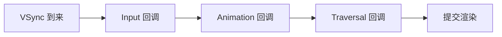
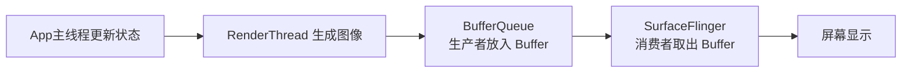
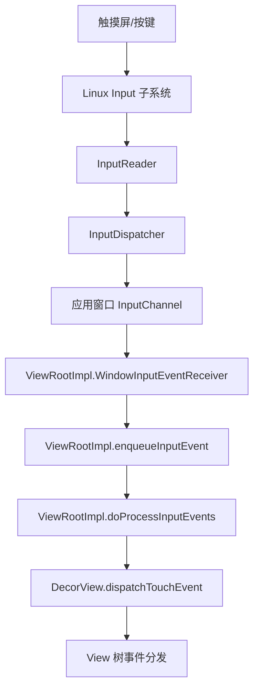

# ANR (Application Not Responding) 源码篇

> 这一篇不追求把系统源码每一行背下来，而是抓住最关键的设计思想：**Android 为什么这样设计，`ViewRootImpl` 和输入系统是怎么把“卡”一步步演变成“ANR”的。**

## 1. 设计哲学：为什么 Android 要把 UI 收口到主线程？

### 一句话总结

Android 的 UI 系统选择单线程，不是因为“实现简单”，而是因为**一致性比并发更重要**。

### 为什么不让多个线程同时更新 UI？

如果多线程同时改 View 树，会马上出现这些问题：

- 谁先改尺寸？
- 谁后改位置？
- 同一帧里状态是否一致？
- 绘制时节点正在被别的线程修改怎么办？

所以 Android 选了一个非常务实的方案：

> **所有 UI 改动收口到主线程，换来状态一致、调度清晰、问题可控。**

代价就是：

- 主线程必须足够轻
- 一旦主线程卡住，影响面非常大

## 2. 从 `requestLayout()` 到 `performTraversals()`

## 2.1 `scheduleTraversals()` 的核心意义

当 View 树需要重新布局或重绘时，系统不会马上同步执行，而是先“预约下一帧”。

```java
// ViewRootImpl.scheduleTraversals() 简化版
void scheduleTraversals() {
    if (!mTraversalScheduled) {
        mTraversalScheduled = true;
        mChoreographer.postCallback(
                Choreographer.CALLBACK_TRAVERSAL,
                mTraversalRunnable,
                null);
    }
}
```

### 这里体现了什么设计思想？

1. **合批**：多次 `requestLayout()` 尽量并到一帧里
2. **节流**：避免每次状态变化都立刻全树遍历
3. **与显示节拍对齐**：配合 VSync，提高渲染效率

这就像快递站不会每来一个包裹就单独发车，而是攒一车一起送。

## 2.2 VSync 到来后发生什么？

```java
// ViewRootImpl 中的遍历任务
final TraversalRunnable mTraversalRunnable = new TraversalRunnable();

final class TraversalRunnable implements Runnable {
    @Override
    public void run() {
        doTraversal();
    }
}

void doTraversal() {
    if (mTraversalScheduled) {
        mTraversalScheduled = false;
        performTraversals();
    }
}
```

### 关键点

- `scheduleTraversals()` 只是挂号
- 真正看病的是 `performTraversals()`

## 2.3 `performTraversals()` 为什么是渲染总入口？

```java
// ViewRootImpl.performTraversals() 简化版
private void performTraversals() {
    if (layoutRequested) {
        performMeasure(childWidthMeasureSpec, childHeightMeasureSpec);
        performLayout(lp, desiredWindowWidth, desiredWindowHeight);
    }

    if (!cancelDraw) {
        performDraw();
    }
}
```

### 它为什么容易出现在性能问题主线上？

因为这里不是“一个方法”，而是整棵树的成本入口：

- `performMeasure()` 触发递归测量
- `performLayout()` 触发布局定位
- `performDraw()` 触发绘制提交

如果某个页面结构复杂，这里就会成为主线程的大型施工现场。

## 3. `Choreographer` 如何串起输入、动画和遍历？

很多人只知道它管帧，实际上它更像一个总排班员。



### 这个顺序为什么重要？

- 先处理输入：用户操作优先
- 再跑动画：保证连续性
- 最后遍历和绘制：把状态统一落到界面上

如果主线程前面已经被重任务占满，后面的这些回调都只能排队。

这就是“掉帧”和“输入延迟”常常同时出现的根本原因。

## 3.1 `RenderThread` 为什么必须单独讲？

如果只讲 `ViewRootImpl`，你会误以为页面渲染几乎全在主线程完成。实际上现代 Android 渲染链路里，`RenderThread` 是非常重要的一环。

### 它的职责怎么理解？

可以粗暴但准确地理解成：

- 主线程负责更新 View 树状态
- 主线程通过 `draw()`、`RenderNode` 等机制产出绘制意图
- `RenderThread` 负责把这些意图继续推进到 GPU 渲染管线

### 为什么要这样拆？

因为 Android 想把两件事尽量拆开：

1. **UI 状态计算**：必须依赖主线程的一致性
2. **渲染命令执行**：可以更多交给专门的渲染线程

这体现的是很典型的设计权衡：

- 不把 UI 改动并发化，保证一致性
- 但把渲染执行尽量并行化，降低主线程压力

### 你排查问题时怎么理解它？

- `main` 慢：更容易引发输入延迟、生命周期阻塞、ANR
- `RenderThread` 慢：更容易引发掉帧、显示延迟、动画不顺

所以很多时候：

> **`RenderThread` 决定“画面顺不顺”，主线程决定“系统会不会觉得你没响应”。**

## 3.2 BufferQueue：如果这次 `draw` 很慢，页面会怎样？

这部分不搞清楚，就很容易只会说“慢了就掉帧”，但解释不清用户实际看到了什么。

### 生产者和消费者模型



### 正常情况下

1. App 先拿到一个可用 Buffer
2. 把这一帧内容画进去
3. 调用 `queueBuffer` 提交
4. `SurfaceFlinger` 在合适的 VSync 时机取走并合成显示

### 如果当前这一帧太慢，还没画完

最常见情况是：

- 新 Buffer 还没准备好
- `SurfaceFlinger` 赶不上拿到新帧
- 屏幕继续显示上一帧的旧 Buffer

于是用户看到的不是“半张新图”，而是：

> **旧画面多停了一会。**

这就是掉帧最直观的视觉表现。

### 三缓冲为什么能缓一口气？

双缓冲像只有两个盘子轮换，三缓冲像多备了一个盘子：

- 生产者可以更从容一点
- 消费者也不至于每次都刚性等待

但它只是缓冲，不是魔法：

- 连续慢帧照样会卡
- 缓冲层数增加后，显示延迟可能变大

### 更糟的情况：BufferQueue 卡住

如果生产和消费长期失衡，可能出现：

- App 拿不到空闲 Buffer
- 在 `dequeueBuffer` 时等待
- 或者提交节奏持续落后

这时你在性能工具里看到的，常常不是单一方法慢，而是整条渲染流水线开始“积压”。

### 这和 ANR 的边界

一定要分清：

- BufferQueue 问题直接对应的是**掉帧、显示延迟**
- ANR 关注的是**关键事件迟迟没响应**

但两者会互相放大：

- 视觉上一直不刷新，用户会更快觉得“死了”
- 如果主线程同时也被堵住，输入超时就更容易升级成 ANR

## 3.3 只改一个 View，系统怎么判断要不要全量三大流程？

先说结论：Android 不是每次都“全树 measure/layout/draw”。它靠一组“脏标记 + 请求标记”来决定范围。

### 关键判断信号

- `requestLayout()`：说明布局可能失效，触发布局请求链
- `invalidate()`：说明绘制内容失效，触发脏区重绘
- `PFLAG_FORCE_LAYOUT`（View 内部标记）：提示该节点需要重新测量
- `mLayoutRequested`（`ViewRootImpl` 侧）：提示这帧需要布局阶段

### 为什么不是每次都全量？

因为代价太高。系统做的是“按影响面付费”：

- 只影响像素内容：尽量只重绘
- 影响尺寸和约束：才扩大到布局计算

### 一个实战对比

- 改按钮背景色：通常 `invalidate()` 即可，布局阶段可跳过
- 改文本大小导致换行：通常会 `requestLayout()`，相关父子层级需要重新测量和布局

这就是你在性能排查里经常看到的现象：

> “有些更新只掉一点帧；有些更新直接让整棵树变重。”

## 3.4 页面滑动时，`draw` 为什么通常还在每帧执行？

很多同学会误解：滑动只是位置变了，是否可以不 `draw`？

### 真实情况

大部分滑动场景下，`draw` 仍会持续发生（每帧）。

原因是：

- 可见像素区域在变化
- 图层合成结果每帧都不同
- 新旧可见区域切换需要新的帧内容

### 那为什么经常不需要每帧 measure/layout？

因为多数滑动不改变约束关系：

- 宽高约束没变
- 父子布局规则没变
- 变化主要是位移和可见区域

所以常见模式是：

- 布局阶段：按需触发（不是每帧）
- 绘制/合成阶段：高频发生（接近每帧）

### `RecyclerView` 里的直观理解

- 平稳小幅滑动：主要是位移与重绘成本
- 快速滑动到新区域：会叠加 item 创建/绑定、局部布局与绘制成本

这也是为什么列表卡顿经常不是单点问题，而是：

> **滚动中的绘制压力 + 数据绑定压力 + 可能的 GC/IO 抖动叠加。**

## 4. 输入事件是怎么进到 View 树里的？

## 4.1 输入链路全景图



## 4.2 `InputReader` 到底做了什么？

很多文章直接从 `InputDispatcher` 开始讲，但其实 `InputReader` 才是输入链路的前半场。

### 它的职责

`InputReader` 可以理解成系统的“翻译官”：

- 从 Linux Input 子系统读取原始事件
- 识别输入设备类型（触摸屏、键盘、鼠标等）
- 把原始坐标、按键、电容信息整理成 Android 更容易处理的事件模型
- 把整理后的事件交给 `InputDispatcher`

### 为什么它必须存在？

因为硬件给上来的原始数据很底层：

- 坐标可能是设备原始值
- 多点触控需要跟踪 pointer id
- 不同厂商设备能力不完全一致

如果没有 `InputReader` 这一层，后面的窗口分发逻辑会又脏又乱。

### 简化理解版

```cpp
// 伪代码：InputReader 工作模式
loopOnce() {
    RawEvent rawEvent = readEventFromKernel();
    NotifyArgs args = process(rawEvent); // 识别设备、归一化、组装事件
    mDispatcher->notifyMotion(args);     // 交给 InputDispatcher
}
```

### `InputReader` 和 `InputDispatcher` 的区别

| 组件 | 更像什么角色 | 核心职责 |
|-----|-------------|---------|
| `InputReader` | 翻译官 | 读取并整理原始输入 |
| `InputDispatcher` | 调度员 | 决定把事件发给哪个窗口 |

所以输入链路不要只记后半段，要记成：

> **先读原始事件，再做设备语义转换，最后才是窗口分发。**

## 4.3 输入为什么一定要经过 `InputDispatcher`？

因为系统必须先回答这些问题：

- 当前焦点窗口是谁？
- 这个触摸点命中了哪个窗口区域？
- 窗口是否可接收输入？
- 这个事件是否超时、是否被阻塞？

也就是说，`InputDispatcher` 干的不是“转发快递”，而是**带规则的路由和超时管理**。

## 4.4 `ViewRootImpl` 如何接住输入事件？

```java
// ViewRootImpl 中的关键入口，理解版
private int processPointerEvent(QueuedInputEvent q) {
    final MotionEvent event = (MotionEvent) q.mEvent;
    boolean handled = mView.dispatchPointerEvent(event);
    return handled ? FINISH_HANDLED : FORWARD;
}
```

### 这里最关键的不是代码量，而是位置

它说明：

- 输入最终要回到应用主线程
- 事件要经过 `DecorView` 进入整棵 View 树
- 如果主线程正忙，输入就只能排队

## 5. Input ANR 为什么常见，而且为什么通常是 5 秒？

### 一句话总结

因为输入是最直接的用户交互，系统不能容忍你点了半天还像石头一样没反应。

### 机制上怎么理解？

输入系统会期待应用在合理时间内完成事件处理、更新窗口状态或继续消费队列。

如果等待太久，`InputDispatcher` 会认为：

- 这个窗口卡住了
- 用户操作没有被及时处理
- 继续等下去没有意义

于是就会上报超时，最终触发 ANR 流程。

### 设计权衡

- 时间太短：误杀正常但稍慢的场景
- 时间太长：用户已经以为应用死了

所以 5 秒本质上是一个**体验和容错之间的折中值**。

## 6. 系统怎么判定“你没响应”？

不同 ANR 类型的判定方不完全一样，但思路非常统一：

> **系统先发起一件关键工作，再设置超时；如果超时前没等到预期结果，就认定无响应。**

## 6.1 输入类 ANR：更偏向 InputDispatcher / WMS 链路

核心逻辑可以抽象成：

```java
// 伪代码：不是源码原文，只用于理解机制
dispatchInputEvent(window, event);
startTimeout("input", 5s);

if (!window.respondInTime()) {
    reportAnr(window);
}
```

## 6.2 Broadcast / Service 类 ANR：更偏向 AMS 管控

AMS 会在调度组件时记录“开始时间”和“超时点”，如果到点还没结束，就触发异常处理。

```java
// 伪代码：理解 AMS 超时思想
scheduleReceiver(receiver);
handler.sendMessageDelayed(BROADCAST_TIMEOUT, timeout);

if (!receiver.finished()) {
    appNotResponding();
}
```

### 你应该学到的不是常量，而是模式

这个模式非常重要：

1. 系统发起调度
2. 记录超时
3. 等待回调或结束信号
4. 超时未完成，认定 ANR

## 7. 为什么很多 ANR 真正的根因不在主线程栈顶？

这是排障时特别容易掉坑的地方。

### 场景一：主线程在等锁

主线程看起来只是：

```java
// 主线程只做了一次加锁
synchronized (cacheLock) {
    render(data);
}
```

但真正的问题可能是：

- 后台线程拿着 `cacheLock` 正在读数据库
- 或者正在做大 JSON 解析

所以真正的坏人，是**持锁线程**。

### 场景二：主线程在做 Binder 调用

主线程栈顶可能在：

- `BinderProxy.transact`
- `IContentProvider`
- `IPackageManager`

但真正慢的是远端进程。

### 场景三：主线程在等结果

比如：

- `Future.get()`
- `CountDownLatch.await()`
- 条件变量等待

这类代码看上去“没做什么”，其实是在让主线程原地罚站。

## 8. traces 应该怎么读？

## 8.1 先看主线程状态

### `Runnable`

说明主线程正在跑。

排查重点：
- 死循环
- 大计算
- 布局遍历
- 文本/图片处理

### `Blocked`

说明主线程在等锁。

排查重点：
- 哪个锁
- 被哪个线程持有
- 持锁线程在干嘛

### `Waiting`

说明主线程在等某个条件。

排查重点：
- `wait()`
- `sleep()`
- `await()`
- `join()`

### `Binder`

说明可能卡在跨进程通信。

排查重点：
- 调用的是哪个系统服务或 SDK
- 是否可以移到后台线程
- 是否存在远端阻塞

## 8.2 再看旁边线程

真正高效的 ANR 分析，不是只盯 `main`，而是看：

- `RenderThread`
- Binder 线程池
- 持锁线程
- 线程池工作线程
- 远程服务相关线程

## 9. 能借鉴到自己业务代码里的设计思想

### 9.1 合批思维

`scheduleTraversals()` 的价值告诉我们：

- 高频变更不要每次都立即全量执行
- 可以合并、节流、延迟到下一帧或下一个批次

业务里可借鉴：
- 列表批量刷新
- 状态合并更新
- 输入防抖

### 9.2 超时思维

系统做 ANR 管控的核心，不是“相信一切都会完成”，而是**默认任何关键流程都可能卡住**。

业务里可借鉴：
- 网络请求要超时
- 线程池任务要限时
- 启动初始化要可降级
- 锁等待要可观测

### 9.3 主路径瘦身思维

系统把关键路径抓得非常清楚：

- 输入
- 动画
- 遍历
- 渲染提交

业务里也应该问自己：

> “哪些逻辑在首屏、点击、滑动、返回这条主路径上？”  

这些逻辑必须极瘦。

## 10. 面试题检验

### Q1：为什么 `scheduleTraversals()` 不直接调用 `performTraversals()`？

**结论**：为了合批、节流，并和 VSync 节拍对齐。

**原理**：如果每次布局请求都立刻全树遍历，性能会很差；统一挂到 `Choreographer` 上，能把多次请求收敛到一帧里。

**举例**：一个点击触发多个子 View 状态变化，系统可以在下一帧统一处理，而不是反复测量布局。

### Q2：`ViewRootImpl` 为什么会出现在 ANR 的学习主线上？

**结论**：因为它是页面遍历和绘制的总入口，而这些工作正好运行在主线程关键路径上。

**原理**：`performTraversals()` 会触发 measure、layout、draw，页面复杂时这里的耗时会直接影响输入响应。

**举例**：首屏 View 树过深，主线程长时间卡在布局遍历，输入事件就会延迟。

### Q3：Input ANR 的本质是什么？

**结论**：系统等待窗口对输入事件作出响应，但超时仍未等到。

**原理**：输入系统分发事件后会期待应用及时处理；如果主线程长期忙碌或阻塞，输入响应超时，就会被认定为 ANR。

**举例**：用户连续点击页面，主线程却卡在数据库查询和锁等待里，5 秒后可能出现 Input ANR。

### Q4：为什么分析 ANR 不能只看主线程栈顶？

**结论**：因为主线程常常只是“受害者”，根因可能在持锁线程、远端 Binder 或等待对象上。

**原理**：主线程可能处于 `Blocked`、`Waiting` 或 Binder 调用中，这些状态都需要沿着依赖链继续追。

**举例**：主线程等锁，真正慢的是后台线程拿锁执行大任务。

### Q5：系统 ANR 机制最值得业务开发借鉴的思想是什么？

**结论**：关键路径要瘦、关键流程要有超时、频繁操作要合批。

**原理**：这三点能同时提高响应性、稳定性和问题可观测性。

**举例**：把首屏初始化分层，把高频 UI 更新节流，把远程依赖加超时和降级。

---
_本文档持续更新中，后续可继续补充 Perfetto 实战、traces 栈样例和典型线上案例_
