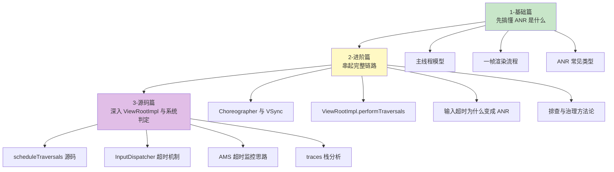

# ANR (Application Not Responding) 知识体系

> 从 `ViewRootImpl` 的一帧渲染，一路学到系统为什么会判你“应用无响应”

## 导航

| 维度 | 说明 |
|-----|-----|
| 重要程度 | ⭐⭐⭐⭐⭐ |
| 学习价值 | 性能优化、稳定性治理、线上排障、面试高频 |
| 核心目标 | 搞懂“卡顿”和“ANR”之间到底差了什么，以及怎么定位、怎么治 |

## 学习路线

## 这套文档重点回答什么？

1. 页面是怎么从 `ViewRootImpl` 开始一帧一帧画出来的？
2. 为什么掉帧只是“卡”，但有些场景会升级成 ANR？
3. 主线程到底在忙什么，系统又是怎么判断它“太久没回应”的？
4. 线上遇到 ANR，第一眼应该看哪里，怎么快速缩小范围？
5. 怎么从代码、架构、监控三层把 ANR 概率压下去？

## 各篇内容概览

### [1-基础篇](1-基础篇.md)

**适合人群**：想先建立完整心智模型的人

| 内容 | 说明 |
|-----|-----|
| ANR 定义 | 不只是“卡”，而是系统等不到你的响应 |
| 主线程模型 | `Looper`、`MessageQueue`、UI 线程职责 |
| 渲染基础 | `Choreographer`、`ViewRootImpl`、measure/layout/draw |
| 常见超时 | Input、Broadcast、Service 等典型场景 |
| 新手避坑 | 为什么主线程 IO、锁、Binder 很危险 |

### [2-进阶篇](2-进阶篇.md)

**适合人群**：想把“绘制 -> 卡顿 -> ANR -> 治理”连成一条线的人

| 内容 | 说明 |
|-----|-----|
| 完整流程图 | 从用户输入到系统判定 ANR 的全链路 |
| 根因分类 | CPU、IO、锁、Binder、GC、布局、启动、死循环 |
| 排查方法 | traces、logcat、Perfetto、StrictMode、线上监控 |
| 实战治理 | 异步化、拆任务、预加载、锁优化、Binder 限流 |
| 易混点 | 掉帧、卡顿、假死、ANR 的区别与联系 |

### [3-源码篇](3-源码篇.md)

**适合人群**：想看设计思想和关键源码的人

| 内容 | 说明 |
|-----|-----|
| 设计哲学 | 为什么 Android 必须单线程更新 UI |
| 渲染入口 | `scheduleTraversals()` 到 `performTraversals()` |
| 输入入口 | `InputDispatcher` 到 `ViewRootImpl` |
| 超时判定 | 系统为什么会认定“你没响应” |
| 栈解读 | 看到 `Blocked`、`Waiting`、`Binder` 时怎么判断 |

## 快速查阅

| 问题 | 建议先看 |
|-----|---------|
| 为什么主线程一忙就容易出事？ | 基础篇 |
| `ViewRootImpl` 和 ANR 有什么关系？ | 进阶篇 + 源码篇 |
| 输入事件为什么 5 秒就弹窗？ | 进阶篇 |
| traces 里主线程卡在锁上怎么看？ | 源码篇 |
| 线上 ANR 怎么建立监控？ | 进阶篇 |

---
_本文档将持续更新_
