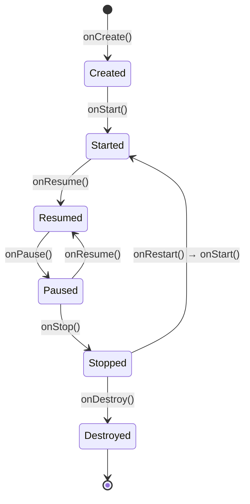

# Activity（android.app.Activity）

## 什么是 Activity？

### 定义
Activity 是 Android 四大组件之一，是用户与应用程序交互的单一界面入口点。每个 Activity 提供一个窗口，用于绘制用户界面，通常占满整个屏幕，但也可以是浮动窗口或嵌入到其他 Activity 中。

### 通俗理解
把 Activity 想象成一本书中的一页纸。当你打开一个 App 时，你看到的每一个界面就是一个 Activity，比如登录页面是一个 Activity，首页是另一个 Activity，设置页面又是一个 Activity。用户可以在这些"页面"之间来回切换。

## 核心特征

### 1. 生命周期管理
- Activity 具有完整的生命周期，从创建到销毁经历多个状态
- 系统通过回调方法通知 Activity 状态变化
- 开发者需要在合适的回调中执行相应的操作

### 2. 界面承载
- 每个 Activity 包含一个 Window 对象
- 通过 `setContentView()` 方法加载布局
- 支持多种布局方式：XML 布局、View Binding、Compose

### 3. 任务栈管理
- Activity 以栈的形式进行管理
- 新启动的 Activity 会被压入栈顶
- 按返回键会将栈顶 Activity 弹出销毁

### 4. Intent 通信
- 通过 Intent 在 Activity 之间传递数据
- 支持显式 Intent 和隐式 Intent
- 可以传递基本数据类型和 Parcelable/Serializable 对象

## Activity 生命周期

### 生命周期状态图



### 生命周期回调方法

| 方法 | 调用时机 | 典型操作 |
|------|----------|----------|
| `onCreate()` | Activity 首次创建时 | 初始化界面、绑定数据、恢复状态 |
| `onStart()` | Activity 即将可见时 | 注册广播接收器、准备 UI 更新 |
| `onResume()` | Activity 开始与用户交互时 | 开始动画、获取摄像头等独占资源 |
| `onPause()` | Activity 即将失去焦点时 | 暂停动画、保存草稿数据 |
| `onStop()` | Activity 完全不可见时 | 释放资源、注销广播接收器 |
| `onDestroy()` | Activity 被销毁前 | 清理所有资源、取消网络请求 |
| `onRestart()` | Activity 从停止状态重新启动时 | 重新获取数据 |

### 生命周期完整流程

```
启动 Activity：
onCreate() → onStart() → onResume()

按 Home 键或切换应用：
onPause() → onStop()

从后台返回：
onRestart() → onStart() → onResume()

按返回键退出：
onPause() → onStop() → onDestroy()

屏幕旋转（默认配置）：
onPause() → onStop() → onDestroy() → onCreate() → onStart() → onResume()
```

## 代码示例

### 基础用法

```kotlin
// MainActivity.kt
class MainActivity : AppCompatActivity() {
    
    companion object {
        private const val TAG = "MainActivity"
    }
    
    override fun onCreate(savedInstanceState: Bundle?) {
        super.onCreate(savedInstanceState)
        // 设置布局
        setContentView(R.layout.activity_main)
        
        Log.d(TAG, "onCreate: Activity 被创建")
        
        // 恢复保存的状态
        savedInstanceState?.let {
            val savedText = it.getString("saved_text", "")
            Log.d(TAG, "恢复保存的数据: $savedText")
        }
        
        // 初始化视图
        setupViews()
    }
    
    override fun onStart() {
        super.onStart()
        Log.d(TAG, "onStart: Activity 即将可见")
    }
    
    override fun onResume() {
        super.onResume()
        Log.d(TAG, "onResume: Activity 获得焦点，可以与用户交互")
    }
    
    override fun onPause() {
        super.onPause()
        Log.d(TAG, "onPause: Activity 即将失去焦点")
    }
    
    override fun onStop() {
        super.onStop()
        Log.d(TAG, "onStop: Activity 完全不可见")
    }
    
    override fun onDestroy() {
        super.onDestroy()
        Log.d(TAG, "onDestroy: Activity 被销毁")
    }
    
    override fun onRestart() {
        super.onRestart()
        Log.d(TAG, "onRestart: Activity 重新启动")
    }
    
    // 保存实例状态
    override fun onSaveInstanceState(outState: Bundle) {
        super.onSaveInstanceState(outState)
        outState.putString("saved_text", "需要保存的数据")
        Log.d(TAG, "onSaveInstanceState: 保存数据")
    }
    
    private fun setupViews() {
        // 初始化视图的逻辑
    }
}
```

### Activity 之间的跳转与数据传递

```kotlin
// 启动另一个 Activity 并传递数据
class FirstActivity : AppCompatActivity() {
    
    // 使用 ActivityResult API（推荐方式）
    private val launcher = registerForActivityResult(
        ActivityResultContracts.StartActivityForResult()
    ) { result ->
        if (result.resultCode == RESULT_OK) {
            val data = result.data?.getStringExtra("result_data")
            Log.d("FirstActivity", "收到返回数据: $data")
        }
    }
    
    private fun navigateToSecond() {
        // 方式一：显式 Intent
        val intent = Intent(this, SecondActivity::class.java).apply {
            putExtra("key_name", "张三")
            putExtra("key_age", 25)
            putExtra("key_user", User("李四", 30)) // User 需要实现 Parcelable
        }
        launcher.launch(intent)
        
        // 方式二：使用扩展函数（更简洁）
        // startActivity<SecondActivity>("key_name" to "张三", "key_age" to 25)
    }
}

// 接收数据的 Activity
class SecondActivity : AppCompatActivity() {
    
    override fun onCreate(savedInstanceState: Bundle?) {
        super.onCreate(savedInstanceState)
        setContentView(R.layout.activity_second)
        
        // 获取传递过来的数据
        val name = intent.getStringExtra("key_name") ?: ""
        val age = intent.getIntExtra("key_age", 0)
        val user = if (Build.VERSION.SDK_INT >= Build.VERSION_CODES.TIRAMISU) {
            intent.getParcelableExtra("key_user", User::class.java)
        } else {
            @Suppress("DEPRECATION")
            intent.getParcelableExtra("key_user")
        }
        
        Log.d("SecondActivity", "收到数据: name=$name, age=$age, user=$user")
    }
    
    // 设置返回结果
    private fun finishWithResult() {
        val resultIntent = Intent().apply {
            putExtra("result_data", "这是返回的数据")
        }
        setResult(RESULT_OK, resultIntent)
        finish()
    }
}
```

### Parcelable 数据类

```kotlin
// User.kt - 使用 @Parcelize 注解简化实现
@Parcelize
data class User(
    val name: String,
    val age: Int
) : Parcelable
```

### 进阶用法：使用 View Binding

```kotlin
class ModernActivity : AppCompatActivity() {
    
    // 使用 View Binding
    private lateinit var binding: ActivityModernBinding
    
    override fun onCreate(savedInstanceState: Bundle?) {
        super.onCreate(savedInstanceState)
        
        // 初始化 View Binding
        binding = ActivityModernBinding.inflate(layoutInflater)
        setContentView(binding.root)
        
        // 直接通过 binding 访问视图
        binding.textTitle.text = "Hello, View Binding!"
        binding.buttonSubmit.setOnClickListener {
            handleSubmit()
        }
    }
    
    private fun handleSubmit() {
        val inputText = binding.editInput.text.toString()
        // 处理提交逻辑
    }
}
```

### 最佳实践：配合 ViewModel 使用

```kotlin
class BestPracticeActivity : AppCompatActivity() {
    
    // 使用 ViewModel 管理 UI 状态
    private val viewModel: MainViewModel by viewModels()
    private lateinit var binding: ActivityBestPracticeBinding
    
    override fun onCreate(savedInstanceState: Bundle?) {
        super.onCreate(savedInstanceState)
        binding = ActivityBestPracticeBinding.inflate(layoutInflater)
        setContentView(binding.root)
        
        // 观察 LiveData
        viewModel.userData.observe(this) { user ->
            binding.textName.text = user.name
        }
        
        viewModel.loading.observe(this) { isLoading ->
            binding.progressBar.isVisible = isLoading
        }
        
        // 点击事件触发 ViewModel 方法
        binding.buttonLoad.setOnClickListener {
            viewModel.loadUserData()
        }
    }
}

// MainViewModel.kt
class MainViewModel : ViewModel() {
    
    private val _userData = MutableLiveData<User>()
    val userData: LiveData<User> = _userData
    
    private val _loading = MutableLiveData<Boolean>()
    val loading: LiveData<Boolean> = _loading
    
    fun loadUserData() {
        viewModelScope.launch {
            _loading.value = true
            // 模拟网络请求
            delay(1000)
            _userData.value = User("用户名", 25)
            _loading.value = false
        }
    }
}
```

## Activity 启动模式

### 四种启动模式

| 启动模式 | 说明 | 使用场景 |
|----------|------|----------|
| `standard` | 默认模式，每次启动都创建新实例 | 普通页面 |
| `singleTop` | 栈顶复用，栈顶已存在则调用 onNewIntent() | 通知点击、搜索页面 |
| `singleTask` | 栈内复用，栈内已存在则清除其上的 Activity | 主页面、登录页 |
| `singleInstance` | 单独任务栈，整个系统只有一个实例 | 系统应用、来电页面 |

### 在 AndroidManifest.xml 中声明

```xml
<activity
    android:name=".MainActivity"
    android:launchMode="singleTask"
    android:exported="true">
    <intent-filter>
        <action android:name="android.intent.action.MAIN" />
        <category android:name="android.intent.category.LAUNCHER" />
    </intent-filter>
</activity>

<activity
    android:name=".DetailActivity"
    android:launchMode="standard" />

<activity
    android:name=".SearchActivity"
    android:launchMode="singleTop" />
```

### 使用 Intent Flag 动态设置

```kotlin
// 清除栈内该 Activity 之上的所有 Activity
val intent = Intent(this, MainActivity::class.java).apply {
    flags = Intent.FLAG_ACTIVITY_CLEAR_TOP or Intent.FLAG_ACTIVITY_SINGLE_TOP
}
startActivity(intent)

// 创建新任务栈
val intent2 = Intent(this, NewTaskActivity::class.java).apply {
    flags = Intent.FLAG_ACTIVITY_NEW_TASK
}
startActivity(intent2)

// 清除整个任务栈并启动新 Activity
val intent3 = Intent(this, LoginActivity::class.java).apply {
    flags = Intent.FLAG_ACTIVITY_NEW_TASK or Intent.FLAG_ACTIVITY_CLEAR_TASK
}
startActivity(intent3)
```

## 处理配置变更

### 默认行为
当设备配置发生变化（如屏幕旋转、语言更改）时，系统会默认销毁并重建 Activity。

### 方式一：保存和恢复状态

```kotlin
class ConfigChangeActivity : AppCompatActivity() {
    
    private var counter = 0
    
    override fun onCreate(savedInstanceState: Bundle?) {
        super.onCreate(savedInstanceState)
        setContentView(R.layout.activity_config_change)
        
        // 恢复保存的状态
        counter = savedInstanceState?.getInt("counter", 0) ?: 0
        updateCounterUI()
    }
    
    override fun onSaveInstanceState(outState: Bundle) {
        super.onSaveInstanceState(outState)
        // 保存状态
        outState.putInt("counter", counter)
    }
    
    private fun updateCounterUI() {
        // 更新 UI
    }
}
```

### 方式二：自行处理配置变更

```xml
<!-- AndroidManifest.xml -->
<activity
    android:name=".VideoPlayerActivity"
    android:configChanges="orientation|screenSize|keyboardHidden"
    android:exported="false" />
```

```kotlin
class VideoPlayerActivity : AppCompatActivity() {
    
    override fun onConfigurationChanged(newConfig: Configuration) {
        super.onConfigurationChanged(newConfig)
        
        when (newConfig.orientation) {
            Configuration.ORIENTATION_LANDSCAPE -> {
                // 横屏处理
                enterFullScreen()
            }
            Configuration.ORIENTATION_PORTRAIT -> {
                // 竖屏处理
                exitFullScreen()
            }
        }
    }
    
    private fun enterFullScreen() {
        // 进入全屏模式
    }
    
    private fun exitFullScreen() {
        // 退出全屏模式
    }
}
```

### 方式三：使用 ViewModel（推荐）

```kotlin
// ViewModel 在配置变更时会自动保留数据
class DataViewModel : ViewModel() {
    private val _data = MutableLiveData<List<Item>>()
    val data: LiveData<List<Item>> = _data
    
    fun loadData() {
        // 加载数据，配置变更后不会丢失
    }
}
```

## 应用场景

### 1. 主界面
- 使用 `singleTask` 启动模式
- 作为应用的入口点
- 管理底部导航或抽屉导航

### 2. 详情页面
- 使用 `standard` 启动模式
- 通过 Intent 接收数据
- 可以有多个实例同时存在

### 3. 登录页面
- 使用 `singleTask` 或 `FLAG_ACTIVITY_CLEAR_TASK`
- 登录成功后清除任务栈
- 防止返回键回到登录前的页面

### 4. 搜索页面
- 使用 `singleTop` 启动模式
- 避免重复创建搜索界面
- 通过 `onNewIntent()` 接收新的搜索关键词

## 优缺点分析

### 优点
- **直观易懂**：一个 Activity 对应一个界面，逻辑清晰
- **系统集成好**：与系统的返回键、任务管理器等无缝集成
- **生命周期完善**：提供完整的生命周期回调
- **Intent 机制强大**：支持组件间通信和隐式启动

### 缺点
- **重量级**：创建和销毁开销较大
- **状态恢复复杂**：配置变更时需要手动处理状态保存
- **单 Activity 架构受限**：传统多 Activity 架构在复杂场景下管理困难
- **内存占用**：每个 Activity 都有自己的 Window 和 DecorView

## 性能考虑

### 1. 启动优化
- 减少 `onCreate()` 中的耗时操作
- 使用 ViewStub 延迟加载不常用的视图
- 使用 SplashScreen API 优化冷启动体验

### 2. 内存优化
- 在 `onStop()` 中释放不必要的资源
- 避免 Activity 内存泄漏（静态引用、Handler 等）
- 使用 LeakCanary 检测内存泄漏

### 3. 过渡动画
- 使用共享元素过渡提升用户体验
- 避免过度复杂的过渡动画
- 在低端设备上可以关闭动画

```kotlin
// 共享元素过渡
val intent = Intent(this, DetailActivity::class.java)
val options = ActivityOptionsCompat.makeSceneTransitionAnimation(
    this,
    imageView,
    "shared_image"
)
startActivity(intent, options.toBundle())
```

## 兼容性说明

### API 级别要求
- `Activity` 基类：API 1+
- `AppCompatActivity`：AndroidX 兼容库
- `ComponentActivity`：Jetpack Activity 库
- ActivityResult API：Activity 1.2.0+

### 推荐的继承关系
```
Activity (基类)
    └── ComponentActivity (Jetpack)
            └── FragmentActivity
                    └── AppCompatActivity (推荐使用)
```

### 依赖配置

```kotlin
// build.gradle.kts (Module)
dependencies {
    implementation("androidx.appcompat:appcompat:1.6.1")
    implementation("androidx.activity:activity-ktx:1.8.2")
    implementation("androidx.lifecycle:lifecycle-viewmodel-ktx:2.7.0")
    implementation("androidx.lifecycle:lifecycle-livedata-ktx:2.7.0")
}
```

## 相关技术

- **[[Fragment]]**：Activity 内的模块化界面组件
- **[[Intent]]**：组件间通信的消息对象
- **[[ViewModel]]**：管理界面相关数据，支持配置变更
- **[[Navigation]]**：Jetpack 导航组件，简化页面跳转
- **[[Jetpack Compose]]**：声明式 UI 框架，可替代传统 Activity+XML 架构

## 总结

Activity 是 Android 应用开发的核心组件，理解其生命周期和启动模式是开发高质量应用的基础。在现代 Android 开发中，推荐：

1. **继承 AppCompatActivity** 以获得最佳兼容性
2. **配合 ViewModel 使用** 以正确处理配置变更
3. **使用 View Binding** 或 **Jetpack Compose** 处理界面
4. **使用 ActivityResult API** 替代已弃用的 `startActivityForResult()`
5. **考虑单 Activity + 多 Fragment 架构** 或 **Navigation 组件** 简化页面管理

---
_本文档持续更新，添加更多相关内容_
