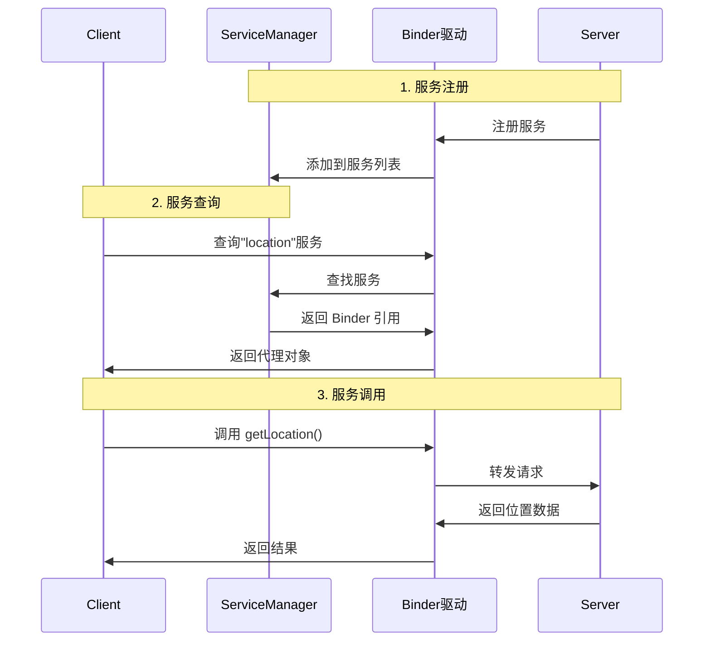

# Binder 基础篇

## 技术演进：为什么需要 Binder？

### 从一个问题说起

假设你在开发一个音乐播放器 App，需要在后台播放音乐。你可能会想：

```kotlin
// 在 Activity 中直接调用 Service 的方法？
val service = MusicService()
service.play()  // ❌ 这样不行！
```

为什么不行？因为 **Service 和 Activity 可能运行在不同的进程中**，它们有各自独立的内存空间，就像两个人住在不同的房子里，不能直接拿对方的东西。

### 进程隔离：安全的代价

Android 基于 Linux，继承了 Linux 的**进程隔离**机制：

```
┌─────────────────────────────────────────────────────────────┐
│                        Android 系统                          │
├─────────────────────────────────────────────────────────────┤
│                                                             │
│  ┌─────────────┐    ┌─────────────┐    ┌─────────────┐     │
│  │   App A     │    │   App B     │    │ 系统服务     │     │
│  │  (进程 A)   │    │  (进程 B)   │    │  (进程 S)   │     │
│  │             │    │             │    │             │     │
│  │  自己的内存  │    │  自己的内存  │    │  自己的内存  │     │
│  │  看不到别人  │    │  看不到别人  │    │  看不到别人  │     │
│  └─────────────┘    └─────────────┘    └─────────────┘     │
│         ↑                  ↑                  ↑            │
│         └──────────────────┴──────────────────┘            │
│                    互相隔离，无法直接访问                     │
│                                                             │
└─────────────────────────────────────────────────────────────┘
```

**为什么要隔离？**
- **安全性**：恶意 App 不能随便读取其他 App 的数据
- **稳定性**：一个 App 崩溃不会影响其他 App

**但隔离带来了问题**：App 需要调用系统服务（获取位置、发送通知），App 之间也需要通信，怎么办？

### 传统 IPC 方式的问题

Linux 提供了多种 IPC（进程间通信）方式，但都有不足：

| IPC 方式 | 原理 | 问题 |
|---------|------|------|
| **管道（Pipe）** | 单向数据流 | 只能单向、效率低、需要两次拷贝 |
| **Socket** | 网络协议栈 | 开销大、需要两次拷贝 |
| **共享内存** | 映射同一块物理内存 | 需要自己处理同步，复杂且不安全 |
| **信号（Signal）** | 异步通知 | 只能传递信号，不能传数据 |

**两次拷贝问题**：

```
传统 IPC 的数据传输：

进程 A                    内核                    进程 B
┌─────┐                 ┌─────┐                 ┌─────┐
│数据 │ ──第1次拷贝──→ │数据 │ ──第2次拷贝──→ │数据 │
└─────┘                 └─────┘                 └─────┘
  用户空间                内核空间                用户空间
```

每次通信都要拷贝两次数据，效率低下。

### Binder 的诞生

Google 选择了 Binder 作为 Android 的核心 IPC 机制，原因：

| 特性 | Binder 的优势 |
|-----|--------------|
| **性能** | 只需一次数据拷贝（通过 mmap） |
| **安全** | 内核级别的身份验证（UID/PID） |
| **易用** | 面向对象的调用方式，像调用本地方法 |
| **稳定** | C/S 架构，职责清晰 |

## 核心概念：Binder 通信模型

### 生活中的类比

把 Binder 想象成一个**跨城市的快递系统**：

```
┌────────────────────────────────────────────────────────────────┐
│                        Binder 快递系统                          │
├────────────────────────────────────────────────────────────────┤
│                                                                │
│  Client（寄件人）     ──→  想要某个服务，发起请求               │
│                                                                │
│  Server（收件人）     ──→  提供服务，处理请求                   │
│                                                                │
│  ServiceManager（快递公司总部）──→  管理所有服务的"电话簿"      │
│                                                                │
│  Binder 驱动（快递员）──→  负责实际的数据传输                   │
│                                                                │
└────────────────────────────────────────────────────────────────┘
```

**通信流程**：

1. **Server 注册服务**：餐厅开业，在美团上注册（Server 向 ServiceManager 注册）
2. **Client 查找服务**：用户在美团搜索餐厅（Client 向 ServiceManager 查询）
3. **Client 调用服务**：用户下单点餐（Client 通过 Binder 调用 Server）
4. **Server 返回结果**：餐厅做好送达（Server 返回结果给 Client）

### 四大角色详解

#### 1. Client（客户端）

发起请求的一方，比如你的 App 想获取位置信息。

```kotlin
// 获取系统服务（LocationManager）就是一个典型的 Client 行为
val locationManager = getSystemService(Context.LOCATION_SERVICE) as LocationManager
locationManager.getLastKnownLocation(...)  // 跨进程调用
```

#### 2. Server（服务端）

提供服务的一方，比如系统的 LocationManagerService。

```kotlin
// 简化的服务端示例
class MyService : Service() {
    private val binder = object : IMyService.Stub() {
        override fun doSomething(): String {
            return "服务端处理结果"
        }
    }
    
    override fun onBind(intent: Intent): IBinder = binder
}
```

#### 3. ServiceManager（服务管家）

**系统服务的"114 查号台"**，管理所有系统服务的注册和查询。

```
ServiceManager 的"电话簿"：

┌──────────────────────────────────────┐
│  服务名称              Binder 引用    │
├──────────────────────────────────────┤
│  "activity"      →    ActivityManagerService
│  "window"        →    WindowManagerService
│  "location"      →    LocationManagerService
│  "notification"  →    NotificationManagerService
│  ...                                 │
└──────────────────────────────────────┘
```

**注意**：ServiceManager 本身也是一个 Binder 服务，但它的 Binder 引用是固定的（handle=0），所有进程都能直接访问。

#### 4. Binder 驱动

运行在内核空间的驱动程序，负责：
- 进程间数据传输
- 线程管理
- 引用计数

### 通信流程图



## 关键概念：理解 Binder 的本质

### Binder 是什么？

Binder 这个词在不同语境下有不同含义：

| 语境 | Binder 指的是 |
|-----|--------------|
| 机制层面 | Android 的 IPC 机制 |
| 驱动层面 | `/dev/binder` 驱动程序 |
| 代码层面 | `android.os.Binder` 类 |
| 通信层面 | 跨进程传输的"句柄" |

### 代理模式：Binder 的核心设计

Binder 采用**代理模式**，让跨进程调用看起来像本地调用：

```
┌─────────────────────────────────────────────────────────────┐
│                      Client 进程                            │
│  ┌─────────────────────────────────────────────────────┐   │
│  │  你的代码                                            │   │
│  │  val result = service.doSomething()                 │   │
│  │         ↓                                           │   │
│  │  Proxy（代理对象）                                   │   │
│  │  - 把方法调用打包成数据                               │   │
│  │  - 通过 Binder 驱动发送                              │   │
│  └─────────────────────────────────────────────────────┘   │
└────────────────────────────┬────────────────────────────────┘
                             │ Binder 驱动
┌────────────────────────────┴────────────────────────────────┐
│                      Server 进程                            │
│  ┌─────────────────────────────────────────────────────┐   │
│  │  Stub（桩对象）                                      │   │
│  │  - 接收数据，解析成方法调用                           │   │
│  │  - 调用真正的实现                                    │   │
│  │         ↓                                           │   │
│  │  真正的服务实现                                      │   │
│  │  fun doSomething(): String { ... }                  │   │
│  └─────────────────────────────────────────────────────┘   │
└─────────────────────────────────────────────────────────────┘
```

**关键点**：
- **Proxy（代理）**：在 Client 进程，负责把方法调用"翻译"成数据
- **Stub（桩）**：在 Server 进程，负责把数据"翻译"回方法调用
- **对开发者透明**：调用远程方法就像调用本地方法一样

### 一次拷贝的秘密：mmap

传统 IPC 需要两次拷贝，Binder 只需要一次，怎么做到的？

**答案是 mmap（内存映射）**：

```
传统 IPC：
┌─────────┐         ┌─────────┐         ┌─────────┐
│ Client  │ ──拷贝→ │  内核   │ ──拷贝→ │ Server  │
│ 用户空间 │         │ 缓冲区  │         │ 用户空间 │
└─────────┘         └─────────┘         └─────────┘
              第1次              第2次

Binder（使用 mmap）：
┌─────────┐         ┌─────────────────────────────┐
│ Client  │ ──拷贝→ │      内核空间               │
│ 用户空间 │         │  ┌─────────────────────┐   │
└─────────┘         │  │  Binder 缓冲区      │   │
                    │  │  （物理内存）        │   │
                    │  └──────────┬──────────┘   │
                    └─────────────┼──────────────┘
                                  │ mmap 映射（不拷贝）
                    ┌─────────────┴──────────────┐
                    │ Server 用户空间             │
                    │ （可以直接访问这块内存）      │
                    └────────────────────────────┘
```

**通俗理解**：
- 传统方式：快递员把包裹从 A 家搬到快递站，再从快递站搬到 B 家
- Binder 方式：快递员把包裹放到一个 A、B 都能进入的公共储物柜，B 直接去拿

## AIDL：Binder 的使用方式

### 什么是 AIDL？

AIDL（Android Interface Definition Language）是 Android 提供的**接口定义语言**，用于简化 Binder 开发。

**本质**：AIDL 是个代码生成工具，帮你自动生成 Proxy 和 Stub 代码。

```
你写的 AIDL 文件          编译后自动生成
┌─────────────────┐      ┌─────────────────────────┐
│ IMyService.aidl │  →   │ IMyService.java         │
│                 │      │ ├── Stub（服务端用）     │
│ interface       │      │ └── Proxy（客户端用）    │
│ IMyService {    │      │                         │
│   String getData│      │ // 几百行模板代码        │
│ }               │      │ // 你不用自己写          │
└─────────────────┘      └─────────────────────────┘
```

### AIDL 基本使用

#### 第一步：定义 AIDL 接口

```aidl
// IBookManager.aidl
package com.example.aidl;

// 如果用到自定义类，需要 import
import com.example.aidl.Book;

interface IBookManager {
    // 获取书籍列表
    List<Book> getBookList();
    
    // 添加书籍
    void addBook(in Book book);
}
```

**AIDL 支持的数据类型**：

| 类型 | 说明 |
|-----|------|
| 基本类型 | int, long, boolean, float, double, char |
| String | 字符串 |
| CharSequence | 字符序列 |
| List | 只支持 ArrayList，元素必须是 AIDL 支持的类型 |
| Map | 只支持 HashMap |
| Parcelable | 自定义类需要实现 Parcelable |
| AIDL 接口 | 可以传递其他 AIDL 接口 |

#### 第二步：定义 Parcelable 类（如果需要）

```kotlin
// Book.kt
@Parcelize
data class Book(
    val id: Int,
    val name: String
) : Parcelable
```

```aidl
// Book.aidl（需要单独声明）
package com.example.aidl;
parcelable Book;
```

#### 第三步：实现服务端

```kotlin
class BookManagerService : Service() {
    
    private val bookList = mutableListOf<Book>()
    
    // 实现 AIDL 接口（继承 Stub）
    private val binder = object : IBookManager.Stub() {
        
        override fun getBookList(): List<Book> {
            return bookList
        }
        
        override fun addBook(book: Book) {
            bookList.add(book)
        }
    }
    
    override fun onBind(intent: Intent): IBinder {
        return binder
    }
}
```

#### 第四步：客户端绑定服务

```kotlin
class MainActivity : AppCompatActivity() {
    
    private var bookManager: IBookManager? = null
    
    private val connection = object : ServiceConnection {
        override fun onServiceConnected(name: ComponentName, service: IBinder) {
            // 将 IBinder 转换为 AIDL 接口
            // 如果是同进程，返回 Stub 本身
            // 如果是跨进程，返回 Proxy
            bookManager = IBookManager.Stub.asInterface(service)
            
            // 现在可以像调用本地方法一样调用远程服务
            val books = bookManager?.getBookList()
            Log.d("TAG", "获取到 ${books?.size} 本书")
        }
        
        override fun onServiceDisconnected(name: ComponentName) {
            bookManager = null
        }
    }
    
    override fun onCreate(savedInstanceState: Bundle?) {
        super.onCreate(savedInstanceState)
        
        // 绑定服务
        val intent = Intent(this, BookManagerService::class.java)
        bindService(intent, connection, Context.BIND_AUTO_CREATE)
    }
    
    override fun onDestroy() {
        super.onDestroy()
        unbindService(connection)
    }
}
```

### AIDL 中的 in、out、inout

AIDL 方法参数有三种方向标记：

```aidl
interface IMyService {
    // in：数据从客户端流向服务端（默认）
    void sendData(in Data data);
    
    // out：数据从服务端流向客户端
    void receiveData(out Data data);
    
    // inout：双向流动
    void processData(inout Data data);
}
```

| 标记 | 含义 | 性能 |
|-----|------|------|
| in | 客户端 → 服务端 | 最好（只序列化一次） |
| out | 服务端 → 客户端 | 中等 |
| inout | 双向 | 最差（序列化两次） |

**建议**：根据实际需要选择，不要无脑用 inout。

## 常见问题

### 问题1：Binder 调用是同步还是异步？

**默认是同步的**。客户端调用后会阻塞，直到服务端返回结果。

```kotlin
// 这行代码会阻塞，直到服务端返回
val result = bookManager.getBookList()  // 同步调用
```

**如果需要异步**，可以用 `oneway` 关键字：

```aidl
interface IMyService {
    oneway void asyncMethod();  // 异步调用，不等待返回
}
```

### 问题2：Binder 调用在哪个线程执行？

| 端 | 线程 |
|---|------|
| 客户端 | 调用线程（会阻塞） |
| 服务端 | Binder 线程池中的线程（**不是主线程！**） |

**重要**：服务端的 AIDL 方法运行在 Binder 线程池，如果要更新 UI，需要切换到主线程。

```kotlin
private val binder = object : IBookManager.Stub() {
    override fun addBook(book: Book) {
        // ❌ 这里不能直接更新 UI
        // textView.text = book.name  // 崩溃！
        
        // ✅ 需要切换到主线程
        Handler(Looper.getMainLooper()).post {
            textView.text = book.name
        }
    }
}
```

### 问题3：Binder 传输数据有大小限制吗？

**有！** Binder 的传输缓冲区大小约为 **1MB**（准确说是 1MB - 8KB）。

```kotlin
// ❌ 传输大数据会崩溃
val hugeData = ByteArray(2 * 1024 * 1024)  // 2MB
service.sendData(hugeData)  // TransactionTooLargeException
```

**解决方案**：
- 分批传输
- 使用文件或 ContentProvider
- 使用共享内存（Ashmem）

### 问题4：如何判断是同进程还是跨进程？

```kotlin
val service = IBookManager.Stub.asInterface(binder)

// 方法1：判断 binder 类型
if (binder is IBookManager.Stub) {
    // 同进程，binder 就是 Stub 本身
} else {
    // 跨进程，binder 是 BinderProxy
}

// 方法2：Stub.asInterface 内部已经处理了
// 同进程返回 Stub，跨进程返回 Proxy
```

## 小结

| 概念 | 说明 |
|-----|------|
| Binder | Android 的 IPC 机制，高效、安全、易用 |
| Client | 发起请求的一方 |
| Server | 提供服务的一方 |
| ServiceManager | 服务的"电话簿"，管理服务注册和查询 |
| Binder 驱动 | 内核模块，负责实际的数据传输 |
| AIDL | 接口定义语言，自动生成 Proxy/Stub 代码 |
| Proxy | 客户端代理，把方法调用打包成数据 |
| Stub | 服务端桩，把数据解析成方法调用 |

**核心要点**：
1. Binder 采用 C/S 架构，通过代理模式让跨进程调用像本地调用
2. 通过 mmap 实现一次拷贝，性能优于传统 IPC
3. 内核级身份验证（UID/PID），安全性高
4. AIDL 是 Binder 的"语法糖"，简化开发

---

## 面试题检验

### Q1：为什么 Android 选择 Binder 而不是传统的 IPC 方式？

**结论**：Binder 在性能、安全性、易用性上都优于传统 IPC。

**原理**：
1. **性能**：通过 mmap 实现一次拷贝，传统 IPC 需要两次
2. **安全**：内核级别验证 UID/PID，传统 IPC 无法可靠验证身份
3. **易用**：C/S 架构 + 代理模式，调用远程方法像调用本地方法

**类比**：传统 IPC 像发传真（慢、不安全），Binder 像加密视频通话（快、安全、方便）。

---

### Q2：Binder 通信涉及哪几个角色？

**结论**：Client、Server、ServiceManager、Binder 驱动。

**职责**：
- Client：发起请求
- Server：提供服务
- ServiceManager：服务的注册中心
- Binder 驱动：数据传输的"搬运工"

**类比**：Client 是顾客，Server 是餐厅，ServiceManager 是美团，Binder 驱动是外卖员。

---

### Q3：AIDL 生成的 Stub 和 Proxy 分别是什么？

**结论**：Stub 是服务端的抽象类，Proxy 是客户端的代理类。

**原理**：
- Stub 继承自 Binder，服务端继承它实现具体逻辑
- Proxy 实现 AIDL 接口，把方法调用转换成 Binder 调用
- `Stub.asInterface()` 会根据是否同进程返回 Stub 或 Proxy

---

### Q4：Binder 传输数据为什么只需要一次拷贝？

**结论**：通过 mmap 让服务端直接访问内核缓冲区，省去了从内核到服务端的拷贝。

**原理**：
1. 客户端数据拷贝到内核的 Binder 缓冲区（第 1 次拷贝）
2. 服务端通过 mmap 映射了这块缓冲区，可以直接访问
3. 不需要再从内核拷贝到服务端（省去第 2 次拷贝）

---

### Q5：Binder 调用是在哪个线程执行的？

**结论**：客户端在调用线程（会阻塞），服务端在 Binder 线程池。

**注意**：
- 服务端不在主线程，需要注意线程安全
- 如果服务端要更新 UI，需要切换到主线程
- 默认是同步调用，可以用 `oneway` 实现异步

---

_本文档将持续更新，添加更多相关内容_
