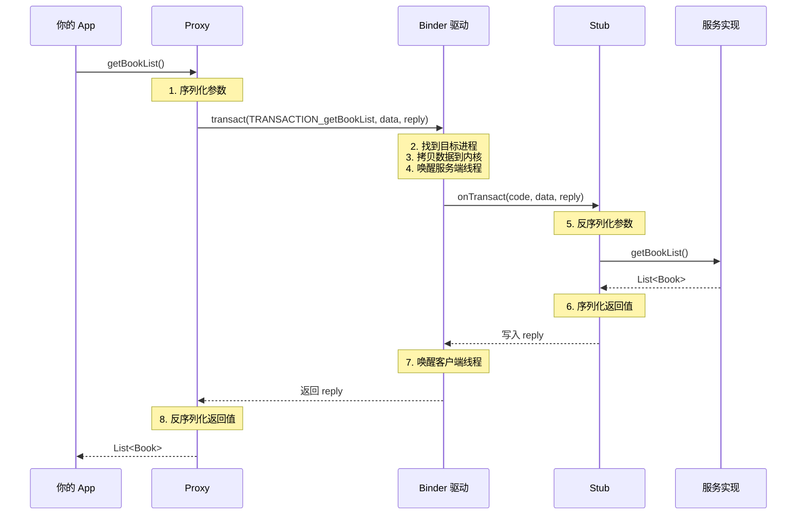

# Binder 进阶篇

## Binder 的工作流程

### 一次完整的 Binder 调用

当你调用 `bookManager.getBookList()` 时，背后发生了什么？



### 关键步骤解析

#### 1. 客户端调用 Proxy

```kotlin
// 你写的代码
val books = bookManager.getBookList()

// 实际调用的是 Proxy.getBookList()
// Proxy 内部实现（AIDL 自动生成）：
override fun getBookList(): List<Book> {
    val _data = Parcel.obtain()    // 用于发送的数据
    val _reply = Parcel.obtain()   // 用于接收的数据
    val _result: List<Book>
    
    try {
        _data.writeInterfaceToken(DESCRIPTOR)  // 写入接口标识
        // 如果有参数，这里会序列化参数
        
        // 关键：发起 Binder 调用
        mRemote.transact(TRANSACTION_getBookList, _data, _reply, 0)
        
        _reply.readException()  // 检查服务端是否抛出异常
        _result = _reply.createTypedArrayList(Book.CREATOR)!!  // 反序列化结果
    } finally {
        _data.recycle()
        _reply.recycle()
    }
    return _result
}
```

#### 2. Binder 驱动处理

```
┌─────────────────────────────────────────────────────────────┐
│                     Binder 驱动的工作                        │
├─────────────────────────────────────────────────────────────┤
│                                                             │
│  1. 验证调用者身份（UID/PID）                                │
│  2. 根据 handle 找到目标 Binder 实体                         │
│  3. 将数据拷贝到内核缓冲区                                   │
│  4. 通过 mmap，服务端可以直接访问这块数据                     │
│  5. 唤醒服务端的 Binder 线程                                 │
│  6. 等待服务端处理完成                                       │
│  7. 唤醒客户端线程，返回结果                                 │
│                                                             │
└─────────────────────────────────────────────────────────────┘
```

#### 3. 服务端 Stub 处理

```kotlin
// Stub.onTransact()（AIDL 自动生成）
override fun onTransact(code: Int, data: Parcel, reply: Parcel?, flags: Int): Boolean {
    when (code) {
        TRANSACTION_getBookList -> {
            data.enforceInterface(DESCRIPTOR)  // 验证接口标识
            
            // 调用真正的实现
            val _result = this.getBookList()
            
            reply?.writeNoException()
            reply?.writeTypedList(_result)  // 序列化结果
            return true
        }
        // 其他方法...
    }
    return super.onTransact(code, data, reply, flags)
}
```

## Binder 线程模型

### 服务端的线程池

Binder 服务端有一个**线程池**来处理客户端请求：

```
┌─────────────────────────────────────────────────────────────┐
│                   服务端进程                                 │
├─────────────────────────────────────────────────────────────┤
│                                                             │
│  主线程                                                      │
│  └── 处理 UI、生命周期等                                     │
│                                                             │
│  Binder 线程池（默认最大 16 个线程）                          │
│  ├── Binder:xxx_1  ──→  处理客户端 A 的请求                  │
│  ├── Binder:xxx_2  ──→  处理客户端 B 的请求                  │
│  ├── Binder:xxx_3  ──→  空闲，等待新请求                     │
│  └── ...                                                    │
│                                                             │
└─────────────────────────────────────────────────────────────┘
```

**重要特性**：

| 特性 | 说明 |
|-----|------|
| 多线程 | 服务端可以同时处理多个请求 |
| 线程安全 | 需要自己处理同步问题 |
| 非主线程 | 不能直接操作 UI |
| 线程复用 | 线程池中的线程会被复用 |

### 线程安全问题

```kotlin
class BookManagerService : Service() {
    
    // ❌ 有线程安全问题
    private val bookList = mutableListOf<Book>()
    
    private val binder = object : IBookManager.Stub() {
        override fun getBookList(): List<Book> {
            return bookList  // 可能在遍历时被修改
        }
        
        override fun addBook(book: Book) {
            bookList.add(book)  // 可能并发添加
        }
    }
}

// ✅ 正确做法：使用线程安全的集合或加锁
class BookManagerService : Service() {
    
    private val bookList = CopyOnWriteArrayList<Book>()
    // 或者
    private val bookList = Collections.synchronizedList(mutableListOf<Book>())
    // 或者手动加锁
}
```

## 双向通信：服务端回调客户端

### 场景

服务端需要主动通知客户端，比如：
- 下载进度更新
- 新消息推送
- 数据变化通知

### 实现方式

#### 1. 定义回调接口

```aidl
// IOnNewBookArrivedListener.aidl
interface IOnNewBookArrivedListener {
    void onNewBookArrived(in Book book);
}
```

#### 2. 修改服务接口

```aidl
// IBookManager.aidl
import com.example.aidl.IOnNewBookArrivedListener;

interface IBookManager {
    List<Book> getBookList();
    void addBook(in Book book);
    
    // 注册/注销监听器
    void registerListener(IOnNewBookArrivedListener listener);
    void unregisterListener(IOnNewBookArrivedListener listener);
}
```

#### 3. 服务端实现

```kotlin
class BookManagerService : Service() {
    
    private val bookList = CopyOnWriteArrayList<Book>()
    
    // 使用 RemoteCallbackList 管理跨进程回调
    // 它内部处理了 Binder 死亡通知和线程同步
    private val listeners = RemoteCallbackList<IOnNewBookArrivedListener>()
    
    private val binder = object : IBookManager.Stub() {
        
        override fun registerListener(listener: IOnNewBookArrivedListener) {
            listeners.register(listener)
        }
        
        override fun unregisterListener(listener: IOnNewBookArrivedListener) {
            listeners.unregister(listener)
        }
        
        override fun addBook(book: Book) {
            bookList.add(book)
            notifyListeners(book)  // 通知所有监听者
        }
        
        // ...
    }
    
    private fun notifyListeners(book: Book) {
        // RemoteCallbackList 的正确遍历方式
        val count = listeners.beginBroadcast()
        try {
            for (i in 0 until count) {
                val listener = listeners.getBroadcastItem(i)
                try {
                    listener.onNewBookArrived(book)
                } catch (e: RemoteException) {
                    // 客户端已死亡，RemoteCallbackList 会自动移除
                }
            }
        } finally {
            listeners.finishBroadcast()
        }
    }
}
```

#### 4. 客户端实现

```kotlin
class MainActivity : AppCompatActivity() {
    
    private var bookManager: IBookManager? = null
    
    // 回调接口的实现
    private val listener = object : IOnNewBookArrivedListener.Stub() {
        override fun onNewBookArrived(book: Book) {
            // 注意：这里运行在 Binder 线程，不是主线程！
            runOnUiThread {
                Toast.makeText(this@MainActivity, "新书：${book.name}", Toast.LENGTH_SHORT).show()
            }
        }
    }
    
    private val connection = object : ServiceConnection {
        override fun onServiceConnected(name: ComponentName, service: IBinder) {
            bookManager = IBookManager.Stub.asInterface(service)
            bookManager?.registerListener(listener)  // 注册监听
        }
        
        override fun onServiceDisconnected(name: ComponentName) {
            bookManager = null
        }
    }
    
    override fun onDestroy() {
        super.onDestroy()
        bookManager?.unregisterListener(listener)  // 注销监听
        unbindService(connection)
    }
}
```

### 为什么要用 RemoteCallbackList？

普通的 List 无法正确管理跨进程回调：

```kotlin
// ❌ 错误做法
private val listeners = mutableListOf<IOnNewBookArrivedListener>()

fun unregisterListener(listener: IOnNewBookArrivedListener) {
    listeners.remove(listener)  // 永远 remove 不掉！
}
```

**原因**：跨进程传递后，客户端的 listener 和服务端收到的 listener 是**不同的对象**（Proxy vs Stub），`equals` 比较会失败。

**RemoteCallbackList 的解决方案**：用 Binder 对象作为 key，而不是 listener 对象。

## Binder 死亡通知

### 问题场景

服务端进程可能意外死亡（崩溃、被杀），客户端需要感知并处理。

### 两种方式

#### 方式1：DeathRecipient

```kotlin
private val deathRecipient = object : IBinder.DeathRecipient {
    override fun binderDied() {
        // 服务端死亡了
        bookManager?.asBinder()?.unlinkToDeath(this, 0)
        bookManager = null
        
        // 可以尝试重新绑定
        reconnect()
    }
}

private val connection = object : ServiceConnection {
    override fun onServiceConnected(name: ComponentName, service: IBinder) {
        bookManager = IBookManager.Stub.asInterface(service)
        
        // 注册死亡通知
        service.linkToDeath(deathRecipient, 0)
    }
    
    override fun onServiceDisconnected(name: ComponentName) {
        // 这个方法也会在服务端死亡时调用
        // 但 DeathRecipient 更及时
    }
}
```

#### 方式2：onServiceDisconnected

```kotlin
private val connection = object : ServiceConnection {
    override fun onServiceConnected(name: ComponentName, service: IBinder) {
        bookManager = IBookManager.Stub.asInterface(service)
    }
    
    override fun onServiceDisconnected(name: ComponentName) {
        // 服务端断开连接（包括死亡）
        bookManager = null
        reconnect()
    }
}
```

**两者区别**：

| 方式 | 回调线程 | 触发时机 |
|-----|---------|---------|
| DeathRecipient | Binder 线程 | 服务端进程死亡 |
| onServiceDisconnected | 主线程 | 服务端进程死亡或 unbind |

## Binder 连接池

### 问题

如果有多个 AIDL 接口，每个都创建一个 Service？

```
App
├── IBookManager  →  BookManagerService
├── IUserManager  →  UserManagerService
├── IOrderManager →  OrderManagerService
└── ...
```

Service 太多，资源浪费！

### 解决方案：Binder 连接池

用一个 Service 管理多个 Binder：

```
┌─────────────────────────────────────────────────────────────┐
│                    BinderPoolService                        │
├─────────────────────────────────────────────────────────────┤
│                                                             │
│  IBinderPool                                                │
│  └── queryBinder(binderCode): IBinder                      │
│                                                             │
│  内部管理：                                                  │
│  ├── BINDER_BOOK   →  IBookManager.Stub                    │
│  ├── BINDER_USER   →  IUserManager.Stub                    │
│  └── BINDER_ORDER  →  IOrderManager.Stub                   │
│                                                             │
└─────────────────────────────────────────────────────────────┘
```

### 实现

#### 1. 定义 BinderPool 接口

```aidl
// IBinderPool.aidl
interface IBinderPool {
    IBinder queryBinder(int binderCode);
}
```

#### 2. 实现 BinderPoolService

```kotlin
class BinderPoolService : Service() {
    
    companion object {
        const val BINDER_BOOK = 1
        const val BINDER_USER = 2
    }
    
    private val binderPool = object : IBinderPool.Stub() {
        override fun queryBinder(binderCode: Int): IBinder? {
            return when (binderCode) {
                BINDER_BOOK -> BookManagerImpl()
                BINDER_USER -> UserManagerImpl()
                else -> null
            }
        }
    }
    
    override fun onBind(intent: Intent): IBinder = binderPool
}

// 各个 Binder 实现
class BookManagerImpl : IBookManager.Stub() {
    override fun getBookList(): List<Book> = listOf()
    override fun addBook(book: Book) {}
}

class UserManagerImpl : IUserManager.Stub() {
    override fun getUserInfo(): User = User()
}
```

#### 3. 客户端使用

```kotlin
class BinderPool private constructor(context: Context) {
    
    private var binderPoolService: IBinderPool? = null
    private val context = context.applicationContext
    private val connectLatch = CountDownLatch(1)
    
    init {
        connectBinderPoolService()
    }
    
    private fun connectBinderPoolService() {
        val intent = Intent(context, BinderPoolService::class.java)
        context.bindService(intent, connection, Context.BIND_AUTO_CREATE)
    }
    
    private val connection = object : ServiceConnection {
        override fun onServiceConnected(name: ComponentName, service: IBinder) {
            binderPoolService = IBinderPool.Stub.asInterface(service)
            connectLatch.countDown()
        }
        
        override fun onServiceDisconnected(name: ComponentName) {
            // 重连逻辑
        }
    }
    
    fun queryBinder(binderCode: Int): IBinder? {
        connectLatch.await()  // 等待连接完成
        return binderPoolService?.queryBinder(binderCode)
    }
    
    companion object {
        @Volatile
        private var instance: BinderPool? = null
        
        fun getInstance(context: Context): BinderPool {
            return instance ?: synchronized(this) {
                instance ?: BinderPool(context).also { instance = it }
            }
        }
    }
}

// 使用
val bookBinder = BinderPool.getInstance(context).queryBinder(BINDER_BOOK)
val bookManager = IBookManager.Stub.asInterface(bookBinder)
```

## 与其他 IPC 方式对比

| 方式 | 性能 | 安全性 | 易用性 | 适用场景 |
|-----|------|-------|-------|---------|
| **Binder** | ⭐⭐⭐⭐⭐ | ⭐⭐⭐⭐⭐ | ⭐⭐⭐⭐ | 大多数 IPC 场景 |
| **Messenger** | ⭐⭐⭐⭐ | ⭐⭐⭐⭐ | ⭐⭐⭐⭐⭐ | 简单的消息传递 |
| **ContentProvider** | ⭐⭐⭐⭐ | ⭐⭐⭐⭐ | ⭐⭐⭐⭐ | 数据共享 |
| **Socket** | ⭐⭐⭐ | ⭐⭐ | ⭐⭐⭐ | 网络通信、跨设备 |
| **文件共享** | ⭐⭐ | ⭐⭐ | ⭐⭐⭐⭐⭐ | 简单数据、低频 |

### Binder vs Messenger

```
Messenger：
┌─────────┐    Message    ┌─────────┐
│ Client  │ ───────────→  │ Server  │
│         │               │ Handler │
└─────────┘               └─────────┘
           串行处理，一次一条

Binder (AIDL)：
┌─────────┐    方法调用    ┌─────────┐
│ Client  │ ───────────→  │ Server  │
│         │ ←───────────  │ 线程池  │
└─────────┘    返回值      └─────────┘
           并行处理，支持返回值
```

| 特性 | Messenger | AIDL |
|-----|-----------|------|
| 底层 | 基于 AIDL | 直接使用 Binder |
| 并发 | 串行（Handler） | 并行（线程池） |
| 返回值 | 不支持 | 支持 |
| 复杂度 | 简单 | 较复杂 |
| 适用场景 | 简单消息 | 复杂 RPC |

## 常见问题

### 问题1：TransactionTooLargeException

```kotlin
// 传输超过 1MB 数据会崩溃
val hugeList = List(100000) { Book(it, "Book $it") }
bookManager.addBooks(hugeList)  // 💥 崩溃
```

**解决方案**：

```kotlin
// 方案1：分批传输
fun addBooksInBatches(books: List<Book>, batchSize: Int = 100) {
    books.chunked(batchSize).forEach { batch ->
        bookManager.addBooks(batch)
    }
}

// 方案2：使用文件传输
fun addBooksViaFile(books: List<Book>) {
    val file = File(context.cacheDir, "books.json")
    file.writeText(Gson().toJson(books))
    bookManager.addBooksFromFile(file.absolutePath)
}

// 方案3：使用 Bundle 的 putBinder（传递大 Bitmap 等）
```

### 问题2：跨进程回调的线程问题

```kotlin
// 客户端的回调实现
private val listener = object : IOnNewBookArrivedListener.Stub() {
    override fun onNewBookArrived(book: Book) {
        // ❌ 这里是 Binder 线程，不是主线程！
        textView.text = book.name  // 可能崩溃
        
        // ✅ 正确做法
        runOnUiThread {
            textView.text = book.name
        }
    }
}
```

### 问题3：权限验证

```kotlin
private val binder = object : IBookManager.Stub() {
    
    override fun addBook(book: Book) {
        // 验证调用者权限
        val callingUid = Binder.getCallingUid()
        val callingPid = Binder.getCallingPid()
        
        // 检查是否有权限
        if (!checkPermission(callingUid)) {
            throw SecurityException("没有权限添加书籍")
        }
        
        // 正常处理...
    }
    
    private fun checkPermission(uid: Int): Boolean {
        // 自定义权限检查逻辑
        return true
    }
}
```

## 小结

| 知识点 | 要点 |
|-------|------|
| 工作流程 | Proxy 序列化 → 驱动传输 → Stub 反序列化 → 执行 → 返回 |
| 线程模型 | 服务端用线程池处理，需要注意线程安全 |
| 双向通信 | 用 RemoteCallbackList 管理回调 |
| 死亡通知 | DeathRecipient 或 onServiceDisconnected |
| 连接池 | 一个 Service 管理多个 Binder |
| 数据限制 | 单次传输不超过 1MB |

---

## 面试题检验

### Q1：Binder 的线程模型是怎样的？

**结论**：客户端同步阻塞，服务端使用线程池并发处理。

**原理**：
- 客户端调用 `transact()` 后会阻塞，等待服务端返回
- 服务端有一个 Binder 线程池（默认最大 16 线程）
- 多个客户端的请求可以并发处理
- 服务端需要自己处理线程安全问题

---

### Q2：为什么要用 RemoteCallbackList？

**结论**：普通 List 无法正确管理跨进程的回调对象。

**原理**：
- 跨进程传递后，同一个 listener 在两端是不同的对象
- 普通 List 的 `remove()` 基于 `equals`，会失败
- RemoteCallbackList 用 Binder 对象作为 key
- 还能自动处理客户端死亡的情况

---

### Q3：Binder 传输数据有什么限制？

**结论**：单次传输不能超过约 1MB。

**原因**：Binder 驱动的传输缓冲区大小限制（1MB - 8KB）。

**解决方案**：
1. 分批传输
2. 使用文件或 ContentProvider
3. 使用共享内存（Ashmem）

---

### Q4：如何实现 Binder 的双向通信？

**结论**：客户端实现一个 AIDL 接口，传递给服务端作为回调。

**步骤**：
1. 定义回调接口（AIDL）
2. 客户端实现回调接口（继承 Stub）
3. 通过 AIDL 方法传递给服务端
4. 服务端用 RemoteCallbackList 管理
5. 需要时调用回调通知客户端

---

### Q5：DeathRecipient 和 onServiceDisconnected 的区别？

**结论**：DeathRecipient 在 Binder 线程回调，更及时；onServiceDisconnected 在主线程回调。

| 特性 | DeathRecipient | onServiceDisconnected |
|-----|---------------|----------------------|
| 回调线程 | Binder 线程 | 主线程 |
| 触发条件 | 服务端进程死亡 | 死亡或主动 unbind |
| 及时性 | 更及时 | 稍有延迟 |

---

_本文档将持续更新，添加更多相关内容_
