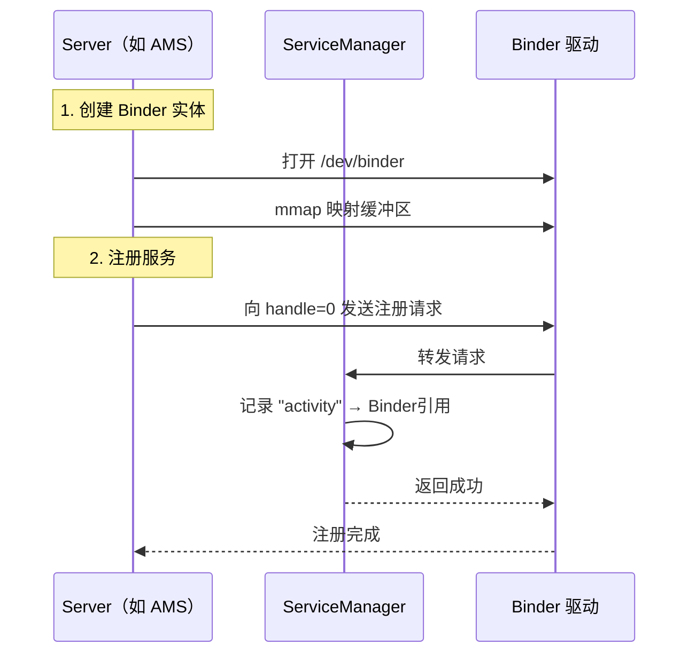
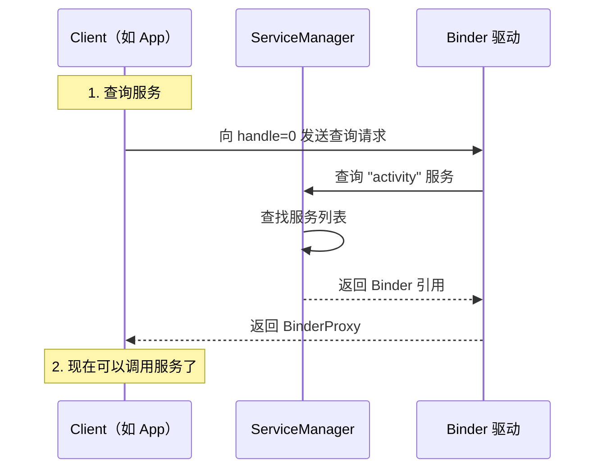
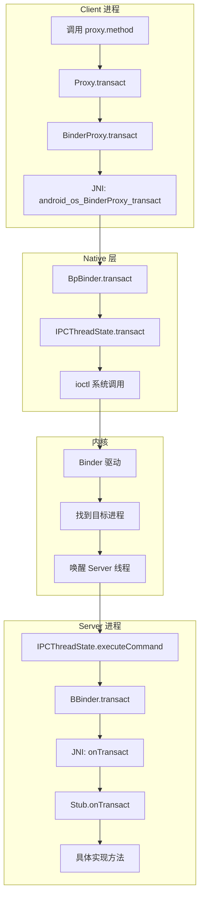

# Binder 源码篇

> **核心原则**：重理解、轻细节，抓设计思想。本篇不会深入 C++ 层和驱动层的具体实现，而是帮你建立对 Binder 架构的整体认知。

## 设计哲学：为什么 Binder 这样设计？

### 核心设计目标

| 目标 | 实现方式 |
|-----|---------|
| **高性能** | mmap 实现一次拷贝 |
| **高安全** | 内核级 UID/PID 验证 |
| **易使用** | 代理模式，像调用本地方法 |
| **可扩展** | C/S 架构，服务可动态注册 |

### 架构分层

```
┌─────────────────────────────────────────────────────────────┐
│                      应用层（Java/Kotlin）                   │
│  ┌─────────────────────────────────────────────────────┐   │
│  │  AIDL 接口、Stub、Proxy                              │   │
│  └─────────────────────────────────────────────────────┘   │
├─────────────────────────────────────────────────────────────┤
│                      Framework 层                           │
│  ┌─────────────────────────────────────────────────────┐   │
│  │  Binder.java、BinderProxy.java、Parcel.java         │   │
│  └─────────────────────────────────────────────────────┘   │
├─────────────────────────────────────────────────────────────┤
│                      Native 层（C++）                       │
│  ┌─────────────────────────────────────────────────────┐   │
│  │  BpBinder、BBinder、IPCThreadState、ProcessState    │   │
│  └─────────────────────────────────────────────────────┘   │
├─────────────────────────────────────────────────────────────┤
│                      内核层                                 │
│  ┌─────────────────────────────────────────────────────┐   │
│  │  Binder 驱动（/dev/binder）                          │   │
│  └─────────────────────────────────────────────────────┘   │
└─────────────────────────────────────────────────────────────┘
```

**设计亮点**：每一层都有明确的职责，上层不需要关心下层的实现细节。

## 一次拷贝的实现：mmap 的妙用

### 传统 IPC 的两次拷贝

```
┌──────────────┐                                  ┌──────────────┐
│   Client     │                                  │   Server     │
│   进程       │                                  │   进程       │
│              │                                  │              │
│  用户空间    │                                  │  用户空间    │
│  ┌────────┐  │                                  │  ┌────────┐  │
│  │ 数据   │  │                                  │  │ 数据   │  │
│  └───┬────┘  │                                  │  └────▲───┘  │
└──────┼───────┘                                  └───────┼──────┘
       │ copy_from_user                                   │ copy_to_user
       │ (第1次拷贝)                                       │ (第2次拷贝)
┌──────▼──────────────────────────────────────────────────┼──────┐
│                         内核空间                         │      │
│      ┌────────────────────────────────────────────┐     │      │
│      │              内核缓冲区                      │─────┘      │
│      └────────────────────────────────────────────┘            │
└─────────────────────────────────────────────────────────────────┘
```

### Binder 的一次拷贝

```
┌──────────────┐                                  ┌──────────────┐
│   Client     │                                  │   Server     │
│   进程       │                                  │   进程       │
│              │                                  │              │
│  用户空间    │                                  │  用户空间    │
│  ┌────────┐  │                                  │  ┌────────┐  │
│  │ 数据   │  │                                  │  │        │  │
│  └───┬────┘  │                                  │  └────▲───┘  │
└──────┼───────┘                                  └───────┼──────┘
       │ copy_from_user                                   │ mmap 映射
       │ (唯一的一次拷贝)                                  │ (无需拷贝)
┌──────▼──────────────────────────────────────────────────┼──────┐
│                         内核空间                         │      │
│      ┌────────────────────────────────────────────┐     │      │
│      │         Binder 缓冲区（物理内存）            │─────┘      │
│      └────────────────────────────────────────────┘            │
│                              ▲                                 │
│                              │                                 │
│                    Server 的虚拟地址空间                        │
│                    通过 mmap 映射到这块物理内存                  │
└─────────────────────────────────────────────────────────────────┘
```

### mmap 原理

**mmap（Memory Map）**：将文件或设备映射到进程的虚拟地址空间。

```kotlin
// 简化的 mmap 概念
// 普通方式：读文件需要拷贝
val data = file.readBytes()  // 从磁盘拷贝到内存

// mmap 方式：直接映射
val mappedBuffer = file.mmap()  // 不拷贝，直接映射
// 访问 mappedBuffer 就是访问文件内容
```

**Binder 中的应用**：

1. Server 进程启动时，通过 mmap 映射 Binder 驱动的缓冲区
2. Client 发送数据时，驱动把数据拷贝到这个缓冲区
3. Server 可以直接访问这个缓冲区（因为已经映射到自己的地址空间）
4. 省去了从内核到 Server 的拷贝

## ServiceManager：服务的注册中心

### 为什么需要 ServiceManager？

Client 想调用 Server 的服务，首先要**找到** Server。但进程间是隔离的，怎么找？

**答案**：通过一个公共的"电话簿"——ServiceManager。

### ServiceManager 的特殊性

```
┌─────────────────────────────────────────────────────────────┐
│                    ServiceManager 的特殊之处                 │
├─────────────────────────────────────────────────────────────┤
│                                                             │
│  1. 它本身也是一个 Binder 服务                               │
│                                                             │
│  2. 但它的 handle 是固定的（handle = 0）                     │
│     所有进程都知道怎么找到它                                  │
│                                                             │
│  3. 它是第一个启动的 Binder 服务                             │
│     在 init 进程中启动                                       │
│                                                             │
│  4. 它管理所有其他系统服务的注册和查询                        │
│                                                             │
└─────────────────────────────────────────────────────────────┘
```

### 服务注册流程



### 服务查询流程



### 代码层面的理解

```java
// 获取系统服务的常见写法
val activityManager = getSystemService(Context.ACTIVITY_SERVICE) as ActivityManager

// 背后发生了什么？
// 1. ContextImpl.getSystemService()
// 2. SystemServiceRegistry.getSystemService()
// 3. ServiceManager.getService("activity")
// 4. 返回 IActivityManager 的 Proxy
```

```java
// ServiceManager.getService() 简化逻辑
public static IBinder getService(String name) {
    // 通过 Binder 调用 ServiceManager 的 getService 方法
    // ServiceManager 的 handle 是 0，所有进程都能访问
    return getIServiceManager().getService(name);
}
```

## Binder 引用计数

### 为什么需要引用计数？

Binder 对象可能被多个进程引用，什么时候可以销毁？

```
┌─────────────┐     ┌─────────────┐     ┌─────────────┐
│  Client A   │     │  Client B   │     │  Client C   │
│  (引用)     │     │  (引用)     │     │  (引用)     │
└──────┬──────┘     └──────┬──────┘     └──────┬──────┘
       │                   │                   │
       └───────────────────┼───────────────────┘
                           ▼
                    ┌─────────────┐
                    │   Server    │
                    │  Binder 实体│
                    └─────────────┘
                    
问题：Server 什么时候可以销毁这个 Binder？
答案：当所有 Client 都不再引用时
```

### 引用计数机制

Binder 使用**强引用**和**弱引用**两种计数：

| 类型 | 作用 |
|-----|------|
| 强引用 | 决定 Binder 实体是否存活 |
| 弱引用 | 允许检查 Binder 是否还存在 |

```
┌─────────────────────────────────────────────────────────────┐
│                    引用计数管理                              │
├─────────────────────────────────────────────────────────────┤
│                                                             │
│  Client 获取 Binder 引用时：                                 │
│  └── 驱动增加 Server 端 Binder 的引用计数                    │
│                                                             │
│  Client 释放 Binder 引用时：                                 │
│  └── 驱动减少 Server 端 Binder 的引用计数                    │
│                                                             │
│  引用计数归零时：                                            │
│  └── 驱动通知 Server 可以销毁 Binder 实体                    │
│                                                             │
└─────────────────────────────────────────────────────────────┘
```

## Binder 中的设计模式

### 1. 代理模式（Proxy Pattern）

**核心思想**：用一个代理对象控制对真实对象的访问。

```
┌─────────────────────────────────────────────────────────────┐
│                       代理模式                               │
├─────────────────────────────────────────────────────────────┤
│                                                             │
│  Client 代码                                                │
│  └── bookManager.getBookList()                             │
│              ↓                                              │
│  Proxy（代理）                                              │
│  └── 把调用转换成 Binder 通信                               │
│              ↓                                              │
│  Stub（真实对象的代表）                                      │
│  └── 把 Binder 通信转换回方法调用                           │
│              ↓                                              │
│  真实实现                                                   │
│  └── 执行实际逻辑                                           │
│                                                             │
└─────────────────────────────────────────────────────────────┘
```

**好处**：
- 对 Client 透明，不需要知道是本地还是远程调用
- 可以在 Proxy 中加入额外逻辑（权限检查、日志等）

### 2. 模板方法模式（Template Method）

**体现**：Stub 类定义了 `onTransact()` 的框架，子类只需实现具体方法。

```java
// Stub 的 onTransact 是模板方法
public boolean onTransact(int code, Parcel data, Parcel reply, int flags) {
    switch (code) {
        case TRANSACTION_getBookList:
            // 模板：反序列化 → 调用抽象方法 → 序列化
            data.enforceInterface(DESCRIPTOR);
            List<Book> result = this.getBookList();  // 抽象方法，子类实现
            reply.writeNoException();
            reply.writeTypedList(result);
            return true;
    }
    return super.onTransact(code, data, reply, flags);
}

// 子类只需实现具体逻辑
abstract List<Book> getBookList();
```

### 3. 单例模式

**体现**：每个进程只有一个 ProcessState，管理 Binder 驱动的打开和 mmap。

```cpp
// ProcessState 是单例
sp<ProcessState> ProcessState::self() {
    if (gProcess != nullptr) {
        return gProcess;
    }
    gProcess = new ProcessState(...);
    return gProcess;
}
```

### 4. 享元模式（Flyweight）

**体现**：Parcel 对象池，避免频繁创建销毁。

```java
// Parcel.obtain() 从对象池获取
public static Parcel obtain() {
    Parcel p = sOwnedPool.acquire();
    if (p == null) {
        p = new Parcel(0);
    }
    return p;
}

// recycle() 归还到对象池
public void recycle() {
    sOwnedPool.release(this);
}
```

## 核心类解析

### Java 层核心类

```
┌─────────────────────────────────────────────────────────────┐
│                    Java 层 Binder 类图                       │
├─────────────────────────────────────────────────────────────┤
│                                                             │
│  IBinder（接口）                                             │
│  ├── transact()：发起 Binder 调用                           │
│  └── linkToDeath()：注册死亡通知                            │
│       ↑                                                     │
│       ├── Binder（服务端基类）                               │
│       │   └── onTransact()：处理请求                        │
│       │                                                     │
│       └── BinderProxy（客户端代理）                          │
│           └── transact()：通过 JNI 调用 Native 层           │
│                                                             │
│  Parcel（数据容器）                                          │
│  ├── writeXxx()：序列化数据                                 │
│  └── readXxx()：反序列化数据                                │
│                                                             │
└─────────────────────────────────────────────────────────────┘
```

### Binder 类的关键方法

```java
public class Binder implements IBinder {
    
    // 服务端重写此方法处理请求
    protected boolean onTransact(int code, Parcel data, Parcel reply, int flags) {
        // 默认实现处理一些通用请求
        // 子类（Stub）会重写处理具体业务
    }
    
    // 获取调用者的 UID（用于权限验证）
    public static final int getCallingUid() {
        return native_getCallingUid();
    }
    
    // 获取调用者的 PID
    public static final int getCallingPid() {
        return native_getCallingPid();
    }
}
```

### BinderProxy 类

```java
// BinderProxy 是 Client 端持有的代理对象
final class BinderProxy implements IBinder {
    
    // 指向 Native 层的 BpBinder
    private final long mNativeData;
    
    public boolean transact(int code, Parcel data, Parcel reply, int flags) {
        // 通过 JNI 调用 Native 层
        return transactNative(code, data, reply, flags);
    }
}
```

## 一次 Binder 调用的完整流程



## 延伸思考

### 如果让你设计 IPC 机制，你会怎么做？

**需要考虑的问题**：

| 问题 | Binder 的解决方案 |
|-----|------------------|
| 如何传输数据？ | mmap + 一次拷贝 |
| 如何找到目标进程？ | ServiceManager 注册中心 |
| 如何保证安全？ | 内核验证 UID/PID |
| 如何管理生命周期？ | 引用计数 + 死亡通知 |
| 如何简化开发？ | 代理模式 + AIDL 代码生成 |

### Binder 的局限性

| 局限 | 说明 |
|-----|------|
| 数据大小限制 | 单次传输不超过 1MB |
| 仅限 Android | 不是通用的 IPC 方案 |
| 学习成本 | 理解完整机制需要较多时间 |
| 调试困难 | 跨进程问题难以定位 |

## 小结

| 知识点 | 核心要点 |
|-------|---------|
| 架构分层 | Java → Native → 内核，各层职责清晰 |
| mmap | 实现一次拷贝的关键，Server 直接访问内核缓冲区 |
| ServiceManager | 服务的注册中心，handle=0 是众所周知的 |
| 引用计数 | 管理 Binder 对象的生命周期 |
| 设计模式 | 代理、模板方法、单例、享元 |

---

## 面试题检验

### Q1：Binder 为什么只需要一次数据拷贝？

**结论**：通过 mmap 让 Server 进程直接访问内核缓冲区。

**原理**：
1. Server 启动时，通过 mmap 把 Binder 驱动的缓冲区映射到自己的地址空间
2. Client 发送数据时，驱动把数据拷贝到这个缓冲区（第 1 次拷贝）
3. Server 可以直接访问这块内存，不需要再拷贝（省去第 2 次拷贝）

**类比**：传统方式是快递员把包裹搬到快递站再搬到你家；mmap 是快递员把包裹放到你家门口的储物柜，你直接开柜取。

---

### Q2：ServiceManager 的作用是什么？为什么它的 handle 是 0？

**结论**：ServiceManager 是服务的注册中心，handle=0 是约定俗成的"众所周知"地址。

**原理**：
- 所有系统服务都要向 ServiceManager 注册
- Client 通过 ServiceManager 查询服务
- handle=0 是固定的，所有进程都知道怎么找到它
- 这解决了"先有鸡还是先有蛋"的问题

---

### Q3：Binder 的引用计数是怎么工作的？

**结论**：驱动维护每个 Binder 实体的引用计数，归零时通知 Server 销毁。

**原理**：
1. Client 获取 Binder 引用时，驱动增加计数
2. Client 释放引用时，驱动减少计数
3. 计数归零时，驱动通知 Server 可以销毁
4. 使用强引用和弱引用两种计数

---

### Q4：Binder 中用到了哪些设计模式？

**结论**：代理模式、模板方法、单例模式、享元模式。

**具体应用**：
- **代理模式**：Proxy/Stub 让远程调用像本地调用
- **模板方法**：Stub.onTransact() 定义处理框架
- **单例模式**：ProcessState 每进程一个
- **享元模式**：Parcel 对象池复用

---

### Q5：为什么 Binder 比传统 IPC 更安全？

**结论**：内核级别的身份验证，无法伪造。

**原理**：
1. Binder 驱动在内核空间，可以获取调用者的真实 UID/PID
2. 这些信息由内核填充，用户空间无法伪造
3. Server 可以通过 `Binder.getCallingUid()` 验证调用者身份
4. 传统 IPC（如 Socket）的身份信息可以被伪造

---

_本文档将持续更新，添加更多相关内容_
