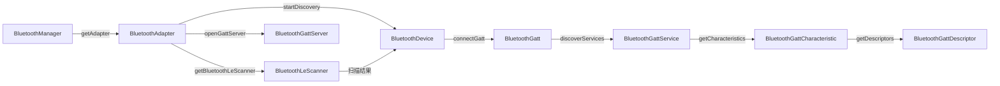

# 01 | 蓝牙技术全景与 Android 架构

> 学完这篇，你能一眼看穿 Android 蓝牙 API 的家族关系，分清经典蓝牙和 BLE 的本质差异，并知道为什么你调用的每一个 API 背后都有异步回调。

---

## 一、结论先行：BLE 不是经典蓝牙的简化版

很多开发者把 BLE（Bluetooth Low Energy）当成"蓝牙省电模式"，这是最大的误解。从协议层面看，**BLE 和经典蓝牙（BR/EDR）是两套完全独立的无线电协议**，就像 FM 收音机和 4G 网络共用天线但互不兼容一样。

在 Android 上做开发，你要先回答自己一个问题：**我要连接的是耳机/车载，还是手环/门锁/蓝牙灯？**

- 前者走 **经典蓝牙**（A2DP/HSP/SPP）
- 后者走 **BLE**（GATT）

**Android 从 4.3（API 18）开始引入 BLE 支持，现代 IoT 开发基本只跟 BLE 打交道。** 本文后续所有内容若无特别说明，均指 BLE。

---

## 二、协议栈分层：你写的代码在哪一层？

Android 蓝牙协议栈从应用到硬件分为四层。理解分层是为了定位问题：当连接失败时，你能判断是 App 逻辑问题、Framework 限制，还是厂商 ROM 搞鬼。

```
┌──────────────────────────────────────┐
│  你的 App（Java/Kotlin）              │  ← 调用 BluetoothAdapter/Gatt API
├──────────────────────────────────────┤
│  Android Framework（Bluetooth APK）   │  ← 权限检查、状态机管理、Binder IPC
│  /packages/modules/Bluetooth          │
├──────────────────────────────────────┤
│  HAL（硬件抽象层）                     │  ← AIDL 接口，隔离芯片差异
│  android.hardware.bluetooth           │
├──────────────────────────────────────┤
│  Vendor Controller（芯片固件）         │  ← Qualcomm/Broadcom/联发科等
│  负责射频、链路层、基带                │
└──────────────────────────────────────┘
```

**生活类比**：

- **App 层** = 你打电话给前台说"我要订房"
- **Framework** = 酒店前台系统，检查你的会员身份（权限），然后把请求转给客房部
- **HAL** = 酒店内部的标准化工单系统，不管客房部用 IBM 还是 Oracle 的系统，工单格式统一
- **Controller** = 真正的客房部，决定哪间房、怎么打扫

**实战经验**：如果某款手机（如某为、某米）蓝牙行为和其他手机不一样，90% 的可能是厂商在 Framework 或 HAL 层做了定制，而非你的代码问题。

---

## 三、Android 蓝牙 API 家族关系

BLE 开发涉及的类不多，但关系容易搞混。记住这张图：



### 每个类的职责（一句话版）

| 类 | 职责 | 生活类比 |
|---|---|---|
| `BluetoothManager` | 系统服务入口 | 酒店总机 |
| `BluetoothAdapter` | 本机蓝牙的"遥控器" | 你的手机蓝牙开关 |
| `BluetoothDevice` | 远端设备的"名片" | 对方的名片（MAC + 名字） |
| `BluetoothLeScanner` | BLE 扫描器 | 雷达，专门搜 BLE 信号 |
| `BluetoothGatt` | BLE 连接的管道 | 接通后的电话线 |
| `BluetoothGattService` | 功能集合 | 酒店的"餐饮服务部" |
| `BluetoothGattCharacteristic` | 最小数据单元 | 具体的"点一份牛排" |
| `BluetoothGattDescriptor` | 元数据配置 | 备注"不要辣" |
| `BluetoothGattServer` | 本机作为服务端 | 你开酒店，别人找你订房 |

### 设计哲学：为什么全是异步回调？

Android 蓝牙 API 被吐槽最多的是"回调地狱"。`connectGatt`、`readCharacteristic`、`writeCharacteristic` 全都是异步的，这不是 Google 故意刁难你，而是**蓝牙操作本质上涉及硬件状态和协议协商，不可能同步返回**。

举个例子：`readCharacteristic` 发出后，数据要经过 Controller → HAL → Framework → 你的 App，中间还可能因为射频干扰重传。如果设计成同步阻塞，主线程直接 ANR。

**所以记住：所有蓝牙操作 → 发指令 → 等回调。这是你写代码时的第一性原理。**

---

## 四、技术演进：Android 蓝牙权限与行为的变迁

Android 蓝牙 API 并不是一成不变的。Google 在不断收紧权限、提升安全性，不了解演进史很容易写出在旧设备上崩溃或在新设备上无权限的代码。

| 版本 | 关键变化 | 对你的影响 |
|---|---|---|
| Android 4.3 (API 18) | 引入 BLE 支持 | 最低兼容基准 |
| Android 5.0 (API 21) | `BluetoothLeScanner` 替代 `startLeScan` | 新扫描 API 更灵活，支持硬件过滤 |
| Android 6.0 (API 23) | 需要 `ACCESS_FINE_LOCATION` 权限 | 扫描必须动态申请定位权限 |
| Android 8.0 (API 26) | 后台应用限制扫描 | 后台 Service 扫描频率被限制 |
| Android 10 (API 29) | `BluetoothAdapter.enable()` 受限 | 不能直接打开蓝牙，必须引导用户 |
| Android 12 (API 31) | **权限大改**：拆分 `BLUETOOTH_SCAN`/`CONNECT`/`ADVERTISE` | 不再需要定位权限，但必须声明新权限 |
| Android 13 (API 33) | 更严格的后台启动限制 | 后台连接需适配 |
| Android 14 (API 34) | 增强用户隐私控制 | 部分厂商进一步限制后台蓝牙行为 |

**横向对比 iOS**：

- iOS 的 CoreBluetooth 也是异步回调模型，但 API 设计更简洁（委托模式统一）
- iOS 没有 Android 这么复杂的权限历史包袱，从 iOS 13 开始就统一了蓝牙权限
- Android 的优势是开放度高，可以直接操作广播包原始数据；iOS 限制了部分广播字段的访问

---

## 五、Android 实例：正确获取蓝牙适配器

**场景**：进入蓝牙功能页，判断设备是否支持蓝牙、蓝牙是否开启。

```kotlin
class BluetoothEntryActivity : AppCompatActivity() {

    companion object {
        private const val REQUEST_ENABLE_BT = 1001
    }

    private val bluetoothManager by lazy {
        getSystemService(Context.BLUETOOTH_SERVICE) as BluetoothManager
    }

    private val adapter: BluetoothAdapter?
        get() = bluetoothManager.adapter  // API 31 起推荐方式

    override fun onCreate(savedInstanceState: Bundle?) {
        super.onCreate(savedInstanceState)

        // 1. 检查硬件支持（如 Android TV、某些平板可能没有蓝牙）
        if (adapter == null) {
            Toast.makeText(this, "本设备不支持蓝牙", Toast.LENGTH_SHORT).show()
            finish()
            return
        }

        // 2. 检查蓝牙是否开启
        if (adapter?.isEnabled != true) {
            // Android 10+ 不能直接 enable()，必须引导用户
            val intent = Intent(BluetoothAdapter.ACTION_REQUEST_ENABLE)
            startActivityForResult(intent, REQUEST_ENABLE_BT)
        } else {
            // 蓝牙已就绪，进入扫描逻辑
            startBleScan()
        }
    }

    @Deprecated("Deprecated in Java")
    override fun onActivityResult(requestCode: Int, resultCode: Int, data: Intent?) {
        super.onActivityResult(requestCode, resultCode, data)
        if (requestCode == REQUEST_ENABLE_BT && resultCode == RESULT_OK) {
            startBleScan()
        }
    }

    private fun startBleScan() {
        // 后续章节展开
    }
}
```

**代码意图解读**：

- 用 `BluetoothManager` 获取 `adapter`，而不是废弃的 `BluetoothAdapter.getDefaultAdapter()`。**为什么？** 后者在 Android 12+ 的行为在多用户/多配置文件场景下不可靠，前者通过系统服务获取总是拿到当前用户的正确实例。
- 先判空再判开关。**为什么？** 某些 Android TV、车机、Wear OS 设备确实没有蓝牙芯片，`adapter` 为 null 是合法状态，不是异常。
- 用 `ACTION_REQUEST_ENABLE` 引导用户，而不是 `adapter.enable()`。**为什么？** Android 10 起，非系统应用调用 `enable()` 会被忽略或抛出 `SecurityException`，用户感知式的开启是唯一稳健的方案。

---

## 六、边界认知

### 1. `BluetoothAdapter.getDefaultAdapter()` 已废弃

Android 31 官方标记废弃，但在旧代码库中大量存在。迁移成本很低，把 `BluetoothAdapter.getDefaultAdapter()` 换成 `(getSystemService(Context.BLUETOOTH_SERVICE) as BluetoothManager).adapter` 即可。

### 2. 蓝牙开启不等于 BLE 可用

`adapter.isEnabled` 只能说明经典蓝牙射频开启，不代表 BLE 功能一定正常。极少数厂商设备（早期 MTK 方案）存在经典蓝牙正常但 BLE 固件异常的情况。防御性写法：在开启扫描前用 `adapter.bluetoothLeScanner != null` 二次确认。

### 3. `BluetoothAdapter` 不是线程安全的

虽然文档没说，但源码里 `BluetoothAdapter` 内部有大量状态机操作，**建议在主线程或单一线程中调用其方法**，避免并发导致的状态不一致。

### 4. 模拟器无法调试 BLE

Android Emulator 不支持 BLE 扫描和连接（除非用特定镜像 + 桥接，但极不稳定）。**BLE 开发必须上真机**，且建议准备两台不同厂商的手机做兼容性测试。

---

## 七、质量自检

- [x] 经典蓝牙和 BLE 的本质差异说清了吗？
- [x] Android 蓝牙协议栈四层结构能自己画出来吗？
- [x] API 家族关系中，知道什么时候该用哪个类吗？
- [x] Android 12 权限大改的内容能复述吗？
- [x] 代码中为什么不用 `adapter.enable()` 的理由能讲清楚吗？
