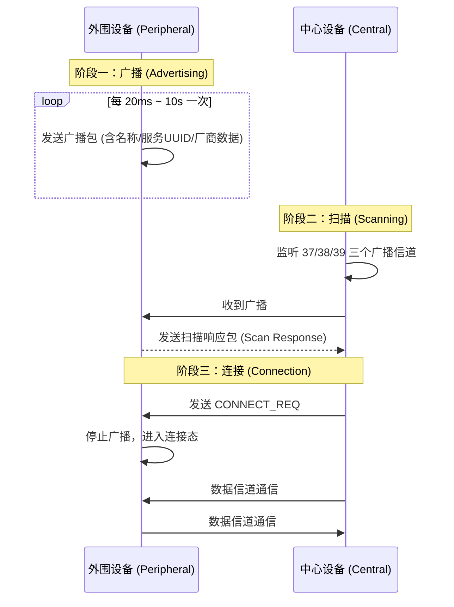
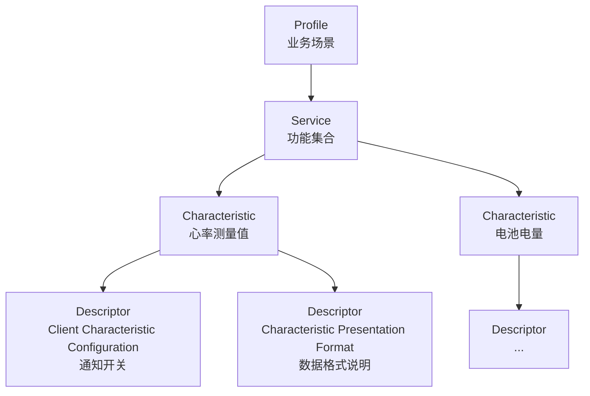

# 02 | BLE 协议核心：GAP 与 GATT

> 学完这篇，你能把 BLE 的通信过程想象成"相亲流程"——GAP 负责"介绍认识"，GATT 负责"婚后怎么交流"。搞懂这俩骨架，后面所有 API 调用都有章法。

---

## 一、结论先行

BLE 通信只有两个核心问题：

1. **怎么找到对方？** → GAP（Generic Access Profile）回答这个问题
2. **找到后怎么对话？** → GATT（Generic Attribute Profile）回答这个问题

**所有 Android BLE API，本质上都是在对 GAP 和 GATT 的协议行为做封装。** 你调用的 `startScan` 对应 GAP 的扫描，`connectGatt` 对应 GAP 的连接，`readCharacteristic` 对应 GATT 的读取。

---

## 二、GAP：从"互不相识"到"建立连接"

### 2.1 两个角色：大喇叭和耳朵

BLE 设备在 GAP 层只有两种角色：

| 角色 | 职责 | 生活类比 | Android 对应 |
|---|---|---|---|
| **外围设备（Peripheral）** | 周期性广播自己的存在 | 广场上用大喇叭征婚的人 | 手环、蓝牙灯、温度计 |
| **中心设备（Central）** | 扫描广播，选择感兴趣的发起连接 | 竖着耳朵听，觉得合适就上去搭话 | 手机、平板 |

**注意**：一个设备可以同时具备两种能力（如手机既可以扫描手环，也可以对外广播自己的存在），但在**一次连接中**，角色是确定的。

### 2.2 GAP 三阶段流程



**广播（Advertising）**：

- 外围设备在 37、38、39 三个特定信道上循环发送广播包
- 广播包里可以携带：设备名称、服务 UUID 列表、发射功率、厂商自定义数据等
- **Android 对广播包的有效载荷限制是 31 字节**（ legacy 广播），如果数据超出，需要通过扫描响应包补充

**扫描（Scanning）**：

- 中心设备在这三个信道上监听
- 收到广播后，如果感兴趣，可以发送扫描请求（Scan Request），外围设备回复扫描响应（Scan Response）提供更多数据
- Android 5.0+ 的 `BluetoothLeScanner` 支持硬件级过滤，减少应用层负担

**连接（Connection）**：

- 中心设备发送 `CONNECT_REQ`，外围设备收到后停止广播，双方进入连接态
- 连接建立后，通信转到数据信道，不再使用广播信道
- **一个外围设备只能被一个中心设备连接**（BLE 4.1 之前严格如此，4.2+ 支持从设备同时维护多连接，但受硬件资源限制）

### 2.3 生活类比：相亲角

想象你去公园相亲角：

1. **广播** = 家长举着孩子的资料牌在人群中走（"我家孩子 90 年，硕士，互联网"）
2. **扫描** = 你扫视全场，看哪个资料牌顺眼
3. **扫描响应** = 你走过去问"能看看详细照片吗？"，家长掏出手机给你看更多
4. **连接** = 双方满意，互加微信，离开相亲角单独聊

---

## 三、GATT：连接后的"对话协议"

### 3.1 客户端/服务器模型（注意：和 GAP 角色独立）

一旦 GAP 连接建立，双方就进入 GATT 层面通信。GATT 采用经典的 **C/S 架构**：

- **GATT Server（服务端）**：持有数据，被动响应请求。通常是外围设备（手环），但手机也可以当服务端。
- **GATT Client（客户端）**：主动发起读写请求。通常是中心设备（手机），但手环也可以向手机写数据。

**关键洞察**：GAP 的 Central/Peripheral 和 GATT 的 Client/Server 是正交的概念。手机作为 Central 连接手环后，手机是 GATT Client，手环是 GATT Server。但如果手机同时开了 GATT Server，手环也可以作为 Client 向手机写数据。

### 3.2 GATT 四层结构：俄罗斯套娃



#### Profile（配置文件）

- 最抽象的一层，定义了一个业务场景需要哪些 Service
- 例如：**心率 Profile（HRP）**规定必须包含心率测量 Service 和电池 Service
- Profile 本身不直接体现在代码中，是一份规范文档

#### Service（服务）

- 功能集合，一个设备可以有多个 Service
- 用 16-bit 或 128-bit UUID 标识
- SIG 定义了标准 Service，如 `0x180D`（Heart Rate）、`0x180F`（Battery）
- 厂商自定义 Service 通常基于 Bluetooth Base UUID，只改其中若干字节

#### Characteristic（特征值）

- **GATT 中最核心的数据单元**，真正承载业务数据
- 每个 Characteristic 有：
  - **Value**：数据本身（字节数组）
  - **Properties**：属性位图（读/写/通知/指示等）
  - **Permissions**：权限（加密/认证等）
- 用 UUID 标识，如 `0x2A37`（Heart Rate Measurement）

#### Descriptor（描述符）

- Characteristic 的元数据，描述"这个数据怎么用"
- 最常见的是 **Client Characteristic Configuration Descriptor（CCCD，UUID = 0x2902）**：
  - 写入 `0x0001` = 开启通知（Notification）
  - 写入 `0x0002` = 开启指示（Indication，带 ACK 的通知）
- **没有 CCCD 的 Characteristic，即使 Properties 写了 NOTIFY，也发不出通知**

### 3.3 UUID：数据的"身份证号"

BLE 中所有 Service、Characteristic、Descriptor 都用 UUID 标识。

- **标准 UUID**：SIG 定义了 16-bit 短 UUID，如 `0x180D`
- **128-bit 完整 UUID**：标准 16-bit UUID 嵌入在 Bluetooth Base UUID 中
  - Base UUID：`00000000-0000-1000-8000-00805F9B34FB`
  - 心率 Service UUID：`0000` **180D** `-0000-1000-8000-00805F9B34FB`
- **自定义 UUID**：厂商自行生成，推荐使用 UUID 生成器确保全局唯一

**Android 中 UUID 的使用**：

```kotlin
// 标准心率 Service
val HEART_RATE_SERVICE_UUID = UUID.fromString("0000180D-0000-1000-8000-00805F9B34FB")

// 也可以用 BluetoothUuid 的便捷方法（系统 API）
val SHORT_UUID = UUID.fromString("0000180D-0000-1000-8000-00805F9B34FB")
```

---

## 四、Android 实例：服务发现后的层级遍历

**场景**：手机连接上手环后，系统回调 `onServicesDiscovered`，你需要遍历所有 Service 和 Characteristic，找到你关心的数据通道。

```kotlin
override fun onServicesDiscovered(gatt: BluetoothGatt, status: Int) {
    if (status != BluetoothGatt.GATT_SUCCESS) {
        Log.w("BLE", "服务发现失败，status=$status")
        return
    }

    // 遍历所有 Service
    gatt.services.forEach { service ->
        val serviceUuid = service.uuid
        Log.d("BLE", "发现 Service: $serviceUuid")

        // 遍历该 Service 下的所有 Characteristic
        service.characteristics.forEach { characteristic ->
            val charUuid = characteristic.uuid
            val properties = characteristic.properties

            // 解析属性位图：这个 Characteristic 支持什么操作？
            val isReadable = properties and PROPERTY_READ != 0
            val isWritable = properties and PROPERTY_WRITE != 0
            val isWritableNoResponse = properties and PROPERTY_WRITE_NO_RESPONSE != 0
            val isNotifiable = properties and PROPERTY_NOTIFY != 0
            val isIndicatable = properties and PROPERTY_INDICATE != 0

            Log.d("BLE", "  Characteristic: $charUuid | " +
                "读=$isReadable 写=$isWritable 通知=$isNotifiable")

            // 检查通知所需的 CCCD 是否存在
            if (isNotifiable || isIndicatable) {
                val cccd = characteristic.getDescriptor(UUID.fromString("00002902-0000-1000-8000-00805F9B34FB"))
                if (cccd == null) {
                    Log.w("BLE", "    警告：支持通知但缺少 CCCD，通知可能无法正常工作")
                }
            }
        }
    }
}
```

**代码意图解读**：

- `onServicesDiscovered` 是连接后的第一个关键回调。**为什么必须等它？** 因为连接建立只是射频层面的握手，GATT 层面的 Service 列表需要单独一次 ATT 协议交互来发现。在回调触发前，所有 `read/write/notify` 操作都会失败。
- 解析 `properties` 位图。**为什么？** 不是所有 Characteristic 都支持读写，盲目调用 `readCharacteristic` 可能返回 `false` 或抛异常。通过位图判断能力，是健壮代码的基础。
- 检查 CCCD 是否存在。**为什么？** 很多新手发现 `setCharacteristicNotification` 返回 true，但永远收不到 `onCharacteristicChanged`，原因就是外设虽然声明了 NOTIFY 属性，但没配 CCCD。这是国产外设的常见坑。

---

## 五、边界认知

### 1. 连接成功后不能立刻发读写指令

很多开发者在 `onConnectionStateChange` 里收到 `STATE_CONNECTED` 就迫不及待调 `readCharacteristic`，结果返回 false。正确节奏是：

```
STATE_CONNECTED → discoverServices() → onServicesDiscovered → 读写/订阅通知
```

**底层原因**：`STATE_CONNECTED` 只代表链路层（LL）就绪，ATT 层的服务数据库尚未交换。`discoverServices()` 触发一次 ATT 的 `Find Information Request/Response` 交互，完成后才能定位具体 Characteristic 的 Handle。

### 2. `PROPERTY_NOTIFY` 和 `PROPERTY_INDICATE` 的区别

| 特性 | Notification | Indication |
|---|---|---|
| 是否需要 ACK | ❌ 不需要 | ✅ 需要 |
| 速度 | 快（ fire-and-forget ） | 慢（等待 ACK） |
| 可靠性 | 可能丢包 | 不丢包 |
| 使用场景 | 心率、步数等高频数据 | 关键控制指令 |

Android 中开启 Indication 的代码和 Notification 几乎一样，区别在于向 CCCD 写入 `0x0002` 而非 `0x0001`。

### 3. Service 和 Characteristic 的 Handle 不是固定的

虽然 UUID 是固定的，但底层 ATT 协议使用 16-bit Handle 来寻址。某些外设在断连重连后，同一个 UUID 的 Handle 可能变化。**不要缓存 Handle，每次连接后重新发现服务。**

### 4. 自定义 UUID 的坑

很多厂商为了省事，自定义 UUID 只改前 8 位，后面照搬 Base UUID。这在 Android 上没问题，但某些 iOS 版本会严格校验 UUID 格式。如果你在做跨平台方案，建议用标准 UUID 生成工具产生完整的随机 UUID。

---

## 六、质量自检

- [x] 能用自己的话解释 GAP 和 GATT 的分工吗？
- [x] 知道广播包限制 31 字节，超出需用扫描响应吗？
- [x] 能画出 GATT 四层结构并说明每层作用吗？
- [x] 知道 `onServicesDiscovered` 之前不能发读写指令的原因吗？
- [x] 能区分 Notification 和 Indication 的适用场景吗？
- [x] 知道 CCCD 缺失会导致通知收不到吗？
