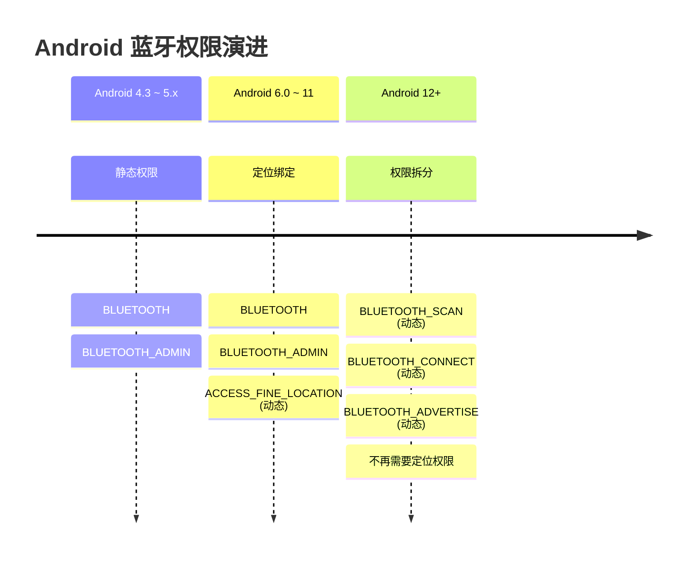

# 03 | 蓝牙权限体系与版本适配

> 学完这篇，你能一次性把 Android 4.3 到 Android 14 的蓝牙权限变化理顺，写出一套权限申请代码覆盖所有版本，不再出现"代码在小米上跑得通、华为上闪退"的尴尬。

---

## 一、结论先行

Android 蓝牙权限经历了两次大地震：

1. **Android 6.0（API 23）**：扫描 BLE 设备需要 `ACCESS_FINE_LOCATION`，因为广播包里的数据可被用来定位（如 iBeacon），Google 把蓝牙扫描和地理定位强行绑定。
2. **Android 12（API 31）**：彻底拆分权限，引入 `BLUETOOTH_SCAN`、`BLUETOOTH_CONNECT`、`BLUETOOTH_ADVERTISE`，**不再需要定位权限**。但这带来了新旧版本的适配分裂。

**你的代码必须同时处理两套权限模型**，否则在新手机上申请不必要的定位权限（用户体验差），或在旧手机上漏申请定位权限（直接崩溃）。

---

## 二、权限演进全图

### 2.1 三个阶段的变化



### 2.2 每个权限的精确含义

| 权限（Manifest 声明） | 保护级别 | 用途 | 动态申请？ |
|---|---|---|---|
| `android.permission.BLUETOOTH` | normal | 建立蓝牙连接、收发数据 | ❌ |
| `android.permission.BLUETOOTH_ADMIN` | normal | 扫描设备、改变蓝牙状态 | ❌ |
| `android.permission.BLUETOOTH_SCAN` | dangerous | Android 12+ 扫描专用 | ✅ |
| `android.permission.BLUETOOTH_CONNECT` | dangerous | Android 12+ 连接/收发数据专用 | ✅ |
| `android.permission.BLUETOOTH_ADVERTISE` | dangerous | Android 12+ 对外广播专用 | ✅ |
| `android.permission.ACCESS_FINE_LOCATION` | dangerous | Android 6~11 扫描必须（精确定位） | ✅ |
| `android.permission.ACCESS_COARSE_LOCATION` | dangerous | Android 6~11 扫描可用（模糊定位） | ✅ |

**关键洞察**：

- `BLUETOOTH` 和 `BLUETOOTH_ADMIN` 在所有版本都必须在 `AndroidManifest.xml` 中声明，且不需要动态申请。
- Android 12+ 的 `BLUETOOTH_SCAN` 权限带有一个特殊属性 `android:usesPermissionFlags="neverForLocation"`，如果你**明确不需要**通过蓝牙扫描获取位置信息，声明这个 flag 可以避免系统把你当成"用蓝牙偷定位"的 App。

### 2.3 为什么 Android 6~11 扫描要定位权限？

BLE 广播包里可以携带 iBeacon 的 Major/Minor 标识，结合已知 Beacon 的物理位置，确实可以推算用户所在位置。Google 为了合规（隐私政策），把蓝牙扫描纳入了定位权限管控。

**但这是个粗暴的设计**：很多 BLE 外设根本不广播位置信息（如心率带），App 却不得不申请定位权限，用户看到"xxx 要获取您的位置"时一脸懵，导致权限拒绝率飙升。

Android 12 的拆分本质上是 Google 承认了这个设计失误，用更细粒度的权限把"扫描蓝牙设备"和"获取地理位置"解耦。

---

## 三、Android 实例：跨版本权限申请实战

**场景**：App 启动蓝牙功能页时，检查并申请所需权限，兼容 Android 6 到 Android 14。

### 3.1 AndroidManifest.xml 声明

```xml
<!-- 所有版本都需要 -->
<uses-permission android:name="android.permission.BLUETOOTH" />
<uses-permission android:name="android.permission.BLUETOOTH_ADMIN" />

<!-- Android 12+ 扫描权限 -->
<uses-permission android:name="android.permission.BLUETOOTH_SCAN"
    android:usesPermissionFlags="neverForLocation" />

<!-- Android 12+ 连接权限 -->
<uses-permission android:name="android.permission.BLUETOOTH_CONNECT" />

<!-- Android 6~11 扫描需要定位权限（旧设备兼容） -->
<uses-permission android:name="android.permission.ACCESS_FINE_LOCATION" />
```

**声明解读**：

- `neverForLocation` flag 的意思是"我扫描蓝牙不是为了定位"。如果声明了，系统不会把蓝牙扫描结果中的 TX Power 和 RSSI 暴露给你做三角定位计算。如果你确实需要（如室内导航），不要加这个 flag，而是单独申请 `ACCESS_FINE_LOCATION`。
- 把新旧权限都声明在 Manifest 里是安全的——系统只会根据当前版本解析有效的权限，旧设备不会识别 `BLUETOOTH_SCAN`，新设备不会强制要求 `ACCESS_FINE_LOCATION`。

### 3.2 动态权限申请代码

```kotlin
class BlePermissionHelper(private val activity: AppCompatActivity) {

    companion object {
        const val RC_BLE_PERMISSIONS = 1001
    }

    /** 检查当前版本所需的蓝牙权限是否已授权 */
    fun hasRequiredPermissions(): Boolean {
        return if (Build.VERSION.SDK_INT >= Build.VERSION_CODES.S) {
            // Android 12+: 只需要 BLUETOOTH_SCAN 和 BLUETOOTH_CONNECT
            ContextCompat.checkSelfPermission(activity, Manifest.permission.BLUETOOTH_SCAN) ==
                PackageManager.PERMISSION_GRANTED &&
            ContextCompat.checkSelfPermission(activity, Manifest.permission.BLUETOOTH_CONNECT) ==
                PackageManager.PERMISSION_GRANTED
        } else {
            // Android 6~11: 扫描必须定位权限
            ContextCompat.checkSelfPermission(activity, Manifest.permission.ACCESS_FINE_LOCATION) ==
                PackageManager.PERMISSION_GRANTED
        }
    }

    /** 申请权限 */
    fun requestPermissions() {
        val permissions = if (Build.VERSION.SDK_INT >= Build.VERSION_CODES.S) {
            arrayOf(
                Manifest.permission.BLUETOOTH_SCAN,
                Manifest.permission.BLUETOOTH_CONNECT
            )
        } else {
            arrayOf(Manifest.permission.ACCESS_FINE_LOCATION)
        }

        ActivityCompat.requestPermissions(activity, permissions, RC_BLE_PERMISSIONS)
    }
}
```

### 3.3 处理权限回调与拒绝引导

```kotlin
class MainActivity : AppCompatActivity() {

    private val permissionHelper = BlePermissionHelper(this)

    override fun onCreate(savedInstanceState: Bundle?) {
        super.onCreate(savedInstanceState)

        if (permissionHelper.hasRequiredPermissions()) {
            startBleScan()
        } else {
            permissionHelper.requestPermissions()
        }
    }

    override fun onRequestPermissionsResult(
        requestCode: Int,
        permissions: Array<out String>,
        grantResults: IntArray
    ) {
        super.onRequestPermissionsResult(requestCode, permissions, grantResults)
        if (requestCode == BlePermissionHelper.RC_BLE_PERMISSIONS) {
            if (grantResults.all { it == PackageManager.PERMISSION_GRANTED }) {
                startBleScan()
            } else {
                // 有权限被拒绝
                val permanentlyDenied = permissions.any {
                    !ActivityCompat.shouldShowRequestPermissionRationale(this, it)
                }
                if (permanentlyDenied) {
                    // 用户点了"拒绝且不再询问"，引导去设置页
                    showGoToSettingsDialog()
                } else {
                    Toast.makeText(this, "蓝牙扫描需要权限", Toast.LENGTH_SHORT).show()
                }
            }
        }
    }

    private fun startBleScan() { /* ... */ }
}
```

**代码意图解读**：

- `shouldShowRequestPermissionRationale` 返回 false 意味着用户勾选了"不再询问"或首次安装未请求过。**为什么？** 因为 Android 的权限回调里，你没法直接区分"首次拒绝"和"永久拒绝"，这个方法是官方推荐的判断依据。
- 不要重复调用 `requestPermissions()` 去骚扰点了"不再询问"的用户，此时唯一出路是弹 Dialog 引导到系统设置页。

---

## 四、后台扫描的特殊限制

### 4.1 前台 vs 后台扫描

| 场景 | 限制 | 是否需要前台服务？ |
|---|---|---|
| Activity/Fragment 在前台 | 基本无限制 | 否 |
| 前台 Service（有通知栏） | 无额外限制 | 否 |
| 后台 Service / WorkManager | Android 8+ 扫描频率大幅降低 | 是（Android 14 强制） |

### 4.2 Android 14 的后台蓝牙新政

从 Android 14 开始，如果 App 处于后台（没有可见 Activity 或前台 Service），调用 `startScan()` 会直接抛 `SecurityException`，除非：

- 你持有 `BLUETOOTH_SCAN` 权限，且
- 你同时运行了一个 **前台服务（Foreground Service）**，且
- 前台服务的类型包含 `FOREGROUND_SERVICE_TYPE_CONNECTED_DEVICE`

### 4.3 前台服务声明示例

```xml
<service
    android:name=".BleScanService"
    android:foregroundServiceType="connectedDevice"
    android:exported="false" />
```

```kotlin
val service = Intent(context, BleScanService::class.java)
ContextCompat.startForegroundService(context, service)
```

---

## 五、边界认知

### 1. `BLUETOOTH` 和 `BLUETOOTH_ADMIN` 仍然必须声明

很多开发者误以为 Android 12+ 只要声明新权限就够了，把旧权限删掉。结果在运行时崩溃——`BluetoothAdapter` 的初始化仍然检查这两个基础权限。保留它们是无害的，删掉它们是致命的。

### 2. `neverForLocation` 不是银弹

加了 `neverForLocation` 后，系统会屏蔽广播包中的 TX Power Level 字段，你无法通过 RSSI + TX Power 计算距离。如果你做的是"找设备"功能（如 AirTag 那样的距离提示），你需要同时申请 `ACCESS_FINE_LOCATION`，且不要加 `neverForLocation`。

### 3. 部分国产厂商 ROM 有额外限制

- **华为/荣耀**：部分机型在"应用启动管理"中把 App 设为"手动管理"后，后台蓝牙会被切断
- **小米**：MIUI 的"省电策略" aggressive 模式下，后台扫描会被系统 kill
- **Oppo/Vivo**：ColorOS/OriginOS 对未在"自启动管理"中授权的应用，后台蓝牙行为不可预期

**应对方案**：引导用户在系统设置中把你的 App 设为"无限制"或"允许后台活动"。这部分在后续"国产厂商兼容性陷阱"篇会详细展开。

### 4. 权限回调中的数组顺序陷阱

`onRequestPermissionsResult` 的 `permissions` 和 `grantResults` 数组是平行对应的，但如果你在某次请求中传入的权限列表里，某些权限在 Manifest 中没声明，系统会直接不返回它们，导致数组下标错位。**确保 `requestPermissions()` 传入的每个权限都在 Manifest 中有声明。**

---

## 六、质量自检

- [x] 能说出 Android 6 和 Android 12 两次权限大地震的核心变化吗？
- [x] 知道 `BLUETOOTH_SCAN` + `neverForLocation` 的含义和限制吗？
- [x] 代码中是否同时处理了新旧两套权限模型？
- [x] 知道如何通过 `shouldShowRequestPermissionRationale` 判断"永久拒绝"吗？
- [x] Android 14 后台扫描需要什么条件能复述吗？
- [x] Manifest 中是否保留了 `BLUETOOTH` 和 `BLUETOOTH_ADMIN`？
