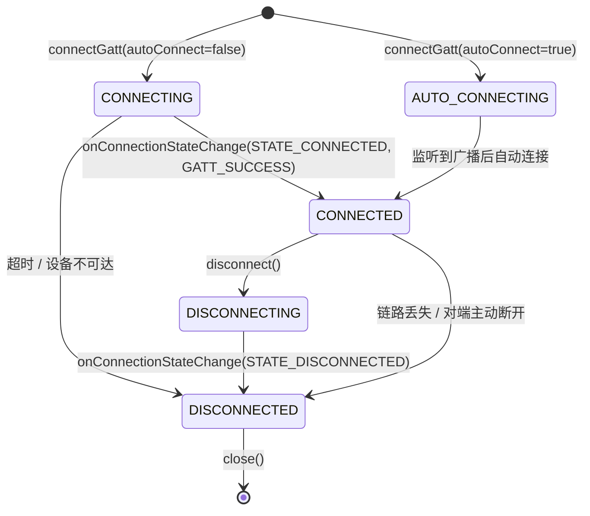

# 05 | BLE 中心设备——连接与 GATT 发现

> 学完这篇，你能正确发起 BLE 连接，避开 `autoConnect` 陷阱，理解连接状态机的完整流转，并在 `onServicesDiscovered` 之后安全地操作 GATT。

---

## 一、结论先行

BLE 连接不是"打电话拨号"那种瞬时完成的动作，而是一个**涉及链路层握手、ATT 层服务发现、多轮回调的状态机过程**。Android 中最容易踩的坑有三个：

1. **`autoConnect = true` 不立即连接**，而是等设备下次广播时"偶遇"连接，延迟不可控（几秒到几分钟）
2. **连接成功后不能立刻读写数据**，必须先调用 `discoverServices()` 并等待回调
3. **`onConnectionStateChange` 回调在 Binder 线程**，更新 UI 必须切换线程

**正确流程永远是**：`connectGatt()` → `onConnectionStateChange(STATE_CONNECTED)` → `discoverServices()` → `onServicesDiscovered()` → 读写/订阅。

---

## 二、`connectGatt()` 的参数解剖

```kotlin
public BluetoothGatt connectGatt(
    Context context,
    boolean autoConnect,          // 第2个参数：自动连接开关
    BluetoothGattCallback callback,
    int transport,                // 传输方式：TRANSPORT_LE / AUTO / BREDR
    int phy,                      // PHY 层：1M / 2M / CODED
    Handler handler               // 指定回调线程，null = Binder 线程
)
```

### 2.1 `autoConnect`：最大的陷阱

| 值 | 行为 | 适用场景 |
|---|---|---|
| `false` | **立即连接**：直接发送 CONNECT_REQ，超时约 30 秒 | 用户主动点击"连接设备" |
| `true` | **后台连接**：不主动发连接请求，等设备下次广播时"白名单连接" | 已绑定设备的静默重连 |

**生活类比**：

- `autoConnect = false` = 你主动拨电话，响铃 30 秒没接就挂掉
- `autoConnect = true` = 你把对方加入"特别关注"，对方一发朋友圈（广播）你就秒赞（连接），但你不会主动打电话

**为什么 `autoConnect = true` 这么慢？**

底层实现是 BLE 的**白名单机制（White List）**。系统把你的设备 MAC 加入 Controller 的白名单，Controller 在扫描时一旦发现白名单中的设备广播，就自动发起连接。这意味着：

1. 如果设备当前不在广播（如被其他手机连接了、或休眠了），你就得等它下次广播
2. 如果设备广播间隔很长（为了省电设成 1 秒以上），连接延迟就是秒级
3. 部分国产厂商 ROM 限制了白名单数量（如最多 4~8 个），超出后 `autoConnect` 失效

**工程建议**：

- 用户主动点击连接 → `autoConnect = false`
- 断线后的自动重连 → 先用 `false` 立即连一次，失败再考虑 `true` 兜底（见第 9 篇）

### 2.2 `transport`：必须指定 `TRANSPORT_LE`

```kotlin
device.connectGatt(context, false, callback, BluetoothDevice.TRANSPORT_LE)
```

如果不指定（用 3 参数重载），部分双模设备（同时支持经典蓝牙和 BLE）会尝试走经典蓝牙连接，导致 `onConnectionStateChange` 返回 `STATE_DISCONNECTED`，status = 133（GATT_ERROR）。

### 2.3 `handler`：回调线程控制

```kotlin
val handler = Handler(Looper.getMainLooper())
device.connectGatt(context, false, callback, BluetoothDevice.TRANSPORT_LE, 0, handler)
```

如果不传 handler，所有回调在 **Binder 线程池** 执行。如果传了主线程 Handler，回调在主线程执行，方便直接更新 UI，但要注意不要在回调里做耗时操作。

**建议**：在 Handler 线程做轻量 UI 更新，耗时操作（如数据解析、数据库写入）仍应丢到线程池。

---

## 三、连接状态机



### 3.1 为什么断开连接后要调用 `close()`？

很多开发者只调 `disconnect()` 不调 `close()`，导致：

1. **内存泄漏**：`BluetoothGatt` 对象持有底层 Native 资源，`disconnect()` 只是发断开指令，资源还在
2. **连接数上限**：Android 底层对 `BluetoothGatt` 实例数量有限制（通常是 7~10 个），不释放就无法连接新设备
3. **状态混乱**：下次用同一个 `BluetoothDevice` 连接时，可能拿到旧的 `BluetoothGatt` 对象，状态不可预期

**正确姿势**：

```kotlin
fun disconnectAndClose() {
    bluetoothGatt?.disconnect()   // 第1步：发断开指令
    // 不要在这里立刻 close()！等 onConnectionStateChange 回调后再 close
}

// 在 callback 中
override fun onConnectionStateChange(gatt: BluetoothGatt, status: Int, newState: Int) {
    if (newState == BluetoothProfile.STATE_DISCONNECTED) {
        gatt.close()              // 第2步：确认断开后释放资源
    }
}
```

---

## 四、`onConnectionStateChange` 的深度解析

### 4.1 参数含义

```kotlin
override fun onConnectionStateChange(gatt: BluetoothGatt, status: Int, newState: Int)
```

| 参数 | 说明 |
|---|---|
| `gatt` | 当前连接对应的 `BluetoothGatt` 对象 |
| `status` | **链路层操作的结果码**，不是连接状态！`GATT_SUCCESS(0)` 表示操作成功，非 0 表示失败原因 |
| `newState` | 新的连接状态：`STATE_CONNECTED(2)` 或 `STATE_DISCONNECTED(0)` |

**最常见的 status 值**：

| status | 含义 | 常见原因 |
|---|---|---|
| 0 | `GATT_SUCCESS` | 正常 |
| 8 | `GATT_CONN_TIMEOUT` | 连接超时（设备超出范围或关机） |
| 19 | `GATT_CONN_TERMINATE_PEER_USER` | 对端主动断开 |
| 22 | `GATT_CONN_TERMINATE_LOCAL_HOST` | 本端主动断开 |
| 133 | `GATT_ERROR` | 通用错误，原因不明（最常见，也最烦人） |
| 257 | `GATT_CONN_CANCEL` | 连接被系统或其他应用取消 |

### 4.2 status 的非直观性

**坑点**：`newState == STATE_CONNECTED` 时，`status` 也可能不是 0。例如某些 MTK 芯片的设备连接成功后 status = 133，但连接实际上已经建立了。这种厂商兼容性问题在第 13 篇会详细展开。

**防御性写法**：

```kotlin
override fun onConnectionStateChange(gatt: BluetoothGatt, status: Int, newState: Int) {
    when (newState) {
        BluetoothProfile.STATE_CONNECTED -> {
            // 即使 status != 0，也尝试发现服务
            // 部分厂商 ROM 的 status 不准确，但链路已通
            if (status == BluetoothGatt.GATT_SUCCESS || isKnownQuirk(status)) {
                gatt.discoverServices()
            } else {
                // 真正失败了，触发重连逻辑
                handleConnectionFailure(status)
            }
        }
        BluetoothProfile.STATE_DISCONNECTED -> {
            gatt.close()
            handleDisconnection(status)
        }
    }
}
```

---

## 五、Android 实例：完整的连接管理器

```kotlin
class BleConnectionManager(
    private val context: Context,
    private val device: BluetoothDevice
) {
    private var gatt: BluetoothGatt? = null
    private val mainHandler = Handler(Looper.getMainLooper())
    private var connectTimeoutRunnable: Runnable? = null

    private val callback = object : BluetoothGattCallback() {
        override fun onConnectionStateChange(gatt: BluetoothGatt, status: Int, newState: Int) {
            mainHandler.post {
                when (newState) {
                    BluetoothProfile.STATE_CONNECTED -> {
                        cancelConnectTimeout()
                        Log.i("BLE", "已连接，status=$status")
                        gatt.discoverServices()
                    }
                    BluetoothProfile.STATE_DISCONNECTED -> {
                        cancelConnectTimeout()
                        Log.i("BLE", "已断开，status=$status")
                        gatt.close()
                        this@BleConnectionManager.gatt = null
                    }
                }
            }
        }

        override fun onServicesDiscovered(gatt: BluetoothGatt, status: Int) {
            mainHandler.post {
                if (status == BluetoothGatt.GATT_SUCCESS) {
                    Log.i("BLE", "发现 ${gatt.services.size} 个 Service")
                    onConnectionReady(gatt)
                } else {
                    Log.e("BLE", "服务发现失败: $status")
                    disconnect()
                }
            }
        }
    }

    fun connect(timeoutMs: Long = 10_000) {
        if (gatt != null) {
            Log.w("BLE", "已有连接，先断开")
            disconnect()
        }

        gatt = device.connectGatt(
            context,
            false,  // 立即连接
            callback,
            BluetoothDevice.TRANSPORT_LE
        )

        // 连接超时保护：系统默认 30 秒，业务层可设更短
        connectTimeoutRunnable = Runnable {
            Log.e("BLE", "连接超时")
            disconnect()
        }.also { mainHandler.postDelayed(it, timeoutMs) }
    }

    fun disconnect() {
        cancelConnectTimeout()
        gatt?.disconnect()
        // 不要在这里 close()，等 onConnectionStateChange 回调确认断开
    }

    private fun cancelConnectTimeout() {
        connectTimeoutRunnable?.let { mainHandler.removeCallbacks(it) }
        connectTimeoutRunnable = null
    }

    private fun onConnectionReady(gatt: BluetoothGatt) {
        // 连接就绪，可进行读写操作
    }
}
```

**代码意图解读**：

- **超时保护**：系统默认 30 秒超时，但业务层通常不需要等这么久。设 10 秒超时，失败后可立即触发重试或提示用户。
- **不在 `disconnect()` 里 `close()`**：`disconnect()` 是异步的，立即 `close()` 可能导致 `onConnectionStateChange` 永远收不到，资源泄漏。
- **所有回调通过 Handler 切到主线程**：`BluetoothGattCallback` 默认在 Binder 线程，直接操作 UI 会 crash。

---

## 六、连接参数：让链路更稳定

### 6.1 `requestConnectionPriority()`

连接建立后，可以请求修改连接参数：

```kotlin
// 三档预设：HIGH / BALANCED / LOW_POWER
gatt.requestConnectionPriority(BluetoothGatt.CONNECTION_PRIORITY_HIGH)
```

| 优先级 | 连接间隔 | 延迟 | 适用场景 |
|---|---|---|---|
| `HIGH` | 7.5 ~ 15 ms | 低 | OTA 升级、大数据传输 |
| `BALANCED` | 30 ~ 50 ms | 中 | 常规数据通信 |
| `LOW_POWER` | 100+ ms | 高 | 心率、温度等低频数据 |

**注意**：这只是"请求"，外设可以不采纳。实际参数由双方协商，最终以对端回复为准。部分低功耗外设（如纽扣电池供电的传感器）会强制拒绝 HIGH 模式。

---

## 七、边界认知

### 1. `connectGatt` 的并发限制

Android 系统对并发 GATT 连接数有上限（通常 7~10 个），超出后 `connectGatt` 返回 null 或直接失败。**多设备连接场景必须自己维护连接池和排队逻辑**（第 11 篇展开）。

### 2. 主线程调用 `connectGatt`

虽然文档没明确说，但源码里 `connectGatt` 会触发 IPC 和状态机初始化。**建议在主线程调用**，避免 Binder 线程死锁或时序问题。

### 3. 已绑定设备可直接连接，无需扫描

如果设备已经配对（Bonded），你可以直接用 `adapter.getRemoteDevice(macAddress)` 获取 `BluetoothDevice` 对象发起连接，不需要先扫描。这是实现"自动重连已配对设备"的基础。

### 4. 连接失败码 133 的玄学

Status 133 是 Android BLE 开发中最臭名昭著的"万能错误码"。它可能代表：

- 设备超出范围
- 设备 MAC 地址无效（如随机地址过期）
- 系统蓝牙栈异常
- 并发连接数超限
- 厂商 ROM 兼容性问题

**没有银弹解决方案**，但有一个有效的土办法：收到 133 后延迟 300~500ms 再重试一次，成功率会显著提高。原因可能是给蓝牙芯片清状态的时间。

### 5. 不要缓存 `BluetoothGatt` 对象

断开后旧的 `gatt` 对象就废了，下次连接必须重新 `connectGatt`。缓存旧对象不仅没用，还可能导致难以排查的 Native Crash。

---

## 八、质量自检

- [x] `autoConnect = true` 和 `false` 的本质区别能讲清楚吗？
- [x] 知道为什么断开连接后要等回调再 `close()` 吗？
- [x] 代码中是否指定了 `TRANSPORT_LE`？
- [x] 有没有连接超时保护机制？
- [x] 知道 `onConnectionStateChange` 在哪个线程回调吗？
- [x] 能说出 status 133 可能的几种原因吗？
- [x] `requestConnectionPriority` 只是请求而非命令，外设可以不采纳，这个认知有吗？
