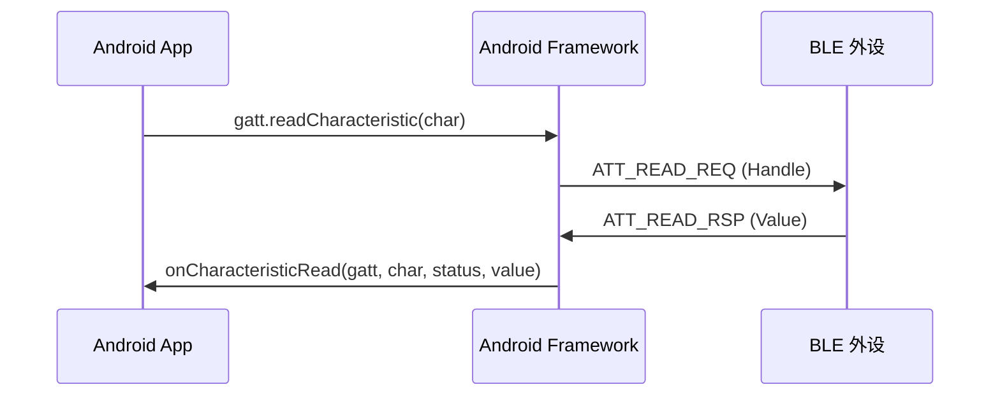
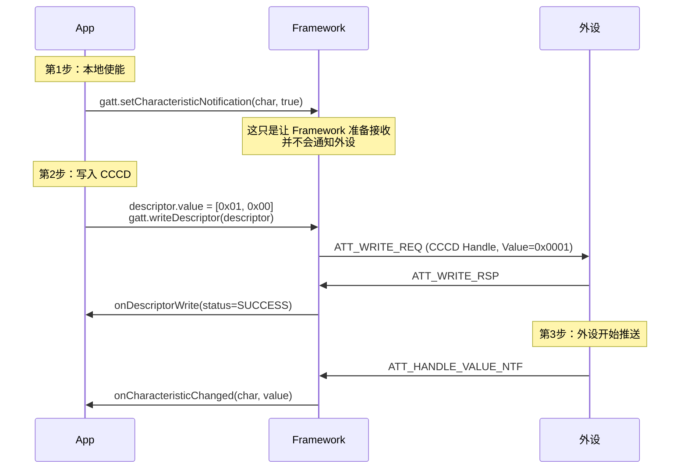

# 06 | BLE 中心设备——数据读写与通知

> 学完这篇，你能完成 BLE 通信的最后一块拼图：主动读取数据、写入指令、订阅外设的实时推送，并处理大数据包的分片重组。

---

## 一、结论先行

GATT 通信只有三种基本操作：**读（Read）、写（Write）、通知（Notify）**。它们全部通过 `BluetoothGattCallback` 异步回调完成。

- **Read**：你问外设"现在温度多少？"，外设回答你
- **Write**：你告诉外设"把灯打开"，外设执行
- **Notify/Indicate**：外设主动推送"温度变了"，类似 WebSocket

**所有操作都必须串行执行**：在收到上一个操作的回调之前，不能发下一个操作。这是蓝牙协议栈的硬性约束，也是多设备场景最容易出 BUG 的地方（第 11 篇会讲请求队列的设计）。

---

## 二、读操作（Read Characteristic）

### 2.1 基本流程



### 2.2 关键限制

- **单次读取最大长度 = MTU - 1**（MTU 默认 23，所以默认最多读 22 字节）
- 读操作是**阻塞式串行**的：`readCharacteristic` 返回 `true` 只是说明请求已入队，真正的数据在回调里
- 如果连续调用两次 `readCharacteristic` 而不等第一次回调，第二次大概率返回 `false`

---

## 三、写操作（Write Characteristic）

### 3.1 两种写入类型

| 类型 | 常量 | 是否需要 ACK | 最大长度 | 适用场景 |
|---|---|---|---|---|
| 有响应写 | `WRITE` | ✅ 需要 | MTU - 3 | 控制指令（如开关灯） |
| 无响应写 | `WRITE_NO_RESPONSE` | ❌ 不需要 | MTU - 3 | 大数据传输（如 OTA） |

```kotlin
// 有响应写：外设收到后会回 ATT_WRITE_RSP，可靠性高
characteristic.writeType = BluetoothGattCharacteristic.WRITE_TYPE_DEFAULT
gatt.writeCharacteristic(characteristic)

// 无响应写：fire-and-forget，速度快但可能丢包
characteristic.writeType = BluetoothGattCharacteristic.WRITE_TYPE_NO_RESPONSE
gatt.writeCharacteristic(characteristic)
```

### 3.2 写入确认 vs 业务确认

很多开发者误以为 `onCharacteristicWrite` 收到 `GATT_SUCCESS` 就代表外设"执行成功"了。**这是错的。**

- `onCharacteristicWrite` 只表示 **ATT 层写操作成功**（数据到达了对端 GATT Server 的 Characteristic buffer）
- 外设是否真正执行了这个指令（如灯是否真的亮了），需要外设通过另一个 Characteristic 回传状态，或通过 Notification 告知

**生活类比**：你给朋友发微信说"帮我带杯咖啡"，微信显示"已送达"不代表朋友已经买了咖啡，更不代表咖啡已经送到你手里。

---

## 四、通知与指示（Notify / Indicate）

### 4.1 开启通知的完整链路

这是 BLE 开发中最多人踩坑的地方。开启通知不是调一个方法就完事的，而是**三步操作**：



### 4.2 为什么必须写 CCCD？

CCCD（Client Characteristic Configuration Descriptor，UUID = `0x2902`）是 GATT 协议规定的标准 Descriptor。它的值告诉外设：

- `0x0000`：关闭通知和指示
- `0x0001`：开启 Notification（无 ACK）
- `0x0002`：开启 Indication（有 ACK）

**如果你只调了 `setCharacteristicNotification(true)` 但没写 CCCD，外设根本不知道你要订阅，永远不会发数据。**

### 4.3 Android 12+ 的新 API

Android 12 引入了更简洁的通知订阅方式：

```kotlin
// 旧方式（兼容所有版本）
val descriptor = characteristic.getDescriptor(NOTIFICATION_DESCRIPTOR_UUID)
descriptor.value = BluetoothGattDescriptor.ENABLE_NOTIFICATION_VALUE
gatt.writeDescriptor(descriptor)

// Android 12+ 新方式
if (Build.VERSION.SDK_INT >= Build.VERSION_CODES.TIRAMISU) {
    gatt.writeDescriptor(descriptor, BluetoothGattDescriptor.ENABLE_NOTIFICATION_VALUE)
}
```

**注意**：即使是新 API，`setCharacteristicNotification` 仍然需要先调，它是 Framework 层的本地开关。

---

## 五、Android 实例：完整的数据交互封装

```kotlin
class BleDataChannel(
    private val gatt: BluetoothGatt,
    serviceUuid: UUID,
    private val rxCharUuid: UUID   // 接收数据的 Characteristic
) {
    private val service = gatt.getService(serviceUuid)
        ?: throw IllegalStateException("Service 未发现: $serviceUuid")

    private val rxCharacteristic = service.getCharacteristic(rxCharUuid)
        ?: throw IllegalStateException("Characteristic 未发现: $rxCharUuid")

    /** 开启通知，完成后通过 callback 告知结果 */
    fun enableNotification(callback: (Boolean) -> Unit) {
        val success = gatt.setCharacteristicNotification(rxCharacteristic, true)
        if (!success) {
            callback(false)
            return
        }

        val descriptor = rxCharacteristic.getDescriptor(NOTIFY_DESCRIPTOR_UUID)
            ?: run {
                Log.w("BLE", "缺少 CCCD，通知可能无法工作")
                callback(false)
                return
            }

        // Android 13+ 新 API
        if (Build.VERSION.SDK_INT >= Build.VERSION_CODES.TIRAMISU) {
            gatt.writeDescriptor(
                descriptor,
                BluetoothGattDescriptor.ENABLE_NOTIFICATION_VALUE
            )
        } else {
            @Suppress("DEPRECATION")
            descriptor.value = BluetoothGattDescriptor.ENABLE_NOTIFICATION_VALUE
            gatt.writeDescriptor(descriptor)
        }

        // 注意：真正的成功与否要看 onDescriptorWrite 回调
        // 这里为了简化示例直接回调，生产环境应使用状态机
        callback(true)
    }

    /** 读取数据 */
    fun read(): Boolean {
        return gatt.readCharacteristic(rxCharacteristic)
    }

    /** 写入数据（默认有响应） */
    fun write(data: ByteArray, noResponse: Boolean = false): Boolean {
        rxCharacteristic.writeType = if (noResponse) {
            BluetoothGattCharacteristic.WRITE_TYPE_NO_RESPONSE
        } else {
            BluetoothGattCharacteristic.WRITE_TYPE_DEFAULT
        }

        return if (Build.VERSION.SDK_INT >= Build.VERSION_CODES.TIRAMISU) {
            gatt.writeCharacteristic(rxCharacteristic, data,
                if (noResponse) WRITE_CHARACTERISTIC_NO_RESPONSE else WRITE_CHARACTERISTIC_DEFAULT
            ) == BluetoothStatusCodes.SUCCESS
        } else {
            @Suppress("DEPRECATION")
            rxCharacteristic.value = data
            gatt.writeCharacteristic(rxCharacteristic)
        }
    }

    companion object {
        private val NOTIFY_DESCRIPTOR_UUID =
            UUID.fromString("00002902-0000-1000-8000-00805F9B34FB")
    }
}
```

**代码意图解读**：

- `setCharacteristicNotification` 先使能本地接收能力，再写 CCCD 通知对端。**两步缺一不可**，这是 BLE 协议的规定，不是 Android 的怪癖。
- `writeCharacteristic` 在 Android 13+ 有了新签名，直接传 `ByteArray` 而不是先设置到 Characteristic 对象上。**为什么改？** 旧 API 把数据暂存在 `Characteristic.value` 里，并发写入时容易被覆盖。
- `write` 返回 `Boolean` 只代表请求是否成功入队，不代表写入完成。完成确认等 `onCharacteristicWrite` 回调。

---

## 六、回调线程与数据重组

### 6.1 回调线程模型

所有 `BluetoothGattCallback` 方法默认在 **Binder 线程** 回调：

| 回调 | 触发时机 |
|---|---|
| `onCharacteristicRead` | 读请求完成 |
| `onCharacteristicWrite` | 写请求完成（ATT 层 ACK 收到） |
| `onCharacteristicChanged` | 收到外设 Notification |
| `onDescriptorWrite` | Descriptor 写入完成 |

**不要在回调里做耗时操作**（如数据库写入、JSON 解析、网络请求），会阻塞 Binder 线程池，影响系统其他蓝牙应用的响应。

### 6.2 大数据分片重组

默认 MTU 23 字节，ATT 头占 3 字节，所以单次读写/通知最多 **20 字节** 有效载荷。

如果外设要发 100 字节数据，会分 5 次 Notification 推送。你的应用层需要重组：

```kotlin
private val incomingBuffer = ByteArrayOutputStream()

override fun onCharacteristicChanged(
    gatt: BluetoothGatt,
    characteristic: BluetoothGattCharacteristic,
    value: ByteArray
) {
    incomingBuffer.write(value)

    // 假设协议规定最后一片以 0x00 结尾
    if (value.isNotEmpty() && value.last() == 0x00.toByte()) {
        val completePacket = incomingBuffer.toByteArray()
        incomingBuffer.reset()
        processCompletePacket(completePacket)
    }
}
```

**更 robust 的方案**：在应用层协议头里带"包序号"和"总包数"，而不是依赖特定结束符。结束符方案在数据本身包含 0x00 时会误判。

**注意**：第 8 篇会详细讲 MTU 协商和分包传输的工程化方案。

---

## 七、边界认知

### 1. `onCharacteristicChanged` 和 `onCharacteristicRead` 的数据来源不同

| 回调 | 数据来源 | 触发条件 |
|---|---|---|
| `onCharacteristicRead` | 你主动发起的 `readCharacteristic` 的响应 | App 主动请求 |
| `onCharacteristicChanged` | 外设主动推送的 Notification | 外设数据变化 |

两者可能对应同一个 Characteristic UUID，但触发逻辑完全不同。不要混为一谈。

### 2. 写入数据长度超限不会抛异常

如果你传了 50 字节但 MTU 只有 23，`writeCharacteristic` 在部分 Android 版本上仍然会返回 `true`，但底层只会发送前 20 字节，后面的静默丢弃。**必须在应用层根据当前 MTU 做分包**，不要信任系统会帮你截断或报错。

### 3. Notification 可能丢失

Notification 是 fire-and-forget，没有 ATT 层 ACK。如果射频环境差（如地铁、电梯），通知包可能丢失。对于关键数据（如门锁开关状态），外设应该使用 **Indication**（带 ACK），或应用层自己做心跳和重传机制。

### 4. 同时订阅多个 Characteristic

多个 Characteristic 的通知可以并存，但每次订阅都要独立写对应的 CCCD。不要在循环里连续写多个 Descriptor 而不等回调——串行化是铁律。

### 5. Android 13+ `value` 参数的变化

Android 13（API 33）起，`onCharacteristicRead` 和 `onCharacteristicChanged` 增加了带 `value: ByteArray` 参数的新重载：

```kotlin
override fun onCharacteristicChanged(
    gatt: BluetoothGatt,
    characteristic: BluetoothGattCharacteristic,
    value: ByteArray    // 新参数，直接拿到数据
)
```

旧的重载（从 `characteristic.value` 读数据）被标记为废弃，因为 `value` 字段是共享可变对象，并发时数据可能被覆盖。**新代码应该用带 `value` 参数的重载。**

---

## 八、质量自检

- [x] 能说出 Read / Write / Notify 三种操作的适用场景吗？
- [x] 知道开启通知需要哪三步，哪一步最容易漏吗？
- [x] `WRITE_TYPE_DEFAULT` 和 `WRITE_TYPE_NO_RESPONSE` 的区别说清了吗？
- [x] `onCharacteristicWrite` 成功只代表 ATT 层送达，不代表业务执行成功，这个认知有吗？
- [x] 知道默认 MTU 下每次最多 20 字节有效载荷吗？
- [x] 大数据分片重组时，用结束符方案有什么隐患？
- [x] Android 13+ 的新回调重载知道为什么引入吗？
