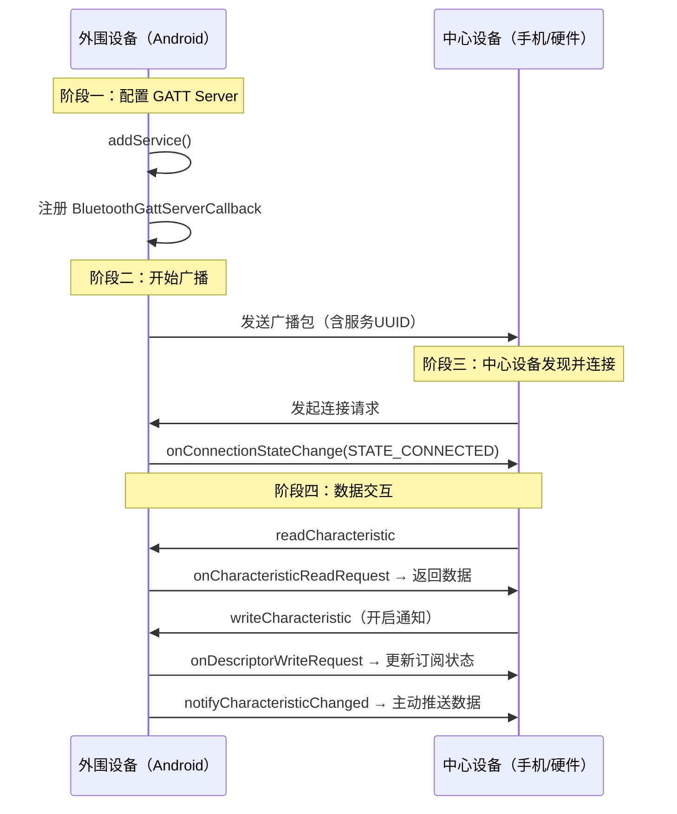

# 07 | BLE 外围设备——GATT Server 开发

> 学完这篇，你能把手机变成一个 BLE 外设（Peripheral），让其他手机或智能硬件来连接你、读写你的数据。这是实现"手机当遥控器""手机当配置器""双手机蓝牙通信"的基础能力。

---

## 一、结论先行

Android 作为 BLE 外围设备开发，核心是搭建一个 **GATT Server**，包含三个步骤：

1. **对外广播（Advertising）**：让中心设备知道你存在，并携带服务 UUID 等元数据
2. **创建 GATT Server**：用 `BluetoothGattServer` 定义 Service/Characteristic 结构
3. **响应读写请求**：在 `BluetoothGattServerCallback` 中处理中心设备的读、写、订阅请求

**大多数 BLE 教程只教中心模式（手机连手环），但外围模式在工业场景中非常实用**：如手机给智能门锁发临时密码、手机配置 Wi-Fi 模组、两台手机点对点传输文件等。

---

## 二、外围设备的工作流程



---

## 三、搭建 GATT Server

### 3.1 定义 Service 和 Characteristic

```kotlin
// 自定义服务和特征值的 UUID
val SERVICE_UUID = UUID.fromString("0000ABCD-0000-1000-8000-00805F9B34FB")
val CHAR_READ_UUID = UUID.fromString("0000ABCE-0000-1000-8000-00805F9B34FB")
val CHAR_WRITE_UUID = UUID.fromString("0000ABCF-0000-1000-8000-00805F9B34FB")

// 创建 Service
val service = BluetoothGattService(SERVICE_UUID, BluetoothGattService.SERVICE_TYPE_PRIMARY)

// 可读特征值
val readChar = BluetoothGattCharacteristic(
    CHAR_READ_UUID,
    BluetoothGattCharacteristic.PROPERTY_READ or BluetoothGattCharacteristic.PROPERTY_NOTIFY,
    BluetoothGattCharacteristic.PERMISSION_READ
)

// 可写特征值
val writeChar = BluetoothGattCharacteristic(
    CHAR_WRITE_UUID,
    BluetoothGattCharacteristic.PROPERTY_WRITE,
    BluetoothGattCharacteristic.PERMISSION_WRITE
)

// 为 NOTIFY 特征值添加 CCCD
val cccd = BluetoothGattDescriptor(
    UUID.fromString("00002902-0000-1000-8000-00805F9B34FB"),
    BluetoothGattDescriptor.PERMISSION_READ or BluetoothGattDescriptor.PERMISSION_WRITE
)
readChar.addDescriptor(cccd)

service.addCharacteristic(readChar)
service.addCharacteristic(writeChar)
```

**关键细节**：

- **必须添加 CCCD**：如果 Characteristic 支持 Notification，必须显式添加 CCCD Descriptor，否则中心设备无法订阅通知。
- **PERMISSION 和 PROPERTY 要匹配**：`PROPERTY_READ` 必须搭配 `PERMISSION_READ`，否则中心设备读请求会收到 `ATT_INSUFFICIENT_AUTHORIZATION` 错误。

### 3.2 打开 GATT Server 并注册 Service

```kotlin
val gattServer = bluetoothManager.openGattServer(context, serverCallback)
gattServer.addService(service)
```

**注意**：`openGattServer` 返回的 `BluetoothGattServer` 对象必须持有引用，如果被 GC 回收，Server 会失效。

---

## 四、处理中心设备的请求

### 4.1 `BluetoothGattServerCallback` 核心方法

```kotlin
private val serverCallback = object : BluetoothGattServerCallback() {

    override fun onConnectionStateChange(device: BluetoothDevice, status: Int, newState: Int) {
        when (newState) {
            BluetoothProfile.STATE_CONNECTED -> {
                Log.i("BLE", "中心设备已连接: ${device.address}")
                connectedDevice = device
            }
            BluetoothProfile.STATE_DISCONNECTED -> {
                Log.i("BLE", "中心设备已断开: ${device.address}")
                if (connectedDevice == device) connectedDevice = null
            }
        }
    }

    override fun onCharacteristicReadRequest(
        device: BluetoothDevice,
        requestId: Int,
        offset: Int,
        characteristic: BluetoothGattCharacteristic
    ) {
        val data = when (characteristic.uuid) {
            CHAR_READ_UUID -> "当前温度: 25.5°C".toByteArray()
            else -> byteArrayOf()
        }
        gattServer?.sendResponse(device, requestId, BluetoothGatt.GATT_SUCCESS, offset, data)
    }

    override fun onCharacteristicWriteRequest(
        device: BluetoothDevice,
        requestId: Int,
        characteristic: BluetoothGattCharacteristic,
        preparedWrite: Boolean,
        responseNeeded: Boolean,
        offset: Int,
        value: ByteArray?
    ) {
        val received = value?.toString(Charsets.UTF_8) ?: ""
        Log.i("BLE", "收到写入: $received")

        // 处理业务逻辑...

        if (responseNeeded) {
            gattServer?.sendResponse(device, requestId, BluetoothGatt.GATT_SUCCESS, offset, null)
        }
    }

    override fun onDescriptorWriteRequest(
        device: BluetoothDevice,
        requestId: Int,
        descriptor: BluetoothGattDescriptor,
        preparedWrite: Boolean,
        responseNeeded: Boolean,
        offset: Int,
        value: ByteArray?
    ) {
        // 中心设备写入了 CCCD，更新本地状态
        descriptor.value = value

        if (responseNeeded) {
            gattServer?.sendResponse(device, requestId, BluetoothGatt.GATT_SUCCESS, offset, null)
        }

        val isNotificationEnabled = value?.contentEquals(
            BluetoothGattDescriptor.ENABLE_NOTIFICATION_VALUE
        ) == true
        Log.i("BLE", "通知订阅状态: $isNotificationEnabled")
    }
}
```

**代码意图解读**：

- **`sendResponse` 必须调用**：如果不回复，中心设备的 `readCharacteristic` / `writeCharacteristic` 会永远阻塞直到超时（30 秒）。这是新手最容易漏的。
- **`responseNeeded` 判断**：`WRITE_TYPE_NO_RESPONSE` 的写操作不会触发响应，此时 `responseNeeded = false`，你调 `sendResponse` 反而可能报错。
- **保存 `connectedDevice`**：后续主动发通知时，需要知道往哪个设备发。

---

## 五、向中心设备发送通知

外围设备作为 Server，也可以主动向中心设备（Client）推送数据。

```kotlin
fun notifyData(data: ByteArray) {
    val device = connectedDevice ?: return
    val characteristic = gattServer
        ?.getService(SERVICE_UUID)
        ?.getCharacteristic(CHAR_READ_UUID)
        ?: return

    characteristic.value = data

    val success = gattServer?.notifyCharacteristicChanged(device, characteristic, false)
    Log.i("BLE", "通知发送结果: $success")
}
```

**注意**：`notifyCharacteristicChanged` 的第三个参数 `confirm`：

- `false` = Notification（无 ACK，快但可能丢）
- `true` = Indication（有 ACK，慢但可靠）

中心设备必须先订阅（写入 CCCD），否则 `notifyCharacteristicChanged` 返回 `true`，但数据不会真正发出。

---

## 六、开始广播

光有 GATT Server 还不够，必须对外广播让中心设备发现你。

```kotlin
val advertiser = bluetoothAdapter.bluetoothLeAdvertiser

val settings = AdvertiseSettings.Builder()
    .setAdvertiseMode(AdvertiseSettings.ADVERTISE_MODE_LOW_LATENCY)
    .setConnectable(true)
    .setTimeout(0)  // 0 = 一直广播
    .setTxPowerLevel(AdvertiseSettings.ADVERTISE_TX_POWER_HIGH)
    .build()

val data = AdvertiseData.Builder()
    .setIncludeDeviceName(true)
    .addServiceUuid(ParcelUuid(SERVICE_UUID))
    .build()

val callback = object : AdvertiseCallback() {
    override fun onStartSuccess(settingsInEffect: AdvertiseSettings?) {
        Log.i("BLE", "广播启动成功")
    }
    override fun onStartFailure(errorCode: Int) {
        Log.e("BLE", "广播启动失败: $errorCode")
    }
}

advertiser?.startAdvertising(settings, data, callback)
```

**广播参数**：

| 模式 | 说明 |
|---|---|
| `ADVERTISE_MODE_LOW_LATENCY` | 100ms 间隔，最快被发现，最耗电 |
| `ADVERTISE_MODE_BALANCED` | 250ms 间隔，折中方案 |
| `ADVERTISE_MODE_LOW_POWER` | 1s 间隔，最省电 |

**注意**：部分低端 Android 设备不支持作为外围设备广播（没有 `bluetoothLeAdvertiser`），需要提前判空。

---

## 七、边界认知

### 1. Android 作为外围设备的兼容性

- **Android 5.0+ 才支持 GATT Server**
- **Android 6.0+ 才支持外围模式广播**
- 部分老旧 MTK 芯片的设备，外围模式不稳定，广播可能突然停止
- **某些厂商 ROM（如早期华为）限制了同时作为中心设备和外围设备**，不能一边扫描一边广播

### 2. `sendResponse` 的线程安全

`sendResponse` 可以在任何线程调用，但建议统一在 `BluetoothGattServerCallback` 回调中处理，避免竞态条件。

### 3. 广播包 31 字节限制

广播数据（`AdvertiseData`）总长度不能超过 31 字节。如果包含设备名称 + 服务 UUID + 厂商数据，很容易超限。超限会导致 `onStartFailure` 报错。建议：

- 使用短设备名（8 字节以内）
- 只广播必要的服务 UUID
- 厂商数据尽量精简

### 4. 多中心设备连接

一个 GATT Server 可以被多个中心设备同时连接。你需要维护一个 `connectedDevices: Set<BluetoothDevice>`，发通知时决定是广播给所有设备，还是只发给特定设备。

### 5. 外围模式的典型功耗

- 广播功耗 > 连接态功耗 > 空闲功耗
- 如果不需要被持续发现，连接建立后应停止广播（`stopAdvertising`），只保留 GATT Server

---

## 八、质量自检

- [x] 能说出外围模式的三个核心步骤吗？
- [x] 知道 CCCD 必须显式添加到支持 NOTIFY 的 Characteristic 上吗？
- [x] 知道收到读/写请求后必须调用 `sendResponse` 吗？
- [x] `responseNeeded` 为 false 时调 `sendResponse` 会怎样？
- [x] 广播数据超过 31 字节会怎样？怎么优化？
- [x] 知道部分 Android 设备不支持外围模式广播吗？
- [x] 外围设备可以同时被多个中心设备连接，这个认知有吗？
