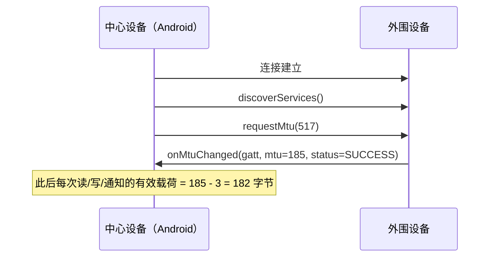

# 08 | MTU 协商与大数据分包传输

> 学完这篇，你能突破 BLE 默认 20 字节的传输限制，掌握 MTU 协商的正确时机，并写出一套应用层分包/组包的稳健方案，让 OTA 升级、日志上传、配置下发等大流量场景跑得通。

---

## 一、结论先行

BLE 默认每次最多传 **20 字节**（MTU = 23，ATT 层头占 3 字节）。要传更大的数据，有两条路：

1. **MTU 协商**：把传输单元从 23 提升到 185~512，一次性传输更多数据
2. **应用层分包**：如果 MTU 协商失败或外设不支持，自己在应用层把大包切成小片发送

**MTU 协商不是万能的**：部分低端 BLE 外设（如基于 NRF51 的早期方案）MTU 固定 23，不支持协商。所以**任何 BLE 通信框架都必须同时具备 MTU 协商能力和应用层分包兜底能力**。

---

## 二、MTU 到底是什么？

### 2.1 协议栈中的两层 MTU

| 层级 | 名称 | 默认值 | 含义 |
|---|---|---|---|
| **ATT 层** | ATT_MTU | 23 | Attribute Protocol 的最大 PDU 长度 |
| **链路层** | LL PDU | 27 | Link Layer 的数据包长度 |

**关系**：ATT_MTU ≤ LL PDU - 4（LL 头占 4 字节）。BLE 4.2 之前 LL PDU 固定 27，所以 ATT_MTU 最大 23。BLE 5.0 引入 Data Length Extension（DLE），LL PDU 可达 251，为更大的 ATT_MTU 创造了条件。

**Android 中的 MTU**：

- Android 5.0（API 21）引入 `requestMtu()`
- Android 系统默认 ATT_MTU = 23
- 协商成功后，Android 通常支持到 **517**（系统上限），但实际可用值取决于外设

### 2.2 MTU 协商时机



**关键规则**：

- **必须在 `onServicesDiscovered` 之后调用 `requestMtu()`**，不能在连接刚建立时就调
- 协商是**中心设备发起**的（外围设备不能主动发起 MTU 协商）
- 最终 MTU 取**双方支持的最小值**：你请求 517，外设只支持 185，结果就是 185

---

## 三、Android 实例：MTU 协商与分包传输

### 3.1 MTU 协商

```kotlin
override fun onServicesDiscovered(gatt: BluetoothGatt, status: Int) {
    if (status == BluetoothGatt.GATT_SUCCESS) {
        // Android 请求最大 MTU（通常系统限制为 517）
        gatt.requestMtu(517)
    }
}

override fun onMtuChanged(gatt: BluetoothGatt, mtu: Int, status: Int) {
    if (status == BluetoothGatt.GATT_SUCCESS) {
        // 有效载荷 = MTU - 3（ATT 头：Opcode 1字节 + Handle 2字节）
        val maxPayload = mtu - 3
        Log.i("BLE", "MTU 协商成功: $mtu, 最大载荷: $maxPayload")
    } else {
        Log.w("BLE", "MTU 协商失败，使用默认 20 字节")
    }
}
```

### 3.2 应用层分包写入

即使 MTU 协商成功，某些写操作仍可能受限于外设的接收 buffer 大小。稳健的做法是**应用层分包 + 流量控制**。

```kotlin
class BleChunkedWriter(
    private val gatt: BluetoothGatt,
    private val characteristic: BluetoothGattCharacteristic
) {
    // 实际分包大小，保守策略：取 min(协商后MTU-3, 外设buffer容量)
    private var chunkSize = 20
    private val writeQueue = LinkedBlockingQueue<ByteArray>()
    private var isWriting = false

    fun updateMtu(mtu: Int) {
        chunkSize = (mtu - 3).coerceAtMost(182)  // 保守上限，部分外设buffer小
    }

    /** 写入大数据，内部自动分包 */
    fun writeLargeData(data: ByteArray, callback: (Boolean) -> Unit) {
        // 在数据头部加上总长度信息（假设用2字节大端表示）
        val lengthHeader = byteArrayOf(
            (data.size shr 8).toByte(),
            data.size.toByte()
        )
        val fullPacket = lengthHeader + data

        // 切成 chunkSize 大小的片
        val chunks = fullPacket.asSequence()
            .chunked(chunkSize)
            .map { it.toByteArray() }
            .toList()

        chunks.forEach { writeQueue.offer(it) }
        if (!isWriting) processQueue()
    }

    private fun processQueue() {
        val chunk = writeQueue.poll() ?: return
        isWriting = true

        characteristic.writeType = BluetoothGattCharacteristic.WRITE_TYPE_DEFAULT
        characteristic.value = chunk
        val success = gatt.writeCharacteristic(characteristic)

        if (!success) {
            isWriting = false
            // 失败重试或上报错误
        }
    }

    /** 在 onCharacteristicWrite 回调中调用 */
    fun onWriteComplete(status: Int) {
        isWriting = false
        if (status == BluetoothGatt.GATT_SUCCESS && writeQueue.isNotEmpty()) {
            processQueue()
        }
    }
}
```

**代码意图解读**：

- **头部加长度**：接收方需要知道总长度才能判断何时组包完成。2 字节大端编码支持最大 64KB 数据。
- **队列 + 串行化**：利用 `LinkedBlockingQueue` 保证线程安全，在 `onCharacteristicWrite` 回调触发后再发下一片，避免蓝牙栈的并发冲突。
- **保守 chunkSize**：即使 MTU 协商到 512，部分外设（如基于 SoftDevice 的 Nordic 方案）接收 buffer 只有 182 字节。第一次对接外设时，建议先用 20 字节跑通，再逐步调大测试上限。

### 3.3 应用层组包读取

```kotlin
class BleChunkedReader {
    private val buffer = ByteArrayOutputStream()
    private var expectedLength = -1

    /** 在 onCharacteristicChanged 或 onCharacteristicRead 中调用 */
    fun onDataReceived(data: ByteArray): ByteArray? {
        if (expectedLength == -1 && data.size >= 2) {
            // 首包：解析长度头
            expectedLength = ((data[0].toInt() and 0xFF) shl 8) or (data[1].toInt() and 0xFF)
            buffer.write(data, 2, data.size - 2)
        } else {
            // 后续包：追加数据
            buffer.write(data)
        }

        return if (buffer.size() >= expectedLength) {
            val complete = buffer.toByteArray()
            reset()
            complete
        } else {
            null  // 还没收完
        }
    }

    fun reset() {
        buffer.reset()
        expectedLength = -1
    }
}
```

---

## 四、无响应写（WRITE_NO_RESPONSE）的连续发送

如果用 `WRITE_TYPE_NO_RESPONSE` 做分包，理论上可以连续调用 `writeCharacteristic` 而不等回调，因为 ATT 层不需要等 ACK。但实际中：

1. **Android Framework 有内部队列限制**（通常 15~20 个包），超出后 `writeCharacteristic` 返回 `false`
2. **蓝牙芯片的 buffer 有限**，发送太快会导致丢包

**稳健方案**：即使是无响应写，也做简单的流量控制，每发 N 包（如 10 包）暂停 20ms 给芯片喘息。

---

## 五、边界认知

### 1. MTU 协商失败的静默处理

很多外设对 `requestMtu` 不回复或回复错误，`onMtuChanged` 永远不会触发。你的代码必须有超时机制：

```kotlin
handler.postDelayed({
    if (!mtuNegotiated) {
        // 超时，回退到默认 20 字节
        chunkSize = 20
    }
}, 3000)
```

### 2. `requestMtu` 只能调一次

对同一个 `BluetoothGatt` 对象，`requestMtu` 只能成功调用一次。重复调用会被系统忽略或返回错误。如果需要变更 MTU，必须先断开重连。

### 3. MTU 协商和 Connection Priority 的冲突

某些外设在修改连接参数（`requestConnectionPriority`）的过程中拒绝 MTU 协商。建议先完成 MTU 协商，再调整连接参数。

### 4. iOS 的 MTU 行为差异

- iOS 默认 MTU = 185，且**不允许中心设备修改 MTU**
- iOS 作为中心设备连接 Android 外围设备时，Android 发起的 `requestMtu` 会被忽略
- 跨平台开发时，**把 185 字节作为通用上限是最安全的**

### 5. 读取长特征值的标准方法

GATT 规范定义了**长读取（Read Blob Request）**：如果特征值长度超过 MTU，可以通过多次读取 + offset 偏移来获取完整数据。但 Android Framework **没有暴露这个 API**，你只能：

- 让外设用 Notification 分包推送（推荐）
- 自己把大特征值拆成多个小特征值

---

## 六、质量自检

- [x] 能说出默认 MTU 23 和有效载荷 20 字节的关系吗？
- [x] 知道 `requestMtu()` 必须在 `onServicesDiscovered` 之后调用吗？
- [x] MTU 协商的最终值由谁决定？（取双方最小值）
- [x] 应用层分包时，为什么要在头部加总长度？
- [x] 知道 `WRITE_NO_RESPONSE` 也不能无限连续发送吗？
- [x] 能说出 iOS 和 Android 在 MTU 行为上的差异吗？
- [x] Android Framework 没有暴露长读取 API，这个认知有吗？
