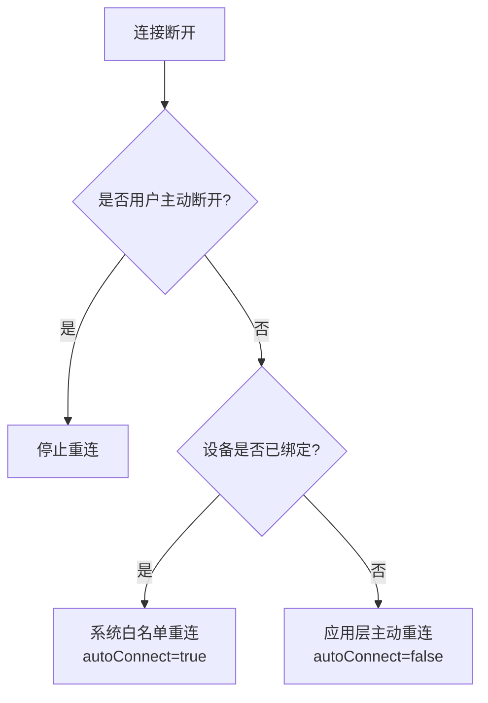

# 09 | 连接稳定性与重连机制设计

> 学完这篇，你能设计一套在真实世界中稳健运行的重连策略：区分"意外断线"和"用户主动断开"，用指数退避避免重连风暴，并理解连接参数对链路稳定性的影响。

---

## 一、结论先行

BLE 连接在真实环境中随时可能断开：用户走出范围、电梯信号屏蔽、外设电量低、手机系统杀后台……**重连不是"要不要做"的问题，而是"怎么做才不生硬"的问题**。

好的重连机制要满足三个条件：

1. **区分意图**：用户点"断开"就不应该自动重连；射频丢包导致的断线才需要重连
2. **有节制**：连续失败时不应无限重试，避免耗电和系统资源耗尽
3. **有感知**：重连过程中给用户明确的 UI 反馈，避免"为什么没反应"的困惑

---

## 二、断线原因码全景解析

`onConnectionStateChange` 的 `status` 参数是设计重连策略的核心依据。

| 状态码（Hex） | 常量名 | 含义 | 是否应触发重连 |
|---|---|---|---|
| 0x00 | `GATT_SUCCESS` | 操作成功 | — |
| 0x08 | `GATT_CONN_TIMEOUT` | 连接超时（设备超出范围或关机） | ✅ 是 |
| 0x13 | `GATT_CONN_TERMINATE_PEER_USER` | 对端主动断开 | ⚠️ 视场景 |
| 0x16 | `GATT_CONN_TERMINATE_LOCAL_HOST` | 本端主动断开 | ❌ 否 |
| 0x22 | `GATT_CONN_LMP_TIMEOUT` | 链路层管理协议超时 | ✅ 是 |
| 0x3E | `GATT_CONN_FAIL_ESTABLISH` | 连接建立失败 | ✅ 是 |
| 0x85 | `GATT_ERROR` (133) | 通用错误 | ✅ 是（延迟重试） |

**关键洞察**：`status` 反映的是**链路层操作的返回值**，不是连接状态的语义描述。例如对端主动断开时 status 可能是 0x13，也可能是 0x08（对端没优雅断开，射频直接消失）。

---

## 三、重连策略设计

### 3.1 两种重连路径



### 3.2 系统白名单重连（已绑定设备）

对于已经 `BOND_BONDED` 的设备，Android 系统会在底层维护一个白名单。使用 `autoConnect = true` 时，系统会在以下时机自动重连：

- 蓝牙重新开启后
- 设备重新进入范围并广播后
- 系统蓝牙服务重启后

**优点**：省电，不需要 App 后台保活。

**缺点**：
- 重连时机不可控（取决于外设广播间隔）
- 部分国产 ROM 白名单数量有限制（4~8 个）
- 如果外设使用可解析私有地址（RPA），地址轮换后白名单失效

### 3.3 应用层主动重连（通用方案）

对于未绑定设备，或需要快速重连的场景，由业务层控制重连逻辑。

```kotlin
class ReconnectStrategy {
    private var retryCount = 0
    private val maxRetries = 5
    private val baseDelayMs = 500L
    private val maxDelayMs = 30_000L
    private var isUserDisconnected = false
    private val handler = Handler(Looper.getMainLooper())

    fun onDisconnected(status: Int, onReconnect: () -> Unit) {
        if (isUserDisconnected) return

        val shouldReconnect = when (status) {
            BluetoothGatt.GATT_SUCCESS -> false  // 正常断开，通常是用户操作
            0x13 -> false  // 对端主动断开，不盲目重连
            0x16 -> false  // 本端主动断开
            else -> true
        }

        if (!shouldReconnect || retryCount >= maxRetries) {
            return
        }

        val delay = calculateDelay()
        retryCount++

        handler.postDelayed({
            onReconnect()
        }, delay)
    }

    private fun calculateDelay(): Long {
        // 指数退避：500ms, 1s, 2s, 4s, 8s... 上限 30s
        val delay = baseDelayMs * (1 shl retryCount.coerceAtMost(6))
        return delay.coerceAtMost(maxDelayMs)
    }

    fun markUserDisconnected() {
        isUserDisconnected = true
        retryCount = 0
        handler.removeCallbacksAndMessages(null)
    }

    fun reset() {
        isUserDisconnected = false
        retryCount = 0
    }
}
```

**代码意图解读**：

- **指数退避**：第一次 500ms 后重试，第二次 1s，第三次 2s……避免失败时疯狂重连导致手机发烫、外设拒绝服务。
- **上限保护**：最多 5 次重试，单次延迟上限 30 秒。超过后放弃，上报用户"连接失败，请检查设备"。
- **`markUserDisconnected`**：用户点击"断开"时调用，彻底关闭自动重连。这是用户体验的分水岭——如果用户明明点了断开，App 还在偷偷重连，会被骂"流氓"。

---

## 四、连接参数对稳定性的影响

### 4.1 连接参数三要素

BLE 连接建立后，双方以固定间隔交换数据，这个间隔由三个参数决定：

| 参数 | 范围 | 说明 |
|---|---|---|
| **Connection Interval** | 7.5 ~ 4000 ms | 连接事件间隔，直接影响吞吐量和功耗 |
| **Slave Latency** | 0 ~ 499 | 从设备可跳过的连接事件数，省电关键 |
| **Supervision Timeout** | 100 ~ 32000 ms | 多久没收到对方就认为断开 |

**关系**：`Supervision Timeout > (1 + Slave Latency) * Connection Interval * 2`

### 4.2 Android 的请求接口

```kotlin
// 三档预设
requestConnectionPriority(CONNECTION_PRIORITY_HIGH)      // 11.25~15ms
requestConnectionPriority(CONNECTION_PRIORITY_BALANCED)  // 30~50ms
requestConnectionPriority(CONNECTION_PRIORITY_LOW_POWER) // 100~125ms
```

**注意**：这只是"请求"，外设可以不采纳。实际参数由外设决定。

### 4.3 稳定性调优建议

| 场景 | 建议 |
|---|---|
| 频繁断线（射频环境差） | 请求 HIGH 模式，缩短 Connection Interval，让链路更"敏感" |
| 外设电量低 | 请求 LOW_POWER 模式，降低对端射频负担 |
| 大数据传输（OTA） | 先 HIGH 传数据，完成后切回 BALANCED |
| 连接后很快超时断开 | 检查 Supervision Timeout 是否设置过小 |

---

## 五、Android 实例：带状态机的连接管理器

```kotlin
sealed class ConnectionState {
    object Disconnected : ConnectionState()
    object Connecting : ConnectionState()
    object Connected : ConnectionState()
    object Disconnecting : ConnectionState()
    data class Reconnecting(val attempt: Int, val nextRetryMs: Long) : ConnectionState()
}

class StableBleConnectionManager(
    private val context: Context,
    private val device: BluetoothDevice
) {
    private var gatt: BluetoothGatt? = null
    private var currentState: ConnectionState = ConnectionState.Disconnected
    private val reconnectStrategy = ReconnectStrategy()
    private val mainHandler = Handler(Looper.getMainLooper())

    private val callback = object : BluetoothGattCallback() {
        override fun onConnectionStateChange(gatt: BluetoothGatt, status: Int, newState: Int) {
            when (newState) {
                BluetoothProfile.STATE_CONNECTED -> {
                    currentState = ConnectionState.Connected
                    reconnectStrategy.reset()
                    gatt.discoverServices()
                }
                BluetoothProfile.STATE_DISCONNECTED -> {
                    gatt.close()
                    this@StableBleConnectionManager.gatt = null
                    currentState = ConnectionState.Disconnected
                    reconnectStrategy.onDisconnected(status) { connect() }
                }
            }
        }

        override fun onServicesDiscovered(gatt: BluetoothGatt, status: Int) {
            if (status == BluetoothGatt.GATT_SUCCESS) {
                // 协商 MTU，提升稳定性
                gatt.requestMtu(517)
            }
        }
    }

    fun connect() {
        if (currentState is ConnectionState.Connecting ||
            currentState is ConnectionState.Connected) return

        currentState = ConnectionState.Connecting
        gatt = device.connectGatt(context, false, callback, BluetoothDevice.TRANSPORT_LE)
    }

    fun disconnect(userInitiated: Boolean = false) {
        if (userInitiated) {
            reconnectStrategy.markUserDisconnected()
        }
        currentState = ConnectionState.Disconnecting
        gatt?.disconnect()
    }
}
```

**代码意图解读**：

- **状态机封装**：用 `sealed class` 明确定义所有可能状态，避免"连上了但还在重连"的竞态。
- **用户意图透传**：`disconnect(userInitiated = true)` 明确区分用户操作和异常断线，用户主动断开后不再自动重连。
- **重连策略解耦**：`ReconnectStrategy` 独立管理重试次数和退避逻辑，连接管理器只负责 GATT 操作。

---

## 六、边界认知

### 1. `autoConnect = true` 不是万能药

很多教程推荐断线后用 `autoConnect = true` 做重连。问题在于：

- 首次使用 `autoConnect = true` 连接时，如果设备当前不广播，可能几分钟都没反应，用户体验极差
- 部分国产 ROM 对后台白名单管理严格，`autoConnect` 在 App 被杀后失效

**推荐方案**：首次连接用 `false`，断线后的重连先用 `false` 快速试一次，失败后再用 `true` 兜底。

### 2. 重连时不要复用旧的 `BluetoothGatt`

每次重连必须重新调用 `connectGatt`，拿到新的 `BluetoothGatt` 对象。复用旧对象轻则连接失败，重则 Native Crash。

### 3. 系统蓝牙开关的影响

如果用户在重连过程中关闭了系统蓝牙：

- `connectGatt` 可能返回 null
- 已发出的连接请求不会回调 `onConnectionStateChange`
- 必须监听 `BluetoothAdapter.ACTION_STATE_CHANGED`，蓝牙关闭时立即停止重连

### 4. 多设备连接的重连复杂度

如果有多个已连接设备同时断线，指数退避的延迟会叠加，导致所有设备都在争抢蓝牙射频资源。**多设备场景建议用统一的重连调度器**，按优先级排队重连，而不是每个设备各自为政。

### 5. Android 14 的后台限制

Android 14 对后台蓝牙连接有更严格的限制。如果 App 不在前台，重连可能直接失败。需要在后台重连时启动前台服务（Foreground Service），类型声明为 `connectedDevice`。

---

## 七、质量自检

- [x] 能区分哪些断线状态码应该触发重连、哪些不应该吗？
- [x] 指数退避的策略有没有上限保护？
- [x] 用户主动断开和异常断线是否被明确区分？
- [x] `autoConnect = true` 的优缺点说清了吗？
- [x] 重连时是否每次都创建新的 `BluetoothGatt`？
- [x] 系统蓝牙关闭时，重连机制会停止吗？
- [x] 多设备同时断线的重连冲突有应对方案吗？
