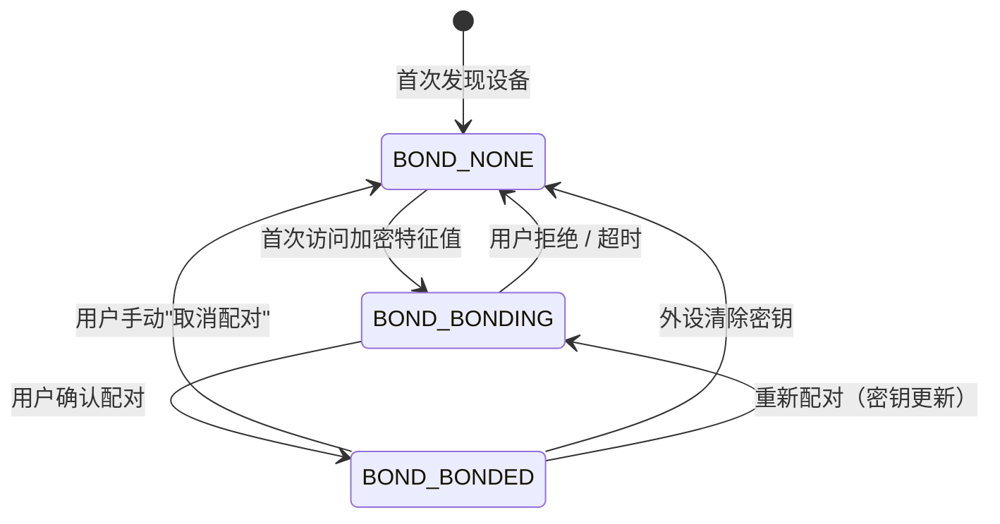

# 10 | 蓝牙配对与 Bond 状态管理

> 学完这篇，你能区分"配对"和"连接"的本质差异，理解 BLE 的三种安全配对模式，并处理 Bond 信息丢失、配对弹窗干扰等真实世界的兼容性问题。

---

## 一、结论先行

**配对（Pairing）≠ 连接（Connection）**。

- **连接**：射频层面的链路握手，完成后可以收发数据，但不加密
- **配对**：在连接的基础上交换密钥，建立长期信任关系，后续通信加密且免弹窗

**Bond 是配对成功的持久化结果**：密钥被保存在手机的蓝牙数据库和外设的存储器中，下次连接时自动认证，不需要用户再次确认。

在 BLE 中，配对不是必须的。如果你传输的数据不敏感（如公开的环境温度），完全可以不配对直接通信。但如果你要传用户隐私数据（如健康数据、门锁密码），**配对 + 加密是底线**。

---

## 二、BLE 安全配对模式

BLE 从 4.2 起引入了 LE Secure Connections，大幅提升了安全性。Android 支持两种配对机制：

| 机制 | 引入版本 | 加密强度 | 特点 |
|---|---|---|---|
| **LE Legacy Pairing** | BLE 4.0 | 较弱（TK 可能为 0） | 兼容性好，支持旧设备 |
| **LE Secure Connections** | BLE 4.2 | 强（ECDH 椭圆曲线） | 使用公钥加密，抗中间人攻击 |

### 2.1 三种配对方式（按用户交互强度排序）

| 方式 | 用户看到什么 | 安全性 | 适用场景 |
|---|---|---|---|
| **Just Works** | 无弹窗，静默配对 | 低（无 MITM 保护） | 手环、耳机等无输入输出能力的设备 |
| **Passkey Entry** | 6 位数字确认框 | 中 | 一方有屏幕（如手机），另一方无输入 |
| **Numeric Comparison** | 6 位数字 + "是否一致"按钮 | 高 | 双方都有屏幕（如手机连手表） |

**生活类比**：

- Just Works = 你进小区，保安看了你一眼就直接开门（信任但无验证）
- Passkey Entry = 保安问你"业主码是多少？"你报出 6 位数字
- Numeric Comparison = 你手机上显示 123456，手表上也显示 123456，你点"确认一致"

### 2.2 Android 中如何触发配对

配对不是通过某个 API 显式触发的，而是在**首次加密通信时自动触发**：

1. 外设的 Characteristic 设置了 `PERMISSION_READ_ENCRYPTED` 或 `PERMISSION_WRITE_ENCRYPTED`
2. App 尝试读写该 Characteristic
3. Android 发现没有 Bond 记录，自动弹出配对对话框
4. 用户确认后，完成配对，密钥存入系统数据库

```kotlin
// 读取需要加密的特征值，自动触发配对流程
gatt.readCharacteristic(encryptedCharacteristic)
```

---

## 三、Bond 生命周期管理

### 3.1 Bond 状态查询

```kotlin
val bondState = device.bondState

when (bondState) {
    BluetoothDevice.BOND_NONE -> "未配对"
    BluetoothDevice.BOND_BONDING -> "配对中..."
    BluetoothDevice.BOND_BONDED -> "已配对"
}
```

### 3.2 Bond 状态流转图



### 3.3 监听 Bond 状态变化

```kotlin
val bondReceiver = object : BroadcastReceiver() {
    override fun onReceive(context: Context, intent: Intent) {
        val device = intent.getParcelableExtra<BluetoothDevice>(BluetoothDevice.EXTRA_DEVICE)
        val state = intent.getIntExtra(BluetoothDevice.EXTRA_BOND_STATE, -1)
        val prevState = intent.getIntExtra(BluetoothDevice.EXTRA_PREVIOUS_BOND_STATE, -1)

        Log.i("BLE", "Bond 状态变化: ${device?.address} $prevState -> $state")
    }
}

context.registerReceiver(
    bondReceiver,
    IntentFilter(BluetoothDevice.ACTION_BOND_STATE_CHANGED)
)
```

---

## 四、Android 实例：安全读写与配对引导

**场景**：你的手环有一个加密特征值存储心率数据。首次连接时自动触发配对，你需要监听配对状态并引导用户。

```kotlin
class SecureBleSession(private val context: Context, private val gatt: BluetoothGatt) {

    fun readSensitiveData(characteristic: BluetoothGattCharacteristic) {
        if (characteristic.permissions and BluetoothGattCharacteristic.PERMISSION_READ_ENCRYPTED != 0) {
            // 需要加密的特征值
            if (gatt.device.bondState != BluetoothDevice.BOND_BONDED) {
                // 首次访问，系统会自动弹出配对框
                // 部分国产 ROM 不弹框，需要引导用户去系统设置手动配对
                showPairingGuide()
            }
        }
        gatt.readCharacteristic(characteristic)
    }

    private fun showPairingGuide() {
        Toast.makeText(
            context,
            "首次使用需要配对，请在系统弹窗中确认",
            Toast.LENGTH_LONG
        ).show()
    }
}
```

---

## 五、Bond 丢失与兼容性问题

### 5.1 手机端 Bond 丢失

用户在系统设置中点击了"取消配对"，或清除了 App 数据，手机的密钥被删除。下次连接时：

- 外设还记着旧的密钥
- 手机没有密钥
- 连接后尝试加密通信，认证失败，外设主动断开

**解决方案**：检测到连接后立即断开（因为认证失败），然后重新触发配对流程。部分情况下需要**先删除外设端的 Bond 信息**（通过特定指令让外设清除配对记录），再重新配对。

### 5.2 外设端 Bond 丢失

外设恢复出厂设置或固件升级后清除了密钥。手机端还记着旧的 Bond，导致：

- 手机连接后使用旧密钥加密
- 外设不认识这个密钥，回复认证失败
- 连接断开

**解决方案**：Android 没有公开 API 删除单个设备的 Bond 记录。需要用反射：

```kotlin
fun removeBond(device: BluetoothDevice): Boolean {
    return try {
        val method = device.javaClass.getMethod("removeBond")
        method.invoke(device) as Boolean
    } catch (e: Exception) {
        Log.e("BLE", "反射删除 Bond 失败", e)
        false
    }
}
```

**注意**：`removeBond` 是 `@hide` API，未来可能被限制。调用前应先检查 `Build.VERSION.SDK_INT`，并做好失败兜底。

### 5.3 国产 ROM 的配对弹窗问题

| 厂商 | 问题 | 解决方案 |
|---|---|---|
| 小米 | MIUI 可能不弹配对框，直接后台拒绝 | 引导用户去系统蓝牙设置手动配对 |
| 华为 | 部分机型配对框在后台不显示 | 确保配对时 App 在前台 |
| Oppo/Vivo | 弹窗样式不统一，用户容易误点取消 | 在 UI 上提前说明"请点击配对" |
| 三星 | 旧版 OneUI 配对后 Bond 状态更新延迟 | 延迟 1~2 秒后查询 bondState |

---

## 六、配对 vs 加密 vs 签名

| 概念 | 作用 | 在 BLE 中如何体现 |
|---|---|---|
| **配对** | 交换密钥，建立信任 | Bond 记录 |
| **加密** | 防止数据被窃听 | `PERMISSION_READ_ENCRYPTED` |
| **认证** | 确认对方身份 | 配对后的自动密钥验证 |
| **签名** | 防止数据被篡改 | BLE 不支持原生签名，需应用层做 CRC/HMAC |

**关键认知**：BLE 的加密只保证"第三方看不懂"，不保证"数据没被篡改"。如果你传输关键控制指令（如解锁门锁），应在应用层增加消息认证码（HMAC-SHA256）。

---

## 七、边界认知

### 1. 不要主动调用 `createBond()`

Android 提供了 `BluetoothDevice.createBond()` API，但**不建议主动调用**。原因：

- 调用时机难以把握，可能在连接还没建立时就触发，导致状态混乱
- 系统在你首次访问加密特征值时会自动触发配对，时机更准确
- 部分厂商 ROM 对 `createBond()` 做了限制，调用无效

### 2. Bond 和地址类型（Public vs Random）

BLE 设备地址有两种类型：

- **Public Address**：全球唯一，固定不变
- **Random Address**：每次上电变化，分 Static/Private/Resolvable 三种

如果外设使用 Resolvable Private Address（RPA），手机需要保存 IRK（Identity Resolving Key）来解析地址。Bond 信息丢失后，即使你知道 MAC 地址，也解析不出正确的设备。

### 3. 配对失败后的状态恢复

配对过程中（`BOND_BONDING`），如果用户取消或超时：

- 设备状态回退到 `BOND_NONE`
- 但部分外设的协议栈可能卡在"等待配对完成"状态，需要断电重启
- 你的 App 应该提示用户"如果配对失败，请重启设备后重试"

### 4. Android 12+ 的蓝牙权限和 Bond

Android 12 引入了 `BLUETOOTH_CONNECT` 权限，但它**不控制 Bond 操作**。Bond 状态查询和监听不需要额外权限，但删除 Bond（反射）和访问加密特征值需要 `BLUETOOTH_CONNECT`。

---

## 八、质量自检

- [x] 能清楚区分"连接"和"配对"吗？
- [x] 知道 BLE 的三种配对方式及适用场景吗？
- [x] Bond 状态流转图能自己画出来吗？
- [x] 知道 Bond 丢失（手机端/外设端）的表现和解决方案吗？
- [x] 知道为什么 Android 没有公开 API 删除 Bond，以及反射方案的局限性吗？
- [x] BLE 加密不防篡改，这个认知有吗？
- [x] 知道为什么不建议主动调用 `createBond()` 吗？
