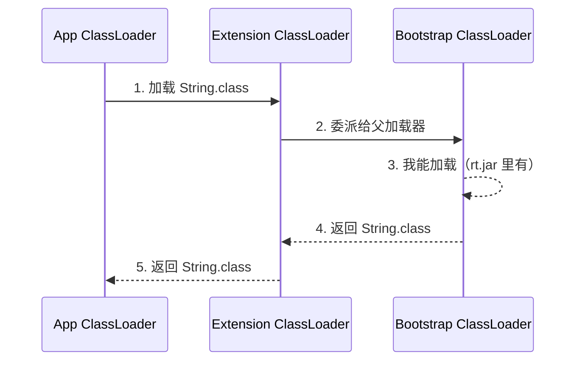
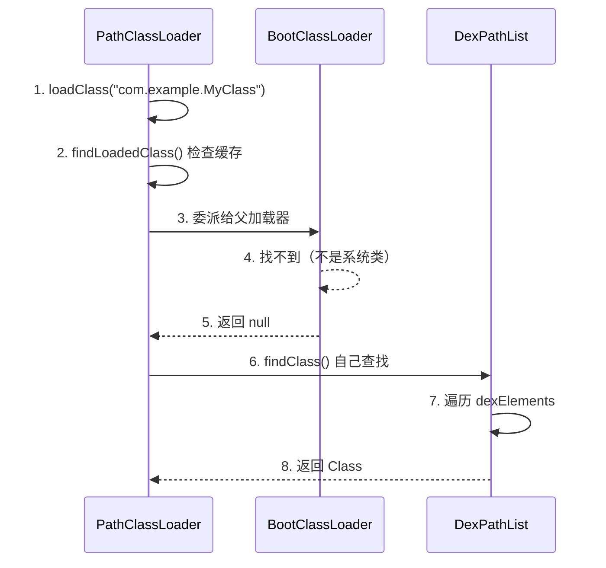

# ClassLoader 基础篇

> 从 JVM 到 Android，彻底搞懂类是怎么被加载的

## 一、技术演进：为什么需要类加载机制？

### 编译型 vs 解释型语言

在理解类加载之前，先想一个问题：**C/C++ 的程序为什么不需要类加载？**

```
C/C++ 编译流程：
源代码 → 编译 → 机器码（.exe/.so）→ 直接运行

Java/Kotlin 编译流程：
源代码 → 编译 → 字节码（.class/.dex）→ 虚拟机解释执行
```

C/C++ 直接编译成机器码，CPU 能直接执行。而 Java 编译出来的是「字节码」，需要虚拟机来「翻译」执行。

**类加载就是把字节码加载到虚拟机内存，让虚拟机能够执行的过程。**

### 类加载的价值

| 特性 | 说明 |
|-----|------|
| **跨平台** | 字节码一次编写，到处运行（JVM 负责适配不同平台） |
| **动态加载** | 运行时才加载需要的类，节省内存 |
| **热更新** | 可以动态替换类，实现热修复 |
| **隔离性** | 不同 ClassLoader 加载的类互相隔离 |

## 二、JVM 类加载基础

### 2.1 类的生命周期


**前五个阶段合称「类加载过程」**，其中最核心的是：

| 阶段 | 做什么 | 通俗理解 |
|-----|-------|---------|
| **加载** | 找到 .class 文件，读到内存 | 把书从书架上拿下来 |
| **验证** | 检查字节码格式是否正确 | 检查书是不是正版 |
| **准备** | 为静态变量分配内存，设置默认值 | 准备好书桌和笔记本 |
| **解析** | 把符号引用转为直接引用 | 把目录页码转为实际页码 |
| **初始化** | 执行静态代码块，赋予初始值 | 翻开书开始阅读 |

### 2.2 JVM 的 ClassLoader 体系

```
                    ┌─────────────────────┐
                    │ Bootstrap ClassLoader│  ← 加载 rt.jar（Java 核心类）
                    │   （C++ 实现）        │
                    └──────────┬──────────┘
                               │
                    ┌──────────▼──────────┐
                    │ Extension ClassLoader│  ← 加载 ext 目录的扩展类
                    │   （Java 实现）       │
                    └──────────┬──────────┘
                               │
                    ┌──────────▼──────────┐
                    │   App ClassLoader    │  ← 加载 classpath 的应用类
                    │   （Java 实现）       │
                    └──────────┬──────────┘
                               │
                    ┌──────────▼──────────┐
                    │  Custom ClassLoader  │  ← 自定义类加载器
                    └─────────────────────┘
```

**为什么要分这么多层？**

就像公司的组织架构：
- Bootstrap = CEO：负责最核心的事务
- Extension = VP：负责扩展业务
- App = 普通员工：负责日常工作
- Custom = 外包：负责特殊任务

**各司其职，互不干扰。**

### 2.3 双亲委派机制

**核心规则**：收到加载请求时，先让父加载器尝试加载，父加载器搞不定，自己再加载。



**代码实现**（伪代码，便于理解）：

```kotlin
// ClassLoader.loadClass() 的核心逻辑
fun loadClass(name: String): Class<*> {
    // 1. 检查是否已加载
    var clazz = findLoadedClass(name)
    if (clazz != null) return clazz

    // 2. 委派给父加载器（双亲委派的核心）
    if (parent != null) {
        clazz = parent.loadClass(name)
    } else {
        clazz = findBootstrapClass(name)
    }

    // 3. 父加载器加载失败，自己加载
    if (clazz == null) {
        clazz = findClass(name)  // 由子类实现
    }

    return clazz
}
```

### 2.4 为什么要双亲委派？

| 原因 | 说明 |
|-----|------|
| **安全性** | 防止核心类被篡改。你自己写个 `java.lang.String`，也加载不了，因为 Bootstrap 会先加载真正的 String |
| **避免重复** | 同一个类只会被加载一次，节省内存 |
| **层次清晰** | 核心类由核心加载器加载，职责分明 |

**生活类比**：

你要买个 iPhone，先问你爸有没有。你爸说没有，再问你爷爷。爷爷也没有，那你自己去买。

这样的好处是：如果爷爷家有祖传的 iPhone（核心类），就不用自己买了，保证用的是「正品」。

## 三、Android 的 ClassLoader 体系

### 3.1 和 JVM 的核心区别

| 对比项 | JVM | Android |
|-------|-----|---------|
| **字节码格式** | .class | .dex |
| **虚拟机** | JVM | Dalvik/ART |
| **核心加载器** | Bootstrap/Extension/App | BootClassLoader/PathClassLoader/DexClassLoader |
| **优化方向** | 面向服务器，注重吞吐量 | 面向移动端，注重内存和电量 |

**为什么 Android 要用 dex 而不是 class？**

- **体积更小**：多个 .class 合并成一个 .dex，去除冗余信息
- **加载更快**：一次 IO 加载所有类，而不是每个类一次 IO
- **内存优化**：dex 格式更紧凑，字符串池共享

### 3.2 Android ClassLoader 全景图

```
                    ┌─────────────────────┐
                    │   BootClassLoader   │  ← 加载 Android 核心类（framework.jar）
                    │   （Java 实现）      │
                    └──────────┬──────────┘
                               │
          ┌────────────────────┼────────────────────┐
          │                    │                    │
┌─────────▼─────────┐ ┌───────▼────────┐ ┌────────▼────────┐
│  PathClassLoader  │ │ DexClassLoader │ │InMemoryDexClassLoader│
│  （加载已安装 App）│ │（加载外部 dex） │ │ （内存加载 dex）  │
└───────────────────┘ └────────────────┘ └─────────────────┘
```

### 3.3 核心 ClassLoader 详解

#### BootClassLoader

```kotlin
// 不是 public 的，应用代码访问不到
// 负责加载 Android Framework 的核心类
class BootClassLoader : ClassLoader(null) {
    // parent 为 null，是最顶层的加载器
}
```

**加载内容**：`Activity`、`Service`、`View` 等 Android 核心类

#### PathClassLoader

```kotlin
// 专门用来加载已安装应用的类
// optimizedDirectory 参数已废弃（API 26+）
class PathClassLoader(
    dexPath: String,        // dex 文件路径
    librarySearchPath: String?, // so 库搜索路径
    parent: ClassLoader?    // 父加载器
) : BaseDexClassLoader(dexPath, null, librarySearchPath, parent)
```

**特点**：
- 用于加载**已安装 App** 的 dex
- Android 系统为每个 App 创建一个 PathClassLoader
- **不能**加载未安装的 dex（API 26 之前的限制）

#### DexClassLoader

```kotlin
// 可以加载任意路径的 dex/apk/jar
class DexClassLoader(
    dexPath: String,            // dex 文件路径
    optimizedDirectory: String?, // 优化后的 dex 存放目录（已废弃）
    librarySearchPath: String?, // so 库路径
    parent: ClassLoader?
) : BaseDexClassLoader(dexPath, optimizedDirectory, librarySearchPath, parent)
```

**特点**：
- 可以加载**任意位置**的 dex 文件
- 热修复和插件化的核心
- API 26+ 和 PathClassLoader 已经没有本质区别

#### PathClassLoader vs DexClassLoader

| 对比项 | PathClassLoader | DexClassLoader |
|-------|-----------------|----------------|
| 用途 | 加载已安装 App | 加载外部 dex |
| 使用场景 | 系统自动创建 | 热修复/插件化 |
| API 26 前 | 不能指定 optimizedDirectory | 可以指定 |
| API 26 后 | 两者几乎无区别 | 两者几乎无区别 |

> **注意**：从 Android 8.0（API 26）开始，`optimizedDirectory` 参数被废弃，两者的区别已经消失。

### 3.4 BaseDexClassLoader 的核心结构

不管是 PathClassLoader 还是 DexClassLoader，都继承自 `BaseDexClassLoader`，核心逻辑都在这里：

```kotlin
class BaseDexClassLoader(
    dexPath: String,
    optimizedDirectory: File?,
    librarySearchPath: String?,
    parent: ClassLoader?
) : ClassLoader(parent) {

    // 核心成员：DexPathList
    private val pathList: DexPathList

    init {
        pathList = DexPathList(this, dexPath, librarySearchPath, optimizedDirectory)
    }

    override fun findClass(name: String): Class<*> {
        // 委托给 DexPathList 查找
        return pathList.findClass(name, suppressedExceptions)
            ?: throw ClassNotFoundException(name)
    }
}
```

**DexPathList 内部结构**：

```kotlin
class DexPathList {
    // 核心！存放所有 dex 文件的数组
    private val dexElements: Array<Element>

    fun findClass(name: String): Class<*>? {
        // 遍历 dexElements，按顺序查找
        for (element in dexElements) {
            val clazz = element.findClass(name)
            if (clazz != null) {
                return clazz  // 找到就返回，不再继续
            }
        }
        return null
    }
}
```

**这就是热修复的关键！**

```
dexElements 数组：
[dex1, dex2, dex3, ...]
  ↑
  第一个找到的类被使用

热修复：把补丁 dex 插入到数组最前面
[patch_dex, dex1, dex2, dex3, ...]
     ↑
     补丁中的类优先被加载
```

## 四、双亲委派在 Android 中的应用

### 4.1 验证双亲委派

```kotlin
fun printClassLoaderChain() {
    var classLoader: ClassLoader? = javaClass.classLoader
    while (classLoader != null) {
        Log.d("ClassLoader", classLoader.toString())
        classLoader = classLoader.parent
    }
    Log.d("ClassLoader", "Bootstrap ClassLoader (null)")
}

// 输出示例：
// dalvik.system.PathClassLoader[DexPathList[...]]
// java.lang.BootClassLoader@xxxxxxx
// Bootstrap ClassLoader (null)
```

### 4.2 类加载过程可视化



## 五、常见问题解答

### Q1: 为什么 Android 用 dex 不用 class？

**答**：
1. **体积更小**：dex 合并多个 class，共享字符串池
2. **加载更快**：一次 IO 读取，而不是每个类单独 IO
3. **内存优化**：dex 格式针对移动端优化

### Q2: 同一个类被两个 ClassLoader 加载会怎样？

**答**：会被当成**两个不同的类**，即使类名相同！

```kotlin
val class1 = classLoader1.loadClass("com.example.User")
val class2 = classLoader2.loadClass("com.example.User")

// class1 != class2，是两个不同的 Class 对象
// class1 的实例不能赋值给 class2 类型的变量
```

**类的唯一性 = ClassLoader + 类全名**

这也是插件化的一个坑点：插件和宿主用不同 ClassLoader，可能导致类型转换异常。

### Q3: 能不能打破双亲委派？

**答**：可以，重写 `loadClass()` 方法就行。

但一般不建议，除非你明确知道自己在做什么（比如 Tomcat 的 WebAppClassLoader）。

```kotlin
// 打破双亲委派的示例（不推荐）
class CustomClassLoader : ClassLoader() {
    override fun loadClass(name: String): Class<*> {
        // 不委派给父加载器，自己直接加载
        return findClass(name)
    }
}
```

### Q4: 类什么时候会被加载？

**答**：**延迟加载**（Lazy Loading），只有在真正需要时才加载。

触发类加载的时机：
1. `new` 一个对象
2. 访问静态字段或方法
3. 反射调用（`Class.forName()`）
4. 子类被加载时，父类先加载
5. JVM 启动时的主类

## 六、面试检验

### Q1: Android 的 ClassLoader 和 JVM 有什么区别？

**答**：

| 区别 | JVM | Android |
|-----|-----|---------|
| 字节码格式 | .class | .dex |
| 核心加载器 | Bootstrap/Extension/App | BootClassLoader/PathClassLoader |
| 优化方向 | 服务器性能 | 移动端省电省内存 |

Android 使用 dex 格式是因为：体积更小、加载更快、内存更省。

### Q2: 双亲委派机制是什么？为什么要这样设计？

**答**：

**机制**：收到类加载请求时，先委派给父加载器，父加载器处理不了再自己加载。

**设计目的**：
1. **安全性**：防止核心类被篡改
2. **避免重复**：同一个类只加载一次
3. **层次清晰**：职责分明

**举例**：自己写个 `java.lang.String` 也不会被加载，因为 BootClassLoader 会先加载系统的 String。

### Q3: PathClassLoader 和 DexClassLoader 有什么区别？

**答**：

**API 26 之前**：
- PathClassLoader：只能加载已安装 App 的 dex
- DexClassLoader：可以指定 optimizedDirectory，加载任意 dex

**API 26 之后**：几乎没有区别，optimizedDirectory 参数已废弃。

**实际使用**：
- 系统用 PathClassLoader 加载 App
- 热修复/插件化用 DexClassLoader 加载外部 dex

### Q4: ClassLoader 的双亲委派能被打破吗？举例说明。

**答**：可以，重写 `loadClass()` 方法即可。

**打破双亲委派的场景**：
1. **Tomcat**：每个 Web 应用有独立的 ClassLoader，可以加载不同版本的同名类
2. **JDBC SPI**：核心类需要加载第三方驱动，用线程上下文 ClassLoader
3. **热修复**：需要优先加载补丁类

### Q5: 什么是类的唯一性？

**答**：**类的唯一性 = ClassLoader + 类全限定名**

同一个类被不同的 ClassLoader 加载，会产生两个不同的 Class 对象，它们之间不能互相转换。

**实际影响**：插件化中，插件和宿主的类可能因为 ClassLoader 不同而导致类型转换失败。

---
_本文档将持续更新，添加更多相关内容_
