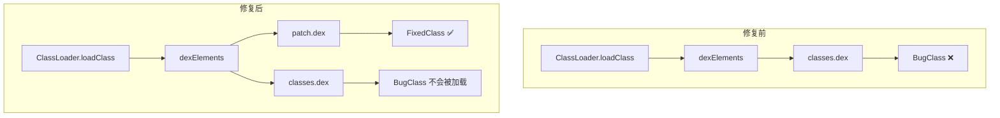
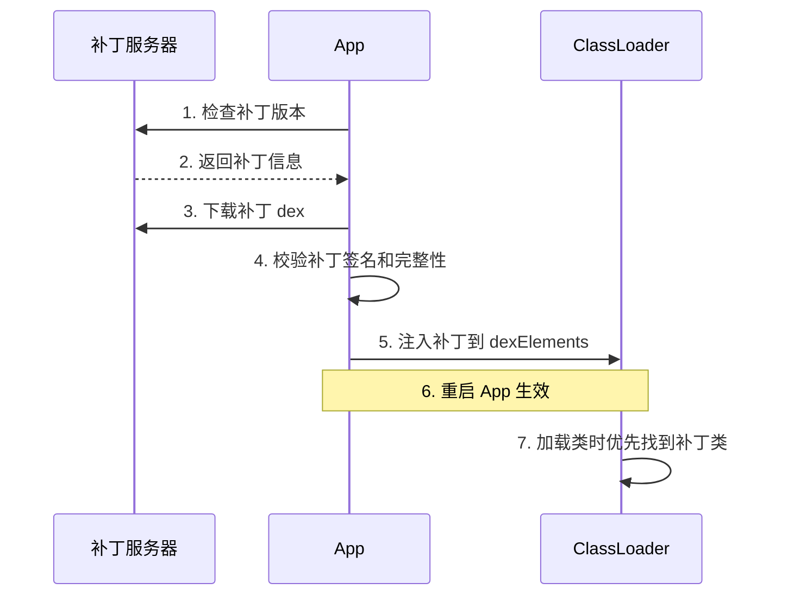
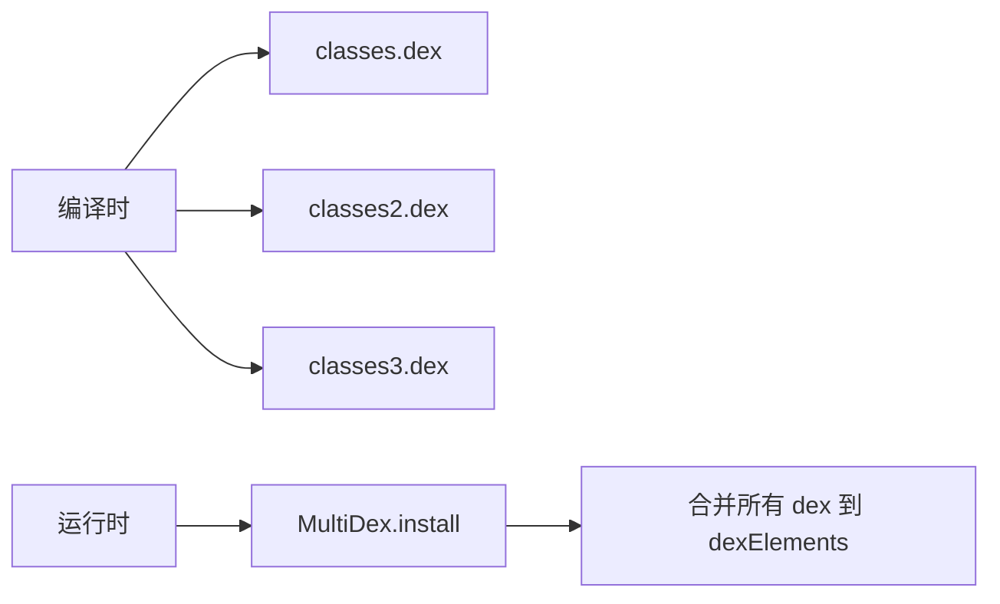

# ClassLoader 进阶篇

> 从原理到实战，玩转热修复和插件化

## 一、自定义 ClassLoader

### 1.1 为什么要自定义？

系统的 PathClassLoader 和 DexClassLoader 能满足大部分需求，但这些场景需要自定义：

| 场景 | 原因 |
|-----|------|
| 热修复 | 需要控制 dex 加载顺序 |
| 插件化 | 需要加载未安装的 APK |
| 加固 | 需要解密后再加载 |
| 隔离 | 需要类隔离，避免冲突 |

### 1.2 自定义 ClassLoader 基础

```kotlin
/**
 * 自定义 ClassLoader 模板
 * 继承 ClassLoader 或 BaseDexClassLoader
 */
class MyClassLoader(
    private val dexPath: String,
    parent: ClassLoader?
) : ClassLoader(parent) {
    
    // 核心方法：查找类
    override fun findClass(name: String): Class<*> {
        // 1. 从自定义位置读取 dex/class 数据
        val classData = loadClassData(name)
        
        // 2. 定义类（将字节数组转为 Class 对象）
        return defineClass(name, classData, 0, classData.size)
    }
    
    private fun loadClassData(name: String): ByteArray {
        // 实现类数据的读取逻辑
        // 比如：从加密文件解密、从网络下载等
        TODO("加载类的字节数据")
    }
}
```

> **注意**：Android 中不能直接用 `defineClass()` 加载 .class 文件，必须使用 dex 格式。实际开发中应该继承 `BaseDexClassLoader`。

### 1.3 实际可用的自定义 ClassLoader

```kotlin
/**
 * 实际可用的自定义 ClassLoader
 * 通过反射修改 dexElements 实现
 */
class HotFixClassLoader(
    private val patchDexPath: String,
    private val context: Context
) {
    
    /**
     * 将补丁 dex 插入到 dexElements 最前面
     */
    fun injectPatchDex() {
        try {
            // 1. 获取当前应用的 ClassLoader
            val appClassLoader = context.classLoader as BaseDexClassLoader
            
            // 2. 创建补丁的 ClassLoader
            val patchClassLoader = DexClassLoader(
                patchDexPath,
                context.cacheDir.absolutePath,
                null,
                appClassLoader.parent
            )
            
            // 3. 获取两者的 dexElements
            val appDexElements = getDexElements(appClassLoader)
            val patchDexElements = getDexElements(patchClassLoader)
            
            // 4. 合并：补丁在前，原始在后
            val mergedElements = mergeDexElements(patchDexElements, appDexElements)
            
            // 5. 设置回去
            setDexElements(appClassLoader, mergedElements)
            
            Log.d("HotFix", "补丁注入成功！")
        } catch (e: Exception) {
            Log.e("HotFix", "补丁注入失败: ${e.message}")
        }
    }
    
    /**
     * 通过反射获取 dexElements
     */
    private fun getDexElements(classLoader: BaseDexClassLoader): Array<Any> {
        // 1. 获取 pathList 字段
        val pathListField = BaseDexClassLoader::class.java
            .getDeclaredField("pathList")
            .apply { isAccessible = true }
        val pathList = pathListField.get(classLoader)
        
        // 2. 获取 dexElements 字段
        val dexElementsField = pathList.javaClass
            .getDeclaredField("dexElements")
            .apply { isAccessible = true }
        
        @Suppress("UNCHECKED_CAST")
        return dexElementsField.get(pathList) as Array<Any>
    }
    
    /**
     * 合并两个 dexElements 数组
     */
    private fun mergeDexElements(
        patch: Array<Any>,
        original: Array<Any>
    ): Array<Any> {
        val merged = java.lang.reflect.Array.newInstance(
            patch.javaClass.componentType!!,
            patch.size + original.size
        ) as Array<Any>
        
        System.arraycopy(patch, 0, merged, 0, patch.size)
        System.arraycopy(original, 0, merged, patch.size, original.size)
        
        return merged
    }
    
    /**
     * 设置 dexElements
     */
    private fun setDexElements(classLoader: BaseDexClassLoader, elements: Array<Any>) {
        val pathListField = BaseDexClassLoader::class.java
            .getDeclaredField("pathList")
            .apply { isAccessible = true }
        val pathList = pathListField.get(classLoader)
        
        val dexElementsField = pathList.javaClass
            .getDeclaredField("dexElements")
            .apply { isAccessible = true }
        
        dexElementsField.set(pathList, elements)
    }
}
```

**使用方式**：

```kotlin
// 在 Application.onCreate() 中调用
class MyApplication : Application() {
    override fun onCreate() {
        super.onCreate()
        
        // 检查是否有补丁
        val patchFile = File(filesDir, "patch.dex")
        if (patchFile.exists()) {
            HotFixClassLoader(patchFile.absolutePath, this).injectPatchDex()
        }
    }
}
```

## 二、热修复类加载方案详解

### 2.1 方案原理图



### 2.2 完整热修复流程



### 2.3 CLASS_ISPREVERIFIED 问题

这是类加载方案必须解决的经典问题。

**问题背景**：

Dalvik 虚拟机有个优化：如果一个类的所有引用都在同一个 dex 中，就会给这个类打上 `CLASS_ISPREVERIFIED` 标记。

**问题现象**：

```kotlin
// 假设 BugClass 和 HelperClass 都在 classes.dex 中
// BugClass 被标记为 CLASS_ISPREVERIFIED

class BugClass {
    fun doSomething() {
        HelperClass.help()  // 引用了 HelperClass
    }
}

// 热修复时，BugClass 被移到 patch.dex
// 但 HelperClass 还在 classes.dex 中
// → 运行时报错：IllegalAccessError
```

**解决方案**：编译时插桩，阻止 CLASS_ISPREVERIFIED

```kotlin
// QZone 方案：在每个类的构造函数中插入一个对其他 dex 类的引用
class BugClass {
    init {
        // 编译时自动插入，引用一个放在单独 dex 中的 AntiLazyLoad 类
        val _ = AntiLazyLoad::class.java
    }
    
    fun doSomething() {
        HelperClass.help()
    }
}

// AntiLazyLoad 单独放在一个 hack.dex 中
// 这样所有类都不会被打上 CLASS_ISPREVERIFIED 标记
```

**各方案的处理方式**：

| 方案 | 处理方式 |
|-----|---------|
| QZone | 编译时插入 hack.dex 引用 |
| Tinker | dex 差量合并，生成新的完整 dex |
| Robust | 不涉及这个问题（方法级替换） |

> **注意**：ART 虚拟机已经没有 CLASS_ISPREVERIFIED 问题，但 Dalvik 仍然存在。

## 三、插件化类加载方案

### 3.1 插件化面临的类加载问题

插件化比热修复更复杂，因为要加载**全新的类和资源**：

| 问题 | 说明 |
|-----|------|
| 类找不到 | 插件中的类不在宿主的 ClassLoader 中 |
| 资源找不到 | 插件的资源不在宿主的 Resources 中 |
| 四大组件 | 插件的 Activity/Service 没有在 Manifest 注册 |

### 3.2 类加载的两种方案

#### 方案一：合并 dexElements（单 ClassLoader）

```kotlin
/**
 * 将插件 dex 合并到宿主 ClassLoader
 * 优点：简单，类可以互相访问
 * 缺点：可能有类冲突
 */
fun mergePluginClassLoader(context: Context, pluginPath: String) {
    val hostClassLoader = context.classLoader as BaseDexClassLoader
    
    // 创建插件 ClassLoader
    val pluginClassLoader = DexClassLoader(
        pluginPath,
        context.cacheDir.absolutePath,
        null,
        hostClassLoader.parent
    )
    
    // 合并 dexElements
    val hostElements = getDexElements(hostClassLoader)
    val pluginElements = getDexElements(pluginClassLoader)
    val mergedElements = mergeArrays(hostElements, pluginElements)
    
    setDexElements(hostClassLoader, mergedElements)
}
```

#### 方案二：独立 ClassLoader（多 ClassLoader）

```kotlin
/**
 * 每个插件使用独立的 ClassLoader
 * 优点：隔离性好，不会类冲突
 * 缺点：插件和宿主类不能直接互相访问
 */
class PluginManager {
    // 插件 ClassLoader 缓存
    private val pluginLoaders = mutableMapOf<String, ClassLoader>()
    
    fun loadPlugin(pluginPath: String): ClassLoader {
        return pluginLoaders.getOrPut(pluginPath) {
            DexClassLoader(
                pluginPath,
                getCacheDir().absolutePath,
                getLibDir().absolutePath,  // so 库路径
                getHostClassLoader()
            )
        }
    }
    
    fun loadPluginClass(pluginPath: String, className: String): Class<*> {
        return loadPlugin(pluginPath).loadClass(className)
    }
}
```

### 3.3 两种方案对比

| 对比项 | 单 ClassLoader | 多 ClassLoader |
|-------|---------------|----------------|
| 实现复杂度 | 简单 | 复杂 |
| 类隔离性 | 差，可能冲突 | 好，完全隔离 |
| 插件间通信 | 直接调用 | 需要接口/反射 |
| 代表框架 | Small | RePlugin, VirtualApk |

### 3.4 委托父加载器的陷阱

```kotlin
// 问题场景：插件和宿主都依赖了不同版本的 Gson

// 宿主：Gson 2.8.0
// 插件：Gson 2.10.0（新增了某个方法）

// 如果插件 ClassLoader 的 parent 是宿主 ClassLoader
// 双亲委派会导致：插件用的是宿主的 Gson 2.8.0
// → 调用新方法时 NoSuchMethodError！

// 解决：打破双亲委派，先加载插件自己的类
class PluginClassLoader(
    dexPath: String,
    optimizedDirectory: String,
    librarySearchPath: String?,
    parent: ClassLoader?
) : DexClassLoader(dexPath, optimizedDirectory, librarySearchPath, parent) {
    
    override fun loadClass(name: String, resolve: Boolean): Class<*> {
        // 先尝试自己加载
        var clazz = findLoadedClass(name)
        if (clazz == null) {
            try {
                // 先自己找，不委派给父加载器
                clazz = findClass(name)
            } catch (e: ClassNotFoundException) {
                // 自己找不到，再委派给父加载器
                clazz = parent?.loadClass(name)
            }
        }
        return clazz ?: throw ClassNotFoundException(name)
    }
}
```

## 四、MultiDex 原理

### 4.1 65535 问题是什么？

**问题背景**：单个 dex 文件的方法数不能超过 65535（2^16 - 1）。

**原因**：dex 文件格式中，方法索引用 16 位 short 存储，最大值就是 65535。

**现象**：
```
Error: Cannot fit requested classes in a single dex file
(# methods: 72346 > 65536)
```

### 4.2 MultiDex 工作原理



**核心代码**（简化版）：

```kotlin
// MultiDex.install() 的核心逻辑
object MultiDex {
    fun install(context: Context) {
        // 1. 获取应用的 ClassLoader
        val classLoader = context.classLoader as BaseDexClassLoader
        
        // 2. 获取所有的 secondary dex 文件
        val secondaryDexFiles = getSecondaryDexFiles(context)
        
        // 3. 将 secondary dex 加入 dexElements
        installSecondaryDexes(classLoader, secondaryDexFiles)
    }
    
    private fun installSecondaryDexes(
        loader: BaseDexClassLoader,
        dexFiles: List<File>
    ) {
        // 获取当前的 dexElements
        val pathList = getPathList(loader)
        val oldElements = getDexElements(pathList)
        
        // 为 secondary dex 创建新的 Elements
        val newElements = makeDexElements(dexFiles)
        
        // 合并：原始 + secondary
        val mergedElements = mergeArrays(oldElements, newElements)
        
        // 设置回去
        setDexElements(pathList, mergedElements)
    }
}
```

### 4.3 MultiDex 的性能问题

| 问题 | 原因 | 解决方案 |
|-----|------|---------|
| 首次启动慢 | 需要解压和优化 secondary dex | 子线程异步加载 |
| ANR | 主线程等待 dex 加载 | 使用启动优化 |
| 内存占用大 | 多个 dex 都要加载 | 延迟加载非核心 dex |

### 4.4 Android 5.0+ 还需要 MultiDex 吗？

**不太需要了！**

Android 5.0（API 21）开始，ART 虚拟机在安装时就会把所有 dex 合并编译成 OAT 文件，运行时直接加载 OAT。

```
Dalvik（4.x 及以下）：运行时需要 MultiDex 加载多个 dex
ART（5.0+）：安装时已合并，运行时不需要 MultiDex
```

**但是**：如果 `minSdkVersion < 21`，仍然需要 MultiDex。

## 五、实战：从零实现简易热修复

### 5.1 完整代码示例

```kotlin
/**
 * 简易热修复管理器
 * 演示类加载方案的核心原理
 */
class SimpleHotFix(private val context: Context) {
    
    companion object {
        private const val TAG = "SimpleHotFix"
        private const val PATCH_DIR = "hotfix"
    }
    
    /**
     * 检查并应用补丁
     * 应该在 Application.attachBaseContext() 中调用
     */
    fun checkAndApplyPatch() {
        val patchDir = File(context.filesDir, PATCH_DIR)
        if (!patchDir.exists()) {
            Log.d(TAG, "无补丁目录")
            return
        }
        
        // 查找所有补丁文件
        val patchFiles = patchDir.listFiles { file ->
            file.extension == "dex" || file.extension == "jar"
        } ?: return
        
        if (patchFiles.isEmpty()) {
            Log.d(TAG, "无补丁文件")
            return
        }
        
        // 按文件名排序（支持多个补丁的加载顺序）
        val sortedPatches = patchFiles.sortedBy { it.name }
        
        Log.d(TAG, "发现 ${sortedPatches.size} 个补丁文件")
        
        // 应用补丁
        applyPatches(sortedPatches)
    }
    
    /**
     * 应用补丁列表
     */
    private fun applyPatches(patchFiles: List<File>) {
        try {
            val classLoader = context.classLoader as BaseDexClassLoader
            
            // 获取原始的 dexElements
            val pathList = getPathList(classLoader)
            val originalElements = getDexElements(pathList)
            
            // 为每个补丁创建 Element
            val patchElementsList = mutableListOf<Array<Any>>()
            for (patchFile in patchFiles) {
                val patchElements = createPatchElements(patchFile)
                if (patchElements != null) {
                    patchElementsList.add(patchElements)
                }
            }
            
            if (patchElementsList.isEmpty()) {
                Log.w(TAG, "没有有效的补丁")
                return
            }
            
            // 合并所有补丁 + 原始（补丁在前）
            val allPatches = patchElementsList.reduce { acc, elements ->
                mergeArrays(acc, elements)
            }
            val finalElements = mergeArrays(allPatches, originalElements)
            
            // 设置回去
            setDexElements(pathList, finalElements)
            
            Log.d(TAG, "补丁应用成功！")
            
        } catch (e: Exception) {
            Log.e(TAG, "补丁应用失败: ${e.message}", e)
        }
    }
    
    /**
     * 为补丁文件创建 dexElements
     */
    private fun createPatchElements(patchFile: File): Array<Any>? {
        return try {
            // 创建临时目录存放优化后的 dex
            val optimizedDir = File(context.cacheDir, "patch_opt")
            if (!optimizedDir.exists()) {
                optimizedDir.mkdirs()
            }
            
            // 创建 DexClassLoader 加载补丁
            val patchLoader = DexClassLoader(
                patchFile.absolutePath,
                optimizedDir.absolutePath,
                null,
                context.classLoader.parent
            )
            
            // 获取补丁的 dexElements
            val pathList = getPathList(patchLoader)
            getDexElements(pathList)
            
        } catch (e: Exception) {
            Log.e(TAG, "创建补丁 Elements 失败: ${e.message}")
            null
        }
    }
    
    // ============ 反射工具方法 ============
    
    private fun getPathList(classLoader: BaseDexClassLoader): Any {
        val field = BaseDexClassLoader::class.java.getDeclaredField("pathList")
        field.isAccessible = true
        return field.get(classLoader)!!
    }
    
    private fun getDexElements(pathList: Any): Array<Any> {
        val field = pathList.javaClass.getDeclaredField("dexElements")
        field.isAccessible = true
        @Suppress("UNCHECKED_CAST")
        return field.get(pathList) as Array<Any>
    }
    
    private fun setDexElements(pathList: Any, elements: Array<Any>) {
        val field = pathList.javaClass.getDeclaredField("dexElements")
        field.isAccessible = true
        field.set(pathList, elements)
    }
    
    private fun mergeArrays(first: Array<Any>, second: Array<Any>): Array<Any> {
        val result = java.lang.reflect.Array.newInstance(
            first.javaClass.componentType!!,
            first.size + second.size
        ) as Array<Any>
        System.arraycopy(first, 0, result, 0, first.size)
        System.arraycopy(second, 0, result, first.size, second.size)
        return result
    }
}
```

### 5.2 使用方式

```kotlin
// Application 中使用
class MyApplication : Application() {
    
    override fun attachBaseContext(base: Context) {
        super.attachBaseContext(base)
        
        // 尽早应用补丁（在 MultiDex 之后）
        MultiDex.install(this)
        SimpleHotFix(this).checkAndApplyPatch()
    }
}
```

### 5.3 生成补丁的方式

```bash
# 1. 编译修复后的类
javac -source 1.8 -target 1.8 BugFix.java

# 2. 打包成 jar
jar cvf patch.jar BugFix.class

# 3. 转换成 dex
d8 patch.jar --output patch_out/

# 4. 将 classes.dex 重命名并推送到设备
mv patch_out/classes.dex patch.dex
adb push patch.dex /sdcard/patch.dex

# 5. App 中将补丁复制到应用目录
```

## 六、边界认知

### 6.1 类加载方案的局限性

| 局限 | 说明 |
|-----|------|
| 需要重启 | 已加载的类无法替换，需要重启 App |
| 新增类的限制 | 部分方案不支持新增类 |
| 反射限制 | Android 9+ 限制反射访问隐藏 API |
| 混淆问题 | 补丁和基准包必须用同一份 mapping |

### 6.2 什么场景不适合类加载方案？

1. **需要即时生效**：考虑底层替换方案（Robust）
2. **修复系统类**：几乎不可能
3. **修改 Native 层**：需要 SO 修复
4. **新增四大组件**：需要插件化方案

### 6.3 Android 版本适配问题

| Android 版本 | 问题 | 解决方案 |
|-------------|------|---------|
| 4.x (Dalvik) | CLASS_ISPREVERIFIED | 插桩阻止预校验 |
| 7.0+ | 新增 MixedDex 模式 | 适配新的 dex 格式 |
| 9.0+ | 限制反射隐藏 API | 使用 FreeReflection 等方案绕过 |
| 10+ | 更严格的反射限制 | 持续适配 |

## 七、面试检验

### Q1: 如何实现一个简单的热修复框架？

**答**：基于类加载方案，核心步骤：

1. **获取应用的 ClassLoader**（PathClassLoader）
2. **反射获取 dexElements 数组**
3. **创建补丁的 DexClassLoader，获取其 dexElements**
4. **合并数组，补丁在前，原始在后**
5. **反射设置回 ClassLoader**

**关键代码**：
```kotlin
// 获取 dexElements
val pathList = BaseDexClassLoader::class.java
    .getDeclaredField("pathList").apply { isAccessible = true }
    .get(classLoader)
val dexElements = pathList.javaClass
    .getDeclaredField("dexElements").apply { isAccessible = true }
    .get(pathList)
```

### Q2: CLASS_ISPREVERIFIED 问题是什么？怎么解决？

**答**：

**问题**：Dalvik 虚拟机会对类做预校验。如果一个类的所有引用都在同一个 dex 中，会打上 CLASS_ISPREVERIFIED 标记。热修复时，被标记的类引用其他 dex 的类会报 IllegalAccessError。

**解决方案**：
1. **QZone 方案**：编译时在每个类中插入对另一个 dex 中类的引用，阻止预校验
2. **Tinker 方案**：dex 差量合并，生成完整的新 dex，不存在跨 dex 引用

### Q3: 插件化中类加载有哪两种方案？各有什么优缺点？

**答**：

| 方案 | 实现 | 优点 | 缺点 |
|-----|------|------|------|
| 单 ClassLoader | 合并插件 dex 到宿主 | 简单，类互相可见 | 可能类冲突 |
| 多 ClassLoader | 每个插件独立 ClassLoader | 隔离好，无冲突 | 复杂，需要接口通信 |

**选择建议**：
- 插件简单、信任度高 → 单 ClassLoader
- 插件复杂、需要隔离 → 多 ClassLoader

### Q4: MultiDex 的原理是什么？为什么会有 65535 问题？

**答**：

**65535 问题原因**：dex 文件格式中，方法索引用 16 位存储，最大 65535。

**MultiDex 原理**：
1. 编译时将类分散到多个 dex（classes.dex, classes2.dex...）
2. 运行时通过反射将所有 secondary dex 合并到 dexElements

**Android 5.0+ 的变化**：ART 虚拟机安装时合并所有 dex，运行时不需要 MultiDex 处理。

### Q5: 为什么热修复需要在 attachBaseContext 中尽早执行？

**答**：

1. **类只加载一次**：一旦类被加载，就不会再重新加载
2. **尽早注入**：在应用的任何代码执行前注入补丁，确保使用补丁中的类
3. **时机选择**：attachBaseContext 是 Application 最早的回调，此时大部分业务类还未加载

```kotlin
override fun attachBaseContext(base: Context) {
    super.attachBaseContext(base)
    // 先 MultiDex（如果需要）
    MultiDex.install(this)
    // 再热修复
    HotFix.install(this)
    // 此时业务代码还未执行，补丁可以生效
}
```

---
_本文档将持续更新，添加更多相关内容_
