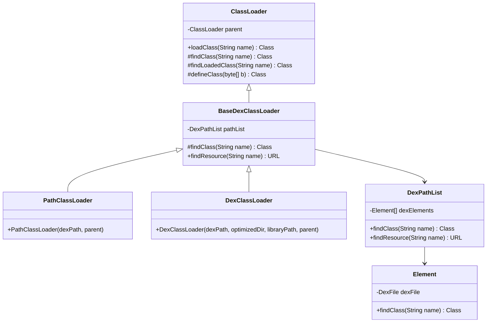
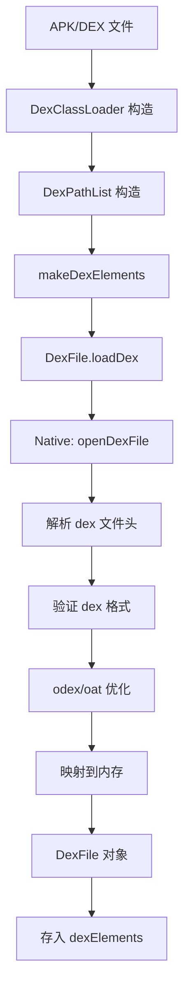
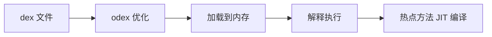
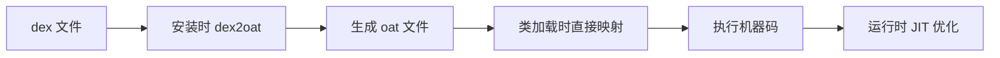
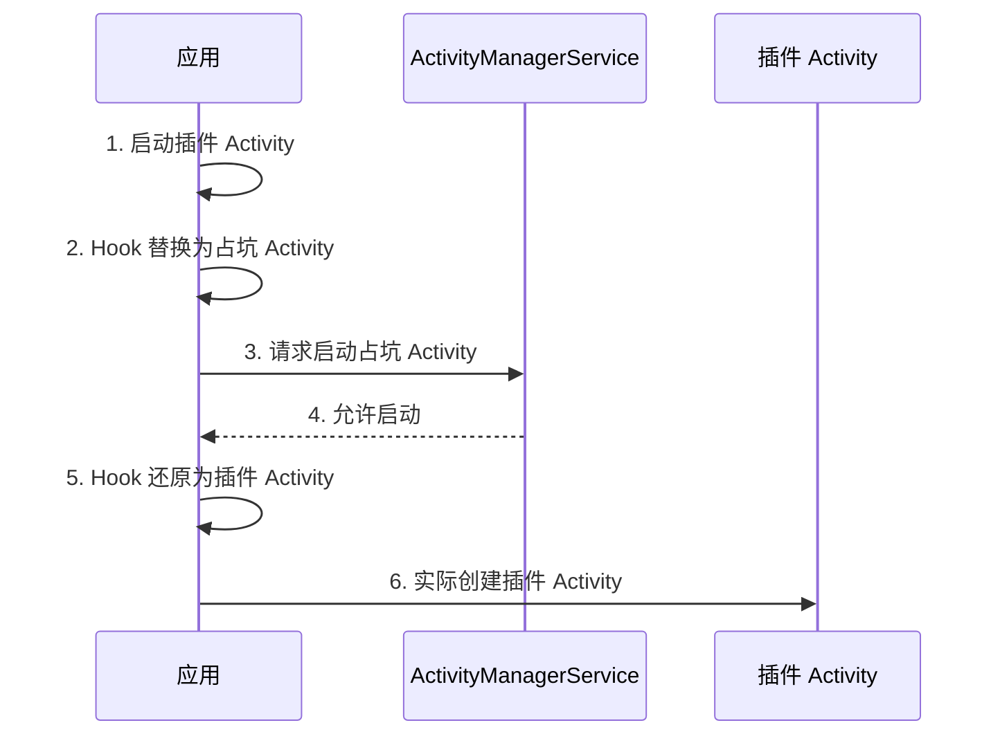

# ClassLoader 源码篇

> 深入虚拟机，理解类加载的设计哲学

## 一、ClassLoader 源码分析

### 1.1 核心类关系图



### 1.2 ClassLoader.loadClass() 源码

**一句话总结**：双亲委派的实现，先找缓存，再委派父加载器，最后自己加载。

```java
// java.lang.ClassLoader
protected Class<?> loadClass(String name, boolean resolve) throws ClassNotFoundException {
    // 1. 检查是否已经加载过（缓存）
    Class<?> c = findLoadedClass(name);
    
    if (c == null) {
        try {
            // 2. 委派给父加载器（双亲委派核心）
            if (parent != null) {
                c = parent.loadClass(name, false);
            } else {
                // parent 为 null，说明到顶了，尝试 BootClassLoader
                c = findBootstrapClassOrNull(name);
            }
        } catch (ClassNotFoundException e) {
            // 父加载器抛异常，说明找不到，继续
        }

        // 3. 父加载器找不到，自己找
        if (c == null) {
            c = findClass(name);  // 由子类实现
        }
    }
    
    // resolve 参数在 Android 中不使用
    return c;
}
```

**设计亮点**：

| 设计 | 说明 |
|-----|------|
| 模板方法模式 | `loadClass()` 定义算法骨架，`findClass()` 由子类实现 |
| 缓存机制 | `findLoadedClass()` 避免重复加载 |
| 递归委派 | 自然实现了双亲委派链 |

### 1.3 BaseDexClassLoader.findClass() 源码

**一句话总结**：委托给 DexPathList，遍历 dexElements 查找类。

```java
// dalvik.system.BaseDexClassLoader
@Override
protected Class<?> findClass(String name) throws ClassNotFoundException {
    // 1. 准备异常收集列表
    List<Throwable> suppressedExceptions = new ArrayList<>();
    
    // 2. 委托给 pathList 查找（核心！）
    Class c = pathList.findClass(name, suppressedExceptions);
    
    // 3. 找不到抛异常
    if (c == null) {
        ClassNotFoundException cnfe = new ClassNotFoundException(
            "Didn't find class \"" + name + "\" on path: " + pathList);
        for (Throwable t : suppressedExceptions) {
            cnfe.addSuppressed(t);
        }
        throw cnfe;
    }
    
    return c;
}
```

### 1.4 DexPathList.findClass() 源码

**一句话总结**：遍历 dexElements 数组，找到第一个匹配的类就返回。

```java
// dalvik.system.DexPathList
public Class<?> findClass(String name, List<Throwable> suppressed) {
    // 遍历所有的 Element（每个 Element 对应一个 dex）
    for (Element element : dexElements) {
        // 尝试在当前 dex 中查找
        Class<?> clazz = element.findClass(name, definingContext, suppressed);
        if (clazz != null) {
            return clazz;  // 找到就返回，不继续找了！
        }
    }
    return null;
}
```

**这就是热修复的关键！**

```
dexElements = [dex1, dex2, dex3]

查找 BugClass：
1. 在 dex1 中找 → 没找到
2. 在 dex2 中找 → 找到了！返回
3. dex3 不会被访问

热修复后：
dexElements = [patch_dex, dex1, dex2, dex3]

查找 BugClass：
1. 在 patch_dex 中找 → 找到了！返回修复后的类
2. 后面的 dex 不会被访问
```

### 1.5 DexPathList 构造过程

```java
// dalvik.system.DexPathList 构造函数（简化版）
public DexPathList(ClassLoader definingContext, String dexPath,
        String librarySearchPath, File optimizedDirectory) {
    
    // 1. 解析 dex 路径（可以是多个，用 : 分隔）
    List<File> files = splitDexPath(dexPath);
    
    // 2. 为每个 dex 创建 Element
    this.dexElements = makeDexElements(files, optimizedDirectory, suppressedExceptions);
    
    // 3. 解析 native 库路径
    this.nativeLibraryPathElements = makePathElements(librarySearchPath);
}

private static Element[] makeDexElements(List<File> files, File optimizedDirectory,
        List<IOException> suppressedExceptions) {
    
    List<Element> elements = new ArrayList<>();
    
    for (File file : files) {
        if (file.isDirectory()) {
            // 目录：查找其中的 class 文件（仅用于测试）
            elements.add(new Element(file));
            
        } else if (file.isFile()) {
            String name = file.getName();
            
            DexFile dex = null;
            if (name.endsWith(".dex")) {
                // 直接加载 dex 文件
                dex = loadDexFile(file, optimizedDirectory);
                
            } else {
                // zip/jar/apk：解压后加载其中的 dex
                dex = loadDexFile(file, optimizedDirectory);
            }
            
            if (dex != null) {
                elements.add(new Element(dex, file));
            }
        }
    }
    
    return elements.toArray(new Element[0]);
}
```

## 二、dex 加载流程

### 2.1 从文件到内存的完整流程



### 2.2 DexFile 加载过程

```java
// dalvik.system.DexFile
public static DexFile loadDex(String sourcePathName, String outputPathName, int flags) 
        throws IOException {
    
    // 1. 检查输出目录权限
    // 2. 调用 native 方法打开 dex
    return new DexFile(sourcePathName, outputPathName, flags);
}

private DexFile(String sourceName, String outputName, int flags) throws IOException {
    // native 层打开 dex 文件
    mCookie = openDexFile(sourceName, outputName, flags);
    mFileName = sourceName;
}

// native 方法声明
private static native Object openDexFile(String sourceName, String outputName, int flags);
```

### 2.3 类查找过程

```java
// dalvik.system.DexFile
public Class loadClassBinaryName(String name, ClassLoader loader, List<Throwable> suppressed) {
    // 调用 native 方法在 dex 中查找类
    return defineClassNative(name, loader, mCookie, this);
}

// native 方法：在 dex 文件中查找并定义类
private static native Class defineClassNative(String name, ClassLoader loader, 
        Object cookie, DexFile dexFile);
```

**Native 层做的事**：

```
1. 在 dex 文件的类定义表中查找类名
2. 找到后，读取类的字节码
3. 验证类格式
4. 创建 Class 对象
5. 初始化类的静态成员
6. 返回 Class 对象
```

## 三、Dalvik vs ART 的类加载差异

### 3.1 核心差异对比

| 对比项 | Dalvik | ART |
|-------|--------|-----|
| 执行方式 | JIT (即时编译) | AOT (预编译) + JIT |
| dex 优化时机 | 运行时优化成 odex | 安装时编译成 oat |
| 启动速度 | 首次较慢 | 首次快（已编译） |
| CLASS_ISPREVERIFIED | 有这个问题 | 无此问题 |
| 类加载 | 每次需要解释执行 | 直接执行机器码 |

### 3.2 类加载流程差异

**Dalvik 类加载**：



**ART 类加载**：



### 3.3 Android 7.0+ 的 MixedDex

Android 7.0 引入了混合编译模式：

```
安装时：不做完整编译，快速安装
运行时：JIT 编译 + Profile 收集
空闲时：基于 Profile 做 AOT 编译
再次运行：使用优化后的代码
```

**对热修复的影响**：需要适配新的编译模式，部分框架需要清除已编译的 oat 文件。

## 四、设计哲学与可借鉴之处

### 4.1 双亲委派的设计思想

**问题**：为什么不直接让每个 ClassLoader 自己加载？

**设计考量**：

| 考量 | 说明 |
|-----|------|
| 安全性 | 核心类由可信的加载器加载，无法被篡改 |
| 一致性 | 同一个类只会被加载一次，避免重复 |
| 隔离性 | 不同层次的类加载器职责明确 |

**可借鉴**：职责链模式的应用，每一层处理自己的职责，处理不了就委派上层。

### 4.2 dexElements 的数组设计

**问题**：为什么用数组而不是其他数据结构？

**设计考量**：

1. **顺序重要**：类加载需要确定的顺序（热修复依赖这个）
2. **查找高效**：线性查找虽然 O(n)，但 n 很小（通常就几个 dex）
3. **简单可靠**：数组是最简单的数据结构，不容易出错

**可借鉴**：有时候简单的设计就是最好的设计。

### 4.3 懒加载的设计

**问题**：为什么不在启动时加载所有类？

**设计考量**：

1. **内存优化**：只加载需要的类，节省内存
2. **启动速度**：不必等待所有类加载完成
3. **按需使用**：90% 的类可能从不被使用

```kotlin
// 懒加载示例
class LazyHolder {
    companion object {
        // 只有在第一次访问 instance 时才会加载 HeavyObject
        val instance: HeavyObject by lazy { HeavyObject() }
    }
}
```

### 4.4 缓存机制的设计

```java
// findLoadedClass() 实现原理
// 使用 native 层的 ClassTable 缓存已加载的类
native Class<?> findLoadedClass(String name);
```

**设计考量**：

1. **避免重复加载**：类只加载一次
2. **查找高效**：使用 HashTable 实现 O(1) 查找
3. **内存管理**：ClassLoader 被回收时，相关类也可回收

## 五、深度问题探讨

### 5.1 如果让你设计 ClassLoader，你会怎么做？

**需要考虑的问题**：

| 问题 | 考量 |
|-----|------|
| 加载来源 | 本地文件？网络？内存？ |
| 安全性 | 如何防止恶意类？ |
| 性能 | 如何优化加载速度？ |
| 隔离性 | 不同应用的类如何隔离？ |
| 热更新 | 如何支持类的动态替换？ |

**参考答案**：

```kotlin
class MyClassLoader(parent: ClassLoader?) : ClassLoader(parent) {
    
    // 1. 类缓存（避免重复加载）
    private val loadedClasses = ConcurrentHashMap<String, Class<*>>()
    
    // 2. 支持多种加载来源
    private val classSources = mutableListOf<ClassSource>()
    
    // 3. 安全校验器
    private val securityVerifier = SecurityVerifier()
    
    override fun loadClass(name: String): Class<*> {
        // 检查缓存
        loadedClasses[name]?.let { return it }
        
        // 安全检查
        securityVerifier.verify(name)
        
        // 委派父加载器（可选择是否打破双亲委派）
        parent?.let {
            try {
                return it.loadClass(name)
            } catch (e: ClassNotFoundException) {
                // 父加载器找不到，继续
            }
        }
        
        // 从各个来源查找
        for (source in classSources) {
            val classData = source.loadClass(name)
            if (classData != null) {
                val clazz = defineClass(name, classData)
                loadedClasses[name] = clazz
                return clazz
            }
        }
        
        throw ClassNotFoundException(name)
    }
}
```

### 5.2 热修复为什么不能修复已加载的类？

**根本原因**：JVM/ART 的类加载设计是**一次性的**。

```
类加载后：
1. Class 对象创建，存入方法区
2. 静态成员初始化
3. 类的引用被保存到各处

如果强行替换：
1. 已创建的对象怎么办？
2. 静态成员的状态怎么处理？
3. 其他类持有的引用怎么更新？
```

**这就是为什么**：
- 类加载方案需要重启 App
- 底层替换方案只能替换方法，不能替换类结构

### 5.3 插件化如何实现四大组件的动态加载？

类加载只解决了类的问题，四大组件还需要解决**注册问题**。

**Activity 的解决方案**（Hook AMS）：



**核心思路**：
1. Manifest 中预埋「占坑」Activity
2. 启动插件 Activity 时，欺骗系统启动占坑 Activity
3. 实际创建时，Hook 回插件 Activity

## 六、面试检验

### Q1: ClassLoader.loadClass() 的完整流程是怎样的？

**答**：

```
1. findLoadedClass() - 检查类是否已加载（缓存）
2. parent.loadClass() - 委派给父加载器（双亲委派）
3. findClass() - 父加载器找不到，自己加载
```

**源码关键点**：
- 模板方法模式：`loadClass()` 定义骨架，`findClass()` 由子类实现
- 递归实现双亲委派链
- 缓存机制避免重复加载

### Q2: Android 中 dex 是如何被加载到内存的？

**答**：

```
1. BaseDexClassLoader 构造时创建 DexPathList
2. DexPathList 调用 makeDexElements() 解析 dex 路径
3. 每个 dex 文件创建 DexFile 对象
4. DexFile 调用 native openDexFile() 加载到内存
5. Native 层解析 dex 格式，进行验证和优化
6. 最终存入 dexElements 数组
```

### Q3: 为什么热修复需要处理 CLASS_ISPREVERIFIED 问题？ART 上还有这个问题吗？

**答**：

**Dalvik 上**：
- 如果类的所有引用都在同一 dex，会打 CLASS_ISPREVERIFIED 标记
- 打标记的类引用其他 dex 的类会报 IllegalAccessError
- 解决：编译时插桩，引用其他 dex 的类

**ART 上**：
- 没有 CLASS_ISPREVERIFIED 问题
- ART 的类校验机制不同，允许跨 dex 引用

### Q4: Dalvik 和 ART 在类加载上有什么区别？

**答**：

| 对比 | Dalvik | ART |
|-----|--------|-----|
| 优化时机 | 运行时 odex | 安装时 oat |
| 执行方式 | 解释 + JIT | AOT + JIT |
| ISPREVERIFIED | 有 | 无 |
| 类加载速度 | 首次慢 | 首次快 |

### Q5: ClassLoader 的设计有什么可借鉴之处？

**答**：

1. **双亲委派**：职责链模式，每层处理各自职责
2. **懒加载**：按需加载，节省资源
3. **缓存机制**：避免重复操作
4. **模板方法**：定义骨架，子类实现细节
5. **简单设计**：数组遍历虽简单但可靠

**代码设计启示**：
- 安全性优先（不信任外部输入）
- 明确的职责划分
- 简单可靠比复杂高效更重要

---
_本文档将持续更新，添加更多相关内容_
