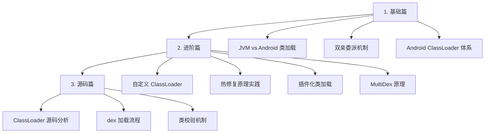

# ClassLoader 类加载机制

> 理解类加载，打通热修复和插件化的任督二脉

## 为什么要学类加载机制？

类加载机制是 Android 高级开发的**底层基石**：

| 技术方向 | 与类加载的关系 |
|---------|--------------|
| 热修复 | 修改 dexElements 加载顺序 |
| 插件化 | 自定义 ClassLoader 加载插件 |
| 加固脱壳 | 理解 dex 加载时机 |
| 性能优化 | 类加载耗时分析 |

**一句话**：不懂类加载，热修复和插件化就是「知其然不知其所以然」。

## 学习路线

## 文档结构

| 文档 | 适合人群 | 核心内容 |
|-----|---------|---------|
| [1-基础篇](1-基础篇.md) | 入门 | 类加载是什么、Android ClassLoader 体系、双亲委派 |
| [2-进阶篇](2-进阶篇.md) | 进阶 | 自定义 ClassLoader、热修复/插件化实践、MultiDex |
| [3-源码篇](3-源码篇.md) | 专家 | ClassLoader 源码、dex 加载流程、设计哲学 |

## 核心问题预览

### 基础篇必答题
1. Android 的 ClassLoader 和 JVM 的有什么区别？
2. 双亲委派机制是什么？为什么要这样设计？
3. PathClassLoader 和 DexClassLoader 有什么区别？

### 进阶篇高频题
4. 如何实现一个简单的热修复框架？
5. 插件化如何解决类找不到的问题？
6. MultiDex 的原理是什么？为什么会有 65535 方法数限制？

### 源码篇深度题
7. ClassLoader.loadClass() 的完整流程是怎样的？
8. dex 文件是如何被加载到内存的？
9. 为什么热修复需要处理 CLASS_ISPREVERIFIED 问题？

## 重要程度

| 场景 | 重要程度 | 原因 |
|-----|---------|------|
| 日常开发 | ⭐⭐ | 很少直接接触 |
| 热修复/插件化 | ⭐⭐⭐⭐⭐ | 核心原理 |
| 面试 | ⭐⭐⭐⭐ | Android 高级必问 |
| 性能优化 | ⭐⭐⭐ | 启动优化相关 |

---
_本文档将持续更新，添加更多相关内容_
