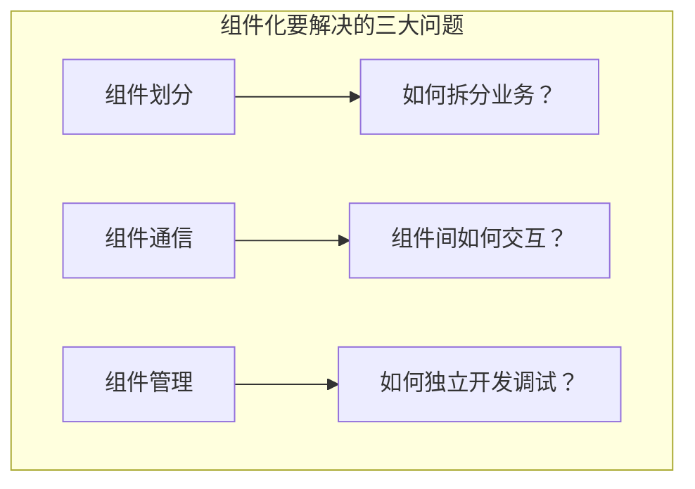
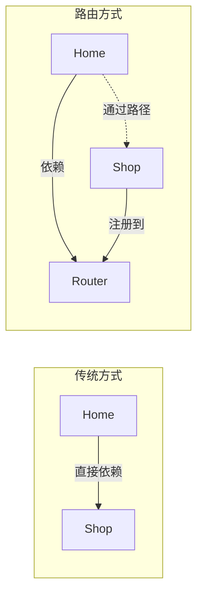

# 组件化基础篇

> 把大象装进冰箱分几步？第一步，把大象拆成零件

## 一、技术演进：组件化为什么会出现？

### 1.1 单体应用的困境

想象你在一家公司工作，公司就一个大办公室，所有人都在里面：

```
早期创业公司（10人）：
┌─────────────────────────────────┐
│  程序员 设计师 产品经理 测试 运维  │  ← 沟通方便，效率高
└─────────────────────────────────┘

公司发展壮大（100人）：
┌─────────────────────────────────┐
│  程序员×30 设计师×20 产品×20     │
│  测试×15 运维×10 HR×5 ...       │  ← 吵、乱、效率低
└─────────────────────────────────┘
```

公司大了怎么办？**划分部门**！技术部、设计部、产品部各自独立，通过会议沟通。

Android 项目也是一样的道理：

```
早期 App（5万行代码）：
┌─────────────────────────────────┐
│  一个大 Module，所有代码混在一起   │  ← 一个人能 hold 住
└─────────────────────────────────┘

App 发展壮大（50万行代码）：
┌─────────────────────────────────┐
│  首页、商城、消息、我的、支付...    │
│  各种功能代码全部耦合在一起        │  ← 编译慢、冲突多、难维护
└─────────────────────────────────┘
```

### 1.2 单体应用的具体痛点

**痛点一：编译时间爆炸**

```
代码量      编译时间
10万行  →   2分钟
30万行  →   5分钟  
50万行  →   10分钟+

改一行代码，等10分钟编译？程序员的噩梦！
```

**痛点二：代码耦合严重**

```kotlin
// 首页模块想跳转到商城详情页
// 直接依赖商城模块的类
val intent = Intent(this, ShopDetailActivity::class.java)
intent.putExtra("product_id", productId)
startActivity(intent)

// 问题：
// 1. 首页模块依赖了商城模块
// 2. 如果商城模块改了类名，首页模块也要改
// 3. 如果要下掉商城功能，首页模块代码也要大改
```

**痛点三：多团队协作地狱**

```
团队 A（首页）：我要改公共的 NetworkUtils
团队 B（商城）：我也要改，加个新方法
团队 C（消息）：你们都改了？我的代码被覆盖了！

→ 代码合并冲突
→ 功能互相影响
→ Bug 互相甩锅
```

**痛点四：无法独立开发测试**

```
首页团队：我只想跑首页功能，但要把整个 App 都编译一遍
商城团队：我想测商城功能，但依赖首页的数据
消息团队：我想单独测消息推送，但 Application 初始化太慢

→ 开发效率低下
→ 测试覆盖不全
→ Bug 定位困难
```

### 1.3 组件化的解决思路

组件化的核心思想：**把一个大 App 拆成多个独立的小 Module（组件）**

```
单体架构：
┌─────────────────────────────────┐
│              app                │
│  ┌─────┐ ┌─────┐ ┌─────┐       │
│  │首页  │ │商城  │ │消息  │ ...   │  ← 全部混在一起
│  └─────┘ └─────┘ └─────┘       │
└─────────────────────────────────┘

组件化架构：
┌─────────────────────────────────┐
│          app（壳工程）            │  ← 只负责组装，几乎没代码
└─────────────────────────────────┘
        ↓ 依赖
┌─────┐ ┌─────┐ ┌─────┐ ┌─────┐
│首页  │ │商城  │ │消息  │ │我的  │  ← 业务组件，互不依赖
└─────┘ └─────┘ └─────┘ └─────┘
        ↓ 依赖
┌─────────────────────────────────┐
│          公共基础组件             │  ← 网络、图片、工具类等
└─────────────────────────────────┘
```

### 1.4 组件化的收益

| 问题 | 解决方案 | 效果 |
|-----|---------|------|
| 编译慢 | 只编译改动的组件 | 10分钟 → 1-2分钟 |
| 代码耦合 | 组件间通过路由通信 | 改一处不影响其他 |
| 团队冲突 | 各团队负责独立组件 | 减少90%冲突 |
| 无法独立测试 | 组件可单独运行 | 开发效率提升50%+ |
| 代码复用难 | 公共组件统一管理 | 一处维护，处处使用 |

## 二、核心概念

### 2.1 术语解释

| 术语 | 解释 | 类比 |
|-----|------|------|
| **壳工程（App Shell）** | 最顶层的 Module，只负责组装各组件 | 汽车车架 |
| **业务组件（Feature）** | 独立的业务功能模块，如首页、商城 | 汽车引擎、轮子 |
| **基础组件（Base）** | 公共功能模块，如网络、图片加载 | 汽车的螺丝、线束 |
| **路由（Router）** | 组件间跳转和通信的桥梁 | 汽车的线路图 |
| **服务（Service）** | 组件对外暴露的能力接口 | 汽车的接口说明书 |

### 2.2 组件化的核心问题



**问题一：组件如何划分？**
- 按业务垂直拆分（首页、商城、消息）
- 按功能水平拆分（网络、图片、数据库）

**问题二：组件如何通信？**
- 业务组件之间不能直接依赖
- 需要通过路由、接口等方式通信

**问题三：组件如何管理？**
- 组件可以独立运行调试
- 组件版本统一管理

## 三、项目分层设计

### 3.1 标准四层架构

一个标准的组件化项目通常分为四层：

```
┌─────────────────────────────────────────────────┐
│                 第一层：壳工程                    │
│                    app                          │
│           （只负责组装，几乎没有代码）              │
└─────────────────────────────────────────────────┘
                        ↓
┌─────────────────────────────────────────────────┐
│                第二层：业务组件                   │
│  ┌────────┐ ┌────────┐ ┌────────┐ ┌────────┐  │
│  │ home   │ │ shop   │ │ message│ │  mine  │  │
│  │ 首页   │ │ 商城   │ │  消息  │ │  我的  │  │
│  └────────┘ └────────┘ └────────┘ └────────┘  │
│           （独立业务，可单独运行调试）              │
└─────────────────────────────────────────────────┘
                        ↓
┌─────────────────────────────────────────────────┐
│                第三层：功能组件                   │
│  ┌────────┐ ┌────────┐ ┌────────┐ ┌────────┐  │
│  │ share  │ │ pay    │ │ login  │ │ push   │  │
│  │ 分享   │ │ 支付   │ │  登录  │ │  推送  │  │
│  └────────┘ └────────┘ └────────┘ └────────┘  │
│           （通用功能，被多个业务组件依赖）           │
└─────────────────────────────────────────────────┘
                        ↓
┌─────────────────────────────────────────────────┐
│                第四层：基础组件                   │
│  ┌────────┐ ┌────────┐ ┌────────┐ ┌────────┐  │
│  │ network│ │ image  │ │ common │ │ router │  │
│  │ 网络库 │ │ 图片库 │ │ 工具类 │ │  路由  │  │
│  └────────┘ └────────┘ └────────┘ └────────┘  │
│           （底层基础能力，所有组件都可依赖）         │
└─────────────────────────────────────────────────┘
```

### 3.2 各层职责说明

| 层级 | 职责 | 示例 |
|-----|------|------|
| 壳工程 | 组装各组件，配置 Application | app |
| 业务组件 | 独立业务功能，可单独运行 | home、shop、message |
| 功能组件 | 通用业务功能，被业务组件复用 | login、pay、share |
| 基础组件 | 底层能力，与业务无关 | network、image、common |

### 3.3 依赖规则

**核心原则：上层可以依赖下层，下层不能依赖上层，同层之间不能直接依赖**

```kotlin
// ✅ 正确：业务组件依赖基础组件
// home/build.gradle.kts
dependencies {
    implementation(project(":lib_network"))
    implementation(project(":lib_common"))
}

// ❌ 错误：基础组件依赖业务组件
// lib_network/build.gradle.kts
dependencies {
    implementation(project(":home"))  // 禁止！
}

// ❌ 错误：业务组件之间直接依赖
// home/build.gradle.kts
dependencies {
    implementation(project(":shop"))  // 禁止！
}
```

### 3.4 实际项目结构示例

```
MyApp/
├── app/                          # 壳工程
│   ├── src/main/
│   │   ├── AndroidManifest.xml
│   │   └── java/.../
│   │       └── MyApplication.kt   # 初始化各组件
│   └── build.gradle.kts
│
├── module_home/                   # 首页业务组件
│   ├── src/main/
│   │   ├── AndroidManifest.xml
│   │   └── java/.../
│   │       ├── HomeActivity.kt
│   │       └── HomeFragment.kt
│   └── build.gradle.kts
│
├── module_shop/                   # 商城业务组件
│   ├── src/main/
│   │   └── ...
│   └── build.gradle.kts
│
├── lib_network/                   # 网络基础组件
│   ├── src/main/
│   │   └── java/.../
│   │       ├── NetworkManager.kt
│   │       └── HttpClient.kt
│   └── build.gradle.kts
│
├── lib_common/                    # 公共工具组件
│   ├── src/main/
│   │   └── java/.../
│   │       ├── BaseActivity.kt
│   │       └── Extensions.kt
│   └── build.gradle.kts
│
├── lib_router/                    # 路由组件
│   └── ...
│
├── settings.gradle.kts            # 声明所有 Module
└── build.gradle.kts               # 根配置
```

## 四、组件间通信

### 4.1 为什么不能直接依赖？

先看一个反面例子：

```kotlin
// ❌ 直接依赖的问题

// home 模块想跳转到 shop 模块的详情页
// 如果直接依赖 shop 模块：
val intent = Intent(this, ShopDetailActivity::class.java)  // 需要导入 shop 模块的类
startActivity(intent)

// 问题1：循环依赖
// home → shop → message → home？死循环！

// 问题2：耦合严重
// shop 模块改个类名，home 模块就编译不过

// 问题3：无法独立编译
// 编译 home 模块，必须先编译 shop 模块
```

### 4.2 组件通信的几种方式

| 方式 | 原理 | 适用场景 | 代表框架 |
|-----|------|---------|---------|
| **路由** | 通过 URL 跳转页面 | 页面跳转 | ARouter |
| **接口下沉** | 把接口放到公共层 | 获取数据/调用方法 | 手动实现 |
| **EventBus** | 发布订阅事件 | 跨组件事件通知 | EventBus |
| **服务发现** | SPI 机制 | 复杂的服务调用 | ARouter 服务 |

### 4.3 路由：页面跳转的标准方案

**核心思想**：不直接依赖目标类，而是通过一个"路径"来跳转。

```kotlin
// ❌ 传统方式：直接依赖
val intent = Intent(this, ShopDetailActivity::class.java)
startActivity(intent)

// ✅ 路由方式：通过路径跳转
ARouter.getInstance()
    .build("/shop/detail")  // 用路径代替类名
    .withString("product_id", "123")
    .navigation()
```

**为什么路由可以解决问题？**



### 4.4 接口下沉：获取其他组件数据

**场景**：首页需要获取用户信息，但用户信息在"我的"模块。

**解决方案**：把接口定义下沉到公共层。

```kotlin
// Step 1: 在公共层定义接口
// lib_common/src/.../service/IUserService.kt
interface IUserService {
    fun getUserInfo(): UserInfo
    fun isLogin(): Boolean
}

// Step 2: 在"我的"模块实现接口
// module_mine/src/.../UserServiceImpl.kt
@Route(path = "/mine/user_service")  // 用 ARouter 注册服务
class UserServiceImpl : IUserService {
    override fun getUserInfo(): UserInfo {
        return UserRepository.getUserInfo()
    }
    
    override fun isLogin(): Boolean {
        return UserRepository.isLogin()
    }
}

// Step 3: 在首页模块调用
// module_home/src/.../HomeActivity.kt
class HomeActivity : AppCompatActivity() {
    
    override fun onCreate(savedInstanceState: Bundle?) {
        super.onCreate(savedInstanceState)
        
        // 通过 ARouter 获取服务实现
        val userService = ARouter.getInstance()
            .navigation(IUserService::class.java)
        
        if (userService?.isLogin() == true) {
            val user = userService.getUserInfo()
            showUserInfo(user)
        }
    }
}
```

**依赖关系图**：

```
┌──────────────┐     ┌──────────────┐
│   Home 模块   │     │   Mine 模块   │
│              │     │              │
│ 调用接口方法  │     │ 实现接口     │
└──────────────┘     └──────────────┘
        ↓                   ↓
        └───────┬───────────┘
                ↓
        ┌──────────────┐
        │  lib_common  │
        │              │
        │ IUserService │  ← 接口定义在这里
        └──────────────┘
```

## 五、ARouter 快速上手

### 5.1 为什么选择 ARouter？

| 特点 | 说明 |
|-----|------|
| 阿里出品 | 大厂背书，稳定可靠 |
| 功能全面 | 页面跳转、服务调用、拦截器 |
| 社区活跃 | 文档完善、问题解答快 |
| 上手简单 | API 设计友好 |

### 5.2 接入配置

```kotlin
// 根目录 build.gradle.kts
plugins {
    id("com.alibaba.arouter") version "1.0.3" apply false
}

// app 和各业务模块的 build.gradle.kts
plugins {
    id("com.alibaba.arouter")
}

android {
    defaultConfig {
        // 每个模块都要配置，用于生成路由表
        kapt {
            arguments {
                arg("AROUTER_MODULE_NAME", project.name)
            }
        }
    }
}

dependencies {
    implementation("com.alibaba:arouter-api:1.5.2")
    kapt("com.alibaba:arouter-compiler:1.5.2")
}
```

### 5.3 初始化

```kotlin
// MyApplication.kt
class MyApplication : Application() {
    
    override fun onCreate() {
        super.onCreate()
        
        // 初始化 ARouter
        if (BuildConfig.DEBUG) {
            // Debug 模式下开启日志和调试
            ARouter.openLog()
            ARouter.openDebug()
        }
        ARouter.init(this)
    }
}
```

### 5.4 页面跳转

**定义路由**：

```kotlin
// module_shop/src/.../ShopDetailActivity.kt
@Route(path = "/shop/detail")  // 定义路由路径
class ShopDetailActivity : AppCompatActivity() {
    
    // 通过注解自动注入参数
    @Autowired
    @JvmField
    var productId: String = ""
    
    @Autowired(name = "from_page")  // 可以指定参数名
    @JvmField
    var fromPage: String = ""
    
    override fun onCreate(savedInstanceState: Bundle?) {
        super.onCreate(savedInstanceState)
        ARouter.getInstance().inject(this)  // 注入参数
        
        // 使用参数
        loadProduct(productId)
    }
}
```

**发起跳转**：

```kotlin
// module_home/src/.../HomeActivity.kt
class HomeActivity : AppCompatActivity() {
    
    private fun goToShopDetail(productId: String) {
        // 简单跳转
        ARouter.getInstance()
            .build("/shop/detail")
            .withString("productId", productId)
            .withString("from_page", "home")
            .navigation()
        
        // 带回调的跳转
        ARouter.getInstance()
            .build("/shop/detail")
            .withString("productId", productId)
            .navigation(this, object : NavigationCallback {
                override fun onFound(postcard: Postcard?) {
                    // 找到路由
                }
                
                override fun onLost(postcard: Postcard?) {
                    // 路由不存在
                    Toast.makeText(this@HomeActivity, "页面不存在", Toast.LENGTH_SHORT).show()
                }
                
                override fun onArrival(postcard: Postcard?) {
                    // 跳转完成
                }
                
                override fun onInterrupt(postcard: Postcard?) {
                    // 被拦截
                }
            })
    }
    
    // startActivityForResult 的替代方案
    private fun goToShopDetailForResult(productId: String) {
        ARouter.getInstance()
            .build("/shop/detail")
            .withString("productId", productId)
            .navigation(this, REQUEST_CODE_SHOP)
    }
}
```

### 5.5 服务调用

**定义服务接口**（在公共模块）：

```kotlin
// lib_common/src/.../service/IShopService.kt
interface IShopService : IProvider {  // 必须继承 IProvider
    fun getProductInfo(productId: String): ProductInfo?
    fun addToCart(productId: String, count: Int): Boolean
}
```

**实现服务**（在业务模块）：

```kotlin
// module_shop/src/.../ShopServiceImpl.kt
@Route(path = "/shop/service")
class ShopServiceImpl : IShopService {
    
    private lateinit var context: Context
    
    override fun init(context: Context) {
        // IProvider 的初始化方法，ARouter 会自动调用
        this.context = context
    }
    
    override fun getProductInfo(productId: String): ProductInfo? {
        return ShopRepository.getProduct(productId)
    }
    
    override fun addToCart(productId: String, count: Int): Boolean {
        return CartManager.add(productId, count)
    }
}
```

**调用服务**：

```kotlin
// module_home/src/.../HomeActivity.kt
class HomeActivity : AppCompatActivity() {
    
    // 方式1：通过注解注入
    @Autowired(name = "/shop/service")
    @JvmField
    var shopService: IShopService? = null
    
    override fun onCreate(savedInstanceState: Bundle?) {
        super.onCreate(savedInstanceState)
        ARouter.getInstance().inject(this)
        
        // 使用服务
        val product = shopService?.getProductInfo("123")
    }
    
    // 方式2：动态获取
    private fun getShopServiceDynamic() {
        val shopService = ARouter.getInstance()
            .build("/shop/service")
            .navigation() as? IShopService
        
        shopService?.addToCart("123", 1)
    }
    
    // 方式3：通过类型获取（推荐）
    private fun getShopServiceByType() {
        val shopService = ARouter.getInstance()
            .navigation(IShopService::class.java)
        
        shopService?.addToCart("123", 1)
    }
}
```

### 5.6 拦截器

拦截器可以在跳转前做统一处理，比如登录检查：

```kotlin
// lib_common/src/.../interceptor/LoginInterceptor.kt
@Interceptor(priority = 1, name = "登录拦截器")  // priority 越小优先级越高
class LoginInterceptor : IInterceptor {
    
    private lateinit var context: Context
    
    override fun init(context: Context) {
        this.context = context
    }
    
    override fun process(postcard: Postcard, callback: InterceptorCallback) {
        // 检查目标页面是否需要登录
        if (postcard.extra == NEED_LOGIN) {
            // 检查登录状态
            val userService = ARouter.getInstance().navigation(IUserService::class.java)
            if (userService?.isLogin() != true) {
                // 未登录，跳转登录页
                ARouter.getInstance()
                    .build("/user/login")
                    .navigation()
                // 中断原来的跳转
                callback.onInterrupt(RuntimeException("需要登录"))
                return
            }
        }
        // 继续跳转
        callback.onContinue(postcard)
    }
}

// 使用时，标记页面需要登录
@Route(path = "/shop/order", extras = NEED_LOGIN)  // extras 传递额外标记
class OrderActivity : AppCompatActivity() {
    // ...
}

// 常量定义
// lib_common/src/.../constants/RouterConstants.kt
const val NEED_LOGIN = 1
```

## 六、常见问题

### 6.1 路由跳转失败

**现象**：`ARouter.navigation()` 没反应或返回 null

**排查清单**：

```kotlin
// 1. 检查是否初始化
// MyApplication.kt
ARouter.init(this)  // 确保在 Application 中调用

// 2. 检查 kapt 配置
// build.gradle.kts
kapt {
    arguments {
        arg("AROUTER_MODULE_NAME", project.name)  // 每个模块都要配
    }
}

// 3. 检查路由路径格式
@Route(path = "/shop/detail")  // 必须以 "/" 开头，至少两级
// ❌ @Route(path = "shop/detail")
// ❌ @Route(path = "/detail")

// 4. 检查 kapt 是否生效
// 编译后查看是否生成了路由表
// build/generated/source/kapt/debug/.../ARouter$$Group$$shop.java

// 5. Debug 模式下查看日志
ARouter.openLog()
ARouter.openDebug()
```

### 6.2 参数注入为 null

**现象**：`@Autowired` 注解的变量没有被赋值

```kotlin
// ❌ 错误写法
@Autowired
private var productId: String = ""  // private 无法注入

// ✅ 正确写法
@Autowired
@JvmField  // Kotlin 需要加这个
var productId: String = ""

// 别忘了调用 inject
override fun onCreate(savedInstanceState: Bundle?) {
    super.onCreate(savedInstanceState)
    ARouter.getInstance().inject(this)  // 必须调用
}
```

### 6.3 多模块路由表冲突

**现象**：编译时报错 `Duplicate class`

```kotlin
// 确保每个模块的 AROUTER_MODULE_NAME 不同
// module_home/build.gradle.kts
kapt {
    arguments {
        arg("AROUTER_MODULE_NAME", "module_home")  // 用模块名
    }
}

// module_shop/build.gradle.kts
kapt {
    arguments {
        arg("AROUTER_MODULE_NAME", "module_shop")  // 不能重复
    }
}
```

### 6.4 组件间依赖循环

**现象**：编译报错 `Circular dependency`

```
解决方案：
1. 重新审视组件划分是否合理
2. 把互相依赖的部分抽到公共层
3. 用接口下沉 + 服务发现代替直接依赖
```

## 七、面试检验

### 基础题（检验是否理解概念）

**Q1：什么是组件化？和模块化有什么区别？**

> **答案**：
> 
> 组件化是将一个 App 拆分成多个独立的模块（组件），每个组件可以**独立开发、独立编译、独立运行**。
> 
> 区别：
> - **模块化**是物理上的代码拆分，按文件夹或 Module 分
> - **组件化**是模块化的升级，强调组件的独立性
> - 模块化的模块通常不能单独运行，组件化的组件可以单独运行调试
> 
> 类比：模块化是把一栋楼分成多个房间，组件化是把这些房间变成可以独立买卖的公寓。

**Q2：组件化有哪些优点？**

> **答案**：
> 
> 1. **编译速度快**：只编译改动的组件，10分钟 → 1-2分钟
> 2. **代码解耦**：组件间通过接口通信，改一处不影响其他
> 3. **团队协作好**：各团队负责独立组件，减少代码冲突
> 4. **可独立调试**：单个组件可以单独运行，方便开发测试
> 5. **复用性强**：公共组件可以跨项目复用

**Q3：组件间如何通信？**

> **答案**：
> 
> 主要有三种方式：
> 
> 1. **路由**：通过 URL 路径跳转页面（如 ARouter）
> 2. **接口下沉**：把接口定义在公共层，实现在各组件
> 3. **事件总线**：通过 EventBus 发布订阅事件
> 
> 最常用的是路由 + 接口下沉的组合：
> - 页面跳转用路由
> - 获取数据/调用方法用接口下沉

**Q4：为什么业务组件之间不能直接依赖？**

> **答案**：
> 
> 三个原因：
> 
> 1. **防止循环依赖**：A 依赖 B，B 依赖 C，C 又依赖 A，形成死循环
> 2. **降低耦合**：直接依赖意味着改一个组件，其他组件可能编译不过
> 3. **保证独立性**：组件要能单独编译运行，不能依赖其他业务组件
> 
> 所以业务组件之间要通过路由或接口下沉的方式间接通信。

**Q5：ARouter 的基本使用流程是什么？**

> **答案**：
> 
> 1. **添加依赖**：api + compiler，配置 AROUTER_MODULE_NAME
> 2. **初始化**：在 Application 中调用 `ARouter.init()`
> 3. **定义路由**：用 `@Route(path = "/xxx/xxx")` 注解目标页面
> 4. **发起跳转**：`ARouter.getInstance().build("/xxx/xxx").navigation()`
> 5. **参数传递**：用 `withXxx()` 传参，用 `@Autowired` 接收

---
_本文档将持续更新，添加更多相关内容_
