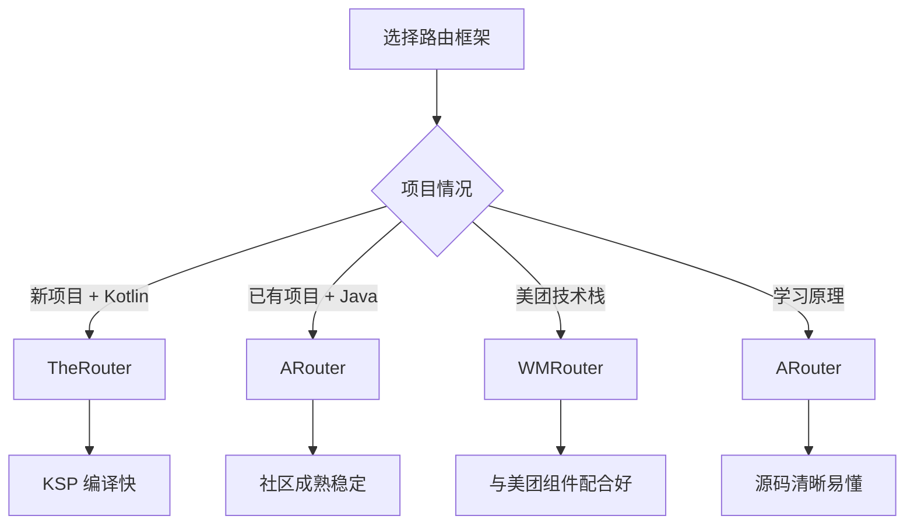
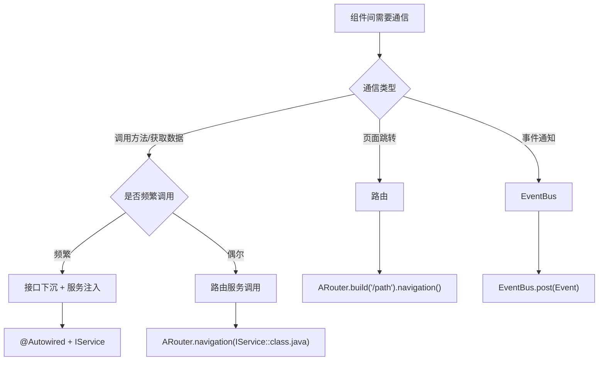
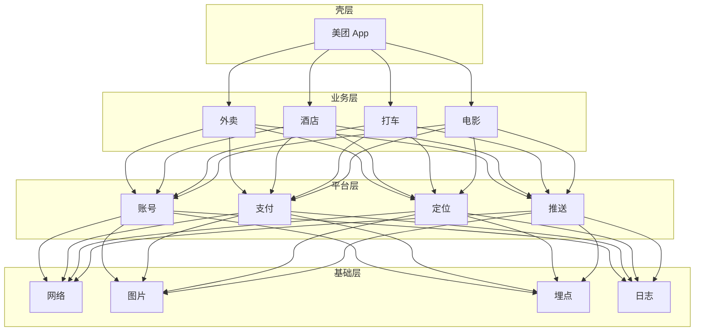
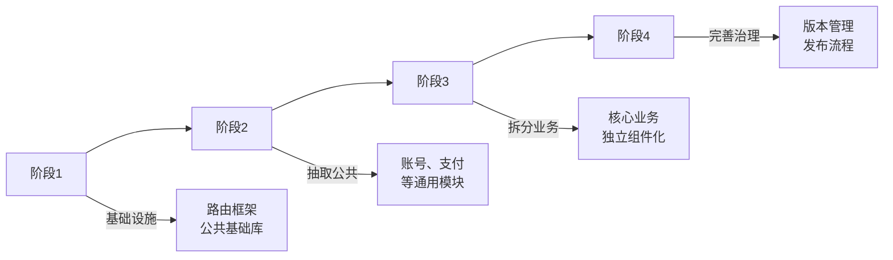

# 组件化进阶篇

> 会用只是及格，用好才是优秀

## 一、路由框架深度对比

### 1.1 主流框架对比

| 对比项 | ARouter | WMRouter | TheRouter |
|-------|---------|----------|-----------|
| 公司 | 阿里 | 美团 | 货拉拉 |
| 注解处理 | APT (kapt) | APT (kapt) | **KSP** |
| 编译速度 | 一般 | 一般 | **快 2-3 倍** |
| 多路径匹配 | ❌ | ✅ 正则匹配 | ✅ |
| 增量编译 | ❌ | ❌ | ✅ |
| 服务发现 | ✅ | ✅ | ✅ |
| 拦截器 | ✅ | ✅ | ✅ |
| Fragment 路由 | ✅ | ✅ | ✅ |
| 动态路由 | ❌ | ✅ | ✅ |
| 文档完善度 | ⭐⭐⭐⭐⭐ | ⭐⭐⭐⭐ | ⭐⭐⭐ |
| 社区活跃度 | ⭐⭐⭐⭐⭐ | ⭐⭐⭐⭐ | ⭐⭐⭐ |

> **名词解释：KAPT 与 KSP**
> 
> | 术语 | 全称 | 通俗理解 |
> |-----|------|---------|
> | **KAPT** | Kotlin Annotation Processing Tool | Kotlin 的注解处理工具。它的工作方式是：先把 Kotlin 代码转成 Java 存根（stub），再用 Java 的 APT 处理。就像翻译：Kotlin → Java → 处理，多了一道工序，所以慢。 |
> | **KSP** | Kotlin Symbol Processing | Kotlin 原生的符号处理 API。直接处理 Kotlin 代码，不需要"翻译"这一步。就像直接对话，不用找翻译，所以快 2-3 倍。 |
> 
> **为什么 KSP 更快？**
> 
> ```
> KAPT 流程：
> Kotlin 源码 → 生成 Java Stub → Java APT 处理 → 生成代码
>              ↑ 这一步很耗时！
> 
> KSP 流程：
> Kotlin 源码 → KSP 直接处理 → 生成代码
>              ↑ 省去了中间步骤
> ```
> 
> **迁移建议**：新项目优先选择支持 KSP 的框架（如 TheRouter），老项目可以逐步迁移。KAPT 仍然可用，只是编译速度稍慢。

### 1.2 如何选择？



**选型建议**：

| 场景 | 推荐 | 原因 |
|-----|------|------|
| **新项目** | TheRouter | KSP 编译速度快 2-3 倍 |
| **已有项目迁移** | ARouter | 社区成熟，迁移成本低 |
| **需要正则匹配** | WMRouter | 支持复杂的路径匹配规则 |
| **学习路由原理** | ARouter | 文档最完善，源码注释多 |

### 1.3 TheRouter 的优势演示

```kotlin
// TheRouter 使用 KSP，编译速度更快
// build.gradle.kts
plugins {
    id("com.google.devtools.ksp") version "1.9.0-1.0.13"
}

dependencies {
    implementation("cn.therouter:router:1.2.0")
    ksp("cn.therouter:apt:1.2.0")  // 用 ksp 代替 kapt
}

// 基本使用和 ARouter 类似
@Route(path = "/shop/detail")
class ShopDetailActivity : AppCompatActivity()

// 跳转
TheRouter.build("/shop/detail")
    .withString("id", "123")
    .navigation()
```

### 1.4 WMRouter 的正则匹配

```kotlin
// WMRouter 支持更灵活的路径匹配
// 定义路由（支持正则）
@RouterUri(
    scheme = "shop",
    host = "detail",
    path = "/product/{id}"  // 路径参数
)
class ProductDetailActivity : AppCompatActivity()

// 跳转
Router.startUri(context, "shop://detail/product/123")

// 还支持多 scheme
@RouterUri(
    scheme = ["http", "https"],  // 同时支持 http 和 https
    host = "www.example.com",
    path = "/product/{id}"
)
class WebProductActivity : AppCompatActivity()
```

## 二、组件间通信方案深度对比

### 2.1 通信方案对比

| 方案 | 原理 | 优点 | 缺点 | 适用场景 |
|-----|------|------|------|---------|
| **路由跳转** | URL 映射 | 解耦彻底 | 只能传递基本类型 | 页面跳转 |
| **接口下沉** | 接口定义在公共层 | 类型安全 | 增加公共层代码 | 服务调用 |
| **EventBus** | 发布订阅 | 完全解耦 | 难追踪、易泄漏 | 事件通知 |
| **广播** | 系统广播机制 | 跨进程 | 效率低、不安全 | 跨进程通信 |
| **ContentProvider** | 数据共享 | 跨进程、跨应用 | 实现复杂 | 数据共享 |

### 2.2 接口下沉的进阶用法

**标准的接口下沉架构**：

```
┌─────────────────────────────────────────────┐
│                业务组件层                    │
│  ┌─────────┐           ┌─────────┐         │
│  │ module_ │           │ module_ │         │
│  │  home   │           │  shop   │         │
│  │         │           │         │         │
│  │ 调用接口 │           │ 实现接口 │         │
│  └────┬────┘           └────┬────┘         │
│       │                     │              │
└───────│─────────────────────│──────────────┘
        │                     │
        └──────────┬──────────┘
                   ↓
┌─────────────────────────────────────────────┐
│              接口层（export）                 │
│  ┌─────────────────────────────────────┐   │
│  │            lib_export               │   │
│  │                                     │   │
│  │  IShopService    IUserService      │   │
│  │  IPayService     IMessageService   │   │
│  └─────────────────────────────────────┘   │
└─────────────────────────────────────────────┘
                   ↓
┌─────────────────────────────────────────────┐
│              基础组件层                      │
│  lib_network    lib_common    lib_router   │
└─────────────────────────────────────────────┘
```

**实现示例**：

```kotlin
// Step 1: 创建 export 模块，存放所有服务接口
// lib_export/build.gradle.kts
plugins {
    id("com.android.library")
}

dependencies {
    // export 模块只依赖最基础的库
    api("com.alibaba:arouter-api:1.5.2")
}

// Step 2: 定义服务接口和数据类
// lib_export/src/.../service/IShopService.kt
interface IShopService : IProvider {
    fun getProductInfo(productId: String): ProductInfo?
    fun getCartCount(): Int
    fun addToCart(productId: String): Boolean
}

// lib_export/src/.../model/ProductInfo.kt
// 数据类也放在 export 模块，避免跨模块传递时的序列化问题
data class ProductInfo(
    val id: String,
    val name: String,
    val price: Double,
    val imageUrl: String
)

// Step 3: 业务模块依赖 export 并实现接口
// module_shop/build.gradle.kts
dependencies {
    implementation(project(":lib_export"))
}

// module_shop/src/.../service/ShopServiceImpl.kt
@Route(path = ServicePath.SHOP_SERVICE)
class ShopServiceImpl : IShopService {
    
    override fun init(context: Context) {}
    
    override fun getProductInfo(productId: String): ProductInfo? {
        return ShopRepository.getProduct(productId)
    }
    
    override fun getCartCount(): Int {
        return CartRepository.getCount()
    }
    
    override fun addToCart(productId: String): Boolean {
        return CartRepository.add(productId)
    }
}

// Step 4: 其他模块通过接口调用
// module_home/src/.../HomeViewModel.kt
class HomeViewModel : ViewModel() {
    
    // 通过 ARouter 获取服务
    private val shopService: IShopService? by lazy {
        ARouter.getInstance().navigation(IShopService::class.java)
    }
    
    fun loadRecommendProducts() {
        // 调用商城服务获取推荐商品
        val product = shopService?.getProductInfo("recommend_001")
        product?.let {
            _recommendProduct.value = it
        }
    }
}
```

### 2.3 EventBus 的正确使用姿势

EventBus 虽然方便，但容易出问题。以下是最佳实践：

```kotlin
// 1. 定义统一的事件基类
// lib_common/src/.../event/BaseEvent.kt
abstract class BaseEvent {
    val timestamp: Long = System.currentTimeMillis()
}

// 2. 每个模块定义自己的事件（在 export 层）
// lib_export/src/.../event/UserEvent.kt
data class LoginSuccessEvent(val userId: String) : BaseEvent()
data class LogoutEvent(val reason: String) : BaseEvent()

// lib_export/src/.../event/ShopEvent.kt
data class CartUpdateEvent(val count: Int) : BaseEvent()
data class OrderCreateEvent(val orderId: String) : BaseEvent()

// 3. 封装 EventBus 工具类，统一管理
// lib_common/src/.../utils/EventBusUtils.kt
object EventBusUtils {
    
    fun register(subscriber: Any) {
        if (!EventBus.getDefault().isRegistered(subscriber)) {
            EventBus.getDefault().register(subscriber)
        }
    }
    
    fun unregister(subscriber: Any) {
        if (EventBus.getDefault().isRegistered(subscriber)) {
            EventBus.getDefault().unregister(subscriber)
        }
    }
    
    fun post(event: BaseEvent) {
        EventBus.getDefault().post(event)
    }
    
    fun postSticky(event: BaseEvent) {
        EventBus.getDefault().postSticky(event)
    }
}

// 4. 在 BaseActivity 中统一管理生命周期
// lib_common/src/.../base/BaseActivity.kt
abstract class BaseActivity : AppCompatActivity() {
    
    // 子类重写此方法，返回 true 表示需要注册 EventBus
    protected open fun useEventBus(): Boolean = false
    
    override fun onCreate(savedInstanceState: Bundle?) {
        super.onCreate(savedInstanceState)
        if (useEventBus()) {
            EventBusUtils.register(this)
        }
    }
    
    override fun onDestroy() {
        super.onDestroy()
        if (useEventBus()) {
            EventBusUtils.unregister(this)
        }
    }
}

// 5. 使用示例
// module_home/src/.../HomeActivity.kt
class HomeActivity : BaseActivity() {
    
    override fun useEventBus(): Boolean = true
    
    @Subscribe(threadMode = ThreadMode.MAIN)
    fun onCartUpdate(event: CartUpdateEvent) {
        // 更新购物车角标
        updateCartBadge(event.count)
    }
}

// module_shop/src/.../CartManager.kt
object CartManager {
    fun add(productId: String) {
        // 添加商品到购物车
        val count = getCartCount()
        // 发送事件通知其他模块
        EventBusUtils.post(CartUpdateEvent(count))
    }
}
```

### 2.4 通信方案选择指南



## 三、组件独立运行

### 3.1 为什么需要独立运行？

```
场景：你负责商城模块，想测试商品详情页

传统方式：
1. 编译整个 App（3分钟）
2. 从首页进入商城
3. 搜索商品
4. 点击商品进入详情页
5. 发现 bug，修改代码
6. 重复 1-5...

独立运行方式：
1. 编译商城模块（30秒）
2. 直接打开商品详情页
3. 发现 bug，修改代码
4. 重复 1-3...

效率提升 5 倍以上！
```

### 3.2 实现方案

**核心思路**：通过 Gradle 配置，让业务模块可以在 `application` 和 `library` 两种模式间切换。

```kotlin
// Step 1: 在 gradle.properties 中定义开关
// gradle.properties
# 是否独立运行模式（true: 模块可单独运行，false: 作为 library）
isModuleRun=false

// Step 2: 业务模块根据开关切换插件
// module_shop/build.gradle.kts
// 根据配置决定是 application 还是 library
val isModuleRun: String by project

plugins {
    // 动态应用插件
    if (isModuleRun.toBoolean()) {
        id("com.android.application")
    } else {
        id("com.android.library")
    }
    id("org.jetbrains.kotlin.android")
    id("kotlin-kapt")
}

android {
    namespace = "com.example.module_shop"
    
    // 独立运行时需要 applicationId
    if (isModuleRun.toBoolean()) {
        defaultConfig {
            applicationId = "com.example.module_shop"
        }
    }
    
    sourceSets {
        getByName("main") {
            if (isModuleRun.toBoolean()) {
                // 独立运行时使用独立的 Manifest
                manifest.srcFile("src/main/debug/AndroidManifest.xml")
            } else {
                // 作为 library 时使用标准 Manifest
                manifest.srcFile("src/main/AndroidManifest.xml")
            }
        }
    }
}

// Step 3: 准备独立运行的 Manifest
// module_shop/src/main/debug/AndroidManifest.xml
<?xml version="1.0" encoding="utf-8"?>
<manifest xmlns:android="http://schemas.android.com/apk/res/android">
    
    <application
        android:name=".debug.ShopDebugApplication"
        android:allowBackup="true"
        android:icon="@mipmap/ic_launcher"
        android:label="商城模块"
        android:theme="@style/Theme.App">
        
        <!-- 独立运行时的启动 Activity -->
        <activity
            android:name=".debug.ShopDebugActivity"
            android:exported="true">
            <intent-filter>
                <action android:name="android.intent.action.MAIN" />
                <category android:name="android.intent.category.LAUNCHER" />
            </intent-filter>
        </activity>
        
    </application>
    
</manifest>

// Step 4: 创建独立运行的 Application
// module_shop/src/main/java/.../debug/ShopDebugApplication.kt
class ShopDebugApplication : Application() {
    
    override fun onCreate() {
        super.onCreate()
        
        // 初始化该模块需要的依赖
        ARouter.init(this)
        
        // 初始化网络库等基础组件
        NetworkManager.init(this)
        
        // Mock 一些数据或服务
        MockServiceManager.init()
    }
}

// Step 5: 创建调试入口页面
// module_shop/src/main/java/.../debug/ShopDebugActivity.kt
class ShopDebugActivity : AppCompatActivity() {
    
    override fun onCreate(savedInstanceState: Bundle?) {
        super.onCreate(savedInstanceState)
        setContentView(R.layout.activity_shop_debug)
        
        // 提供各种测试入口
        findViewById<Button>(R.id.btn_product_list).setOnClickListener {
            ARouter.getInstance().build("/shop/list").navigation()
        }
        
        findViewById<Button>(R.id.btn_product_detail).setOnClickListener {
            ARouter.getInstance()
                .build("/shop/detail")
                .withString("productId", "mock_001")
                .navigation()
        }
        
        findViewById<Button>(R.id.btn_cart).setOnClickListener {
            ARouter.getInstance().build("/shop/cart").navigation()
        }
    }
}

// Step 6: 主工程排除独立运行模式的代码
// app/build.gradle.kts
dependencies {
    if (!isModuleRun.toBoolean()) {
        implementation(project(":module_shop"))
    }
}
```

### 3.3 处理跨模块依赖

独立运行时，可能需要其他模块的服务。有两种解决方案：

**方案一：Mock 服务**

```kotlin
// module_shop/src/main/java/.../debug/MockServiceManager.kt
object MockServiceManager {
    
    fun init() {
        // 注册 Mock 的用户服务
        ServiceManager.register(IUserService::class.java, MockUserService())
    }
}

// Mock 实现
class MockUserService : IUserService {
    override fun init(context: Context) {}
    
    override fun getUserInfo(): UserInfo {
        return UserInfo(
            id = "mock_user",
            name = "测试用户",
            avatar = "https://example.com/avatar.png"
        )
    }
    
    override fun isLogin(): Boolean = true
}
```

**方案二：依赖 export 模块**

```kotlin
// module_shop/build.gradle.kts
dependencies {
    // 始终依赖 export 模块（只有接口定义，编译很快）
    implementation(project(":lib_export"))
    
    // 独立运行时，额外依赖 mock 模块
    if (isModuleRun.toBoolean()) {
        implementation(project(":lib_mock"))
    }
}
```

## 四、Gradle 配置实战

### 4.1 统一依赖版本管理

**问题**：各模块依赖版本不一致，容易出兼容性问题

```kotlin
// 方案一：使用 Version Catalog（推荐）
// gradle/libs.versions.toml
[versions]
kotlin = "1.9.0"
agp = "8.1.0"
arouter = "1.5.2"
retrofit = "2.9.0"
okhttp = "4.11.0"

[libraries]
arouter-api = { module = "com.alibaba:arouter-api", version.ref = "arouter" }
arouter-compiler = { module = "com.alibaba:arouter-compiler", version.ref = "arouter" }
retrofit = { module = "com.squareup.retrofit2:retrofit", version.ref = "retrofit" }
okhttp = { module = "com.squareup.okhttp3:okhttp", version.ref = "okhttp" }

[bundles]
network = ["retrofit", "okhttp"]

// 使用
// module_xxx/build.gradle.kts
dependencies {
    implementation(libs.arouter.api)
    kapt(libs.arouter.compiler)
    implementation(libs.bundles.network)
}
```

```kotlin
// 方案二：使用 buildSrc
// buildSrc/src/main/kotlin/Dependencies.kt
object Versions {
    const val kotlin = "1.9.0"
    const val arouter = "1.5.2"
}

object Deps {
    const val arouterApi = "com.alibaba:arouter-api:${Versions.arouter}"
    const val arouterCompiler = "com.alibaba:arouter-compiler:${Versions.arouter}"
}

// 使用
dependencies {
    implementation(Deps.arouterApi)
    kapt(Deps.arouterCompiler)
}
```

### 4.2 公共配置抽取

```kotlin
// buildSrc/src/main/kotlin/AndroidConfig.kt
object AndroidConfig {
    const val compileSdk = 34
    const val minSdk = 24
    const val targetSdk = 34
    const val versionCode = 1
    const val versionName = "1.0.0"
}

// 创建公共 Gradle 配置
// gradle/common-android.gradle.kts
android {
    compileSdk = AndroidConfig.compileSdk
    
    defaultConfig {
        minSdk = AndroidConfig.minSdk
        targetSdk = AndroidConfig.targetSdk
        
        testInstrumentationRunner = "androidx.test.runner.AndroidJUnitRunner"
    }
    
    compileOptions {
        sourceCompatibility = JavaVersion.VERSION_17
        targetCompatibility = JavaVersion.VERSION_17
    }
    
    kotlinOptions {
        jvmTarget = "17"
    }
}

// 各模块应用公共配置
// module_xxx/build.gradle.kts
apply(from = rootProject.file("gradle/common-android.gradle.kts"))
```

### 4.3 发布组件到 Maven

当组件稳定后，可以发布到私有 Maven，供其他项目使用：

```kotlin
// lib_network/build.gradle.kts
plugins {
    id("com.android.library")
    id("maven-publish")
}

android {
    // ...
}

// 配置发布
afterEvaluate {
    publishing {
        publications {
            create<MavenPublication>("release") {
                from(components["release"])
                
                groupId = "com.example"
                artifactId = "lib-network"
                version = "1.0.0"
            }
        }
        
        repositories {
            maven {
                name = "myRepo"
                url = uri("https://maven.example.com/repository/releases/")
                credentials {
                    username = findProperty("mavenUser") as String? ?: ""
                    password = findProperty("mavenPassword") as String? ?: ""
                }
            }
        }
    }
}

// 发布命令
// ./gradlew :lib_network:publish

// 其他项目使用
// build.gradle.kts
repositories {
    maven { url = uri("https://maven.example.com/repository/releases/") }
}

dependencies {
    implementation("com.example:lib-network:1.0.0")
}
```

## 五、资源隔离

### 5.1 资源冲突问题

```
问题场景：
- module_home 有个布局文件：res/layout/activity_main.xml
- module_shop 也有个布局文件：res/layout/activity_main.xml

打包时会冲突，只保留一个！
```

### 5.2 解决方案

**方案一：resourcePrefix（推荐）**

```kotlin
// module_shop/build.gradle.kts
android {
    // 强制资源名称前缀
    resourcePrefix = "shop_"
}

// 资源文件必须以 shop_ 开头，否则编译警告
// ✅ shop_activity_main.xml
// ✅ shop_ic_logo.png
// ✅ @string/shop_title
// ❌ activity_main.xml（会警告）
```

**方案二：规范约定**

| 模块 | 资源前缀 | 示例 |
|-----|---------|------|
| module_home | home_ | home_activity_main.xml |
| module_shop | shop_ | shop_product_item.xml |
| module_mine | mine_ | mine_avatar.png |
| lib_common | common_ | common_loading.xml |

**方案三：独立资源模块**

```
对于公共资源（如颜色、主题），抽到独立模块：

lib_resource/
├── src/main/res/
│   ├── values/
│   │   ├── colors.xml      # 统一颜色
│   │   ├── dimens.xml      # 统一尺寸
│   │   └── styles.xml      # 统一样式
│   └── drawable/
│       └── common_xxx.xml  # 公共图片
```

### 5.3 资源冲突检测

```kotlin
// 添加资源冲突检测插件
// build.gradle.kts（根目录）
plugins {
    id("com.anthropicandroid.resource-check") version "1.0.0"
}

// 或者自定义 Task 检测
tasks.register("checkResourceConflict") {
    doLast {
        val resourceMap = mutableMapOf<String, MutableList<String>>()
        
        // 遍历所有模块的资源
        project.subprojects.forEach { subproject ->
            val resDir = File(subproject.projectDir, "src/main/res")
            if (resDir.exists()) {
                resDir.walkTopDown().filter { it.isFile }.forEach { file ->
                    val key = "${file.parentFile.name}/${file.name}"
                    resourceMap.getOrPut(key) { mutableListOf() }.add(subproject.name)
                }
            }
        }
        
        // 检查冲突
        resourceMap.filter { it.value.size > 1 }.forEach { (resource, modules) ->
            println("⚠️ 资源冲突: $resource 存在于 ${modules.joinToString()}")
        }
    }
}
```

## 六、大厂组件化实践

### 6.1 美团组件化架构

```
美团的组件化特点：
1. 严格的分层架构（壳层 → 业务层 → 平台层 → 基础层）
2. 自研 WMRouter 路由框架
3. 服务中心统一管理跨组件调用
4. 组件版本独立管理，支持灰度发布
```



### 6.2 阿里组件化架构

```
阿里（手淘/支付宝）的组件化特点：
1. 基于 ARouter 的标准化路由
2. 模块 Bundle 化，支持动态下发
3. 严格的接口规范（所有对外接口必须定义在 export 层）
4. 完善的组件发布流程
```

**组件发布流程**：


### 6.3 字节组件化架构

```
字节（抖音/今日头条）的组件化特点：
1. 超大规模组件（500+ 组件）
2. 自研构建系统，支持分布式编译
3. 组件依赖分析，自动处理依赖关系
4. 二进制化编译（依赖组件用 AAR 而非源码）
```

**二进制化编译**的好处：

```kotlin
// 传统方式：依赖源码
dependencies {
    implementation(project(":lib_network"))  // 每次都要编译
}

// 二进制化：依赖 AAR
dependencies {
    implementation("com.byte:lib-network:1.0.0")  // 直接用编译好的
}

// 效果：
// 100 个模块的项目，只有你改的模块需要编译
// 编译时间从 10 分钟 → 1 分钟
```

### 6.4 组件化最佳实践总结

| 实践 | 说明 | 优先级 |
|-----|------|-------|
| **明确分层** | 壳层 → 业务层 → 功能层 → 基础层 | ⭐⭐⭐⭐⭐ |
| **接口下沉** | 所有跨组件接口定义在 export 层 | ⭐⭐⭐⭐⭐ |
| **资源前缀** | 每个模块资源加前缀，避免冲突 | ⭐⭐⭐⭐⭐ |
| **版本统一** | 使用 Version Catalog 管理依赖版本 | ⭐⭐⭐⭐ |
| **独立运行** | 业务组件可切换为 application 模式 | ⭐⭐⭐⭐ |
| **二进制化** | 大型项目使用 AAR 替代源码依赖 | ⭐⭐⭐ |

## 七、边界认知

### 7.1 组件化的局限性

**适合组件化的场景**：
- 团队规模 > 10 人
- 代码量 > 20 万行
- 需要多团队并行开发
- 有代码复用需求

**不适合组件化的场景**：
- 小团队（< 5 人）
- 小项目（< 10 万行）
- 项目周期短（< 3 个月）
- 业务简单，不需要拆分

### 7.2 组件化的代价

| 代价 | 说明 |
|-----|------|
| **学习成本** | 团队需要学习组件化规范 |
| **架构复杂度** | 多模块管理、依赖管理更复杂 |
| **调试难度** | 跨组件调试不如单模块直观 |
| **初期投入** | 搭建组件化架构需要时间 |

### 7.3 渐进式组件化

不要一步到位，推荐渐进式改造：



## 八、面试检验

### 进阶题（检验是否有实战能力）

**Q1：组件化项目如何处理资源冲突？**

> **答案**：
> 
> 三种方案：
> 
> 1. **resourcePrefix**：在 build.gradle 中配置 `resourcePrefix = "xxx_"`，强制资源名称前缀
> 2. **命名规范**：约定各模块资源命名规则，如 `模块名_资源名`
> 3. **公共资源模块**：把公共资源（颜色、样式）抽到独立的 lib_resource 模块
> 
> 推荐组合使用：resourcePrefix + 公共资源模块。

**Q2：如何实现组件的独立运行？**

> **答案**：
> 
> 核心步骤：
> 
> 1. 定义 `isModuleRun` 开关（gradle.properties）
> 2. 根据开关动态切换 `application` 和 `library` 插件
> 3. 准备独立运行的 `AndroidManifest.xml`（包含启动 Activity）
> 4. 创建独立的 `DebugApplication`（初始化必要依赖）
> 5. 创建调试入口页面
> 6. 处理跨模块依赖（Mock 或依赖 export 模块）

**Q3：接口下沉和 EventBus 各自适用什么场景？**

> **答案**：
> 
> | 方案 | 适用场景 |
> |-----|---------|
> | **接口下沉** | 需要调用方法、获取返回值、类型安全的场景 |
> | **EventBus** | 事件通知、一对多广播、不关心返回值的场景 |
> 
> 示例：
> - 获取用户信息 → 接口下沉（需要返回 UserInfo）
> - 通知购物车更新 → EventBus（广播事件，不需要返回值）
> - 调用支付 → 接口下沉（需要支付结果回调）
> - 登录成功通知 → EventBus（多处需要刷新）

**Q4：大型项目组件化有哪些优化手段？**

> **答案**：
> 
> 1. **二进制化编译**：依赖组件用 AAR 而非源码，避免重复编译
> 2. **增量编译**：只编译改动的模块
> 3. **并行编译**：Gradle 配置 `org.gradle.parallel=true`
> 4. **构建缓存**：Gradle 配置 `org.gradle.caching=true`
> 5. **KSP 替代 kapt**：路由框架选择支持 KSP 的（如 TheRouter）
> 
> 效果：500+ 组件的项目，编译时间从 20 分钟 → 2-3 分钟。

**Q5：组件化和插件化的关系？能否一起使用？**

> **答案**：
> 
> 关系：
> - 组件化是编译时的模块拆分
> - 插件化是运行时的模块加载
> - 插件化可以看作是组件化的升级版
> 
> 可以一起使用：
> - 核心功能用组件化（编译时集成）
> - 扩展功能用插件化（运行时动态加载）
> 
> 典型场景：
> - 首页、我的等核心模块 → 组件化
> - 运营活动、AB 测试功能 → 插件化

---
_本文档将持续更新，添加更多相关内容_
