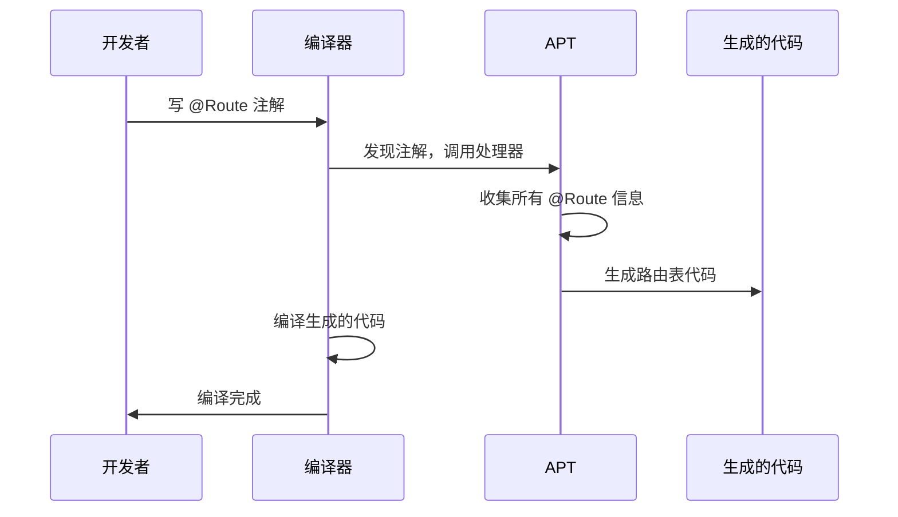
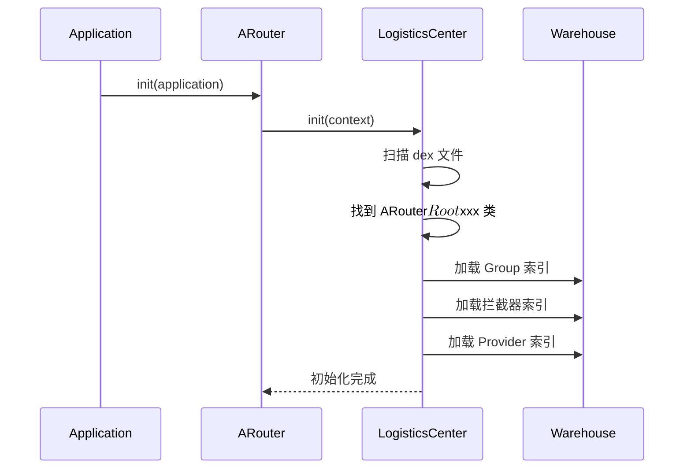
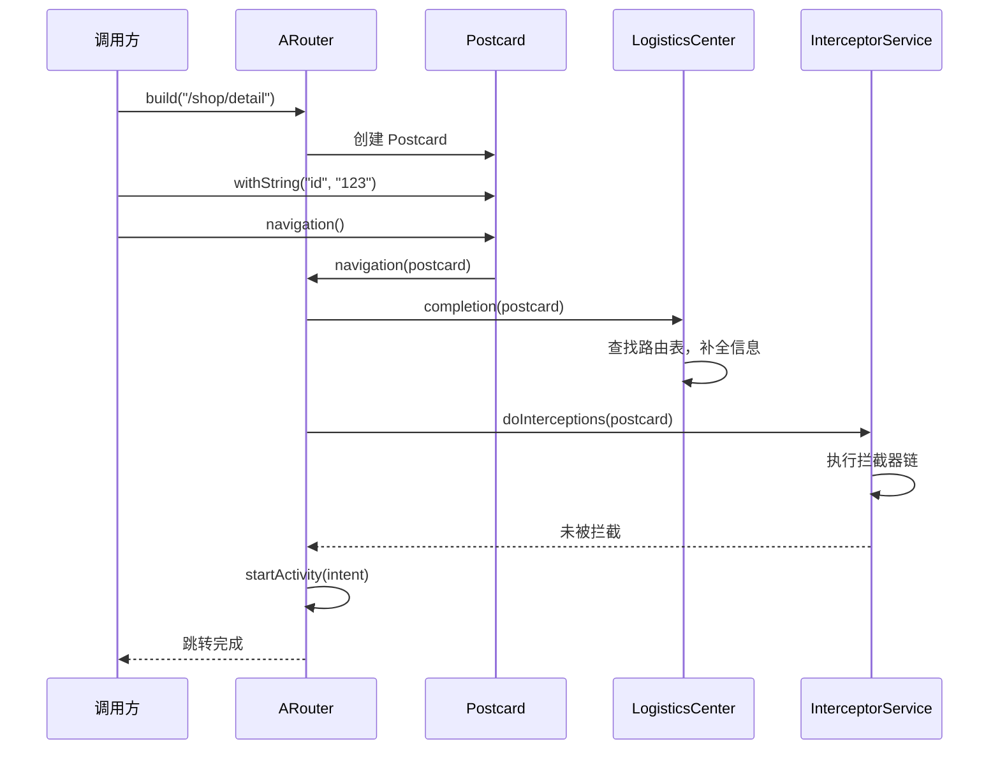
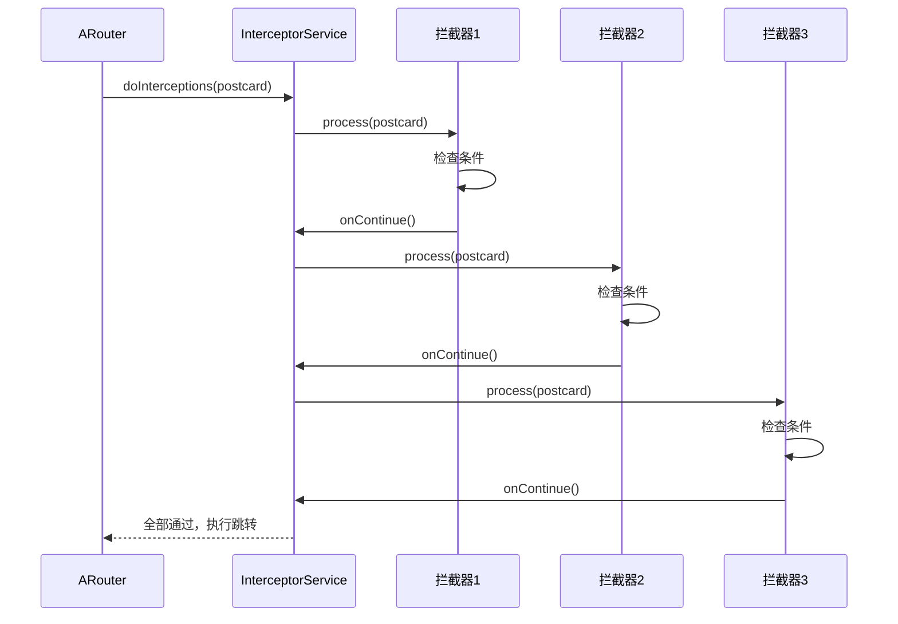
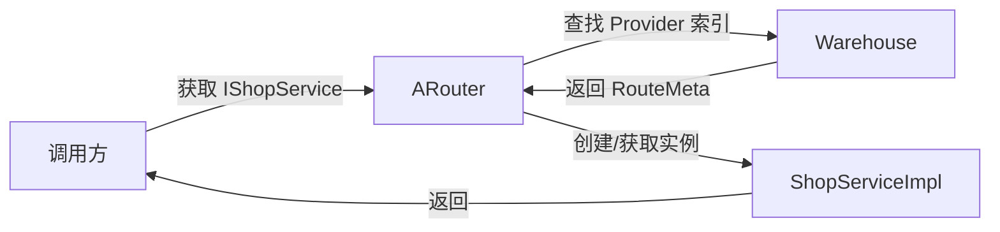
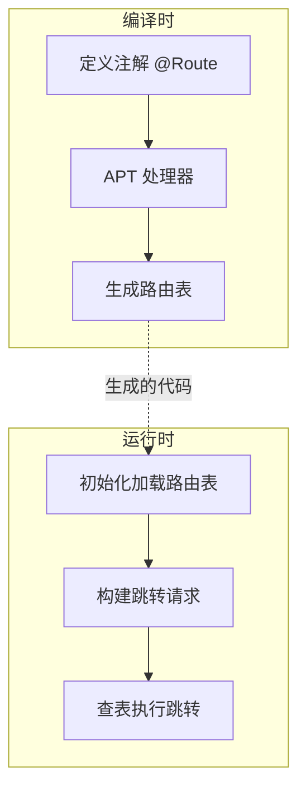

# 组件化源码篇

> 知其然，更要知其所以然

## 一、APT 原理：路由框架的基础

### 1.1 什么是 APT？

APT（Annotation Processing Tool）是 Java 编译器提供的**注解处理工具**。

**大白话理解**：

```
你在代码里写了 @Route(path = "/shop/detail")
编译时，APT 会扫描这些注解
然后自动生成一些代码（比如路由表）

就像有个"代码生成机器人"，
在编译时帮你写代码
```

### 1.2 APT 工作流程



### 1.3 APT 的三个核心类

```kotlin
// 1. 注解定义（给开发者用的标记）
@Target(AnnotationTarget.CLASS)
@Retention(AnnotationRetention.SOURCE)  // 只在源码阶段保留
annotation class Route(
    val path: String,      // 路由路径
    val group: String = "" // 分组
)

// 2. 注解处理器（编译时运行，生成代码）
@AutoService(Processor::class)  // 自动注册处理器
class RouteProcessor : AbstractProcessor() {
    
    // 支持的注解类型
    override fun getSupportedAnnotationTypes(): Set<String> {
        return setOf(Route::class.java.canonicalName)
    }
    
    // 处理注解
    override fun process(
        annotations: Set<TypeElement>,
        roundEnv: RoundEnvironment
    ): Boolean {
        // 获取所有被 @Route 注解的类
        val elements = roundEnv.getElementsAnnotatedWith(Route::class.java)
        
        // 生成路由表代码
        generateRouteTable(elements)
        
        return true
    }
}

// 3. 生成的代码（运行时使用）
// 这是 APT 自动生成的，不是手写的
class ARouter$$Group$$shop : IRouteGroup {
    override fun loadInto(atlas: Map<String, RouteMeta>) {
        atlas["/shop/detail"] = RouteMeta(
            path = "/shop/detail",
            destination = ShopDetailActivity::class.java
        )
    }
}
```

### 1.4 为什么用 APT 而不是反射？

| 对比项 | APT（编译时） | 反射（运行时） |
|-------|-------------|---------------|
| **执行时机** | 编译时生成代码 | 运行时动态查找 |
| **性能** | ✅ 零运行时开销 | ❌ 有性能损耗 |
| **安全性** | ✅ 编译时检查 | ❌ 运行时才发现错误 |
| **调试** | ❌ 生成代码不直观 | ✅ 直接调试 |

**结论**：路由框架选择 APT，因为路由表只需要生成一次，运行时直接查表即可。

## 二、ARouter 源码解析

### 2.1 整体架构

```mermaid
flowchart TB
    subgraph 编译时
        A[arouter-compiler]
        A1[@Route 注解]
        A2[@Autowired 注解]
        A3[@Interceptor 注解]
        
        A --> A1 & A2 & A3
        A1 --> B1[生成 Group 类]
        A2 --> B2[生成注入代码]
        A3 --> B3[生成拦截器注册]
    end
    
    subgraph 运行时
        C[arouter-api]
        C1[LogisticsCenter<br>路由表管理]
        C2[Warehouse<br>数据仓库]
        C3[InterceptorService<br>拦截器服务]
        
        C --> C1 & C2 & C3
    end
    
    B1 --> C1
    B2 --> C
    B3 --> C3
```

### 2.2 初始化流程

```kotlin
// 调用入口
ARouter.init(application)

// 源码分析
class ARouter {
    companion object {
        @Volatile
        private var instance: ARouter? = null
        
        fun init(application: Application) {
            // 单例模式
            if (instance == null) {
                synchronized(ARouter::class.java) {
                    if (instance == null) {
                        instance = ARouter()
                        // 核心：加载路由表
                        LogisticsCenter.init(application)
                    }
                }
            }
        }
    }
}

// LogisticsCenter：物流中心，负责路由表的加载和查找
object LogisticsCenter {
    
    fun init(context: Context) {
        // 关键步骤1：获取所有 APT 生成的类
        val routerMap = getRouterClassesByPackageName(context, ROUTE_ROOT_PACKAGE)
        
        // 关键步骤2：加载到内存中的路由表
        for (className in routerMap) {
            when {
                // Group 索引类（记录每个 group 对应哪个类）
                className.startsWith("$ROUTE_ROOT_PACKAGE.ARouter$$Root") -> {
                    val root = Class.forName(className).newInstance() as IRouteRoot
                    root.loadInto(Warehouse.groupsIndex)
                }
                // 拦截器类
                className.startsWith("$ROUTE_ROOT_PACKAGE.ARouter$$Interceptors") -> {
                    val interceptors = Class.forName(className).newInstance() as IInterceptorGroup
                    interceptors.loadInto(Warehouse.interceptorsIndex)
                }
                // Provider 服务类
                className.startsWith("$ROUTE_ROOT_PACKAGE.ARouter$$Providers") -> {
                    val providers = Class.forName(className).newInstance() as IProviderGroup
                    providers.loadInto(Warehouse.providersIndex)
                }
            }
        }
    }
    
    // 通过 dex 文件扫描包名下的所有类
    private fun getRouterClassesByPackageName(context: Context, packageName: String): Set<String> {
        val classNames = mutableSetOf<String>()
        
        // 获取所有 dex 文件路径
        val paths = getSourcePaths(context)
        
        // 遍历 dex，找到指定包名下的类
        for (path in paths) {
            val dexFile = DexFile(path)
            val entries = dexFile.entries()
            while (entries.hasMoreElements()) {
                val className = entries.nextElement()
                if (className.startsWith(packageName)) {
                    classNames.add(className)
                }
            }
        }
        
        return classNames
    }
}
```

**初始化流程图**：



### 2.3 路由跳转流程

```kotlin
// 使用方式
ARouter.getInstance()
    .build("/shop/detail")
    .withString("productId", "123")
    .navigation()

// 源码分析
class ARouter {
    
    fun build(path: String): Postcard {
        // 创建 Postcard（明信片），携带路由信息
        return Postcard(path, extractGroup(path))
    }
}

// Postcard：路由信息的载体
class Postcard(
    val path: String,
    val group: String
) {
    private val extras = Bundle()
    
    fun withString(key: String, value: String): Postcard {
        extras.putString(key, value)
        return this
    }
    
    fun navigation(context: Context? = null, callback: NavigationCallback? = null) {
        // 核心跳转逻辑
        ARouter.getInstance().navigation(context, this, callback)
    }
}

// 实际跳转逻辑
class _ARouter {
    
    fun navigation(context: Context?, postcard: Postcard, callback: NavigationCallback?): Any? {
        try {
            // Step 1: 补全路由信息（从路由表查找目标类）
            LogisticsCenter.completion(postcard)
        } catch (e: NoRouteFoundException) {
            // 路由不存在
            callback?.onLost(postcard)
            return null
        }
        
        callback?.onFound(postcard)
        
        // Step 2: 执行拦截器链
        if (!postcard.isGreenChannel) {
            interceptorService?.doInterceptions(postcard) { interrupted ->
                if (!interrupted) {
                    // 未被拦截，继续跳转
                    _navigation(context, postcard, callback)
                } else {
                    callback?.onInterrupt(postcard)
                }
            }
        } else {
            // 绿色通道，跳过拦截器
            _navigation(context, postcard, callback)
        }
        
        return null
    }
    
    private fun _navigation(context: Context?, postcard: Postcard, callback: NavigationCallback?) {
        val currentContext = context ?: mContext
        
        when (postcard.type) {
            RouteType.ACTIVITY -> {
                // Activity 跳转
                val intent = Intent(currentContext, postcard.destination)
                intent.putExtras(postcard.extras)
                
                // 处理 flags
                if (postcard.flags != -1) {
                    intent.flags = postcard.flags
                }
                
                // 非 Activity 启动需要 NEW_TASK
                if (currentContext !is Activity) {
                    intent.addFlags(Intent.FLAG_ACTIVITY_NEW_TASK)
                }
                
                // 启动 Activity
                currentContext.startActivity(intent)
                
                callback?.onArrival(postcard)
            }
            
            RouteType.PROVIDER -> {
                // Provider 服务获取
                return postcard.provider
            }
            
            RouteType.FRAGMENT -> {
                // Fragment 创建
                val fragment = postcard.destination.newInstance() as Fragment
                fragment.arguments = postcard.extras
                return fragment
            }
        }
    }
}

// LogisticsCenter.completion：补全路由信息
object LogisticsCenter {
    
    fun completion(postcard: Postcard) {
        // Step 1: 从 Group 索引找到对应的 Group 类
        val groupClass = Warehouse.groupsIndex[postcard.group]
        
        // Step 2: 如果该 Group 还没加载，先加载
        if (Warehouse.routes[postcard.group] == null) {
            val group = groupClass?.newInstance() as IRouteGroup
            group.loadInto(Warehouse.routes)
        }
        
        // Step 3: 从路由表找到目标信息
        val routeMeta = Warehouse.routes[postcard.path]
            ?: throw NoRouteFoundException("Route not found: ${postcard.path}")
        
        // Step 4: 补全 Postcard 信息
        postcard.destination = routeMeta.destination
        postcard.type = routeMeta.type
        postcard.priority = routeMeta.priority
        postcard.extra = routeMeta.extra
    }
}
```

**跳转流程图**：



### 2.4 参数自动注入原理

```kotlin
// 使用方式
@Route(path = "/shop/detail")
class ShopDetailActivity : AppCompatActivity() {
    
    @Autowired
    @JvmField
    var productId: String = ""
    
    override fun onCreate(savedInstanceState: Bundle?) {
        super.onCreate(savedInstanceState)
        ARouter.getInstance().inject(this)  // 注入参数
        
        Log.d("TAG", "productId = $productId")  // 自动赋值了
    }
}

// APT 生成的注入代码
// 文件：ShopDetailActivity$$ARouter$$Autowired.java
class ShopDetailActivity$$ARouter$$Autowired : ISyringe {
    
    override fun inject(target: Any) {
        val activity = target as ShopDetailActivity
        
        // 从 Intent 中获取参数，赋值给字段
        activity.productId = activity.intent.getStringExtra("productId") ?: ""
    }
}

// inject 方法的实现
class _ARouter {
    
    fun inject(target: Any) {
        // 找到 APT 生成的注入类
        val className = target.javaClass.name + "$$ARouter$$Autowired"
        val syringeClass = Class.forName(className)
        val syringe = syringeClass.newInstance() as ISyringe
        
        // 执行注入
        syringe.inject(target)
    }
}
```

**设计亮点**：

```
为什么用 APT 生成注入代码，而不是运行时反射？

1. 性能：APT 生成的代码直接调用字段赋值，无反射开销
2. 安全：编译时生成，类型安全
3. 混淆：反射需要 keep 字段名，APT 方案不需要

这是 ARouter 的精妙之处：
用编译时的复杂度，换取运行时的性能
```

### 2.5 拦截器机制

```kotlin
// 拦截器定义
@Interceptor(priority = 1, name = "登录拦截器")
class LoginInterceptor : IInterceptor {
    
    override fun process(postcard: Postcard, callback: InterceptorCallback) {
        if (needLogin(postcard) && !isLogin()) {
            callback.onInterrupt(RuntimeException("需要登录"))
        } else {
            callback.onContinue(postcard)
        }
    }
}

// 拦截器服务实现
class InterceptorServiceImpl : InterceptorService {
    
    override fun doInterceptions(postcard: Postcard, callback: InterceptorCallback) {
        if (Warehouse.interceptors.isEmpty()) {
            callback.onContinue(postcard)
            return
        }
        
        // 按优先级排序的拦截器列表
        val interceptors = Warehouse.interceptors.sortedBy { it.priority }
        
        // 责任链模式执行拦截器
        executeInterceptor(0, interceptors, postcard, callback)
    }
    
    private fun executeInterceptor(
        index: Int,
        interceptors: List<IInterceptor>,
        postcard: Postcard,
        callback: InterceptorCallback
    ) {
        if (index >= interceptors.size) {
            // 所有拦截器都通过
            callback.onContinue(postcard)
            return
        }
        
        val interceptor = interceptors[index]
        interceptor.process(postcard, object : InterceptorCallback {
            override fun onContinue(postcard: Postcard) {
                // 继续执行下一个拦截器
                executeInterceptor(index + 1, interceptors, postcard, callback)
            }
            
            override fun onInterrupt(exception: Throwable) {
                // 被拦截，终止链条
                callback.onInterrupt(exception)
            }
        })
    }
}
```

**拦截器链执行流程**：



## 三、服务发现原理

### 3.1 SPI 机制简介

SPI（Service Provider Interface）是 Java 提供的**服务发现机制**。

**大白话理解**：

```
场景：你定义了一个接口 IUserService
问题：运行时怎么找到它的实现类 UserServiceImpl？

传统方式：直接 new UserServiceImpl()（强耦合）

SPI 方式：
1. 在配置文件中声明：IUserService 的实现是 UserServiceImpl
2. 运行时通过 ServiceLoader 读取配置，自动实例化

好处：调用方只依赖接口，不依赖实现
```

### 3.2 ARouter 的服务发现实现

```kotlin
// Step 1: 定义服务接口（在 export 模块）
interface IShopService : IProvider {
    fun getProduct(id: String): Product?
}

// Step 2: 实现服务（在业务模块）
@Route(path = "/shop/service")
class ShopServiceImpl : IShopService {
    override fun init(context: Context) {}
    
    override fun getProduct(id: String): Product? {
        return ShopRepository.getProduct(id)
    }
}

// Step 3: 获取服务（在其他模块）
val shopService = ARouter.getInstance().navigation(IShopService::class.java)

// ARouter 服务发现实现
class _ARouter {
    
    fun <T> navigation(service: Class<T>): T? {
        // Step 1: 从 Provider 索引中查找
        val postcard = Warehouse.providersIndex[service.name]
            ?: return null
        
        // Step 2: 补全信息
        LogisticsCenter.completion(postcard)
        
        // Step 3: 获取或创建 Provider 实例
        val provider = postcard.provider
            ?: run {
                // 通过反射创建实例
                val instance = postcard.destination.newInstance() as IProvider
                instance.init(mContext)
                // 缓存实例（单例）
                postcard.provider = instance
                instance
            }
        
        @Suppress("UNCHECKED_CAST")
        return provider as T
    }
}

// APT 生成的 Provider 索引
class ARouter$$Providers$$shop : IProviderGroup {
    override fun loadInto(providers: Map<String, RouteMeta>) {
        // 建立 接口 -> 实现 的映射
        providers[IShopService::class.java.name] = RouteMeta(
            path = "/shop/service",
            destination = ShopServiceImpl::class.java,
            type = RouteType.PROVIDER
        )
    }
}
```

**服务发现流程**：



### 3.3 为什么 Provider 是单例？

```kotlin
// ARouter 的 Provider 默认是单例
// 原因：Provider 通常是无状态的服务，单例可以节省内存

// 如果需要非单例，有两种方案：

// 方案1：每次手动创建
val postcard = ARouter.getInstance().build("/shop/service")
LogisticsCenter.completion(postcard)
val service = postcard.destination.newInstance() as IShopService

// 方案2：定义 Factory 接口
interface IShopServiceFactory : IProvider {
    fun create(): IShopService
}

@Route(path = "/shop/service/factory")
class ShopServiceFactory : IShopServiceFactory {
    override fun create(): IShopService = ShopServiceImpl()
}
```

## 四、从零实现简易路由框架

### 4.1 整体设计



### 4.2 Step 1: 定义注解

```kotlin
// router-annotation/src/.../Route.kt
@Target(AnnotationTarget.CLASS)
@Retention(AnnotationRetention.SOURCE)
annotation class Route(
    val path: String
)
```

### 4.3 Step 2: 实现 APT 处理器

```kotlin
// router-compiler/src/.../RouteProcessor.kt
@AutoService(Processor::class)
class RouteProcessor : AbstractProcessor() {
    
    private lateinit var filer: Filer
    private lateinit var messager: Messager
    
    override fun init(processingEnv: ProcessingEnvironment) {
        super.init(processingEnv)
        filer = processingEnv.filer
        messager = processingEnv.messager
    }
    
    override fun getSupportedAnnotationTypes(): Set<String> {
        return setOf(Route::class.java.canonicalName)
    }
    
    override fun process(
        annotations: Set<TypeElement>,
        roundEnv: RoundEnvironment
    ): Boolean {
        // 获取所有被 @Route 注解的类
        val elements = roundEnv.getElementsAnnotatedWith(Route::class.java)
        if (elements.isEmpty()) return false
        
        // 收集路由信息
        val routeMap = mutableMapOf<String, String>()
        elements.forEach { element ->
            val route = element.getAnnotation(Route::class.java)
            val path = route.path
            val className = (element as TypeElement).qualifiedName.toString()
            routeMap[path] = className
        }
        
        // 生成路由表代码
        generateRouteTable(routeMap)
        
        return true
    }
    
    private fun generateRouteTable(routeMap: Map<String, String>) {
        // 使用 JavaPoet 生成代码
        val methodBuilder = MethodSpec.methodBuilder("loadInto")
            .addModifiers(Modifier.PUBLIC)
            .addParameter(
                ParameterizedTypeName.get(
                    ClassName.get(Map::class.java),
                    ClassName.get(String::class.java),
                    ClassName.get(Class::class.java)
                ),
                "routes"
            )
        
        routeMap.forEach { (path, className) ->
            methodBuilder.addStatement(
                "routes.put(\$S, \$T.class)",
                path,
                ClassName.bestGuess(className)
            )
        }
        
        val routeTableClass = TypeSpec.classBuilder("SimpleRouter$$RouteTable")
            .addModifiers(Modifier.PUBLIC)
            .addMethod(methodBuilder.build())
            .build()
        
        JavaFile.builder("com.example.router.generated", routeTableClass)
            .build()
            .writeTo(filer)
    }
}
```

### 4.4 Step 3: 实现运行时 API

```kotlin
// router-api/src/.../SimpleRouter.kt
object SimpleRouter {
    
    // 路由表：path -> Class
    private val routes = mutableMapOf<String, Class<*>>()
    
    // 初始化
    fun init(context: Context) {
        // 加载 APT 生成的路由表
        try {
            val tableClass = Class.forName("com.example.router.generated.SimpleRouter$$RouteTable")
            val instance = tableClass.newInstance()
            val method = tableClass.getMethod("loadInto", Map::class.java)
            method.invoke(instance, routes)
        } catch (e: Exception) {
            e.printStackTrace()
        }
    }
    
    // 构建跳转请求
    fun build(path: String): Navigator {
        return Navigator(path)
    }
    
    // 导航器
    class Navigator(private val path: String) {
        private val extras = Bundle()
        
        fun withString(key: String, value: String): Navigator {
            extras.putString(key, value)
            return this
        }
        
        fun withInt(key: String, value: Int): Navigator {
            extras.putInt(key, value)
            return this
        }
        
        fun navigation(context: Context) {
            // 查找目标类
            val targetClass = routes[path]
            if (targetClass == null) {
                Log.e("SimpleRouter", "Route not found: $path")
                return
            }
            
            // 创建 Intent 并跳转
            val intent = Intent(context, targetClass)
            intent.putExtras(extras)
            
            if (context !is Activity) {
                intent.addFlags(Intent.FLAG_ACTIVITY_NEW_TASK)
            }
            
            context.startActivity(intent)
        }
    }
}
```

### 4.5 Step 4: 使用示例

```kotlin
// 1. 初始化（Application 中）
class MyApplication : Application() {
    override fun onCreate() {
        super.onCreate()
        SimpleRouter.init(this)
    }
}

// 2. 定义路由
@Route(path = "/shop/detail")
class ShopDetailActivity : AppCompatActivity() {
    override fun onCreate(savedInstanceState: Bundle?) {
        super.onCreate(savedInstanceState)
        val productId = intent.getStringExtra("productId")
        // ...
    }
}

// 3. 发起跳转
SimpleRouter.build("/shop/detail")
    .withString("productId", "123")
    .navigation(this)
```

### 4.6 与 ARouter 的差距

| 功能 | SimpleRouter | ARouter |
|-----|--------------|---------|
| 页面跳转 | ✅ | ✅ |
| 参数传递 | ✅ 手动获取 | ✅ 自动注入 |
| 服务发现 | ❌ | ✅ |
| 拦截器 | ❌ | ✅ |
| 分组加载 | ❌ | ✅ 按需加载 |
| Fragment 路由 | ❌ | ✅ |
| 降级策略 | ❌ | ✅ |

**理解了简易版本，再看 ARouter 源码就轻松多了！**

## 五、设计亮点与借鉴

### 5.1 ARouter 的设计亮点

**1. 分组懒加载**

```kotlin
// 问题：路由表很大时，初始化加载全部会很慢

// ARouter 的解决方案：分组懒加载
// 初始化时只加载 Group 索引
// 首次访问某个 Group 时，才加载该 Group 的路由表

// 示例：
// /shop/detail → shop 组
// /user/profile → user 组
// 访问 /shop/detail 时，只加载 shop 组的路由表
```

**2. 编译时生成 + 运行时查找**

```
利用 APT 在编译时生成代码，避免运行时反射扫描
路由表是静态的 Map，查找效率 O(1)
```

**3. 责任链模式的拦截器**

```kotlin
// 拦截器可以组合、排序、中断
// 典型的责任链模式应用
```

### 5.2 可借鉴的设计模式

| 设计模式 | 在 ARouter 中的应用 |
|---------|-------------------|
| **单例模式** | ARouter 实例、Provider 实例 |
| **建造者模式** | Postcard 的链式调用 |
| **工厂模式** | 通过路径创建目标对象 |
| **责任链模式** | 拦截器链 |
| **策略模式** | 不同 RouteType 的处理策略 |

### 5.3 组件化架构的设计原则

```
1. 依赖倒置原则
   - 高层模块不依赖低层模块，都依赖抽象
   - 业务组件不直接依赖，通过接口通信

2. 接口隔离原则
   - 服务接口定义在公共层
   - 各组件只暴露必要的接口

3. 单一职责原则
   - 每个组件专注一个业务领域
   - 基础组件专注一个功能点

4. 开闭原则
   - 对扩展开放：新增组件不影响其他组件
   - 对修改关闭：组件内部变化不影响外部
```

## 六、面试检验

### 专家题（检验是否理解设计本质）

**Q1：ARouter 是如何实现编译时生成路由表的？**

> **答案**：
> 
> 通过 APT（注解处理工具）实现：
> 
> 1. **定义注解**：`@Route(path = "/xxx")` 标记目标类
> 2. **处理器扫描**：编译时 RouteProcessor 扫描所有被注解的类
> 3. **收集信息**：提取 path 和目标类的对应关系
> 4. **生成代码**：用 JavaPoet 生成 `ARouter$$Group$$xxx` 类
> 5. **运行时加载**：初始化时通过反射实例化生成的类，加载到内存
> 
> 好处：避免运行时反射扫描，提高性能。

**Q2：ARouter 的分组加载是怎么实现的？有什么好处？**

> **答案**：
> 
> 实现方式：
> 1. 路由按 path 的第一段分组，如 `/shop/detail` 属于 `shop` 组
> 2. 初始化时只加载 Group 索引（记录每个组对应哪个类）
> 3. 首次访问某个路由时，才加载该组的完整路由表
> 
> 好处：
> - **启动快**：初始化只加载索引，不是全部路由表
> - **内存省**：用不到的组不会加载到内存
> - **扩展性好**：新增模块不影响其他模块的加载
> 
> 适用场景：大型 App 有几百个路由时，效果明显。

**Q3：如果让你设计一个路由框架，你会怎么设计？**

> **答案**：
> 
> 我会分三个模块设计：
> 
> **1. 注解模块（router-annotation）**
> - 定义 `@Route`、`@Autowired` 等注解
> - 只包含注解定义，无其他依赖
> 
> **2. 编译时模块（router-compiler）**
> - APT 处理器，扫描注解生成代码
> - 生成路由表、参数注入代码
> - 使用 JavaPoet/KotlinPoet 生成代码
> 
> **3. 运行时模块（router-api）**
> - 初始化：加载路由表到内存
> - 跳转：根据 path 查找目标，创建 Intent
> - 服务发现：根据接口查找实现
> - 拦截器：责任链模式执行
> 
> 核心设计点：
> - 编译时生成代码，避免运行时反射扫描
> - 分组懒加载，优化启动性能
> - 接口定义与实现分离，支持服务发现

**Q4：组件化架构设计需要遵循哪些原则？**

> **答案**：
> 
> 1. **分层原则**
>    - 壳层 → 业务层 → 功能层 → 基础层
>    - 上层依赖下层，下层不依赖上层
> 
> 2. **依赖倒置**
>    - 业务组件不直接依赖
>    - 通过接口（定义在公共层）通信
> 
> 3. **单一职责**
>    - 每个组件只负责一个业务/功能
>    - 避免出现"万能组件"
> 
> 4. **最小依赖**
>    - 组件只依赖必要的模块
>    - 避免传递依赖过多
> 
> 5. **可测试性**
>    - 组件可以独立运行测试
>    - 对外暴露 Mock 入口

**Q5：APT 和 KSP 有什么区别？为什么 KSP 更快？**

> **答案**：
> 
> | 对比项 | APT (kapt) | KSP |
> |-------|-----------|-----|
> | 全称 | Annotation Processing Tool | Kotlin Symbol Processing |
> | 工作方式 | 先转 Java Stub，再处理注解 | 直接处理 Kotlin 符号 |
> | 速度 | 慢（需要生成 Java Stub） | **快 2-3 倍** |
> | 增量编译 | 支持有限 | **完全支持** |
> | Kotlin 支持 | 需要 kapt 插件 | 原生支持 |
> 
> KSP 更快的原因：
> 1. 跳过了 "Kotlin → Java Stub" 的转换步骤
> 2. 增量编译：只处理改动的文件
> 3. 符号处理比语法树解析更轻量
> 
> 建议：新项目优先选择支持 KSP 的框架（如 TheRouter）。

---
_本文档将持续更新，添加更多相关内容_
