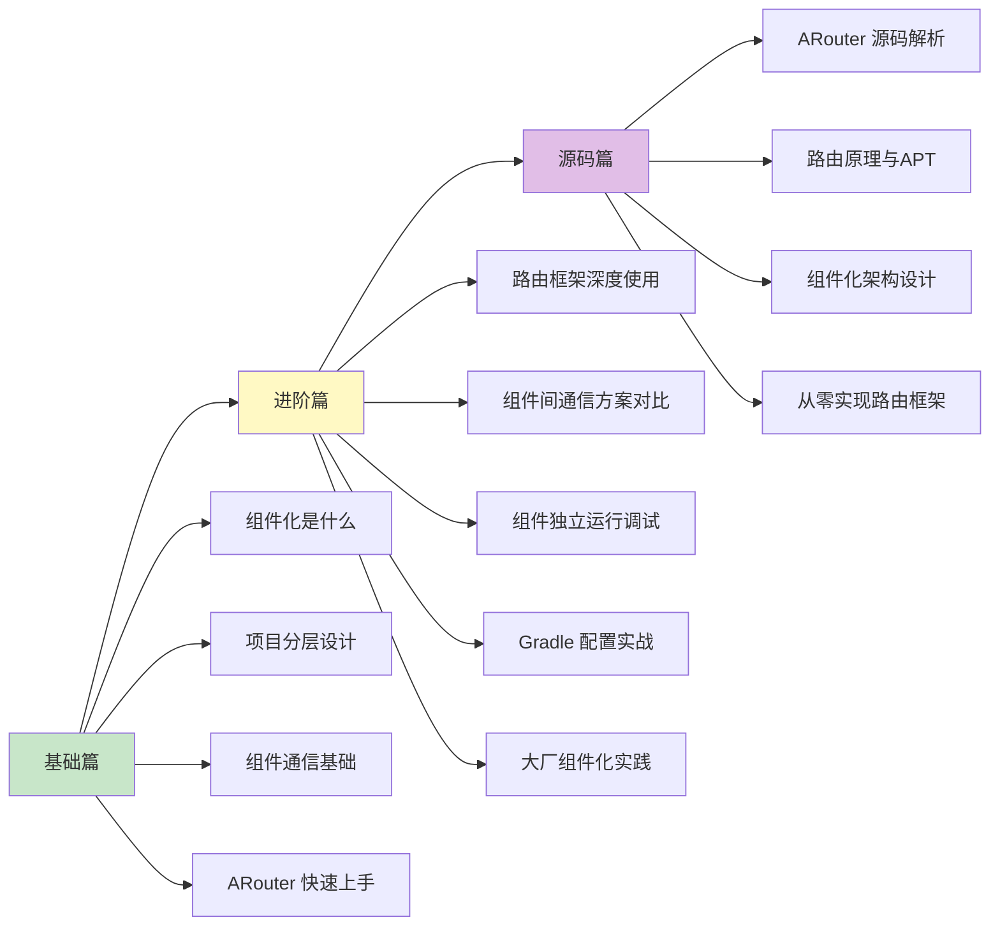

# 组件化（Componentization）知识体系

> 从入门到专家的完整学习路径 —— 让大型项目像搭积木一样开发

## 为什么要学组件化？

想象一下，你在做一道超大的拼图：
- 如果 1000 片混在一起，找一片要翻半天
- 如果按区域分成 10 盒，每盒 100 片，效率高多了
- 而且不同的人可以同时拼不同区域

组件化就是这个思路——**把一个大项目拆成多个独立的小项目（模块），每个模块专注做一件事**。

### 组件化解决什么问题？

| 问题 | 传统方案 | 组件化方案 |
|-----|---------|-----------|
| 编译太慢（10分钟+） | 忍着等 | 只编译改动的模块（1-2分钟） |
| 代码耦合严重 | 改一处牵动全身 | 模块独立，互不影响 |
| 多团队协作冲突 | 代码合并地狱 | 各团队负责独立模块 |
| 代码复用困难 | 到处复制粘贴 | 公共模块统一维护 |
| 功能难以独立测试 | 跑整个 App | 单独运行某个模块 |

## 组件化 vs 插件化 vs 模块化

这三个概念经常被混淆，一张表说清楚：

| 对比项 | 组件化 | 插件化 | 模块化 |
|-------|-------|-------|-------|
| **核心目的** | 代码解耦 + 团队协作 | 动态加载功能 | 代码分层组织 |
| **集成时机** | 编译时 | 运行时 | 编译时 |
| **能否单独运行** | ✅ 可以 | ✅ 可以 | ❌ 通常不行 |
| **技术复杂度** | ⭐⭐⭐ | ⭐⭐⭐⭐⭐ | ⭐⭐ |
| **典型场景** | 多团队大型项目 | 动态下发功能 | 任何项目的代码组织 |
| **代表框架** | ARouter、CC、TheRouter | RePlugin、Shadow | Gradle Module |

**一句话总结**：
- **模块化**是代码的物理拆分（按文件夹/Module 分）
- **组件化**是模块化的升级版（模块可以独立运行、独立打包）
- **插件化**是组件化的升级版（模块可以动态下载、动态加载）

```
模块化 < 组件化 < 插件化
（代码分层）（编译时独立）（运行时独立）
```

## 文档结构

```
Componentization/
├── README.md              # 本文件（目录索引）
├── 1-基础篇.md             # 初/中级开发者
├── 2-进阶篇.md             # 高级开发者
├── 3-源码篇.md             # 专家级
└── ARouter-设计思想.md     # 专题：ARouter 设计哲学深度解析
```

## 学习路线



## 各篇内容概览

### [1-基础篇](1-基础篇.md)

**适合人群**：Android 初/中级开发者、准备高级面试

| 知识点 | 内容 |
|-------|------|
| 技术演进 | 为什么需要组件化？解决了什么问题？ |
| 核心概念 | 壳工程、业务组件、基础组件等术语解释 |
| 项目分层 | 标准的组件化项目结构设计 |
| 组件通信 | 为什么不能直接依赖？如何通信？ |
| ARouter 入门 | 路由跳转、参数传递、服务调用 |
| 常见问题 | 新手容易踩的坑 |

### [2-进阶篇](2-进阶篇.md)

**适合人群**：有组件化使用经验、准备专家级面试

| 知识点 | 内容 |
|-------|------|
| 路由框架对比 | ARouter vs WMRouter vs TheRouter |
| 组件间通信 | 路由、接口下沉、EventBus、服务发现 |
| 组件独立运行 | 如何让业务组件单独跑起来调试 |
| Gradle 配置 | 依赖管理、版本统一、发布到 Maven |
| 资源隔离 | 避免资源冲突的最佳实践 |
| 大厂实践 | 美团、阿里、字节的组件化方案 |
| 边界认知 | 组件化的局限性和适用场景 |

### [3-源码篇](3-源码篇.md)

**适合人群**：准备 Android 专家级面试、想深入理解原理

| 知识点 | 内容 |
|-------|------|
| APT 原理 | 编译时注解处理是怎么工作的 |
| ARouter 源码 | 路由表生成、路由匹配、拦截器机制 |
| 服务发现原理 | SPI 机制与接口实现的动态查找 |
| 从零实现 | 手写简易路由框架 |
| 面试高频 | 专家级深度问题 |

### [ARouter-设计思想](ARouter-设计思想.md) 🆕

**适合人群**：想深入理解"为什么这么设计"的开发者

| 知识点 | 内容 |
|-------|------|
| 设计背景 | 传统跳转的困境，为什么需要路由 |
| 三大核心思想 | 编译时生成、分组懒加载、服务发现 |
| 架构全景图 | 模块划分、核心类职责、完整流程 |
| 核心优势 | 与直接依赖的对比、ARouter 四大优势 |
| 设计模式 | 外观、建造者、责任链等模式的应用 |
| 局限性 | 什么场景不适合用、演进方向 |

> 💡 **推荐阅读**：这篇专题不深入代码细节，重点讲清"设计思路"和"为什么"，适合快速建立整体认知。

## 面试覆盖程度

| 面试级别 | 需要掌握 |
|---------|---------|
| 中级 Android | 基础篇（了解概念和基本使用） |
| 高级 Android | 基础篇 + 进阶篇 |
| **Android 专家** | 基础篇 + 进阶篇 + 源码篇 |

## 快速查阅

### 主流路由框架速查

| 框架 | 公司 | 特点 | 维护状态 |
|-----|------|------|---------|
| ARouter | 阿里 | 功能全面，社区活跃，文档完善 | 活跃 |
| WMRouter | 美团 | 支持多路径匹配，功能丰富 | 活跃 |
| TheRouter | 货拉拉 | 支持 KSP，编译更快 | 活跃 |
| CC | 个人 | 跨组件调用，不仅限于路由 | 停更 |

### 核心技术速查

| 技术点 | 核心原理 | 所在文档 |
|-------|---------|---------|
| 路由跳转 | APT 生成路由表 + 反射创建 Activity | 基础篇 |
| 服务发现 | 接口下沉 + SPI 机制 | 进阶篇 |
| 组件隔离 | Gradle Module + api/implementation | 基础篇 |
| 独立运行 | isModule 开关 + 壳 Application | 进阶篇 |

### 常见问题速查

| 问题 | 原因 | 解决方案 | 所在文档 |
|-----|------|---------|---------|
| 路由跳转失败 | 路由表没生成 | 检查 annotationProcessor 配置 | 基础篇 |
| 组件间类找不到 | 依赖关系配置错误 | 接口下沉到公共模块 | 进阶篇 |
| 资源冲突 | 资源名称重复 | 添加模块前缀 resourcePrefix | 进阶篇 |
| 独立运行报错 | 缺少 Application | 配置独立运行的壳 Application | 进阶篇 |

## 技术选型建议

| 场景 | 推荐方案 | 原因 |
|-----|---------|------|
| 新项目 | TheRouter | 支持 KSP，编译更快 |
| 已有项目 | ARouter | 社区成熟，迁移成本低 |
| 美团技术栈 | WMRouter | 与美团其他组件配合好 |
| 学习原理 | ARouter | 文档完善，源码清晰 |

## 前置知识

学习组件化之前，建议先掌握：

| 知识点 | 重要程度 | 说明 |
|-------|---------|------|
| Gradle 基础 | ⭐⭐⭐⭐⭐ | 理解 Module、依赖配置 |
| 注解与反射 | ⭐⭐⭐⭐ | APT 的基础 |
| 设计模式 | ⭐⭐⭐⭐ | 依赖倒置、工厂模式 |
| Android 四大组件 | ⭐⭐⭐⭐ | Activity、Service 等 |

## 版本信息

本文档基于以下版本编写：

```kotlin
// build.gradle.kts (ARouter)
dependencies {
    implementation("com.alibaba:arouter-api:1.5.2")
    kapt("com.alibaba:arouter-compiler:1.5.2")
}

// build.gradle.kts (WMRouter)
dependencies {
    implementation("com.sankuai.waimai.router:router:1.5.1")
    kapt("com.sankuai.waimai.router:compiler:1.5.1")
}

// build.gradle.kts (TheRouter)
dependencies {
    implementation("cn.therouter:router:1.2.0")
    ksp("cn.therouter:apt:1.2.0")
}
```

---
_本文档将持续更新_
