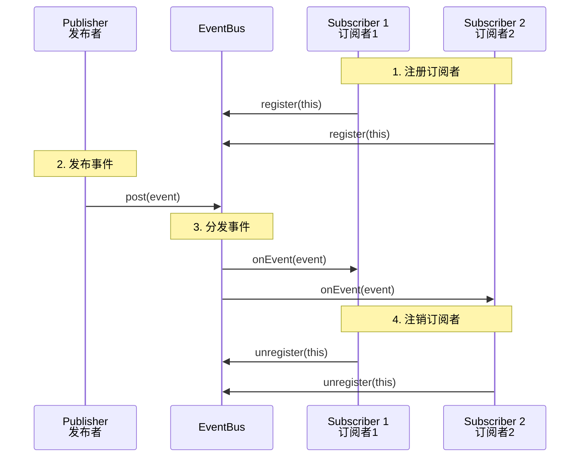

# EventBus 基础篇

## 技术演进：为什么需要事件总线？

### 从一个痛点说起

假设你有这样的需求：用户在 `SettingActivity` 修改了头像，需要同时更新 `MainActivity` 的侧边栏和 `ProfileFragment` 的头像展示。

**传统做法：接口回调**

```kotlin
// 定义回调接口
interface OnAvatarChangeListener {
    fun onAvatarChanged(newAvatarUrl: String)
}

// MainActivity 实现接口
class MainActivity : AppCompatActivity(), OnAvatarChangeListener {
    override fun onAvatarChanged(newAvatarUrl: String) {
        sidebarView.updateAvatar(newAvatarUrl)
    }
}

// ProfileFragment 实现接口
class ProfileFragment : Fragment(), OnAvatarChangeListener {
    override fun onAvatarChanged(newAvatarUrl: String) {
        avatarImageView.load(newAvatarUrl)
    }
}

// SettingActivity 需要持有所有监听者的引用
class SettingActivity : AppCompatActivity() {
    private val listeners = mutableListOf<OnAvatarChangeListener>()
    
    fun addListener(listener: OnAvatarChangeListener) {
        listeners.add(listener)
    }
    
    private fun onAvatarUpdated(newUrl: String) {
        listeners.forEach { it.onAvatarChanged(newUrl) }
    }
}
```

**问题来了**：
1. **紧耦合**：`SettingActivity` 需要知道谁对头像变化感兴趣
2. **管理复杂**：监听者列表需要手动维护，容易内存泄漏
3. **代码分散**：监听者注册代码散落各处，难以追踪
4. **扩展困难**：新增监听者需要修改 `SettingActivity`

### 发布-订阅模式的解法

事件总线就像公司的公告板系统：

```
┌─────────────────────────────────────────────────────────────────────────────┐
│                          公司公告板系统                                      │
├─────────────────────────────────────────────────────────────────────────────┤
│                                                                             │
│  传统方式（点对点通知）：                                                     │
│  ┌─────────┐                   ┌─────────┐                                  │
│  │ HR 部门  │ ──→ 电话通知 ──→ │ 员工 A   │                                  │
│  │         │ ──→ 电话通知 ──→ │ 员工 B   │  ← 需要知道每个员工的联系方式      │
│  │         │ ──→ 电话通知 ──→ │ 员工 C   │                                  │
│  └─────────┘                   └─────────┘                                  │
│                                                                             │
│  公告板方式（发布-订阅）：                                                    │
│  ┌─────────┐       ┌─────────┐       ┌─────────┐                           │
│  │ HR 部门  │ ──→  │  公告板  │  ←── │ 员工 ABC │  ← 发布者和订阅者互不认识   │
│  └─────────┘       └─────────┘       └─────────┘                           │
│                    （EventBus）                                             │
│                                                                             │
└─────────────────────────────────────────────────────────────────────────────┘
```

使用 EventBus 后，代码变成这样：

```kotlin
// 1. 定义事件（公告内容）
data class AvatarChangedEvent(val newAvatarUrl: String)

// 2. 发布者：只管发布，不管谁接收
class SettingActivity : AppCompatActivity() {
    private fun onAvatarUpdated(newUrl: String) {
        EventBus.getDefault().post(AvatarChangedEvent(newUrl))
    }
}

// 3. 订阅者：只管订阅，不管谁发布
class MainActivity : AppCompatActivity() {
    @Subscribe(threadMode = ThreadMode.MAIN)
    fun onAvatarChanged(event: AvatarChangedEvent) {
        sidebarView.updateAvatar(event.newAvatarUrl)
    }
}

class ProfileFragment : Fragment() {
    @Subscribe(threadMode = ThreadMode.MAIN)
    fun onAvatarChanged(event: AvatarChangedEvent) {
        avatarImageView.load(event.newAvatarUrl)
    }
}
```

**优势一目了然**：
- 发布者和订阅者完全解耦
- 新增订阅者不需要修改发布者
- 代码简洁，逻辑清晰

## 核心概念

### EventBus 三要素

| 要素 | 说明 | 类比 |
|-----|------|------|
| **Event** | 事件对象，携带数据 | 公告内容 |
| **Publisher** | 事件发布者，调用 `post()` | 贴公告的人 |
| **Subscriber** | 事件订阅者，用 `@Subscribe` 标注的方法 | 看公告的人 |

### 工作流程



## 快速上手

### 第一步：添加依赖

```groovy
// build.gradle (Module)
dependencies {
    implementation 'org.greenrobot:eventbus:3.3.1'
    
    // 可选：APT 优化（后面会讲）
    kapt 'org.greenrobot:eventbus-annotation-processor:3.3.1'
}
```

### 第二步：定义事件类

```kotlin
// 事件类就是普通的数据类
// 建议：用 data class，命名以 Event 结尾

// 简单事件
data class LoginSuccessEvent(val userId: String)

// 带多个字段的事件
data class MessageReceivedEvent(
    val messageId: String,
    val content: String,
    val sendTime: Long
)

// 无参事件（用 object 更节省内存）
object LogoutEvent
```

> **命名规范建议**：`[动作][对象]Event`，如 `LoginSuccessEvent`、`OrderPaidEvent`

### 第三步：注册/注销订阅者

```kotlin
class MainActivity : AppCompatActivity() {
    
    override fun onStart() {
        super.onStart()
        // 注册（开始接收事件）
        EventBus.getDefault().register(this)
    }
    
    override fun onStop() {
        super.onStop()
        // 注销（停止接收事件）
        EventBus.getDefault().unregister(this)
    }
}
```

**注册时机选择**：

| 生命周期对 | 适用场景 |
|-----------|---------|
| `onCreate` / `onDestroy` | 整个生命周期都需要接收事件 |
| `onStart` / `onStop` | 只在可见时接收事件（推荐） |
| `onResume` / `onPause` | 只在前台时接收事件 |

### 第四步：订阅事件

```kotlin
class MainActivity : AppCompatActivity() {
    
    // 使用 @Subscribe 注解标记订阅方法
    // 方法名随意，参数类型决定接收哪种事件
    @Subscribe(threadMode = ThreadMode.MAIN)
    fun onLoginSuccess(event: LoginSuccessEvent) {
        // 更新 UI
        welcomeText.text = "欢迎，用户 ${event.userId}"
    }
    
    // 可以订阅多个事件
    @Subscribe(threadMode = ThreadMode.MAIN)
    fun onLogout(event: LogoutEvent) {
        // 处理登出
        finish()
    }
}
```

### 第五步：发布事件

```kotlin
class LoginActivity : AppCompatActivity() {
    
    private fun performLogin() {
        // 登录成功后发布事件
        val userId = "user_123"
        EventBus.getDefault().post(LoginSuccessEvent(userId))
    }
}
```

## 五种线程模式

EventBus 最强大的特性之一是**自动线程切换**。通过 `threadMode` 参数，可以指定订阅方法在哪个线程执行。

### 线程模式对比

| 模式 | 执行线程 | 是否阻塞发布者 | 适用场景 |
|-----|---------|--------------|---------|
| `POSTING` | 与发布者相同 | 是 | 不涉及 UI，追求高性能 |
| `MAIN` | 主线程 | 是（若在主线程发布） | 更新 UI |
| `MAIN_ORDERED` | 主线程（排队） | 否 | 更新 UI，避免阻塞 |
| `BACKGROUND` | 后台线程 | 否 | 耗时操作，如写文件 |
| `ASYNC` | 独立线程 | 否 | 长时间耗时操作 |

### 1. POSTING（默认）

```kotlin
@Subscribe(threadMode = ThreadMode.POSTING)
fun onEvent(event: SomeEvent) {
    // 在发布事件的线程执行
    // 如果在主线程发布，这里就是主线程
    // 如果在子线程发布，这里就是子线程
}
```

**特点**：零开销，不做线程切换，执行完订阅者方法才返回。

**适用场景**：对性能要求高，且不涉及 UI 操作。

### 2. MAIN

```kotlin
@Subscribe(threadMode = ThreadMode.MAIN)
fun onEvent(event: SomeEvent) {
    // 总是在主线程执行
    textView.text = event.data  // 可以安全操作 UI
}
```

**特点**：
- 如果发布者在主线程，直接调用（同步执行）
- 如果发布者在子线程，通过 Handler 切换到主线程

**适用场景**：需要更新 UI。

### 3. MAIN_ORDERED（推荐用于 UI）

```kotlin
@Subscribe(threadMode = ThreadMode.MAIN_ORDERED)
fun onEvent(event: SomeEvent) {
    // 总是在主线程执行，但通过 Handler.post() 入队
    textView.text = event.data
}
```

**与 MAIN 的区别**：

```
┌────────────────────────────────────────────────────────────────┐
│  发布者在主线程时：                                              │
├────────────────────────────────────────────────────────────────┤
│  MAIN：       post() → 直接调用订阅者 → post() 返回             │
│               （订阅者执行完才返回，可能造成卡顿）                 │
│                                                                │
│  MAIN_ORDERED: post() → 入队 → post() 立即返回 → 稍后执行订阅者  │
│               （post() 永远不阻塞，订阅者按顺序执行）             │
└────────────────────────────────────────────────────────────────┘
```

**适用场景**：UI 更新，特别是发布者也在主线程时，避免阻塞。

### 4. BACKGROUND

```kotlin
@Subscribe(threadMode = ThreadMode.BACKGROUND)
fun onEvent(event: DataEvent) {
    // 总是在后台线程执行
    saveToDatabase(event.data)  // 可以执行耗时操作
}
```

**特点**：
- 如果发布者在子线程，直接调用
- 如果发布者在主线程，切换到后台线程池

**注意**：所有 BACKGROUND 订阅者共享一个后台线程，不要做太长时间的阻塞操作。

### 5. ASYNC

```kotlin
@Subscribe(threadMode = ThreadMode.ASYNC)
fun onEvent(event: LargeFileEvent) {
    // 总是在独立的新线程执行
    downloadLargeFile(event.url)  // 适合长时间操作
}
```

**特点**：每次都从线程池获取线程，不阻塞发布者和其他订阅者。

**适用场景**：长时间的网络请求、大文件操作。

### 线程模式选择指南

```
开始
  │
  ├─→ 需要更新 UI？
  │     ├─ 是 ─→ MAIN_ORDERED（推荐）或 MAIN
  │     └─ 否 ─→ 继续
  │
  ├─→ 操作耗时吗？
  │     ├─ 很长（>100ms）─→ ASYNC
  │     ├─ 较短（<100ms）─→ BACKGROUND  
  │     └─ 几乎不耗时 ─→ POSTING（最高性能）
  │
  └─→ 默认用 MAIN_ORDERED
```

## 粘性事件（Sticky Event）

### 什么是粘性事件？

普通事件必须先订阅后发布才能收到。但有时我们需要：**先发布事件，后来的订阅者也能收到**。

**场景举例**：
- 登录成功后发布 `LoginEvent`，后打开的页面也需要知道登录状态
- 下载完成后发布 `DownloadCompleteEvent`，用户返回下载页面时要显示完成状态

这就是**粘性事件**——事件会"粘"在那里，新订阅者一来就能收到。

### 使用方式

```kotlin
// 1. 发布粘性事件（用 postSticky 代替 post）
EventBus.getDefault().postSticky(LoginSuccessEvent(userId))

// 2. 订阅粘性事件（设置 sticky = true）
@Subscribe(threadMode = ThreadMode.MAIN, sticky = true)
fun onLoginSuccess(event: LoginSuccessEvent) {
    // 如果之前发布过粘性事件，注册时会立即收到
    updateLoginState(event.userId)
}
```

### 移除粘性事件

粘性事件不会自动消失，需要手动移除：

```kotlin
// 移除特定类型的粘性事件
EventBus.getDefault().removeStickyEvent(LoginSuccessEvent::class.java)

// 移除特定事件对象
val stickyEvent = EventBus.getDefault().getStickyEvent(LoginSuccessEvent::class.java)
if (stickyEvent != null) {
    EventBus.getDefault().removeStickyEvent(stickyEvent)
}

// 移除所有粘性事件
EventBus.getDefault().removeAllStickyEvents()
```

### 粘性事件 vs 普通事件

| 特性 | 普通事件 | 粘性事件 |
|-----|---------|---------|
| 发布方法 | `post()` | `postSticky()` |
| 生命周期 | 分发完即销毁 | 保留直到手动移除 |
| 新订阅者 | 收不到之前的事件 | 立即收到最后一个 |
| 内存占用 | 低 | 会一直占用内存 |
| 使用场景 | 实时通知 | 状态同步 |

## 常见坑点

### 坑点1：忘记注销导致内存泄漏

```kotlin
// ❌ 错误：只注册不注销
class BadActivity : AppCompatActivity() {
    override fun onCreate(savedInstanceState: Bundle?) {
        super.onCreate(savedInstanceState)
        EventBus.getDefault().register(this)
    }
    // 没有 unregister！Activity 退出后还在订阅列表中
}
```

**正确做法**：

```kotlin
// ✅ 正确：成对的注册/注销
class GoodActivity : AppCompatActivity() {
    override fun onStart() {
        super.onStart()
        EventBus.getDefault().register(this)
    }
    
    override fun onStop() {
        super.onStop()
        EventBus.getDefault().unregister(this)
    }
}
```

### 坑点2：重复注册导致崩溃

```kotlin
// ❌ 错误：重复注册
override fun onResume() {
    super.onResume()
    EventBus.getDefault().register(this)  // 每次 onResume 都注册
}
// 第二次进入页面时崩溃：Subscriber already registered
```

**正确做法**：

```kotlin
// ✅ 方案1：注册前检查
if (!EventBus.getDefault().isRegistered(this)) {
    EventBus.getDefault().register(this)
}

// ✅ 方案2：在正确的生命周期成对使用（推荐）
override fun onStart() {
    super.onStart()
    EventBus.getDefault().register(this)
}

override fun onStop() {
    super.onStop()
    EventBus.getDefault().unregister(this)
}
```

### 坑点3：订阅方法必须是 public

```kotlin
// ❌ 错误：private 方法无法被 EventBus 找到
@Subscribe(threadMode = ThreadMode.MAIN)
private fun onEvent(event: SomeEvent) {  // 不会收到事件！
    // ...
}

// ✅ 正确：必须是 public（Kotlin 默认就是 public）
@Subscribe(threadMode = ThreadMode.MAIN)
fun onEvent(event: SomeEvent) {
    // ...
}
```

### 坑点4：混淆导致事件收不到

ProGuard/R8 可能混淆订阅方法，导致运行时找不到：

```proguard
# proguard-rules.pro
-keepattributes *Annotation*
-keepclassmembers class * {
    @org.greenrobot.eventbus.Subscribe <methods>;
}
-keep enum org.greenrobot.eventbus.ThreadMode { *; }

# 如果使用了 EventBus 索引
-keepclassmembers class * extends org.greenrobot.eventbus.util.ThrowableFailureEvent {
    <init>(java.lang.Throwable);
}
```

### 坑点5：粘性事件不清理导致数据错乱

```kotlin
// ❌ 错误：粘性事件没有及时清理
// 用户 A 登录 → 发布 LoginEvent(A)
// 用户 A 登出
// 用户 B 登录 → 新页面收到的还是 A 的登录信息！

// ✅ 正确：登出时清理粘性事件
fun logout() {
    EventBus.getDefault().removeStickyEvent(LoginEvent::class.java)
    EventBus.getDefault().post(LogoutEvent)
}
```

## 小结

| 要点 | 说明 |
|-----|------|
| 核心作用 | 组件间解耦通信 |
| 三步上手 | 注册 → 订阅（@Subscribe）→ 发布（post） |
| 线程模式 | POSTING/MAIN/MAIN_ORDERED/BACKGROUND/ASYNC |
| 粘性事件 | postSticky + sticky=true，记得手动清理 |
| 生命周期 | 必须成对 register/unregister |

---

## 面试题检验

### Q1：什么是事件总线？EventBus 解决了什么问题？

**结论**：事件总线是基于发布-订阅模式的组件通信机制，解决了组件间紧耦合、回调地狱等问题。

**原理**：发布者只需发布事件，订阅者只需订阅关心的事件类型，双方通过 EventBus 这个"中间人"通信，互不认识、互不依赖。

**对比**：传统接口回调需要发布者持有所有订阅者引用，新增订阅者要修改发布者代码；EventBus 实现了真正的解耦。

---

### Q2：EventBus 的五种线程模式分别在什么场景使用？

**结论**：
- `POSTING`：高性能场景，不涉及 UI
- `MAIN`：更新 UI，可能阻塞发布者
- `MAIN_ORDERED`：更新 UI，不阻塞发布者（推荐）
- `BACKGROUND`：短耗时操作
- `ASYNC`：长耗时操作

**原理**：EventBus 内部通过 Handler（切主线程）和线程池（切后台）实现线程切换。MAIN 在主线程发布时直接调用，MAIN_ORDERED 始终通过 Handler.post() 入队。

---

### Q3：什么是粘性事件？和普通事件有什么区别？

**结论**：粘性事件会被保留，新订阅者注册时能立即收到最后一个粘性事件；普通事件分发完就销毁。

**原理**：EventBus 内部用 Map 存储粘性事件（key 是事件类型），新订阅者注册时检查是否有对应的粘性事件。

**场景举例**：登录状态同步——登录成功后发布粘性事件，后打开的页面注册时立即收到登录状态。

---

### Q4：EventBus 使用不当会导致内存泄漏吗？怎么避免？

**结论**：会的。如果忘记 unregister，Activity/Fragment 退出后仍被 EventBus 持有引用。

**避免方法**：
1. 在 `onStart`/`onStop` 或 `onResume`/`onPause` 成对注册/注销
2. 使用 Lifecycle 感知组件自动管理
3. 粘性事件用完及时 remove

---

### Q5：EventBus 的 @Subscribe 方法有什么要求？

**结论**：必须是 public 方法，有且仅有一个参数（事件类型），返回值必须是 void。

**原理**：EventBus 通过反射或 APT 查找带 `@Subscribe` 注解的方法，方法签名不符合要求会被忽略或报错。

**注意**：Kotlin 方法默认是 public；混淆时需要 keep 订阅方法。

---

_本文档将持续更新，添加更多相关内容_
