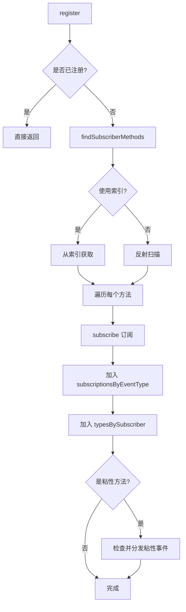
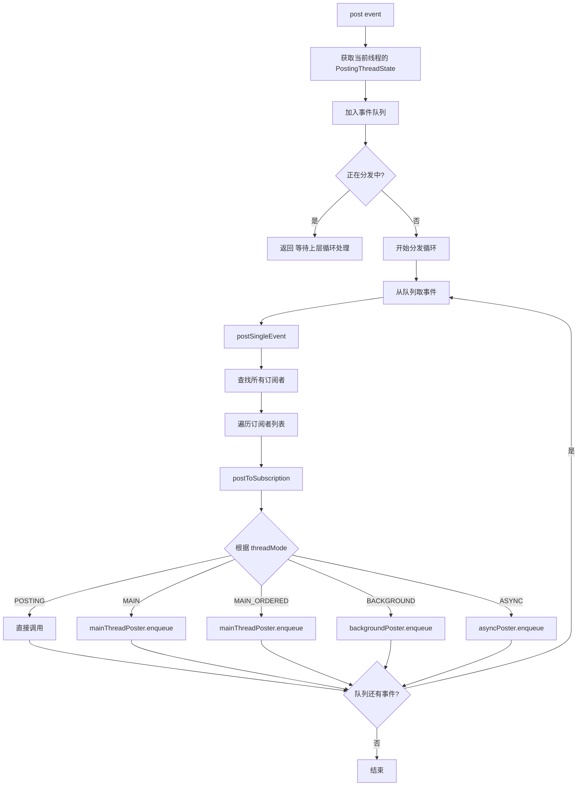

# EventBus 源码篇

## 设计哲学

### 一句话总结

EventBus 的核心就是一个**订阅者注册表**（Map）+ **事件分发器**，通过反射或 APT 找到订阅方法，根据 threadMode 切换线程后调用。

### 设计理念

```
┌─────────────────────────────────────────────────────────────────────────────┐
│                        EventBus 核心设计                                     │
├─────────────────────────────────────────────────────────────────────────────┤
│                                                                             │
│  1. 单例模式 + Builder 模式                                                  │
│     └─ 全局唯一的事件中心，支持灵活配置                                       │
│                                                                             │
│  2. 注册表设计                                                               │
│     └─ 事件类型 → 订阅者列表 的映射，快速找到所有订阅者                        │
│                                                                             │
│  3. 订阅者查找                                                               │
│     └─ 反射（灵活）vs APT（高性能），可配置                                   │
│                                                                             │
│  4. 线程调度                                                                 │
│     └─ Poster 抽象，不同 threadMode 用不同 Poster                            │
│                                                                             │
│  5. 对象池                                                                   │
│     └─ 复用 PendingPost 对象，减少 GC                                        │
│                                                                             │
└─────────────────────────────────────────────────────────────────────────────┘
```

## 核心数据结构

### 订阅者注册表

EventBus 的核心是两个 Map：

```kotlin
// EventBus.java 核心字段（简化）
class EventBus {
    
    // 核心注册表：事件类型 → 订阅信息列表
    // 发布事件时，通过这个 Map 找到所有订阅者
    private val subscriptionsByEventType: MutableMap<Class<*>, CopyOnWriteArrayList<Subscription>>
    
    // 反向索引：订阅者对象 → 它订阅的所有事件类型
    // 注销时，通过这个 Map 快速找到要移除的订阅
    private val typesBySubscriber: MutableMap<Any, MutableList<Class<*>>>
    
    // 粘性事件存储：事件类型 → 最后一个粘性事件
    private val stickyEvents: MutableMap<Class<*>, Any>
}
```

```
┌─────────────────────────────────────────────────────────────────────────────┐
│                        subscriptionsByEventType                             │
├─────────────────────────────────────────────────────────────────────────────┤
│                                                                             │
│  LoginEvent.class  ──→  [ Subscription(MainActivity, method1, MAIN)        │
│                          Subscription(ProfileFragment, method2, MAIN) ]    │
│                                                                             │
│  LogoutEvent.class ──→  [ Subscription(MainActivity, method3, MAIN)        │
│                          Subscription(SettingActivity, method4, MAIN) ]    │
│                                                                             │
└─────────────────────────────────────────────────────────────────────────────┘

┌─────────────────────────────────────────────────────────────────────────────┐
│                          typesBySubscriber                                  │
├─────────────────────────────────────────────────────────────────────────────┤
│                                                                             │
│  MainActivity      ──→  [ LoginEvent.class, LogoutEvent.class ]            │
│  ProfileFragment   ──→  [ LoginEvent.class ]                               │
│  SettingActivity   ──→  [ LogoutEvent.class ]                              │
│                                                                             │
└─────────────────────────────────────────────────────────────────────────────┘
```

### Subscription 结构

```kotlin
// 订阅信息：订阅者 + 订阅方法
class Subscription(
    val subscriber: Any,              // 订阅者对象（如 Activity）
    val subscriberMethod: SubscriberMethod  // 订阅方法信息
)

// 订阅方法信息
class SubscriberMethod(
    val method: Method,               // 反射的 Method 对象
    val threadMode: ThreadMode,       // 线程模式
    val eventType: Class<*>,          // 事件类型
    val priority: Int,                // 优先级
    val sticky: Boolean               // 是否粘性
)
```

## 核心流程分析

### 注册流程



**关键源码**：

```java
// EventBus.register() 核心逻辑
public void register(Object subscriber) {
    Class<?> subscriberClass = subscriber.getClass();
    
    // 1. 查找订阅方法（反射或索引）
    List<SubscriberMethod> subscriberMethods = subscriberMethodFinder.findSubscriberMethods(subscriberClass);
    
    synchronized (this) {
        // 2. 逐个订阅
        for (SubscriberMethod subscriberMethod : subscriberMethods) {
            subscribe(subscriber, subscriberMethod);
        }
    }
}

// 订阅单个方法
private void subscribe(Object subscriber, SubscriberMethod subscriberMethod) {
    Class<?> eventType = subscriberMethod.eventType;
    Subscription newSubscription = new Subscription(subscriber, subscriberMethod);
    
    // 3. 加入 subscriptionsByEventType
    CopyOnWriteArrayList<Subscription> subscriptions = subscriptionsByEventType.get(eventType);
    if (subscriptions == null) {
        subscriptions = new CopyOnWriteArrayList<>();
        subscriptionsByEventType.put(eventType, subscriptions);
    }
    
    // 按优先级插入正确位置
    int size = subscriptions.size();
    for (int i = 0; i <= size; i++) {
        if (i == size || subscriberMethod.priority > subscriptions.get(i).subscriberMethod.priority) {
            subscriptions.add(i, newSubscription);
            break;
        }
    }
    
    // 4. 加入 typesBySubscriber（反向索引）
    List<Class<?>> subscribedEvents = typesBySubscriber.get(subscriber);
    if (subscribedEvents == null) {
        subscribedEvents = new ArrayList<>();
        typesBySubscriber.put(subscriber, subscribedEvents);
    }
    subscribedEvents.add(eventType);
    
    // 5. 处理粘性事件
    if (subscriberMethod.sticky) {
        Object stickyEvent = stickyEvents.get(eventType);
        if (stickyEvent != null) {
            postToSubscription(newSubscription, stickyEvent, isMainThread());
        }
    }
}
```

### 订阅者查找机制

EventBus 支持两种方式查找订阅方法：

#### 方式1：反射查找

```java
// SubscriberMethodFinder.findUsingReflection() 简化版
private List<SubscriberMethod> findUsingReflection(Class<?> subscriberClass) {
    List<SubscriberMethod> subscriberMethods = new ArrayList<>();
    Class<?> clazz = subscriberClass;
    
    while (clazz != null) {
        // 遍历所有方法
        for (Method method : clazz.getDeclaredMethods()) {
            // 查找 @Subscribe 注解
            Subscribe subscribeAnnotation = method.getAnnotation(Subscribe.class);
            if (subscribeAnnotation != null) {
                // 检查方法签名：必须是 public，只有一个参数
                Class<?>[] parameterTypes = method.getParameterTypes();
                if (parameterTypes.length == 1) {
                    // 创建 SubscriberMethod
                    SubscriberMethod subscriberMethod = new SubscriberMethod(
                        method,
                        subscribeAnnotation.threadMode(),
                        parameterTypes[0],  // 事件类型
                        subscribeAnnotation.priority(),
                        subscribeAnnotation.sticky()
                    );
                    subscriberMethods.add(subscriberMethod);
                }
            }
        }
        // 向上查找父类
        clazz = clazz.getSuperclass();
    }
    return subscriberMethods;
}
```

**反射的问题**：
- 运行时开销：每次注册都要扫描类的所有方法
- 混淆问题：方法名被混淆后可能找不到
- 性能：注册订阅者约需 1ms

#### 方式2：APT 索引

编译时生成索引类，避免运行时反射：

```java
// APT 生成的索引类（示例）
public class MyEventBusIndex implements SubscriberInfoIndex {
    
    private static final Map<Class<?>, SubscriberInfo> SUBSCRIBER_INDEX;
    
    static {
        SUBSCRIBER_INDEX = new HashMap<>();
        
        // 编译时收集的订阅信息
        putIndex(new SimpleSubscriberInfo(
            MainActivity.class,
            true,  // shouldCheckSuperclass
            new SubscriberMethodInfo[] {
                new SubscriberMethodInfo("onLoginSuccess", LoginEvent.class, ThreadMode.MAIN),
                new SubscriberMethodInfo("onLogout", LogoutEvent.class, ThreadMode.MAIN, 0, true),
            }
        ));
    }
    
    @Override
    public SubscriberInfo getSubscriberInfo(Class<?> subscriberClass) {
        return SUBSCRIBER_INDEX.get(subscriberClass);
    }
}
```

**索引的优势**：
- 无运行时反射，注册约需 0.1ms
- 编译时检查，更早发现问题
- 无混淆问题

### 事件发布流程



**关键源码**：

```java
// EventBus.post() 核心逻辑
public void post(Object event) {
    // 1. 获取当前线程的发布状态（ThreadLocal）
    PostingThreadState postingState = currentPostingThreadState.get();
    List<Object> eventQueue = postingState.eventQueue;
    
    // 2. 加入队列
    eventQueue.add(event);
    
    // 3. 如果不是正在发布，开始发布循环
    if (!postingState.isPosting) {
        postingState.isMainThread = isMainThread();
        postingState.isPosting = true;
        try {
            while (!eventQueue.isEmpty()) {
                // 取出队首事件并分发
                postSingleEvent(eventQueue.remove(0), postingState);
            }
        } finally {
            postingState.isPosting = false;
            postingState.isMainThread = false;
        }
    }
}

// 分发单个事件
private void postSingleEvent(Object event, PostingThreadState postingState) {
    Class<?> eventClass = event.getClass();
    
    // 查找所有订阅该事件类型的订阅者
    CopyOnWriteArrayList<Subscription> subscriptions = subscriptionsByEventType.get(eventClass);
    
    if (subscriptions != null && !subscriptions.isEmpty()) {
        for (Subscription subscription : subscriptions) {
            postingState.event = event;
            postingState.subscription = subscription;
            
            // 分发给单个订阅者
            postToSubscription(subscription, event, postingState.isMainThread);
            
            // 检查是否被取消
            if (postingState.canceled) {
                break;
            }
        }
    }
}
```

### 线程切换机制

EventBus 通过 **Poster** 接口抽象线程切换：

```java
// 分发到具体订阅者
private void postToSubscription(Subscription subscription, Object event, boolean isMainThread) {
    switch (subscription.subscriberMethod.threadMode) {
        case POSTING:
            // 直接在当前线程调用
            invokeSubscriber(subscription, event);
            break;
            
        case MAIN:
            if (isMainThread) {
                // 已在主线程，直接调用
                invokeSubscriber(subscription, event);
            } else {
                // 切换到主线程
                mainThreadPoster.enqueue(subscription, event);
            }
            break;
            
        case MAIN_ORDERED:
            // 总是通过 Handler 入队
            if (mainThreadPoster != null) {
                mainThreadPoster.enqueue(subscription, event);
            } else {
                invokeSubscriber(subscription, event);
            }
            break;
            
        case BACKGROUND:
            if (isMainThread) {
                // 切换到后台线程
                backgroundPoster.enqueue(subscription, event);
            } else {
                // 已在后台线程，直接调用
                invokeSubscriber(subscription, event);
            }
            break;
            
        case ASYNC:
            // 总是使用线程池
            asyncPoster.enqueue(subscription, event);
            break;
    }
}
```

#### MainThreadPoster（主线程 Poster）

```java
// HandlerPoster.java（Android 实现）
public class HandlerPoster extends Handler implements Poster {
    private final PendingPostQueue queue;
    private boolean handlerActive;
    
    @Override
    public void enqueue(Subscription subscription, Object event) {
        // 从对象池获取 PendingPost
        PendingPost pendingPost = PendingPost.obtainPendingPost(subscription, event);
        synchronized (this) {
            queue.enqueue(pendingPost);
            if (!handlerActive) {
                handlerActive = true;
                // 发送空消息，触发 handleMessage
                if (!sendMessage(obtainMessage())) {
                    throw new EventBusException("Could not send handler message");
                }
            }
        }
    }
    
    @Override
    public void handleMessage(Message msg) {
        boolean rescheduled = false;
        try {
            long started = SystemClock.uptimeMillis();
            // 循环处理队列中的事件
            while (true) {
                PendingPost pendingPost = queue.poll();
                if (pendingPost == null) {
                    synchronized (this) {
                        pendingPost = queue.poll();
                        if (pendingPost == null) {
                            handlerActive = false;
                            return;
                        }
                    }
                }
                // 调用订阅者方法
                eventBus.invokeSubscriber(pendingPost);
                
                // 防止主线程卡顿：超过 10ms 就让出
                long timeInMethod = SystemClock.uptimeMillis() - started;
                if (timeInMethod >= maxMillisInsideHandleMessage) {
                    if (!sendMessage(obtainMessage())) {
                        throw new EventBusException("Could not send handler message");
                    }
                    rescheduled = true;
                    return;
                }
            }
        } finally {
            handlerActive = rescheduled;
        }
    }
}
```

**设计亮点**：
1. **批量处理**：一次 handleMessage 处理多个事件，减少消息发送
2. **超时让出**：处理超过 10ms 就让出主线程，避免 ANR
3. **对象池**：PendingPost 复用，减少 GC

#### BackgroundPoster（后台 Poster）

```java
// BackgroundPoster.java
final class BackgroundPoster implements Runnable, Poster {
    private final PendingPostQueue queue;
    private volatile boolean executorRunning;
    
    @Override
    public void enqueue(Subscription subscription, Object event) {
        PendingPost pendingPost = PendingPost.obtainPendingPost(subscription, event);
        synchronized (this) {
            queue.enqueue(pendingPost);
            if (!executorRunning) {
                executorRunning = true;
                // 提交到线程池
                eventBus.getExecutorService().execute(this);
            }
        }
    }
    
    @Override
    public void run() {
        try {
            try {
                // 在同一个后台线程处理所有事件
                while (true) {
                    PendingPost pendingPost = queue.poll(1000);  // 等待1秒
                    if (pendingPost == null) {
                        synchronized (this) {
                            pendingPost = queue.poll();
                            if (pendingPost == null) {
                                executorRunning = false;
                                return;
                            }
                        }
                    }
                    eventBus.invokeSubscriber(pendingPost);
                }
            } catch (InterruptedException e) {
                // 忽略
            }
        } finally {
            executorRunning = false;
        }
    }
}
```

**设计亮点**：
1. **单线程处理**：所有 BACKGROUND 事件在同一个后台线程串行处理
2. **按需启动**：只有有事件时才启动线程

#### AsyncPoster（异步 Poster）

```java
// AsyncPoster.java
class AsyncPoster implements Runnable, Poster {
    private final PendingPostQueue queue;
    
    @Override
    public void enqueue(Subscription subscription, Object event) {
        PendingPost pendingPost = PendingPost.obtainPendingPost(subscription, event);
        queue.enqueue(pendingPost);
        // 每个事件都提交到线程池
        eventBus.getExecutorService().execute(this);
    }
    
    @Override
    public void run() {
        PendingPost pendingPost = queue.poll();
        if (pendingPost == null) {
            throw new IllegalStateException("No pending post available");
        }
        eventBus.invokeSubscriber(pendingPost);
    }
}
```

**特点**：每个事件都在独立线程执行，并发度高。

### 粘性事件机制

```java
// 发布粘性事件
public void postSticky(Object event) {
    synchronized (stickyEvents) {
        // 存储到 stickyEvents Map
        stickyEvents.put(event.getClass(), event);
    }
    // 同时发布普通事件（已注册的订阅者会收到）
    post(event);
}

// 注册时检查粘性事件（在 subscribe 方法中）
if (subscriberMethod.sticky) {
    Object stickyEvent = stickyEvents.get(eventType);
    if (stickyEvent != null) {
        // 立即分发给新订阅者
        postToSubscription(newSubscription, stickyEvent, isMainThread());
    }
}
```

## 设计亮点

### 1. ThreadLocal 隔离发布状态

```java
// 每个线程独立的发布状态，避免并发问题
private final ThreadLocal<PostingThreadState> currentPostingThreadState = new ThreadLocal<PostingThreadState>() {
    @Override
    protected PostingThreadState initialValue() {
        return new PostingThreadState();
    }
};

// 发布状态
final class PostingThreadState {
    final List<Object> eventQueue = new ArrayList<>();  // 事件队列
    boolean isPosting;      // 是否正在发布
    boolean isMainThread;   // 是否在主线程
    Subscription subscription;  // 当前订阅
    Object event;           // 当前事件
    boolean canceled;       // 是否取消
}
```

**好处**：
- 线程安全，无需加锁
- 支持在事件处理中发布新事件（入队）
- 避免递归调用导致的栈溢出

### 2. 对象池复用

```java
// PendingPost 对象池
final class PendingPost {
    private static final List<PendingPost> pendingPostPool = new ArrayList<>();
    
    // 从池中获取
    static PendingPost obtainPendingPost(Subscription subscription, Object event) {
        synchronized (pendingPostPool) {
            int size = pendingPostPool.size();
            if (size > 0) {
                PendingPost pendingPost = pendingPostPool.remove(size - 1);
                pendingPost.event = event;
                pendingPost.subscription = subscription;
                pendingPost.next = null;
                return pendingPost;
            }
        }
        return new PendingPost(event, subscription);
    }
    
    // 归还到池
    static void releasePendingPost(PendingPost pendingPost) {
        pendingPost.event = null;
        pendingPost.subscription = null;
        pendingPost.next = null;
        synchronized (pendingPostPool) {
            if (pendingPostPool.size() < 10000) {  // 限制池大小
                pendingPostPool.add(pendingPost);
            }
        }
    }
}
```

**好处**：
- 减少对象创建，降低 GC 压力
- 特别是高频事件场景，性能提升明显

### 3. CopyOnWriteArrayList 并发安全

```java
// 订阅者列表使用 COW 列表
Map<Class<?>, CopyOnWriteArrayList<Subscription>> subscriptionsByEventType;
```

**好处**：
- 读多写少场景性能好
- 遍历时不需要加锁
- 修改时复制新数组，不影响正在遍历的读操作

### 4. 可插拔的订阅者查找

```java
// 查找策略抽象
interface SubscriberInfoIndex {
    SubscriberInfo getSubscriberInfo(Class<?> subscriberClass);
}

// 支持多个索引
List<SubscriberInfoIndex> subscriberInfoIndexes;

// 查找时先查索引，索引没有再反射
SubscriberInfo getSubscriberInfo(Class<?> subscriberClass) {
    // 1. 先查索引
    if (subscriberInfoIndexes != null) {
        for (SubscriberInfoIndex index : subscriberInfoIndexes) {
            SubscriberInfo info = index.getSubscriberInfo(subscriberClass);
            if (info != null) {
                return info;
            }
        }
    }
    // 2. 索引没有，返回 null（会触发反射查找）
    return null;
}
```

## 延伸思考

### 如果让你实现一个简单的事件总线？

```kotlin
// 极简版事件总线实现
object SimpleEventBus {
    
    // 订阅者注册表：事件类型 → 订阅者列表
    private val subscribers = mutableMapOf<Class<*>, MutableList<(Any) -> Unit>>()
    
    // 注册订阅
    inline fun <reified T : Any> subscribe(noinline callback: (T) -> Unit) {
        val eventType = T::class.java
        val list = subscribers.getOrPut(eventType) { mutableListOf() }
        @Suppress("UNCHECKED_CAST")
        list.add(callback as (Any) -> Unit)
    }
    
    // 发布事件
    fun post(event: Any) {
        val eventType = event::class.java
        subscribers[eventType]?.forEach { callback ->
            callback(event)
        }
    }
    
    // 取消订阅（简化版：清空该类型所有订阅）
    inline fun <reified T : Any> unsubscribe() {
        subscribers.remove(T::class.java)
    }
}

// 使用
SimpleEventBus.subscribe<LoginEvent> { event ->
    println("收到登录事件: ${event.userId}")
}

SimpleEventBus.post(LoginEvent("user_123"))
```

**这个简化版缺少什么？**

| 特性 | 简化版 | EventBus |
|-----|-------|----------|
| 线程切换 | ❌ 无 | ✅ 5 种模式 |
| 粘性事件 | ❌ 无 | ✅ 支持 |
| 优先级 | ❌ 无 | ✅ 支持 |
| 注解发现 | ❌ 手动注册 | ✅ 自动扫描 |
| 取消订阅 | ⚠️ 粗粒度 | ✅ 细粒度 |
| 对象池 | ❌ 无 | ✅ 有 |
| 事件继承 | ❌ 无 | ✅ 支持 |

### EventBus 的不足与改进

| 问题 | 原因 | 改进方案 |
|-----|------|---------|
| 事件流向难追踪 | 发布订阅解耦 | IDE 插件、文档规范 |
| 类型不安全 | 依赖运行时检查 | APT 编译时检查 |
| 内存泄漏风险 | 需手动注销 | 结合 Lifecycle |
| 粘性事件管理 | 需手动清理 | 自动清理策略 |
| 无背压处理 | 设计时未考虑 | 使用 Flow 替代 |

## 小结

| 要点 | 说明 |
|-----|------|
| 核心数据结构 | subscriptionsByEventType（事件→订阅者）+ typesBySubscriber（订阅者→事件） |
| 订阅者查找 | 反射（灵活）vs APT 索引（高性能） |
| 线程切换 | Poster 抽象，MainThreadPoster 用 Handler，其他用线程池 |
| 对象池 | PendingPost 复用，减少 GC |
| 并发安全 | ThreadLocal 隔离状态 + CopyOnWriteArrayList |

---

## 面试题检验

### Q1：EventBus 是如何找到订阅方法的？

**结论**：两种方式——运行时反射扫描带 `@Subscribe` 注解的方法，或使用 APT 编译时生成的索引。

**原理**：
- 反射：遍历类及其父类的所有方法，查找 `@Subscribe` 注解
- APT：编译时扫描注解，生成 `SubscriberInfoIndex` 实现类，运行时直接查表

**对比**：索引方式性能约提升 10 倍，无混淆问题。

---

### Q2：EventBus 的线程切换是如何实现的？

**结论**：通过 Poster 抽象，不同 threadMode 使用不同的 Poster——MainThreadPoster 使用 Handler，BackgroundPoster/AsyncPoster 使用线程池。

**原理**：
```
POSTING      → 直接调用，无切换
MAIN         → isMainThread? 直接调用 : Handler.post()
MAIN_ORDERED → 总是 Handler.post()
BACKGROUND   → isMainThread? ExecutorService : 直接调用
ASYNC        → 总是 ExecutorService.execute()
```

---

### Q3：粘性事件的存储和分发机制是怎样的？

**结论**：粘性事件存储在 `stickyEvents` Map 中，新订阅者注册时检查并立即分发。

**原理**：
1. `postSticky()` 时存入 `stickyEvents.put(eventType, event)`
2. `subscribe()` 时检查 `subscriberMethod.sticky`
3. 若为 true 且有粘性事件，立即调用 `postToSubscription()`

**注意**：粘性事件需要手动 `removeStickyEvent()` 清理。

---

### Q4：EventBus 使用了哪些设计模式？

**结论**：单例模式（EventBus.getDefault）、Builder 模式（EventBusBuilder）、观察者模式（发布-订阅）、对象池模式（PendingPost）、策略模式（Poster）。

**应用**：
- 单例：全局唯一事件中心
- Builder：灵活配置
- 观察者：核心的发布-订阅机制
- 对象池：高频场景减少 GC
- 策略：不同 threadMode 使用不同 Poster

---

### Q5：EventBus 的设计有哪些可借鉴之处？

**结论**：
1. **ThreadLocal 隔离状态**：避免并发问题
2. **对象池复用**：减少高频场景的 GC
3. **CopyOnWriteArrayList**：读多写少场景的并发容器
4. **可插拔设计**：反射 vs 索引可配置
5. **超时让出**：MainThreadPoster 处理超时让出主线程

**启发**：好的框架设计要考虑性能、扩展性、易用性的平衡。

---

_本文档将持续更新，添加更多相关内容_
