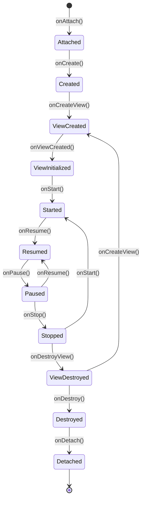

# Fragment（androidx.fragment.app.Fragment）

## 什么是 Fragment？

### 定义

Fragment 是 Android 应用中可重用的 UI 组件，代表 Activity 中的一部分界面或行为。Fragment 拥有自己的生命周期，可以接收自己的输入事件，并且可以在 Activity 运行时动态添加或移除。从 Android 3.0（API 11）引入，现在推荐使用 AndroidX 版本。

### 通俗理解

如果把 Activity 比作一个相框，那么 Fragment 就是相框里可以更换的照片。一个相框可以放多张照片（多个 Fragment），你可以随时更换其中的某一张照片而不影响其他照片。比如平板电脑上，左边显示邮件列表（一个 Fragment），右边显示邮件内容（另一个 Fragment），点击左边的邮件，只需要更换右边的 Fragment 即可，不需要打开新的界面。

## 核心特征

### 1. 模块化设计

- Fragment 将界面分割成独立的、可复用的模块
- 同一个 Fragment 可以在多个 Activity 中使用
- 便于界面逻辑的组织和维护

### 2. 灵活的 UI 组合

- 多个 Fragment 可以组合在一个 Activity 中
- 支持运行时动态添加、移除、替换 Fragment
- 适配不同屏幕尺寸（手机/平板）

### 3. 独立的生命周期

- Fragment 有自己的生命周期，但依附于宿主 Activity
- 生命周期与 Activity 紧密关联但又有独立的回调
- 支持生命周期感知组件（LifecycleOwner）

### 4. 返回栈管理

- Fragment 事务可以添加到返回栈
- 支持用户按返回键回退 Fragment 操作
- 可以实现类似 Activity 栈的导航效果

## Fragment 生命周期

### 生命周期状态图



### 生命周期回调方法


| 方法                | 调用时机                      | 典型操作                      |
| ----------------- | ------------------------- | ------------------------- |
| `onAttach()`      | Fragment 与 Activity 关联时   | 获取 Activity 引用、初始化回调接口    |
| `onCreate()`      | Fragment 首次创建时            | 初始化必要的非 UI 组件、恢复状态        |
| `onCreateView()`  | 创建 Fragment 视图时           | 加载布局文件、初始化 View Binding   |
| `onViewCreated()` | 视图创建完成后                   | 初始化视图组件、设置监听器、观察 LiveData |
| `onStart()`       | Fragment 即将可见时            | 启动与 UI 相关的组件              |
| `onResume()`      | Fragment 开始与用户交互时         | 开始动画、获取独占资源               |
| `onPause()`       | Fragment 即将失去焦点时          | 暂停动画、保存临时数据               |
| `onStop()`        | Fragment 完全不可见时           | 停止与 UI 相关的组件              |
| `onDestroyView()` | Fragment 视图被销毁时           | 清理视图引用、释放 View Binding    |
| `onDestroy()`     | Fragment 被销毁前             | 清理所有资源                    |
| `onDetach()`      | Fragment 与 Activity 解除关联时 | 清理 Activity 引用            |


### Fragment 与 Activity 生命周期对比

```
┌────────────────────────────────────────────────────────────────────────────┐
│                    Fragment 与 Activity 生命周期对应关系                     │
├────────────────────────────────────────────────────────────────────────────┤
│                                                                            │
│  Activity                          Fragment                                │
│  ─────────                         ────────                                │
│                                    onAttach()                              │
│  onCreate() ─────────────────────► onCreate()                              │
│                                    onCreateView()                          │
│                                    onViewCreated()                         │
│  onStart() ──────────────────────► onStart()                               │
│  onResume() ─────────────────────► onResume()                              │
│                                                                            │
│  onPause() ──────────────────────► onPause()                               │
│  onStop() ───────────────────────► onStop()                                │
│                                    onDestroyView()                         │
│  onDestroy() ────────────────────► onDestroy()                             │
│                                    onDetach()                              │
│                                                                            │
└────────────────────────────────────────────────────────────────────────────┘
```

### Fragment 生命周期完整流程

```
Fragment 添加到 Activity：
onAttach() → onCreate() → onCreateView() → onViewCreated() → onStart() → onResume()

Activity 按 Home 键：
onPause() → onStop()

Activity 从后台返回：
onStart() → onResume()

Fragment 被替换（添加到返回栈）：
onPause() → onStop() → onDestroyView()

返回到被替换的 Fragment：
onCreateView() → onViewCreated() → onStart() → onResume()

Fragment 被移除或 Activity 销毁：
onPause() → onStop() → onDestroyView() → onDestroy() → onDetach()
```

### Fragment 切换的生命周期（重点）

**场景：使用 replace 从 FragmentA 切换到 FragmentB，再按返回键**

```
┌─────────────────────────────────────────────────────────────────────┐
│  阶段一：FragmentA 显示中                                            │
├─────────────────────────────────────────────────────────────────────┤
│  FragmentA: onAttach → onCreate → onCreateView → onViewCreated      │
│             → onStart → onResume                                    │
│                                                                     │
│  此时 FragmentA 处于 Resumed 状态，可与用户交互                       │
└─────────────────────────────────────────────────────────────────────┘
                              ↓
                    执行 replace + addToBackStack
                              ↓
┌─────────────────────────────────────────────────────────────────────┐
│  阶段二：从 FragmentA 切换到 FragmentB                               │
├─────────────────────────────────────────────────────────────────────┤
│  FragmentA: onPause → onStop → onDestroyView                        │
│             （注意：没有 onDestroy 和 onDetach，因为加入了返回栈）      │
│                                                                     │
│  FragmentB: onAttach → onCreate → onCreateView → onViewCreated      │
│             → onStart → onResume                                    │
│                                                                     │
│  执行顺序：A.onPause → A.onStop → A.onDestroyView                    │
│           → B.onAttach → B.onCreate → B.onCreateView               │
│           → B.onViewCreated → B.onStart → B.onResume               │
└─────────────────────────────────────────────────────────────────────┘
                              ↓
                         按返回键
                              ↓
┌─────────────────────────────────────────────────────────────────────┐
│  阶段三：从 FragmentB 返回到 FragmentA                               │
├─────────────────────────────────────────────────────────────────────┤
│  FragmentB: onPause → onStop → onDestroyView → onDestroy → onDetach │
│             （完全销毁）                                              │
│                                                                     │
│  FragmentA: onCreateView → onViewCreated → onStart → onResume       │
│             （只重建视图，不重新 onCreate）                            │
└─────────────────────────────────────────────────────────────────────┘
```

**关键点理解：**


| 要点                     | 说明                                  |
| ---------------------- | ----------------------------------- |
| **addToBackStack 的作用** | 保留 Fragment 实例，只销毁视图（onDestroyView） |
| **不加 addToBackStack**  | Fragment 被完全销毁，走完整销毁流程              |
| **视图重建**               | 返回时只调用 onCreateView，不调用 onCreate    |
| **数据保持**               | Fragment 成员变量在返回栈中会保留               |


## Fragment 创建方式（重要）

### 为什么必须使用工厂方法 + arguments 传参？

这是 Android 开发中非常重要的知识点，涉及 Fragment 的重建机制。

#### 核心原因：Fragment 必须有无参构造函数

Android 系统在某些情况下会自动重建 Fragment（如屏幕旋转、内存不足后恢复），此时系统使用**反射调用无参构造函数**来重建 Fragment 实例。

```kotlin
// ❌ 错误写法：使用带参构造函数
class BadFragment(private val title: String) : Fragment() {
    // 系统重建时会崩溃！
    // 因为系统只会调用无参构造函数，无法传入 title 参数
}

// ✅ 正确写法：保持无参构造函数，使用 arguments 传参
class GoodFragment : Fragment() {
    companion object {
        private const val ARG_TITLE = "arg_title"

        fun newInstance(title: String) = GoodFragment().apply {
            arguments = Bundle().apply {
                putString(ARG_TITLE, title)
            }
        }
    }
}
```

#### arguments 会被系统自动保存和恢复

通过 `arguments` 传递的数据会被系统自动序列化保存，Fragment 重建后可以正常获取：

```kotlin
override fun onCreate(savedInstanceState: Bundle?) {
    super.onCreate(savedInstanceState)
    // Fragment 重建后，arguments 中的数据仍然存在！
    val title = arguments?.getString(ARG_TITLE)  // ✅ 数据正常恢复
}
```

#### 生命周期图解

```
┌─────────────────────────────────────────────────────────────┐
│                    正常创建 Fragment                         │
├─────────────────────────────────────────────────────────────┤
│  GoodFragment.newInstance("标题")                           │
│       ↓                                                     │
│  arguments = Bundle("arg_title" = "标题")                   │
│       ↓                                                     │
│  Fragment 显示正常                                           │
└─────────────────────────────────────────────────────────────┘
                         ↓
                    屏幕旋转 / 内存回收后恢复
                         ↓
┌─────────────────────────────────────────────────────────────┐
│                    系统自动重建 Fragment                      │
├─────────────────────────────────────────────────────────────┤
│  系统调用：GoodFragment()  ← 反射调用无参构造函数              │
│       ↓                                                     │
│  系统自动恢复：arguments = Bundle("arg_title" = "标题")      │
│       ↓                                                     │
│  onCreate 中获取：arguments?.getString(ARG_TITLE) → "标题"  │
│       ↓                                                     │
│  Fragment 正常显示 ✅                                        │
└─────────────────────────────────────────────────────────────┘
```

#### 三种传参方式对比

| 传参方式 | 正常创建时 | 系统重建后 | 推荐度 |
|---------|-----------|-----------|-------|
| 构造函数参数 | ✅ 正常 | ❌ **崩溃** | ❌ 禁止使用 |
| setter 方法/属性 | ✅ 正常 | ❌ 数据丢失 | ❌ 不推荐 |
| arguments (Bundle) | ✅ 正常 | ✅ 数据保留 | ✅ **推荐** |

```kotlin
// ❌ 方式1：构造函数传参 - 系统重建时崩溃
val fragment = BadFragment("标题")

// ❌ 方式2：setter 传参 - 系统重建后数据丢失
val fragment = SomeFragment()
fragment.title = "标题"

// ✅ 方式3：工厂方法 + arguments - 系统重建后数据正常恢复
val fragment = GoodFragment.newInstance("标题")
```

> ⚠️ **重要提醒**：永远不要通过构造函数给 Fragment 传参，这会导致应用在配置变更或内存恢复时崩溃！

## 代码示例

### 基础用法

```kotlin
// ExampleFragment.kt
class ExampleFragment : Fragment() {

    companion object {
        private const val TAG = "ExampleFragment"
        private const val ARG_TITLE = "arg_title"

        // 推荐使用工厂方法创建 Fragment 实例
        fun newInstance(title: String): ExampleFragment {
            return ExampleFragment().apply {
                arguments = Bundle().apply {
                    putString(ARG_TITLE, title)
                }
            }
        }
    }

    private var title: String? = null

    override fun onAttach(context: Context) {
        super.onAttach(context)
        Log.d(TAG, "onAttach: Fragment 与 Activity 关联")
    }

    override fun onCreate(savedInstanceState: Bundle?) {
        super.onCreate(savedInstanceState)
        Log.d(TAG, "onCreate: Fragment 被创建")

        // 获取传递的参数
        arguments?.let {
            title = it.getString(ARG_TITLE)
        }
    }

    override fun onCreateView(
        inflater: LayoutInflater,
        container: ViewGroup?,
        savedInstanceState: Bundle?
    ): View? {
        Log.d(TAG, "onCreateView: 创建视图")
        // 加载布局
        return inflater.inflate(R.layout.fragment_example, container, false)
    }

    override fun onViewCreated(view: View, savedInstanceState: Bundle?) {
        super.onViewCreated(view, savedInstanceState)
        Log.d(TAG, "onViewCreated: 视图创建完成")

        // 在这里初始化视图组件
        view.findViewById<TextView>(R.id.textTitle)?.text = title
    }

    override fun onStart() {
        super.onStart()
        Log.d(TAG, "onStart: Fragment 即将可见")
    }

    override fun onResume() {
        super.onResume()
        Log.d(TAG, "onResume: Fragment 获得焦点")
    }

    override fun onPause() {
        super.onPause()
        Log.d(TAG, "onPause: Fragment 即将失去焦点")
    }

    override fun onStop() {
        super.onStop()
        Log.d(TAG, "onStop: Fragment 不可见")
    }

    override fun onDestroyView() {
        super.onDestroyView()
        Log.d(TAG, "onDestroyView: 视图被销毁")
    }

    override fun onDestroy() {
        super.onDestroy()
        Log.d(TAG, "onDestroy: Fragment 被销毁")
    }

    override fun onDetach() {
        super.onDetach()
        Log.d(TAG, "onDetach: Fragment 与 Activity 解除关联")
    }
}
```

### 使用 View Binding（推荐）

```kotlin
class ModernFragment : Fragment() {

    // View Binding
    private var _binding: FragmentModernBinding? = null
    private val binding get() = _binding!!

    override fun onCreateView(
        inflater: LayoutInflater,
        container: ViewGroup?,
        savedInstanceState: Bundle?
    ): View {
        _binding = FragmentModernBinding.inflate(inflater, container, false)
        return binding.root
    }

    override fun onViewCreated(view: View, savedInstanceState: Bundle?) {
        super.onViewCreated(view, savedInstanceState)

        // 使用 binding 访问视图
        binding.textTitle.text = "Hello, Fragment!"
        binding.buttonAction.setOnClickListener {
            handleAction()
        }
    }

    override fun onDestroyView() {
        super.onDestroyView()
        // 重要：必须在 onDestroyView 中清理 binding 引用
        _binding = null
    }

    private fun handleAction() {
        // 处理按钮点击
    }
}
```

### Fragment 事务操作

```kotlin
class MainActivity : AppCompatActivity() {

    override fun onCreate(savedInstanceState: Bundle?) {
        super.onCreate(savedInstanceState)
        setContentView(R.layout.activity_main)

        // 只在首次创建时添加 Fragment
        if (savedInstanceState == null) {
            addFragment()
        }
    }

    // 添加 Fragment
    private fun addFragment() {
        val fragment = ExampleFragment.newInstance("首页")
        supportFragmentManager.beginTransaction()
            .add(R.id.fragmentContainer, fragment, "example_tag")
            .commit()
    }

    // 替换 Fragment（添加到返回栈）
    private fun replaceFragment(fragment: Fragment) {
        supportFragmentManager.beginTransaction()
            .setCustomAnimations(
                R.anim.slide_in_right,   // 进入动画
                R.anim.slide_out_left,   // 退出动画
                R.anim.slide_in_left,    // 返回时进入动画
                R.anim.slide_out_right   // 返回时退出动画
            )
            .replace(R.id.fragmentContainer, fragment)
            .addToBackStack(null)  // 添加到返回栈
            .commit()
    }

    // 移除 Fragment
    private fun removeFragment() {
        val fragment = supportFragmentManager.findFragmentByTag("example_tag")
        fragment?.let {
            supportFragmentManager.beginTransaction()
                .remove(it)
                .commit()
        }
    }

    // 显示/隐藏 Fragment
    private fun toggleFragment(fragment: Fragment, show: Boolean) {
        supportFragmentManager.beginTransaction()
            .apply {
                if (show) show(fragment) else hide(fragment)
            }
            .commit()
    }
}
```

### Fragment 之间的通信

#### 方式一：使用 ViewModel 共享数据（推荐）

```kotlin
// SharedViewModel.kt - 在 Activity 范围内共享
class SharedViewModel : ViewModel() {

    private val _selectedItem = MutableLiveData<Item>()
    val selectedItem: LiveData<Item> = _selectedItem

    fun selectItem(item: Item) {
        _selectedItem.value = item
    }
}

// ListFragment.kt - 列表 Fragment
class ListFragment : Fragment() {

    // 使用 activityViewModels() 获取 Activity 范围的 ViewModel
    private val sharedViewModel: SharedViewModel by activityViewModels()

    override fun onViewCreated(view: View, savedInstanceState: Bundle?) {
        super.onViewCreated(view, savedInstanceState)

        // 点击列表项时更新 ViewModel
        adapter.setOnItemClickListener { item ->
            sharedViewModel.selectItem(item)
        }
    }
}

// DetailFragment.kt - 详情 Fragment
class DetailFragment : Fragment() {

    private val sharedViewModel: SharedViewModel by activityViewModels()

    override fun onViewCreated(view: View, savedInstanceState: Bundle?) {
        super.onViewCreated(view, savedInstanceState)

        // 观察 ViewModel 数据变化
        sharedViewModel.selectedItem.observe(viewLifecycleOwner) { item ->
            // 更新 UI
            binding.textTitle.text = item.title
            binding.textContent.text = item.content
        }
    }
}
```

#### 方式二：使用 Fragment Result API（AndroidX 1.3.0+）

```kotlin
// 发送结果的 Fragment
class SenderFragment : Fragment() {

    private fun sendResult() {
        // 设置结果
        setFragmentResult("request_key", bundleOf(
            "result_key" to "这是返回的数据"
        ))

        // 返回上一个 Fragment
        parentFragmentManager.popBackStack()
    }
}

// 接收结果的 Fragment
class ReceiverFragment : Fragment() {

    override fun onCreate(savedInstanceState: Bundle?) {
        super.onCreate(savedInstanceState)

        // 注册结果监听器
        setFragmentResultListener("request_key") { requestKey, bundle ->
            val result = bundle.getString("result_key")
            Log.d("ReceiverFragment", "收到结果: $result")
        }
    }
}
```

#### 方式三：父子 Fragment 之间的通信

```kotlin
// 子 Fragment 向父 Fragment 发送结果
class ChildFragment : Fragment() {

    private fun sendResultToParent() {
        // 设置结果给父 Fragment
        setFragmentResult("child_request_key", bundleOf("data" to "子 Fragment 的数据"))
    }
}

// 父 Fragment 接收子 Fragment 的结果
class ParentFragment : Fragment() {

    override fun onCreate(savedInstanceState: Bundle?) {
        super.onCreate(savedInstanceState)

        // 使用 childFragmentManager 监听子 Fragment 的结果
        childFragmentManager.setFragmentResultListener(
            "child_request_key",
            this
        ) { requestKey, bundle ->
            val data = bundle.getString("data")
            Log.d("ParentFragment", "收到子 Fragment 数据: $data")
        }
    }
}
```

### 最佳实践：配合 ViewModel 和 LiveData

```kotlin
class BestPracticeFragment : Fragment() {

    // 使用 viewModels() 获取 Fragment 范围的 ViewModel
    private val viewModel: MyViewModel by viewModels()

    private var _binding: FragmentBestPracticeBinding? = null
    private val binding get() = _binding!!

    override fun onCreateView(
        inflater: LayoutInflater,
        container: ViewGroup?,
        savedInstanceState: Bundle?
    ): View {
        _binding = FragmentBestPracticeBinding.inflate(inflater, container, false)
        return binding.root
    }

    override fun onViewCreated(view: View, savedInstanceState: Bundle?) {
        super.onViewCreated(view, savedInstanceState)

        setupObservers()
        setupListeners()
    }

    private fun setupObservers() {
        // 使用 viewLifecycleOwner 而不是 this
        viewModel.uiState.observe(viewLifecycleOwner) { state ->
            when (state) {
                is UiState.Loading -> showLoading()
                is UiState.Success -> showData(state.data)
                is UiState.Error -> showError(state.message)
            }
        }
    }

    private fun setupListeners() {
        binding.buttonRefresh.setOnClickListener {
            viewModel.refresh()
        }
    }

    private fun showLoading() {
        binding.progressBar.isVisible = true
        binding.contentGroup.isVisible = false
    }

    private fun showData(data: List<Item>) {
        binding.progressBar.isVisible = false
        binding.contentGroup.isVisible = true
        // 更新 RecyclerView adapter
    }

    private fun showError(message: String) {
        binding.progressBar.isVisible = false
        Snackbar.make(binding.root, message, Snackbar.LENGTH_LONG).show()
    }

    override fun onDestroyView() {
        super.onDestroyView()
        _binding = null
    }
}

// MyViewModel.kt
class MyViewModel : ViewModel() {

    private val _uiState = MutableLiveData<UiState>()
    val uiState: LiveData<UiState> = _uiState

    init {
        refresh()
    }

    fun refresh() {
        viewModelScope.launch {
            _uiState.value = UiState.Loading
            try {
                val data = repository.fetchData()
                _uiState.value = UiState.Success(data)
            } catch (e: Exception) {
                _uiState.value = UiState.Error(e.message ?: "未知错误")
            }
        }
    }
}

sealed class UiState {
    object Loading : UiState()
    data class Success(val data: List<Item>) : UiState()
    data class Error(val message: String) : UiState()
}
```

### 在布局文件中静态添加 Fragment

```xml
<!-- activity_main.xml -->
<androidx.constraintlayout.widget.ConstraintLayout
    xmlns:android="http://schemas.android.com/apk/res/android"
    xmlns:app="http://schemas.android.com/apk/res-auto"
    android:layout_width="match_parent"
    android:layout_height="match_parent">

    <!-- 使用 FragmentContainerView（推荐） -->
    <androidx.fragment.app.FragmentContainerView
        android:id="@+id/fragmentContainer"
        android:name="com.example.app.ExampleFragment"
        android:layout_width="match_parent"
        android:layout_height="match_parent"
        android:tag="example_fragment"
        app:layout_constraintTop_toTopOf="parent" />

</androidx.constraintlayout.widget.ConstraintLayout>
```

## ViewPager2 + Fragment

### 基础配置

```kotlin
// ViewPager2 Adapter
class ViewPagerAdapter(fragment: Fragment) : FragmentStateAdapter(fragment) {

    private val fragments = listOf(
        HomeFragment(),
        SearchFragment(),
        ProfileFragment()
    )

    override fun getItemCount(): Int = fragments.size

    override fun createFragment(position: Int): Fragment = fragments[position]
}

// 在 Fragment 或 Activity 中使用
class MainFragment : Fragment() {

    private var _binding: FragmentMainBinding? = null
    private val binding get() = _binding!!

    override fun onViewCreated(view: View, savedInstanceState: Bundle?) {
        super.onViewCreated(view, savedInstanceState)

        // 设置 ViewPager2
        binding.viewPager.adapter = ViewPagerAdapter(this)

        // 配合 TabLayout 使用
        TabLayoutMediator(binding.tabLayout, binding.viewPager) { tab, position ->
            tab.text = when (position) {
                0 -> "首页"
                1 -> "搜索"
                2 -> "我的"
                else -> "Tab $position"
            }
        }.attach()
    }

    override fun onDestroyView() {
        super.onDestroyView()
        _binding = null
    }
}
```

### 布局文件

```xml
<!-- fragment_main.xml -->
<LinearLayout
    xmlns:android="http://schemas.android.com/apk/res/android"
    xmlns:app="http://schemas.android.com/apk/res-auto"
    android:layout_width="match_parent"
    android:layout_height="match_parent"
    android:orientation="vertical">

    <com.google.android.material.tabs.TabLayout
        android:id="@+id/tabLayout"
        android:layout_width="match_parent"
        android:layout_height="wrap_content"
        app:tabMode="fixed"
        app:tabGravity="fill" />

    <androidx.viewpager2.widget.ViewPager2
        android:id="@+id/viewPager"
        android:layout_width="match_parent"
        android:layout_height="0dp"
        android:layout_weight="1" />

</LinearLayout>
```

## 应用场景

### 1. 底部导航切换

- 使用多个 Fragment 配合 BottomNavigationView
- Fragment 之间使用 hide/show 切换，保持状态
- 配合 Navigation 组件实现

```kotlin
class MainActivity : AppCompatActivity() {

    private val homeFragment = HomeFragment()
    private val searchFragment = SearchFragment()
    private val profileFragment = ProfileFragment()
    private var activeFragment: Fragment = homeFragment

    override fun onCreate(savedInstanceState: Bundle?) {
        super.onCreate(savedInstanceState)
        setContentView(R.layout.activity_main)

        if (savedInstanceState == null) {
            setupFragments()
        }
        setupBottomNavigation()
    }

    private fun setupFragments() {
        supportFragmentManager.beginTransaction().apply {
            add(R.id.fragmentContainer, profileFragment, "profile").hide(profileFragment)
            add(R.id.fragmentContainer, searchFragment, "search").hide(searchFragment)
            add(R.id.fragmentContainer, homeFragment, "home")
        }.commit()
    }

    private fun setupBottomNavigation() {
        findViewById<BottomNavigationView>(R.id.bottomNav).setOnItemSelectedListener { item ->
            val fragment = when (item.itemId) {
                R.id.nav_home -> homeFragment
                R.id.nav_search -> searchFragment
                R.id.nav_profile -> profileFragment
                else -> homeFragment
            }
            switchFragment(fragment)
            true
        }
    }

    private fun switchFragment(fragment: Fragment) {
        supportFragmentManager.beginTransaction()
            .hide(activeFragment)
            .show(fragment)
            .commit()
        activeFragment = fragment
    }
}
```

### 2. 平板电脑双窗格布局

- 左侧列表 Fragment + 右侧详情 Fragment
- 响应式布局适配手机和平板
- 在不同屏幕尺寸下显示不同的布局

### 3. 对话框 Fragment（DialogFragment）

```kotlin
class CustomDialogFragment : DialogFragment() {

    override fun onCreateView(
        inflater: LayoutInflater,
        container: ViewGroup?,
        savedInstanceState: Bundle?
    ): View? {
        return inflater.inflate(R.layout.dialog_custom, container, false)
    }

    override fun onViewCreated(view: View, savedInstanceState: Bundle?) {
        super.onViewCreated(view, savedInstanceState)

        view.findViewById<Button>(R.id.buttonConfirm).setOnClickListener {
            // 处理确认按钮
            setFragmentResult("dialog_result", bundleOf("confirmed" to true))
            dismiss()
        }

        view.findViewById<Button>(R.id.buttonCancel).setOnClickListener {
            dismiss()
        }
    }

    override fun onStart() {
        super.onStart()
        // 设置对话框宽度
        dialog?.window?.setLayout(
            ViewGroup.LayoutParams.MATCH_PARENT,
            ViewGroup.LayoutParams.WRAP_CONTENT
        )
    }
}

// 显示对话框
CustomDialogFragment().show(supportFragmentManager, "custom_dialog")
```

### 4. 底部弹窗（BottomSheetDialogFragment）

```kotlin
class CustomBottomSheet : BottomSheetDialogFragment() {

    override fun onCreateView(
        inflater: LayoutInflater,
        container: ViewGroup?,
        savedInstanceState: Bundle?
    ): View? {
        return inflater.inflate(R.layout.bottom_sheet_custom, container, false)
    }

    override fun onViewCreated(view: View, savedInstanceState: Bundle?) {
        super.onViewCreated(view, savedInstanceState)
        // 初始化视图
    }
}

// 显示底部弹窗
CustomBottomSheet().show(supportFragmentManager, "bottom_sheet")
```

## 优缺点分析

### 优点

- **模块化**：界面逻辑分离，易于维护和复用
- **灵活性高**：支持动态添加、移除、替换
- **生命周期管理**：独立的生命周期，便于资源管理
- **适配性好**：一套代码适配手机和平板
- **返回栈支持**：用户体验与 Activity 一致

### 缺点

- **生命周期复杂**：比 Activity 多了几个生命周期回调
- **内存泄漏风险**：View Binding、回调等需要正确清理
- **事务管理**：FragmentTransaction 的 commit/commitAllowingStateLoss 需要注意时机
- **嵌套复杂度**：子 Fragment 管理增加复杂度
- **状态恢复**：配置变更时需要正确处理状态

## 性能考虑

### 1. 懒加载

```kotlin
class LazyFragment : Fragment() {

    private var isDataLoaded = false

    override fun onResume() {
        super.onResume()
        if (!isDataLoaded) {
            loadData()
            isDataLoaded = true
        }
    }

    private fun loadData() {
        // 首次可见时加载数据
    }
}
```

### 2. ViewPager2 预加载控制

```kotlin
// 限制预加载页面数量
binding.viewPager.offscreenPageLimit = 1

// 使用 FragmentStateAdapter 而不是 FragmentPagerAdapter
// FragmentStateAdapter 会在 Fragment 离开视口时销毁视图
```

### 3. 避免内存泄漏

```kotlin
class SafeFragment : Fragment() {

    // 使用 viewLifecycleOwner 观察 LiveData
    private fun observeData() {
        viewModel.data.observe(viewLifecycleOwner) { /* ... */ }
    }

    // 在 onDestroyView 清理 binding
    override fun onDestroyView() {
        super.onDestroyView()
        _binding = null
    }

    // 使用弱引用或在 onDestroyView 移除回调
    private var callback: Callback? = null

    override fun onDestroyView() {
        super.onDestroyView()
        callback = null
    }
}
```

### 4. Fragment 事务优化

```kotlin
// 使用 commitNow() 同步执行（谨慎使用）
supportFragmentManager.beginTransaction()
    .add(R.id.container, fragment)
    .commitNow()

// 批量执行多个操作
supportFragmentManager.beginTransaction()
    .setReorderingAllowed(true)  // 允许优化重排序
    .add(R.id.container, fragment)
    .commit()
```

## 常见问题

### 1. IllegalStateException: Can not perform this action after onSaveInstanceState

```kotlin
// 问题：在 Activity 状态保存后提交事务
// 解决方案一：使用 commitAllowingStateLoss（可能丢失状态）
supportFragmentManager.beginTransaction()
    .replace(R.id.container, fragment)
    .commitAllowingStateLoss()

// 解决方案二：检查状态后再提交
if (!isStateSaved) {
    supportFragmentManager.beginTransaction()
        .replace(R.id.container, fragment)
        .commit()
}
```

### 2. Fragment 重叠问题

```kotlin
// 问题：配置变更后 Fragment 重叠
// 解决方案：检查 savedInstanceState
override fun onCreate(savedInstanceState: Bundle?) {
    super.onCreate(savedInstanceState)

    if (savedInstanceState == null) {
        // 只在首次创建时添加 Fragment
        addFragment()
    }
}
```

### 3. getActivity() 返回 null

```kotlin
// 问题：在 Fragment 已分离后调用 getActivity()
// 解决方案：检查 isAdded 状态
if (isAdded && activity != null) {
    activity?.runOnUiThread { /* ... */ }
}

// 或者使用 viewLifecycleOwner
viewLifecycleOwner.lifecycleScope.launch {
    // 安全的协程作用域
}
```

## 兼容性说明

### API 级别要求

- `Fragment` 基类：API 11+（原生）
- `androidx.fragment.app.Fragment`：AndroidX 兼容库（推荐）
- Fragment Result API：Fragment 1.3.0+
- FragmentContainerView：Fragment 1.2.0+

### 推荐的依赖配置

```kotlin
// build.gradle.kts (Module)
dependencies {
    // Fragment
    implementation("androidx.fragment:fragment-ktx:1.6.2")

    // ViewModel
    implementation("androidx.lifecycle:lifecycle-viewmodel-ktx:2.7.0")
    implementation("androidx.lifecycle:lifecycle-livedata-ktx:2.7.0")

    // Navigation（可选，用于 Fragment 导航）
    implementation("androidx.navigation:navigation-fragment-ktx:2.7.7")
    implementation("androidx.navigation:navigation-ui-ktx:2.7.7")

    // ViewPager2
    implementation("androidx.viewpager2:viewpager2:1.0.0")
}
```

## 相关技术

- **[[Activity]]**：Fragment 的宿主容器
- **[[ViewModel]]**：管理 UI 相关数据，支持 Fragment 间通信
- **[[Navigation]]**：Jetpack 导航组件，简化 Fragment 导航
- **[[ViewPager2]]**：实现滑动切换 Fragment
- **[[DialogFragment]]**：以对话框形式显示的 Fragment
- **[[BottomSheetDialogFragment]]**：底部弹窗 Fragment

## 总结

Fragment 是 Android 应用开发中实现模块化 UI 的核心组件。在现代 Android 开发中，推荐：

1. **使用 AndroidX Fragment**：获得最新特性和 bug 修复
2. **使用 View Binding**：类型安全地访问视图，避免 findViewById
3. **配合 ViewModel**：处理配置变更，实现 Fragment 间通信
4. **使用 viewLifecycleOwner**：观察 LiveData，避免内存泄漏
5. **使用 Fragment Result API**：替代接口回调进行 Fragment 间通信
6. **使用 FragmentContainerView**：替代 FrameLayout 作为 Fragment 容器
7. **考虑 Navigation 组件**：简化 Fragment 导航和返回栈管理
8. **注意生命周期**：正确在 onDestroyView 中清理资源

---

*本文档持续更新，添加更多相关内容*