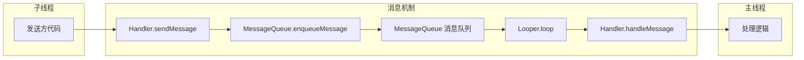

# Handler 基础篇

## 技术演进：为什么需要 Handler？

### 从一个崩溃说起

假设你写了这样的代码：

```kotlin
// 在子线程中更新 UI（错误示范！）
Thread {
    val data = fetchDataFromNetwork()  // 耗时网络请求
    textView.text = data  // 💥 崩溃！
}.start()
```

运行后直接崩溃，报错：`Only the original thread that created a view hierarchy can touch its views.`

翻译成大白话：**只有创建这个 View 的线程（主线程）才能修改它**。

### 为什么 Android 要这样设计？

想象一下，如果任何线程都能随便修改 UI 会怎样：

```
时刻1：线程A 正在把按钮文字改成"确定"
时刻2：线程B 同时把按钮颜色改成红色
时刻3：线程C 把按钮删掉了

结果：💥 界面错乱、数据竞争、随机崩溃
```

**解决方案有两种思路**：

| 方案 | 实现方式 | 问题 |
|-----|---------|------|
| **加锁** | 每次操作 UI 都加 synchronized | 锁竞争严重，UI 卡顿，代码复杂 |
| **单线程** | 所有 UI 操作都在同一个线程执行 | ✅ 简单、安全、高效 |

Android 选择了**单线程模型**——所有 UI 操作必须在主线程（UI 线程）执行。

但这带来了新问题：**耗时操作放主线程会 ANR，放子线程又不能更新 UI，怎么办？**

**答案就是 Handler**——它提供了一种线程间通信的机制，让子线程可以"委托"主线程去更新 UI。

### Handler 的价值

```
┌─────────────┐                    ┌─────────────┐
│   子线程     │                    │   主线程     │
│             │                    │             │
│  网络请求    │   ──Handler──→    │  更新 UI    │
│  数据库操作  │   ←─Handler───    │  处理事件    │
│  复杂计算    │                    │             │
└─────────────┘                    └─────────────┘
```

## 核心概念：四大组件

Handler 消息机制包含四个核心角色，用一个"餐厅点餐"的比喻来理解：

```
┌────────────────────────────────────────────────────────────┐
│                      餐厅点餐系统                           │
├────────────────────────────────────────────────────────────┤
│                                                            │
│  Message（菜单）     ──→  你点的菜，写着要什么、给谁做       │
│                                                            │
│  MessageQueue（订单队列）──→  所有菜单按时间排队             │
│                                                            │
│  Looper（传菜员）    ──→  不停地从队列取菜单，交给厨师        │
│                                                            │
│  Handler（厨师）     ──→  收到菜单后真正做菜                 │
│                                                            │
└────────────────────────────────────────────────────────────┘
```

### 1. Message：消息载体

Message 是消息的"信封"，装着要传递的内容。

```kotlin
// Message 的核心字段
class Message {
    var what: Int = 0           // 消息类型，用于区分不同消息
    var arg1: Int = 0           // 简单整型参数1
    var arg2: Int = 0           // 简单整型参数2
    var obj: Any? = null        // 复杂对象参数
    var target: Handler? = null // 目标 Handler（谁来处理）
    var when: Long = 0          // 执行时间（延迟消息用）
    // ...
}
```

**创建 Message 的正确姿势**：

```kotlin
// ❌ 不推荐：直接 new
val msg = Message()

// ✅ 推荐：从对象池获取（避免频繁创建对象）
val msg = Message.obtain()

// ✅ 更推荐：通过 Handler 获取（自动绑定 target）
val msg = handler.obtainMessage(what, obj)
```

> **为什么用 obtain()？** Message 内部有个对象池（链表），用完的 Message 不销毁而是回收到池里，下次直接复用，减少 GC 压力。

### 2. MessageQueue：消息队列

MessageQueue 是一个**按执行时间排序的优先级队列**（实际是单链表）。

```
                    ┌─────────────────────────────────────────┐
   enqueueMessage() │                                         │ next()
        ──────────→ │  msg1 → msg2 → msg3 → msg4 → null      │ ──────→
                    │ (when=0) (when=100) (when=200) (when=500)│
                    └─────────────────────────────────────────┘
                              按 when 排序的单链表
```

**核心方法**：
- `enqueueMessage()`：插入消息，按时间排序
- `next()`：取出下一条消息，如果没有就阻塞等待

### 3. Looper：消息循环器

Looper 是消息机制的"发动机"，负责**不停地从队列取消息、分发消息**。

```kotlin
// Looper 的核心逻辑（简化版）
class Looper {
    val mQueue: MessageQueue  // 每个 Looper 有一个消息队列
    
    fun loop() {
        while (true) {  // 死循环
            val msg = mQueue.next()  // 取消息，没有就阻塞
            if (msg == null) return  // 收到 quit 信号
            
            msg.target.dispatchMessage(msg)  // 分发给 Handler 处理
            msg.recycle()  // 回收到对象池
        }
    }
}
```

**关键点**：
- 每个线程最多有一个 Looper（通过 ThreadLocal 保证）
- 主线程的 Looper 在 App 启动时就创建好了
- 子线程需要手动创建 Looper

### 4. Handler：消息处理器

Handler 是我们直接打交道的对象，负责**发送消息**和**处理消息**。

```kotlin
class Handler(looper: Looper) {
    private val mLooper: Looper = looper
    private val mQueue: MessageQueue = looper.mQueue
    
    // 发送消息
    fun sendMessage(msg: Message): Boolean {
        msg.target = this  // 标记由自己处理
        return mQueue.enqueueMessage(msg, SystemClock.uptimeMillis())
    }
    
    // 处理消息（子类重写）
    open fun handleMessage(msg: Message) {
        // 默认空实现
    }
}
```

### 四者关系图



## 基本用法

### 用法1：主线程创建 Handler

最常见的场景：子线程做耗时操作，通过 Handler 通知主线程更新 UI。

```kotlin
class MainActivity : AppCompatActivity() {
    
    // 方式1：匿名内部类（有内存泄漏风险，后面讲）
    private val handler = object : Handler(Looper.getMainLooper()) {
        override fun handleMessage(msg: Message) {
            when (msg.what) {
                MSG_UPDATE_UI -> {
                    val text = msg.obj as String
                    textView.text = text
                }
                MSG_SHOW_TOAST -> {
                    Toast.makeText(this@MainActivity, "完成", Toast.LENGTH_SHORT).show()
                }
            }
        }
    }
    
    // 在子线程中使用
    private fun fetchData() {
        Thread {
            val result = doNetworkRequest()  // 耗时操作
            
            // 方式1：sendMessage
            val msg = handler.obtainMessage(MSG_UPDATE_UI, result)
            handler.sendMessage(msg)
            
            // 方式2：post（更简洁）
            handler.post {
                textView.text = result
            }
            
            // 方式3：延迟执行
            handler.postDelayed({
                toast.show()
            }, 2000)
        }.start()
    }
    
    companion object {
        private const val MSG_UPDATE_UI = 1
        private const val MSG_SHOW_TOAST = 2
    }
}
```

### 用法2：子线程创建 Handler

有时需要在子线程处理消息（比如 IntentService 的工作线程）。

```kotlin
class WorkerThread : Thread() {
    lateinit var handler: Handler
    private val lock = Object()
    
    override fun run() {
        // 1. 创建 Looper
        Looper.prepare()
        
        synchronized(lock) {
            // 2. 创建 Handler
            handler = object : Handler(Looper.myLooper()!!) {
                override fun handleMessage(msg: Message) {
                    // 在子线程处理消息
                    when (msg.what) {
                        MSG_DO_WORK -> doHeavyWork(msg.obj)
                    }
                }
            }
            lock.notifyAll()  // 通知 Handler 已创建
        }
        
        // 3. 开启消息循环（会阻塞在这里）
        Looper.loop()
    }
    
    // 等待 Handler 创建完成
    fun waitUntilReady() {
        synchronized(lock) {
            while (!::handler.isInitialized) {
                lock.wait()
            }
        }
    }
    
    // 退出循环
    fun quit() {
        handler.looper.quit()
    }
}

// 使用
val worker = WorkerThread()
worker.start()
worker.waitUntilReady()
worker.handler.sendMessage(...)
```

> **更推荐用 HandlerThread**，它封装了上面的逻辑：

```kotlin
// HandlerThread：系统封装好的带 Looper 的线程
val handlerThread = HandlerThread("WorkerThread")
handlerThread.start()

val workerHandler = Handler(handlerThread.looper) { msg ->
    // 在子线程处理
    true
}

// 退出
handlerThread.quitSafely()
```

### 用法3：runOnUiThread 和 View.post

其实它们底层都是 Handler：

```kotlin
// Activity.runOnUiThread 的实现
fun runOnUiThread(action: Runnable) {
    if (Thread.currentThread() != mUiThread) {
        mHandler.post(action)  // 不在主线程，通过 Handler 发送
    } else {
        action.run()  // 已在主线程，直接执行
    }
}

// View.post 的实现
fun post(action: Runnable): Boolean {
    val attachInfo = mAttachInfo
    if (attachInfo != null) {
        return attachInfo.mHandler.post(action)  // 通过 ViewRootImpl 的 Handler
    }
    getRunQueue().post(action)  // View 还没 attach，存到队列
    return true
}
```

## 常见坑点

### 坑点1：内存泄漏（最常见！）

**问题代码**：

```kotlin
class MainActivity : AppCompatActivity() {
    // ❌ 匿名内部类持有外部类（Activity）的引用
    private val handler = object : Handler(Looper.getMainLooper()) {
        override fun handleMessage(msg: Message) {
            textView.text = "更新"  // 引用了 Activity 的 textView
        }
    }
    
    override fun onCreate(savedInstanceState: Bundle?) {
        super.onCreate(savedInstanceState)
        // 发送一个 10 分钟后执行的延迟消息
        handler.postDelayed({ }, 10 * 60 * 1000)
    }
}
```

**泄漏链**：

```
MessageQueue → Message → Handler（匿名内部类）→ MainActivity
     ↑
  Looper（主线程 Looper 永不销毁）
```

用户退出 Activity，但 Message 还在队列里等待执行，导致 Activity 无法回收。

**解决方案**：

```kotlin
class MainActivity : AppCompatActivity() {
    
    // ✅ 方案1：静态内部类 + 弱引用
    private class SafeHandler(activity: MainActivity) : Handler(Looper.getMainLooper()) {
        private val activityRef = WeakReference(activity)
        
        override fun handleMessage(msg: Message) {
            val activity = activityRef.get() ?: return  // Activity 已销毁，直接返回
            when (msg.what) {
                MSG_UPDATE -> activity.updateUI()
            }
        }
    }
    
    private val handler = SafeHandler(this)
    
    override fun onDestroy() {
        super.onDestroy()
        // ✅ 方案2：销毁时移除所有消息
        handler.removeCallbacksAndMessages(null)
    }
}
```

**最佳实践**：

```kotlin
// ✅ 推荐：使用 Lifecycle 感知
class MainActivity : AppCompatActivity() {
    
    private val handler = Handler(Looper.getMainLooper())
    
    override fun onCreate(savedInstanceState: Bundle?) {
        super.onCreate(savedInstanceState)
        
        // 在 Activity 销毁时自动移除消息
        lifecycle.addObserver(object : DefaultLifecycleObserver {
            override fun onDestroy(owner: LifecycleOwner) {
                handler.removeCallbacksAndMessages(null)
            }
        })
    }
}
```

### 坑点2：子线程创建 Handler 崩溃

```kotlin
// ❌ 崩溃！
Thread {
    val handler = Handler()  // RuntimeException: Can't create handler inside thread that has not called Looper.prepare()
}.start()
```

**原因**：Handler 需要关联一个 Looper，默认用当前线程的 Looper，但子线程没有。

**解决**：

```kotlin
// 方案1：手动创建 Looper
Thread {
    Looper.prepare()
    val handler = Handler(Looper.myLooper()!!)
    Looper.loop()
}.start()

// 方案2：使用 HandlerThread（推荐）
val handlerThread = HandlerThread("MyThread")
handlerThread.start()
val handler = Handler(handlerThread.looper)

// 方案3：使用主线程的 Looper
val handler = Handler(Looper.getMainLooper())
```

### 坑点3：消息执行顺序

```kotlin
handler.postDelayed({ Log.d("TAG", "A") }, 1000)
handler.postDelayed({ Log.d("TAG", "B") }, 500)
handler.post { Log.d("TAG", "C") }

// 输出顺序：C → B → A
// 因为消息按 when（执行时间）排序，不是按发送顺序
```

### 坑点4：主线程 Handler 在 onCreate 中可能为 null

```kotlin
// ❌ 在极端情况下可能有问题
class MyView(context: Context) : View(context) {
    init {
        post { 
            // View 可能还没 attach 到 Window
        }
    }
}
```

**原因**：`View.post()` 在 View 还没 attach 时，会把 Runnable 存到临时队列，等 attach 后再执行。但如果 View 永远不 attach，这些 Runnable 就不会执行。

## 小结

| 组件 | 职责 | 关键方法 |
|-----|------|---------|
| Message | 消息载体 | `obtain()`, `recycle()` |
| MessageQueue | 消息队列 | `enqueueMessage()`, `next()` |
| Looper | 消息循环 | `prepare()`, `loop()`, `quit()` |
| Handler | 发送和处理消息 | `sendMessage()`, `post()`, `handleMessage()` |

---

## 面试题检验

### Q1：Handler、Looper、MessageQueue、Message 的关系？

**结论**：Handler 负责发送和处理消息，Message 是消息载体，MessageQueue 是消息队列，Looper 负责循环取消息并分发。

**原理**：
1. 一个线程最多有一个 Looper，一个 Looper 有一个 MessageQueue
2. 可以有多个 Handler 关联同一个 Looper
3. Handler 发送消息时，Message 会带上 target（Handler 自己）
4. Looper 取出消息后，通过 target 分发给对应的 Handler

**类比**：邮局系统——Handler 是寄件人和收件人，Message 是信件，MessageQueue 是邮筒，Looper 是邮递员。

---

### Q2：为什么主线程可以直接用 Handler，子线程不行？

**结论**：因为主线程在 App 启动时就创建了 Looper，子线程默认没有。

**原理**：在 `ActivityThread.main()` 方法中：

```kotlin
// ActivityThread.main()（App 入口）
fun main(args: Array<String>) {
    Looper.prepareMainLooper()  // 创建主线程 Looper
    // ...
    Looper.loop()  // 开启消息循环
}
```

子线程需要手动调用 `Looper.prepare()` 和 `Looper.loop()`，或者使用 `HandlerThread`。

---

### Q3：Handler 内存泄漏的原因和解决方案？

**结论**：非静态内部类的 Handler 持有外部 Activity 引用，如果有延迟消息未执行，会阻止 Activity 被回收。

**原因**：泄漏链 `MessageQueue → Message → Handler → Activity`

**解决方案**：
1. 使用静态内部类 + 弱引用
2. 在 `onDestroy()` 中调用 `handler.removeCallbacksAndMessages(null)`
3. 使用 Lifecycle 感知组件自动管理

---

### Q4：Handler.post() 和 Handler.sendMessage() 的区别？

**结论**：本质相同，都是发送消息；`post()` 更简洁，`sendMessage()` 更灵活。

**原理**：

```kotlin
// post() 的实现
fun post(r: Runnable): Boolean {
    return sendMessageDelayed(getPostMessage(r), 0)
}

private fun getPostMessage(r: Runnable): Message {
    val m = Message.obtain()
    m.callback = r  // 把 Runnable 存到 Message.callback
    return m
}

// dispatchMessage() 的分发逻辑
fun dispatchMessage(msg: Message) {
    if (msg.callback != null) {
        msg.callback.run()  // 优先执行 Runnable
    } else {
        handleMessage(msg)  // 否则调用 handleMessage
    }
}
```

---

### Q5：一个线程可以有几个 Handler？几个 Looper？

**结论**：可以有多个 Handler，但只能有一个 Looper。

**原理**：Looper 通过 ThreadLocal 存储，保证一个线程只有一个。多个 Handler 可以共享同一个 Looper 和 MessageQueue。

---

_本文档将持续更新，添加更多相关内容_
