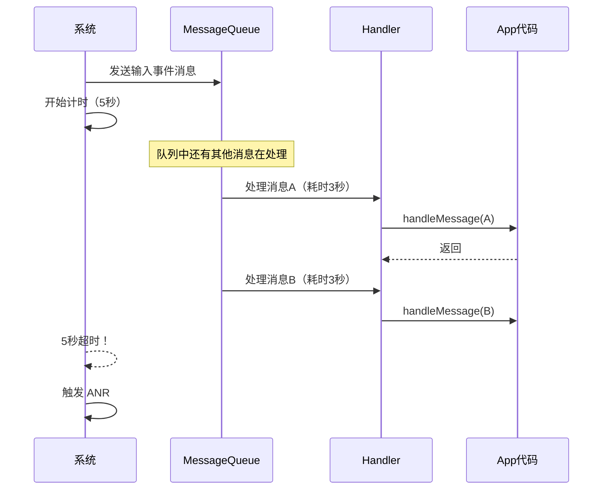

# Handler 进阶篇

## 高级特性

### 1. 同步屏障（Sync Barrier）

#### 什么是同步屏障？

正常情况下，MessageQueue 按时间顺序处理消息。但有时候某些消息特别紧急（比如屏幕刷新），需要"插队"。

**同步屏障就是一个"关卡"**：它会阻挡所有普通消息（同步消息），只让异步消息通过。

```
正常队列：  msg1 → msg2 → msg3 → msg4

添加屏障后：
              ┌────────────────────────────┐
   同步屏障 → │ 阻挡同步消息，只让异步消息通过 │
              └────────────────────────────┘
              
   同步消息（msg1, msg2）：被阻挡
   异步消息（msg3）：通过，优先执行
```

#### 为什么需要同步屏障？

最典型的场景：**View 绘制**。

当调用 `invalidate()` 请求重绘时：
1. 系统会发送一个**异步的绘制消息**
2. 同时设置同步屏障
3. 保证绘制消息优先执行，避免掉帧

```kotlin
// ViewRootImpl.scheduleTraversals()（简化）
void scheduleTraversals() {
    // 1. 发送同步屏障
    mTraversalBarrier = mHandler.getLooper().getQueue().postSyncBarrier()
    
    // 2. 发送异步绘制消息
    mChoreographer.postCallback(
        Choreographer.CALLBACK_TRAVERSAL, 
        mTraversalRunnable,  // 执行 View 的 measure/layout/draw
        null
    )
}

void doTraversal() {
    // 3. 移除同步屏障
    mHandler.getLooper().getQueue().removeSyncBarrier(mTraversalBarrier)
    
    // 4. 执行绘制
    performTraversals()
}
```

#### 同步消息 vs 异步消息

```kotlin
// 普通消息都是同步消息
val msg = Message.obtain()
handler.sendMessage(msg)  // 同步消息

// 创建异步消息的方式
val asyncMsg = Message.obtain()
asyncMsg.isAsynchronous = true  // 设置为异步
handler.sendMessage(asyncMsg)

// 或者创建异步 Handler（发出的消息都是异步的）
val asyncHandler = Handler.createAsync(Looper.getMainLooper())
```

> **注意**：`postSyncBarrier()` 是 hide API，App 不能直接调用。这是系统内部使用的机制。

### 2. IdleHandler：空闲时执行

#### 什么是 IdleHandler？

MessageQueue 提供的一个机制：**当消息队列空闲时（没有消息要处理），执行一些低优先级任务**。

就像你工作间隙喝口水——不是必须的，但有空就做。

```kotlin
// IdleHandler 接口
interface IdleHandler {
    /**
     * @return true: 保留，下次空闲继续执行
     *         false: 执行完移除
     */
    fun queueIdle(): Boolean
}
```

#### 使用方式

```kotlin
// 添加 IdleHandler
Looper.myQueue().addIdleHandler {
    // 这里执行低优先级任务
    Log.d("TAG", "队列空闲了，执行清理工作")
    
    false  // 只执行一次
}

// 典型用法：延迟初始化
class MainActivity : AppCompatActivity() {
    override fun onCreate(savedInstanceState: Bundle?) {
        super.onCreate(savedInstanceState)
        setContentView(R.layout.activity_main)
        
        // 在主线程空闲时才初始化
        Looper.myQueue().addIdleHandler {
            initThirdPartySdk()  // 第三方 SDK 初始化
            preloadData()        // 预加载数据
            false
        }
    }
}
```

#### IdleHandler 的实际应用场景

| 场景 | 说明 |
|-----|------|
| **延迟初始化** | 把非必要的初始化延迟到空闲时 |
| **启动优化** | 减少 onCreate 耗时，提升启动速度 |
| **GC 优化** | 空闲时主动触发 GC |
| **预加载** | 空闲时预加载下一页数据 |
| **性能监控** | 检测主线程是否长时间繁忙 |

#### IdleHandler 的陷阱

```kotlin
// ❌ 错误：IdleHandler 可能永远不执行
Looper.myQueue().addIdleHandler {
    // 如果主线程一直很忙，这里可能很久都不会执行
    doImportantWork()  // 重要的工作不应该放这里！
    false
}

// ❌ 错误：返回 true 但没有退出条件
var count = 0
Looper.myQueue().addIdleHandler {
    Log.d("TAG", "空闲 ${++count}")
    true  // 永远保留，每次空闲都执行
}
// 这会导致每次空闲都执行，可能影响性能
```

### 3. MessageQueue.next() 的阻塞与唤醒

MessageQueue 的 `next()` 方法是阻塞的——如果没有消息，线程会休眠。

**这里有个关键问题**：阻塞用的是 `nativePollOnce()`（Linux epoll），不是 Java 的 `wait()`。

```kotlin
// MessageQueue.next() 简化版
fun next(): Message? {
    var nextPollTimeoutMillis = 0
    
    while (true) {
        // 阻塞，等待消息或超时
        nativePollOnce(ptr, nextPollTimeoutMillis)
        
        synchronized(this) {
            val now = SystemClock.uptimeMillis()
            val msg = mMessages
            
            if (msg != null) {
                if (now < msg.`when`) {
                    // 还没到执行时间，计算等待时长
                    nextPollTimeoutMillis = (msg.`when` - now).toInt()
                } else {
                    // 取出消息
                    mMessages = msg.next
                    return msg
                }
            } else {
                nextPollTimeoutMillis = -1  // 无限等待
            }
            
            // 处理 IdleHandler（空闲时）
            // ...
        }
    }
}
```

**唤醒机制**：

```kotlin
// 发送消息时唤醒
fun enqueueMessage(msg: Message, `when`: Long): Boolean {
    synchronized(this) {
        // 插入消息...
        
        // 如果插入到队头，需要唤醒
        if (needWake) {
            nativeWake(mPtr)
        }
    }
    return true
}
```

## 性能优化

### 1. 消息复用：使用 Message.obtain()

```kotlin
// ❌ 不推荐：每次 new 都会触发内存分配
val msg = Message()

// ✅ 推荐：从对象池获取，避免 GC
val msg = Message.obtain()

// ✅ 更推荐：直接关联 Handler
val msg = handler.obtainMessage(what, arg1, arg2, obj)
```

**Message 对象池原理**：

```kotlin
// Message 内部维护一个链表作为对象池
companion object {
    private var sPool: Message? = null
    private var sPoolSize = 0
    private const val MAX_POOL_SIZE = 50
    
    fun obtain(): Message {
        synchronized(sPoolSync) {
            if (sPool != null) {
                val m = sPool
                sPool = m.next
                m.next = null
                sPoolSize--
                return m
            }
        }
        return Message()
    }
}

fun recycle() {
    // 清理字段...
    synchronized(sPoolSync) {
        if (sPoolSize < MAX_POOL_SIZE) {
            next = sPool
            sPool = this
            sPoolSize++
        }
    }
}
```

### 2. 避免主线程消息堆积

**问题**：如果主线程消息太多，会导致 UI 卡顿甚至 ANR。

**排查方法**：

```kotlin
// 方法1：打印 Looper 日志
Looper.getMainLooper().setMessageLogging { log ->
    Log.d("Looper", log)
    // 输出示例：
    // >>>>> Dispatching to Handler (android.view.ViewRootImpl$ViewRootHandler) ...
    // <<<<< Finished to Handler (android.view.ViewRootImpl$ViewRootHandler) ...
}

// 方法2：监控消息执行耗时
class MonitorHandler(looper: Looper) : Handler(looper) {
    override fun dispatchMessage(msg: Message) {
        val start = SystemClock.uptimeMillis()
        super.dispatchMessage(msg)
        val cost = SystemClock.uptimeMillis() - start
        
        if (cost > 16) {  // 超过一帧
            Log.w("Monitor", "消息处理耗时 ${cost}ms, what=${msg.what}")
        }
    }
}
```

### 3. HandlerThread vs 线程池

| 特性 | HandlerThread | 线程池 |
|-----|--------------|-------|
| 任务执行顺序 | 串行，按消息顺序执行 | 可并行 |
| 适用场景 | 需要顺序执行的后台任务 | 大量并发任务 |
| 线程数 | 单线程 | 可配置多线程 |
| 使用难度 | 简单 | 稍复杂 |
| 典型应用 | IntentService、SerialExecutor | 网络请求、图片加载 |

```kotlin
// HandlerThread：顺序执行
val handlerThread = HandlerThread("Serial")
handlerThread.start()
val serialHandler = Handler(handlerThread.looper)

serialHandler.post { task1() }  // 先执行
serialHandler.post { task2() }  // 后执行（等 task1 完成）

// 线程池：并发执行
val executor = Executors.newFixedThreadPool(4)
executor.submit { task1() }  // 可能同时执行
executor.submit { task2() }
```

## ANR 与 Handler

### 什么情况会 ANR？

| ANR 类型 | 超时时间 | 原因 |
|---------|---------|------|
| 输入事件 | 5 秒 | 触摸事件未响应 |
| 广播 | 10 秒（前台）/ 60 秒（后台） | BroadcastReceiver.onReceive() 超时 |
| Service | 20 秒（前台）/ 200 秒（后台） | Service 各生命周期方法超时 |
| ContentProvider | 10 秒 | ContentProvider 操作超时 |

### ANR 的本质



**核心点**：不是 `Looper.loop()` 的死循环导致 ANR，而是某条消息处理太慢，阻塞了后续消息。

### ANR 排查技巧

**1. 查看 traces.txt**

```bash
adb pull /data/anr/traces.txt
```

```
----- pid 1234 at 2024-01-01 12:00:00 -----
Cmd line: com.example.app

"main" prio=5 tid=1 Waiting
  | group="main" sCount=1 dsCount=0 obj=0x12345678 self=0xabcdef00
  | sysTid=1234 nice=0 cgrp=default sched=0/0 handle=0x12345678
  | state=S schedstat=( 1234567890 123456789 12345 ) utm=123 stm=12 core=0 HZ=100
  | stack=0x12345678-0x12345678 stackSize=8MB
  at java.lang.Object.wait(Native method)
  - waiting on <0x12345678> (a java.lang.Object)
  at com.example.app.MainActivity.loadData(MainActivity.kt:123)  // 💡 问题在这
  at com.example.app.MainActivity.onCreate(MainActivity.kt:45)
```

**2. 使用 StrictMode**

```kotlin
// 在 Application.onCreate() 中启用
if (BuildConfig.DEBUG) {
    StrictMode.setThreadPolicy(
        StrictMode.ThreadPolicy.Builder()
            .detectDiskReads()      // 检测磁盘读
            .detectDiskWrites()     // 检测磁盘写
            .detectNetwork()        // 检测网络
            .penaltyLog()           // 输出日志
            .penaltyDeath()         // 直接崩溃（可选）
            .build()
    )
}
```

**3. BlockCanary 原理**

BlockCanary 的核心思想：利用 Looper 的日志回调检测卡顿。

```kotlin
// BlockCanary 简化实现
class BlockDetector {
    private var startTime = 0L
    
    fun install() {
        Looper.getMainLooper().setMessageLogging { log ->
            if (log.startsWith(">>>>> Dispatching")) {
                startTime = System.currentTimeMillis()
            } else if (log.startsWith("<<<<< Finished")) {
                val cost = System.currentTimeMillis() - startTime
                if (cost > BLOCK_THRESHOLD) {
                    // 检测到卡顿，收集堆栈
                    val stack = Looper.getMainLooper().thread.stackTrace
                    reportBlock(cost, stack)
                }
            }
        }
    }
}
```

## 横向对比

### Handler vs RxJava vs 协程

| 维度 | Handler | RxJava | Kotlin 协程 |
|-----|---------|--------|------------|
| **定位** | 底层线程通信机制 | 响应式编程框架 | 语言级异步方案 |
| **学习成本** | 低 | 高（操作符多） | 中 |
| **代码简洁度** | 一般 | 简洁（链式调用） | 最简洁（同步风格） |
| **线程切换** | 手动 | 简单（subscribeOn/observeOn） | 简单（withContext） |
| **取消机制** | removeCallbacks | dispose | cancel |
| **错误处理** | 手动 try-catch | onError | try-catch |
| **背压** | 无 | 支持 | 支持（Flow） |
| **内存开销** | 最小 | 较大 | 中等 |
| **适用场景** | 底层通信、简单延迟 | 复杂异步流 | 现代 Android 开发首选 |

### 代码对比

```kotlin
// === 场景：网络请求后更新 UI ===

// Handler 方式
val handler = Handler(Looper.getMainLooper())
Thread {
    try {
        val result = api.fetchData()
        handler.post {
            textView.text = result
        }
    } catch (e: Exception) {
        handler.post {
            showError(e)
        }
    }
}.start()

// RxJava 方式
api.fetchData()
    .subscribeOn(Schedulers.io())
    .observeOn(AndroidSchedulers.mainThread())
    .subscribe(
        { result -> textView.text = result },
        { error -> showError(error) }
    )

// 协程方式（最简洁）
lifecycleScope.launch {
    try {
        val result = withContext(Dispatchers.IO) {
            api.fetchData()
        }
        textView.text = result
    } catch (e: Exception) {
        showError(e)
    }
}
```

### 如何选择？

```
┌─────────────────────────────────────────────────────────────┐
│                    技术选型决策树                            │
├─────────────────────────────────────────────────────────────┤
│                                                             │
│  需要简单的延迟执行？                                         │
│  └── 是 → Handler.postDelayed()                            │
│                                                             │
│  需要复杂的异步流转换？                                       │
│  └── 是 → RxJava（或 Kotlin Flow）                          │
│                                                             │
│  日常的异步操作？                                             │
│  └── Kotlin 协程（现代 Android 首选）                        │
│                                                             │
│  需要深入理解底层机制？                                       │
│  └── 必须掌握 Handler（协程底层也依赖 Handler）               │
│                                                             │
└─────────────────────────────────────────────────────────────┘
```

## 边界认知

### 什么时候不该用 Handler？

| 场景 | 问题 | 替代方案 |
|-----|------|---------|
| 复杂异步链 | Handler 嵌套太深，回调地狱 | 协程 / RxJava |
| 需要背压 | Handler 没有背压机制 | Flow / RxJava |
| 跨进程通信 | Handler 只能线程间通信 | AIDL / Messenger |
| 精确定时 | Handler 延迟不精确（受消息队列影响） | AlarmManager / WorkManager |
| 大量并发 | 单一 HandlerThread 是串行的 | 线程池 |

### Handler 延迟不精确的原因

```kotlin
// 期望 1000ms 后执行
handler.postDelayed({ 
    Log.d("TAG", "执行时间: ${System.currentTimeMillis()}")
}, 1000)

// 实际执行时间可能是 1050ms、1100ms...
// 原因：
// 1. 队列中可能有其他消息在执行
// 2. 主线程可能在忙其他事情
// 3. 系统可能在做 GC
```

## 实战经验

### 经验1：启动优化中的 Handler 使用

```kotlin
class SplashActivity : AppCompatActivity() {
    override fun onCreate(savedInstanceState: Bundle?) {
        super.onCreate(savedInstanceState)
        setContentView(R.layout.activity_splash)
        
        // 策略1：使用 IdleHandler 延迟非必要初始化
        Looper.myQueue().addIdleHandler {
            initAnalytics()
            initPush()
            false
        }
        
        // 策略2：异步初始化
        val handlerThread = HandlerThread("Init")
        handlerThread.start()
        Handler(handlerThread.looper).post {
            initDatabase()
            initImageLoader()
            
            // 初始化完成后跳转主页
            runOnUiThread {
                startActivity(Intent(this@SplashActivity, MainActivity::class.java))
                finish()
            }
        }
    }
}
```

### 经验2：防止消息堆积的生产者-消费者模式

```kotlin
/**
 * 带消息合并的 Handler
 * 场景：用户快速输入，避免每个字符都触发搜索
 */
class DebouncedHandler(
    looper: Looper,
    private val delayMs: Long = 300L
) : Handler(looper) {
    
    fun postDebounced(what: Int, obj: Any? = null) {
        // 移除之前的同类型消息
        removeMessages(what)
        // 发送新消息
        sendMessageDelayed(obtainMessage(what, obj), delayMs)
    }
}

// 使用
val searchHandler = DebouncedHandler(Looper.getMainLooper())
editText.addTextChangedListener { text ->
    searchHandler.postDebounced(MSG_SEARCH, text.toString())
}
```

### 经验3：生命周期感知的安全 Handler

```kotlin
/**
 * 生命周期感知的 Handler
 * Activity 销毁后自动忽略消息
 */
class LifecycleHandler(
    private val lifecycleOwner: LifecycleOwner,
    looper: Looper = Looper.getMainLooper()
) : Handler(looper), DefaultLifecycleObserver {
    
    private var isDestroyed = false
    
    init {
        lifecycleOwner.lifecycle.addObserver(this)
    }
    
    override fun onDestroy(owner: LifecycleOwner) {
        isDestroyed = true
        removeCallbacksAndMessages(null)
    }
    
    override fun dispatchMessage(msg: Message) {
        if (!isDestroyed) {
            super.dispatchMessage(msg)
        }
    }
}

// 使用
class MyActivity : AppCompatActivity() {
    private val handler = LifecycleHandler(this)
    
    // 不用担心内存泄漏，Activity 销毁时自动清理
}
```

---

## 面试题检验

### Q1：什么是同步屏障？它有什么作用？

**结论**：同步屏障是 MessageQueue 的一种机制，用于阻挡同步消息，让异步消息优先执行。

**原理**：
1. 通过 `postSyncBarrier()` 插入一个 target 为 null 的消息作为屏障
2. `next()` 遍历时遇到屏障，会跳过同步消息，只返回异步消息
3. View 绘制使用此机制保证绘制消息的优先级

**应用场景**：View 绘制、动画等需要优先处理的场景。

---

### Q2：IdleHandler 有什么用？有什么坑？

**结论**：IdleHandler 用于在消息队列空闲时执行低优先级任务。

**应用场景**：
- 延迟初始化（启动优化）
- GC 触发
- 预加载数据

**注意事项**：
1. 不保证一定执行（主线程一直忙的话）
2. 返回 true 会一直执行，要小心无限循环
3. 不要在里面做重要的业务逻辑

---

### Q3：Handler 导致的 ANR 如何排查？

**排查步骤**：
1. 获取 `/data/anr/traces.txt` 分析主线程堆栈
2. 使用 StrictMode 检测主线程的磁盘/网络操作
3. 使用 BlockCanary 或类似工具监控消息处理耗时
4. 检查是否有耗时的 `handleMessage()` 或 `post()` 的 Runnable

**常见原因**：
- 主线程做 IO 操作
- 主线程做复杂计算
- 锁竞争导致主线程等待
- 消息队列堆积

---

### Q4：Handler vs 协程，实际项目怎么选？

**选择建议**：

| 场景 | 选择 | 原因 |
|-----|------|------|
| 新项目 | 协程优先 | 代码简洁、官方推荐 |
| 简单延迟执行 | Handler | 轻量、无额外依赖 |
| 复杂异步流 | 协程 Flow | 功能强大、背压支持 |
| 底层框架开发 | Handler | 更接近系统、更可控 |

**对比**：协程底层也是基于 Handler（`Dispatchers.Main` 最终通过 Handler 切到主线程），理解 Handler 有助于理解协程的实现。

---

### Q5：如何实现一个防抖的 Handler？

**实现思路**：发送新消息前先移除同类型的旧消息。

```kotlin
class DebouncedHandler(looper: Looper) : Handler(looper) {
    fun postDebounced(what: Int, delay: Long) {
        removeMessages(what)  // 关键：先移除
        sendEmptyMessageDelayed(what, delay)
    }
}
```

**应用场景**：
- 搜索框输入（避免每个字符都搜索）
- 按钮防重复点击
- 传感器数据采样

---

_本文档将持续更新，添加更多相关内容_
