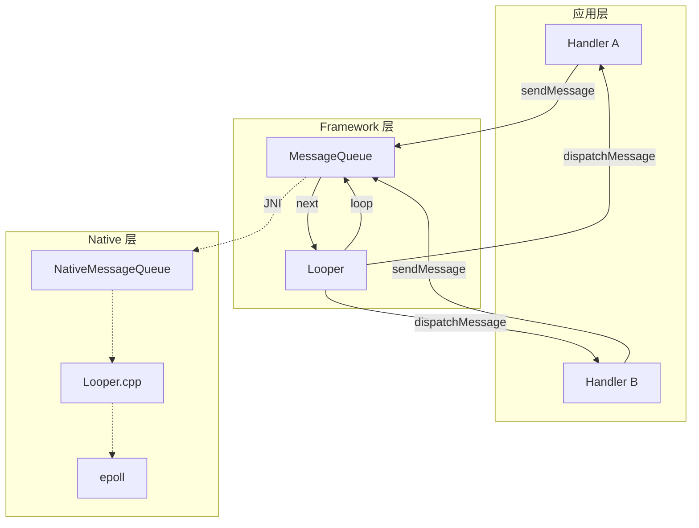
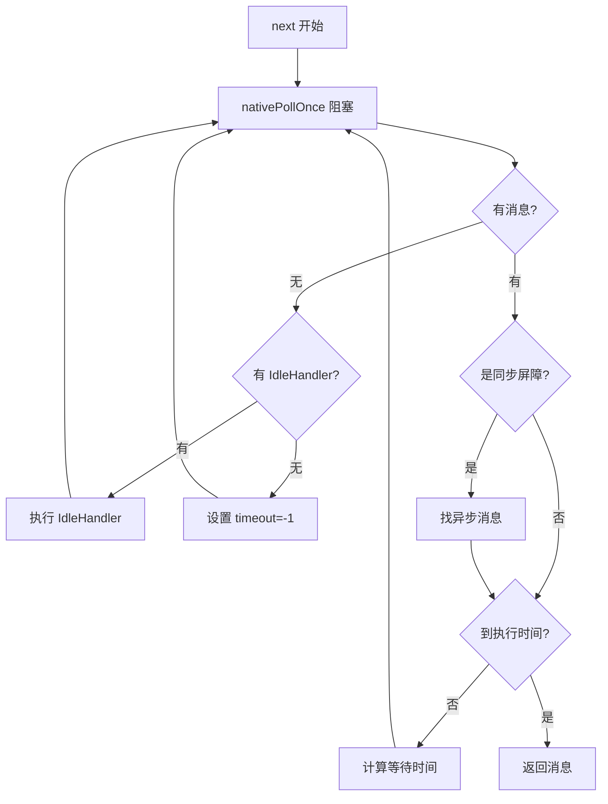

# Handler 源码篇

## 设计哲学

### 为什么 Android 要自己设计一套消息机制？

**核心权衡**：在单线程 UI 模型下，如何高效、安全地实现线程间通信？

| 方案 | 优点 | 缺点 |
|-----|------|------|
| synchronized 加锁 | 简单直接 | 锁竞争严重、容易死锁、代码侵入性强 |
| wait/notify | Java 原生支持 | 编程模型复杂、容易出错 |
| **消息队列** | 解耦、有序、可控 | ✅ Android 的选择 |

**Handler 的设计精髓**：

1. **生产者-消费者模式**：发送者和处理者解耦
2. **单线程消费**：避免锁竞争
3. **优先级队列**：支持延迟消息和优先级
4. **Native 优化**：使用 epoll 实现高效等待

### 整体架构



## 核心源码分析

### 1. Looper：消息循环的核心

#### 一句话总结

Looper 就是一个不停转的"轮子"，从队列取消息、分发消息，没消息就休息。

#### Looper.prepare() 做了什么？

```java
// Looper.java
public static void prepare() {
    prepare(true);  // 可以 quit
}

private static void prepare(boolean quitAllowed) {
    // 💡 关键：一个线程只能有一个 Looper
    if (sThreadLocal.get() != null) {
        throw new RuntimeException("Only one Looper may be created per thread");
    }
    // 创建 Looper 并存入 ThreadLocal
    sThreadLocal.set(new Looper(quitAllowed));
}

private Looper(boolean quitAllowed) {
    // 创建消息队列
    mQueue = new MessageQueue(quitAllowed);
    mThread = Thread.currentThread();
}
```

**设计亮点**：使用 ThreadLocal 保证每个线程只有一个 Looper，避免了复杂的线程同步。

#### Looper.loop() 的死循环

```java
// Looper.java（简化版）
public static void loop() {
    final Looper me = myLooper();
    final MessageQueue queue = me.mQueue;
    
    for (;;) {  // 💡 死循环
        // 1. 取消息（可能阻塞）
        Message msg = queue.next();
        if (msg == null) {
            // 收到 quit 信号，退出循环
            return;
        }
        
        // 2. 分发消息
        // msg.target 就是发送这条消息的 Handler
        msg.target.dispatchMessage(msg);
        
        // 3. 回收消息
        msg.recycleUnchecked();
    }
}
```

**为什么死循环不会 ANR？**

ANR 不是因为"循环"，而是因为"消息处理太慢"。

```
✅ 正常情况：
for (;;) {
    msg = queue.next()  // 没消息就休眠，不占 CPU
    dispatchMessage(msg)  // 快速处理
}

❌ ANR 情况：
for (;;) {
    msg = queue.next()
    dispatchMessage(msg)  // 这里卡了 5 秒！后面的点击事件处理不了
}
```

### 2. MessageQueue：消息队列的设计

#### 一句话总结

MessageQueue 是一个按时间排序的单链表，核心是"何时取消息"的设计。

#### 消息入队：enqueueMessage()

```java
// MessageQueue.java（简化版）
boolean enqueueMessage(Message msg, long when) {
    synchronized (this) {
        msg.when = when;
        Message p = mMessages;  // 队列头
        boolean needWake;
        
        // 💡 情况1：队列为空，或新消息要最先执行
        if (p == null || when == 0 || when < p.when) {
            msg.next = p;
            mMessages = msg;  // 插入队头
            needWake = mBlocked;  // 如果正在阻塞，需要唤醒
        } else {
            // 💡 情况2：找到合适的位置插入
            Message prev;
            for (;;) {
                prev = p;
                p = p.next;
                if (p == null || when < p.when) {
                    break;
                }
            }
            msg.next = p;
            prev.next = msg;
            needWake = false;
        }
        
        // 需要时唤醒
        if (needWake) {
            nativeWake(mPtr);
        }
    }
    return true;
}
```

**设计亮点**：

1. **按 when 排序**：延迟消息自动排到正确位置
2. **最小化唤醒**：只有插入队头才唤醒，减少不必要的唤醒
3. **synchronized 保护**：保证线程安全，但锁粒度小

#### 消息出队：next()

```java
// MessageQueue.java（简化版）
Message next() {
    int nextPollTimeoutMillis = 0;
    
    for (;;) {
        // 💡 核心：Native 层阻塞
        nativePollOnce(ptr, nextPollTimeoutMillis);
        
        synchronized (this) {
            final long now = SystemClock.uptimeMillis();
            Message msg = mMessages;
            
            // 💡 处理同步屏障
            if (msg != null && msg.target == null) {
                // 遇到屏障，找异步消息
                do {
                    msg = msg.next;
                } while (msg != null && !msg.isAsynchronous());
            }
            
            if (msg != null) {
                if (now < msg.when) {
                    // 还没到时间，计算等待时长
                    nextPollTimeoutMillis = (int) Math.min(msg.when - now, Integer.MAX_VALUE);
                } else {
                    // 取出消息
                    mMessages = msg.next;
                    msg.next = null;
                    mBlocked = false;
                    return msg;
                }
            } else {
                nextPollTimeoutMillis = -1;  // 无限等待
            }
            
            // 💡 空闲时处理 IdleHandler
            for (int i = 0; i < pendingIdleHandlerCount; i++) {
                final IdleHandler idler = mPendingIdleHandlers[i];
                boolean keep = idler.queueIdle();
                if (!keep) {
                    mIdleHandlers.remove(idler);
                }
            }
        }
    }
}
```

**核心流程图**：



### 3. Native 层的等待机制

#### 为什么用 Native 层实现等待？

| 方案 | 问题 |
|-----|------|
| Java `Thread.sleep()` | 不精确、不能被中断唤醒 |
| Java `Object.wait()` | 需要额外的锁、不够高效 |
| **Native epoll** | ✅ 精确、可唤醒、省电 |

#### epoll 机制简述

```cpp
// native/Looper.cpp（简化）
int Looper::pollOnce(int timeoutMillis) {
    // 使用 epoll_wait 等待
    int result = epoll_wait(mEpollFd, events, count, timeoutMillis);
    
    // 处理事件
    for (int i = 0; i < result; i++) {
        // 可能是 eventfd 唤醒，也可能是其他 fd 事件
    }
    return result;
}

void Looper::wake() {
    // 向 eventfd 写入数据，唤醒等待的线程
    write(mWakeEventFd, &inc, sizeof(inc));
}
```

**epoll 的三个核心函数**：

```
epoll_create()  ──→  创建 epoll 实例
epoll_ctl()     ──→  注册/修改/删除监听的 fd
epoll_wait()    ──→  等待事件（可设置超时）
```

**为什么 epoll 高效？**

```
select/poll：每次调用都要遍历所有 fd
epoll：内核维护 fd，只返回有事件的 fd

场景：1000 个 fd，只有 1 个有事件
select：遍历 1000 次
epoll：直接返回 1 个
```

### 4. Handler 的消息分发

```java
// Handler.java
public void dispatchMessage(Message msg) {
    // 💡 优先级1：Message 自带的 Runnable
    if (msg.callback != null) {
        handleCallback(msg);
    } else {
        // 💡 优先级2：Handler 的 Callback
        if (mCallback != null) {
            if (mCallback.handleMessage(msg)) {
                return;  // 返回 true 表示已处理
            }
        }
        // 💡 优先级3：子类重写的 handleMessage
        handleMessage(msg);
    }
}

private static void handleCallback(Message message) {
    message.callback.run();  // 直接执行 Runnable
}
```

**分发优先级**：

```
1. msg.callback（post 的 Runnable）    ← 最高
2. Handler.mCallback                   ← 中间
3. Handler.handleMessage()             ← 最低
```

这个设计允许灵活地拦截和处理消息。

### 5. ThreadLocal 的应用

#### 为什么用 ThreadLocal 存 Looper？

**需求**：每个线程只能有一个 Looper，且获取时要简单高效。

**方案对比**：

| 方案 | 实现 | 问题 |
|-----|------|------|
| 全局 Map | `Map<Thread, Looper>` | 需要同步、需要处理 key 弱引用 |
| **ThreadLocal** | `ThreadLocal<Looper>` | ✅ 天然线程隔离、无锁 |

```java
// Looper.java
static final ThreadLocal<Looper> sThreadLocal = new ThreadLocal<>();

public static Looper myLooper() {
    return sThreadLocal.get();
}
```

#### ThreadLocal 原理

```
每个 Thread 都有一个 ThreadLocalMap

Thread1.threadLocalMap:  [key=sThreadLocal, value=Looper1]
Thread2.threadLocalMap:  [key=sThreadLocal, value=Looper2]

访问时：
sThreadLocal.get()
  → Thread.currentThread().threadLocalMap.get(sThreadLocal)
  → 返回当前线程的 Looper
```

### 6. Message 对象池

#### 设计动机

消息发送非常频繁，如果每次都 new Message，会产生大量 GC。

#### 实现方式

```java
// Message.java
public final class Message {
    Message next;  // 💡 链表指针，复用做对象池
    
    private static Message sPool;
    private static int sPoolSize = 0;
    private static final int MAX_POOL_SIZE = 50;
    
    public static Message obtain() {
        synchronized (sPoolSync) {
            if (sPool != null) {
                Message m = sPool;
                sPool = m.next;
                m.next = null;
                sPoolSize--;
                return m;  // 从池中取
            }
        }
        return new Message();  // 池空了才 new
    }
    
    void recycleUnchecked() {
        // 清理所有字段
        flags = FLAG_IN_USE;
        what = 0;
        arg1 = 0;
        arg2 = 0;
        obj = null;
        // ...
        
        synchronized (sPoolSync) {
            if (sPoolSize < MAX_POOL_SIZE) {
                next = sPool;
                sPool = this;  // 放回池中
                sPoolSize++;
            }
        }
    }
}
```

**设计亮点**：

1. **复用 next 字段**：作为链表指针，也作为对象池的链表指针
2. **限制池大小**：最多 50 个，避免内存浪费
3. **线程安全**：synchronized 保护

## 设计亮点总结

### 1. 分层设计

```
┌─────────────────────────────────────────┐
│  应用层：Handler（API 简单易用）          │
├─────────────────────────────────────────┤
│  Framework：Looper + MessageQueue        │
│  （Java 层的调度逻辑）                    │
├─────────────────────────────────────────┤
│  Native：Looper.cpp + epoll             │
│  （高效的等待/唤醒机制）                  │
└─────────────────────────────────────────┘
```

### 2. 延迟计算

```java
// 不是立即计算"还要等多久"，而是在取消息时才计算
Message next() {
    for (;;) {
        nativePollOnce(ptr, nextPollTimeoutMillis);  // 用上次计算的超时
        // ...
        nextPollTimeoutMillis = msg.when - now;  // 这次计算下次的超时
    }
}
```

### 3. 最小化唤醒

```java
// 只有必要时才唤醒
boolean enqueueMessage(Message msg, long when) {
    boolean needWake;
    
    if (插入队头 && 线程正在阻塞) {
        needWake = true;  // 需要唤醒
    } else {
        needWake = false;  // 不用唤醒
    }
    
    if (needWake) {
        nativeWake(mPtr);
    }
}
```

### 4. 同步屏障的精巧设计

```java
// 用 target == null 标识屏障，复用 Message 结构
public int postSyncBarrier() {
    Message msg = Message.obtain();
    msg.when = when;
    // msg.target = null;  // 💡 不设置 target
    // 插入队列...
}

// next() 中检测
if (msg.target == null) {
    // 是屏障，跳过同步消息
}
```

## 可借鉴的编程技巧

### 1. 对象池模式

```kotlin
// 通用对象池实现
class ObjectPool<T>(
    private val maxSize: Int,
    private val factory: () -> T,
    private val reset: (T) -> Unit
) {
    private val pool = ArrayDeque<T>()
    
    fun obtain(): T {
        return synchronized(pool) {
            pool.pollFirst() ?: factory()
        }
    }
    
    fun recycle(obj: T) {
        reset(obj)
        synchronized(pool) {
            if (pool.size < maxSize) {
                pool.addFirst(obj)
            }
        }
    }
}
```

### 2. ThreadLocal 存储线程私有数据

```kotlin
// 示例：线程私有的 SimpleDateFormat（避免线程安全问题）
private val dateFormatThreadLocal = object : ThreadLocal<SimpleDateFormat>() {
    override fun initialValue() = SimpleDateFormat("yyyy-MM-dd", Locale.US)
}

fun formatDate(date: Date): String {
    return dateFormatThreadLocal.get()!!.format(date)
}
```

### 3. 生产者-消费者模式

```kotlin
// 简化版消息队列
class SimpleMessageQueue<T> {
    private val queue = LinkedList<T>()
    private val lock = ReentrantLock()
    private val notEmpty = lock.newCondition()
    
    fun put(item: T) {
        lock.withLock {
            queue.add(item)
            notEmpty.signal()
        }
    }
    
    fun take(): T {
        lock.withLock {
            while (queue.isEmpty()) {
                notEmpty.await()
            }
            return queue.removeFirst()
        }
    }
}
```

## 深度问题

### Q1：如果让你设计 Handler，你会怎么做？

**思考维度**：

1. **线程模型**：单消费者？多消费者？
2. **队列结构**：数组？链表？堆？
3. **等待机制**：Java wait？Native？
4. **优先级**：支持吗？怎么实现？

**Android 的选择**：

| 决策 | 选择 | 原因 |
|-----|------|------|
| 线程模型 | 单消费者 | 简化设计，避免同步 |
| 队列结构 | 按时间排序的单链表 | 延迟消息场景多，链表插入 O(n) 可接受 |
| 等待机制 | Native epoll | 精确、可唤醒、省电 |
| 优先级 | 同步屏障 | 特殊场景优先处理 |

### Q2：Handler 有什么可以改进的地方？

**可能的改进**：

1. **更好的背压**：当消息堆积时的处理策略
2. **取消机制**：更细粒度的消息取消
3. **监控能力**：内置的消息执行耗时监控
4. **协程集成**：更好地与 Kotlin 协程配合

**现状**：这些需求现在通过上层封装（如协程的 Dispatchers.Main）来实现。

### Q3：主线程 Looper 永不退出，内存怎么管理的？

**关键点**：

1. Message 使用对象池，减少对象创建
2. Message.recycle() 回收后清理所有字段
3. Handler 应该在不需要时 remove 消息

**潜在问题**：

```kotlin
// ❌ 泄漏：msg.obj 持有大对象
val msg = Message.obtain()
msg.obj = hugeBitmap  // 如果消息一直在队列，hugeBitmap 不会释放

// ✅ 改进：及时清理
onDestroy() {
    handler.removeCallbacksAndMessages(null)
}
```

---

## 面试题检验

### Q1：Looper.loop() 是死循环，为什么不会导致 ANR？

**结论**：ANR 不是因为循环，而是因为某条消息处理太慢。

**原理**：
1. `loop()` 的死循环是必要的，它让线程保持运行，持续处理消息
2. 当没有消息时，线程在 `nativePollOnce()` 处休眠，不占 CPU
3. ANR 发生在某条消息（如触摸事件）处理超过 5 秒，阻塞了后续消息

**类比**：死循环就像值班室的保安，平时在休息（阻塞），有人来了就处理（dispatchMessage），处理完继续等待。保安值班不会出问题，但如果他接待一个访客花了 5 分钟，后面排队的人就不满了（ANR）。

---

### Q2：MessageQueue 的 next() 是如何实现等待的？

**结论**：通过 Native 层的 epoll 机制实现高效等待。

**原理**：
1. 调用 `nativePollOnce(ptr, timeout)`，最终调用 `epoll_wait()`
2. timeout = -1 时无限等待，timeout = 0 时立即返回，timeout > 0 时等待指定毫秒
3. 有新消息时通过 `nativeWake()` 唤醒（向 eventfd 写数据）

**为什么不用 Java 的 wait？**
- epoll 更高效，是 Linux 的 IO 多路复用机制
- 可以同时监听多种事件（不只是消息）
- 唤醒更精确，不需要额外的锁

---

### Q3：为什么用 ThreadLocal 存储 Looper？

**结论**：利用 ThreadLocal 的线程隔离特性，无锁实现"每个线程只有一个 Looper"。

**对比**：
```java
// 方案1：全局 Map（需要同步）
Map<Thread, Looper> map = new ConcurrentHashMap<>();
Looper get() {
    return map.get(Thread.currentThread());
}

// 方案2：ThreadLocal（无锁）
ThreadLocal<Looper> tl = new ThreadLocal<>();
Looper get() {
    return tl.get();  // 直接从当前线程的 ThreadLocalMap 获取
}
```

ThreadLocal 的优势：
1. 无锁，性能高
2. 天然保证线程隔离
3. 代码简洁

---

### Q4：Handler 的消息分发优先级是怎样的？

**结论**：msg.callback > Handler.mCallback > handleMessage()

**流程**：
```java
dispatchMessage(msg) {
    if (msg.callback != null) {
        // 1. post() 的 Runnable
        msg.callback.run();
    } else if (mCallback != null && mCallback.handleMessage(msg)) {
        // 2. 构造 Handler 时传入的 Callback
        return;
    } else {
        // 3. 子类重写的 handleMessage
        handleMessage(msg);
    }
}
```

**应用场景**：可以通过 mCallback 做消息拦截。

---

### Q5：同步屏障是如何实现的？有什么应用场景？

**结论**：通过插入 target=null 的特殊 Message 实现，用于让异步消息优先执行。

**实现原理**：
1. `postSyncBarrier()` 插入一个 target 为 null 的 Message
2. `next()` 遍历时遇到 target=null，就跳过后续的同步消息
3. 只返回 `isAsynchronous=true` 的异步消息

**应用场景**：View 绘制（scheduleTraversals），保证 UI 刷新的优先级。

---

_本文档将持续更新，添加更多相关内容_
