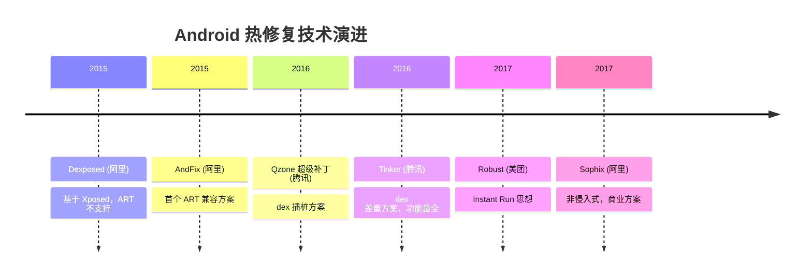
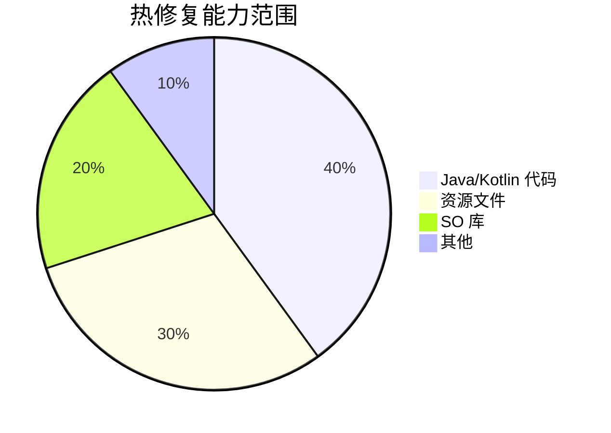
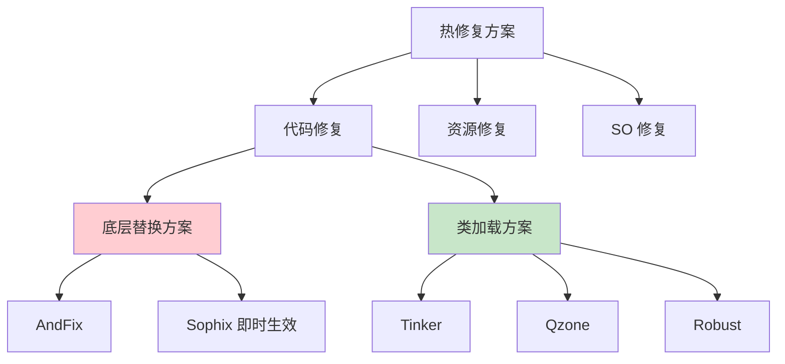
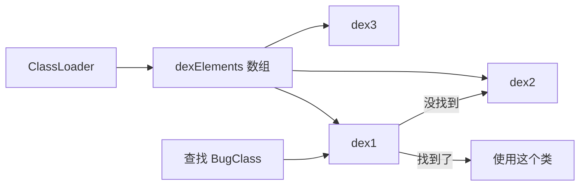

# 热修复基础篇

> 不发版也能修 Bug 的黑科技

## 一、技术演进：为什么需要热修复？

### 传统修复流程有多痛？

想象一下这个场景：

周五晚上 11 点，你正准备睡觉，突然收到告警——线上 Crash 率飙升！一个空指针导致支付功能挂了。

**传统修复流程**：
1. 定位问题，修复代码（30 分钟）
2. 测试验证（1 小时）
3. 打包发布（30 分钟）
4. 应用市场审核（1-3 天）
5. 用户更新（又是一个漫长的过程）

**整个周末都毁了，而且损失已经造成。**

### 热修复的价值

热修复就像是给汽车装了一个"空中升级"系统：

| 对比项 | 传统发版 | 热修复 |
|-------|---------|-------|
| 修复周期 | 1-3 天 | 几分钟到几小时 |
| 用户感知 | 需要下载安装 | 静默修复或重启 App |
| 覆盖率 | 取决于用户更新意愿 | 可达 90%+ |
| 审核风险 | 需要应用商店审核 | 不经过商店 |

### 热修复发展历程



## 二、什么是热修复？

### 定义

热修复（HotFix）是一种**不需要用户重新安装 App，就能动态修复线上 Bug** 的技术。通过下发补丁包，在用户无感知或只需重启 App 的情况下完成修复。

### 通俗理解

把热修复想象成**打补丁**：

- **你的 App** = 一件衣服
- **线上 Bug** = 衣服破了个洞
- **传统发版** = 买件新衣服（费时费力）
- **热修复** = 缝个补丁（快速修复）

用户穿着衣服，你就能把补丁缝上去，甚至都不用脱衣服（即时生效）。

### 热修复 vs 热更新 vs 插件化

这三个概念经常被混淆，来理清一下：

| 技术 | 目的 | 场景 | 实现难度 |
|-----|------|------|---------|
| **热修复** | 修复 Bug | 紧急线上问题 | 中等 |
| **热更新** | 更新功能 | 小范围功能迭代 | 中等 |
| **插件化** | 动态加载模块 | 模块化、减小包体积 | 高 |

**一句话区分**：
- 热修复：**修 Bug**，改的是原有代码
- 热更新：**加功能**，可能加新代码
- 插件化：**加模块**，整个功能模块动态加载

> 实际上，很多框架（如 Tinker）同时支持热修复和热更新。

## 三、热修复能修什么？

### 修复范围



| 可修复 | 不可修复 |
|-------|---------|
| Java/Kotlin 代码 Bug | AndroidManifest.xml 修改 |
| 资源文件（图片、布局等） | 新增四大组件 |
| SO 库 | 修改应用签名 |
| 部分混淆规则 | 新增权限 |

### 为什么有些不能修？

**AndroidManifest.xml 不能修** 是因为：
- 安装时由 PackageManagerService 解析
- 四大组件需要在安装时注册到系统
- 修改等于重新安装

**类比**：热修复就像装修房子，你可以换家具（代码）、换墙纸（资源），但不能改承重墙（Manifest）。

## 四、主流热修复方案介绍

### 4.1 方案全景图



### 4.2 各方案简介

#### Tinker（腾讯）

**核心思想**：生成 dex 差量包，运行时合成新 dex。

```
┌──────────────┐     ┌──────────────┐
│   原始 dex   │  +  │  差量补丁    │  =  新 dex
│  (App 内)    │     │  (下发)      │
└──────────────┘     └──────────────┘
```

**特点**：
- ✅ 功能最全面：代码、资源、SO 都能修
- ✅ 开源免费，社区活跃
- ❌ 需要重启 App 生效
- ❌ 合成过程有性能开销

#### Sophix（阿里）

**核心思想**：同时支持底层替换和类加载方案，根据情况自动选择。

**特点**：
- ✅ 可即时生效（底层替换方案）
- ✅ 非侵入式，接入简单
- ✅ 阿里系 App 大规模验证
- ❌ 商业付费产品

#### Robust（美团）

**核心思想**：借鉴 Instant Run，编译时插桩，运行时替换方法。

```java
// 原始代码
public void test() {
    // 原逻辑
}

// 插桩后
public void test() {
    if (changeQuickRedirect != null) {
        // 执行补丁逻辑
        return;
    }
    // 原逻辑
}
```

**特点**：
- ✅ 即时生效，无需重启
- ✅ 兼容性好，稳定性高
- ❌ 会增大包体积（插桩代码）
- ❌ 不支持资源和 SO 修复

#### AndFix（阿里，已停止维护）

**核心思想**：直接替换 ArtMethod 结构体。

**特点**：
- ✅ 即时生效
- ❌ 兼容性差（不同 ROM 定制）
- ❌ 不支持新增类和字段
- ❌ 已停止维护

### 4.3 方案对比表

| 特性 | Tinker | Sophix | Robust | AndFix |
|-----|--------|--------|--------|--------|
| 公司 | 腾讯 | 阿里 | 美团 | 阿里 |
| 开源 | ✅ | ❌ | ✅ | ✅ |
| 即时生效 | ❌ | ✅/❌ | ✅ | ✅ |
| 代码修复 | ✅ | ✅ | ✅ | ✅ |
| 新增类 | ✅ | ✅ | ✅ | ❌ |
| 资源修复 | ✅ | ✅ | ❌ | ❌ |
| SO 修复 | ✅ | ✅ | ❌ | ❌ |
| 稳定性 | 高 | 高 | 高 | 中 |
| 维护状态 | 活跃 | 活跃 | 活跃 | 停止 |

## 五、快速接入 Tinker

### 5.1 为什么选 Tinker？

- 腾讯开源，微信、QQ 等亿级 App 验证
- 功能全面，代码、资源、SO 都支持
- 社区活跃，文档完善
- 免费！

### 5.2 接入步骤

#### Step 1: 添加依赖

```kotlin
// 项目级 build.gradle.kts
buildscript {
    dependencies {
        classpath("com.tencent.tinker:tinker-patch-gradle-plugin:1.9.14.25")
    }
}

// 模块级 build.gradle.kts
plugins {
    id("com.tencent.tinker.patch")
}

dependencies {
    implementation("com.tencent.tinker:tinker-android-lib:1.9.14.25")
    annotationProcessor("com.tencent.tinker:tinker-android-anno:1.9.14.25")
}
```

#### Step 2: 配置 Application

```kotlin
// 原来的 Application 需要改造
// 方式一：使用注解（推荐）
@DefaultLifeCycle(
    application = "com.example.MyApplication",
    flags = ShareConstants.TINKER_ENABLE_ALL
)
class MyApplicationLike(
    application: Application,
    tinkerFlags: Int,
    tinkerLoadVerifyFlag: Boolean,
    applicationStartElapsedTime: Long,
    applicationStartMillisTime: Long,
    tinkerResultIntent: Intent?
) : ApplicationLike(
    application, tinkerFlags, tinkerLoadVerifyFlag,
    applicationStartElapsedTime, applicationStartMillisTime, tinkerResultIntent
) {

    override fun onCreate() {
        super.onCreate()
        // 原 Application.onCreate() 的逻辑迁移到这里
    }
}
```

#### Step 3: 初始化 Tinker

```kotlin
override fun onCreate() {
    super.onCreate()

    // 初始化 Tinker
    TinkerInstaller.install(this)
}
```

#### Step 4: 生成补丁

1. 打基准包（线上版本）时，保存好 `mapping.txt` 和 `R.txt`
2. 修复 Bug 后，使用 gradle 命令生成补丁：

```bash
./gradlew tinkerPatchRelease
```

3. 将生成的补丁文件下发给客户端

#### Step 5: 加载补丁

```kotlin
// 下载补丁后，调用加载
TinkerInstaller.onReceiveUpgradePatch(context, patchPath)
```

### 5.3 完整示例

```kotlin
class MyApp : Application() {

    override fun onCreate() {
        super.onCreate()
        initTinker()
    }

    private fun initTinker() {
        // 检查是否有新补丁
        checkPatch()
    }

    private fun checkPatch() {
        // 假设从服务器获取补丁信息
        val patchUrl = getPatchUrlFromServer()
        if (patchUrl != null) {
            downloadAndApplyPatch(patchUrl)
        }
    }

    private fun downloadAndApplyPatch(url: String) {
        // 下载补丁到本地
        val patchFile = downloadPatch(url)

        // 应用补丁（下次启动生效）
        TinkerInstaller.onReceiveUpgradePatch(this, patchFile.absolutePath)
    }
}
```

## 六、热修复工作原理（白话版）

### 6.1 类加载方案原理

Android 的类加载机制是：**先找到的类先用**。



**热修复的思路**：把补丁 dex 插到数组最前面！

```
修复前: [原始dex1, 原始dex2, 原始dex3]
修复后: [补丁dex, 原始dex1, 原始dex2, 原始dex3]
                ↑
          BugClass 在这里，优先被加载
```

就像排队买票，插队到最前面，就能最先被服务到。

### 6.2 底层替换方案原理

Java 方法在 ART 虚拟机中对应一个 `ArtMethod` 结构体。

**直接把旧方法的 ArtMethod 替换成新方法的**：

```
修复前: bugMethod() -> ArtMethod_old
修复后: bugMethod() -> ArtMethod_new
```

就像换电池，直接把旧电池拔了换新的。

### 6.3 两种方案对比

| 对比项 | 类加载方案 | 底层替换方案 |
|-------|-----------|------------|
| 代表框架 | Tinker, Qzone | AndFix, Sophix(部分) |
| 生效时机 | 重启 App | 即时生效 |
| 修复能力 | 能新增类/字段 | 只能改方法内部实现 |
| 稳定性 | 高 | 中（ROM 兼容问题） |
| 原理 | 修改 dex 加载顺序 | 替换 ArtMethod |

## 七、常见问题与解决方案

### 7.1 补丁不生效

**排查步骤**：

1. **检查签名**：补丁和基准包必须同一签名
```kotlin
// 查看日志
TinkerLog.d(TAG, "Tinker patch result: ${result.isSuccess}")
```

2. **检查混淆映射**：必须使用同一份 `mapping.txt`

3. **检查补丁格式**：确保补丁文件完整

### 7.2 修复后 Crash

**常见原因**：CLASS_ISPREVERIFIED 问题

**背景**：Dalvik 虚拟机会对类做预校验，如果类的所有依赖都在同一个 dex 中，会打上 `CLASS_ISPREVERIFIED` 标记。

**问题**：如果打了这个标记，运行时引用其他 dex 的类会报错。

**解决**：编译时插入一个对其他 dex 的引用，阻止预校验。

### 7.3 兼容性问题

```kotlin
// 检查 Tinker 是否可用
if (TinkerApplicationHelper.isTinkerEnableForNativeLib()) {
    // 可以修复 SO
}

// 检查当前是否已加载补丁
if (Tinker.with(context).isTinkerLoaded) {
    // 已加载补丁
}
```

## 八、最佳实践

### 8.1 补丁策略

```kotlin
// 1. 版本匹配：补丁要和 App 版本严格匹配
data class PatchInfo(
    val patchVersion: String,
    val targetAppVersion: String,  // 目标 App 版本
    val downloadUrl: String,
    val md5: String
)

// 2. 灰度发布：先小范围验证
fun shouldApplyPatch(userId: String, grayRatio: Float): Boolean {
    return userId.hashCode() % 100 < grayRatio * 100
}

// 3. 回滚机制：补丁有问题能及时回滚
fun rollbackPatch() {
    Tinker.with(context).cleanPatch()
}
```

### 8.2 测试建议

1. **基准包测试**：确保基准包功能正常
2. **补丁包测试**：
   - 修复效果验证
   - 无副作用验证
   - 多机型兼容测试
3. **灰度观察**：
   - 先发 1% 用户
   - 观察 Crash 率和日志
   - 逐步放量

## 九、面试检验

### Q1: 什么是热修复？为什么需要热修复？

**答**：热修复是一种不需要用户重新安装 App，就能动态修复线上 Bug 的技术。

**为什么需要**：
- 传统发版周期长（改代码→打包→审核→用户更新）
- 线上紧急 Bug 需要快速修复
- 减少用户流失和损失

### Q2: 热修复能修什么？不能修什么？

**答**：

| 能修 | 不能修 |
|-----|-------|
| Java/Kotlin 代码 | AndroidManifest.xml |
| 资源文件 | 新增四大组件 |
| SO 库 | 新增权限 |

**不能修的原因**：AndroidManifest 在安装时解析，四大组件需要在系统注册。

### Q3: 主流热修复方案有哪些？各有什么特点？

**答**：

| 方案 | 特点 |
|-----|------|
| Tinker | 功能全面，需重启，开源免费 |
| Sophix | 可即时生效，商业付费 |
| Robust | 即时生效，只能修代码 |
| AndFix | 即时生效，已停止维护 |

**选择建议**：
- 需要资源修复 → Tinker/Sophix
- 需要即时生效 → Robust/Sophix
- 开源免费 → Tinker/Robust

### Q4: 类加载方案的原理是什么？

**答**：利用 Android 类加载的**双亲委派和线性查找机制**。

Android 的 `PathClassLoader` 内部有一个 `dexElements` 数组，加载类时按顺序查找，**先找到的先用**。

热修复的做法是：把补丁 dex 插到数组最前面，让补丁中的类优先被加载。

### Q5: 热修复和插件化有什么区别？

**答**：

| 对比 | 热修复 | 插件化 |
|-----|-------|-------|
| 目的 | 修复 Bug | 动态加载模块 |
| 修改范围 | 修改已有代码 | 加载新模块 |
| 实现难度 | 中等 | 高 |
| 典型场景 | 紧急修复线上问题 | 模块化架构、减小包体积 |

---
_本文档将持续更新，添加更多相关内容_
