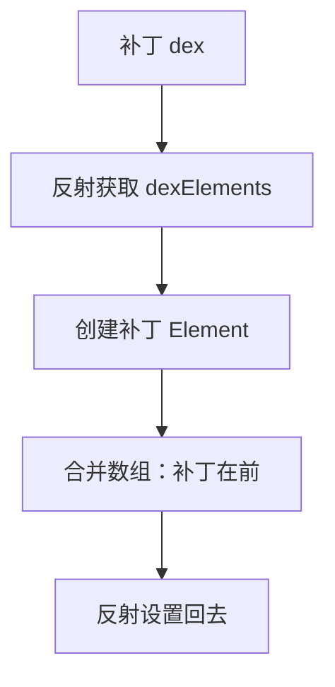
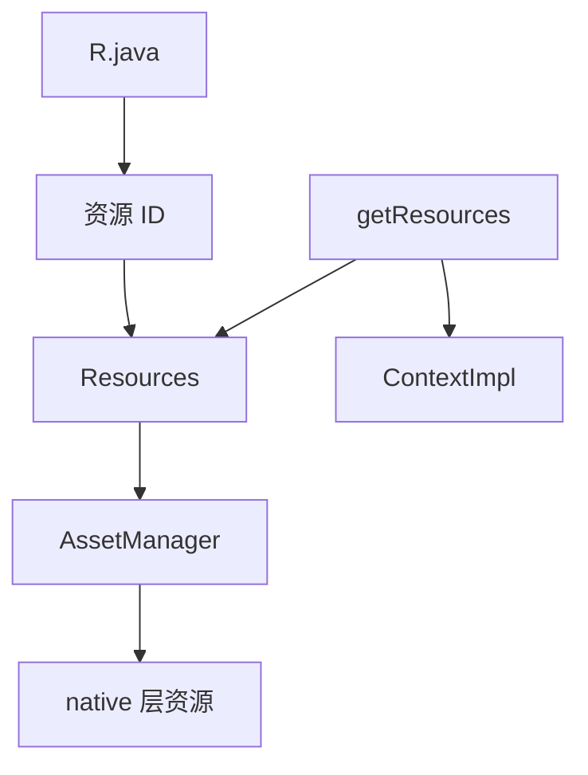
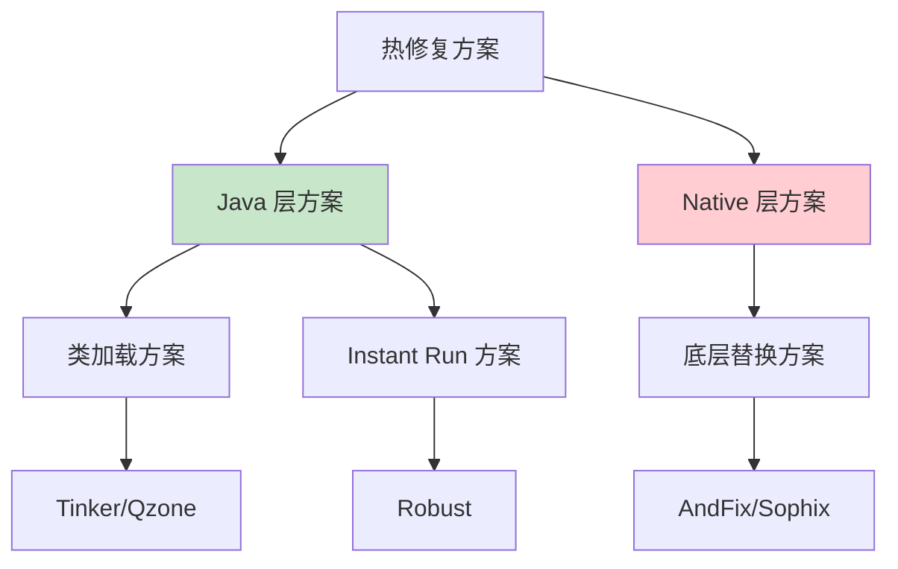
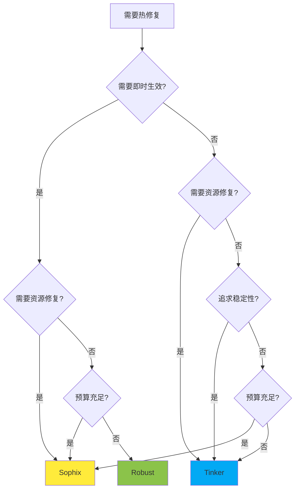
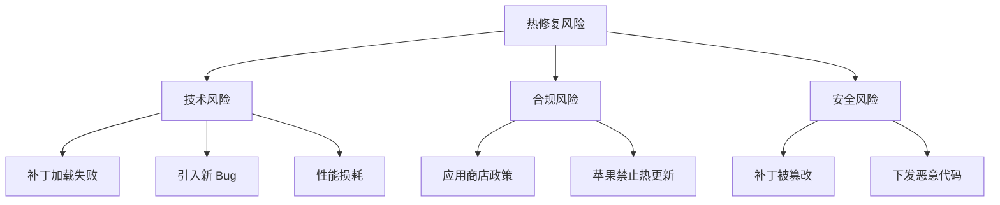

# 热修复进阶篇

> 深入原理，掌握各方案的核心技术

## 一、代码修复原理深度剖析

### 1.1 类加载方案详解

#### 核心原理

Android 使用 `PathClassLoader` 加载 App 的类，内部通过 `DexPathList` 管理多个 dex 文件。

```java
// DexPathList.java 简化版
public class DexPathList {
    // 核心！dex 文件数组
    private Element[] dexElements;

    public Class<?> findClass(String name) {
        // 遍历数组，找到就返回
        for (Element element : dexElements) {
            Class<?> clazz = element.findClass(name);
            if (clazz != null) {
                return clazz;  // 先找到先用！
            }
        }
        return null;
    }
}
```

**关键洞察**：谁在数组前面，谁就优先被加载。

#### 热修复做法



**核心代码实现**：

```kotlin
/**
 * 类加载方案核心实现
 * 原理：将补丁 dex 插入 dexElements 数组最前面
 */
object ClassLoaderHotFix {

    fun loadPatch(context: Context, patchDexPath: String) {
        // 1. 获取当前 ClassLoader 的 pathList
        val classLoader = context.classLoader
        val pathListField = getField(classLoader.javaClass, "pathList")
        val pathList = pathListField.get(classLoader)

        // 2. 获取 pathList 的 dexElements
        val dexElementsField = getField(pathList.javaClass, "dexElements")
        val oldElements = dexElementsField.get(pathList) as Array<*>

        // 3. 创建补丁的 Element 数组
        val patchElements = makeDexElements(pathList, patchDexPath)

        // 4. 合并数组：补丁在前！
        val newElements = Array(patchElements.size + oldElements.size) { i ->
            if (i < patchElements.size) patchElements[i]
            else oldElements[i - patchElements.size]
        }

        // 5. 设置回去
        dexElementsField.set(pathList, newElements)
    }

    private fun getField(clazz: Class<*>, name: String): Field {
        return clazz.getDeclaredField(name).apply { isAccessible = true }
    }
}
```

#### CLASS_ISPREVERIFIED 问题

**问题背景**：

在 Dalvik 虚拟机上，系统会对类进行预校验：
- 如果一个类的所有依赖都在同一个 dex 中，会被标记为 `CLASS_ISPREVERIFIED`
- 被标记的类，在运行时如果引用了其他 dex 的类，会抛出异常

```java
// 抛出异常
java.lang.IllegalAccessError:
    Class ref in pre-verified class resolved to unexpected implementation
```

**解决方案（Qzone 方案）**：

编译时在每个类的构造函数中插入一段代码，引用一个在单独 dex 中的类：

```java
// 原始代码
public class MyClass {
    public MyClass() {
        // 原逻辑
    }
}

// 插桩后
public class MyClass {
    public MyClass() {
        // 插入的代码，引用 hack.dex 中的类
        System.out.println(AntiLazyLoad.class);
        // 原逻辑
    }
}
```

**这样类就不会被标记为 ISPREVERIFIED，修复时才能正常加载补丁中的类。**

> **注意**：ART 虚拟机（Android 5.0+）没有这个问题，因为 ART 使用 AOT 编译而非运行时校验。

### 1.2 底层替换方案详解

#### 核心原理

在 ART 虚拟机中，每个 Java 方法对应一个 `ArtMethod` 结构体。底层替换方案直接替换这个结构体。

```cpp
// ArtMethod 结构体（简化版）
struct ArtMethod {
    uint32_t declaring_class_;      // 所属类
    uint32_t access_flags_;         // 访问标志
    uint32_t dex_code_item_offset_; // 方法代码偏移
    uint32_t dex_method_index_;     // 方法索引
    // ... 更多字段
    void* entry_point_from_quick_compiled_code_;  // 机器码入口点！
};
```

**修复做法**：用新方法的 ArtMethod 整体替换旧方法的。

```cpp
// 伪代码
void hotfix(Method oldMethod, Method newMethod) {
    // 获取 ArtMethod 指针
    ArtMethod* oldArt = getArtMethod(oldMethod);
    ArtMethod* newArt = getArtMethod(newMethod);

    // 整体替换（memcpy）
    memcpy(oldArt, newArt, sizeof(ArtMethod));
}
```

#### 兼容性挑战

**问题**：不同 Android 版本、不同厂商 ROM，ArtMethod 结构体可能不同！

```cpp
// Android 7.0 的 ArtMethod
struct ArtMethod {
    // 字段 A
    // 字段 B
    // ...
};

// 某厂商定制的 ArtMethod
struct ArtMethod {
    // 字段 A
    // 新增字段 X  ← 多了个字段！
    // 字段 B
    // ...
};
```

**sizeof(ArtMethod) 不一样，直接 memcpy 会出问题！**

**Sophix 的解决方案**：

不依赖固定的 ArtMethod 大小，而是动态计算：

```kotlin
/**
 * 动态计算 ArtMethod 大小
 * 原理：连续两个方法的 ArtMethod 指针差值就是单个大小
 */
fun getArtMethodSize(): Int {
    val method1 = SizeHelper::class.java.getDeclaredMethod("method1")
    val method2 = SizeHelper::class.java.getDeclaredMethod("method2")

    // 通过反射获取 ArtMethod 指针
    val artMethod1 = getArtMethodPointer(method1)
    val artMethod2 = getArtMethodPointer(method2)

    // 两个连续方法的指针差值就是 ArtMethod 大小
    return (artMethod2 - artMethod1).toInt()
}

// 辅助类，定义两个连续的方法
class SizeHelper {
    fun method1() {}
    fun method2() {}
}
```

#### 方案局限性

| 能修 | 不能修 |
|-----|-------|
| 方法内部实现 | 新增类 |
| 修改方法逻辑 | 新增字段 |
| | 新增/删除方法 |
| | 修改方法签名 |

**原因**：只是替换了方法的实现，类的结构（字段、方法列表）没变。

### 1.3 Instant Run 方案（Robust）

#### 核心原理

借鉴 Google 的 Instant Run，编译时给每个方法添加一个"开关"。

```java
// 原始代码
public String getName() {
    return "old";
}

// 插桩后
public static ChangeQuickRedirect changeQuickRedirect;

public String getName() {
    // 开关：如果有补丁，走补丁逻辑
    if (changeQuickRedirect != null) {
        if (PatchProxy.isSupport(new Object[0], this, changeQuickRedirect, false)) {
            return (String) PatchProxy.accessDispatch(new Object[0], this, changeQuickRedirect, false);
        }
    }
    // 原逻辑
    return "old";
}
```

#### 补丁代码

```java
// 补丁类，实现 ChangeQuickRedirect 接口
public class NamePatch implements ChangeQuickRedirect {

    @Override
    public Object accessDispatch(String methodName, Object[] params) {
        if ("getName".equals(methodName)) {
            return "new";  // 修复后的逻辑
        }
        return null;
    }

    @Override
    public boolean isSupport(String methodName, Object[] params) {
        return "getName".equals(methodName);
    }
}

// 加载补丁
public void loadPatch() {
    // 设置开关
    TargetClass.changeQuickRedirect = new NamePatch();
}
```

#### 优缺点分析

| 优点 | 缺点 |
|-----|------|
| 即时生效 | 增大包体积（每个方法都插桩） |
| 兼容性极好（纯 Java 实现） | 不支持资源修复 |
| 开发阶段和线上用同一套 | 不支持 SO 修复 |
| 不依赖 ROM 实现 | 对性能有轻微影响 |

## 二、资源修复原理

### 2.1 Android 资源加载机制



**核心类**：
- `Resources`：资源访问入口
- `AssetManager`：真正加载资源的类，native 层实现
- `R.java`：编译时生成，包含资源 ID 映射

### 2.2 资源修复方案

#### 方案一：替换 AssetManager（Instant Run 方案）

```kotlin
/**
 * 资源修复核心代码
 * 原理：创建新的 AssetManager，添加补丁资源路径
 */
fun loadPatchResources(context: Context, patchResPath: String) {
    // 1. 创建新的 AssetManager
    val newAssetManager = AssetManager::class.java.newInstance()

    // 2. 添加补丁资源路径（反射调用 addAssetPath）
    val addAssetPathMethod = AssetManager::class.java
        .getDeclaredMethod("addAssetPath", String::class.java)
    addAssetPathMethod.invoke(newAssetManager, patchResPath)

    // 3. 替换所有 Resources 中的 AssetManager
    replaceAssetManager(context, newAssetManager)
}

private fun replaceAssetManager(context: Context, newAssetManager: AssetManager) {
    // 获取所有 Resources 实例
    val resources = context.resources

    // 反射替换 mAssets 字段
    val mAssetsField = Resources::class.java.getDeclaredField("mAssets")
    mAssetsField.isAccessible = true
    mAssetsField.set(resources, newAssetManager)

    // 还需要处理 Activity、Application 等的 Resources
    // ...
}
```

#### 方案二：修改资源包路径（Tinker 方案）

Tinker 的思路更彻底：**合成新的资源包**。

```
┌──────────────────┐     ┌────────────────┐
│  原始 resources  │  +  │  补丁 resources │
└──────────────────┘     └────────────────┘
            ↓
    ┌──────────────────┐
    │   合成新资源包    │
    └──────────────────┘
            ↓
    ┌──────────────────┐
    │ 替换 AssetManager │
    │   的加载路径      │
    └──────────────────┘
```

### 2.3 资源 ID 冲突问题

**问题背景**：

资源 ID 格式：`0xPPTTNNNN`
- PP：Package ID（应用为 0x7f）
- TT：Type ID（drawable=0x01, layout=0x02...）
- NNNN：Entry ID（资源序号）

```
// 基准包
R.drawable.icon = 0x7f020001

// 补丁包新增了资源
R.drawable.new_icon = 0x7f020002
R.drawable.icon = 0x7f020003  ← ID 变了！
```

**问题**：如果补丁包的资源 ID 和基准包不一致，会导致资源找不到或错乱。

**解决方案（Tinker）**：

1. 打基准包时，固定资源 ID（`public.xml`）
2. 打补丁包时，使用相同的资源 ID 分配
3. 新增资源使用新的 ID

```xml
<!-- public.xml 固定资源 ID -->
<resources>
    <public type="drawable" name="icon" id="0x7f020001" />
    <!-- ... -->
</resources>
```

## 三、SO 库修复原理

### 3.1 SO 加载机制

```java
// Java 层加载 SO
System.loadLibrary("native-lib");

// 实际调用
Runtime.getRuntime().loadLibrary0(classLoader, "native-lib");
```

**查找路径**：
1. `app/lib/[abi]/`
2. `/system/lib/` 或 `/system/lib64/`
3. ClassLoader 的 `nativeLibraryDirectories`

### 3.2 SO 修复方案

#### 方案一：修改查找路径

```kotlin
/**
 * SO 修复方案
 * 原理：将补丁 SO 路径插入 nativeLibraryDirectories 最前面
 */
fun loadPatchSo(context: Context, patchSoDir: String) {
    val classLoader = context.classLoader

    // 1. 获取 pathList
    val pathListField = getField(classLoader.javaClass, "pathList")
    val pathList = pathListField.get(classLoader)

    // 2. 获取 nativeLibraryDirectories
    val nativeLibDirsField = getField(pathList.javaClass, "nativeLibraryDirectories")
    val oldDirs = nativeLibDirsField.get(pathList) as List<File>

    // 3. 补丁目录插到最前面
    val newDirs = mutableListOf<File>()
    newDirs.add(File(patchSoDir))  // 补丁在前！
    newDirs.addAll(oldDirs)

    // 4. 设置回去
    nativeLibDirsField.set(pathList, newDirs)

    // 5. 还需要更新 nativeLibraryPathElements
    updateNativeLibraryPathElements(pathList, newDirs)
}
```

#### 方案二：重新加载（Sophix 方案）

如果 SO 已经被加载，需要特殊处理：

```kotlin
/**
 * 重新加载 SO
 * 注意：已加载的 SO 无法卸载，只能在下次启动前替换
 */
fun reloadSo(patchSoPath: String) {
    // 1. 复制补丁 SO 到私有目录
    val targetPath = copyToPrivateDir(patchSoPath)

    // 2. 下次启动前，修改 SO 查找路径
    // 让补丁 SO 优先被找到
}
```

### 3.3 SO 修复的挑战

| 挑战 | 原因 | 解决方案 |
|-----|------|---------|
| 已加载的 SO 无法卸载 | Linux 机制 | 下次启动生效 |
| ABI 兼容性 | arm64/armeabi-v7a/x86 | 准备多套补丁 |
| SO 依赖链 | A.so 依赖 B.so | 一起修复 |

## 四、各方案深度对比

### 4.1 实现层面对比



### 4.2 全方位对比

| 维度 | Tinker | Sophix | Robust | AndFix |
|-----|--------|--------|--------|--------|
| **实现层** | Java | Java + Native | Java | Native |
| **即时生效** | ❌ | ✅（部分） | ✅ | ✅ |
| **代码新增** | ✅ 类/方法/字段 | ✅ | ✅ 方法 | ❌ |
| **资源修复** | ✅ | ✅ | ❌ | ❌ |
| **SO 修复** | ✅ | ✅ | ❌ | ❌ |
| **补丁大小** | 小（差量） | 中 | 大（全量） | 小 |
| **合成开销** | 有（dex 合成） | 小 | 无 | 无 |
| **稳定性** | 高 | 高 | 高 | 中 |
| **ROM 兼容** | 好 | 好 | 极好 | 一般 |
| **开源** | ✅ | ❌ | ✅ | ✅ |
| **维护状态** | 活跃 | 活跃 | 活跃 | 停止 |

### 4.3 选型决策树



## 五、大厂热修复实践

### 5.1 微信的热修复实践

**背景**：微信日活 10 亿+，线上 Bug 影响巨大。

**方案选择**：Tinker

**实践经验**：

1. **补丁包控制**
```kotlin
// 补丁包大小监控
const val MAX_PATCH_SIZE = 2 * 1024 * 1024  // 2MB 上限

fun checkPatchSize(patchFile: File): Boolean {
    if (patchFile.length() > MAX_PATCH_SIZE) {
        // 报警：补丁包过大
        reportLargePatch(patchFile)
        return false
    }
    return true
}
```

2. **灰度发布策略**
```kotlin
// 分阶段发布
enum class GrayStage(val ratio: Float) {
    INTERNAL(0.001f),   // 0.1% 内部员工
    CANARY(0.01f),      // 1% 灰度用户
    SMALL(0.1f),        // 10%
    MEDIUM(0.5f),       // 50%
    FULL(1.0f)          // 全量
}

fun shouldApplyPatch(userId: String, stage: GrayStage): Boolean {
    val hash = userId.hashCode().absoluteValue
    return (hash % 1000) < (stage.ratio * 1000)
}
```

3. **监控体系**
```kotlin
// 补丁效果监控
class PatchMonitor {
    // 补丁加载成功率
    fun reportLoadSuccess(patchVersion: String)

    // 补丁加载失败
    fun reportLoadFailed(patchVersion: String, error: Throwable)

    // 补丁生效后的 Crash 率
    fun reportCrashRate(patchVersion: String, rate: Float)
}
```

### 5.2 美团的热修复实践

**背景**：美团 App 复杂度高，模块多。

**方案选择**：Robust

**实践经验**：

1. **编译优化**
```kotlin
// 选择性插桩，减少包体积
robustConfig {
    // 只对指定包插桩
    includePackages = listOf(
        "com.meituan.business.*",
        "com.meituan.core.*"
    )
    // 排除三方库
    excludePackages = listOf(
        "com.google.*",
        "androidx.*"
    )
}
```

2. **补丁管理平台**
```
┌─────────────────────────────────────────────────┐
│                补丁管理平台                      │
├─────────────┬─────────────┬─────────────────────┤
│  补丁上传   │  灰度配置   │  效果监控           │
├─────────────┼─────────────┼─────────────────────┤
│  版本管理   │  用户分群   │  Crash 追踪         │
│  AB 对照    │  规则引擎   │  性能指标           │
│  回滚操作   │  黑白名单   │  用户反馈           │
└─────────────┴─────────────┴─────────────────────┘
```

### 5.3 阿里的热修复实践

**背景**：阿里系 App 众多，需要统一方案。

**方案选择**：Sophix

**实践经验**：

1. **统一接入层**
```kotlin
// 封装统一的热修复接口
object HotFixManager {
    fun init(context: Context) {
        Sophix.init(context) {
            // 配置
        }
    }

    fun checkAndApply() {
        Sophix.queryAndLoadNewPatch()
    }

    fun cleanPatch() {
        Sophix.cleanPatches()
    }
}
```

2. **智能降级**
```kotlin
// 根据设备性能选择策略
fun selectStrategy(deviceInfo: DeviceInfo): PatchStrategy {
    return when {
        deviceInfo.isLowEnd -> PatchStrategy.COLD_FIX  // 低端机：重启生效
        else -> PatchStrategy.HOT_FIX  // 高端机：即时生效
    }
}
```

## 六、实战踩坑总结

### 6.1 常见问题

#### 问题一：多次补丁冲突

**场景**：第一个补丁修复了 A 类，第二个补丁又修复了 B 类，结果 A 的修复失效。

**原因**：增量补丁基于上一个版本，不包含之前的修复。

**解决**：使用全量补丁策略。

```kotlin
// 补丁管理策略
class PatchManager {
    // 每次生成全量补丁（包含所有修复）
    fun generateFullPatch(
        baseApk: File,
        fixedIssues: List<Issue>
    ): File {
        // 包含所有修复的代码
        return mergePatch(baseApk, fixedIssues)
    }
}
```

#### 问题二：补丁包过大

**场景**：修复一行代码，补丁包却有好几 MB。

**原因**：混淆映射不一致，导致大量类被认为"变化"了。

**解决**：
```kotlin
// 1. 保存基准包的 mapping.txt
// 2. 补丁包使用相同的混淆映射
android {
    buildTypes {
        release {
            proguardFiles(
                getDefaultProguardFile("proguard-android-optimize.txt"),
                "proguard-rules.pro"
            )
            // 使用基准包的 mapping
            if (isPatchBuild) {
                proguardMapping = file("mapping/base-mapping.txt")
            }
        }
    }
}
```

#### 问题三：修复后 ANR

**场景**：补丁加载后，App 频繁 ANR。

**原因**：dex 合成在主线程执行，耗时过长。

**解决**：
```kotlin
// 异步合成 + 下次启动生效
fun applyPatchAsync(patchFile: File) {
    // 在后台线程合成
    CoroutineScope(Dispatchers.IO).launch {
        TinkerInstaller.onReceiveUpgradePatch(context, patchFile.absolutePath)
        // 合成完成，下次启动生效
    }
}
```

#### 问题四：部分机型失败

**场景**：某些厂商 ROM 上补丁加载失败。

**原因**：ROM 定制导致反射 API 变化。

**解决**：
```kotlin
// 多种方式尝试
fun getPathList(classLoader: ClassLoader): Any? {
    // 方式一：标准字段名
    try {
        return getFieldValue(classLoader, "pathList")
    } catch (e: Exception) {
        // 忽略
    }

    // 方式二：某些 ROM 的字段名
    try {
        return getFieldValue(classLoader, "mPathList")
    } catch (e: Exception) {
        // 忽略
    }

    // 方式三：遍历所有字段
    return findFieldByType(classLoader, DexPathList::class.java)
}
```

### 6.2 最佳实践清单

```kotlin
// 热修复最佳实践检查清单
object HotFixBestPractices {

    val checklist = listOf(
        // 发布前
        "✅ 使用与基准包相同的签名",
        "✅ 使用与基准包相同的混淆映射",
        "✅ 在多机型上测试补丁",
        "✅ 补丁包大小在合理范围内",

        // 发布时
        "✅ 先灰度发布，观察效果",
        "✅ 设置好监控告警",
        "✅ 准备回滚方案",

        // 发布后
        "✅ 持续观察 Crash 率",
        "✅ 收集用户反馈",
        "✅ 及时处理异常情况"
    )
}
```

## 七、边界认知

### 7.1 热修复不适合的场景

| 场景 | 原因 | 替代方案 |
|-----|------|---------|
| 新增四大组件 | 需要修改 Manifest | 发版 |
| 大规模功能更新 | 补丁包太大 | 发版 |
| 性能优化 | 用户无感知，可接受发版周期 | 发版 |
| 安全漏洞（严重） | 需要强制更新 | 强制发版 |

### 7.2 热修复的风险



### 7.3 应用商店政策

| 应用商店 | 政策 |
|---------|------|
| Google Play | 允许，但禁止下发可执行代码 |
| 苹果 App Store | **禁止！** 除非使用 JavaScriptCore |
| 国内应用商店 | 一般允许 |

> **注意**：政策可能变化，接入前请确认最新规定。

## 八、面试检验

### Q1: 类加载方案和底层替换方案有什么区别？

**答**：

| 对比 | 类加载方案 | 底层替换方案 |
|-----|-----------|------------|
| 原理 | 修改 dex 加载顺序 | 替换 ArtMethod 结构体 |
| 生效 | 重启 App | 即时生效 |
| 修复能力 | 能新增类/字段/方法 | 只能改方法内部实现 |
| 稳定性 | 高（Java 层实现） | 中（依赖 ROM 实现） |
| 代表 | Tinker, Qzone | AndFix, Sophix |

### Q2: Tinker 的 dex 差量方案是如何工作的？

**答**：

1. **打基准包**：保存 classes.dex 和 mapping.txt
2. **打补丁包**：
   - 比较新旧 dex，生成差量补丁
   - 差量算法基于 DexDiff
3. **运行时合成**：
   - 下载补丁后，在后台合成新 dex
   - 合成完成，下次启动加载新 dex

**优势**：补丁包小，网络传输快。

**劣势**：合成过程有性能开销。

### Q3: 资源修复的原理是什么？有什么难点？

**答**：

**原理**：
1. 创建新的 AssetManager
2. 添加补丁资源路径
3. 替换所有 Resources 中的 AssetManager

**难点**：
- **资源 ID 冲突**：补丁和基准包的资源 ID 必须一致
- **AssetManager 全局替换**：Activity、Application、View 都持有 Resources 引用
- **资源缓存**：系统会缓存资源，需要清除

### Q4: 如何保证热修复的稳定性？

**答**：

1. **补丁验证**
   - 签名校验
   - MD5 校验
   - 版本匹配校验

2. **灰度发布**
   - 先内部验证
   - 小比例灰度
   - 逐步放量

3. **监控体系**
   - 补丁加载成功率
   - 修复后 Crash 率
   - 用户反馈收集

4. **回滚机制**
   - 服务端可控制回滚
   - 客户端自动检测异常回滚

### Q5: CLASS_ISPREVERIFIED 问题是什么？如何解决？

**答**：

**问题**：
- Dalvik 虚拟机对类做预校验
- 如果类的所有依赖在同一个 dex，会打上 ISPREVERIFIED 标记
- 被标记的类运行时引用其他 dex 的类会报错

**解决（Qzone 方案）**：
- 编译时在每个类的构造函数中插入代码
- 引用一个在单独 dex 中的类（如 `AntiLazyLoad.class`）
- 这样类就不会被标记为 ISPREVERIFIED

**注意**：ART 虚拟机（5.0+）没有这个问题。

### Q6: Robust 的 Instant Run 方案是如何实现的？

**答**：

1. **编译时插桩**：给每个方法添加一个开关
```java
if (changeQuickRedirect != null) {
    return changeQuickRedirect.accessDispatch(...);
}
// 原逻辑
```

2. **运行时加载补丁**：设置开关变量
```java
TargetClass.changeQuickRedirect = new PatchClass();
```

3. **即时生效**：方法调用时走补丁逻辑

**优点**：纯 Java 实现，兼容性极好。
**缺点**：增大包体积，不支持资源修复。

### Q7: 如果让你设计一个热修复方案，你会怎么考虑？

**答**：

**技术选型**：
1. 是否需要即时生效 → 选择类加载方案或底层替换方案
2. 是否需要资源修复 → 考虑 AssetManager 替换方案
3. 稳定性要求 → 尽量使用 Java 层方案

**架构设计**：
```
┌─────────────────────────────────────┐
│             补丁管理平台             │
├─────────────────────────────────────┤
│  补丁生成  │  灰度配置  │  效果监控  │
└─────────────────────────────────────┘
            ↓ 下发补丁
┌─────────────────────────────────────┐
│             客户端 SDK              │
├─────────────────────────────────────┤
│  补丁下载  │  校验加载  │  异常回滚  │
└─────────────────────────────────────┘
```

**关键考虑**：
- 安全性：签名校验、传输加密
- 可靠性：灰度发布、监控告警、回滚机制
- 性能：异步加载、增量更新

---
_本文档将持续更新，添加更多相关内容_
