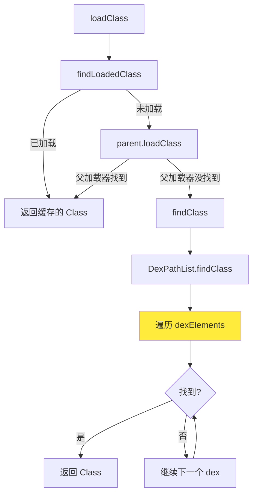
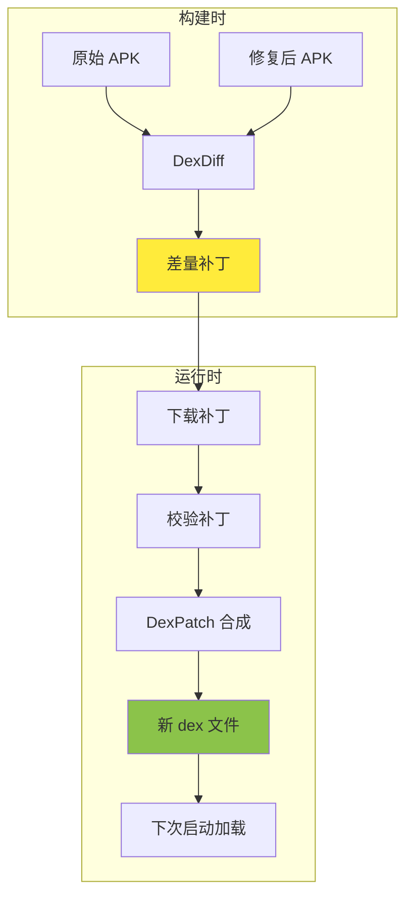
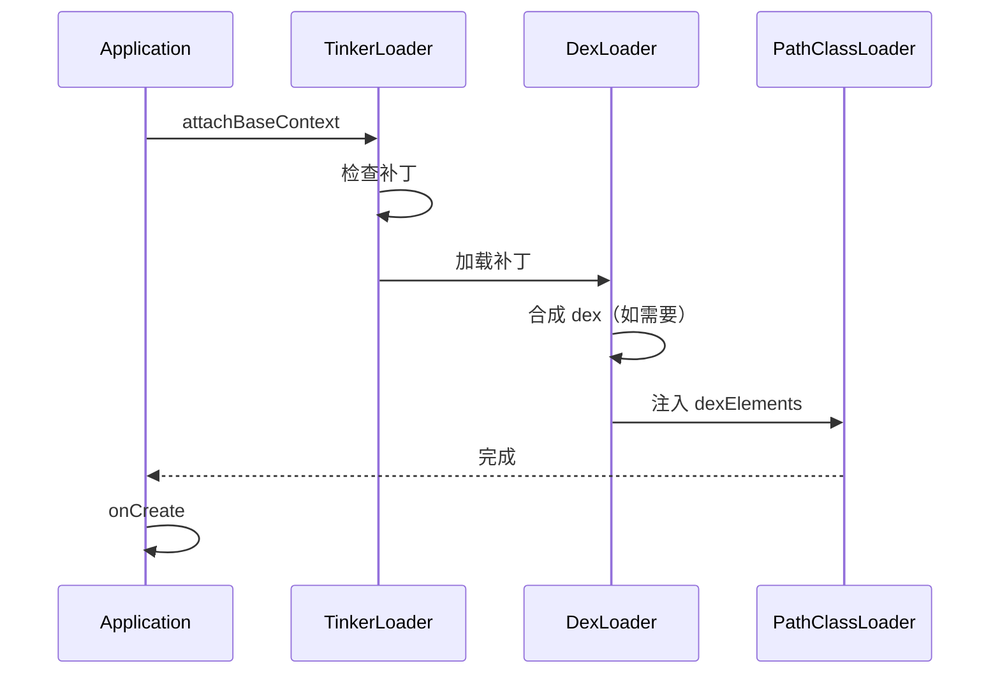
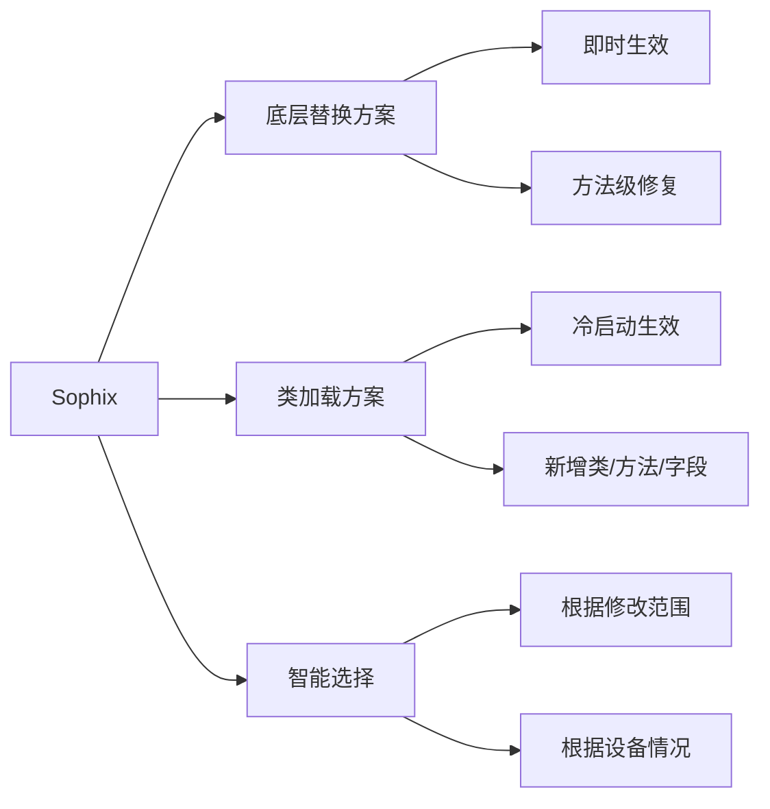

# 热修复源码篇

> 深入源码，理解设计本质

## 一、Android ClassLoader 机制

### 1.1 一句话总结

Android 使用 `PathClassLoader` 加载应用代码，内部通过 `DexPathList` 管理 dex 文件数组，**按顺序查找类，先找到先用**——这就是类加载热修复的基础。

### 1.2 设计哲学

**为什么这样设计？**

1. **多 dex 支持**：突破 65535 方法数限制
2. **动态加载**：支持插件化和热修复
3. **隔离性**：不同 ClassLoader 加载的类相互隔离

### 1.3 核心流程图



### 1.4 关键源码分析

#### ClassLoader 的双亲委派

```java
// ClassLoader.java（简化版）
protected Class<?> loadClass(String name, boolean resolve) {
    // 1. 检查是否已加载
    Class<?> c = findLoadedClass(name);

    if (c == null) {
        // 2. 委托父加载器
        if (parent != null) {
            c = parent.loadClass(name, false);
        }

        // 3. 父加载器没找到，自己找
        if (c == null) {
            c = findClass(name);
        }
    }
    return c;
}
```

**设计亮点**：双亲委派保证了类的唯一性，避免重复加载。

#### PathClassLoader 的 findClass

```java
// BaseDexClassLoader.java
@Override
protected Class<?> findClass(String name) {
    // 委托给 DexPathList
    Class<?> c = pathList.findClass(name, suppressedExceptions);
    if (c == null) {
        throw new ClassNotFoundException(name);
    }
    return c;
}
```

#### DexPathList 的核心实现

```java
// DexPathList.java（简化版）
public Class<?> findClass(String name, List<Throwable> suppressed) {
    // 遍历 dexElements 数组
    for (Element element : dexElements) {
        // 在当前 dex 中查找
        Class<?> clazz = element.findClass(name, definingContext, suppressed);
        if (clazz != null) {
            return clazz;  // 找到就返回！
        }
    }
    // 所有 dex 都没找到
    return null;
}
```

**关键洞察**：`dexElements` 是一个数组，按顺序遍历，**先找到先用**。

### 1.5 热修复如何利用这个机制

```
修复前的 dexElements:
[classes.dex, classes2.dex, classes3.dex]
     ↑
  BugClass 在这里

修复后的 dexElements:
[patch.dex, classes.dex, classes2.dex, classes3.dex]
     ↑
  FixedClass 在这里，优先被加载！
```

**核心代码**：

```kotlin
/**
 * 将补丁 dex 插入 dexElements 数组最前面
 * 这是所有类加载方案的核心
 */
fun injectPatchDex(classLoader: ClassLoader, patchDexPath: String) {
    // 1. 获取 pathList 字段
    val pathListField = BaseDexClassLoader::class.java
        .getDeclaredField("pathList")
        .apply { isAccessible = true }
    val pathList = pathListField.get(classLoader)

    // 2. 获取 dexElements 字段
    val dexElementsField = pathList.javaClass
        .getDeclaredField("dexElements")
        .apply { isAccessible = true }
    val oldElements = dexElementsField.get(pathList) as Array<*>

    // 3. 创建补丁的 Element
    // makeDexElements 是 DexPathList 的私有方法，需要反射调用
    val patchElements = makePatchElements(pathList, patchDexPath)

    // 4. 合并：补丁在前！
    val componentType = oldElements.javaClass.componentType
    val newElements = java.lang.reflect.Array.newInstance(
        componentType,
        patchElements.size + oldElements.size
    ) as Array<Any>

    // 补丁在前
    System.arraycopy(patchElements, 0, newElements, 0, patchElements.size)
    // 原始在后
    System.arraycopy(oldElements, 0, newElements, patchElements.size, oldElements.size)

    // 5. 设置回去
    dexElementsField.set(pathList, newElements)
}
```

## 二、Tinker 源码分析

### 2.1 一句话总结

Tinker 通过 **dex 差量算法**生成补丁，运行时**合成新 dex**，然后利用类加载机制加载——牺牲一点启动时间，换取更小的补丁包。

### 2.2 设计哲学

**为什么选择差量方案？**

| 方案 | 补丁大小 | 运行时开销 | 适用场景 |
|-----|---------|-----------|---------|
| 全量方案 | 大 | 小 | 网络好、急需即时生效 |
| 差量方案 | 小 | 有合成开销 | 节省流量、可接受重启 |

**Tinker 的选择**：用户网络环境复杂，补丁包小更重要。

### 2.3 核心流程图



### 2.4 补丁生成原理（DexDiff）

Tinker 使用自研的 DexDiff 算法，核心思想是**对 dex 文件的各个部分分别做差量**。

#### dex 文件结构

```
┌─────────────────────────┐
│      Header             │  文件头
├─────────────────────────┤
│      StringIds          │  字符串索引
├─────────────────────────┤
│      TypeIds            │  类型索引
├─────────────────────────┤
│      ProtoIds           │  方法原型索引
├─────────────────────────┤
│      FieldIds           │  字段索引
├─────────────────────────┤
│      MethodIds          │  方法索引
├─────────────────────────┤
│      ClassDefs          │  类定义
├─────────────────────────┤
│      Data               │  数据区
└─────────────────────────┘
```

#### DexDiff 策略

```java
// 伪代码：DexDiff 核心逻辑
public class DexDiff {
    public DexPatch diff(Dex oldDex, Dex newDex) {
        DexPatch patch = new DexPatch();

        // 对每个部分分别 diff
        patch.stringDiff = diffStrings(oldDex.strings, newDex.strings);
        patch.typeDiff = diffTypes(oldDex.types, newDex.types);
        patch.fieldDiff = diffFields(oldDex.fields, newDex.fields);
        patch.methodDiff = diffMethods(oldDex.methods, newDex.methods);
        patch.classDiff = diffClasses(oldDex.classes, newDex.classes);

        return patch;
    }

    // 字符串 diff：只保存新增和修改的
    private StringDiff diffStrings(String[] old, String[] new) {
        // 使用 Myers diff 算法
        return myersDiff(old, new);
    }
}
```

**设计亮点**：
- 分区域 diff，避免整体重新生成
- 使用高效的 Myers diff 算法
- 补丁格式紧凑，压缩率高

### 2.5 补丁合成原理（DexPatch）

```java
// TinkerDexLoader.java（简化版）
public class TinkerDexLoader {

    public static boolean loadDex(Application app, File patchDir) {
        // 1. 检查补丁目录
        File dexDir = new File(patchDir, "dex");
        File[] dexFiles = dexDir.listFiles();

        // 2. 合成新 dex（如果需要）
        if (needCombine(dexFiles)) {
            combinePatches(app, dexFiles);
        }

        // 3. 加载合成后的 dex
        loadCombinedDex(app, dexDir);

        return true;
    }

    private static void combinePatches(Application app, File[] patches) {
        // DexPatch 算法：将差量补丁应用到原始 dex
        for (File patch : patches) {
            File originalDex = findOriginalDex(patch);
            File outputDex = new File(combinedDir, patch.getName());

            // 合成新 dex
            DexPatcher.patch(originalDex, patch, outputDex);
        }
    }

    private static void loadCombinedDex(Application app, File dexDir) {
        // 获取合成后的 dex 文件列表
        File[] combinedDexFiles = getCombinedDexFiles(dexDir);

        // 反射修改 dexElements
        PathClassLoader classLoader = (PathClassLoader) app.getClassLoader();
        injectDexAtFirst(classLoader, combinedDexFiles);
    }
}
```

### 2.6 Tinker 的加载时机



**关键点**：在 `attachBaseContext` 中加载，保证在任何业务代码之前。

### 2.7 可借鉴的设计

| 设计点 | 描述 | 借鉴价值 |
|-------|------|---------|
| 差量算法 | 自研 DexDiff，针对 dex 格式优化 | 特定格式用特定算法 |
| 多级校验 | MD5、签名、版本多重校验 | 安全性设计 |
| 异步合成 | 后台合成，不阻塞启动 | 用户体验优化 |
| 增量加载 | 支持多次补丁叠加 | 灵活性设计 |

## 三、Sophix 设计思想

### 3.1 一句话总结

Sophix 采用**全量替换 + 智能选择**策略：对于小修改用底层替换实现即时生效，对于大修改用类加载方案保证稳定。

### 3.2 设计哲学

**为什么这样设计？**

Sophix 吸取了各方案的优点：



### 3.3 底层替换的优化

#### 传统 AndFix 的问题

```cpp
// AndFix 的做法：直接 memcpy
void replaceMethod(Method* oldMethod, Method* newMethod) {
    // 问题：不同 ROM 的 ArtMethod 大小可能不同！
    memcpy(oldMethod, newMethod, sizeof(ArtMethod));
}
```

**问题**：硬编码了 `sizeof(ArtMethod)`，不同 ROM 定制后可能不一样。

#### Sophix 的解决方案

```kotlin
/**
 * 动态计算 ArtMethod 大小
 * 原理：创建一个类，定义两个连续的方法，
 * 它们的 ArtMethod 地址差值就是单个 ArtMethod 的大小
 */
class ArtMethodSize {
    // 两个连续定义的方法
    fun method1() {}
    fun method2() {}
}

fun getArtMethodSize(): Long {
    val clazz = ArtMethodSize::class.java

    // 获取两个方法
    val method1 = clazz.getDeclaredMethod("method1")
    val method2 = clazz.getDeclaredMethod("method2")

    // 获取它们的 ArtMethod 地址
    val addr1 = getArtMethodAddress(method1)
    val addr2 = getArtMethodAddress(method2)

    // 差值就是 ArtMethod 的大小
    return addr2 - addr1
}

// Native 方法：获取 ArtMethod 地址
external fun getArtMethodAddress(method: Method): Long
```

**设计亮点**：不依赖具体的 ArtMethod 结构定义，自适应各种 ROM。

### 3.4 全量替换 vs 增量替换

| 对比 | 增量替换 (Tinker) | 全量替换 (Sophix) |
|-----|------------------|------------------|
| 补丁内容 | 只包含变化的部分 | 包含完整的修复代码 |
| 补丁大小 | 小 | 相对大 |
| 生成复杂度 | 高（需要 diff） | 低 |
| 应用复杂度 | 高（需要合成） | 低 |
| 多次补丁 | 可能冲突 | 直接覆盖 |

**Sophix 的选择**：全量替换，简化流程，避免合成问题。

### 3.5 资源修复的优化

```kotlin
/**
 * Sophix 的资源修复方案
 * 优化点：不创建新的 AssetManager，而是直接添加资源路径
 */
fun loadPatchResources(context: Context, patchResPath: String) {
    val assetManager = context.assets

    // 直接添加补丁资源路径（反射调用 addAssetPath）
    val addAssetPathMethod = AssetManager::class.java
        .getDeclaredMethod("addAssetPath", String::class.java)
    addAssetPathMethod.isAccessible = true
    addAssetPathMethod.invoke(assetManager, patchResPath)

    // 更新资源配置
    updateResourcesConfiguration(context)
}
```

**优势**：避免创建新 AssetManager，减少内存开销和兼容性问题。

## 四、Robust 源码分析

### 4.1 一句话总结

Robust 在**编译时给每个方法插桩**，运行时通过设置开关来决定执行原逻辑还是补丁逻辑——纯 Java 实现，兼容性最好。

### 4.2 设计哲学

**为什么这样设计？**

借鉴 Google 的 Instant Run：
- 开发时：代码变化后，只推送变化的方法
- 运行时：通过开关控制走新逻辑
- 好处：秒级生效，不需要重启

**Robust 的创新**：把这套机制用到线上热修复。

### 4.3 编译时插桩

#### Gradle Transform

```kotlin
// RobustTransform.kt（简化版）
class RobustTransform : Transform() {

    override fun transform(invocation: TransformInvocation) {
        // 遍历所有类
        invocation.inputs.forEach { input ->
            input.jarInputs.forEach { jarInput ->
                processJar(jarInput.file)
            }
            input.directoryInputs.forEach { dirInput ->
                processDirectory(dirInput.file)
            }
        }
    }

    private fun processClass(classFile: File) {
        // 使用 ASM 插桩
        val classReader = ClassReader(classFile.readBytes())
        val classWriter = ClassWriter(ClassWriter.COMPUTE_MAXS)
        val visitor = RobustClassVisitor(classWriter)

        classReader.accept(visitor, ClassReader.EXPAND_FRAMES)

        // 写回插桩后的字节码
        classFile.writeBytes(classWriter.toByteArray())
    }
}
```

#### ASM 插桩

```kotlin
// RobustClassVisitor.kt（简化版）
class RobustClassVisitor(cv: ClassVisitor) : ClassVisitor(ASM5, cv) {

    override fun visit(version: Int, access: Int, name: String, ...) {
        super.visit(version, access, name, ...)

        // 添加静态字段：开关
        cv.visitField(
            ACC_PUBLIC or ACC_STATIC,
            "changeQuickRedirect",
            "Lcom/meituan/robust/ChangeQuickRedirect;",
            null, null
        )
    }

    override fun visitMethod(access: Int, name: String, desc: String, ...): MethodVisitor {
        val mv = super.visitMethod(access, name, desc, ...)

        // 跳过构造函数和静态块
        if (name == "<init>" || name == "<clinit>") {
            return mv
        }

        // 包装方法访问器，添加插桩代码
        return RobustMethodVisitor(mv, className, name, desc)
    }
}

class RobustMethodVisitor(mv: MethodVisitor, ...) : MethodVisitor(ASM5, mv) {

    override fun visitCode() {
        super.visitCode()

        // 插入开关检查代码
        // if (changeQuickRedirect != null) {
        //     return changeQuickRedirect.accessDispatch(...);
        // }
        insertSwitchCheck()
    }

    private fun insertSwitchCheck() {
        // 加载 changeQuickRedirect 字段
        mv.visitFieldInsn(GETSTATIC, className, "changeQuickRedirect",
            "Lcom/meituan/robust/ChangeQuickRedirect;")

        // 判空
        val originalLabel = Label()
        mv.visitJumpInsn(IFNULL, originalLabel)

        // 不为空，调用 accessDispatch
        // ... 省略调用逻辑

        // 原始逻辑标签
        mv.visitLabel(originalLabel)
    }
}
```

### 4.4 插桩前后对比

```java
// 插桩前
public class UserService {
    public String getUserName(int userId) {
        return "User_" + userId;
    }
}

// 插桩后
public class UserService {
    // 新增的开关字段
    public static ChangeQuickRedirect changeQuickRedirect;

    public String getUserName(int userId) {
        // 插入的开关检查
        if (changeQuickRedirect != null) {
            if (PatchProxy.isSupport(
                    new Object[]{userId},
                    this,
                    changeQuickRedirect,
                    false,
                    "getUserName",
                    new Class[]{int.class},
                    String.class)) {
                return (String) PatchProxy.accessDispatch(
                    new Object[]{userId},
                    this,
                    changeQuickRedirect,
                    false,
                    "getUserName",
                    new Class[]{int.class},
                    String.class);
            }
        }
        // 原始逻辑
        return "User_" + userId;
    }
}
```

### 4.5 补丁代码生成

```kotlin
/**
 * 补丁类生成器
 * 根据修复后的代码，生成 ChangeQuickRedirect 实现类
 */
class PatchGenerator {

    fun generatePatch(className: String, methodName: String, newCode: String): String {
        return """
            package com.meituan.robust.patch;

            import com.meituan.robust.ChangeQuickRedirect;

            public class ${className}Patch implements ChangeQuickRedirect {

                @Override
                public Object accessDispatch(String methodName, Object[] params) {
                    if ("$methodName".equals(methodName)) {
                        // 修复后的逻辑
                        $newCode
                    }
                    return null;
                }

                @Override
                public boolean isSupport(String methodName, Object[] params) {
                    return "$methodName".equals(methodName);
                }
            }
        """.trimIndent()
    }
}
```

### 4.6 补丁加载

```kotlin
/**
 * 补丁加载器
 * 原理：反射设置目标类的 changeQuickRedirect 字段
 */
object PatchLoader {

    fun loadPatch(patchDexPath: String, patchInfoList: List<PatchInfo>) {
        // 1. 创建 DexClassLoader 加载补丁 dex
        val patchClassLoader = DexClassLoader(
            patchDexPath,
            context.cacheDir.absolutePath,
            null,
            context.classLoader
        )

        // 2. 遍历补丁信息，设置开关
        patchInfoList.forEach { patchInfo ->
            // 加载原始类
            val targetClass = Class.forName(patchInfo.className)

            // 加载补丁类
            val patchClass = patchClassLoader.loadClass(patchInfo.patchClassName)
            val patchInstance = patchClass.newInstance() as ChangeQuickRedirect

            // 设置开关
            val field = targetClass.getField("changeQuickRedirect")
            field.set(null, patchInstance)
        }
    }
}

data class PatchInfo(
    val className: String,      // 原始类名
    val patchClassName: String  // 补丁类名
)
```

## 五、自己动手实现简易热修复

### 5.1 目标

实现一个最简单的类加载热修复框架，帮助理解核心原理。

### 5.2 核心代码

```kotlin
/**
 * 简易热修复框架
 * 仅用于学习，不用于生产环境
 */
object SimpleHotFix {

    private const val TAG = "SimpleHotFix"

    /**
     * 加载补丁 dex
     * @param context 上下文
     * @param patchDexPath 补丁 dex 文件路径
     */
    fun loadPatch(context: Context, patchDexPath: String) {
        Log.d(TAG, "Loading patch: $patchDexPath")

        try {
            // 1. 获取当前 ClassLoader
            val classLoader = context.classLoader

            // 2. 获取 pathList 字段
            val pathListField = findField(classLoader.javaClass, "pathList")
            val pathList = pathListField.get(classLoader)

            // 3. 获取 dexElements 字段
            val dexElementsField = findField(pathList.javaClass, "dexElements")
            val oldElements = dexElementsField.get(pathList) as Array<*>

            // 4. 创建补丁 Element
            val patchElement = makeDexElement(pathList, patchDexPath)

            // 5. 合并数组：补丁在前
            val newElements = mergeElements(patchElement, oldElements)

            // 6. 设置回去
            dexElementsField.set(pathList, newElements)

            Log.d(TAG, "Patch loaded successfully!")
        } catch (e: Exception) {
            Log.e(TAG, "Failed to load patch", e)
        }
    }

    /**
     * 创建补丁的 Element
     */
    private fun makeDexElement(pathList: Any, dexPath: String): Any {
        // 创建 dex 文件对象
        val dexFile = File(dexPath)

        // 获取 makeDexElements 方法（不同 Android 版本方法签名不同）
        val makeMethod = findMakeDexElementsMethod(pathList.javaClass)

        // 调用方法创建 Element 数组
        val elements = when {
            Build.VERSION.SDK_INT >= Build.VERSION_CODES.N -> {
                // Android 7.0+
                makeMethod.invoke(
                    null,
                    listOf(dexFile),
                    File(dexFile.parent, "opt"),
                    ArrayList<Exception>(),
                    pathList.javaClass.classLoader
                )
            }
            Build.VERSION.SDK_INT >= Build.VERSION_CODES.M -> {
                // Android 6.0
                makeMethod.invoke(
                    null,
                    listOf(dexFile),
                    File(dexFile.parent, "opt"),
                    ArrayList<Exception>()
                )
            }
            else -> {
                // Android 5.x
                makeMethod.invoke(
                    pathList,
                    arrayListOf(dexFile),
                    File(dexFile.parent, "opt"),
                    ArrayList<Exception>()
                )
            }
        } as Array<*>

        return elements[0]!!
    }

    /**
     * 合并 Element 数组
     */
    private fun mergeElements(patchElement: Any, oldElements: Array<*>): Array<Any> {
        val componentType = oldElements.javaClass.componentType!!
        val newSize = 1 + oldElements.size

        @Suppress("UNCHECKED_CAST")
        val newElements = java.lang.reflect.Array.newInstance(
            componentType, newSize
        ) as Array<Any>

        // 补丁在最前面
        newElements[0] = patchElement

        // 原始元素在后面
        for (i in oldElements.indices) {
            newElements[i + 1] = oldElements[i]!!
        }

        return newElements
    }

    /**
     * 反射查找字段
     */
    private fun findField(clazz: Class<*>, name: String): Field {
        var currentClass: Class<*>? = clazz
        while (currentClass != null) {
            try {
                val field = currentClass.getDeclaredField(name)
                field.isAccessible = true
                return field
            } catch (e: NoSuchFieldException) {
                currentClass = currentClass.superclass
            }
        }
        throw NoSuchFieldException("Field $name not found in ${clazz.name}")
    }

    /**
     * 查找 makeDexElements 方法（兼容不同版本）
     */
    private fun findMakeDexElementsMethod(clazz: Class<*>): Method {
        val methods = clazz.declaredMethods
        for (method in methods) {
            if (method.name == "makeDexElements" ||
                method.name == "makePathElements") {
                method.isAccessible = true
                return method
            }
        }
        throw NoSuchMethodException("makeDexElements not found")
    }
}
```

### 5.3 使用示例

```kotlin
class MyApplication : Application() {

    override fun attachBaseContext(base: Context) {
        super.attachBaseContext(base)

        // 检查并加载补丁
        loadPatchIfExists()
    }

    private fun loadPatchIfExists() {
        val patchFile = File(filesDir, "patch.dex")
        if (patchFile.exists()) {
            SimpleHotFix.loadPatch(this, patchFile.absolutePath)
        }
    }
}
```

### 5.4 注意事项

这个简易实现**仅用于学习**，生产环境需要：

1. **安全校验**：MD5、签名校验
2. **版本管理**：补丁版本与 App 版本匹配
3. **异常处理**：加载失败的降级策略
4. **多 dex 支持**：处理多个补丁文件
5. **CLASS_ISPREVERIFIED**：Dalvik 上的预校验问题

## 六、面试深度问题

### Q1: 为什么 Tinker 选择 dex 差量方案？有什么权衡？

**答**：

**选择差量方案的原因**：
1. **网络成本**：微信用户遍布全球，网络条件参差不齐，小补丁更容易下载成功
2. **流量考虑**：差量补丁可以控制在几十 KB，全量可能要几 MB
3. **发布频率**：微信可能频繁发补丁，小补丁对服务器压力也小

**权衡**：
- **牺牲**：运行时需要合成，增加启动开销
- **获得**：补丁包小，下载成功率高
- **缓解措施**：异步合成，下次启动生效

### Q2: 底层替换方案为什么兼容性差？Sophix 如何解决？

**答**：

**兼容性差的原因**：
- ArtMethod 结构体在不同 Android 版本不同
- 不同厂商 ROM 可能修改 ArtMethod
- 硬编码的结构体大小在定制 ROM 上可能出错

**Sophix 的解决方案**：
```kotlin
// 动态计算 ArtMethod 大小
// 原理：同一个类中连续定义的方法，它们的 ArtMethod 在内存中是连续的
// 两个 ArtMethod 的地址差值就是单个 ArtMethod 的大小
fun getArtMethodSize(): Long {
    val method1 = Helper::class.java.getDeclaredMethod("m1")
    val method2 = Helper::class.java.getDeclaredMethod("m2")
    return getAddress(method2) - getAddress(method1)
}
```

**设计亮点**：不依赖具体结构定义，自适应计算。

### Q3: Robust 的插桩方案有什么优缺点？

**答**：

**优点**：
1. **兼容性极好**：纯 Java 实现，不依赖任何 Native 实现
2. **即时生效**：修改开关变量即可
3. **风险可控**：不涉及 ClassLoader 和反射修改系统类

**缺点**：
1. **包体积增大**：每个方法都插桩，增加约 5-10% 大小
2. **性能损耗**：每次方法调用都有额外判断
3. **功能受限**：不支持资源和 SO 修复

**适用场景**：
- 对即时生效要求高
- 只需要代码修复
- 对包体积不敏感

### Q4: 资源修复为什么复杂？有哪些坑？

**答**：

**复杂的原因**：
1. **资源 ID 问题**：补丁资源的 ID 必须和原来一致
2. **AssetManager 缓存**：系统会缓存 AssetManager
3. **多处引用**：Activity、Application、View 都持有 Resources

**常见的坑**：
1. **资源 ID 冲突**：
   - 原因：aapt 每次编译分配的 ID 可能不同
   - 解决：使用 public.xml 固定资源 ID

2. **Configuration 更新**：
   - 原因：替换 AssetManager 后，Configuration 可能过时
   - 解决：手动更新 Resources 的 Configuration

3. **多进程**：
   - 原因：每个进程有独立的 AssetManager
   - 解决：每个进程都要执行资源修复

### Q5: 如果让你从零设计一个热修复方案，你会怎么做？

**答**：

**技术选型**：
1. **代码修复**：类加载方案（稳定优先）
2. **即时生效需求**：可选支持 Robust 式插桩
3. **资源修复**：AssetManager 替换
4. **SO 修复**：修改 native 库搜索路径

**架构设计**：

```
┌─────────────────────────────────────────────┐
│              补丁管理平台                    │
├───────────┬───────────┬─────────────────────┤
│  补丁构建  │  灰度配置  │      监控告警       │
│  差量算法  │  规则引擎  │  Crash/ANR/性能    │
│  签名加密  │  AB测试   │      回滚控制       │
└───────────┴───────────┴─────────────────────┘
                    ↓
┌─────────────────────────────────────────────┐
│               客户端 SDK                     │
├─────────────────────────────────────────────┤
│  补丁下载  →  校验验证  →  加载应用  →  效果上报 │
│  断点续传     签名MD5      代码/资源/SO   成功率  │
│  优先级控制   版本匹配    异常降级        Crash率 │
└─────────────────────────────────────────────┘
```

**关键设计点**：
1. **安全性**：签名校验 + 传输加密 + 版本校验
2. **可靠性**：灰度发布 + 监控告警 + 自动回滚
3. **性能**：异步加载 + 增量更新 + 缓存优化
4. **可观测**：补丁成功率 + Crash 率 + 性能指标

### Q6: Android 15 对热修复有什么影响？

**答**：

**变化**：
1. **私有 API 限制加强**：反射调用系统私有 API 更难
2. **ClassLoader 行为变化**：可能影响 dex 注入
3. **安全限制**：动态加载代码的限制更严格

**应对策略**：
1. 使用公开 API 替代私有 API
2. 跟进各框架的适配版本
3. 考虑替代方案（如 RN/Flutter 热更新）

**建议**：
- 热修复方案要选择持续维护的（Tinker、Sophix）
- 关注 Android 版本更新的 breaking changes
- 做好兼容性测试覆盖

---
_本文档将持续更新，添加更多相关内容_
