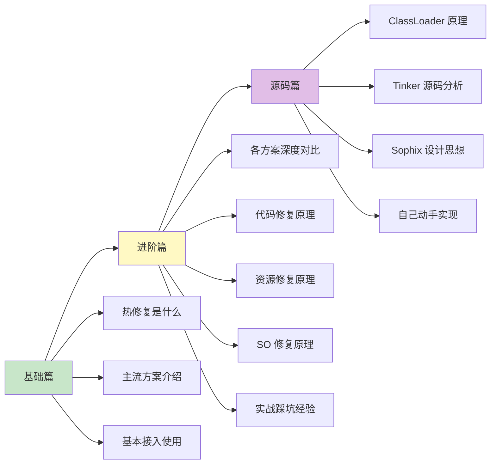

# 热修复（HotFix）知识体系

> 从入门到专家的完整学习路径 —— 不发版也能修 Bug 的黑科技

## 为什么要学热修复？

在 Android 开发中，**线上 Bug 修复**是一个让人头疼的问题：

- 发现线上严重 Bug，需要紧急修复
- 传统方式：改代码 → 打包 → 提审 → 用户更新，最快也要 1-3 天
- 如果是 Crash 类 Bug，每一天都在流失用户
- 某些应用商店审核慢，修复周期更长

热修复就是来解决这个问题的——**不需要用户重新安装 App，就能修复线上 Bug**。

## 文档结构

```
HotFix/
├── README.md          # 本文件（目录索引）
├── 1-基础篇.md         # 初/中级开发者
├── 2-进阶篇.md         # 高级开发者
└── 3-源码篇.md         # 专家级
```

## 学习路线



## 各篇内容概览

### [1-基础篇](1-基础篇.md)

**适合人群**：Android 初学者、准备初/中级面试

| 知识点 | 内容 |
|-------|------|
| 技术演进 | 热修复为什么会出现？解决了什么问题？ |
| 核心概念 | 什么是热修复？热修复 vs 热更新 vs 插件化 |
| 主流方案 | Tinker、Sophix、Robust、AndFix 等介绍 |
| 基本使用 | 以 Tinker 为例的快速接入 |
| 修复范围 | 能修什么？不能修什么？ |
| 横向对比 | 各方案简单对比 |

### [2-进阶篇](2-进阶篇.md)

**适合人群**：有热修复使用经验、准备高级面试

| 知识点 | 内容 |
|-------|------|
| 代码修复原理 | 底层替换 vs 类加载方案 |
| 资源修复原理 | 资源 ID 冲突解决、AssetManager 替换 |
| SO 修复原理 | native 层修复的挑战与方案 |
| 方案深度对比 | 各方案的优劣和适用场景 |
| 实战经验 | 大厂热修复实践、踩坑总结 |
| 边界认知 | 热修复的局限性和替代方案 |

### [3-源码篇](3-源码篇.md)

**适合人群**：准备 Android 专家级面试、想深入理解原理

| 知识点 | 内容 |
|-------|------|
| ClassLoader 机制 | Android 类加载的完整流程 |
| Tinker 源码分析 | 补丁生成与合成原理 |
| Sophix 设计思想 | 全量替换方案的优势 |
| Instant Run 原理 | Google 官方热更新方案 |
| 自己动手实现 | 手写简易热修复框架 |
| 面试高频 | 专家级深度问题 |

## 面试覆盖程度

| 面试级别 | 需要掌握 |
|---------|---------|
| 初级 Android | 基础篇（了解概念） |
| 中级 Android | 基础篇 + 进阶篇部分 |
| 高级 Android | 基础篇 + 进阶篇 |
| **Android 专家** | 基础篇 + 进阶篇 + 源码篇 |

## 快速查阅

### 主流方案速查

| 方案 | 公司 | 即时生效 | 代码修复 | 资源修复 | SO 修复 | 稳定性 |
|-----|------|---------|---------|---------|--------|-------|
| Tinker | 腾讯 | ❌ 重启 | ✅ | ✅ | ✅ | 高 |
| Sophix | 阿里 | ✅/❌ | ✅ | ✅ | ✅ | 高 |
| Robust | 美团 | ✅ | ✅ | ❌ | ❌ | 高 |
| AndFix | 阿里(已停) | ✅ | ✅ | ❌ | ❌ | 中 |
| Qzone | 腾讯 | ❌ 重启 | ✅ | ❌ | ❌ | 中 |

### 核心原理速查

| 修复类型 | 核心原理 | 所在文档 |
|---------|---------|---------|
| 代码修复（类加载） | 修改 dex 加载顺序，让补丁 dex 优先加载 | 进阶篇 |
| 代码修复（底层替换） | 替换 ArtMethod 结构体 | 进阶篇 |
| 资源修复 | 替换 AssetManager，重新加载资源 | 进阶篇 |
| SO 修复 | 修改 System.loadLibrary 加载路径 | 进阶篇 |

### 常见问题速查

| 问题 | 解决方案 | 所在文档 |
|-----|---------|---------|
| 补丁不生效 | 检查签名、混淆映射、补丁格式 | 基础篇 |
| 修复后 Crash | 检查 CLASS_ISPREVERIFIED 问题 | 进阶篇 |
| 资源修复失败 | 检查资源 ID 冲突 | 进阶篇 |
| 多次修复冲突 | 使用全量补丁而非增量 | 进阶篇 |

## 技术选型建议

| 场景 | 推荐方案 | 原因 |
|-----|---------|------|
| 需要即时生效 | Robust / Sophix | 不需要重启 |
| 需要资源修复 | Tinker / Sophix | 支持资源替换 |
| 追求稳定性 | Tinker | 大规模验证，社区活跃 |
| 快速接入 | Sophix（付费） | 阿里云一站式服务 |
| 开源免费 | Tinker / Robust | 代码开源，社区支持 |

## 版本信息

本文档基于以下版本编写：

```kotlin
// build.gradle.kts (Tinker)
dependencies {
    implementation("com.tencent.tinker:tinker-android-lib:1.9.14.25")
    annotationProcessor("com.tencent.tinker:tinker-android-anno:1.9.14.25")
}
```

---
_本文档将持续更新_
