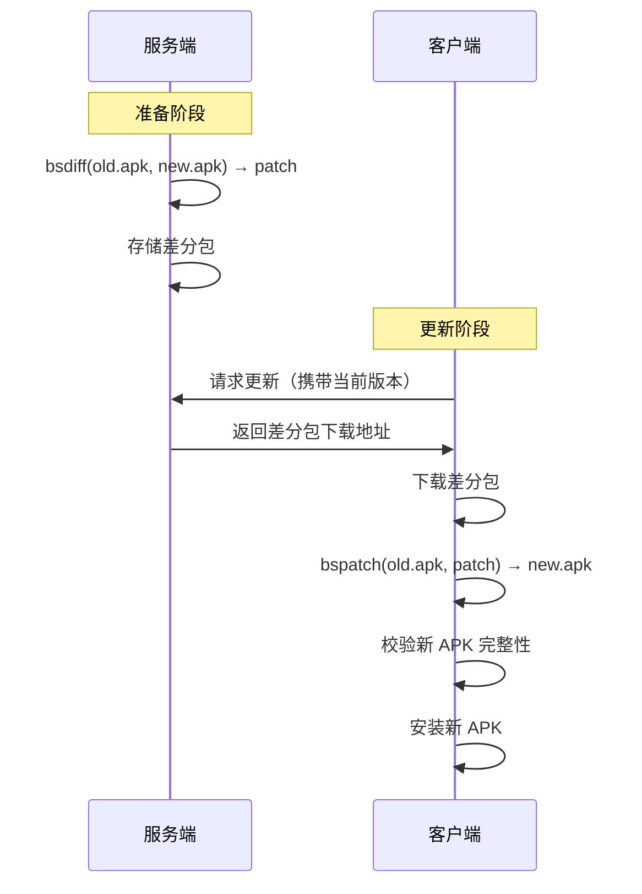

# Android 增量更新 - 基础篇

## 技术演进：为什么需要增量更新？

### 背景问题

想象一下这个场景：你的 App 有 100MB，每次更新用户都要重新下载 100MB。如果你一周发一个版本，用户一个月就要下载 400MB。而实际上，两个版本之间可能只改了几 MB 的代码。

这就像你搬家只换了一个枕头，却要把所有家具都搬一遍——太浪费了！

### 全量更新的痛点

| 痛点 | 影响 |
|------|------|
| 流量消耗大 | 用户抵触更新，尤其是没 WiFi 的时候 |
| 下载时间长 | 用户体验差，可能中途放弃 |
| 服务器带宽成本高 | 运营成本增加 |
| 弱网环境下载失败率高 | 更新成功率低 |

### 增量更新的诞生

增量更新的核心思想：**只传输变化的部分**。

就像 Git 只保存代码的 diff 一样，增量更新只下载新旧版本的差异，然后在本地合并出新版本。

## 什么是增量更新？

### 定义

**增量更新**（Incremental Update / Delta Update）是一种软件更新机制，通过比较新旧版本的二进制差异，生成一个小体积的"差分包"（Patch），用户只需下载差分包，在本地与旧版本合并，即可得到新版本。

### 通俗理解

把 App 更新想象成**修改文档**：

- **全量更新**：每次都发一份完整的新文档
- **增量更新**：只发一份"修改说明"（差分包），告诉你哪里改了、怎么改

```
全量更新：
旧版本（100MB）──────────────────────────► 新版本（100MB）
                    下载 100MB

增量更新：
旧版本（100MB）+ 差分包（10MB）= 新版本（100MB）
                    下载 10MB，节省 90%
```

## 核心概念

### 1. 差分包（Patch / Delta）

差分包是新旧版本的"差异描述文件"，它记录了：
- 哪些字节保持不变
- 哪些字节需要修改
- 哪些字节需要新增或删除

### 2. bsdiff 和 bspatch

这是增量更新最常用的工具组合：

| 工具 | 作用 | 运行位置 |
|------|------|---------|
| **bsdiff** | 比较新旧版本，生成差分包 | 服务端 |
| **bspatch** | 将差分包应用到旧版本，生成新版本 | 客户端 |

类比理解：
- bsdiff 就像"出题老师"，对比两份试卷找出不同
- bspatch 就像"学生"，根据答案修改自己的试卷

### 3. 完整流程



## 快速上手

### 环境准备

增量更新的核心是 bsdiff/bspatch，需要在 native 层实现。我们使用现成的开源库来简化集成。

#### 添加依赖

```groovy
// build.gradle
dependencies {
    implementation 'com.cundong:SmartAppUpdates:1.0.4'
}
```

> **说明**：SmartAppUpdates 是一个封装好的增量更新库，内部集成了 bspatch 的 native 实现。

### 服务端：生成差分包

服务端需要 bsdiff 工具来生成差分包。

#### 安装 bsdiff（以 Linux/Mac 为例）

```bash
# Ubuntu/Debian
sudo apt-get install bsdiff

# Mac
brew install bsdiff
```

#### 生成差分包

```bash
# 语法：bsdiff <旧文件> <新文件> <差分包>
bsdiff old.apk new.apk patch.diff
```

#### 实际效果示例

```
old.apk: 50 MB
new.apk: 52 MB
patch.diff: 5 MB  ← 只有新版本的 10%！
```

### 客户端：应用差分包

```kotlin
import com.cundong.utils.PatchUtils

/**
 * 增量更新工具类
 */
object IncrementalUpdateHelper {
    
    /**
     * 合并差分包生成新 APK
     * @param oldApkPath 当前安装的 APK 路径
     * @param patchPath 下载的差分包路径
     * @param newApkPath 合并后新 APK 的保存路径
     * @return 0 表示成功，非 0 表示失败
     */
    fun patch(oldApkPath: String, patchPath: String, newApkPath: String): Int {
        // 调用 native 方法进行合并
        return PatchUtils.patch(oldApkPath, newApkPath, patchPath)
    }
}
```

### 完整使用流程

```kotlin
class UpdateManager(private val context: Context) {
    
    /**
     * 执行增量更新
     * @param patchFile 已下载的差分包文件
     * @param newApkMd5 服务端提供的新 APK 的 MD5 值，用于校验
     */
    fun performIncrementalUpdate(patchFile: File, newApkMd5: String) {
        // 1. 获取当前安装的 APK 路径
        val oldApkPath = context.applicationInfo.sourceDir
        
        // 2. 定义新 APK 的保存路径
        val newApkPath = File(context.cacheDir, "new_version.apk").absolutePath
        
        // 3. 合并差分包
        val result = IncrementalUpdateHelper.patch(
            oldApkPath = oldApkPath,
            patchPath = patchFile.absolutePath,
            newApkPath = newApkPath
        )
        
        if (result != 0) {
            // 合并失败，回退到全量更新
            downloadFullApk()
            return
        }
        
        // 4. 校验新 APK 的完整性
        val newApkFile = File(newApkPath)
        if (!verifyMd5(newApkFile, newApkMd5)) {
            // 校验失败，回退到全量更新
            newApkFile.delete()
            downloadFullApk()
            return
        }
        
        // 5. 安装新 APK
        installApk(newApkFile)
    }
    
    /**
     * 校验文件 MD5
     */
    private fun verifyMd5(file: File, expectedMd5: String): Boolean {
        val digest = MessageDigest.getInstance("MD5")
        file.inputStream().use { input ->
            val buffer = ByteArray(8192)
            var bytesRead: Int
            while (input.read(buffer).also { bytesRead = it } != -1) {
                digest.update(buffer, 0, bytesRead)
            }
        }
        val actualMd5 = digest.digest().joinToString("") { "%02x".format(it) }
        return actualMd5.equals(expectedMd5, ignoreCase = true)
    }
    
    private fun downloadFullApk() {
        // 全量更新的下载逻辑
    }
    
    private fun installApk(apkFile: File) {
        // APK 安装逻辑
    }
}
```

## 常见问题

### 1. 为什么差分包可以这么小？

因为大部分代码在版本迭代中是不变的。bsdiff 算法能智能识别这些相同的部分，只记录变化的字节。

想象两篇 1000 字的文章，只改了 10 个字。全量传输要传 1000 字，增量传输只需要告诉你："第 50 个字改成 X，第 100 个字改成 Y..."

### 2. 增量更新一定比全量更新小吗？

**不一定！** 

| 情况 | 差分包大小 | 原因 |
|------|-----------|------|
| 小改动 | 很小（1-10%） | 大部分代码相同 |
| 大改动 | 可能很大 | 变化太多，差分包接近全量 |
| 混淆策略变化 | 可能很大 | 代码位置大幅变动 |
| 资源大改 | 可能很大 | 图片等资源无法有效差分 |

**实践建议**：服务端生成差分包后，对比全量包大小，如果差分包超过全量包的 60-70%，直接下发全量包。

### 3. 合并失败怎么办？

合并失败的常见原因：
- 旧 APK 被删除或损坏
- 差分包下载不完整
- 内存不足

**解决方案**：必须有回退机制，合并失败时自动切换到全量更新。

### 4. 跨版本更新怎么处理？

比如用户从 1.0 直接跳到 3.0，中间跳过了 2.0。

| 方案 | 优点 | 缺点 |
|------|------|------|
| 生成 1.0→3.0 的差分包 | 用户一次更新 | 服务端需要维护大量差分包（n²） |
| 1.0→2.0→3.0 链式更新 | 服务端只需维护相邻版本 | 用户多次下载 |
| 超过 2 个版本直接全量 | 简单可靠 | 流量节省有限 |

**推荐**：超过 2-3 个版本的跨度，直接走全量更新，平衡服务端复杂度和用户体验。

### 5. 如何获取当前安装的 APK 路径？

```kotlin
// 获取当前 App 的 APK 文件路径
val currentApkPath = context.applicationInfo.sourceDir
// 例如：/data/app/com.example.app-xxx/base.apk
```

## 基础篇面试题

### 1. 什么是增量更新？和全量更新有什么区别？

**结论**：增量更新是只下载新旧版本差异的更新方式，全量更新是下载完整新版本。

**原理**：增量更新通过 bsdiff 算法比较新旧 APK 的二进制差异，生成一个小体积的差分包。用户下载差分包后，在本地通过 bspatch 与旧 APK 合并，得到新 APK。

**对比**：

| 维度 | 全量更新 | 增量更新 |
|------|---------|---------|
| 下载大小 | 完整 APK | 差分包（通常 10-30%） |
| 依赖旧版本 | 不依赖 | 强依赖 |
| 实现复杂度 | 简单 | 较复杂 |
| 失败兜底 | 无需 | 需要回退机制 |

### 2. bsdiff 和 bspatch 分别是什么？各在哪里执行？

**结论**：bsdiff 用于生成差分包，在服务端执行；bspatch 用于合并差分包，在客户端执行。

**原理**：
- bsdiff 对比新旧文件的二进制内容，使用后缀数组找出最长公共子序列，生成描述差异的 patch 文件
- bspatch 读取旧文件和 patch 文件，按照差异描述重建新文件

**举例**：
```bash
# 服务端
bsdiff old.apk new.apk patch.diff

# 客户端
bspatch old.apk new.apk patch.diff
```

### 3. 增量更新有什么局限性？什么情况下不适用？

**结论**：增量更新不是万能的，有几种情况不适用或效果不佳。

**不适用场景**：
1. **跨多版本更新**：版本跨度大，差分包可能很大
2. **混淆策略变化**：代码位置大幅变动，差异变大
3. **资源大改**：图片、音视频等二进制资源无法有效差分
4. **首次安装**：没有旧版本，无法增量

**原理**：bsdiff 依赖二进制内容的相似性，如果相似度低，差分包就大。

### 4. 如果增量更新失败了怎么办？

**结论**：必须有全量更新的回退机制。

**实现要点**：
1. 合并后校验 MD5/签名
2. 校验失败立即删除错误文件
3. 自动触发全量更新下载
4. 记录失败日志用于分析

```kotlin
if (patchResult != 0 || !verifyMd5(newApk, expectedMd5)) {
    newApk.delete()
    fallbackToFullUpdate()
}
```

### 5. 为什么增量更新需要校验？怎么校验？

**结论**：校验是为了保证合并后的 APK 完整、未被篡改。

**校验方式**：
1. **MD5/SHA256 校验**：对比服务端下发的 hash 值
2. **签名校验**：验证 APK 签名是否正确
3. **文件大小校验**：检查文件大小是否符合预期

**原因**：网络传输可能出错、差分包可能损坏、旧 APK 可能被修改，任何一个环节出问题都会导致合并结果错误。

---
_本文档将持续更新，添加更多相关内容_
