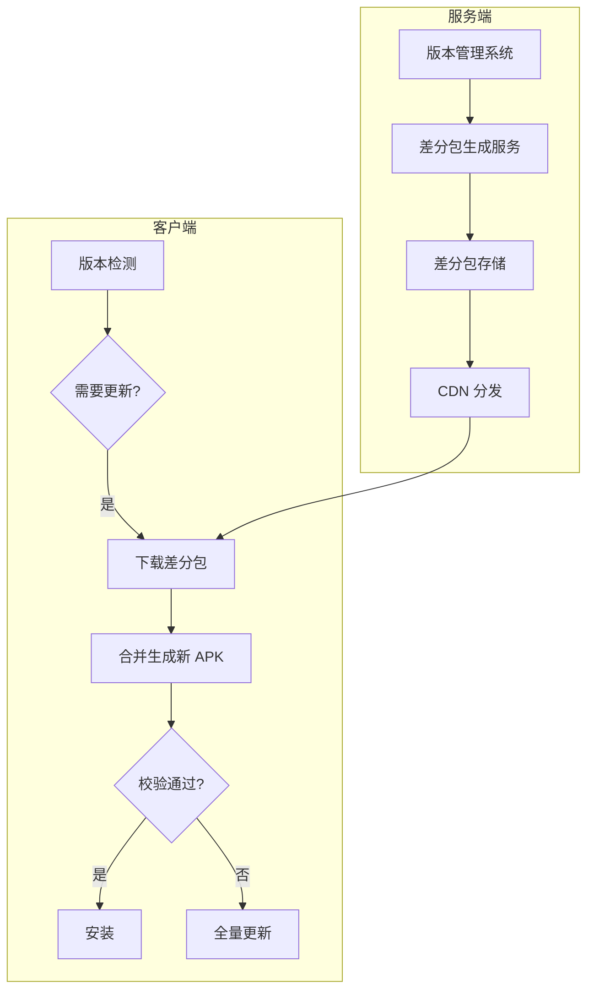

# Android 增量更新 - 进阶篇

## 完整的增量更新方案设计

### 整体架构

一个完整的增量更新方案需要服务端和客户端配合：



### 服务端设计

#### 1. 差分包管理策略

```
差分包命名规范：
patch_{oldVersion}_{newVersion}.diff

存储结构：
/patches/
├── patch_1.0.0_1.0.1.diff
├── patch_1.0.1_1.0.2.diff
├── patch_1.0.0_1.0.2.diff  ← 跨版本差分（可选）
└── ...

版本映射表（version_map.json）：
{
  "latestVersion": "1.0.2",
  "latestVersionCode": 102,
  "fullApkUrl": "https://cdn.example.com/app-1.0.2.apk",
  "fullApkSize": 52428800,
  "fullApkMd5": "abc123...",
  "patches": {
    "1.0.0": {
      "patchUrl": "https://cdn.example.com/patches/patch_1.0.0_1.0.2.diff",
      "patchSize": 5242880,
      "patchMd5": "def456...",
      "newApkMd5": "abc123..."
    },
    "1.0.1": {
      "patchUrl": "https://cdn.example.com/patches/patch_1.0.1_1.0.2.diff",
      "patchSize": 2097152,
      "patchMd5": "ghi789...",
      "newApkMd5": "abc123..."
    }
  }
}
```

#### 2. 差分包生成自动化

```bash
#!/bin/bash
# generate_patch.sh - 差分包生成脚本

OLD_APK=$1
NEW_APK=$2
OUTPUT_DIR=$3

# 提取版本号
OLD_VERSION=$(aapt dump badging "$OLD_APK" | grep versionName | sed "s/.*versionName='//" | sed "s/'.*//")
NEW_VERSION=$(aapt dump badging "$NEW_APK" | grep versionName | sed "s/.*versionName='//" | sed "s/'.*//")

# 生成差分包
PATCH_NAME="patch_${OLD_VERSION}_${NEW_VERSION}.diff"
bsdiff "$OLD_APK" "$NEW_APK" "$OUTPUT_DIR/$PATCH_NAME"

# 计算大小和 MD5
PATCH_SIZE=$(stat -f%z "$OUTPUT_DIR/$PATCH_NAME")
PATCH_MD5=$(md5 -q "$OUTPUT_DIR/$PATCH_NAME")
NEW_APK_SIZE=$(stat -f%z "$NEW_APK")
NEW_APK_MD5=$(md5 -q "$NEW_APK")

# 判断是否值得增量更新（差分包超过全量 60% 就不划算）
THRESHOLD=$((NEW_APK_SIZE * 60 / 100))
if [ "$PATCH_SIZE" -gt "$THRESHOLD" ]; then
    echo "Warning: Patch size ($PATCH_SIZE) > 60% of full APK ($NEW_APK_SIZE), consider full update"
fi

echo "Generated: $PATCH_NAME"
echo "Patch Size: $PATCH_SIZE bytes"
echo "Patch MD5: $PATCH_MD5"
echo "New APK MD5: $NEW_APK_MD5"
```

#### 3. 差分包生成策略

| 策略 | 说明 | 适用场景 |
|------|------|---------|
| 相邻版本 | 只生成 n → n+1 的差分包 | 用户更新频繁的应用 |
| 跨版本 | 生成 n → latest 的差分包 | 用户更新不频繁的应用 |
| 混合策略 | 相邻版本 + 最近 3 个版本到最新 | 平衡存储和覆盖率 |

**推荐做法**：为最近 5 个版本生成到最新版本的差分包，覆盖 95%+ 的用户。

### 客户端完整实现

#### 1. 更新检测与策略选择

```kotlin
/**
 * 更新信息数据类
 */
data class UpdateInfo(
    val latestVersion: String,
    val latestVersionCode: Int,
    val fullApkUrl: String,
    val fullApkSize: Long,
    val fullApkMd5: String,
    val patchInfo: PatchInfo?  // 如果没有对应差分包则为 null
)

data class PatchInfo(
    val patchUrl: String,
    val patchSize: Long,
    val patchMd5: String,
    val newApkMd5: String
)

/**
 * 更新策略决策器
 */
class UpdateStrategyDecider {
    
    /**
     * 决定使用哪种更新策略
     * @return true 使用增量更新，false 使用全量更新
     */
    fun shouldUseIncrementalUpdate(updateInfo: UpdateInfo): Boolean {
        val patchInfo = updateInfo.patchInfo
        
        // 1. 没有差分包，只能全量
        if (patchInfo == null) {
            Log.d(TAG, "No patch available, use full update")
            return false
        }
        
        // 2. 差分包比全量包还大，用全量
        if (patchInfo.patchSize >= updateInfo.fullApkSize) {
            Log.d(TAG, "Patch larger than full APK, use full update")
            return false
        }
        
        // 3. 差分包超过全量的 60%，用全量（性价比不高）
        if (patchInfo.patchSize > updateInfo.fullApkSize * 0.6) {
            Log.d(TAG, "Patch > 60% of full APK, use full update")
            return false
        }
        
        // 4. 存储空间不足（需要同时存放差分包和新 APK）
        val requiredSpace = patchInfo.patchSize + updateInfo.fullApkSize
        if (!hasEnoughStorage(requiredSpace)) {
            Log.d(TAG, "Not enough storage, use full update")
            return false
        }
        
        // 5. 旧 APK 不可用
        if (!isOldApkAccessible()) {
            Log.d(TAG, "Old APK not accessible, use full update")
            return false
        }
        
        return true
    }
    
    private fun hasEnoughStorage(requiredBytes: Long): Boolean {
        val stat = StatFs(Environment.getDataDirectory().path)
        val availableBytes = stat.availableBlocksLong * stat.blockSizeLong
        return availableBytes > requiredBytes * 1.2  // 预留 20% 余量
    }
    
    private fun isOldApkAccessible(): Boolean {
        return try {
            val apkPath = context.applicationInfo.sourceDir
            File(apkPath).exists() && File(apkPath).canRead()
        } catch (e: Exception) {
            false
        }
    }
    
    companion object {
        private const val TAG = "UpdateStrategy"
    }
}
```

#### 2. 增量更新执行器

```kotlin
/**
 * 增量更新执行器
 * 封装了下载、合并、校验、安装的完整流程
 */
class IncrementalUpdateExecutor(
    private val context: Context,
    private val downloadManager: DownloadManager,  // 你的下载管理器
    private val listener: UpdateListener
) {
    
    interface UpdateListener {
        fun onProgress(progress: Int, stage: String)
        fun onSuccess(apkFile: File)
        fun onFailure(error: UpdateError, fallbackToFull: Boolean)
    }
    
    sealed class UpdateError(val message: String) {
        class DownloadFailed(msg: String) : UpdateError(msg)
        class PatchFailed(msg: String) : UpdateError(msg)
        class VerifyFailed(msg: String) : UpdateError(msg)
        class InstallFailed(msg: String) : UpdateError(msg)
    }
    
    /**
     * 执行增量更新
     */
    suspend fun execute(patchInfo: PatchInfo) {
        try {
            // 阶段 1: 下载差分包
            listener.onProgress(0, "下载更新包...")
            val patchFile = downloadPatch(patchInfo)
            
            // 阶段 2: 校验差分包
            listener.onProgress(30, "校验下载文件...")
            if (!verifyFile(patchFile, patchInfo.patchMd5)) {
                patchFile.delete()
                throw UpdateError.VerifyFailed("差分包校验失败")
            }
            
            // 阶段 3: 合并生成新 APK
            listener.onProgress(40, "正在合并...")
            val newApkFile = mergePatch(patchFile)
            
            // 阶段 4: 校验新 APK
            listener.onProgress(80, "校验新版本...")
            if (!verifyFile(newApkFile, patchInfo.newApkMd5)) {
                newApkFile.delete()
                patchFile.delete()
                throw UpdateError.VerifyFailed("新 APK 校验失败")
            }
            
            // 阶段 5: 清理临时文件
            patchFile.delete()
            
            // 完成
            listener.onProgress(100, "准备安装...")
            listener.onSuccess(newApkFile)
            
        } catch (e: UpdateError) {
            listener.onFailure(e, fallbackToFull = true)
        } catch (e: Exception) {
            listener.onFailure(
                UpdateError.PatchFailed(e.message ?: "未知错误"),
                fallbackToFull = true
            )
        }
    }
    
    private suspend fun downloadPatch(patchInfo: PatchInfo): File {
        val patchFile = File(context.cacheDir, "update_patch.diff")
        
        // 使用你的下载管理器下载
        val success = downloadManager.download(
            url = patchInfo.patchUrl,
            destFile = patchFile,
            progressCallback = { progress ->
                // 下载进度占 0-30%
                listener.onProgress((progress * 0.3).toInt(), "下载更新包...")
            }
        )
        
        if (!success || !patchFile.exists()) {
            throw UpdateError.DownloadFailed("差分包下载失败")
        }
        
        return patchFile
    }
    
    private suspend fun mergePatch(patchFile: File): File = withContext(Dispatchers.IO) {
        val oldApkPath = context.applicationInfo.sourceDir
        val newApkFile = File(context.cacheDir, "new_version.apk")
        
        // 调用 native 层的 bspatch
        val result = PatchUtils.patch(
            oldApkPath,
            newApkFile.absolutePath,
            patchFile.absolutePath
        )
        
        if (result != 0) {
            throw UpdateError.PatchFailed("合并差分包失败，错误码: $result")
        }
        
        if (!newApkFile.exists()) {
            throw UpdateError.PatchFailed("合并后文件不存在")
        }
        
        newApkFile
    }
    
    private fun verifyFile(file: File, expectedMd5: String): Boolean {
        if (!file.exists()) return false
        
        val actualMd5 = calculateMd5(file)
        return actualMd5.equals(expectedMd5, ignoreCase = true)
    }
    
    private fun calculateMd5(file: File): String {
        val digest = MessageDigest.getInstance("MD5")
        file.inputStream().use { input ->
            val buffer = ByteArray(8192)
            var bytesRead: Int
            while (input.read(buffer).also { bytesRead = it } != -1) {
                digest.update(buffer, 0, bytesRead)
            }
        }
        return digest.digest().joinToString("") { "%02x".format(it) }
    }
}
```

#### 3. 签名校验（更安全）

```kotlin
/**
 * APK 签名校验工具
 * MD5 只能保证完整性，签名校验能保证来源可信
 */
object ApkSignatureVerifier {
    
    /**
     * 校验 APK 签名是否与当前应用一致
     */
    fun verifySignature(context: Context, apkPath: String): Boolean {
        return try {
            val currentSignature = getCurrentAppSignature(context)
            val newApkSignature = getApkSignature(context, apkPath)
            
            currentSignature == newApkSignature
        } catch (e: Exception) {
            Log.e("SignatureVerifier", "Verify failed", e)
            false
        }
    }
    
    @Suppress("DEPRECATION")
    private fun getCurrentAppSignature(context: Context): String {
        val packageInfo = if (Build.VERSION.SDK_INT >= Build.VERSION_CODES.P) {
            context.packageManager.getPackageInfo(
                context.packageName,
                PackageManager.GET_SIGNING_CERTIFICATES
            )
        } else {
            context.packageManager.getPackageInfo(
                context.packageName,
                PackageManager.GET_SIGNATURES
            )
        }
        
        val signatures = if (Build.VERSION.SDK_INT >= Build.VERSION_CODES.P) {
            packageInfo.signingInfo.apkContentsSigners
        } else {
            packageInfo.signatures
        }
        
        return signatures.firstOrNull()?.toByteArray()?.let {
            MessageDigest.getInstance("SHA-256").digest(it)
                .joinToString("") { byte -> "%02x".format(byte) }
        } ?: ""
    }
    
    @Suppress("DEPRECATION")
    private fun getApkSignature(context: Context, apkPath: String): String {
        val packageInfo = if (Build.VERSION.SDK_INT >= Build.VERSION_CODES.P) {
            context.packageManager.getPackageArchiveInfo(
                apkPath,
                PackageManager.GET_SIGNING_CERTIFICATES
            )
        } else {
            context.packageManager.getPackageArchiveInfo(
                apkPath,
                PackageManager.GET_SIGNATURES
            )
        }
        
        val signatures = if (Build.VERSION.SDK_INT >= Build.VERSION_CODES.P) {
            packageInfo?.signingInfo?.apkContentsSigners
        } else {
            packageInfo?.signatures
        }
        
        return signatures?.firstOrNull()?.toByteArray()?.let {
            MessageDigest.getInstance("SHA-256").digest(it)
                .joinToString("") { byte -> "%02x".format(byte) }
        } ?: ""
    }
}
```

## 性能优化

### 1. 合并性能优化

bspatch 合并是 CPU 密集型操作，需要优化：

```kotlin
/**
 * 后台合并服务
 * 使用 WorkManager 在后台执行，避免阻塞用户
 */
class PatchWorker(
    context: Context,
    params: WorkerParameters
) : CoroutineWorker(context, params) {
    
    override suspend fun doWork(): Result {
        // 设置前台通知，避免被系统杀死
        setForeground(createForegroundInfo())
        
        return withContext(Dispatchers.IO) {
            try {
                val oldApkPath = inputData.getString(KEY_OLD_APK) ?: return@withContext Result.failure()
                val patchPath = inputData.getString(KEY_PATCH) ?: return@withContext Result.failure()
                val newApkPath = inputData.getString(KEY_NEW_APK) ?: return@withContext Result.failure()
                
                // 设置进程优先级为后台，减少对用户的影响
                Process.setThreadPriority(Process.THREAD_PRIORITY_BACKGROUND)
                
                val result = PatchUtils.patch(oldApkPath, newApkPath, patchPath)
                
                if (result == 0) {
                    Result.success()
                } else {
                    Result.failure()
                }
            } catch (e: Exception) {
                Result.failure()
            }
        }
    }
    
    private fun createForegroundInfo(): ForegroundInfo {
        val notification = NotificationCompat.Builder(applicationContext, CHANNEL_ID)
            .setContentTitle("正在准备更新")
            .setSmallIcon(R.drawable.ic_update)
            .setProgress(0, 0, true)
            .build()
        return ForegroundInfo(NOTIFICATION_ID, notification)
    }
    
    companion object {
        const val KEY_OLD_APK = "old_apk"
        const val KEY_PATCH = "patch"
        const val KEY_NEW_APK = "new_apk"
        private const val CHANNEL_ID = "update_channel"
        private const val NOTIFICATION_ID = 1
    }
}
```

### 2. 内存优化

bspatch 在合并大文件时会消耗较多内存：

```kotlin
/**
 * 合并前检查可用内存
 * bspatch 大约需要旧文件大小的 2-3 倍内存
 */
fun hasEnoughMemoryForPatch(oldApkSize: Long): Boolean {
    val runtime = Runtime.getRuntime()
    val maxMemory = runtime.maxMemory()
    val usedMemory = runtime.totalMemory() - runtime.freeMemory()
    val availableMemory = maxMemory - usedMemory
    
    // 预估需要的内存：旧文件大小的 3 倍
    val requiredMemory = oldApkSize * 3
    
    return availableMemory > requiredMemory
}

/**
 * 如果内存不足，可以在独立进程中执行
 */
// AndroidManifest.xml
// <service android:name=".PatchService" android:process=":patch"/>
```

### 3. 断点续传

差分包下载应该支持断点续传：

```kotlin
/**
 * 支持断点续传的下载器
 */
class ResumableDownloader {
    
    suspend fun download(
        url: String,
        destFile: File,
        progressCallback: (Int) -> Unit
    ): Boolean = withContext(Dispatchers.IO) {
        
        var connection: HttpURLConnection? = null
        var output: RandomAccessFile? = null
        var input: InputStream? = null
        
        try {
            // 获取已下载的大小
            val downloadedSize = if (destFile.exists()) destFile.length() else 0L
            
            connection = URL(url).openConnection() as HttpURLConnection
            connection.requestMethod = "GET"
            
            // 设置断点续传的 Range 头
            if (downloadedSize > 0) {
                connection.setRequestProperty("Range", "bytes=$downloadedSize-")
            }
            
            val responseCode = connection.responseCode
            
            // 206 表示支持断点续传，200 表示需要重新下载
            val totalSize = when (responseCode) {
                HttpURLConnection.HTTP_PARTIAL -> {
                    downloadedSize + connection.contentLength
                }
                HttpURLConnection.HTTP_OK -> {
                    destFile.delete()  // 服务器不支持，重新下载
                    connection.contentLength.toLong()
                }
                else -> throw IOException("HTTP error: $responseCode")
            }
            
            input = connection.inputStream
            output = RandomAccessFile(destFile, "rw")
            output.seek(downloadedSize)
            
            val buffer = ByteArray(8192)
            var bytesRead: Int
            var currentSize = downloadedSize
            
            while (input.read(buffer).also { bytesRead = it } != -1) {
                output.write(buffer, 0, bytesRead)
                currentSize += bytesRead
                progressCallback(((currentSize * 100) / totalSize).toInt())
            }
            
            true
        } catch (e: Exception) {
            Log.e("Downloader", "Download failed", e)
            false
        } finally {
            input?.close()
            output?.close()
            connection?.disconnect()
        }
    }
}
```

## 增量更新 vs 热修复

这是一个常见的混淆点，让我们深入对比：

### 核心区别

| 维度 | 增量更新 | 热修复 |
|------|---------|--------|
| **更新粒度** | 整个 APK | 单个类/方法 |
| **是否需要安装** | 需要，用户可感知 | 不需要，用户无感 |
| **生效时机** | 安装后生效 | 重启 App 或即时生效 |
| **能修复的范围** | 任何改动 | 通常只能改 Java/Kotlin 代码 |
| **技术原理** | 二进制差分 | 类加载器/字节码替换 |
| **审核风险** | 无（正常安装） | 部分应用商店禁止 |
| **稳定性** | 高（系统安装流程） | 中（Hook 有风险） |

### 适用场景

```
┌─────────────────────────────────────────────────────────────┐
│                        更新场景决策树                         │
└─────────────────────────────────────────────────────────────┘
                             │
                    需要紧急修复线上 Bug？
                    ┌────────┴────────┐
                   是                  否
                    │                  │
             可以等用户重启 App？        │
             ┌──────┴──────┐           │
            是             否          │
             │              │          │
         热修复        即时热修复       │
       (类加载方案)    (Instant Run)    │
                                       │
                              ┌────────┴────────┐
                           改动大？           改动小？
                              │                  │
                         全量更新            增量更新
```

### 组合使用

实际项目中，两者通常配合使用：

```kotlin
/**
 * 更新策略管理器
 * 根据更新类型选择不同的更新方式
 */
class UpdateStrategyManager {
    
    enum class UpdateType {
        FULL_APK,           // 全量 APK 更新
        INCREMENTAL_APK,    // 增量 APK 更新
        HOT_FIX             // 热修复
    }
    
    fun decideUpdateType(updateInfo: ServerUpdateInfo): UpdateType {
        return when {
            // 紧急 Bug 修复 → 热修复
            updateInfo.isHotfix -> UpdateType.HOT_FIX
            
            // 版本跨度大或无差分包 → 全量更新
            updateInfo.patch == null || updateInfo.versionGap > 3 -> UpdateType.FULL_APK
            
            // 有差分包且版本跨度小 → 增量更新
            else -> UpdateType.INCREMENTAL_APK
        }
    }
}
```

## 边界认知：增量更新的局限性

### 不适合增量更新的场景

1. **资源文件大改**
   - 图片、音视频等二进制资源替换
   - 差分算法对这类文件效果差

2. **混淆规则变化**
   - 混淆会打乱代码位置
   - 两个版本的代码相似度变低

3. **跨多版本更新**
   - 版本跨度太大，差分包可能很大
   - 建议超过 3 个版本直接全量

4. **so 库大改**
   - native 代码的变化通常很大
   - 差分效果不如 Java/Kotlin 代码

### 替代方案

| 场景 | 替代方案 |
|------|---------|
| 资源更新频繁 | 资源动态下发（图片 CDN、配置下发） |
| 紧急 Bug 修复 | 热修复方案 |
| 功能开关 | 配置中心 + 功能开关 |
| 大版本升级 | 全量更新 |

## 进阶篇面试题

### 1. 如何设计一个完整的增量更新方案？

**结论**：完整方案包括服务端差分包管理、客户端策略选择、下载合并流程、异常处理机制四个部分。

**要点**：

1. **服务端**
   - 自动化生成差分包
   - 维护版本映射表
   - 评估差分包是否划算（超过 60% 用全量）

2. **客户端**
   - 策略决策（检查旧 APK、存储空间、差分包大小）
   - 下载支持断点续传
   - 合并在后台/子进程执行
   - MD5 + 签名双重校验

3. **异常处理**
   - 任何环节失败都回退到全量更新
   - 记录失败日志用于分析

### 2. 增量更新和热修复有什么区别？各自适合什么场景？

**结论**：增量更新是减少下载量的正常安装更新，热修复是无需安装的紧急修复。

**对比**：

| 维度 | 增量更新 | 热修复 |
|------|---------|--------|
| 是否安装 | 需要 | 不需要 |
| 用户感知 | 有（要点安装） | 无 |
| 能改什么 | 任何东西 | 主要是代码 |
| 时效性 | 用户主动更新 | 下次启动生效 |

**场景**：
- 常规版本迭代 → 增量更新
- 紧急线上 Bug → 热修复
- 大版本升级 → 全量更新

### 3. 如何保证增量更新的安全性？

**结论**：通过 HTTPS、MD5 校验、签名校验三重保护。

**措施**：

1. **传输安全**：差分包下载使用 HTTPS
2. **完整性校验**：MD5/SHA256 校验文件完整
3. **来源校验**：校验合并后 APK 的签名与当前一致
4. **防篡改**：服务端对差分包签名，客户端验签

### 4. 差分包生成需要注意什么？

**结论**：需要关注生成策略、大小评估、存储管理。

**注意事项**：

1. **评估是否划算**：差分包超过全量 60% 就不划算
2. **版本覆盖策略**：为最近 5 个版本生成差分包，覆盖 95%+ 用户
3. **存储管理**：定期清理过期的差分包
4. **混淆一致性**：保证 ProGuard mapping 文件一致

### 5. 增量更新失败率高怎么排查？

**结论**：从下载、旧 APK、合并、校验四个环节逐一排查。

**排查步骤**：

1. **下载环节**
   - 检查 CDN 可用性
   - 检查下载完整性（文件大小、MD5）

2. **旧 APK 环节**
   - 检查 sourceDir 是否可读
   - 检查旧 APK 是否被修改

3. **合并环节**
   - 检查内存是否充足
   - 检查存储空间是否充足
   - 检查 bspatch 返回码

4. **校验环节**
   - 检查 MD5 计算是否正确
   - 检查签名校验逻辑

**日志埋点**：每个环节都要记录详细日志，方便定位问题。

### 6. 如何优化增量更新的用户体验？

**结论**：后台预下载、智能选择时机、进度透明、快速回退。

**优化措施**：

1. **预下载**：WiFi 环境下后台静默下载差分包
2. **智能时机**：充电 + WiFi + 空闲时自动合并
3. **进度透明**：清晰展示下载、合并、校验进度
4. **快速回退**：失败后立即切换全量，不让用户等待
5. **增量感知**：告诉用户"只需下载 5MB"，提升更新意愿

---
_本文档将持续更新，添加更多相关内容_
