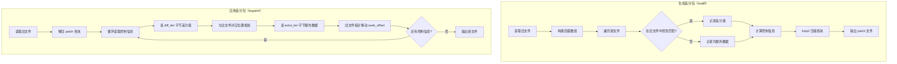

# Android 增量更新 - 源码篇

## bsdiff 算法原理

### 一句话总结

bsdiff 的核心思想是：**找出新旧文件的相似部分，只记录差异**。它使用后缀数组快速找到旧文件中与新文件相似的片段，然后只保存两者的差值和新增的数据。

### 设计哲学

为什么 bsdiff 生成的差分包这么小？因为它利用了一个关键洞察：

> **程序的新旧版本之间，大部分二进制内容是相同或相似的。**

即使代码位置变了，编译出来的二进制数据也只是"搬了个家"，内容基本不变。bsdiff 就是找出这些"搬家"的部分，然后说："把旧文件的第 100-200 字节复制过来，加上这些修正值。"

### 核心数据结构

bsdiff 的差分包由三部分组成：

```
┌─────────────────────────────────────────────────────────────┐
│                       Patch 文件结构                         │
├─────────────────────────────────────────────────────────────┤
│  Header（32字节）                                            │
│  ├── Magic: "BSDIFF40"                                      │
│  ├── ctrl_block_size: 控制块压缩后大小                       │
│  ├── diff_block_size: 差分块压缩后大小                       │
│  └── new_file_size: 新文件大小                               │
├─────────────────────────────────────────────────────────────┤
│  Control Block（控制块，bzip2 压缩）                         │
│  ├── (diff_len, extra_len, seek_offset)                     │
│  ├── (diff_len, extra_len, seek_offset)                     │
│  └── ...                                                    │
├─────────────────────────────────────────────────────────────┤
│  Diff Block（差分块，bzip2 压缩）                            │
│  └── 差分数据：new[i] - old[j] 的值                         │
├─────────────────────────────────────────────────────────────┤
│  Extra Block（额外块，bzip2 压缩）                           │
│  └── 新增数据：旧文件中没有的内容                            │
└─────────────────────────────────────────────────────────────┘
```

**三元组 (diff_len, extra_len, seek_offset) 的含义**：

| 字段 | 含义 | 例子 |
|------|------|------|
| diff_len | 从差分块读取多少字节，与旧文件对应位置相加 | 100 表示读 100 字节差分值 |
| extra_len | 从额外块读取多少字节，直接追加 | 20 表示追加 20 字节新数据 |
| seek_offset | 旧文件指针移动多少 | -50 表示往回跳 50 字节 |

### 核心流程



## 后缀数组：bsdiff 的秘密武器

### 为什么需要后缀数组？

bsdiff 需要解决一个问题：**如何快速在旧文件中找到与新文件某段内容最相似的位置？**

暴力搜索太慢了。想象旧文件有 100MB，新文件有 100MB，每个位置都要比较，那就是 O(n²) 的复杂度，根本跑不动。

后缀数组可以把这个问题变成 O(n log n)。

### 什么是后缀数组？

**后缀**：字符串从某个位置开始到结尾的子串。

```
字符串: "banana"
后缀:
  位置 0: "banana"
  位置 1: "anana"
  位置 2: "nana"
  位置 3: "ana"
  位置 4: "na"
  位置 5: "a"
```

**后缀数组**：把所有后缀按字典序排序后，记录它们原来的起始位置。

```
排序后:
  "a"      → 原位置 5
  "ana"    → 原位置 3
  "anana"  → 原位置 1
  "banana" → 原位置 0
  "na"     → 原位置 4
  "nana"   → 原位置 2

后缀数组 SA = [5, 3, 1, 0, 4, 2]
```

### 后缀数组如何帮助 bsdiff？

有了后缀数组，bsdiff 可以用**二分查找**快速找到旧文件中与新文件某段最匹配的位置。

```
新文件位置 i 的内容是 "ana..."
用二分查找在旧文件的后缀数组中搜索 "ana"
找到位置 3 和位置 1 都以 "ana" 开头
选择匹配最长的那个
```

这样，查找复杂度从 O(n) 降到 O(log n)。

## bsdiff 源码分析

### 核心源码（简化版）

```c
/**
 * bsdiff 核心算法
 * 
 * 设计亮点：
 * 1. 使用后缀数组实现 O(n log n) 的相似度搜索
 * 2. 差分值 + 额外数据的分离存储，便于压缩
 * 3. 控制信息记录跳转偏移，支持非连续匹配
 */
int bsdiff(u_char *old, off_t oldsize, u_char *new, off_t newsize, FILE *pf) {
    off_t *I, *V;  // I: 后缀数组，V: 辅助数组
    
    // 1. 为旧文件构建后缀数组（最耗时的步骤）
    // 使用 qsufsort 算法，时间复杂度 O(n log n)
    I = malloc((oldsize + 1) * sizeof(off_t));
    V = malloc((oldsize + 1) * sizeof(off_t));
    qsufsort(I, V, old, oldsize);
    free(V);
    
    // 2. 遍历新文件，为每个位置找最佳匹配
    off_t scan = 0;      // 新文件扫描位置
    off_t pos = 0;       // 旧文件匹配位置
    off_t len = 0;       // 匹配长度
    off_t lastscan = 0;  // 上次扫描位置
    off_t lastpos = 0;   // 上次匹配位置
    off_t lastoffset = 0;// 上次偏移
    
    while (scan < newsize) {
        off_t oldscore = 0;  // 用于优化：跳过已经匹配好的部分
        
        // 3. 在后缀数组中二分查找最长匹配
        // 这是 bsdiff 高效的关键！
        scan += len;
        for (off_t scsc = scan; scan < newsize; scan++) {
            // search 函数使用二分查找
            len = search(I, old, oldsize, new + scan, newsize - scan, 0, oldsize, &pos);
            
            // 如果找到足够长的匹配，跳出循环
            for (; scsc < scan + len; scsc++) {
                if (scsc + lastoffset < oldsize &&
                    old[scsc + lastoffset] == new[scsc])
                    oldscore++;
            }
            if (len == oldscore && len != 0) break;
            if (len > oldscore + 8) break;  // +8 是阈值，避免太短的匹配
            // ... 更多优化逻辑
        }
        
        // 4. 计算控制信息和差分数据
        // 关键设计：分前向扩展和后向扩展，最大化利用相似性
        // ...（此处省略具体计算逻辑）
        
        // 5. 写入控制块、差分块、额外块
        offtout(ctrl[0], buf);  // diff_len
        offtout(ctrl[1], buf);  // extra_len  
        offtout(ctrl[2], buf);  // seek_offset
    }
    
    free(I);
    return 0;
}

/**
 * 二分查找：在后缀数组中找最长匹配
 * 
 * 设计亮点：返回匹配长度的同时，通过 pos 返回匹配位置
 */
static off_t search(off_t *I, u_char *old, off_t oldsize,
                    u_char *new, off_t newsize,
                    off_t st, off_t en, off_t *pos) {
    off_t x, y;
    
    // 二分查找的终止条件
    if (en - st < 2) {
        // 比较 st 和 en 位置的后缀，返回匹配更长的那个
        x = matchlen(old + I[st], oldsize - I[st], new, newsize);
        y = matchlen(old + I[en], oldsize - I[en], new, newsize);
        
        if (x > y) {
            *pos = I[st];
            return x;
        } else {
            *pos = I[en];
            return y;
        }
    }
    
    // 二分查找
    x = st + (en - st) / 2;
    if (memcmp(old + I[x], new, MIN(oldsize - I[x], newsize)) < 0) {
        return search(I, old, oldsize, new, newsize, x, en, pos);
    } else {
        return search(I, old, oldsize, new, newsize, st, x, pos);
    }
}
```

### 设计亮点

1. **后缀数组 + 二分查找**
   - 把 O(n²) 的暴力搜索优化到 O(n log n)
   - 空间换时间，后缀数组需要 O(n) 额外空间

2. **差分值而非绝对值**
   - 存储 `new[i] - old[j]` 而非 `new[i]`
   - 差分值大多为 0 或很小的数，压缩效果更好

3. **三元组控制结构**
   - 支持非连续匹配，灵活处理代码移动的情况
   - seek_offset 可以是负数，支持回跳

4. **bzip2 分块压缩**
   - 控制块、差分块、额外块分别压缩
   - 差分块压缩率最高（大量 0 值）

## bspatch 源码分析

### 核心源码（简化版）

```c
/**
 * bspatch 合并算法
 * 
 * 设计亮点：
 * 1. 流式处理，内存占用可控
 * 2. 严格按照控制信息执行，确保确定性
 */
int bspatch(u_char *old, off_t oldsize, u_char *new, off_t *newsize, FILE *pf) {
    // 1. 读取并解压三个数据块
    // cpf: 控制块流，dpf: 差分块流，epf: 额外块流
    // （实际实现使用 bz2 解压）
    
    off_t oldpos = 0;  // 旧文件读取位置
    off_t newpos = 0;  // 新文件写入位置
    
    // 2. 循环读取控制信息并执行
    while (newpos < *newsize) {
        off_t ctrl[3];
        
        // 读取三元组
        ctrl[0] = offtin(buf);  // diff_len
        ctrl[1] = offtin(buf);  // extra_len
        ctrl[2] = offtin(buf);  // seek_offset
        
        // 3. 处理差分数据
        // 从差分块读取 diff_len 字节，与旧文件对应位置相加
        for (off_t i = 0; i < ctrl[0]; i++) {
            // 核心：new[newpos] = old[oldpos] + diff[i]
            // 这就是为什么差分块能高效压缩——大部分 diff 值是 0
            new[newpos + i] = old[oldpos + i] + dpf_read_byte();
        }
        newpos += ctrl[0];
        oldpos += ctrl[0];
        
        // 4. 处理额外数据
        // 从额外块直接读取 extra_len 字节，追加到新文件
        for (off_t i = 0; i < ctrl[1]; i++) {
            new[newpos + i] = epf_read_byte();
        }
        newpos += ctrl[1];
        
        // 5. 移动旧文件指针
        // seek_offset 可以是负数，实现回跳
        oldpos += ctrl[2];
    }
    
    return 0;
}
```

### 执行过程示例

假设有这样一个简单的场景：

```
旧文件: ABCDEFGH (8 字节)
新文件: ABXXEFYZ (8 字节)

分析:
- AB 相同 → 差分值为 0
- CD 变成 XX → 需要记录差分
- EF 相同 → 差分值为 0
- GH 变成 YZ → 需要记录差分

控制信息可能是:
(2, 0, 0)  → 复制 2 字节，差分值 [0,0]，无额外数据，不跳转
(2, 0, 0)  → 复制 2 字节，差分值 ['X'-'C','X'-'D']，无额外数据，不跳转
...
```

## Native 层集成

### JNI 封装

```c
// bspatch_jni.c

#include <jni.h>
#include <string.h>
#include <stdlib.h>
#include <stdio.h>

// 引入 bspatch 实现
extern int bspatch(const char *oldfile, const char *newfile, const char *patchfile);

/**
 * JNI 接口：合并差分包
 * 
 * @param oldPath 旧 APK 路径
 * @param newPath 新 APK 输出路径
 * @param patchPath 差分包路径
 * @return 0 成功，非 0 失败
 */
JNIEXPORT jint JNICALL
Java_com_example_update_PatchUtils_patch(
    JNIEnv *env,
    jclass clazz,
    jstring oldPath,
    jstring newPath,
    jstring patchPath
) {
    const char *old = (*env)->GetStringUTFChars(env, oldPath, NULL);
    const char *new = (*env)->GetStringUTFChars(env, newPath, NULL);
    const char *patch = (*env)->GetStringUTFChars(env, patchPath, NULL);
    
    // 调用 bspatch 核心函数
    int result = bspatch(old, new, patch);
    
    (*env)->ReleaseStringUTFChars(env, oldPath, old);
    (*env)->ReleaseStringUTFChars(env, newPath, new);
    (*env)->ReleaseStringUTFChars(env, patchPath, patch);
    
    return result;
}
```

### Kotlin 封装

```kotlin
/**
 * Native 层 bspatch 封装
 * 
 * 设计要点：
 * 1. 使用 object 单例，避免重复加载 so
 * 2. 提供同步和异步两种接口
 */
object PatchUtils {
    
    init {
        System.loadLibrary("bspatch")
    }
    
    /**
     * 合并差分包（同步）
     * 
     * @return 0 表示成功，其他值表示失败
     * 错误码说明：
     * - 1: 无法打开旧文件
     * - 2: 无法打开差分包
     * - 3: 差分包格式错误
     * - 4: 内存分配失败
     * - 5: 解压失败
     */
    external fun patch(oldPath: String, newPath: String, patchPath: String): Int
    
    /**
     * 合并差分包（异步）
     */
    suspend fun patchAsync(
        oldPath: String,
        newPath: String,
        patchPath: String
    ): Result<Unit> = withContext(Dispatchers.IO) {
        runCatching {
            val result = patch(oldPath, newPath, patchPath)
            if (result != 0) {
                throw PatchException("Patch failed with code: $result")
            }
        }
    }
    
    class PatchException(message: String) : Exception(message)
}
```

## 性能分析

### 时间复杂度

| 阶段 | 时间复杂度 | 说明 |
|------|-----------|------|
| bsdiff 构建后缀数组 | O(n log n) | qsufsort 算法 |
| bsdiff 搜索匹配 | O(m log n) | m 是新文件大小，n 是旧文件大小 |
| bspatch 合并 | O(m) | 线性遍历新文件 |

### 空间复杂度

| 阶段 | 空间复杂度 | 说明 |
|------|-----------|------|
| bsdiff | O(n) | 后缀数组需要 n × sizeof(off_t) |
| bspatch | O(n + m) | 需要加载旧文件和分配新文件空间 |

### 实测数据

以一个 50MB 的 APK 为例：

| 操作 | 耗时 | 内存峰值 |
|------|------|---------|
| bsdiff 生成差分包 | 30-60 秒 | ~200MB |
| bspatch 合并 | 5-15 秒 | ~150MB |

**优化建议**：
- bsdiff 在服务端执行，不受限制
- bspatch 在客户端执行，考虑在独立进程中执行，避免 OOM

## 延伸思考

### 如果让你设计一个差分算法，你会怎么做？

**思考方向**：

1. **文件类型感知**
   - 针对 APK 的结构特点优化（ZIP 格式、DEX 格式）
   - Google 的 Archive Patcher 就是这么做的

2. **分块处理**
   - 不一定要整个文件比较，可以分块
   - 减少内存占用，支持并行处理

3. **增量传输协议**
   - 客户端计算自己有什么，服务端只发缺失的
   - rsync 的思路

### 为什么 Google Play 的增量更新效果更好？

Google 的 **Archive Patcher** 比 bsdiff 更优，因为它：

1. **理解 APK 结构**：知道 APK 是 ZIP，DEX 文件有特定格式
2. **重新压缩对齐**：让新旧版本的压缩后数据更相似
3. **智能选择**：根据文件类型选择最佳差分策略

## 源码篇面试题

### 1. bsdiff 算法的核心原理是什么？

**结论**：bsdiff 使用后缀数组在旧文件中快速找到与新文件相似的片段，只记录差异值和新增数据。

**原理**：
1. 为旧文件构建后缀数组，实现 O(log n) 的相似度搜索
2. 遍历新文件，为每个位置找到旧文件中最长匹配
3. 生成三元组控制信息：diff_len（差分长度）、extra_len（新增长度）、seek_offset（跳转偏移）
4. 差分值 = new[i] - old[j]，大多为 0，压缩效果好

### 2. 为什么 bsdiff 生成的差分包很小？

**结论**：因为利用了程序新旧版本二进制内容的高度相似性。

**原因**：
1. 大部分代码不变，对应的差分值为 0
2. 即使代码移动位置，二进制内容也相似，差分值很小
3. 小数值更容易被 bzip2 压缩

**举例**：两个版本 90% 的代码相同，那 90% 的差分值都是 0。bzip2 对大量 0 值的压缩率极高。

### 3. 后缀数组在 bsdiff 中的作用是什么？

**结论**：后缀数组将查找最长匹配的复杂度从 O(n) 降到 O(log n)。

**原理**：
- 后缀数组是字符串所有后缀排序后的位置数组
- 排序后相似的内容聚集在一起
- 用二分查找可以快速定位最相似的位置

**类比**：就像字典按字母排序，找单词比翻遍整本书快得多。

### 4. bspatch 的合并过程是怎样的？

**结论**：按控制信息循环执行：读差分值与旧数据相加、读额外数据直接追加、移动旧文件指针。

**步骤**：
1. 读取控制三元组 (diff_len, extra_len, seek_offset)
2. 从差分块读 diff_len 字节，与旧文件对应位置相加，写入新文件
3. 从额外块读 extra_len 字节，直接追加到新文件
4. 旧文件指针移动 seek_offset（可为负）
5. 重复直到新文件写完

### 5. bsdiff 的时间和空间复杂度是多少？

**结论**：

| 算法 | 时间复杂度 | 空间复杂度 |
|------|-----------|-----------|
| bsdiff | O(n log n + m log n) | O(n) |
| bspatch | O(m) | O(n + m) |

其中 n 是旧文件大小，m 是新文件大小。

**瓶颈**：
- bsdiff 的瓶颈是构建后缀数组，需要 O(n log n)
- bspatch 的瓶颈是内存，需要同时加载旧文件和分配新文件空间

---
_本文档将持续更新，添加更多相关内容_
